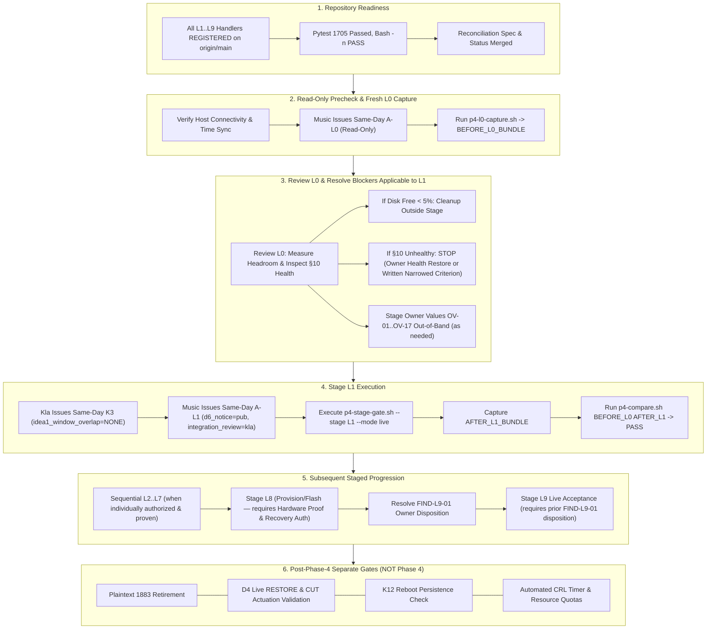

# IDEA3 PR11 Phase 4 — Live Readiness / Blocker Reconciliation

Date: 2026-09-21
Owner: Music (Kla reviewing)
Task: AEGIS IDEA3 — PR11 Phase 4 Live Readiness / Blocker Reconciliation
Branch: `docs/idea3-pr11-phase4-live-readiness`
Expected Base: `3662faa38433877bbcec82b7743d61ecfa399986` (Merge PR #167)
Current HEAD: `3662faa38433877bbcec82b7743d61ecfa399986`
Mode: REPOSITORY-ONLY — NO LIVE EXECUTION
Production Mutation: STRICTLY FORBIDDEN / NONE OBSERVED

> [!IMPORTANT]
> **Repository reconciliation only.** This document establishes the exact current
> Phase 4 live-readiness truth after PR #167 merged on `origin/main`. It executes
> no stage, modifies no host service, generates no credentials, accesses no live
> Core or broker, actuates no relay, and contacts no live package manager.
> `PHASE4_RUNTIME_COMPLETE = NO` and `PHASE4_LIVE_READINESS = NOT READY`.
> `FIRST_SAFE_NEXT_ACTION = human review of PR #168, then owner-issued same-day A-L0 and fresh read-only L0 capture`.

---

## 1. Executive Summary & Core Answers

### 1.1 Which repository prerequisites are fully closed?
1. **L1..L9 Stage Handlers Registered**: All 9 Phase 4 stage handlers (`L1`, `L2`,
   `L3`, `L4`, `L5`, `L6a`, `L6b`, `L7`, `L8`, `L9`) are implemented, reviewed,
   merged on `origin/main`, and registered. `p4_stage_handler_status` reports
   `REGISTERED` for every stage.
2. **Phase 4 Harness Framework**: G-15 capture (`p4-l0-capture.sh`), compare
   (`p4-compare.sh`), stage gating (`p4-stage-gate.sh`), shared constants
   (`p4-lib.sh`), and the synthetic unregistered-handler guard test fixture
   (`AEGIS_P4_HANDLER_DIR`) are merged and tested.
3. **Phase 2 Runtime Dependency**: `PHASE2_RUNTIME_COMPLETE = YES` (closed in PR #146,
   commit `232759cf4e44094c61f15e3d041c09eb1478b42c`; T3 wrong-CA and T4 revoked-certificate
   gates passed on live owner evidence; final receipt `2026-09-17_011132_music_idea3-pr11-phase2-runtime-closeout.md`).
4. **Phase 3 Repository Preparation**: Merged via PR #149 (`42b13625`); systemd 261
   compatibility correction, `LoadCredential=` config for `k_c2d`, `k_d2c`,
   `mqtt-core.pass`, `admin.pin`, and `systemd_credentials.py` are complete.
5. **D4 Core-Local RESTORE Repository Implementation**: Merged via PR #138 (`3fd8d4d1`);
   CLI, cryptographic format verification, audit fail-closed logic, and test suite
   are complete (`D4_REPOSITORY_IMPLEMENTATION = COMPLETE`, `D4_LOCAL_VERIFICATION = PASS`).
6. **Repository Verification Suite**: Full IDEA3 `pytest` suite passes with
   **1705 passed, 6 skipped** (including 725 Phase 4 tests). Shell scripts pass `bash -n`.

### 1.2 Which live prerequisites remain open?
1. **Phase 3 Live Runtime Completion**: `PHASE3_RUNTIME_COMPLETE = NO`. PR #149 was
   repository preparation only; Core service is not installed or started, secrets
   in `/etc/aegis-idea3/credentials/` are not provisioned, and live G12/G13 delivery
   is unproven.
2. **Phase 4 Live Execution**: `L0` through `L9` have **NOT RUN** on any live host.
   `L1..L9 live = NOT RUN`. All handlers are implemented against a fixture backend;
   selecting live mode fails closed.
3. **Stage Authorizations**: Every live stage requires an explicit same-day
   authorization record (`AEGIS_P4_AUTHORIZATION_V1`). Currently, A-L0 through A-L9
   are **NOT AUTHORIZED**.
4. **Fresh K3 Confirmation**: Every mutating stage requires a fresh, same-day,
   window-specific non-overlap confirmation (`AEGIS_P4_K3_CONFIRMATION_V1`) from Kla
   (`kraveerachat`). Currently, no active K3 confirmation exists.
5. **D4 Live Verification**: `D4_LIVE_VERIFIED = NO`. Core-local RESTORE has never
   been executed or verified on a live host.
6. **Physical ESP32 Availability & Connection**: Physical presence, USB serial connection
   (`/dev/ttyUSB0` or similar), and power status on Core host are unverified for Phase 4.
7. **Post-Phase-4 Operational Gates**: Plaintext 1883 retirement, CUT/RESTORE physical
   relay actuation, CRL automated renewal scheduling, resource quotas, and K12 reboot
   persistence are post-Phase-4 gates and remain open.

### 1.3 Which evidence is stale and requires fresh owner-run proof?
1. **Host Disk Headroom**:
   - `DISK_PRIOR_EVIDENCE = ~94–97% used` (53G/59G used, 3.8G free from 2026-09-17 owner preflight).
   - Under OD-L1-07, L1 requires >= 5% free headroom before package installation.
   - `DISK_CURRENT_STATE = NEEDS_FRESH_L0_OR_OWNER_READ_ONLY_PROOF`.
   - `DISK_CLEANUP_REQUIRED = CONDITIONAL_ON_FRESH_PROOF`. Calling old readings "current" is forbidden.
2. **IDEA2 §10 Preservation**:
   - `IDEA2_LAST_PROVEN = unhealthy/blocking` (last proven evidence from 2026-09-17 recorded
     `PROCESS_ACTIVE != TUNNEL_HEALTHY != IDEA2_RUNTIME_HEALTHY`; `aegis-detection-tunnel.service`
     flapping with NRestarts > 1450; Detection Engine heartbeat failing).
   - `IDEA2_S10_PRESERVATION = BLOCKED_BY_LAST_PROVEN_EVIDENCE`.
   - `IDEA2_CURRENT_STATE = NEEDS_FRESH_OWNER_RUN_EVIDENCE`.
   - `IDEA2_S10_IF_FRESH_L0_FAILS = STOP until either: (1) IDEA2 owner restores required health; OR (2) written IDEA2-owner-accepted narrowed criterion exists for that stage`.
   - Do not create or assume a narrowed criterion.
   - No IDEA2 mutation is permitted before A-L0.
3. **Host Baseline Configuration**: Network interfaces (`enp62s0`), routing, iptables/nftables
   ruleset, and listening sockets (1883 active, 8883 absent) were characterized on 2026-09-17.
   Requires a fresh read-only L0 baseline capture before any mutation.
4. **K12 Reboot Persistence**: Unproven since PR10 (`K12 = NOT_PROVEN`).

### 1.4 Which items require explicit owner/integration decisions?
1. **FIND-L9-01 Disposition**:
   - `BLOCKS_DIRECTLY = LIVE_L9_ACCEPTANCE`.
   - `FIND_L9_01_BLOCKS_L1 = NO` (does NOT block L1-L7).
   - `firmware/src/main.cpp` implements heartbeat replay via a 20-slot `msg_id` ring, while
     Protocol v1 design §6.1 specifies strictly increasing `issued_at`.
   - Classified as `OWNER_DECISION_REQUIRED` before live L9 acceptance.
   - If the owner chooses to fix firmware rather than reconcile the design, then a new firmware image
     may require revisiting/reflashing/revalidating L8 before proceeding to L9. That is a conditional
     consequence, not the current direct blocker.
2. **Disk Headroom Remediation**:
   - `DISK_CLEANUP_REQUIRED = CONDITIONAL_ON_FRESH_PROOF`.
   - Owner decision and cleanup outside the stage if fresh L0 proves free headroom is < 5%.
3. **Owner-Supplied Runtime Values (OV-01..OV-17)**: Real values for AP SSID, PSK,
   AP subnet, Core AP IP, DHCP pool, broker TLS hostname/SAN, ESP32 device ID/MAC,
   serial port path, Mosquitto passwords, admin PIN, HMAC keys `K_C2D`/`K_D2C`,
   `restore.credential`, and trusted upstream NTP server.
4. **Stage Authorizations & Reviews**:
   - A-L0 issuance by Music (read-only baseline capture);
   - Fresh K3 confirmation by Kla for mutating window (after blockers cleared);
   - A-L1 issuance by Music with D6 notice to Pub;
   - A-L2 issuance with integration review by Kla;
   - A-L8 issuance with pre-verified recovery authorization.

### 1.5 What exact blockers prevent the first live stage?
- **To run read-only Stage L0**:
  1. A-L0 same-day authorization from Music does not exist (`A-L0 = NOT_AUTHORIZED`).
  2. Owner read-only session initiation on the physical Core host is pending.
  *(Note: A-L0 is strictly read-only; no disk cleanup or IDEA2 mutation is required before A-L0).*
- **To run Stage L1 (first mutating stage)**:
  1. Fresh L0 baseline bundle has not been captured and reviewed.
  2. **Disk Headroom Check**: If fresh L0 proves root disk free space < 5%, host disk cleanup
     outside the stage is required before L1 (`DISK_CLEANUP_REQUIRED = CONDITIONAL_ON_FRESH_PROOF`).
  3. **IDEA2 §10 Preservation Blocker**: If fresh L0 proves the tunnel remains unhealthy,
      `IDEA2_S10_IF_FRESH_L0_FAILS = STOP until either: (1) IDEA2 owner restores required health; OR (2) written IDEA2-owner-accepted narrowed criterion exists for that stage`
      (`PRESERVATION_S10 = FAIL`, `COMPARE_RESULT = FAIL`). Do not create or assume a narrowed criterion.
  4. Same-day A-L1 authorization is missing (`A-L1 = NOT_AUTHORIZED`).
  5. Same-day K3 non-overlap confirmation from Kla is missing (`FRESH_K3_REQUIRED = YES`).
  6. D6 co-residence notice to Pub is missing.
  7. Production mutation authorization is not granted.

### 1.6 What is the correct safe sequence from current state to A-L0 and then A-L1?
```text
A-L0
  ↓
fresh L0 read-only capture (owner runs p4-l0-capture.sh -> BEFORE_L0_BUNDLE)
  ↓
review fresh L0 (inspect disk headroom, IDEA2 tunnel/process health, listeners, routes)
  ↓
resolve blockers applicable to L1:
  - if disk free < 5%, cleanup outside stage and obtain fresh evidence
  - if IDEA2 §10 still cannot pass, STOP until either:
      * IDEA2 owner restores required health; OR
      * written IDEA2-owner-accepted narrowed criterion exists for that stage
  - stage owner values (OV-01..OV-17) out-of-band as needed
  ↓
fresh K3 confirmation for L1 (Kla verifies no IDEA1 overlap -> issues same-day K3 for L1)
  ↓
A-L1 authorization (Music issues same-day A-L1 with d6_notice=pub, integration_review=kla)
  ↓
live L1 execution (owner runs p4-stage-gate.sh --stage L1 --mode live --authorization A-L1 --k3 K3)
  ↓
preservation verification (capture AFTER_L1_BUNDLE, run p4-compare.sh BEFORE_L0 AFTER_L1 -> PASS)
  ↓
sequential L2..L7 when individually authorized/proven
  ↓
before L9 acceptance, FIND-L9-01 must have owner disposition (if owner chooses a firmware fix, L8 may conditionally require reflash/revalidation; not a direct blocker)
```

---

## 2. Critical Reconciliation Details

### A. All L1-L9 Handlers
Direct verification against current `origin/main` (`3662faa3`):
```bash
$ bash -c 'cd IDEA3-AEGIS_Lockdown/deploy/pr11-phase4 && source ./p4-lib.sh && for s in L1 L2 L3 L4 L5 L6a L6b L7 L8 L9; do echo "$s: $(p4_stage_handler_status $s)"; done'
L1: REGISTERED
L2: REGISTERED
L3: REGISTERED
L4: REGISTERED
L5: REGISTERED
L6a: REGISTERED
L6b: REGISTERED
L7: REGISTERED
L8: REGISTERED
L9: REGISTERED
```
Every stage handler directory `stages/L1` through `stages/L9` contains valid `apply.sh`,
`verify.sh`, `rollback.sh`, `allow-keys.txt`, and `allow-listeners.txt`.
All stage handlers fail closed if executed with `--mode live` on unapproved backends.

### B. Stale Canonical Status Reconciliation
Canonical `idea3-status.md` contains historical task records written at earlier checkpoints.
These records must be preserved as historical context, but their claims are superseded as follows:
- **PR #166 Merge State**: Section for Stage L9 (line 6044) recorded `PR = #166 (Draft)`
  and `L9_PR_MERGED = NO`.
  *Superseded by*: PR #166 merged into `origin/main` at commit `b4670eb31a30e1e71075c8e6421134e5d9fae8e5`.
- **Historical L1 Handler Status**: Section for Stage L9 (line 6056) recorded
  `L1_HANDLER = NOT REGISTERED`.
  *Superseded by*: PR #167 implemented and registered the Stage L1 handler.
- **PR #167 Merge State**: Section for Stage L1 (line 6222) recorded `PR = #167 (Draft)`.
  *Superseded by*: PR #167 merged into `origin/main` at commit `3662faa38433877bbcec82b7743d61ecfa399986`.
- **Handler Registration Matrix**: Superseded from `L2..L9 REGISTERED` to `L1..L9 REGISTERED`.
- **Test Counts**:
  - Full IDEA3 suite: 1705 passed, 6 skipped.
  - Phase 4 test suite: 725 passed.
  - Phase 4 harness: 161 passed.
  - Stage L1 focused suite: 28 passed.

### C. Phase 3 Reconciled
- `PHASE3_REPOSITORY_PR = MERGED` (PR #149 merged at `42b13625`).
- `PHASE3_RUNTIME_COMPLETE = NO`.
Merging PR #149 prepared the systemd unit and credentials reader in the repository.
It did not install the service, did not start the service, and did not provision secrets
on the live Core host. Live G12/G13 credential delivery remains unproven.

### D. D4 Core-Local RESTORE
- `D4_REPOSITORY_IMPLEMENTATION = COMPLETE` (merged via PR #138).
- `D4_LOCAL_VERIFICATION = PASS` (`test_local_restore.py`).
- `D4_LIVE_VERIFIED = NO`.
Core-local RESTORE has never run live. Web, Telegram, and automatic RESTORE are unavailable.
Under OD-L7-08, a pre-provisioned, cryptographically valid `restore.credential` is required
before Stage L7 can start the Core service. RESTORE actuation is strictly forbidden during Phase 4.

### E. IDEA2 §10 Preservation
- Last authoritative evidence (2026-09-17) proved:
  `PROCESS_ACTIVE != TUNNEL_HEALTHY != IDEA2_RUNTIME_HEALTHY`.
  The tunnel unit was flapping (`NRestarts > 1450`) and Detection Engine heartbeat failed.
- Status: `IDEA2_S10_PRESERVATION = BLOCKED_BY_LAST_PROVEN_EVIDENCE`.
- `LAST_PROVEN = unhealthy/blocking`.
- `CURRENT_LIVE_STATE = NEEDS_FRESH_OWNER_RUN_EVIDENCE`.
- In `p4-compare.sh`, `IDEA2_NARROWED_CRITERION = NOT_ACCEPTED`. A baseline unhealthy tunnel
  yields `PRESERVATION_S10 = FAIL` and `COMPARE_RESULT = FAIL`.
- Resolution path:
  ```text
  IDEA2_S10_IF_FRESH_L0_FAILS =
  STOP until either:
  - IDEA2 owner restores required health; OR
  - written IDEA2-owner-accepted narrowed criterion exists for that stage
  ```
  Do not create or assume a narrowed criterion.
- No agent is authorized to diagnose, repair, touch, or modify IDEA2 files or services.

### F. K3 Non-Overlap Governance
- Script `p4-stage-gate.sh` enforces:
  - Magic header `AEGIS_P4_K3_CONFIRMATION_V1`;
  - Confirmed by `kraveerachat`;
  - Same calendar day in `Asia/Bangkok`;
  - Exact matching stage name;
  - `idea1_window_overlap = NONE`.
- Prior K3 confirmations were single-window and are expired.
- Status: `FRESH_K3_REQUIRED = YES` for every mutating stage (`L1`..`L9`).

### G. Disk Headroom
- `DISK_PRIOR_EVIDENCE = ~94–97% used` (53G/59G, 3.8G available from 2026-09-17 owner preflight).
- Requirement: OD-L1-07 requires >= 5% free headroom (usage < 95%) before package installation.
- `DISK_CURRENT_STATE = NEEDS_FRESH_L0_OR_OWNER_READ_ONLY_PROOF`.
- `DISK_CLEANUP_REQUIRED = CONDITIONAL_ON_FRESH_PROOF`.
- Calling the old reading "current" is forbidden. Fresh read-only L0 capture measures actual live headroom; if free space is < 5%, host disk cleanup is required outside the stage before L1.

### H. FIND-L9-01 (Firmware Replay Window)
- Description: `firmware/src/main.cpp` `handleHeartbeat` implements a 20-slot `msg_id` ring
  for replay rejection, while Protocol v1 design §6.1 specifies strictly increasing `issued_at`.
- Status: `FIND-L9-01 = OWNER_DECISION_REQUIRED` before live L9 acceptance.
- Direct Blocker: `BLOCKS_DIRECTLY = LIVE_L9_ACCEPTANCE`.
- Scope Clarification: `FIND_L9_01_BLOCKS_L1 = NO` (does NOT block L1-L7). FIND-L9-01 does NOT directly block live L8. Live L8 flashes the candidate
  firmware image. If the owner chooses to amend firmware to implement strictly increasing
  `issued_at`, that choice would require a new firmware build, which conditionally necessitates
  revisiting/reflashing/revalidating L8 before proceeding to L9. If the owner accepts the 20-slot
  ring as equivalent in design, no firmware change or reflash is needed.

### I. Live Authorization Matrix
Every stage requires a dedicated same-day authorization record (`AEGIS_P4_AUTHORIZATION_V1`)
issued by `music` with exact matching stage and valid reference.
- Stage L0: Read-only preflight. Does NOT require K3.
- Stage L1: Mutating. Requires fresh K3 + `d6_notice=pub`.
- Stage L2: Mutating. Requires fresh K3 + `integration_review=kla`.
- Stages L3–L6b: Mutating. Require fresh K3.
- Stage L7: Mutating. Requires fresh K3 + `d6_notice=pub`.
- Stage L8: Mutating. Requires fresh K3 + `recovery_authorization=<valid-ref>`.
- Stage L9: Mutating. Requires fresh K3.
- Current status: **ALL STAGES (A-L0..A-L9) = NOT AUTHORIZED**.

---

## 3. Durable Phase 4 Readiness Matrix

| Item | Category | Current State | Last Proven Evidence | Evidence Date / Commit | Fresh Proof Required | Owner | Blocks Which Stage | Next Safe Action |
|---|---|---|---|---|---|---|---|---|
| **L1 Handler** | Repository Implementation | `CLOSED_REPOSITORY` | `p4_stage_handler_status L1` = `REGISTERED`; 28 passed in focused suite | 2026-09-21 (`3662faa3`, PR #167) | NO | music | None | Handler closed |
| **L2 Handler** | Repository Implementation | `CLOSED_REPOSITORY` | `p4_stage_handler_status L2` = `REGISTERED` | 2026-09-20 (PR #159) | NO | music | None | Handler closed |
| **L3 Handler** | Repository Implementation | `CLOSED_REPOSITORY` | `p4_stage_handler_status L3` = `REGISTERED` | 2026-09-20 (PR #160) | NO | music | None | Handler closed |
| **L4 Handler** | Repository Implementation | `CLOSED_REPOSITORY` | `p4_stage_handler_status L4` = `REGISTERED` | 2026-09-20 (PR #161) | NO | music | None | Handler closed |
| **L5 Handler** | Repository Implementation | `CLOSED_REPOSITORY` | `p4_stage_handler_status L5` = `REGISTERED` | 2026-09-20 (PR #162) | NO | music | None | Handler closed |
| **L6a Handler** | Repository Implementation | `CLOSED_REPOSITORY` | `p4_stage_handler_status L6a` = `REGISTERED` | 2026-09-20 (PR #163) | NO | music | None | Handler closed |
| **L6b Handler** | Repository Implementation | `CLOSED_REPOSITORY` | `p4_stage_handler_status L6b` = `REGISTERED` | 2026-09-20 (PR #164) | NO | music | None | Handler closed |
| **L7 Handler** | Repository Implementation | `CLOSED_REPOSITORY` | `p4_stage_handler_status L7` = `REGISTERED` | 2026-09-21 (PR #165) | NO | music | None | Handler closed |
| **L8 Handler** | Repository Implementation | `CLOSED_REPOSITORY` | `p4_stage_handler_status L8` = `REGISTERED` | 2026-09-21 (`b4670eb3`, PR #166) | NO | music | None | Handler closed |
| **L9 Handler** | Repository Implementation | `CLOSED_REPOSITORY` | `p4_stage_handler_status L9` = `REGISTERED`; 154 passed in focused suite | 2026-09-21 (`b4670eb3`, PR #166) | NO | music | None | Handler closed |
| **Phase 2 Runtime** | Runtime Prerequisite | `CLOSED_REPOSITORY` | `PHASE2_RUNTIME_COMPLETE = YES`; T3/T4 live pass | 2026-09-17 (`232759cf`, PR #146) | NO | music | None | Preserve Phase 2 PKI & CRL |
| **Phase 3 Repo PR** | Repository Implementation | `CLOSED_REPOSITORY` | PR #149 merged (`42b13625`); systemd 261 & credentials support | 2026-09-18 (PR #149) | NO | music | None | Code merged on main |
| **Phase 3 Live Runtime** | Runtime Prerequisite | `OPEN` | `PHASE3_RUNTIME_COMPLETE = NO`; Core service uninstalled; G12/G13 unproven | 2026-09-18 (PR #149) | YES | music | Post-L7 / Phase 3 closeout | Handled via Stage L7 execution |
| **D4 Repo Implementation** | Recovery Architecture | `CLOSED_REPOSITORY` | PR #138 merged (`3fd8d4d1`); D4 CLI implemented | 2026-09-16 (PR #138) | NO | music | None | Code merged on main |
| **D4 Local Verification** | Verification | `CLOSED_REPOSITORY` | `test_local_restore.py` PASS; audit fail-closed verified | 2026-09-16 (PR #138) | NO | music | None | Maintained in pytest |
| **D4 Live Verification** | Recovery Architecture | `MERGED_BUT_LIVE_UNPROVEN` | `D4_LIVE_VERIFIED = NO`; never executed live | 2026-09-16 (PR #138) | YES | music | Post-Phase-4 recovery gate | Await post-deployment verification |
| **K3 Non-Overlap** | Governance / Safety | `OPEN` | Prior K3 confirmations expired | 2026-09-17 | YES | kla | Live L1..L9 (all mutating stages) | Kla issues same-day K3 for each window |
| **IDEA2 §10 Preservation** | Cross-IDEA Safety | `BLOCKED` | `IDEA2_TUNNEL_HEALTHY = NO` (NRestarts > 1450); `COMPARE_RESULT=FAIL` | 2026-09-17 (PR #152) | YES | pub | Live L1..L9 compare gate | Fresh owner evidence via L0; if failing, STOP until IDEA2 owner restores required health OR written IDEA2-owner-accepted narrowed criterion exists |
| **Disk Headroom** | Host Resource | `STALE_NEEDS_FRESH_PROOF` | `DISK_PRIOR_EVIDENCE = ~94–97% used; DISK_CLEANUP_REQUIRED = CONDITIONAL_ON_FRESH_PROOF` | 2026-09-17 / 2026-09-21 | YES | music / kla | Live L1 (fails closed if < 5%) | Measure via fresh L0; cleanup if free space < 5% |
| **Phase 4 Owner Values** | Configuration / Secrets | `OWNER_DECISION_REQUIRED` | Templates contain `<AEGIS_...>` placeholders | 2026-09-17 (Spec) | YES | music / kla | Live L2..L8 | Owner generates values out-of-band |
| **A-L0 Authorization** | Authorization | `NOT_AUTHORIZED` | No A-L0 record exists | Current (2026-09-21) | YES | music | Live L0 capture | Music issues same-day read-only A-L0 |
| **A-L1..A-L9 Auth** | Authorization | `NOT_AUTHORIZED` | No A-L1..A-L9 records exist | Current (2026-09-21) | YES | music | Live L1..L9 | Issue separately on execution day |
| **Live L0 Baseline** | Live Baseline | `OPEN` | `p4-l0-capture.sh` tested in harness; never run live | Current (2026-09-21) | YES | music | Live L1 | Run after A-L0 is issued |
| **Live L1..L9 Execution** | Live Execution | `BLOCKED` | `L1..L9 live = NOT RUN`; live backend fails closed | Current (2026-09-21) | YES | music | Phase 4 live closeout | Sequential execution after gates pass |
| **FIND-L9-01** | Protocol / Firmware | `OWNER_DECISION_REQUIRED` | Firmware 20-slot ring vs strictly increasing `issued_at` in §6.1 | 2026-09-21 (PR #166) | NO | music | Live L9 acceptance (`BLOCKS_DIRECTLY = LIVE_L9_ACCEPTANCE`) | Owner decision before live L9 acceptance (`FIND_L9_01_BLOCKS_L1 = NO`) |
| **ESP32 Hardware Proof** | Physical Hardware | `OPEN` | Lab fail-secure proven (PR5); live serial connection unproven | 2026-09-11 (PR5) | YES | music | Live L8, L9 | Owner confirms serial & power on Core |
| **L8 Recovery Requirement** | Recovery Architecture | `OWNER_DECISION_REQUIRED` | Recovery auth required in A-L8; backup binary needed | 2026-09-21 (PR #166) | YES | music | Live L8 | Prepare backup image & physical jumper |
| **K12 Reboot Persistence** | Host Persistence | `MERGED_BUT_LIVE_UNPROVEN` | `K12 = NOT_PROVEN` throughout PR10/P1/P2/P3 | 2026-09-12 | YES | kla / music | Post-Phase-4 acceptance gate | Scheduled after full live deployment |
| **Plaintext 1883 Removal** | Broker Hardening | `NOT_APPLICABLE_YET` | Plaintext 1883 intentionally retained in Phase 4 | 2026-09-19 (PR #159) | NO | music / kla | Post-Phase-4 gate | Strictly forbidden in Phase 4 |
| **CUT Actuation** | Physical Safety | `NOT_APPLICABLE_YET` | Lab proven in PR5; forbidden in Phase 4 | 2026-09-11 (PR5) | YES | music | Post-Phase-4 live gate | Strictly forbidden in Phase 4 |
| **RESTORE Actuation** | Physical Safety | `NOT_APPLICABLE_YET` | Local proven in PR #138; forbidden in Phase 4 | 2026-09-16 (PR #138) | YES | music | Post-Phase-4 live gate | Strictly forbidden in Phase 4 |
| **CRL Renewal Scheduling** | PKI Lifecycle | `OPEN` | CRL generation proven; automated timer absent | 2026-09-17 (`232759cf`, PR #146) | YES | music / kla | Post-Phase-4 operational gate | Deploy systemd timer post-deployment |
| **Resource Quotas** | Service Quotas | `OPEN` | Quotas unconfigured (`QUOTAS = none`) | 2026-09-18 (PR #149) | YES | music | Post-Phase-4 operational gate | Characterize under load; add limits |

---

## 4. Safe Execution Order (Future Runbook — DO NOT EXECUTE)

> [!WARNING]
> This runbook is a reference execution specification only.
> **DO NOT EXECUTE.**
> Each step is conditionally gated on the successful, verified completion of all prior steps.



### Step 1: Repository Readiness (CURRENT STATE — CLOSED)
- `L1..L9` stage handlers verified registered on `origin/main` (`3662faa3`).
- 1705 IDEA3 tests pass (including 725 Phase 4 tests).
- Reconciliation documented in PR #168.

### Step 2: Read-Only Precheck & Fresh L0 Capture
1. **Time & Connectivity**: Confirm Core host is reachable and time synchronization is healthy.
2. **Issue A-L0**: Music generates same-day `AEGIS_P4_AUTHORIZATION_V1` record:
   ```text
   AEGIS_P4_AUTHORIZATION_V1
   stage=L0
   date=YYYY-MM-DD
   authorizer=music
   scope=read-only baseline preflight capture
   reference=PR11-L0-PREFLIGHT
   ```
3. **Execute L0**: Owner runs read-only capture:
   ```bash
   bash deploy/pr11-phase4/p4-l0-capture.sh /var/tmp/p4-evidence/before-L0
   ```

### Step 3: Review L0 Results & Resolve Blockers Applicable to L1
1. **Review L0 Evidence**: Establish current live truth:
   - Check `disk.usage_percent`:
     - If free space >= 5%: headroom requirement is satisfied without cleanup.
     - If free space < 5%: perform host root cleanup outside the stage (`DISK_CLEANUP_REQUIRED = CONDITIONAL_ON_FRESH_PROOF`) and recapture baseline.
   - Check `idea2.tunnel.active_state`, restart counts, and heartbeat:
     - If tunnel is healthy: §10 preservation baseline passes.
     - If tunnel remains unhealthy: **STOP IMMEDIATELY**.
       `IDEA2_S10_IF_FRESH_L0_FAILS = STOP until either: (1) IDEA2 owner restores required health; OR (2) written IDEA2-owner-accepted narrowed criterion exists for that stage`.
       Do not create or assume a narrowed criterion.
   - Inspect network listeners (1883 active, 8883 absent) and default route.
2. **Stage Owner Values**: Music prepares stage input files (`ov-*.txt`) containing real
   SSID, PSK, subnets, passwords, and keys, storing them locally with `chmod 0600` as needed for applicable stages.

### Step 4: Fresh K3 & Stage L1 Execution
1. **Issue Fresh K3**: Kla verifies no overlapping IDEA1 production mutation and issues:
   ```text
   AEGIS_P4_K3_CONFIRMATION_V1
   stage=L1
   date=YYYY-MM-DD
   confirmed_by=kraveerachat
   idea1_window_overlap=NONE
   reference=K3-PHASE4-L1
   ```
2. **Issue A-L1**: Music issues same-day authorization:
   ```text
   AEGIS_P4_AUTHORIZATION_V1
   stage=L1
   date=YYYY-MM-DD
   authorizer=music
   scope=package installation chrony
   reference=PR11-L1-CHRONY
   d6_notice=pub
   integration_review=kla
   ```
3. **Execute L1**: Owner runs:
   ```bash
   bash deploy/pr11-phase4/p4-stage-gate.sh --stage L1 --mode live --authorization /path/to/A-L1.txt --k3 /path/to/K3-L1.txt
   ```
4. **Capture & Compare**:
   ```bash
   bash deploy/pr11-phase4/p4-l0-capture.sh /var/tmp/p4-evidence/after-L1
   bash deploy/pr11-phase4/p4-compare.sh /var/tmp/p4-evidence/before-L0 /var/tmp/p4-evidence/after-L1
   ```
   Verify `COMPARE_RESULT=PASS`. Confirm chrony is installed, disabled, inactive, and 0 listeners added.

### Step 5: Sequential Staged Progression (L2 through L9)
Each subsequent stage follows the identical discipline:
- Never pre-authorize;
- Require new same-day authorization from Music;
- Require new same-day K3 from Kla (`idea1_window_overlap=NONE`);
- Run stage gate;
- Capture post-stage bundle and run `p4-compare.sh` against the immediate prior bundle;
- Verify preservation and specific stage success.

**Specific Stage Requirements**:
- **Stage L2 (Forwarding Persistence and AP Firewall Table)**: Requires `integration_review=kla` and fresh K3. Forwarding remains fail-closed; installs/renders approved sysctl persistence; loads only table `inet aegis_idea3`; never flushes the ruleset; preserves existing VLAN20/Core/IDEA2/broker paths. Does not touch Mosquitto, TLS, 1883, certificates, or broker configuration.
- **Stage L3 (AP Radio Enablement)**: Configures NetworkManager Wi-Fi AP.
- **Stage L4 (AP Addressing & DHCP)**: Binds IPv4 and dnsmasq DHCP to AP interface only.
- **Stage L5 (Core-Local NTP)**: Activates chrony bound to AP subnet; verifies time sync.
- **Stage L6a (Isolated MQTT CA / Broker TLS / Identity / ACL Validation)**: Performs isolated MQTT/TLS/identity/ACL validation using a temporary non-production Mosquitto process; live mosquitto.service remains untouched.
- **Stage L6b (Live Broker Change)**: Enables `listener 8883` on host Mosquitto; verifies coexistence with 1883.
- **Stage L7 (Core Service Startup)**: Requires `d6_notice=pub`. Provisions credentials via `LoadCredential=`, starts `aegis-idea3-core.service`. Requires valid `restore.credential` (OD-L7-08).
- **Stage L8 (ESP32 Flash)**: Requires physical device serial connection (`/dev/ttyUSB0`), power check, and explicit `recovery_authorization=<valid-ref>` with backup binary.
- **Stage L9 (Authentication Without Actuation) & FIND-L9-01**: Requires running Core and ESP32. Proves HMAC-SHA256 authenticated STATUS and HEARTBEAT frames. **Strictly forbids COMMAND, CUT, or RESTORE**.
  - **FIND-L9-01 Sequencing**: FIND-L9-01 does NOT block L1-L7 (`FIND_L9_01_BLOCKS_L1 = NO`). Before live L9 acceptance, Music must record an owner disposition (`BLOCKS_DIRECTLY = LIVE_L9_ACCEPTANCE`). If the owner chooses a firmware fix, L8 may conditionally require firmware reflash/revalidation; that is conditional and must not be presented as the current direct blocker.

### Step 6: Post-Phase-4 Operational Gates (Separate From Phase 4)
The following are **NOT** Phase 4 stages and must never be conflated with Phase 4:
- **L10**: Does NOT exist. Phase 4 terminates at L9.
- **Plaintext 1883 Retirement**: Separate migration task after all subscribers use TLS.
- **Live CUT Actuation**: Separate emergency cut-down authorization.
- **Live RESTORE Actuation**: Separate recovery authorization (D4 live verification).
- **K12 Reboot Persistence**: Separate planned host reboot and post-boot verification.
- **Automated CRL Renewal**: Separate operational timer deployment.
- **Resource Quotas**: Characterize under load and add cgroup limits.
