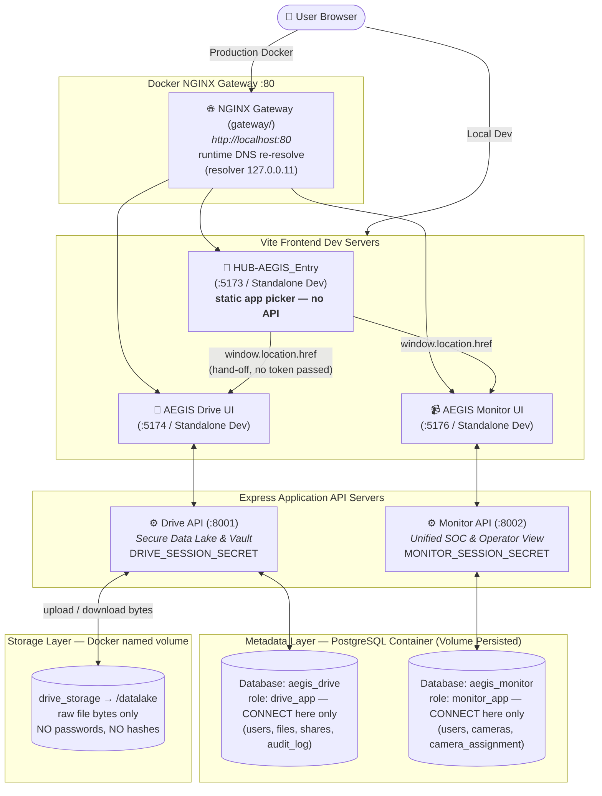

# 🗺️ AEGIS System Architecture Overview

> **Autonomous Edge-Guard Infrastructure System** — ระบบรักษาความปลอดภัยไซเบอร์และกายภาพแบบครบวงจร ออกแบบและพัฒนาด้วยสถาปัตยกรรม Monorepo รองรับภาษาไทยเป็นหลัก (Thai-First UI) ภายใต้ดีไซน์แบบ Cyber-Physical Precision Light

---

## 🏗️ โครงสร้างสถาปัตยกรรมระบบจริงใน Codebase (Monorepo Diagram)

> ⚠️ **Session secret แยกต่อแอป (2026-07-22)**: `drive` และ `monitor` ใช้
> `SESSION_SECRET` คนละดอก (`DRIVE_SESSION_SECRET` / `MONITOR_SESSION_SECRET` ใน
> root `.env`) — secret ที่หลุดจากแอปหนึ่งต้องปลอม cookie ของอีกแอปไม่ได้ ถ้าใช้
> ดอกเดียวกัน คนที่ได้ secret ของ Drive จะ sign เซสชัน Monitor ได้ทันที = ทำลาย
> boundary ที่อุตส่าห์แยก `users` ไว้คนละฐาน (ดู [[concepts/Identity_Decoupling]])
>
> ⚠️ **`drive_storage` mount ให้ `drive` เท่านั้น** — `monitor` และ `gateway`
> ไม่มีสิทธิ์แตะไฟล์ของ IDEA1 แม้แต่ระดับ filesystem
>
> ⚠️ **DB role แยกต่อแอป (2026-07-22)**: แต่ละแอปต่อ Postgres ด้วย role ของตัวเอง
> (`drive_app` / `monitor_app`) ที่ถูก `REVOKE CONNECT` ออกจากฐานของอีกฝั่ง —
> การแยกแค่ database โดยใช้ superuser ร่วมกัน **ยังไม่ใช่การแยกจริง** เพราะโปรเซส
> ของ IDEA1 จะถือ credential ที่อ่าน `password_hash` ของ IDEA2 ได้อยู่ดี ตอนนี้ข้าม
> ฐาน = ถูกปฏิเสธตั้งแต่ **ชั้นเปิด connection** superuser `aegis` เหลือหน้าที่แค่
> init/migrate/ตรวจสอบ ไม่มีบริการที่รันอยู่ใช้มันเลย
> (`postgres/init/02-app-roles.sh` · พิสูจน์ใน `docs/auth-test.md` ข้อ 11)
>
> ⚠️ **Gateway re-resolve DNS ตอน runtime (2026-07-23)**: `proxy_pass` ของ
> `/drive/` และ `/monitor/` ชี้ผ่านตัวแปร (`set $drive_upstream drive:8001;`)
> คู่กับ `resolver 127.0.0.11 valid=10s` — ถ้าเขียนชื่อ host ตรง ๆ nginx จะ
> resolve ครั้งเดียวตอนบูตแล้ว cache IP ไว้ตลอด พอ deploy ทีละ service แล้ว
> container ได้ IP ใหม่จะ **502 ค้างถาวร** จนกว่าจะ restart gateway เอง
> (ทดสอบ A/B แล้ว: config เดิม 502 ตลอด / config ใหม่ 200 ไม่ตกเลย)
> หมายเหตุ: `HUB-AEGIS_Entry/nginx.conf` ฝั่ง production ไม่มีปัญหานี้เพราะ
> proxy_pass ไปที่ IP ตรง ๆ ไม่ผ่าน DNS

---

## 📌 สรุปสถานะซอร์สโค้ดในโปรเจกต์ (Codebase Implementation Catalog)

| โมดูล | สถานะโค้ด | พอร์ต & ไดเรกทอรี | Link เอกสารละเอียด |
| :--- | :--- | :--- | :--- |
| **HUB-AEGIS_Entry** | ✅ Static app picker (ไม่มี backend/login) | เสิร์ฟที่ `/` โดย `gateway` (dev UI `:5173`) | [[01 - 🚪 HUB-AEGIS Entry]] |
| **IDEA1-AEGIS_Drive_LC** | ✅ Built & Implemented | UI `:5174` / API `:8001` (`IDEA1-AEGIS_Drive_LC/`) | [[02 - 💾 IDEA1 AEGIS Drive LC]] |
| **IDEA2-AEGIS_Monitor** | ✅ Built & Implemented | UI `:5176` / API `:8002` (`IDEA2-AEGIS_Monitor/`) | [[03 - 📹 IDEA2 AEGIS Monitor]] |
| **IDEA3-AEGIS_Lockdown** | 🟢 Code Written | Firmware & Sim (`IDEA3-AEGIS_Lockdown/`) | [[04 - 🔒 IDEA3 AEGIS Lockdown]] |
| **Security Architecture** | 🛡️ Verified in Code | Per-App Identity, OWASP Hardening | [[05 - 🛡️ Security Architecture]] |

---

> **2026-07-21**: Closed-registration account provisioning is now real (not
> demo stubs) in both IDEA1 and IDEA2 — Day-0 admin bootstrap, Admin/CLI
> temp-password issuance, and a Force Password Reset gate enforced on every
> endpoint. No new service/port; see [[02 - 💾 IDEA1 AEGIS Drive LC]],
> [[03 - 📹 IDEA2 AEGIS Monitor]], and [[05 - 🛡️ Security Architecture]].
>
> **2026-07-24**: IDEA2 gains an in-web **Add Operator** path (SOC-Responder
> only) — `POST /monitor/api/operators`, guarded by `requireRole` and backed
> by the same `store.provisionOperator()` constants (`USERNAME_RE`,
> `BCRYPT_COST=12`, `must_reset` default TRUE) as the SSH CLI, so web- and
> CLI-made operators land the same shape in `users`/`camera_assignment`. Temp
> password is returned once (never logged) and the new account is Scoped-View
> bound to its camera. No new service/port — same `:8002` API. Verified E2E in
> `docs/auth-test.md` §13; details in [[03 - 📹 IDEA2 AEGIS Monitor]].

---

## 🔗 เอกสารที่เกี่ยวข้อง
* [[01 - 🚪 HUB-AEGIS Entry]]
* [[02 - 💾 IDEA1 AEGIS Drive LC]]
* [[03 - 📹 IDEA2 AEGIS Monitor]]
* [[04 - 🔒 IDEA3 AEGIS Lockdown]]
* [[05 - 🛡️ Security Architecture]]
