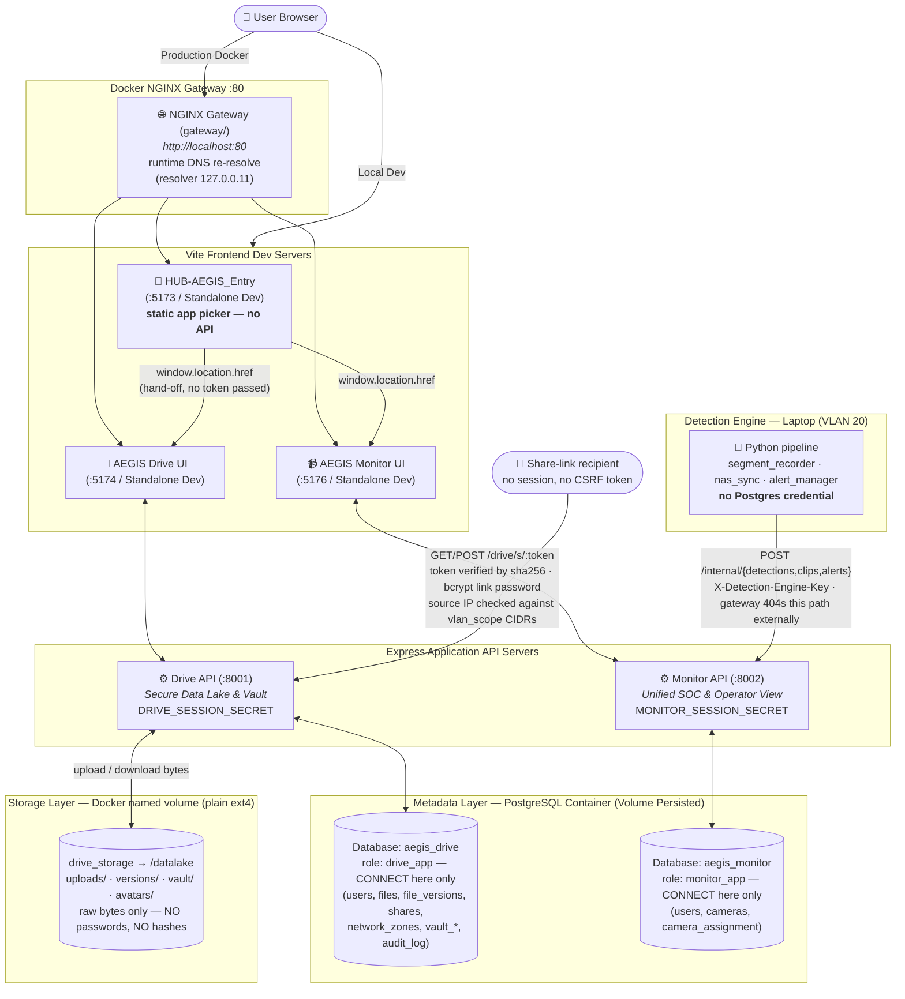

# 🗺️ AEGIS System Architecture Overview

> **Autonomous Edge-Guard Infrastructure System** — A comprehensive cyber-physical security system designed and developed with a Monorepo architecture supporting Thai-First UI under a Cyber-Physical Precision design (Dual-Theme Light & Dark Mode, Volumetric Aura Glow, Framer Motion Unfold Physics, and Tailwind CSS v4 `@variant dark`).

---

## 🏗️ Actual Codebase Architecture (Monorepo Diagram)

> ⚠️ **Per-App Session Secret (2026-07-22)**: `drive` and `monitor` use distinct `SESSION_SECRET` keys (`DRIVE_SESSION_SECRET` / `MONITOR_SESSION_SECRET` in root `.env`). A secret leaked from one app cannot forge cookies for another.
>
> ⚠️ **`drive_storage` Mounted Exclusively to `drive`**: `monitor` and `gateway` have zero access to IDEA1 storage files at the filesystem level.
>
> ⚠️ **Per-App DB Roles (2026-07-22)**: Each application connects to PostgreSQL using its own role (`drive_app` / `monitor_app`) with `REVOKE CONNECT` applied against the other database. Cross-database queries are rejected at the connection layer. Superuser `aegis` is restricted to init/migrate tasks (`postgres/init/02-app-roles.sh`).
>
> ⚠️ **Runtime Gateway DNS Re-Resolution (2026-07-23)**: `/drive/` and `/monitor/` `proxy_pass` directives resolve dynamic upstreams (`set $drive_upstream drive:8001;`) alongside `resolver 127.0.0.11 valid=10s`.

---

## 📌 Codebase Implementation Catalog

| Module | Code Status | Port & Directory | Details Note |
| :--- | :--- | :--- | :--- |
| **HUB-AEGIS_Entry** | ✅ Static app picker (No backend/login) | Served at `/` by `gateway` (dev UI `:5173`) | [[01 - 🚪 HUB-AEGIS Entry]] |
| **IDEA1-AEGIS_Drive_LC** | ✅ Built & Implemented | UI `:5174` / API `:8001` (`IDEA1-AEGIS_Drive_LC/`) | [[02 - 💾 IDEA1 AEGIS Drive LC]] |
| **IDEA2-AEGIS_Monitor** | ✅ Built & Implemented | UI `:5176` / API `:8002` (`IDEA2-AEGIS_Monitor/`) | [[03 - 📹 IDEA2 AEGIS Monitor]] |
| **IDEA3-AEGIS_Lockdown** | 🟢 Code Written | Firmware & Sim (`IDEA3-AEGIS_Lockdown/`) | [[04 - 🔒 IDEA3 AEGIS Lockdown]] |
| **Security Architecture** | 🛡️ Verified in Code | Per-App Identity, OWASP Hardening | [[05 - 🛡️ Security Architecture]] |

---

> **2026-07-25**: **Unified Split Vault Card Design System** — Both **AEGIS Drive** (`http://localhost/drive/`) and **AEGIS Monitor** (`http://localhost/monitor/`) login screens share a 50/50 Split Vault Card design featuring:
> - **Left Brand Panel**: Levitating metallic AEGIS emblem (`AegisMark`), `AEGIS` title, and gradient tagline `AUTONOMOUS EDGE-GUARD INFRASTRUCTURE SYSTEM` over a Cyber-Physical Dark Background (`.gate-bg`, `.gate-halo`).
> - **Right Form Panel**: `PillInput` controls, session `Toggle`, primary `SparkleButton`, and a 4-layer **Defense-in-Depth Readout** (`LAYER 0 · NETWORK` vpn/vlan, `LAYER 1 · APPLICATION` credentials, `LAYER 2 · STORAGE` encrypted at rest, `LAYER 3 · METADATA` postgresql) with `.hatch-fine` patterns.
> - **Header Chrome & i18n**: Language selector (`TH`, `EN`, `ZH`) and `ThemeToggle`.
> - **Identity Decoupling Preserved**: Database separation (`aegis_drive` and `aegis_monitor`), DB Roles (`drive_app` / `monitor_app`), and session cookies remain 100% decoupled.
>
> **2026-07-25**: IDEA2 **Detection Engine ↔ DB Wiring** — The Python engine (Laptop, VLAN 20) persists `detections`/`clips`/`alerts` by POSTing to Monitor's `/internal/*` endpoints (`X-Detection-Engine-Key`). NGINX blocks `/monitor/internal/*` externally (404).
>
> **2026-07-26**: Production HUB routing fixes prefix stripping (`rewrite … break`) before proxying. `Host`/`X-Forwarded-Host` forwards `$http_host` to preserve CSRF origin validation.
>
> **2026-07-24**: IDEA2 in-web **Add Operator** endpoint (`POST /monitor/api/operators`, SOC-Responder only) created.
>
> **2026-07-27**: IDEA1 **mock-data removal pass (7 phases)** — every remaining fabricated surface in AEGIS Drive replaced with real data or an explicit "not available" state. Seeded demo credentials now force a password reset; the Access screen reads the real `users` table; user-editable profile name + EXIF-stripped avatars; share links are genuinely redeemable (`/s/:token`) with bcrypt link passwords, working hit counters and enforced CIDR scope; real per-file version history replaces the fake Snapshots screen; Dashboard and Storage report real aggregates. **Removed as false claims**: snapshot rollback, encryption-key rotation, fabricated disk/SMART/backup telemetry, the `ScopeDiagram`, and the `otc` share option. Full detail in [[02 - 💾 IDEA1 AEGIS Drive LC]].

---

## 🚧 Outstanding Items (Open / In-Progress)

Items designed but pending final implementation:

| Task | Status | Notes |
| :--- | :--- | :--- |
| **`confirmDelete()` error display on 403 (IDEA1)** | 🔴 Open | Re-verified 2026-07-27 — still open. `Files.jsx:353-365` awaits each `DELETE` without checking `.ok`, so deleting another user's file closes the dialog silently. The server correctly returns 403 and `mutateError` state already exists and renders; it is simply never set. Outside the scope of the 7-phase pass. |
| **Encryption at rest for Data Lake uploads (IDEA1)** | 🔴 Open | Ordinary uploads are **plaintext on disk**. Needs encryption in `fileStore.js` plus a decision on where key material lives and a re-encrypt path. The old "rotate key" button was removed for claiming this already existed. Vault files are unaffected (encrypted in the browser). |
| **Off-site backup (IDEA1)** | 🔴 Open | No backup job or destination is configured anywhere. File history lives on the same disk as the data, so it does not survive a drive failure. Declared honestly in the UI rather than implied. |
| **Disk health / SMART / RAID telemetry (IDEA1)** | 🟠 Blocked by infrastructure | Measured 2026-07-27: container has no `smartctl`/`mdadm`, no raw block device, and **no `CAP_SYS_RAWIO` / `CAP_SYS_ADMIN`**. Requires host-level grants, not code. |
| **Filesystem snapshots (IDEA1)** | 🟠 Blocked by infrastructure | `/datalake` is plain **ext4** — no LVM/ZFS/Btrfs. Point-in-time snapshots are impossible without changing the storage backend. Superseded for now by real per-file history. |
| **Per-user share defaults / snapshot schedule (IDEA1)** | 🔴 Open | Marked not-implemented in Settings rather than left as inert dropdowns. |
| **Session store survives restart (IDEA1)** | 🟠 Known limitation | express-session `MemoryStore`: the Active Sessions list is real but vanishes on restart (all devices signed out). A shared store (`connect-pg-simple`) is required before running more than one instance. Stated in the UI. |
| ~~**Snapshots & Recovery (IDEA1)**~~ | ✅ **Closed 2026-07-27** | Fake screen removed; replaced by real `file_versions` + `versions/` bytes with a restore that returns actual data. Scope difference (per-file, not point-in-time) stated on the screen. |
| ~~**Secure Shares — network scope enforcement (IDEA1)**~~ | ✅ **App-level closed 2026-07-27** | Source-address check against CIDRs snapshotted from `network_zones`, enforced on redemption and fail-closed. ⚠️ Firewall/switch-level VLAN isolation remains a **host** concern — the app no longer claims to provide it. |
| ~~**Vault persistence (IDEA1)**~~ | ✅ **Closed 2026-07-26** | Fully wired: Argon2id → KEK + envelope AES-256-GCM per file, `.aegisenc` storage, `vault_meta`/`vault_blobs` in DB. |
| **Report ↔ KB: shared vs separate storage** | 🟠 Reconciliation Needed | KB confirms Storage Layer belongs strictly to IDEA1; main report text requires minor updates to reflect separate storage mounting. |

> ⚠️ **Demo credential caveat (2026-07-27)**: because the force-reset gate is now real, the credentials in `IDEA1-AEGIS_Drive_LC/server/db/seed.sql` are **single-use per database** — they log in once to set a new password. Running the IDEA1 test suite against a database also rotates them. `docker compose down -v` restores a clean state. Check this before a live demo.

---

## 🔗 Related Notes
* [[01 - 🚪 HUB-AEGIS Entry]]
* [[02 - 💾 IDEA1 AEGIS Drive LC]]
* [[03 - 📹 IDEA2 AEGIS Monitor]]
* [[04 - 🔒 IDEA3 AEGIS Lockdown]]
* [[05 - 🛡️ Security Architecture]]
