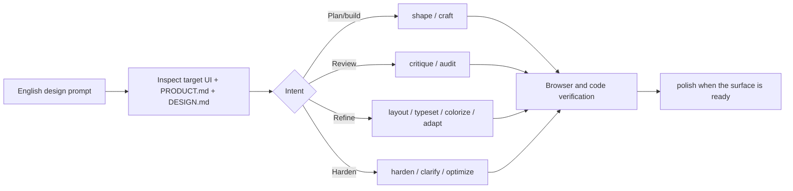
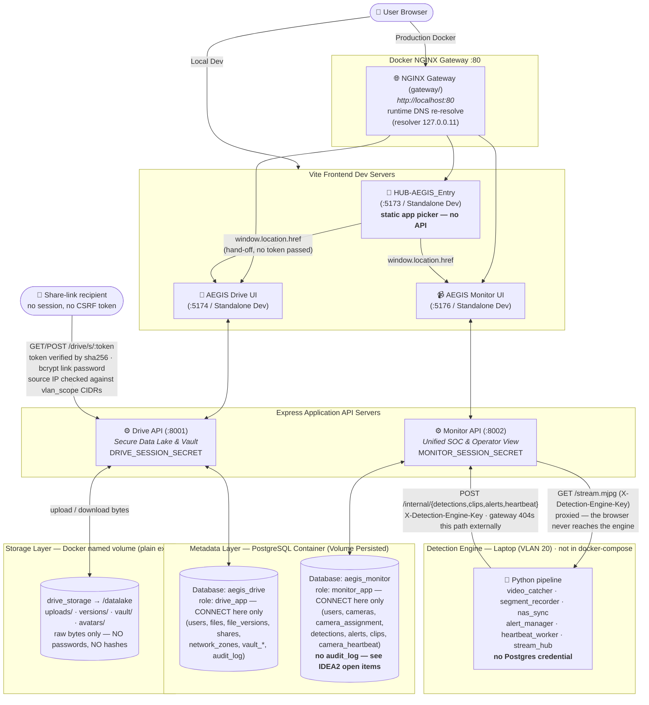
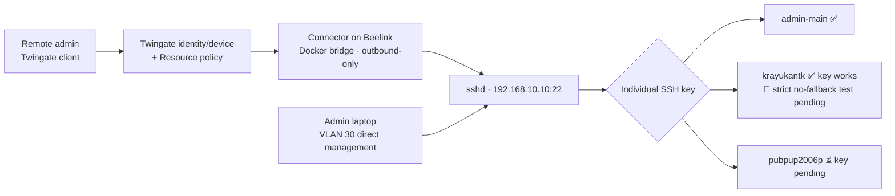
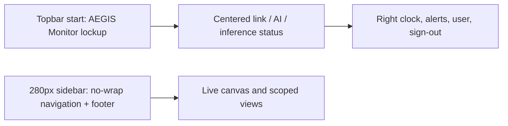
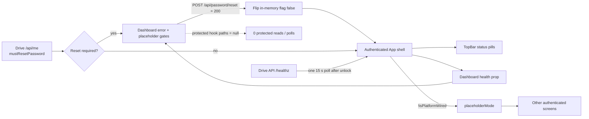

# 🗺️ AEGIS System Architecture Overview

## 🎨 UI Design Workflow

All future UI/design prompts are routed through the Impeccable workflow documented in [[concepts/Impeccable_UI_Design_Workflow]]. The agent selects a command from the prompt's intent, using AEGIS's existing product register, tokens, Thai-first accessibility rules, and anti-references as constraints. The normal review path is:

> **Autonomous Edge-Guard Infrastructure System** — A comprehensive cyber-physical security system designed and developed with a Monorepo architecture supporting Thai-First UI under a Cyber-Physical Precision design (Dual-Theme Light & Dark Mode, Volumetric Aura Glow, Framer Motion Unfold Physics, and Tailwind CSS v4 `@variant dark`).

---

## 🏗️ Actual Codebase Architecture (Monorepo Diagram)

> ⚠️ **Per-App Session Secret (2026-07-22)**: `drive` and `monitor` use distinct `SESSION_SECRET` keys (`DRIVE_SESSION_SECRET` / `MONITOR_SESSION_SECRET` in root `.env`). A secret leaked from one app cannot forge cookies for another.
>
> ⚠️ **`drive_storage` Mounted Exclusively to `drive`**: `monitor` and `gateway` have zero access to IDEA1 storage files at the filesystem level.
>
> ⚠️ **Per-App DB Roles (2026-07-22)**: Each application connects to PostgreSQL using its own role (`drive_app` / `monitor_app`) with `REVOKE CONNECT` applied against the other database. Cross-database queries are rejected at the connection layer. Superuser `aegis` is restricted to init/migrate tasks (`postgres/init/02-app-roles.sh`).
>
> ⚠️ **Runtime Gateway DNS Re-Resolution (2026-07-23)**: `/drive/` and `/monitor/` `proxy_pass` directives resolve dynamic upstreams (`set $drive_upstream drive:8001;`) alongside `resolver 127.0.0.11 valid=10s`.

---

## 🛡️ Security Layer 0 — Remote Administrative Path (2026-08-11)

The real remote-administration path is Twingate-only: the outbound Connector on Beelink exposes one Resource, `AEGIS-Beelink-SSH` → `192.168.10.10:22/TCP`. It does not grant the whole VLAN 30 subnet. VLAN 30 remains a separate direct-management path, while OpenVPN is deprecated because Double NAT prevents the required inbound path.

The operator confirms the current hardened state is `PubkeyAuthentication yes`, `PermitRootLogin no`, and temporary `PasswordAuthentication yes`; `admin-main` is the sudo-capable administration path, while `krayukantk` has an individual key and no sudo. Password Auth remains enabled only until `pubpup2006p` completes owner-generated key onboarding and key cleanup. UFW now passes the Twingate SSH path, while a direct VLAN 30 session test is still pending. Connector-token rotation and `drive_app`/`monitor_app` credential rotation remain required before production deployment. Exact post-apply SSH/UFW command output was not attached to the 2026-08-11 correction, so the vault records these items as operator-confirmed without inventing rule/source details. See [[20-Server/SSH-Hardening-Status]], [[20-Server/Linux-User-Accounts]], [[30-RemoteAccess/Twingate-Setup]], and [[90-Status/Open-Items-Backlog]].

---

## 📐 Monitor UI Shell (2026-07-28)

The Monitor frontend keeps product branding in the global topbar start zone and uses a 280px desktop navigation sidebar. The sidebar headings and menu labels are single-line; explicit dark/light text roles keep page subtitles, sidebar footer copy, and Live event-stream logs readable. This presentation-only shell correction leaves the React data flow, RBAC, heartbeat telemetry, and proxied MJPEG path unchanged.

The IDEA2 boundary is intentional: `IDEA2-AEGIS_Monitor/` owns login, identity, server-resolved role menus, scoped UI/API, and `camera_assignment`; `IDEA2-AEGIS_CCTV-Operator/detection-engine/` remains the Laptop-side capture/detection/heartbeat process. The old folder's UI was merged and is no longer a second web application, but the detection engine still participates in the real pipeline.

## 📌 Codebase Implementation Catalog

| Module | Code Status | Port & Directory | Details Note |
| :--- | :--- | :--- | :--- |
| **HUB-AEGIS_Entry** | ✅ Static app picker (No backend/login) | Served at `/` by `gateway` (dev UI `:5173`) | [[01 - 🚪 HUB-AEGIS Entry]] |
| **IDEA1-AEGIS_Drive_LC** | ✅ Built & Implemented | UI `:5174` / API `:8001` (`IDEA1-AEGIS_Drive_LC/`) | [[02 - 💾 IDEA1 AEGIS Drive LC]] |
| **IDEA2-AEGIS_Monitor** | ✅ Built & Implemented | UI `:5176` / API `:8002` (`IDEA2-AEGIS_Monitor/`) | [[03 - 📹 IDEA2 AEGIS Monitor]] |
| **IDEA3-AEGIS_Lockdown** | 🟢 Code Written | Firmware & Sim (`IDEA3-AEGIS_Lockdown/`) | [[04 - 🔒 IDEA3 AEGIS Lockdown]] |
| **Security Architecture** | 🛡️ Verified in Code | Per-App Identity, OWASP Hardening | [[05 - 🛡️ Security Architecture]] |

---

> **2026-08-07**: IDEA1 Drive Dashboard empty-state regression fixed. The authenticated shell and every Dashboard card now remain visible when durable data is not connected; counters normalize to zero, list widgets use muted inline empty rows, storage/activity visualizations stay mounted at 0%, and the seeded in-memory dev fallback is never presented as real NAS telemetry. Real PostgreSQL payloads still replace the same stable layout. Page-level fetch failure no longer erases the grid; TopBar health pills are gray when unconfirmed and Vite now proxies `/drive/healthz` so a running local backend is reported honestly. Sidebar storage also moved from stale `storageGB`/hard-coded `1024 GB` to the byte metrics shared with Dashboard. Regression coverage lives in `tests/dashboardEmptyState.test.js`; full IDEA1 verification passed 86 tests with 18 PostgreSQL-only skips plus a successful production build. Full detail in [[02 - 💾 IDEA1 AEGIS Drive LC]].

> **2026-08-07**: IDEA1 Drive's same stable empty-state contract now covers every remaining authenticated sidebar route: Files, Private Vault, Uploads, Secure Shares, File History, Storage & Backup, Audit, Access Control and Settings. A shared health-derived `placeholderMode` suppresses seeded in-memory fixtures without removing page chrome; actions, filters, tables and charts stay mounted with empty arrays, zero values or neutral “not connected” status. File History stays truthful per-file versioning (not fake filesystem snapshots), RAID/backup telemetry is not fabricated, Access keeps only the current real Admin/session, Remote Access is Twingate-only and Inactive, and mnemonic generation is disabled until a genuine Vault recovery flow exists. Regression coverage lives in `tests/allScreensEmptyState.test.js`; verification passed all 111 tests (93 pass, 18 PostgreSQL-only skips), production build and browser checks. Full detail in [[02 - 💾 IDEA1 AEGIS Drive LC]].

> **2026-08-07**: IDEA1 Drive follow-up to the entry above — the empty-state pass had gated the *data* on `placeholderMode` but left the red “โหลดหน้านี้ไม่สำเร็จ / เซิร์ฟเวอร์ Drive ไม่ตอบสนอง” fetch-error panel ungated, so every screen rendered a correct zero/empty state **and** an alert box on top of it. Cause was real, not cosmetic: with no PostgreSQL pool, `checkDb()` answers `{ ok: true, db: 'memory' }` so `/healthz` stays green while the `/api/*` reads fail — an unwired platform, not a broken one. New `src/lib/fetchState.js` (`visibleFetchError`) makes the error panel conditional on a wired platform on all nine data screens plus Settings, and `shouldShowDashboardFetchError` now also requires `db !== 'memory'`. A genuine runtime failure on a PostgreSQL-backed deployment still surfaces its ErrorState with a working Retry; the pills, empty states, banners, forms and dark HUD chrome are untouched. Coverage added to `tests/allScreensEmptyState.test.js` and `tests/dashboardEmptyState.test.js`; 115 tests, 97 pass, 18 PostgreSQL-only skips, 0 fail, production build clean. Full detail in [[02 - 💾 IDEA1 AEGIS Drive LC]].

> **2026-08-07 · IDEA1 data honesty P0**: Ordinary Data Lake uploads and the Login defense-layer readout now state that encryption at rest is not configured; only Private Vault retains the client-side AES-256-GCM claim. Files checksum verification is a real `POST /api/files/:id/verify` storage reread + SHA-256 comparison and detects post-upload tampering. Dashboard's client-side Demo Override and its vocabulary are removed, so visible health can no longer be forced independently of evidence. Isolated PostgreSQL verification passed **125/125** at the P0 checkpoint (the final post-P2 suite is 132/132), production build passed, and `aegis_drive_test` was dropped after the run. See [[02 - 💾 IDEA1 AEGIS Drive LC]] and [[concepts/Honest_Telemetry_and_Unavailable_States]].

> **2026-08-07 · IDEA1 data honesty P1**: Capacity now has one byte-to-binary display contract across Sidebar, Dashboard and Storage. The shared share-store predicate excludes revoked and expired links before either Dashboard or Shares consumes them. The security KPI says exactly what it measures—DENIED/BLOCKED among the latest 100 audit rows. Access Control no longer fabricates “Active”: it shows Account ready and real session-store counts scoped to this process; the `MemoryStore` restart/multi-instance limitation remains explicit. Isolated PostgreSQL verification passed **128/128**, production build passed, and the test database was dropped and confirmed absent. See [[02 - 💾 IDEA1 AEGIS Drive LC]] and [[concepts/Honest_Telemetry_and_Unavailable_States]].

> **2026-08-07 · IDEA1 data honesty P2**: Drive health now has independent evidence per layer: a measured Express event-loop turn, measured PostgreSQL `SELECT 1`, and a measured Data Lake write/read/compare/delete probe. Dashboard removed fixed `12/4/2 ms`; missing evidence is neutral. TopBar now says `Drive: online`, not `Edge node`, and Metadata has its own probe. Ordinary upload progress is derived from XHR `loaded/total` byte events instead of fixed stage percentages. Full isolated PostgreSQL verification passed **132/132**, production/Docker builds passed, live `/drive/healthz` returned all three measured probes, the Drive container was healthy, and the temporary test database was removed. See [[02 - 💾 IDEA1 AEGIS Drive LC]] and [[concepts/Honest_Telemetry_and_Unavailable_States]].

> **2026-08-07**: IDEA1 Drive error-state audit findings are now closed. `src/lib/fetchState.js:isPlatformWired()` is the sole definition of a wired platform; `App.jsx` owns the only 15-second `/healthz` poll and shares its result with TopBar and Dashboard while deriving the other screens' placeholder mode from the same cycle. Shares now surfaces a failed secondary `/api/files` request inside the existing picker Field instead of falsely saying there are no files. Dashboard placeholder labels depend only on shared health, so `db=postgres` + `/api/dashboard` 500 shows the genuine error + Retry without simultaneous `ยังไม่เชื่อมต่อ` labels. The full jsdom rerun remains green: primary failures 9/9 visible, unwired failures 0/9, healthy false positives 0/9; all secondary probes pass. Focused negative cases now live in `tests/uiNegativeCases.test.js`. Full detail in [[02 - 💾 IDEA1 AEGIS Drive LC]] and [[concepts/Client_Render_State_Verification]].

> **2026-08-07 analysis**: IDEA1 Drive's visible live-status surfaces were inventoried from 15 screenshots and reconciled with source. Real refresh cadences range from 15 s (`/healthz`) to 60 s (`/api/storage`), with countdown/clock labels ticking locally. Five decision items remain open: Edge/Data Lake labels exceed the DB-only health probe; Data Lake `12/4/2 ms` values are constants; capacity mixes decimal and binary display units across three surfaces; expired shares are included in “active” totals; and the security/verification labels describe rolling audit or upload-time state rather than active incidents/current disk rehash. No application code was changed. Full inventory in [[02 - 💾 IDEA1 AEGIS Drive LC]] and open items in [[summaries/08_Outstanding_Items_Consolidated]].

> **2026-08-07**: IDEA1's full PostgreSQL release path is now re-verified at the current suite size: **119/119 pass, 0 fail, 0 skip**. The 18 tests skipped by the normal in-memory run were enabled only inside an ephemeral Node 24 runner with a process-scoped `TEST_DATABASE_URL` pointing to a fresh `aegis_drive_test` database. This isolation is mandatory because the suite intentionally clears Vault/share tables, mutates profile fields, deletes/recreates the seed user for FK-cascade proof, and may rotate seed passwords; it has no suite-wide rollback. Live `aegis_drive` row counts remained unchanged and its health stayed PostgreSQL-backed. The runner, dependency volume, active test sessions, and test database were all removed afterward; the final database list contains no `aegis_drive_test`. Procedure and caveat in [[02 - 💾 IDEA1 AEGIS Drive LC]] and [[concepts/Terminal_Verification_Protocol]].

> **2026-08-07 investigation**: The live Drive “`/api/storage` + `/api/files` failure” was traced to neither endpoint and was not a PostgreSQL `500`. Gateway logs at 20:35 showed `/api/me` and `/healthz` succeeding while Dashboard, Files, Storage and Users all returned the same intentional `403 PASSWORD_RESET_REQUIRED`; both seeded users still had `must_reset_password = TRUE`. Six direct read-only backend calls succeeded against the empty live tables. At investigation time, the missing piece was client onboarding: the old client ignored `mustResetPassword`, mounted protected hooks and reduced the explicit code to generic `forbidden`. That pass changed no source; the defect was implemented and closed in the entry immediately below. Full evidence in [[02 - 💾 IDEA1 AEGIS Drive LC]].

> **2026-08-07**: The Drive client-onboarding defect above is now closed. `apiFetch` preserves `PASSWORD_RESET_REQUIRED`; `App.jsx` pauses every App-owned protected hook and renders `MandatoryPasswordReset.jsx` before creating the shell or any protected screen. The reset form uses the existing backend endpoint, keeps all three password fields in memory only, and unlocks the normal shell by updating the in-memory session flag after server-confirmed success—no reload and no weakening of `requireRole.js`. New jsdom integration coverage proves zero protected calls before reset and normal calls afterward. Current isolated-PostgreSQL baseline is **122/122 pass, 0 fail, 0 skip**; the temporary database/runner were removed and live counts/health were unchanged. Full detail in [[02 - 💾 IDEA1 AEGIS Drive LC]].

> **2026-08-07**: Local Docker `/drive/` 502 traced to Windows CRLF in `postgres/init/*.sh`: Linux rejected `/bin/sh^M`, so Postgres created the two databases but never loaded schemas or created scoped `drive_app`/`monitor_app` roles. Added root `.gitattributes` (`*.sh text eol=lf`) and `tests/dockerBootstrap.test.mjs`; repaired the existing volume in place with the intended init scripts and restarted dependents. Verified `drive`, `monitor`, `gateway`, and `postgres` healthy, `/drive/` HTTP 200, and `/drive/healthz` backed by PostgreSQL. Deployment detail in [[40-Deployment/Docker-Stack-Plan]].
>
> **2026-08-01**: IDEA2 Monitor follow-up pass (same day as, and continuing from, the CAM-02/clip-playback/Telegram-routing/Operators-rebuild pass below) — with live source-code access this time, so findings are independently verified rather than user-reported. A real regression was found and fixed: `GET /api/clips/:id/video` had silently disappeared from `server/routes/api.js` during the earlier `/api/nodes` heartbeat-status edit (an edit pass had re-copied the pristine uploaded file as a base instead of continuing from the version that already had the clip-video route); re-added, and `Cache-Control: no-store` was moved to cover every response branch (403/404/409/503), not just the success path. Confirmed working end to end: `ffprobe` on a freshly recorded clip showed real H.264 (`libx264`), and a live Telegram-routing test (relabeling a camera's `AEGIS_CAMERA_ID` to one with a real `camera_assignment`) produced `OK: Telegram alert sent -> M. Reyes` in the running engine's own log. A CCTV-Operator-focused Live canvas motion/hierarchy pass followed a design brief: removed page-load choreography from `Live.jsx` (`.pagehead`/`.canvasR` no longer stagger-fade in on every visit), fixed a no-op camera-swap "transition" (previously `initial`/`animate` were identical values) to a real 200ms fade, added a brief CSS-only recovery flash to `LiveFeed.jsx` on stream recovery (not on first connect, to avoid reintroducing choreography under a different name), and wrapped `App.jsx` in `<MotionConfig reducedMotion="user">` so Framer Motion interactions site-wide now honor OS-level reduced-motion — previously only raw CSS `@media` rules did. `Footer.jsx` also had its last two fabricated values replaced (`192.168.1.42 · LAN` → real `camera_heartbeat.node_id`; `v3.0-spatial` → the same `__APP_VERSION__` `Settings.jsx` already used). Full detail, including the operational `.env`/DB-password issues found during verification, in [[03 - 📹 IDEA2 AEGIS Monitor]].
>
> **2026-08-01**: IDEA2 Monitor pass closing several `🔴 Open` items — CAM-02's live stream fixed (a hardcoded `host.docker.internal` in `LiveFeed.jsx` bypassed the documented proxy architecture); a Docker/CSP/OpenCV/codec cluster blocking the stack resolved, including an ffmpeg mp4v→H.264 transcode step for recorded segments; **clip playback closed** (`GET /api/clips/:id/video` + a real `<video>` element, previously the single largest UI gap after the recognition model itself); Alerts now route Telegram delivery per-camera via `camera_assignment` instead of one hardcoded chat id; Nodes & routing online/offline now sourced from `camera_heartbeat` rather than a static column; the dead `operators` menu entry's View #6 component was found missing from the working tree and rebuilt; a central i18n module was started (`src/lib/i18n.js`) but is not yet wired into most of the app. Reported by the user from their own dev session at the time this was first logged; see the follow-up entry directly above for independent re-verification of several of these claims. Full detail in [[03 - 📹 IDEA2 AEGIS Monitor]].
>
> **2026-07-25**: **Unified Split Vault Card Design System** — Both **AEGIS Drive** (`http://localhost/drive/`) and **AEGIS Monitor** (`http://localhost/monitor/`) login screens share a 50/50 Split Vault Card design featuring:
> - **Left Brand Panel**: Levitating metallic AEGIS emblem (`AegisMark`), `AEGIS` title, and gradient tagline `AUTONOMOUS EDGE-GUARD INFRASTRUCTURE SYSTEM` over a Cyber-Physical Dark Background (`.gate-bg`, `.gate-halo`).
> - **Right Form Panel**: `PillInput` controls, session `Toggle`, primary `SparkleButton`, and a 4-layer **Defense-in-Depth Readout** (`LAYER 0 · NETWORK` vpn/vlan, `LAYER 1 · APPLICATION` credentials, `LAYER 2 · STORAGE` encrypted at rest, `LAYER 3 · METADATA` postgresql) with `.hatch-fine` patterns.
> - **Header Chrome & i18n**: Language selector (`TH`, `EN`, `ZH`) and `ThemeToggle`.
> - **Identity Decoupling Preserved**: Database separation (`aegis_drive` and `aegis_monitor`), DB Roles (`drive_app` / `monitor_app`), and session cookies remain 100% decoupled.
>
> **2026-07-25**: IDEA2 **Detection Engine ↔ DB Wiring** — The Python engine (Laptop, VLAN 20) persists `detections`/`clips`/`alerts` by POSTing to Monitor's `/internal/*` endpoints (`X-Detection-Engine-Key`). NGINX blocks `/monitor/internal/*` externally (404).
>
> **2026-07-26**: Production HUB routing fixes prefix stripping (`rewrite … break`) before proxying. `Host`/`X-Forwarded-Host` forwards `$http_host` to preserve CSRF origin validation.
>
> **2026-07-24**: IDEA2 in-web **Add Operator** endpoint (`POST /monitor/api/operators`, SOC-Responder only) created.
>
> **2026-07-27**: IDEA2 **audit + two build-out phases** — a mock-vs-real audit of AEGIS Monitor, then the work to close it. **Phase A**: the Detection Engine was run for the first time (real webcam → real 20s segments → `scp` + sha256 verify → real `clips`/`detections` rows); real **heartbeat delivery** added (`camera_heartbeat`, `POST /internal/heartbeat`), replacing an `/api/link` that was two in-memory integers returning `online` forever; TopBar, the Diagnostics screen and Settings rewired to that real state, with `unavailable` where no measurement exists; the **fabricated identity overlay deleted** (`J. SMITH // 98%` and friends); the dead `operators` menu entry resolved by **building View #6**. **Phase B**: real **live MJPEG video**, proxied through Monitor with full `camera_assignment` scoping — the browser never reaches the engine. ⚠️ The recognition **model still does not exist** (`PlaceholderRecognizer` labels everything `Unknown`), and — as of 2026-07-27 — there was still **no clip playback** (closed 2026-08-01, see above). Full detail in [[03 - 📹 IDEA2 AEGIS Monitor]]; the principle extracted from both passes is [[concepts/Honest_Telemetry_and_Unavailable_States]].
>
> **2026-07-28**: IDEA2 Monitor data views now use a four-state request model (`LOADING`, `ERROR`, `SUCCESS_EMPTY`, `SUCCESS_DATA`). A failed request renders only its error/retry container; an empty successful response keeps the existing dashboard structure while exposing honest zero-state content. A small Node test protects the state classifier.
>
> **2026-07-28**: IDEA2 Monitor's authenticated shell was visually unified across Live, Archive, Detection, Alerts, Nodes, Operators, Diagnostics, and Settings. `src/index.css` now supplies IDEA1-aligned slate/obsidian tokens, a subtle 24px cyber grid, low-noise blue/violet ambience, compact glass status capsules, elevated panels, and reduced-motion-safe interactions; `TopBar.jsx` is utility-only while `Sidebar.jsx` owns the Monitor brand lockup, and `App.jsx` toggles the root theme class. Settings additionally uses a 12-column bento hierarchy with responsive collapse. The Drive dashboard is the hierarchy reference only—no Drive data or simulated Monitor values were copied into the console.
> **2026-07-28**: **Repository-wide Impeccable tactical surface pass** — `HUB-AEGIS_Entry/src/index.css`, `IDEA1-AEGIS_Drive_LC/src/index.css`, and `IDEA2-AEGIS_Monitor/src/index.css` now share a presentation contract for dual-theme surfaces, focus-visible feedback, restrained active states, responsive bounds, and reduced-motion behavior. The pass changed CSS only; routing, API payloads, auth/session logic, request state machines, and real telemetry remain unchanged. HUB gate imagery and Monitor's approved cyber-glass exception were preserved.
> **2026-07-28**: IDEA2 Monitor received a targeted palette/readability correction in `src/index.css`: Dark Mode is now anchored to `#07080B` with `#0C0D12/.90` panels and explicit white/Slate typography; Light Mode is Slate-100 with a faint 16px dot grid, white panels, and dark Slate content. TopBar alignment uses a three-column baseline grid, while Nodes/Settings share p-5 card rhythm and explicit key/value contrast. No functional logic or new animation was introduced.
> **2026-07-28**: The latest Monitor UI build was deployed through the root Docker test stack. `postgres`, `monitor`, `drive`, and `gateway` are healthy; `http://localhost/monitor/` returned HTTP 200. This confirms local deployment only and does not alter the production HTTPS deployment path.
> **2026-07-28**: IDEA2 Live canvas now supports camera click-to-swap: the selected secondary feed becomes the main player and the previous main camera returns to the grid. The camera feed HUD was also corrected so the always-dark player keeps readable error copy in Light Mode and secondary labels use explicit dark/light glass tokens. Functional state/API boundaries remain unchanged.
> **2026-07-28**: **IDEA2 CCTV presentation redesign** — `IDEA2-AEGIS_Monitor/src/index.css` now skins the real Monitor shell and Live canvas with the confirmed IDEA1 visual language: near-black 24px grid, compact topbar/sidebar, blue-violet active navigation, restrained panels, and a balanced responsive feed/telemetry layout. No mock rows or simulated telemetry were added; existing camera streams, detection overlays, access-control results, event rows, RBAC, and request state remain the source of truth. `tests/designContract.test.mjs` protects the layout and reduced-motion contract; `npm test` passes 6/6 and `npm run build` succeeds.
> **2026-07-28**: IDEA2 Nodes & routing was simplified to an information-only routing card grid; redundant camera feed/hatch surfaces and `LIVE CAM-XX` overlays were removed while real camera metadata, assignment, RBAC, and link status remain intact. Monitor's HTML shell now uses no-store revalidation so the root Docker deployment cannot keep serving an older bundle after rebuild; fingerprinted assets remain immutable.
>
> **2026-07-27**: IDEA1 **mock-data removal pass (7 phases)** — every remaining fabricated surface in AEGIS Drive replaced with real data or an explicit "not available" state. Seeded demo credentials now force a password reset; the Access screen reads the real `users` table; user-editable profile name + EXIF-stripped avatars; share links are genuinely redeemable (`/s/:token`) with bcrypt link passwords, working hit counters and enforced CIDR scope; real per-file version history replaces the fake Snapshots screen; Dashboard and Storage report real aggregates. **Removed as false claims**: snapshot rollback, encryption-key rotation, fabricated disk/SMART/backup telemetry, the `ScopeDiagram`, and the `otc` share option. Full detail in [[02 - 💾 IDEA1 AEGIS Drive LC]].

---

> **2026-07-28**: The repository now documents automatic Impeccable command selection in `README.md`, `AGENTS.md`, and `concepts/Impeccable_UI_Design_Workflow.md`. Future agents infer `shape`, `layout`, `typeset`, `colorize`, `audit`, `harden`, `polish`, or `live` from the prompt, read the shared Obsidian context, and update existing notes in place after implementation. The official reference remains https://impeccable.style/docs/.
> **2026-07-28**: The complete trackable AEGIS project tree was published to the GitHub repository's `main` branch. Local secrets, agent settings, generated dependencies/build output, and the empty accidental note were intentionally excluded; `.env.example` remains the shareable configuration template.
> **2026-08-08**: The accumulated AEGIS workspace updates were prepared for publication to `kraveerachat/Project-End-The-AEGIS` from `fix/hub-nginx-monitor-routing-and-ingest-guard`. The publishable tree includes application source, Docker/PostgreSQL bootstrap, tests, project documentation, and this Obsidian vault; local `.env` files, agent-local settings, the nested repository clone, surveillance recordings, and generated detection logs remain outside Git. Fresh verification before publication: Drive PostgreSQL suite 132/132, Monitor 6/6, Docker bootstrap 2/2, and production builds for HUB, Drive, and Monitor all succeeded; the isolated `aegis_drive_test` database was removed afterward.

## 🚧 Outstanding Items (Open / In-Progress)

Items designed but pending final implementation:

| Task | Status | Notes |
| :--- | :--- | :--- |
| **`confirmDelete()` error display on 403 (IDEA1)** | 🔴 Open | Re-verified 2026-07-27 — still open. `Files.jsx:353-365` awaits each `DELETE` without checking `.ok`, so deleting another user's file closes the dialog silently. The server correctly returns 403 and `mutateError` state already exists and renders; it is simply never set. Outside the scope of the 7-phase pass. |
| **Encryption at rest for Data Lake uploads (IDEA1)** | 🔴 Open | Ordinary uploads are **plaintext on disk**. Needs encryption in `fileStore.js` plus a decision on where key material lives and a re-encrypt path. The old "rotate key" button was removed for claiming this already existed. Vault files are unaffected (encrypted in the browser). |
| **Off-site backup (IDEA1)** | 🔴 Open | No backup job or destination is configured anywhere. File history lives on the same disk as the data, so it does not survive a drive failure. Declared honestly in the UI rather than implied. |
| **Disk health / SMART / RAID telemetry (IDEA1)** | 🟠 Blocked by infrastructure | Measured 2026-07-27: container has no `smartctl`/`mdadm`, no raw block device, and **no `CAP_SYS_RAWIO` / `CAP_SYS_ADMIN`**. Requires host-level grants, not code. |
| **Filesystem snapshots (IDEA1)** | 🟠 Blocked by infrastructure | `/datalake` is plain **ext4** — no LVM/ZFS/Btrfs. Point-in-time snapshots are impossible without changing the storage backend. Superseded for now by real per-file history. |
| **Per-user share defaults / snapshot schedule (IDEA1)** | 🔴 Open | Marked not-implemented in Settings rather than left as inert dropdowns. |
| **Session store survives restart (IDEA1)** | 🟠 Known limitation | express-session `MemoryStore`: the Active Sessions list is real but vanishes on restart (all devices signed out). A shared store (`connect-pg-simple`) is required before running more than one instance. Stated in the UI. |
| ~~**Snapshots & Recovery (IDEA1)**~~ | ✅ **Closed 2026-07-27** | Fake screen removed; replaced by real `file_versions` + `versions/` bytes with a restore that returns actual data. Scope difference (per-file, not point-in-time) stated on the screen. |
| ~~**Secure Shares — network scope enforcement (IDEA1)**~~ | ✅ **App-level closed 2026-07-27** | Source-address check against CIDRs snapshotted from `network_zones`, enforced on redemption and fail-closed. ⚠️ Firewall/switch-level VLAN isolation remains a **host** concern — the app no longer claims to provide it. |
| ~~**Vault persistence (IDEA1)**~~ | ✅ **Closed 2026-07-26** | Fully wired: Argon2id → KEK + envelope AES-256-GCM per file, `.aegisenc` storage, `vault_meta`/`vault_blobs` in DB. |
| **Report ↔ KB: shared vs separate storage** | 🟠 Reconciliation Needed | KB confirms Storage Layer belongs strictly to IDEA1; main report text requires minor updates to reflect separate storage mounting. |
| **Real face-recognition model (IDEA2)** | 🔴 Open | The single largest remaining gap. `face_detector.py` ships `PlaceholderRecognizer` (Haar boxes only), so `detections.result` is **always** `Unknown` and `matched_name` **always** `NULL`. The `FaceRecognizer` injection seam is clean and was deliberately left untouched — a model is to be supplied separately. Until then no identity-based screen can show a real name. |
| ~~**Clip playback (IDEA2)**~~ | ✅ **Closed 2026-08-01** | `clips.file_path` pointed at the NAS but `monitor` had no volume mount and no streaming endpoint; Archive's play button only toggled a text panel. Closed with `GET /api/clips/:id/video` (Range-capable via `res.sendFile`) + `getClipById()` + a real `<video>` element. Briefly regressed to a 404 during a same-day follow-up edit (route accidentally dropped, then re-added with `Cache-Control: no-store` covering every response branch) and independently re-verified live afterward. Full detail in [[03 - 📹 IDEA2 AEGIS Monitor]]. |
| **`gateway/nginx.conf` `/monitor/internal/` case gap** | 🔴 Open | Re-verified 2026-07-27 — still open. The literal `location /monitor/internal/` is case-sensitive while Express matches case-insensitively, so `/monitor/Internal/…` bypasses the edge guard. The production HUB config already uses `~*` and its own comment records that the gateway shares the hole. The API key still guards the endpoint; it is the *edge* layer that is bypassable. |
| **Heartbeat history / uptime % (IDEA2)** | 🔴 Open | `camera_heartbeat` UPSERTs one row per camera, so uptime %, 24h disconnects and a real latency sparkline cannot be computed. Shown as `unavailable` rather than guessed; needs a time-series table. |
| **No audit log in IDEA2** | 🔴 Open | IDEA2 has **no `audit_log` table at all**. Operator creation, camera reassignment, alert acknowledgement, password resets and every login leave no record. If built, use awaited writes from the start — IDEA1's fire-and-forget bug is documented and should not be repeated. |
| **Broad automated coverage in IDEA2** | 🟠 In progress | `npm test` now protects the four-state UI classifier. RBAC/scoping and API integration coverage still rely on the ad-hoc 27-check curl suite and need formal automated tests. |
| **Multi-camera engine deployment (IDEA2)** | 🔴 Open | One engine process serves one camera (`config.py` carries a single `camera_id`); six seeded cameras means six configured instances. No supervisor, no compose service, no orchestration. Running two engine instances against two distinct cameras simultaneously was design-confirmed with the user 2026-08-01 but not yet implemented. |
| **Real NAS integration (IDEA2)** | 🔴 Open | `nas_sync_clip()` currently only verifies sha256 against a file on the same disk as the engine (an explicitly-documented Phase 1 simulation) rather than transferring bytes to a physically separate NAS host. The two required changes (swap the `docker-compose.yml` bind-mount source; add a real rsync/scp step before verification) were design-confirmed with the user 2026-08-01 but not yet implemented. |
| **Safari live video (IDEA2)** | 🟠 Known limitation | `multipart/x-mixed-replace` in `` is supported by Chrome/Edge/Firefox; **Safari does not support it** and will sit in the reconnect state. A different transport (HLS/WebRTC) would be needed for Safari. |
| **Real bbox geometry (IDEA2)** | 🟠 Design constraint | `detections` has no bbox column, so overlay boxes are evenly-spaced slots and `.feedimg` uses `object-fit: cover`. **When real bbox telemetry arrives this must become `contain` or letterbox-aware**, or normalised coordinates will be wrong by exactly the cropped margin. Recorded in the CSS beside the rule. |
| **Notification preferences (IDEA2 Settings)** | 🔴 Open | Sound / desktop push / snooze are `useState` only — never persisted — yet every toggle fires a "saved successfully" toast. |
| **i18n rollout (IDEA2)** | 🟡 In progress | `src/lib/i18n.js` exists; `Settings.jsx` consumes it and `App.jsx` now persists the chosen language to `localStorage` with cross-tab sync (2026-08-01). Every other view and shell component (`Live.jsx`, `TopBar.jsx`, `Sidebar.jsx`, `Footer.jsx`, `Detection.jsx`, `Diagnostics.jsx`, `Login.jsx`) still renders hardcoded strings. |
| **`IDEA2-AEGIS_Monitor/src/index.css` has stacked dead-code redesign blocks** | 🟡 Flagged, deferred by user choice (2026-08-01) | Roughly 5 later blocks in the file redeclare the same `:root`/`.hero`/`.topbar`/`.panel`/`.side` selectors with different values from earlier blocks; only the final declaration is ever live. Flagged before the 2026-08-01 Live canvas motion pass; the user chose to defer the cleanup rather than have it folded into that pass. |

> ⚠️ **Demo credential caveat (2026-07-27)**: because the force-reset gate is now real, the credentials in `IDEA1-AEGIS_Drive_LC/server/db/seed.sql` are **single-use per database** — they log in once to set a new password. Running the IDEA1 test suite against a database also rotates them. `docker compose down -v` restores a clean state. Check this before a live demo.
>
> ⚠️ **The same now applies to IDEA2 (2026-07-27)**: `soc`, `operator` and `operator2` in `IDEA2-AEGIS_Monitor/server/db/seed.sql` also carry `must_reset_password = TRUE`, with an idempotent `UPDATE` that closes databases initialised before the change. On the current dev stack those three passwords were **already rotated during verification** and are no longer the seeded values — `docker compose down -v` restores them. Check this before a live demo.

---

## 🔗 Related Notes
* [[01 - 🚪 HUB-AEGIS Entry]]
* [[02 - 💾 IDEA1 AEGIS Drive LC]]
* [[03 - 📹 IDEA2 AEGIS Monitor]]
* [[04 - 🔒 IDEA3 AEGIS Lockdown]]
* [[05 - 🛡️ Security Architecture]]
