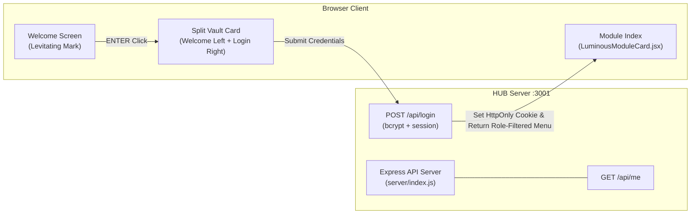

# 🚪 HUB-AEGIS Entry (Single Entry Gateway & Authentication Hub)

> **สถานะโค้ดปัจจุบัน (Code Status)**: ✅ Built & Implemented (Express Auth Server `:3001` + React/Vite UI `:5173`)  
> **ไฟล์โค้ดหลัก**: `HUB-AEGIS_Entry/src/App.jsx`, `HUB-AEGIS_Entry/src/screens/Login.jsx`, `HUB-AEGIS_Entry/server/index.js`, `HUB-AEGIS_Entry/server/routes/api.js`, `HUB-AEGIS_Entry/src/components/LuminousModuleCard.jsx`

---

## 🏗️ สถาปัตยกรรมภายใน HUB (Current Implementation)

---

## 🔑 ฟีเจอร์และการออกแบบความปลอดภัยล่าสุด (Verified Implementation)

1. **Split Vault Card Login System (รูปภาพรูปแบบที่ 2)**: 
   * โครงสร้างหน้าล็อกอินแบบการ์ดแยก (Split Vault Card) เมื่อผู้ใช้กด ENTER การ์ดจะขยายออกแบบ Smooth Spring Animation ด้านซ้ายเป็นแบรนด์และสัญลักษณ์ AEGIS ลอยแบบไร้น้ำหนัก (Levitating Mark) ด้านขวาเป็นฟอร์มเข้าสู่ระบบ
   * มีตัวแสดงสถานะความปลอดภัย 4 ชั้น (Defense-in-Depth Layers 0-3) พร้อม Texture ลายเฉียง Hatching
2. **Cyber-Physical Blue/Purple Aesthetic**:
   * ดีไซน์ยกระดับพรีเมียมด้วยสีฟ้า-ม่วง (Vibrant Blue & Deep Purple Gradients) บนปุ่ม SparkleButtons, สวิตช์ Toggle, Segmented TH/EN/ZH และไอคอนในแผ่นการ์ดโมดูล
   * มีเรืองแสง Backdrop Glow และเส้นขอบสีม่วงรอบการ์ดในโหมดมืด (Dark Mode)
3. **Server-Side Authorization & Anti-Enumeration**:
   * การตัดสินสิทธิ์ Role (Admin/User) ทำที่เซิร์ฟเวอร์เท่านั้น (Default-Deny) ส่งกลับเฉพาะเมนูที่มีสิทธิ์เข้าถึง และข้อความแสดงข้อผิดพลาด uniforme `"Invalid credentials"` เพื่อป้องกัน Username Enumeration

---

## 📂 รายการไฟล์ซอร์สโค้ดในโปรเจกต์ (Codebase Paths)
* `HUB-AEGIS_Entry/src/screens/Welcome.jsx` - หน้าต้อนรับ Welcome Screen
* `HUB-AEGIS_Entry/src/screens/Hub.jsx` - หน้าเลือกโมดูล Module Index
* `HUB-AEGIS_Entry/src/components/LuminousModuleCard.jsx` - การ์ดโมดูลพร้อมไฟ Luminous Effect
* `HUB-AEGIS_Entry/server/index.js` - Express Static Server (`:8000`)
* `HUB-AEGIS_Entry/deploy/deploy.sh` - สคริปต์สแกนและติดตั้งระบบอัตโนมัติ

---

## 🔗 เอกสารที่เกี่ยวข้อง
* [[00 - 🗺️ AEGIS System Overview]]
* [[02 - 💾 IDEA1 AEGIS Drive LC]]
* [[03 - 📹 IDEA2 AEGIS Monitor]]
* [[05 - 🛡️ Security Architecture]]
