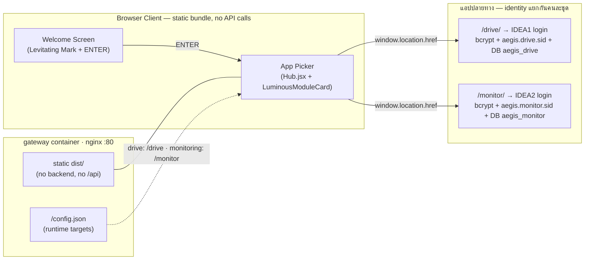

# 🚪 HUB-AEGIS Entry (Stateless App Picker — **ไม่ใช่** Authentication Hub)

> **สถานะโค้ดปัจจุบัน (Code Status)**: ✅ Static-only (เสิร์ฟจาก nginx ใน `gateway` image)
> — **ไม่มี backend, ไม่มี session, ไม่มีฐานข้อมูล, ไม่มีบัญชีผู้ใช้ของตัวเอง**
> **ไฟล์โค้ดหลัก**: `HUB-AEGIS_Entry/src/App.jsx`, `HUB-AEGIS_Entry/src/screens/Welcome.jsx`,
> `HUB-AEGIS_Entry/src/screens/Hub.jsx`, `HUB-AEGIS_Entry/src/components/LuminousModuleCard.jsx`,
> `HUB-AEGIS_Entry/public/config.json`, `gateway/nginx.conf`

> [!warning] เปลี่ยนสถาปัตยกรรม 2026-07-24 — ฟอร์มล็อกอินถูกลบออกทั้งหมด
> เอกสารฉบับก่อนหน้าบรรยาย HUB ว่ามี "Express Auth Server `:3001`" และ "Split Vault
> Card Login" — **ข้อมูลนั้นล้าสมัยแล้ว** ทั้งฟอร์มล็อกอิน โฟลเดอร์ `server/` และ
> โค้ดตรวจรหัสผ่านฝั่ง client ถูกลบทิ้งถาวร ดูเหตุผลใน [[concepts/Identity_Decoupling]]
> และหลักฐานการทดสอบใน `docs/auth-test.md` §12

---

## 🕳️ ช่องโหว่ที่เป็นเหตุให้ต้องรื้อ (Client-Side Auth Fallback)

`src/lib/auth.js` เดิมยิง `POST /api/login` แล้ว **ถ้าไม่มี backend ตอบ** จะถอยไป
ตรวจรหัสผ่านเองจากอาเรย์ `DEMO_ACCOUNTS` ที่ฝังอยู่ใน bundle:

```js
// โค้ดเดิม — ลบออกแล้ว
const DEMO_ACCOUNTS = [
  { username: 'user',  password: 'aegis-user',  role: 'User' },
  { username: 'admin', password: 'aegis-admin', role: 'Admin' },
]
// Fallback to in-memory mock if API is offline
const account = DEMO_ACCOUNTS.find((a) => a.username === uname && a.password === password)
```

เงื่อนไข "ไม่มี backend ตอบ" **เป็นจริงเสมอ** เพราะ `docker-compose.yml` ไม่เคยมี
service ชื่อ `hub` เลย — gateway เสิร์ฟ HUB เป็น static จึงตอบ `405` ทุกครั้ง
ผลคือใครก็ตามที่พิมพ์ `admin` / `aegis-admin` จะได้ session ระดับ Admin
**โดยไม่มีการบังคับฝั่งเซิร์ฟเวอร์แม้แต่ชั้นเดียว** — ขัดกับหลักข้อ 1 ของระบบโดยตรง

### วิธีแก้: ลบพื้นผิวการโจมตี ไม่ใช่เพิ่ม guard
ของที่ไม่มีอยู่ ย่อม bypass ไม่ได้ — จึงลบทิ้งทั้งหมดแทนที่จะสร้าง backend มารองรับ:

| ลบออก | เหตุผล |
|---|---|
| `src/screens/Login.jsx` | ฟอร์มล็อกอินของ HUB |
| `src/lib/auth.js` | `DEMO_ACCOUNTS` + fallback logic |
| `src/lib/modules.js` | กรองโมดูลตาม role ฝั่ง client (RBAC ที่ HUB ไม่ควรมี) |
| `server/` (ทั้งโฟลเดอร์) | auth/session/rateLimit ที่ไม่เคย deploy — โค้ด auth ที่ไม่ได้ใช้คือความเสี่ยงในตัวมันเอง |
| สตริงหมวด Login ใน `src/lib/strings.js` | รวมแถว LAYER 0–3 ที่บอกเป็นนัยว่า HUB ทำ authentication |

---

## 🏗️ สถาปัตยกรรมภายใน HUB (Current Implementation)



**จุดสำคัญ**: ลูกศรจาก AppPicker เป็น `window.location.href` (ออกจาก SPA จริง ๆ)
ไม่ใช่ route ภายใน — เพราะปลายทางเป็นคนละแอปที่ deploy แยกกันหลัง gateway
และ HUB **ไม่ส่งอะไรติดไปด้วยเลย** ไม่มี token ไม่มี cookie ไม่มี query param

---

## 🔑 ฟีเจอร์และการออกแบบล่าสุด (Verified Implementation)

1. **Welcome → App Picker (สองหน้าจอ)**:
   * หน้าแรกคือ "ประตู": AegisMark ลอยแบบไร้น้ำหนัก (Levitating Mark) + wordmark +
     tagline + ปุ่ม ENTER เดียว — ดีไซน์เดิมทุกประการ ไม่ได้แก้สไตล์
   * กด ENTER แล้วเข้าหน้าเลือกแอปทันที **ไม่มีขั้นตอนล็อกอินคั่นกลางอีกต่อไป**
   * การ์ดโมดูลยังเป็น `LuminousModuleCard` ชุดเดิม (Blue/Purple Command Center)
2. **ไม่มี RBAC ที่ HUB โดยเจตนา**:
   * รายการโมดูลเป็น **ดัชนีสาธารณะคงที่** ไม่กรองตาม role เพราะ HUB ไม่รู้จักใครเลย
   * การรู้ว่าโมดูลชื่ออะไรไม่ใช่ความลับ — ความลับอยู่ข้างใน ซึ่งอยู่หลัง login +
     RBAC ของแอปนั้น ๆ ทั้งหมด (ดู comment ใน `Hub.jsx`)
3. **Runtime config ไม่ต้อง rebuild**:
   * `public/config.json` แม็ป `drive → /drive`, `monitoring → /monitor`
     แก้บนเครื่อง deploy ได้เลย ไม่มี IP ฝังตายใน bundle
4. **Security headers เป็นของ nginx ล้วน**:
   * CSP (ไม่มี `unsafe-inline`/`unsafe-eval`), `X-Frame-Options: DENY`, `nosniff`,
     `Referrer-Policy: no-referrer`, HSTS, `Permissions-Policy` ปิด camera/mic/geo

---

## 🧪 หลักฐานว่าช่องโหว่ปิดแล้ว (`docs/auth-test.md` §12)

| ตรวจ | ผลจริง |
|---|---|
| สตริง `aegis-user`/`aegis-admin`/`DEMO_ACCOUNTS`/`/api/login` ใน bundle ที่ deploy | `0` |
| `POST http://localhost/api/login` | `405` (ไม่มีฝั่ง client รอผลนี้แล้วถอยไปตรวจเองอีกต่อไป) |
| request หมวด auth ที่หน้า HUB ยิงออก (วัดจาก browser) | `0` — มีแค่ `GET /` และ `GET /config.json` |
| `<input type=password>` / `<form>` บนหน้า HUB | `0` / `0` |
| `HUB-AEGIS_Entry/server/` | ไม่มีอยู่แล้ว |

---

## 📂 รายการไฟล์ซอร์สโค้ดในโปรเจกต์ (Codebase Paths)
* `HUB-AEGIS_Entry/src/App.jsx` - state machine สองหน้าจอ (welcome → hub)
* `HUB-AEGIS_Entry/src/screens/Welcome.jsx` - หน้าต้อนรับ Welcome Screen
* `HUB-AEGIS_Entry/src/screens/Hub.jsx` - หน้าเลือกแอป + hand-off ด้วย `window.location.href`
* `HUB-AEGIS_Entry/src/components/LuminousModuleCard.jsx` - การ์ดโมดูลพร้อมไฟ Luminous Effect
* `HUB-AEGIS_Entry/public/config.json` - ปลายทางของแต่ละโมดูล (แก้ได้ตอน deploy)
* `HUB-AEGIS_Entry/nginx.conf` - production nginx (443 + security headers + `/healthz`)
* `HUB-AEGIS_Entry/Dockerfile` - build vite → เสิร์ฟด้วย nginx (ไม่มี Node runtime แล้ว)
* `gateway/nginx.conf` - gateway ของ stack localhost (เสิร์ฟ HUB ที่ `/` + proxy `/drive/` `/monitor/`)
* `HUB-AEGIS_Entry/deploy/deploy.sh` - สคริปต์สแกนและติดตั้งระบบอัตโนมัติ

---

## 🔗 เอกสารที่เกี่ยวข้อง
* [[00 - 🗺️ AEGIS System Overview]]
* [[02 - 💾 IDEA1 AEGIS Drive LC]]
* [[03 - 📹 IDEA2 AEGIS Monitor]]
* [[05 - 🛡️ Security Architecture]]
* [[concepts/Identity_Decoupling]]
