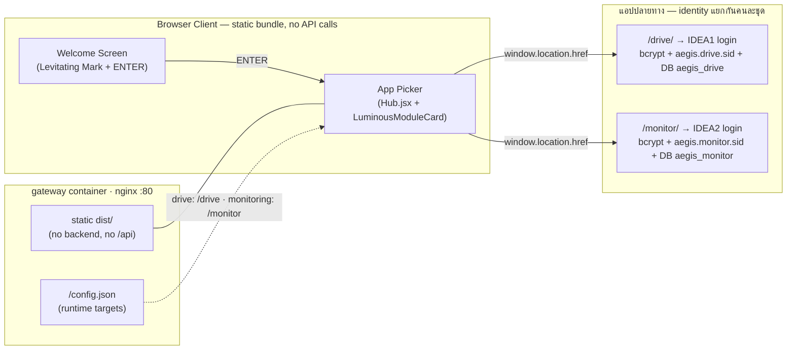

# 🚪 HUB-AEGIS Entry (Stateless App Picker — **ไม่ใช่** Authentication Hub)

> **สถานะโค้ดปัจจุบัน (Code Status)**: ✅ Static-only (เสิร์ฟจาก nginx ใน `gateway` image)
> — **ไม่มี backend, ไม่มี session, ไม่มีฐานข้อมูล, ไม่มีบัญชีผู้ใช้ของตัวเอง**
> **ไฟล์โค้ดหลัก**: `HUB-AEGIS_Entry/src/App.jsx`, `HUB-AEGIS_Entry/src/screens/Welcome.jsx`,
> `HUB-AEGIS_Entry/src/screens/Hub.jsx`, `HUB-AEGIS_Entry/src/components/LuminousModuleCard.jsx`,
> `HUB-AEGIS_Entry/public/config.json`, `gateway/nginx.conf`

> [!warning] เปลี่ยนสถาปัตยกรรม 2026-07-24 — ฟอร์มล็อกอินถูกลบออกทั้งหมด
> เอกสารฉบับก่อนหน้าบรรยาย HUB ว่ามี "Express Auth Server `:3001`" และ "Split Vault
> Card Login" — **ข้อมูลนั้นล้าสมัยแล้ว** ทั้งฟอร์มล็อกอิน โฟลเดอร์ `server/` และ
> โค้ดตรวจรหัสผ่านฝั่ง client ถูกลบทิ้งถาวร ดูเหตุผลใน [[concepts/Identity_Decoupling]]
> และหลักฐานการทดสอบใน `docs/auth-test.md` §12

---

## 🎨 ระบบซิงค์สถานะธีมข้ามแอปพลิเคชัน (Cross-App Theme Persistence) (2026-07-25)

ระบบ AEGIS ทั้ง 3 ส่วน (`HUB-AEGIS_Entry`, `IDEA1-AEGIS_Drive_LC`, `IDEA2-AEGIS_Monitor`) ถูกเชื่อมโยงระบบเลือกธีม (Dark Mode / Light Mode) ให้ตรงกัน 100% ผ่านกลไก:

1. **Shared Key `aegis_theme`ใน `localStorage`**: ทุกครั้งที่สลับธีมบนหน้า Welcome หรือ Hub ค่าจะถูกบันทึกลง `localStorage.setItem('aegis_theme', theme)`
2. **Seamless Initial Theme Hydration**: เมื่อกดสลับหน้าไปยัง Drive (`/drive/`) หรือ Monitor (`/monitor/`) หน้า Login และ Dashboard ปลายทางจะอ่านคีย์ `aegis_theme` มาสลับสีการ์ดและฉากหลังให้ตรงกับธีมเดิมทันที
3. **DOM Class & Spec Sync**: กำหนดคลาส `html.dark` และ `html.light` ควบคู่กับ `data-theme` บน `document.documentElement` เพื่อให้คลาส `@variant dark` ของ Tailwind CSS v4 ทำงานถูกต้องสมบูรณ์
4. **Cross-Tab Event Listener**: รองรับการเปลี่ยนธีมข้ามแท็บผ่าน `window.addEventListener('storage', ...)`

---

## 🕳️ ช่องโหว่ที่เป็นเหตุให้ต้องรื้อ (Client-Side Auth Fallback)

`src/lib/auth.js` เดิมยิง `POST /api/login` แล้ว **ถ้าไม่มี backend ตอบ** จะถอยไป
ตรวจรหัสผ่านเองจากอาเรย์ `DEMO_ACCOUNTS` ที่ฝังอยู่ใน bundle:

```js
// โค้ดเดิม — ลบออกแล้ว
const DEMO_ACCOUNTS = [
  { username: 'user',  password: 'aegis-user',  role: 'User' },
  { username: 'admin', password: 'aegis-admin', role: 'Admin' },
]
// Fallback to in-memory mock if API is offline
const account = DEMO_ACCOUNTS.find((a) => a.username === uname && a.password === password)
```

เงื่อนไข "ไม่มี backend ตอบ" **เป็นจริงเสมอ** เพราะ `docker-compose.yml` ไม่เคยมี
service ชื่อ `hub` เลย — gateway เสิร์ฟ HUB เป็น static จึงตอบ `405` ทุกครั้ง
ผลคือใครก็ตามที่พิมพ์ `admin` / `aegis-admin` จะได้ session ระดับ Admin
**โดยไม่มีการบังคับฝั่งเซิร์ฟเวอร์แม้แต่ชั้นเดียว** — ขัดกับหลักข้อ 1 ของระบบโดยตรง

### วิธีแก้: ลบพื้นผิวการโจมตี ไม่ใช่เพิ่ม guard
ของที่ไม่มีอยู่ ย่อม bypass ไม่ได้ — จึงลบทิ้งทั้งหมดแทนที่จะสร้าง backend มารองรับ:

| ลบออก | เหตุผล |
|---|---|
| `src/screens/Login.jsx` | ฟอร์มล็อกอินของ HUB |
| `src/lib/auth.js` | `DEMO_ACCOUNTS` + fallback logic |
| `src/lib/modules.js` | กรองโมดูลตาม role ฝั่ง client (RBAC ที่ HUB ไม่ควรมี) |
| `server/` (ทั้งโฟลเดอร์) | auth/session/rateLimit ที่ไม่เคย deploy — โค้ด auth ที่ไม่ได้ใช้คือความเสี่ยงในตัวมันเอง |
| สตริงหมวด Login ใน `src/lib/strings.js` | รวมแถว LAYER 0–3 ที่บอกเป็นนัยว่า HUB ทำ authentication |

---

## 🏗️ สถาปัตยกรรมภายใน HUB (Current Implementation)



**จุดสำคัญ**: ลูกศรจาก AppPicker เป็น `window.location.href` (ออกจาก SPA จริง ๆ)
ไม่ใช่ route ภายใน — เพราะปลายทางเป็นคนละแอปที่ deploy แยกกันหลัง gateway
และ HUB **ไม่ส่งอะไรติดไปด้วยเลย** ไม่มี token ไม่มี cookie ไม่มี query param

---

## 🔑 ฟีเจอร์และการออกแบบล่าสุด (Verified Implementation)

1. **Welcome → App Picker (สองหน้าจอ)**:
   * หน้าแรกคือ "ประตู": AegisMark ลอยแบบไร้น้ำหนัก (Levitating Mark) + wordmark +
     tagline + ปุ่ม ENTER เดียว — ดีไซน์เดิมทุกประการ ไม่ได้แก้สไตล์
   * กด ENTER แล้วเข้าหน้าเลือกแอปทันที **ไม่มีขั้นตอนล็อกอินคั่นกลางอีกต่อไป**
   * การ์ดโมดูลยังเป็น `LuminousModuleCard` ชุดเดิม (Blue/Purple Command Center)
2. **ไม่มี RBAC ที่ HUB โดยเจตนา**:
   * รายการโมดูลเป็น **ดัชนีสาธารณะคงที่** ไม่กรองตาม role เพราะ HUB ไม่รู้จักใครเลย
   * การรู้ว่าโมดูลชื่ออะไรไม่ใช่ความลับ — ความลับอยู่ข้างใน ซึ่งอยู่หลัง login +
     RBAC ของแอปนั้น ๆ ทั้งหมด (ดู comment ใน `Hub.jsx`)
3. **Runtime config ไม่ต้อง rebuild**:
   * `public/config.json` แม็ป `drive → /drive`, `monitoring → /monitor`
     แก้บนเครื่อง deploy ได้เลย ไม่มี IP ฝังตายใน bundle
4. **Security headers เป็นของ nginx ล้วน**:
   * CSP (ไม่มี `unsafe-inline`/`unsafe-eval`), `X-Frame-Options: DENY`, `nosniff`,
     `Referrer-Policy: no-referrer`, HSTS, `Permissions-Policy` ปิด camera/mic/geo

---

## ✅ แก้แล้ว — `HUB-AEGIS_Entry/nginx.conf` เคยทำให้ Drive ใช้งานไม่ได้เลย (พบ+แก้ 2026-07-26)

> **วิธียืนยัน**: รัน nginx จริงด้วย **ไฟล์ config ตัวจริงแบบไม่แก้แม้แต่บรรทัดเดียว**
> (`md5sum` ในคอนเทนเนอร์ตรงกับไฟล์ในรีโป) โดยสร้าง docker network subnet `192.168.10.0/24`
> แล้วผูก IP จริง `192.168.10.11` / `.12` ให้คอนเทนเนอร์ drive/monitor + ออก self-signed cert
> ที่ path ที่ config ระบุ → **ทดสอบทั้ง TLS block และ upstream IP ของจริง ไม่ใช่การจำลอง**

**ปัญหาเดิม**: config นี้จงใจ **ไม่ตัด prefix** `/drive` (คอมเมนต์เดิมเขียนว่า "ห้ามใช้ rewrite
ตัด /drive ออก — แอปปลายทางต้อง mount ตัวเองที่ base path /drive") แต่ **`IDEA1/server/app.js`
ไม่เคย mount ตัวเองที่ `/drive`** — ใช้ `express.static(DIST)` และ `app.use('/api', …)` ที่ **root**
คอมเมนต์จึงบรรยายสิ่งที่ไม่มีอยู่จริง และเป็นต้นเหตุที่บั๊กนี้อยู่มานานโดยไม่มีใครสงสัย

| ตรวจผ่าน config ตัวจริง | **ก่อนแก้** | **หลังแก้** |
|---|---|---|
| `/drive/assets/index-*.js` | `200` **`text/html`** 556B (index.html) → จอขาว | `200` **`application/javascript`** 922,922B |
| `/drive/assets/index-*.css` | `200` **`text/html`** 556B | `200` **`text/css`** 122,417B |
| `POST /drive/api/login` (รหัสถูก) | **`404`** `text/html` — ล็อกอินไม่ได้เลย | **`200`** `application/json` 940B |
| `/drive/healthz` | `200` `text/html` 556B | `200` `application/json` — `{"ok":true,"db":"postgres"}` |
| `/drive/files`, `/drive/some/deep/route` | `200 text/html` (fallback ถูก แต่ไร้ความหมาย) | `200 text/html` 556B — fallback ถูกต้อง |
| `/drive` (ไม่มี slash) | จับ `location /drive` ตรง ๆ | **`301` → `/drive/`** |
| **จำนวน CSP header** | **2 อัน** (Express มี `wasm-unsafe-eval` · nginx ไม่มี → เบราว์เซอร์ใช้ส่วนที่เข้มที่สุดของทั้งคู่ → **Argon2id รันไม่ได้**) | **1 อัน** มี `'wasm-unsafe-eval'` |
| security header อื่น ๆ | ซ้ำ 2 ชุดทุกตัว (`DENY, DENY` ฯลฯ) | **1 ชุด** ทุกตัว |

**สิ่งที่แก้ใน `location /drive/`** (ยึด `gateway/nginx.conf` เป็นแม่แบบ — ชุดนั้นถูกต้องอยู่แล้ว):
1. `rewrite ^/drive/?(.*)$ /$1 break;` + เปลี่ยนเป็น `location /drive/` และเพิ่ม
   `location = /drive { return 301 /drive/; }` — **เลือกแก้ที่ nginx ไม่ใช่เพิ่ม `BASE_PATH`
   ใน `server/app.js`** เพราะนั่นจะต้องแตะโค้ดที่ IDEA2 ใช้ร่วมกันโดยไม่ได้ประโยชน์เพิ่ม
2. `proxy_hide_header` ครบ 6 ตัว + `add_header` ครบ 6 ตัวที่ระดับ location โดย CSP ของ
   `/drive/` เท่านั้นที่มี `'wasm-unsafe-eval'`
   > ⚠️ **กฎ nginx ที่พลาดกันบ่อยและเป็นเหตุผลที่ต้องประกาศครบ 6 ตัว**: ถ้า location ใดมี
   > `add_header` แม้แค่ตัวเดียว **add_header ทั้งหมดจาก server block จะไม่ถูกสืบทอดลงมาเลย**
   > ถ้าประกาศแต่ CSP อย่างเดียว `/drive/*` จะเหลือ security header เฉพาะที่ Express ส่งมา
   > (หลุดการรับประกันของ nginx) — จึงประกาศครบทั้งชุดและซ่อนของ upstream ทั้งชุด

**ผลข้างเคียง: ไม่มี** — เทียบ response ของ `/monitor/*` และหน้า HUB (`/`) ก่อน/หลัง
ด้วย `diff` แล้ว **เหมือนกันทุกไบต์** และ `nginx -t` ผ่าน

### ✅ แก้แล้ว: IDEA2 / Monitor พังแบบเดียวกันเป๊ะ + พอร์ต ingest guard มาในคอมมิตเดียว (2026-07-26)

`location /monitor` ก็ไม่ตัด prefix เช่นกัน (`IDEA2/server/index.js` mount `express.static(DIST)`
และ `app.use('/api', …)` ที่ **root** เหมือน IDEA1 ทุกประการ) — แก้ด้วยแบบแผนเดียวกับ `/drive/`

| ตรวจผ่าน config ตัวจริง | **ก่อนแก้** | **หลังแก้** |
|---|---|---|
| `/monitor/assets/index-*.js` | `200` **`text/html`** 587B → จอขาว | `200` **`application/javascript`** 404,831B |
| `/monitor/assets/index-*.css` | `200` **`text/html`** 587B | `200` **`text/css`** 101,638B |
| `POST /monitor/api/login` (รหัสถูก) | **`404`** `text/html` — ล็อกอินไม่ได้เลย | **`200`** `application/json` 628B |
| `POST /monitor/api/login` (รหัสผิด) | `404` `text/html` | `401` `{"error":"Invalid credentials"}` |
| `/monitor/healthz` | `200` `text/html` 587B | `200` `application/json` — `{"ok":true,"db":"postgres"}` |
| `/monitor/api/me` (ไม่มีเซสชัน) | `200 text/html` 587B | `401` `{"error":"Not authenticated"}` |
| `/monitor/dashboard` (deep route) | `200 text/html` 587B | `200 text/html` 587B — fallback ถูกต้อง |
| `/monitor` (ไม่มี slash) | จับ `location /monitor` ตรง ๆ | **`301` → `/monitor/`** |

**🛡️ ingest guard — เหตุผลที่ต้องมาในคอมมิตเดียวกัน ห้ามแยก**: ก่อนแก้ ทุก path ใต้
`/monitor/internal/*` ตอบ `404` อยู่แล้ว **แต่เป็น 404 ที่ออกมาจาก Express**
(`Cannot POST /monitor/internal/detections`) เพราะ prefix ไม่ถูกตัด — ไม่ใช่ 404 จาก "นโยบาย"
ของ edge เลย พูดอีกอย่าง: พื้นผิวนี้ถูกบังไว้ด้วย **บั๊ก** ไม่ใช่ด้วยการตัดสินใจ
(หลักฐานเพิ่ม: `GET /monitor/internal/anything` ก่อนแก้ตอบ `200` index.html = ไม่มีนโยบายอยู่จริง)
พอเติม rewrite ปลายทางจะกลายเป็น `/internal/detections` ที่ ingest จริงทันที

> 🔴 **สิ่งที่ค้นพบและทำให้ "ลอก guard จาก gateway มาตรง ๆ" ไม่ปลอดภัย**:
> `location` แบบ prefix ของ nginx เป็น **case-sensitive** แต่ **Express match path แบบ
> case-INSENSITIVE ตามค่าเริ่มต้น** — วัดจริงกับ `monitor:8002` แล้ว
> `POST /Internal/detections` · `/INTERNAL/detections` · `/internal/Detections`
> → **`201 Created` ทั้งหมด** (เขียนลงตาราง `detections` จริง)
> ⇒ ถ้าใช้ `location /monitor/internal/` แบบตัวอักษรตรง ๆ ตามที่ `gateway/nginx.conf` ใช้
> **จะถูกข้ามได้ด้วยการพิมพ์ `/monitor/Internal/detections` เฉย ๆ**
> จึงใช้ **`location ~* ^/monitor/internal(/|$) { return 404; }`** แทน — `~*` ปิดครบทุกรูปแบบ
> ตัวพิมพ์ · `(/|$)` ครอบทั้ง `/monitor/internal` เปล่า ๆ และทุก path ใต้มัน โดยไม่เผลอบล็อก
> เพื่อนบ้าน (`/monitor/internal-notes`, `/monitor/internals`, `/monitor/internalx/y` → `200` SPA)
> ⚠️ **`gateway/nginx.conf` มีช่องเดียวกันนี้อยู่ (ยังไม่แก้ — อยู่นอกขอบเขตคอมมิตนี้)**

**ผลวัด guard (ผ่าน HUB :443 ทั้งหมดหลังแก้ = `404` ของ nginx เอง body มี `nginx/1.31.3`)**:
`/monitor/internal/{detections,clips,alerts}` ทั้งมี/ไม่มี API key · `/monitor/internal/` ·
`/monitor/internal/anything` · `/monitor/internal` (ไม่มี slash) · `/monitor//internal/detections` ·
`/monitor/internal%2Fdetections` · `/monitor/./internal/detections` · `/monitor/Internal/detections` ·
`?bypass=1` — **14 คำขอ เขียนลง DB ศูนย์แถว** (`SELECT camera_id, count(*) FROM detections`
เหลือเฉพาะ control ที่ยิงตรงไป `monitor:8002` ซึ่งได้ `201`) ⇒ พิสูจน์ว่า endpoint **live จริง**
และตัวที่ปฏิเสธคือ edge ไม่ใช่ความบังเอิญ

> ℹ️ IDEA1/Drive **ไม่มี** mount `/internal` เลย (`server/app.js` มีแค่ `app.use('/api', …)`)
> จึงไม่ต้องมี guard ฝั่ง `/drive/` — ตรวจแล้ว `/drive/internal/detections` เป็นแค่ SPA fallback

### ✅ แก้แล้วด้วย: `Host $host` → `$http_host` (ปิดกับดักพอร์ต)
`$host` = ชื่อโฮสต์ที่ **ตัดพอร์ตออกแล้ว** · `$http_host` = header `Host` ดิบของเบราว์เซอร์
(มีพอร์ตติดมา) ชั้นที่ 2 ของ CSRF ทั้งสองแอปเทียบ `new URL(origin).host !== req.headers.host`
→ ถ้า deploy บนพอร์ตอื่นที่ไม่ใช่ `:443` เบราว์เซอร์ส่ง `Origin: https://host:8443` แต่ backend
เห็น `Host: host` = ไม่ตรงกัน = **`403 CSRF_ORIGIN_MISMATCH` ทั้งที่รหัสผ่านถูก** และ UI โชว์แค่
"คำขอถูกปฏิเสธ" (เดาไม่ออกว่าเกี่ยวกับ nginx) **วัดก่อน-หลังบน Host/Origin `:8443` จริง**:

| | **ก่อน (`$host`)** | **หลัง (`$http_host`)** |
|---|---|---|
| `POST /drive/api/login` | **`403`** `{"code":"CSRF_ORIGIN_MISMATCH"}` | **`200`** `application/json` |
| `POST /monitor/api/login` | `404` (พังจาก prefix อยู่แล้ว) | **`200`** `application/json` |

บน `:443` มาตรฐานทั้งสองค่าให้ผลเหมือนกัน — นี่คือ **การถอนกับดัก ไม่ใช่การแก้บั๊กที่เห็นอยู่วันนี้**
`X-Forwarded-Host` เปลี่ยนตามด้วยเหตุผลเดียวกัน (ยังไม่มีโค้ดฝั่งแอปอ่านมัน — `grep` = 0 จุด)

### ⚠️ ยังค้าง (เจอระหว่างตรวจ ยังไม่แก้)
* **`/monitor/*` มี security header ซ้ำ 2 ชุด** (`csp_header_count=2`) — แบบเดียวกับที่ `/drive/`
  เคยเป็นก่อนแก้ ต่างกันที่ **CSP ของ Express กับของ nginx เป็นสตริงเดียวกันเป๊ะ** จึงยัง
  ไม่ก่อความเสียหายเชิงฟังก์ชัน (ไม่เหมือน `/drive` ที่ `wasm-unsafe-eval` หายไป) ถ้าจะจัดให้
  เหลือชั้นเดียวต้องใส่ `proxy_hide_header` ×6 + `add_header` ×6 ใน `location /monitor/`
* **ฟอนต์ `data:` ถูก CSP บล็อก** — `font-src 'self'` แต่ bundle ฝังฟอนต์บางตัวเป็น `data:` URI
  (เห็น console error ตอนทดสอบ) **เป็นของเดิม ไม่ใช่ผลจากการแก้ครั้งนี้**: `font-src 'self'`
  เหมือนกันทั้งใน `securityHeaders.js`, CSP ระดับ server ของ HUB และตัวใหม่ของ `/drive/`
  ถ้าจะแก้คือเติม `data:` ใน `font-src`

---

## 🧪 หลักฐานว่าช่องโหว่ปิดแล้ว (`docs/auth-test.md` §12)

| ตรวจ | ผลจริง |
|---|---|
| สตริง `aegis-user`/`aegis-admin`/`DEMO_ACCOUNTS`/`/api/login` ใน bundle ที่ deploy | `0` |
| `POST http://localhost/api/login` | `405` (ไม่มีฝั่ง client รอผลนี้แล้วถอยไปตรวจเองอีกต่อไป) |
| request หมวด auth ที่หน้า HUB ยิงออก (วัดจาก browser) | `0` — มีแค่ `GET /` และ `GET /config.json` |
| `<input type=password>` / `<form>` บนหน้า HUB | `0` / `0` |
| `HUB-AEGIS_Entry/server/` | ไม่มีอยู่แล้ว |

---

## 📂 รายการไฟล์ซอร์สโค้ดในโปรเจกต์ (Codebase Paths)
* `HUB-AEGIS_Entry/src/App.jsx` - state machine สองหน้าจอ (welcome → hub)
* `HUB-AEGIS_Entry/src/screens/Welcome.jsx` - หน้าต้อนรับ Welcome Screen
* `HUB-AEGIS_Entry/src/screens/Hub.jsx` - หน้าเลือกแอป + hand-off ด้วย `window.location.href`
* `HUB-AEGIS_Entry/src/components/LuminousModuleCard.jsx` - การ์ดโมดูลพร้อมไฟ Luminous Effect
* `HUB-AEGIS_Entry/public/config.json` - ปลายทางของแต่ละโมดูล (แก้ได้ตอน deploy)
* `HUB-AEGIS_Entry/nginx.conf` - production nginx (443 + security headers + `/healthz`)
* `HUB-AEGIS_Entry/Dockerfile` - build vite → เสิร์ฟด้วย nginx (ไม่มี Node runtime แล้ว)
* `gateway/nginx.conf` - gateway ของ stack localhost (เสิร์ฟ HUB ที่ `/` + proxy `/drive/` `/monitor/`)
* `HUB-AEGIS_Entry/deploy/deploy.sh` - สคริปต์สแกนและติดตั้งระบบอัตโนมัติ

---

## 🔗 เอกสารที่เกี่ยวข้อง
* [[00 - 🗺️ AEGIS System Overview]]
* [[02 - 💾 IDEA1 AEGIS Drive LC]]
* [[03 - 📹 IDEA2 AEGIS Monitor]]
* [[05 - 🛡️ Security Architecture]]
* [[concepts/Identity_Decoupling]]
