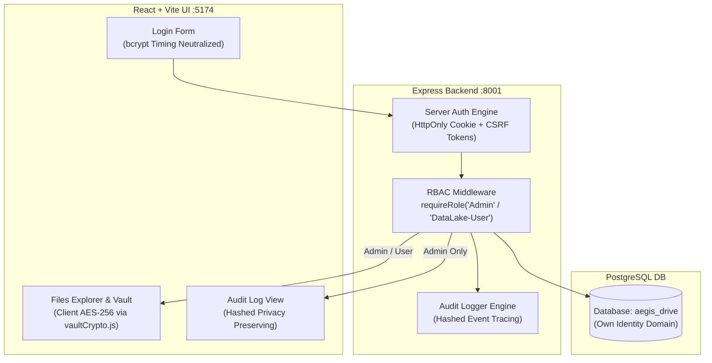

# 💾 IDEA1: AEGIS Drive LC (Secure NAS & Data Lake)

> **สถานะโค้ดปัจจุบัน (Code Status)**: ✅ Built & Implemented (Backend Express `:8001` + Frontend React/Vite `:5174` + Database `aegis_drive`)  
> **ไฟล์โค้ดหลัก**: `IDEA1-AEGIS_Drive_LC/server/`, `IDEA1-AEGIS_Drive_LC/src/lib/api.js`, `IDEA1-AEGIS_Drive_LC/src/lib/vaultCrypto.js`, `IDEA1-AEGIS_Drive_LC/src/screens/`

---

## 🆕 Admin Provisioning & Force Password Reset (2026-07-21)

Closed-registration bootstrap and account provisioning are now real (write to
`aegis_drive` Postgres, not the earlier demo-only stub):

* **Day-0 admin bootstrap** (`server/db/bootstrapAdmin.js`) — on first boot with
  zero `Admin` rows, reads `ADMIN_BOOTSTRAP_USERNAME` +
  `ADMIN_BOOTSTRAP_PASSWORD_HASH` from the environment and inserts the initial
  Admin. Only accepts an **already-hashed bcrypt value** — never a raw
  password — generated locally via `scripts/hash_password.py` (getpass,
  never echoed/logged/in shell history). Refuses to boot if the value doesn't
  look like a bcrypt hash. No-ops once any Admin exists (idempotent, safe on
  every container restart).
* **`POST /api/users`** (Admin only) provisions a `DataLake-User` with a
  server-generated, high-entropy temporary password (`generateTempPassword()`
  in `server/db/connection.js`) — the client can never supply the initial
  password. The plaintext temp password is returned **once** in the API
  response (never logged, never audited) for the Admin to relay out-of-band;
  `src/screens/Access.jsx` now shows a one-time reveal panel (copy button,
  matches the existing recovery-phrase reveal pattern in `Settings.jsx`)
  instead of silently discarding it. This endpoint deliberately cannot create
  another Admin, to limit blast radius if an Admin session is hijacked.
* **Force Password Reset** — new accounts (and the Day-0 admin) are created
  with `must_reset_password = TRUE`. `server/middleware/requireRole.js` blocks
  every endpoint except `/me`, `/logout`, and the new `POST /api/password/reset`
  until the user changes it (current-password re-verification + 12-char
  minimum). The flag lives in the session (`server/auth/session.js`) and is
  cleared in the same request that updates the DB hash, so no re-login is
  needed after resetting.

---

---

## 🏗️ สถาปัตยกรรมระบบที่พัฒนาขึ้นจริง (Verified Architecture)

---

## 🔒 ฟีเจอร์ความปลอดภัยหลักที่เปิดใช้งานในโค้ด (Implemented Features)

1. **Own Identity Domain**:
   * ครอบครองฐานข้อมูล `aegis_drive` เป็นอิสระ แยกบัญชีผู้ใช้ `Admin` และ `DataLake-User` ออกจากโมดูลอื่นเด็ดขาด
2. **Client-Side Vault Encryption (`src/lib/vaultCrypto.js`)**:
   * ใช้ Web Crypto API (AES-GCM 256-bit + PBKDF2 100,000 iterations) เข้ารหัสไฟล์จากหน้าเบราว์เซอร์ก่อนส่งขึ้น NAS
   * NAS ทำหน้าที่เป็นโกดังเก็บ Ciphertext เท่านั้น แม้แต่ Admin ก็อ่านไฟล์ใน Vault ไม่ได้หากไม่มีกุญแจผู้ใช้ (Zero-Knowledge)
3. **Bcrypt Timing Equalization & Lockout**:
   * ระบบตรวจสอบรหัสผ่านใช้เวลาเปรียบเทียบเท่ากันเสมอกันแม้ไม่พบ Username (ป้องกัน Timing Attack)
   * ระบบบล็อกบัญชีอัตโนมัติเมื่อป้อนรหัสผิดเกิน 5 ครั้ง พร้อม Exponential Backoff
4. **VLAN-Aware Secure Share**:
   * กำหนดลิงก์แชร์ไฟล์ที่จำกัดการเข้าถึงเฉพาะวง VLAN/Subnet ที่อนุญาต ควบคุมผ่าน UFW Firewall ในระดับ Network Layer
5. **Privacy-Preserving Audit Log (`src/screens/Audit.jsx`)**:
   * ชื่อไฟล์ถูกเข้ารหัสเป็นค่าแฮช/UUID ก่อนบันทึกลง Metadata Layer ทำให้ Admin มองเห็นเฉพาะกิจกรรม แต่ไม่เห็นชื่อไฟล์จริงตามหลัก PDPA

---

## 📂 รายการไฟล์ซอร์สโค้ดสำคัญ (Codebase Paths)
* `IDEA1-AEGIS_Drive_LC/server/index.js` - Express API Server (`:8001`)
* `IDEA1-AEGIS_Drive_LC/src/lib/api.js` - HTTP Request Abstraction พร้อมระบบส่ง HttpOnly Cookie & CSRF Token
* `IDEA1-AEGIS_Drive_LC/src/lib/vaultCrypto.js` - ขุมพลังการเข้ารหัส Client-Side AES-256 / PBKDF2
* `IDEA1-AEGIS_Drive_LC/src/screens/Vault.jsx` - หน้าจอ Private Vault สำหรับเก็บไฟล์ลับเฉพาะ
* `IDEA1-AEGIS_Drive_LC/src/screens/Audit.jsx` - หน้าตรวจสอบ Audit Log ความปลอดภัย
* `IDEA1-AEGIS_Drive_LC/src/screens/Shares.jsx` - ระบบแชร์ไฟล์ล็อกวงเครือข่าย VLAN
* `IDEA1-AEGIS_Drive_LC/server/db/bootstrapAdmin.js` - Day-0 admin bootstrap จาก bcrypt hash ใน env var
* `IDEA1-AEGIS_Drive_LC/scripts/hash_password.py` - เครื่องมือฝั่งผู้ดูแลระบบสร้าง bcrypt hash (getpass, ไม่มี plaintext ค้าง)
* `IDEA1-AEGIS_Drive_LC/src/screens/Access.jsx` - จอ Admin governance พร้อม one-time reveal ของรหัสผ่านชั่วคราว

---

## 🔗 เอกสารที่เกี่ยวข้อง
* [[00 - 🗺️ AEGIS System Overview]]
* [[01 - 🚪 HUB-AEGIS Entry]]
* [[concepts/Three_Layer_Data_Lake]]
* [[concepts/Mnemonic_Recovery_and_Zero_Knowledge]]
* [[concepts/Identity_Decoupling]]
