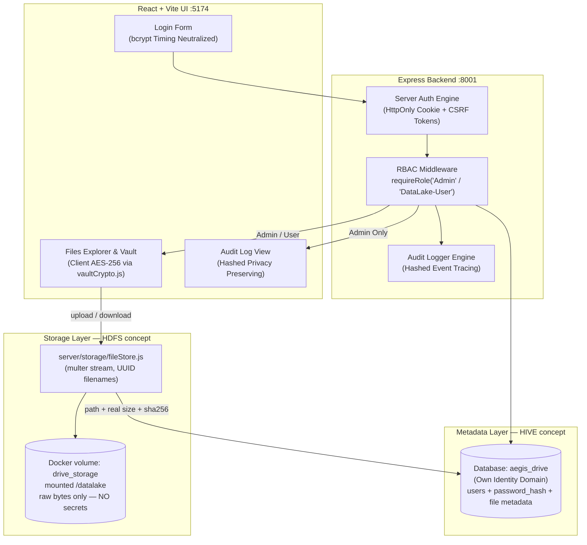

# 💾 IDEA1: AEGIS Drive LC (Secure NAS & Data Lake)

> **สถานะโค้ดปัจจุบัน (Code Status)**: ✅ Built & Implemented (Backend Express `:8001` + Frontend React/Vite `:5174` + Database `aegis_drive` + Cyber-Physical Dual Theme Light/Dark Mode + Volumetric Aura Glow + Framer Motion Physics + Tailwind v4 `@variant dark`)  
> **ไฟล์โค้ดหลัก**: `IDEA1-AEGIS_Drive_LC/server/`, `IDEA1-AEGIS_Drive_LC/src/lib/api.js`, `IDEA1-AEGIS_Drive_LC/src/lib/vaultCrypto.js`, `IDEA1-AEGIS_Drive_LC/src/screens/`

---

## 🆕 Storage Layer — ชั้นเก็บไฟล์จริงเปิดใช้งานแล้ว (2026-07-22)

ก่อนหน้านี้ Data Lake มีแค่ **Metadata Layer** จริง ๆ — endpoint อัปโหลดรับเฉพาะ
`{name, size, sha256}` แล้วเขียนแถวใน `files` ที่ชี้ไปยัง path สมมุติ
(`/datalake/uploads/<ชื่อไฟล์>`) โดยไม่มี byte ไหนถูกเขียนลงดิสก์เลย ตอนนี้ชั้น
Storage ของจริงถูกสร้างแล้ว:

* **`server/storage/fileStore.js` (ใหม่)** — Storage Layer (แนวคิด HDFS) เป็น
  filesystem ธรรมดาบน Docker named volume `drive_storage` ที่ mount ไว้ที่
  `/datalake` ในคอนเทนเนอร์ drive **เฉพาะ IDEA1 เท่านั้น** (monitor/gateway ไม่ mount)
  — ไม่ใช้ Hadoop/Hive เพราะ Beelink 8GB รับไม่ไหวและไม่จำเป็น สิ่งที่ต้องการคือ
  "ไฟล์ดิบอยู่คนละชั้นกับ metadata" เท่านั้น
* **`POST /api/files/upload`** เปลี่ยนเป็น `multipart/form-data` ผ่าน **multer 2.x**
  (`diskStorage` แบบ stream — ไฟล์ 1GB ไม่กิน RAM 1GB บนเครื่อง 8GB) เพดาน 1 GiB/ไฟล์
* **`GET /api/files/:id/download` (ใหม่)** — stream byte จริงจากดิสก์ พร้อม
  `Content-Disposition: attachment` + `X-Content-Type-Options: nosniff` เสมอ
  (ไฟล์ HTML/SVG ที่ผู้ใช้อัปโหลดต้องไม่ถูก render ใน origin เดียวกัน = กัน XSS)
* **`DELETE /api/files/:id`** ลบ byte บนดิสก์ตามหลังลบแถว metadata — ไฟล์ที่ผู้ใช้
  "ลบแล้ว" ต้องไม่นอนค้างบนดิสก์ต่อไปโดยไม่มีใครเห็นและไม่มีใครลบได้อีก
  * **🛡️ ด่าน ownership (แก้ช่องโหว่ 2026-07-26)** — เดิมมีแค่ `requireAuth` ซึ่งบอกได้แค่
    "เป็นใครคนหนึ่งที่ล็อกอินแล้ว" **ไม่ได้ตรวจว่าไฟล์เป็นของใคร → ผู้ใช้ที่ล็อกอินคนไหน
    ก็ลบไฟล์ของคนอื่นได้ ทั้งแถว metadata และ bytes บนดิสก์** (ลบแล้วกู้ไม่ได้ ไม่มี trash)
    ตอนนี้เทียบ `ownerId` (id ของบัญชี จาก `files.uploaded_by`) ไม่ตรง → **`403` + audit
    `FILE_DELETE / DENIED`** · ห้ามเทียบด้วย `uploader` (display name) เพราะชื่อซ้ำ/เปลี่ยนได้
  * ⚠️ **ไม่มีข้อยกเว้นให้ Admin โดยเจตนา** — `rbac/permissions.js` ระบุว่าสอง role
    "จัดการไฟล์ได้เท่ากัน" Admin ได้เพิ่มแค่จอ governance ไม่ใช่สิทธิ์เหนือไฟล์ผู้อื่น
    (เทสต์ยืนยันทั้งสองทิศทาง — Admin ลบของ user ไม่ได้ และ user ลบของ Admin ไม่ได้)
  * ⚠️ **ช่องว่างที่รู้อยู่**: `ownerId` เป็น `null` ได้ (`uploaded_by … ON DELETE SET NULL`)
    ไฟล์ที่เจ้าของถูกลบบัญชีไปแล้วจึง **ลบไม่ได้เลยทั้งสองโหมด** — เป็นฝั่ง fail-secure
    แต่ยังไม่มีเส้นทางเก็บกวาดไฟล์กำพร้า (งานแยก)

**ข้อตัดสินใจด้านความปลอดภัยของชั้นนี้:**

1. **ชื่อไฟล์บนดิสก์เป็น UUID ทึบ** (`<uuid>.bin`) ไม่มีเศษของชื่อที่ผู้ใช้ตั้งปนเลย
   แม้แต่นามสกุล → (ก) คนที่เข้าถึงได้แค่ดิสก์อ่านไม่ออกว่าไฟล์ไหนคืออะไร
   (ข) ชื่อจากผู้ใช้ไม่มีวันกลายเป็น path บนดิสก์ = **ตัด path traversal ตั้งแต่ต้นทาง**
   ไม่ต้องพึ่ง sanitize ที่อาจพลาด — ชื่อจริงอยู่คอลัมน์ `name` ใน Metadata Layer
2. **`size` และ `sha256` เซิร์ฟเวอร์คำนวณเองจาก byte บนดิสก์เสมอ** ไม่เชื่อค่าที่ client
   แจ้ง — ถ้า client แนบ sha256 มาด้วยจะถูกใช้แค่ "เทียบ" ถ้าไม่ตรง = ไฟล์เพี้ยน
   ระหว่างทาง → ตอบ **422** ทิ้งทั้ง byte และไม่เขียน metadata
3. **ลำดับ write ต้องเป็น byte → metadata** ถ้าสลับกันแล้วดิสก์ล้มเหลวจะเหลือแถวที่ชี้ไป
   ยังไฟล์ที่ไม่มีอยู่จริง (metadata โกหก) และถ้า INSERT ล้มเหลวทีหลัง byte ถูกลบทิ้ง
   (`discardUploaded`) — ไม่เหลือไฟล์กำพร้า
4. **`resolveKey()` บังคับว่า path ที่ resolve แล้วต้องอยู่ใต้ `STORAGE_ROOT` เสมอ**
   ต่อให้ค่าใน DB ถูกแก้ให้เป็น `../../etc/passwd` ก็ออกนอกกรอบไม่ได้
5. **ห้ามมีรหัสผ่าน/ความลับใด ๆ ตกลงมาชั้นนี้** — bcrypt hash ทุกตัวอยู่ Metadata Layer
   เท่านั้น ชั้นนี้ถูกออกแบบให้ "ขโมยดิสก์ไปทั้งลูกก็ยังไม่ได้รหัสผ่านใคร"
6. **`initStorage()` ถูกเรียกก่อนเปิดพอร์ต** และเขียนไฟล์ทดสอบจริงหนึ่งครั้งเพื่อพิสูจน์
   สิทธิ์ — named volume ที่ mount มาใหม่มักเป็นของ `root` ขณะที่คอนเทนเนอร์รันด้วย user
   `node` ปัญหานี้ต้องดังตั้งแต่บูต ไม่ใช่ตอนผู้ใช้กดอัปโหลดแล้วเจอ 500 เงียบ ๆ
   (`Dockerfile` จึง `mkdir -p /datalake && chown node:node` **ก่อน** `USER node`)

ผลตรวจรอบ upload → download เทียบ byte ต่อ byte อยู่ใน `docs/auth-test.md` ข้อ 9

---

## 🆕 Admin Provisioning & Force Password Reset (2026-07-21)

Closed-registration bootstrap and account provisioning are now real (write to
`aegis_drive` Postgres, not the earlier demo-only stub):

* **Day-0 admin bootstrap** (`server/db/bootstrapAdmin.js`) — on first boot with
  zero `Admin` rows, reads `ADMIN_BOOTSTRAP_USERNAME` +
  `ADMIN_BOOTSTRAP_PASSWORD_HASH` from the environment and inserts the initial
  Admin. Only accepts an **already-hashed bcrypt value** — never a raw
  password — generated locally via `scripts/hash_password.py` (getpass,
  never echoed/logged/in shell history). Refuses to boot if the value doesn't
  look like a bcrypt hash. No-ops once any Admin exists (idempotent, safe on
  every container restart).
* **`POST /api/users`** (Admin only) provisions a `DataLake-User` with a
  server-generated, high-entropy temporary password (`generateTempPassword()`
  in `server/db/connection.js`) — the client can never supply the initial
  password. The plaintext temp password is returned **once** in the API
  response (never logged, never audited) for the Admin to relay out-of-band;
  `src/screens/Access.jsx` now shows a one-time reveal panel (copy button)
  instead of silently discarding it. This endpoint deliberately cannot create
  another Admin, to limit blast radius if an Admin session is hijacked.
  > ⚠️ คำบรรยายเดิมของบรรทัดนี้อ้างอิง "recovery-phrase reveal pattern ใน `Settings.jsx`"
  > — การ์ดนั้น **ถูกลบทั้งใบแล้ว 2026-07-26** เพราะเป็นคำสัญญาเท็จ (ดู
  > [[concepts/Mnemonic_Recovery_and_Zero_Knowledge]]) · one-time reveal ของจอ Access
  > **ยังอยู่และยังถูกต้อง** เพราะ temp password มีอยู่จริงฝั่งเซิร์ฟเวอร์ — ต่างกันตรงนี้เอง:
  > reveal ที่ถูกต้องคือการโชว์ความลับที่ระบบสร้างจริง ไม่ใช่โชว์คำที่ไม่ผูกกับอะไรเลย
* **Force Password Reset** — new accounts (and the Day-0 admin) are created
  with `must_reset_password = TRUE`. `server/middleware/requireRole.js` blocks
  every endpoint except `/me`, `/logout`, and the new `POST /api/password/reset`
  until the user changes it (current-password re-verification + 12-char
  minimum). The flag lives in the session (`server/auth/session.js`) and is
  cleared in the same request that updates the DB hash, so no re-login is
  needed after resetting.
* **Local test fixture seeding** (`server/db/seedTestFixtures.js`, separate from
  the production flow above) — upserts a fixed 3-account matrix
  (`admin_drive`/`staff_01`/`staff_02`) from bcrypt hashes in `.env.test`, with
  `must_reset_password = FALSE` so testers can log in immediately with known
  passwords. Not called at boot; refuses to run under `NODE_ENV=production`.

---

---

## 🏗️ สถาปัตยกรรมระบบที่พัฒนาขึ้นจริง (Verified Architecture)

> ⚠️ ลูกศร `FileStore → DriveDB` คือหัวใจของการแยกสามชั้น: **byte อยู่ที่ volume,
> ส่วนชื่อ/ขนาด/เจ้าของ/hash อยู่ที่ Postgres** และ **รหัสผ่านอยู่ที่ Postgres เท่านั้น
> ไม่มีวันตกลงไปที่ volume** — ดู [[concepts/Three_Layer_Data_Lake]]

---

## 🔒 ฟีเจอร์ความปลอดภัยและการออกแบบหลักที่เปิดใช้งานในโค้ด (Implemented Features)

1. **Unified Split Vault Card Login Page (2026-07-25)**:
   * หน้าเข้าสู่ระบบถูกปรับปรุงใหม่เป็นโครงสร้าง **50/50 Split Panel Card** (`vault-surface is-solid`) บนพื้นหลัง Cyber-Physical Grid (`.gate-bg`, `.gate-halo`)
   * **Left Panel**: แสดงโลโก้โลหะแบบลอยตัว (`<AegisMark size={160} />`), ชื่อแบรนด์ `AEGIS`, และข้อความ Tagline Gradient **สีฟ้าล้วน** (`AUTONOMOUS EDGE-GUARD INFRASTRUCTURE SYSTEM`)
   * **Right Panel**: ฟอร์มป้อนข้อมูล `PillInput` (พร้อมปุ่มสลับการมองเห็นรหัสผ่าน), สวิตช์ `Toggle` จดจำเซสชัน (`rememberSession`), ปุ่มหลัก `SparkleButton` ( hover/particle physics), แถบ **Defense-in-Depth 4-Layer Security Readout** (`LAYER 0 · NETWORK` vpn/vlan, `LAYER 1 · APPLICATION` credentials, `LAYER 2 · STORAGE` encrypted at rest, `LAYER 3 · METADATA` postgresql) พร้อมลวดลายทแยง `.hatch-fine` สำหรับสถานะ pending
   * **Top-Right Controls**: แถบเลือกภาษา (`TH`, `EN`, `ZH`) ผ่าน `Segmented` control และ `ThemeToggle`
   * **Ambient Glow — Single-Hue Policy (แก้ 2026-07-25)**: เดิม Dark Mode ใช้ **ม่วง/บานเย็น** (`purple-600`, `fuchsia-500/600`, `rgba(168,85,247,…)`) ซึ่งเป็นคนละ hue family กับ Light Mode (ฟ้า/ไซแอน `#2563EB`) และเรืองแรงจนกินพื้นที่จอ — ขัดหลัก **"Precision Light — near-invisible shadows"** ปัจจุบัน **ทุก glow บนหน้า Login อยู่ในตระกูลสีน้ำเงินทั้งสองโหมด** และ Dark Mode ถูกลดความแรงลงให้เท่าระดับความสุภาพของ Light Mode:
     - Volumetric Aura รอบการ์ด: `dark:from-blue-600/30 via-blue-500/24 to-sky-500/16` + `dark:shadow-[0_0_34px_2px_rgba(37,99,235,0.2)]` (เดิม gradient ทึบเต็มค่า + `0 0 80px 20px rgba(168,85,247,0.4)`)
     - Radial beam หลังการ์ด: `dark:from-blue-500/14 via-sky-500/12` (เดิม `purple-600/30 via-fuchsia-600/30`)
     - เส้นพลังงานแนวนอน: `dark:via-blue-400/40` (เดิม `fuchsia-500/70`)
     - ขอบการ์ด / โฟกัสอินพุต: `dark:border-blue-400/45`, `dark:focus:ring-blue-500/45`, `dark:focus:shadow-[0_0_16px_rgba(59,130,246,0.3)]`
     - `body::after` ใน `index.css` (ambient wash ทั้งแอปในโหมดมืด): `rgba(37,99,235,0.055) → rgba(56,189,248,0.025)` (เดิมออกม่วง `rgba(124,58,237,0.06)`)
   * **CTA `.sparkle-btn` — น้ำเงินล้วน (แก้ 2026-07-25)**: เดิม `linear-gradient(135deg, #2563eb, #7c3aed)` (น้ำเงิน→ม่วง) พร้อม `--elev-accent`/`--accent-bloom` โทนม่วง ทำให้ปุ่มเป็นวัตถุสีม่วงชิ้นเดียวที่เหลือและเด่นที่สุดบนจอ ตอนนี้เป็น **blue-700 → sky-800** (`#1d4ed8 → #075985`), hover เป็น blue-600 → sky-700 (`#2563eb → #0369a1`), `--accent-bloom` เป็น sky-300, `--elev-accent` เปลี่ยนขา rgba(124,58,237,…) เป็น rgba(2,132,199,…)
     - **เหตุผลที่เลือกโทนเข้ม**: label ปุ่มคือ `text-[14px] font-semibold` = **normal text** ตามเกณฑ์ WCAG (ไม่ใช่ large text ที่ต้องถึง 18.66px bold) จึงต้องผ่าน **4.5:1** ไม่ใช่ 3:1 — ปลายสว่างอย่าง sky-500 (2.77:1) / sky-600 (4.09:1) ตกเกณฑ์ทั้งคู่ ค่าที่ใช้จริงวัดได้ **6.3:1 และ 7.5:1**
     - หมายเหตุ: hover เดิม `#3b82f6` (blue-500) ให้แค่ **3.67:1** = ตกเกณฑ์มาตั้งแต่ก่อนเปลี่ยนสีแล้ว แก้ไปพร้อมกัน
   * **Toggle "จดจำเซสชัน"** (`components/ui.jsx`) สถานะ ON เดิมก็เป็น `#2563eb → #7c3aed` → เปลี่ยนเป็น `#2563eb → #0284c7`
   * **Contrast ที่วัดจริงหลังแก้ (Playwright + pixel sampling, 1440×900)**: กล่อง active `LAYER 1 · APPLICATION` — label 10.10:1 (dark) / 8.31:1 (light), mono text 6.96:1 / 7.15:1, **ขอบกล่องเทียบพื้นการ์ด 4.04:1 (dark) / 3.70:1 (light)** ผ่านเกณฑ์ non-text ≥3:1 ทั้งสองโหมด (dark ใช้ `dark:border-blue-400/70`, light เปลี่ยนจาก `border-cyan-500/50` = 1.57:1 เป็น `border-blue-600/80`)
     - **ทำไม light ต้องเลิกใช้ cyan-500**: `#06B6D4` ต่อให้ทึบ 100% ก็ให้ contrast กับพื้นการ์ดขาวได้แค่ **2.45:1** — เพดานของสีนี้อยู่ต่ำกว่า 3:1 การเพิ่ม alpha อย่างเดียวจึงแก้ไม่ได้ ต้องเปลี่ยนเป็น blue-600
   * **สแกนยืนยันว่าไม่เหลือม่วง**: สแกนทุกพิกเซลของภาพหน้าจอ (1,296,000 px) หา hue 272–335° ที่ saturation delta ≥26 — โหมดมืด **0 พิกเซล**, โหมดสว่าง **1 พิกเซล** (`rgb(60,23,42)` = จุดคล้ำในภาพพื้นหลัง ไม่ใช่องค์ประกอบ UI)
2. **Own Identity Domain**:
   * ครอบครองฐานข้อมูล `aegis_drive` เป็นอิสระ แยกบัญชีผู้ใช้ `Admin` และ `DataLake-User` ออกจากโมดูลอื่นเด็ดขาด
3. **Client-Side Vault Encryption — Envelope 2 ชั้น (`src/lib/vaultCrypto.js`)** ✅ ต่อท่อจริงครบวงจร (2026-07-26):
   * **KDF**: **Argon2id** (`hash-wasm`) m=64MiB, t=3, p=1 → **KEK 256-bit** — memory-hard จึงต้านทาน GPU/ASIC cracking rig ได้ต่างจาก PBKDF2 ที่แพงแต่เวลาอย่างเดียว (พารามิเตอร์ถูกบันทึกคู่ salt ในตาราง เพื่อให้ปรับขึ้นภายหลังได้โดย vault เก่ายังเปิดได้)
   * **Envelope**: สุ่ม **DEK 256-bit ใหม่ทุกไฟล์** (`crypto.getRandomValues`) → เข้ารหัสเนื้อไฟล์ด้วย **AES-256-GCM** (IV สุ่มใหม่ทุกครั้ง) → **ห่อ DEK ด้วย KEK** อีกชั้นก่อนออกจากเบราว์เซอร์
     - เปลี่ยน passphrase = re-wrap DEK เล็ก ๆ ไม่ต้องเข้ารหัสไฟล์ใหม่ทั้งคลัง
     - แชร์ไฟล์รายชิ้นในอนาคตทำได้โดย re-wrap DEK ด้วยกุญแจผู้รับ ไม่ต้องยกกุญแจหลักให้
   * **ชื่อไฟล์ก็ถูกเข้ารหัส** ด้วย DEK (`meta_b64`) — เซิร์ฟเวอร์ไม่รู้แม้แต่ชื่อไฟล์ เห็นได้แค่ `id` + ขนาด ciphertext ตรงตามที่ UI สัญญาไว้
   * **Verifier**: ก้อนเล็กที่เข้ารหัสด้วย KEK — ตรวจ passphrase โดย "ลองถอด" ฝั่ง client ล้วน **ไม่มี oracle ฝั่ง server** ให้ยิงเดา และไม่ต้องเก็บ hash ของ passphrase ที่ไหนเลย
   * **กุญแจอยู่ใน memory เท่านั้น**: `CryptoKey` แบบ non-extractable ใน React state — **ไม่แตะ localStorage/sessionStorage/IndexedDB** กดล็อก / **หมดเวลา idle 10 นาที** / ปิดแท็บ = หาย
   * **ไม่มีการกู้ passphrase** และจะไม่มี — เซิร์ฟเวอร์ไม่มีชิ้นส่วนใดที่ใช้กู้ KEK ได้เลย (ดู [[Mnemonic_Recovery_and_Zero_Knowledge]])
   * NAS ทำหน้าที่เป็นโกดังเก็บ Ciphertext เท่านั้น แม้แต่ Admin ก็อ่านไฟล์ใน Vault ไม่ได้หากไม่มีกุญแจผู้ใช้ (Zero-Knowledge) — พิสูจน์ด้วยเทสต์ที่สแกนหา plaintext ใน DB row / ไฟล์บนดิสก์ / server log / audit log

   **Storage & Schema**: ciphertext ถูกเก็บเป็นไฟล์ **`.aegisenc`** ใน `vault/` บน Storage Layer (แยกโฟลเดอร์จาก `uploads/`) ส่วน metadata อยู่ใน Postgres ต่อผู้ใช้:
   * `vault_meta` — `salt_b64`, `kdf`, `memory_kib`, `iterations`, `parallelism`, `verifier_iv/data`
   * `vault_blobs` — `storage_key`, `iv_b64`, `wrapped_dek_b64`, `wrap_iv_b64`, `meta_iv_b64`, `meta_b64`, `size_bytes`
   * ⚠️ ตารางถูกออกแบบให้ **ไม่มีที่ว่างให้เก็บ plaintext ได้แม้จะอยากเก็บ** — ไม่มีคอลัมน์ `name`/`mime`/กุญแจใด ๆ

   **API** (ทุกเส้นอยู่หลัง `requireAuth` + CSRF, `userId` มาจาก session เสมอ):
   | Endpoint | หน้าที่ |
   | :--- | :--- |
   | `GET /api/vault` | สถานะ + salt/params/verifier + envelope ของ blob (ไม่รวมเนื้อไฟล์) |
   | `POST /api/vault/setup` | ตั้งค่าครั้งแรก — ตั้งซ้ำไม่ได้ (409) |
   | `POST /api/vault/unlock-attempt` | ลง audit เท่านั้น รับแค่ boolean |
   | `POST /api/vault/blobs` | อัปโหลด ciphertext (multipart) + envelope |
   | `GET /api/vault/blobs/:id` | stream ciphertext ดิบ (ถอดฝั่ง browser) |
   | `DELETE /api/vault/blobs/:id` | ลบ metadata แล้วลบ bytes |

   > ⚠️ **CSP**: ต้องเพิ่ม `'wasm-unsafe-eval'` ใน `script-src` เพื่อให้ Argon2id (WASM) ทำงาน — keyword นี้**แคบกว่า** `'unsafe-eval'` มาก: อนุญาตแค่การคอมไพล์ WebAssembly ไม่เปิด `eval()`/`new Function()`
   > ⚠️ **Migration**: DB ที่ deploy ไปแล้วต้องรัน `server/db/migrations/001_vault_envelope.sql` ด้วยมือ (schema.sql รันเฉพาะตอน init volume เปล่าครั้งแรก)

   **✅ ยืนยันกับ Postgres จริงแล้ว (2026-07-26)** — ไม่ใช่ mock, ดู `docs/auth-test.md` หัวข้อ 15:
   * **42 เทสต์ · 33 ผ่าน + skip 9 เมื่อไม่มี DB** (เดิม 38/29 — เพิ่ม `tests/filesOwnership.test.js` 4 เคส 2026-07-26) — ตั้ง `TEST_DATABASE_URL` เพื่อสลับโหมด, เทสต์ชุดเดียวกันเป๊ะต้องผ่านทั้งสองโหมด
   * migration guard ทำงานครบสามทาง: มีแถวใน `vault_blobs` หรือ `vault_meta` → `RAISE EXCEPTION` + rollback (ข้อมูลอยู่ครบ) · ว่างทั้งคู่ → COMMIT และได้โครง **เท่ากับ `schema.sql` ทุกคอลัมน์**
   * grep ของจริงหลังอัปโหลดไฟล์ที่มีความลับเข้าระบบ: `pg_dump` ทั้งฐาน · ทุกคอลัมน์ข้อความทุกตาราง · **Postgres log ที่เปิด `log_statement=all` + `log_parameter_max_length=-1`** · ไฟล์ `.aegisenc` · application log → **0 hit ทุกช่องทาง**
   * ⚠️ **บั๊กที่เจอเพราะรันกับ DB จริง**: `auditAct()` เป็น fire-and-forget — โหมด in-memory เขียน synchronous จึงไม่เคยเห็นปัญหา แต่กับ Postgres มันแข่งกับ HTTP response ทำให้ audit entry หายได้ แก้แล้วด้วยการ `await` ในเส้นทาง vault ทั้ง 7 จุด (เส้นทางที่ไม่ใช่ vault ยังเป็น fire-and-forget — ดู [[log]])
4. **Bcrypt Timing Equalization & Lockout**:
   * ระบบตรวจสอบรหัสผ่านใช้เวลาเปรียบเทียบเท่ากันเสมอกันแม้ไม่พบ Username (ป้องกัน Timing Attack)
   * ระบบบล็อกบัญชีอัตโนมัติเมื่อป้อนรหัสผิดเกิน 5 ครั้ง พร้อม Exponential Backoff
5. **VLAN-Aware Secure Share**:
   * กำหนดลิงก์แชร์ไฟล์ที่จำกัดการเข้าถึงเฉพาะวง VLAN/Subnet ที่อนุญาต ควบคุมผ่าน UFW Firewall ในระดับ Network Layer
6. **Privacy-Preserving Audit Log (`src/screens/Audit.jsx`)**:
   * ชื่อไฟล์ถูกเข้ารหัสเป็นค่าแฮช/UUID ก่อนบันทึกลง Metadata Layer ทำให้ Admin มองเห็นเฉพาะกิจกรรม แต่ไม่เห็นชื่อไฟล์จริงตามหลัก PDPA
7. **Global Search — เจ้าของ state คือตัวมันเอง · มี "ทุกจอ" · Vault ถูกปิดโดยการออกแบบ (2026-07-26)** (`src/components/GlobalSearch.jsx`):

   **บั๊กที่แก้**: dropdown ผลการค้นหาเปิดแล้ว **ไม่ยอมปิด** ค้างทับเนื้อหาข้ามทุกจอ — สาเหตุคือ `searchOpen` ถูกยกไปไว้ที่ `App.jsx` (state ระดับแอป) แต่ไม่มีใครสั่งปิดมันเลย: ไม่มี click-outside, ไม่มี Escape, ไม่มีการรีเซ็ตตอนเปลี่ยนจอ ตัว panel เองไม่ได้ผิด — **ที่ผิดคือ "ใครเป็นเจ้าของสถานะเปิด/ปิด"**

   * **ย้าย state กลับเข้า component**: `open` / `query` / `active` อยู่ใน `<GlobalSearch />` ล้วน ๆ ไม่ยกขึ้น App หรือ context — ส่วน **ข้อมูล** (`files`, `people`, `nav`) ยังถูก fetch ที่ App ตัวเดียวเพื่อไม่ให้ยิงซ้ำทุกครั้งที่เปลี่ยนจอ
   * **ปิดตัวเองสี่ทาง**: `mousedown` นอก `containerRef` · `Escape` · `useEffect` ที่ผูกกับ `screen` (เปลี่ยนจอ = ปิด) · เลือกผลลัพธ์ (ปิด + ล้างคำค้น) — ทุก listener ถอดตัวเองใน cleanup และผูกเฉพาะตอน `open === true`
   * **ไม่มี exit animation โดยเจตนา** (`.search-pop` มีแต่ขาเข้า 120ms): การ animate ตอนปิดคือที่มาคลาสสิกของ dropdown ค้าง เพราะ unmount กลางทางทิ้ง state ไว้
   * **ผลลัพธ์แบ่งกลุ่ม + คีย์บอร์ด**: `FILES` / `PEOPLE` / `ACTIONS` (ACTIONS = กระโดดไปจอ, สร้างจาก `nav` ที่เซิร์ฟเวอร์ filter มาแล้ว), `↑↓` เลื่อน `Enter` เปิด, ตัวหนาเฉพาะช่วงที่ตรงคำค้น, ตอนยังไม่พิมพ์แสดง `RECENT` + `SUGGESTED`
   * **⚠️ RBAC ของกลุ่ม PEOPLE**: `App.jsx` ยิง `/api/users` **เฉพาะเมื่อเมนูจากเซิร์ฟเวอร์มีรายการ `access`** — ใช้เมนูที่ถูก filter ฝั่งเซิร์ฟเวอร์เป็นตัวตัดสิน **ไม่ hardcode ชื่อ role ฝั่ง client** (endpoint เองก็ยังมี `requireRole(ADMIN)` เป็นด่านจริงอยู่ดี — UI แค่ไม่ยิงคำขอที่รู้ว่าจะโดนปฏิเสธ)
   * **⚠️ `SCREEN_SEARCH` ถูกยกเลิกแล้ว → `SEARCH_DISABLED_SCREENS` (2026-07-26 รอบที่ 3 — กลับนโยบาย)**:
     รอบก่อนตัดสินใจว่าช่องค้นหา "ต่อจอ" (มีแค่ 3 จอ) **ผู้ใช้สั่งกลับนโยบายเป็น "ทุกจอ"** — ช่องค้นหาเป็น affordance ประจำที่ อยู่ตำแหน่งเดิมทุกหน้า ส่วนตัวกรองในหน้าเป็นคนละงาน (กรองรายการตรงหน้า vs. กระโดดข้ามจอทั้งระบบ) ตัวกรองที่เติมไว้รอบก่อนยัง**อยู่ครบไม่ถูกถอด**
     | จอ | ช่องค้นหา | เหตุผล |
     | :--- | :--- | :--- |
     | Dashboard / Files / Uploads / Shares / Snapshots / Storage / Audit / Access / Settings (9 จอ) | ✅ ใช้งานได้เต็มรูปแบบ | `<GlobalSearch />` ถูก render **จุดเดียวแบบไม่มีเงื่อนไข** ใน page header ของ `App.jsx` |
     | **Private Vault** | 🔒 `disabled` (เทา ไม่ใช่ซ่อน) | `<GlobalSearch disabled />` — **input ตัวเดียวกันที่ถูก `disabled`** ไม่ใช่ `
` ปลอม: `opacity .55` + เส้นประ + `cursor-not-allowed` + ไอคอนกุญแจ + ทูลทิป `searchUnavailableVault` และ**ซ่อนป้าย `⌘K`** (คีย์ลัดที่กดแล้วไม่เกิดอะไรคือคำสัญญาที่ผิด) ดู [[Mnemonic_Recovery_and_Zero_Knowledge]] |
   * **🔐 ทำไม Vault ค้นไม่ได้ "จริง" ไม่ใช่แค่ attribute ฝั่ง client** (ตรวจแล้วสามชั้น):
     1. **ไม่มี endpoint ที่รับคำค้นเลยทั้งระบบ** — `grep search server/routes/api.js` = 0 บรรทัด การค้นหาเป็นการ filter ฝั่ง client บนข้อมูลที่ผู้ใช้มีสิทธิ์อยู่แล้ว (`/api/files` + `/api/users`) ยิง `?q=` ใส่ก็ถูกเมิน คืนรายการเต็มเหมือนเดิม
     2. **ดัชนีคนละตารางกับ vault** — `store.listFiles()` = `files.filter(f => !f.vault)` (`db/store.js:124`) ส่วนเนื้อหา vault อยู่ตาราง `vault_blobs` ซึ่ง**ไม่มีคอลัมน์ `name` / `mime` / `type` ตั้งแต่ระดับ schema** มีแต่ `meta_b64` ที่เข้ารหัสด้วย DEK
     3. **ชื่อไฟล์ที่ถอดรหัสแล้วไม่เคยขึ้นมาถึง `App.jsx`** — อยู่ใน state ของ `Vault.jsx` หลังปลดล็อกในเบราว์เซอร์เท่านั้น จึงไม่มีทางเข้าไปอยู่ในดัชนีของ `GlobalSearch` ได้
     * **ชั้นกันซ้อนใน component**: `sections` memo คืน `[]` ทันทีเมื่อ `disabled` และ panel ผูกกับ `panelOpen = open && !disabled` → **ถอด `disabled` ทิ้งใน devtools แล้วพิมพ์ ก็ไม่มี dropdown และไม่มีผลลัพธ์** (ยืนยันด้วยเบราว์เซอร์จริงแล้ว)
   * **แก้ปัญหา dropdown ทับปุ่มบนแถบเครื่องมือ (เช่น "โฟลเดอร์ใหม่" / "อัปโหลด" ในจอ Files)**:
     - ยึดใต้ช่องค้นหาเท่านั้น (`top-[calc(100%+6px)] right-0 w-full`) — **กว้างเท่า input ไม่เกินขอบ** และ `maxHeight: min(60vh, 420px)`
     - `--z-dropdown` (10) สูงกว่าเนื้อหาหน้า ต่ำกว่า `--z-modal` (50) เสมอ
     - **ฉากรับคลิกโปร่งใส (`fixed inset-0`) ที่ `z = --z-dropdown - 1`**: คลิก "เพื่อปิด" จะไม่ทะลุไปสั่งงานปุ่มที่ถูกบังอยู่ข้างล่าง — เดิมคลิกปิด dropdown ตรงปุ่ม "อัปโหลด" แล้ว**อัปโหลดทำงานจริงโดยไม่ได้ตั้งใจ** (แลกกับต้องคลิกสองครั้งเวลาจะกดของอื่นทั้งที่ dropdown เปิดอยู่ — เป็นแบบแผนเดียวกับ command palette ทั่วไป)
   * **empty state ของผลการค้นหาใช้ `<EmptyState />` ตัวเดียวกับจอ Files** (ไอคอน `SearchX` + หัวข้อ + คำอธิบายสั้น) แทนข้อความเปล่าสองบรรทัดเดิม — คีย์ใหม่ `searchNoResultsHint` ครบ 3 ภาษา
   * **ตัวกรองเฉพาะจอที่มาแทนช่องค้นหากลาง** (เติมครบ 2026-07-26):
     - **Access Control** — ช่องกรองชื่อ/username ใน header ของตารางผู้ใช้ แยก empty state สองแบบ: "ไม่มีบัญชีเลย" กับ "ตัวกรองไม่ตรง" (`accessFilterNone`)
     - **Secure Shares** — ตัวกรอง **scope / status / expiry** เหนือตารางลิงก์ (ซ่อนเองเมื่อยังไม่มีลิงก์), ป้ายนับเปลี่ยนเป็น `n / total` ตอนกรองอยู่, และ `emptyNoSharesFiltered` แยกจาก "ยังไม่มีลิงก์เลย" — คำถามที่คนถามตารางนี้คือ "อันไหนยังเปิดอยู่ / อันไหนเปิดกว้างเกินไป / อันไหนใกล้หมดอายุ" ไม่ใช่ค้นชื่อไฟล์
     - **Audit Log** — เพิ่ม **ตัวกรองช่วงเวลา** (24h / 7d / 30d) ให้ครบชุด date-range + actor + action + result; ใช้ preset แทนปฏิทินสองช่องเพราะ ledger เรียงตามเวลาอยู่แล้ว คำถามจริงคือ "ย้อนหลังเท่าไร" · เพิ่มข้อความเมื่อทุกแถวถูกกรองออก (เดิมแถวยุบเหลือศูนย์แล้วเงียบ)

   **✅ ยืนยันด้วยเบราว์เซอร์จริง รอบที่ 3 (2026-07-26) — 131/131 เช็คผ่าน 0 ล้ม**
   ขับ Chrome ผ่าน **CDP ตรง ๆ (ไม่ต้องติดตั้ง playwright — ใช้ `WebSocket` ที่มากับ Node 24)**, headless 1440×900, ล็อกอิน `admin` เพื่อให้เห็นครบทั้ง 10 จอ · สคริปต์อยู่ใน scratchpad (`cdp.mjs` + `test-search.mjs`)
   * **10/10 จอมีช่องค้นหาจริง** และ **9/10 ใช้งานได้ · Vault disabled** พร้อมทูลทิปตรงตัวอักษร
   * ต่อจอที่ใช้งานได้ (9 จอ) ตรวจครบ: เปิดเมื่อพิมพ์ · ยึดใต้ input · กว้างไม่เกิน input · `z=10 < 50` · **คลิกนอกกรอบปิดโดยไม่สั่งงานปุ่มที่ถูกบัง** · `Escape` ปิด · `↑↓` เลื่อนจริง (`gs-opt-0 → gs-opt-1`) · `Enter` กระโดดจอ + ปิด + ล้างคำค้น · empty state เป็นไอคอน+หัวข้อ+คำอธิบาย · **เปลี่ยนจอขณะเปิดอยู่แล้วไม่ค้างข้ามจอ**
   * **Vault**: `disabled=true` · `opacity 0.55` · ทูลทิปตรงเป๊ะ · **ถอด `disabled` ใน devtools → `panel=false, options=0`**
   * ~~⚠️ ต้องทดสอบแบบ single-origin เพราะ vite proxy ทำให้ login ตอบ 403~~ → **แก้ที่ต้นเหตุแล้ว (2026-07-26)** ตั้ง `changeOrigin: false` ใน `vite.config.js` ตอนนี้ล็อกอินผ่าน dev proxy ได้ตามปกติ ไม่ต้องเลี่ยงไป single-origin อีกแล้ว — ดูหัวข้อ 8 ด้านล่าง
   * dropdown ปิดถูกต้องทั้งสี่ทางบนเบราว์เซอร์จริง (คลิกนอกกรอบ / Escape / เปลี่ยนจอ / `↓`+`Enter` แล้ว query ถูกล้างเป็นค่าว่าง)
   * กลุ่มผลลัพธ์ทำงานกับข้อมูลจริง: `RECENT` แสดงไฟล์ที่เพิ่งอัปโหลด · ค้น `aegis` → กลุ่ม `ไฟล์` · ค้น `admin` → กลุ่ม `ผู้คน`
   * ⚠️ **บทเรียนสำหรับการตรวจครั้งหน้า**: แอปเป็น **SPA** — คลิกเปลี่ยนจอไม่โหลด `index.html` ใหม่ ดังนั้นแท็บที่เปิดค้างไว้ก่อน rebuild จะรัน bundle เก่าทั้งเซสชันแม้ `Cache-Control: max-age=0` **ยืนยันการแก้ UI ต้อง hard-reload หรือเปิดแท็บใหม่เสมอ** ไม่งั้นจะสรุปผิดว่าโค้ดไม่ถูก deploy

8. **ข้อความ error ต้องตรงกับ "สิ่งที่ล้มเหลวจริง" — เลิกเหมารวมว่าทุกอย่างคือรหัสผ่านผิด (2026-07-26)**

   **บั๊ก**: ล็อกอินผ่าน vite dev proxy แล้วขึ้นว่า **"ชื่อผู้ใช้หรือรหัสผ่านไม่ถูกต้อง"** ทั้งที่รหัสถูกต้อง — และเซิร์ฟเวอร์ **ไม่เคยตรวจรหัสผ่านเลยสักครั้ง**

   * **ต้นเหตุที่ 1 — proxy**: `changeOrigin: true` ทำให้ vite เขียนทับ header `Host` เป็นของ target (`127.0.0.1:8001`) ขณะที่เบราว์เซอร์ยังส่ง `Origin: http://localhost:5174` → ชั้นที่ 2 ของ CSRF (`Origin` ต้องตรงกับ `Host`) มองเป็นคำขอข้ามต้นทาง → `403`
     **แก้: `changeOrigin: false`** — และนี่คือค่าที่ "ตรงกับ production" อยู่แล้ว เพราะ nginx **ทั้งสองชุด** ใช้ `proxy_set_header Host $host` (คงค่า Host เดิม) dev จึงเจอเงื่อนไข CSRF ชุดเดียวกับของจริง · target เป็น Express ธรรมดา ไม่มี vhost routing จึงไม่มีอะไรพึ่ง `changeOrigin`
   * **ต้นเหตุที่ 2 (ร้ายแรงกว่า) — UI เหมารวม error**: `Login.jsx` เก็บสถานะเป็น `error: boolean` แล้ว `auth.js` ก็ **ทิ้ง `errorKind` ทิ้งไป** จอจึงไม่เหลือทางเลือกอื่นนอกจากเดาว่า "รหัสผ่านผิด" — ทั้งที่ 403/timeout/network/5xx ไม่เคยไปถึงขั้นตอนตรวจรหัสผ่าน **นี่คือบั๊กที่อันตรายกว่าตัว proxy** เพราะมันพาผู้ใช้ไปแก้ผิดจุด (นั่งพิมพ์รหัสใหม่ ทั้งที่สิ่งที่ต้องทำคือโหลดหน้าใหม่)

   **โครงสร้างที่แก้แล้ว (แยกเส้นทาง error ตั้งแต่เซิร์ฟเวอร์ยันหน้าจอ)**:
   | ชั้น | เดิม | ใหม่ |
   | :--- | :--- | :--- |
   | `middleware/csrf.js` | `403 {error:'Forbidden'}` ทั้งสองกรณี | เพิ่ม `code`: **`CSRF_ORIGIN_MISMATCH`** / **`CSRF_TOKEN_INVALID`** (แบบแผนเดียวกับ `PASSWORD_RESET_REQUIRED` ที่มีอยู่แล้วใน `requireRole.js`) |
   | `lib/api.js` | 403 → `'forbidden'` เสมอ | 403 ที่มี `code` ขึ้นต้น `CSRF_` → **`errorKind: 'csrf'`** |
   | `lib/auth.js` | ทิ้ง `errorKind` | ส่งต่อขึ้นไปให้จอเสมอ |
   | `screens/Login.jsx` | `error: boolean` → `loginFailed` | `errorKey` + ฟังก์ชัน `loginErrorKey()` แม็ปตามสาเหตุจริง |

   **กฎเดียวที่ห้ามผิด**: `loginFailed` ("ชื่อผู้ใช้หรือรหัสผ่านไม่ถูกต้อง") ใช้ได้เฉพาะเมื่อเซิร์ฟเวอร์ **ตรวจรหัสผ่านจริงแล้วปฏิเสธ** = `401` (และ `429` ที่เป็นผลสะสมของการตรวจที่ล้มเหลวมาก่อน) ที่เหลือได้ข้อความของตัวเอง: `loginBlockedCsrf` / `loginTimeout` / `loginNetwork` / `loginServerError` (ครบ 3 ภาษา)

   * **⚠️ การบอก `code` ของ CSRF ออกไปไม่ใช่การรั่วข้อมูล**: การบล็อกด้วย CSRF ไม่แตะ DB ไม่ตรวจรหัสผ่าน ไม่บอกว่าบัญชีมีอยู่จริงไหม — ผู้โจมตีที่ยิงคำขอข้ามต้นทางก็รู้อยู่แล้วว่าโดนปฏิเสธ สิ่งที่ต้อง generic เสมอคือ **ผลการตรวจรหัสผ่าน** (กัน username enumeration) ซึ่งยังคง `INVALID_CREDENTIALS` เหมือนเดิมทุกกรณี

   **ผลการ audit หาแบบแผนเดียวกันทั้งแอป** (ตามที่ผู้ใช้สั่งให้ไล่หา ไม่ใช่แก้จุดเดียว):
   * 🔴 **เจอจริง 1 จุด — `Vault.jsx` `tryUnlock()`**: `catch` เดิมเหมาทุก error เป็น `vaultWrongKey` แต่ `unlockVault()` ล้มเหลวได้จาก **Argon2id/hash-wasm ทำงานไม่ได้** (CSP ไม่มี `wasm-unsafe-eval` / หน่วยความจำไม่พอที่ m=64MiB) ซึ่ง **ไม่ใช่กุญแจผิด** → แยกด้วย `err.message === 'wrong-key'` แล้วเพิ่มข้อความ `vaultUnlockUnavailable` · และ **ลง audit `unlock-attempt: false` เฉพาะความพยายามที่ถูกตรวจจริง** เพราะปนความล้มเหลวของสภาพแวดล้อมเข้าไปจะทำให้สัญญาณ forensics ("มีคนเดากุญแจ") เจือจางจนใช้ไม่ได้
   * ✅ **`deriveKek()` normalize passphrase ว่าง → `'wrong-key'` = ถูกต้องแล้ว ห้ามแก้** — เป็นการ "เหมารวมโดยเจตนา" ด้วยเหตุผลด้านความปลอดภัย (ไม่ให้แยกแยะได้ว่าไปไม่ถึงขั้นตอนตรวจ) และมันเป็นเรื่องของกุญแจจริง ๆ **คนละกรณีกับบั๊กนี้** ซึ่งคือการเอาความล้มเหลว *ที่ไม่เกี่ยวกับความลับของผู้ใช้* ไปรายงานว่าเป็นความล้มเหลวของความลับ
   * ✅ **`Files.jsx` / `Access.jsx` ไม่ติดแบบแผนนี้** — ใช้ `actionFailed` ("เซิร์ฟเวอร์ไม่รับคำขอ") ซึ่ง generic แต่ **ไม่ได้โกหกว่าเป็นเรื่องสิทธิ์หรือรหัสผ่าน**
   * ✅ `useApi()` (GET ล้วน) ไม่ได้รับผล — CSRF ไม่แตะ `SAFE_METHODS`

9. **`server/app.js` mount ที่ ROOT เสมอ — prefix `/drive` เป็นหน้าที่ของ nginx (ยืนยัน 2026-07-26)**

   `express.static(DIST)` และ `app.use('/api', …)` อยู่ที่ **root** ไม่มี `BASE_PATH` และ
   **ตั้งใจให้เป็นแบบนั้น** — การรู้จัก prefix เป็นหน้าที่ของสองฝั่งนอกแอป:
   * **frontend**: `vite base: '/drive/'` + `import.meta.env.BASE_URL` (ดู `lib/api.js` `withBase()`)
     ทำให้ asset URL และ `apiFetch()` ถูก build มาเป็น `/drive/...` อยู่แล้ว
   * **nginx**: ตัด prefix ออกก่อน proxy — `rewrite ^/drive/?(.*)$ /$1 break;`

   ⚠️ **ห้ามเพิ่ม `BASE_PATH` ใน `server/app.js`** เพื่อ "แก้" ปัญหา asset 404 หลัง proxy —
   ทางแก้ที่ถูกต้องอยู่ที่ nginx และพิสูจน์แล้วทั้งสองชุด (`gateway/nginx.conf` มาแต่แรก ·
   `HUB-AEGIS_Entry/nginx.conf` แก้เมื่อ 2026-07-26) การย้ายไป mount ใต้ base path จะต้อง
   แตะโครงที่ IDEA2 ใช้ร่วมกันโดยไม่ได้ประโยชน์เพิ่ม — รายละเอียดผลวัดก่อน/หลัง ดู
   [[01 - 🚪 HUB-AEGIS Entry]]

   **หมายเหตุเรื่อง CSP**: `securityHeaders.js` ยังส่ง CSP ของตัวเองตามปกติ (แอปพกนโยบาย
   ไปกับตัวเองได้ทุกที่) แต่บนเส้นทาง `/drive/*` ของ production **nginx จะซ่อนของ Express
   แล้วประกาศเองชั้นเดียว** เพื่อไม่ให้ CSP ซ้อนกันจน `'wasm-unsafe-eval'` หายไป
   (เบราว์เซอร์บังคับใช้ส่วนที่เข้มที่สุดของทุก CSP header รวมกัน) — **ยืนยันแล้วว่า Argon2id
   ของ Private Vault ปลดล็อกสำเร็จ end-to-end ผ่าน config ตัวจริง**

---

## 📂 รายการไฟล์ซอร์สโค้ดสำคัญ (Codebase Paths)
* `IDEA1-AEGIS_Drive_LC/server/index.js` - Express API Server (`:8001`)
* `IDEA1-AEGIS_Drive_LC/src/screens/Login.jsx` - **Split Vault Card Login Screen** (50/50 split, i18n, 4-layer security readout)
* `IDEA1-AEGIS_Drive_LC/src/components/ui.jsx` - Component primitives (`SparkleButton`, `ThemeToggle`, `Segmented`, `PillInput`, `Field`, `Toggle`)
* `IDEA1-AEGIS_Drive_LC/src/components/GlobalSearch.jsx` - ช่องค้นหาระดับระบบที่ถือ state เปิด/ปิดของตัวเอง + โหมด `disabled` สำหรับ Vault (`SearchUnavailable` ถูกลบแล้ว — ใช้ input ตัวเดียวกัน)
* `IDEA1-AEGIS_Drive_LC/src/App.jsx` - App shell + `SEARCH_DISABLED_SCREENS` (มีช่องค้นหาทุกจอ · Vault เท่านั้นที่ถูก disable)
* `IDEA1-AEGIS_Drive_LC/src/index.css` - Theme tokens, `.gate-bg`, `.vault-surface.is-solid`, `.sparkle-btn`, `.hatch-fine`, และ `.shake-x`
* `IDEA1-AEGIS_Drive_LC/src/lib/api.js` - HTTP Request Abstraction พร้อมระบบส่ง HttpOnly Cookie & CSRF Token
* `IDEA1-AEGIS_Drive_LC/src/lib/vaultCrypto.js` - ขุมพลังการเข้ารหัส Client-Side: **Argon2id → KEK, envelope AES-256-GCM ต่อไฟล์ (DEK + wrapped DEK)**
* `IDEA1-AEGIS_Drive_LC/src/screens/Vault.jsx` - หน้าจอ Private Vault — setup / unlock / upload / download / lock + **idle auto-lock 10 นาที**
* `IDEA1-AEGIS_Drive_LC/server/storage/vaultStore.js` - **[NEW]** Storage Layer ของ Vault — เขียน/อ่าน/ลบไฟล์ `.aegisenc` (ห้ามมีฟังก์ชัน decrypt/thumbnail ในไฟล์นี้เด็ดขาด)
* `IDEA1-AEGIS_Drive_LC/server/app.js` - **[NEW]** ประกอบ Express app แยกจากการเปิดพอร์ต เพื่อให้เทสต์ import แอปตัวเดียวกับที่รันจริงได้
* `IDEA1-AEGIS_Drive_LC/server/db/migrations/001_vault_envelope.sql` - **[NEW]** migration ย้ายตาราง vault มาโครง envelope (มี guard: ถ้าตารางเดิมมีแถวจะ RAISE EXCEPTION ไม่ลบเงียบ ๆ)
* `IDEA1-AEGIS_Drive_LC/tests/vaultCrypto.test.js` - **[NEW]** เทสต์ชั้นเข้ารหัส (12 เคส) — รหัสผิด/รอบ unlock-lock/round trip/GCM integrity
* `IDEA1-AEGIS_Drive_LC/tests/vaultApi.test.js` - **[NEW]** เทสต์ครบวงจรผ่าน HTTP จริง (17 เคส) — รวมการสแกนหา plaintext ใน DB/ดิสก์/log/audit
* `IDEA1-AEGIS_Drive_LC/tests/filesOwnership.test.js` - **[NEW 2026-07-26]** ด่าน ownership ของ `DELETE /api/files/:id` (4 เคส) — พิสูจน์ว่าผู้ใช้อื่นได้ `403` **และไฟล์ยังอยู่จริงทั้ง metadata และ bytes บนดิสก์** · Admin ก็ลบของผู้อื่นไม่ได้ · not-found ยังเป็น `404` · audit บันทึก `DENIED` · **จอ Files เคยไม่มีเทสต์เลยทั้งที่เป็นฟีเจอร์ที่ 'จริง' ที่สุดในแอป**
* `IDEA1-AEGIS_Drive_LC/src/screens/Audit.jsx` - หน้าตรวจสอบ Audit Log ความปลอดภัย
* `IDEA1-AEGIS_Drive_LC/src/screens/Shares.jsx` - ระบบแชร์ไฟล์ล็อกวงเครือข่าย VLAN
* `IDEA1-AEGIS_Drive_LC/server/db/bootstrapAdmin.js` - Day-0 admin bootstrap จาก bcrypt hash ใน env var
* `IDEA1-AEGIS_Drive_LC/scripts/hash_password.py` - เครื่องมือฝั่งผู้ดูแลระบบสร้าง bcrypt hash (getpass, ไม่มี plaintext ค้าง)
* `IDEA1-AEGIS_Drive_LC/src/screens/Access.jsx` - จอ Admin governance พร้อม one-time reveal ของรหัสผ่านชั่วคราว
* `IDEA1-AEGIS_Drive_LC/server/storage/fileStore.js` - **Storage Layer** — multer stream, UUID filenames, ด่านกัน path traversal, sha256 จาก byte จริง

---

## 🔗 เอกสารที่เกี่ยวข้อง
* [[00 - 🗺️ AEGIS System Overview]]
* [[01 - 🚪 HUB-AEGIS Entry]]
* [[concepts/Three_Layer_Data_Lake]]
* [[concepts/Mnemonic_Recovery_and_Zero_Knowledge]]
* [[concepts/Identity_Decoupling]]
