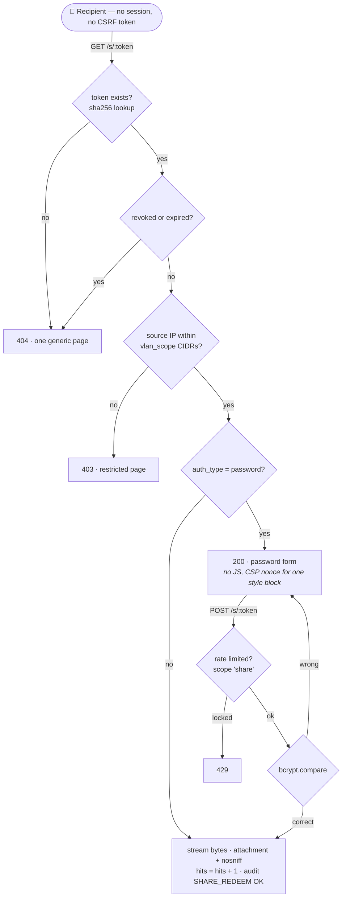
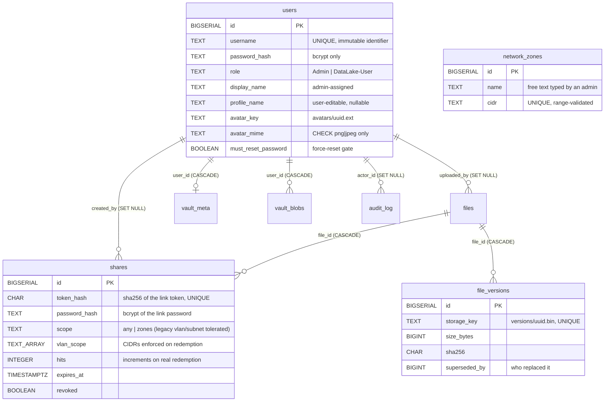

# 💾 IDEA1: AEGIS Drive LC (Secure NAS & Data Lake)

> **Codebase Status**: ✅ Built & Implemented (Backend Express `:8001` + Frontend React/Vite `:5174` + Database `aegis_drive` + Dual Theme Light/Dark)
> **Test Status**: 11 suites / **97 tests — 97 pass against real PostgreSQL**; 79 pass + 18 Postgres-only skipped in in-memory mode.
> **Primary Source Files**: `server/app.js`, `server/db/connection.js`, `server/db/store.js`, `server/routes/api.js`, `server/routes/share.js`, `server/storage/fileStore.js`, `server/storage/avatarStore.js`, `src/lib/vaultCrypto.js`

---

## 🧭 What is real, and what this deployment cannot do

This module went through a pass (2026-07-27) whose whole purpose was removing data that *looked* measured but was written into the source. The table below is the honest state. **When code changes, this table changes in the same commit.**

| Area | State | Source of truth |
| :--- | :--- | :--- |
| Files (list/upload/download/delete) | ✅ Real | `files` table + bytes on `/datalake` |
| Private Vault (zero-knowledge) | ✅ Real | `vault_meta` / `vault_blobs` + `.aegisenc` on disk |
| Audit log | ✅ Real | `audit_log` table |
| Users / Access screen | ✅ Real | `users` table (see below) |
| Profile name + avatar | ✅ Real | `users.profile_name` / `avatar_key` / `avatar_mime` |
| Active sessions + remote revoke | ✅ Real | express-session store (**MemoryStore — lost on restart**) |
| Secure share links (redeem/password/hits/scope) | ✅ Real | `shares` table + `GET/POST /s/:token` |
| File history (earlier versions + restore) | ✅ Real | `file_versions` table + bytes under `versions/` |
| Storage capacity | ✅ Real | `fs.statfs` on the Data Lake mount |
| Dashboard activity (7 days) | ✅ Real | counted from `audit_log` |
| Network zones | 🟠 Real record, **not** an enforcement mechanism | `network_zones` table |
| Encryption at rest for Data Lake uploads | 🔴 **Not implemented** — files are plaintext on disk | — |
| Disk health / SMART, RAID | 🔴 **Not measurable here** (needs host access) | declared via `storageStatus().unavailable` |
| Off-site backup jobs | 🔴 **None configured anywhere** | declared via `storageStatus().unavailable` |

### Features removed for claiming things that did not exist
* **Snapshots + rollback** — eight hardcoded rows; rollback set a `destroyed` flag and restored **zero bytes** while the UI reported "restored" plus GB lost. Replaced by real [[#🕓 File history (replaces Snapshots)]].
* **Encryption keys + "rotate now"** — reported an `AES-256-GCM` master key with an ID and rotation date. No such key exists: Data Lake files are plaintext, Vault keys are derived in the browser. `/api/keys*` now **404s**, pinned by a test.
* **Fabricated disks & backup jobs** — two `WD Red Pro 4TB` with serials/temperatures/`SMART PASSED` and three running backup jobs. None was read from anything.
* **`ScopeDiagram`** — animated VLAN/Guest/Internet bands with requests dissolving against a "FIREWALL" boundary, describing enforcement the app did not perform.
* **`otc` (one-time code) share option** — accepted by the server, but no code was ever generated or checked, so a link the user believed was code-protected opened for anyone holding it.

> ⚠️ These are the same class of defect as the removed 12-word vault recovery phrase (see [[concepts/Mnemonic_Recovery_and_Zero_Knowledge]]): the danger is not a wrong number on screen, it is an operator who stops checking the disks because it said `PASSED`, or who never sets up backups because it said `Nightly incremental · ok`.

---

## 🖥️ Infrastructure capability — measured, not assumed (2026-07-27)

Probed from a container mounting the real `drive_storage` volume under the same privileges as the `drive` service:

```
/datalake            ext4 on /dev/sde       1.05 TB total, 976 GB available
lvcreate / lvs / vgs absent
zfs / btrfs          absent
/dev/mapper          not present
raw block devices    none exposed
smartctl / mdadm     absent
/proc/mdstat         unavailable
CapEff               0x00000000a80425fb   (Docker default)
```

* **Point-in-time snapshots are impossible here.** `/datalake` is plain **ext4** — not LVM (no `/dev/mapper` at all), not ZFS, not Btrfs. Nothing to snapshot, and no tooling to do it with.
* **SMART / RAID telemetry is unreachable.** Binaries absent, no raw device exposed, `/proc/mdstat` missing. In that capability mask **`CAP_SYS_RAWIO` (bit 17) and `CAP_SYS_ADMIN` (bit 21) are both clear** — even with the binaries installed they could not talk to a device. Real telemetry is a **host-level infrastructure change**, not a coding task.
* **`fs.statfs` needs no privilege and works** — the one genuinely available storage number, and what the capacity UI now uses.

---

## 🔐 Storage Layer — how bytes are actually laid out

`server/storage/fileStore.js` operates on the Docker named volume `drive_storage` mounted at `/datalake`, **mounted to the `drive` container only** (`monitor` and `gateway` cannot reach it at the filesystem level).

```
/datalake/uploads/<uuid>.bin      current file bytes
/datalake/versions/<uuid>.bin     superseded bytes (file history)
/datalake/vault/<uuid>.aegisenc   client-encrypted ciphertext (zero-knowledge)
/datalake/avatars/<uuid>.png|jpg  profile pictures (EXIF stripped)
```

> ⚠️ **Correction (2026-07-27)**: this note previously stated that files are stored under content-based sharded SHA-256 paths such as `/datalake/files/ab/cd/abcd1234…`. **That was never true of the code.** `fileStore.js` writes a bare `randomUUID()` plus `.bin` under `uploads/`. The security property claimed was real, but the mechanism described was not — the opaque name is a random UUID, not a content hash, and there is no sharded directory tree.

Why an opaque random name: (1) someone with only disk access cannot tell which file is which, and (2) a user-supplied name can never become a path, which removes path traversal at the source rather than relying on sanitising. Real names live in `files.name`. `resolveKey()` is a second gate that refuses any key resolving outside `STORAGE_ROOT`.

Both `size_bytes` and `sha256` are computed **server-side from the bytes on disk**. A client-supplied hash is only ever used to *compare* — a mismatch discards the upload rather than storing something known to be incomplete.

---

## 👤 Identity — three names, three jobs

| Field | Who sets it | Can collide? | Used for |
| :--- | :--- | :--- | :--- |
| `username` | Admin at provisioning, immutable | No (unique) | Login, `audit_log.actor_label` |
| `display_name` | Admin at provisioning | Yes | Access screen — confirming who an account belongs to |
| `profile_name` | **The user, freely** | **Yes, on purpose** | Display everywhere (uploader label, share creator, TopBar) |

`profile_name` wins for display via `COALESCE(NULLIF(btrim(profile_name),''), display_name)` at read time, so a rename is retroactive and nothing is copied into rows.

> ⚠️ Because a profile name **can be set to a colleague's name**, every screen showing it also shows the `username`, and the Access screen additionally shows the administrator-assigned name whenever the two differ. A test asserts a profile name can never be used to log in. Authorisation is always `users.id`; never a display name.

### Profile picture — the four guarantees (`server/storage/avatarStore.js`)
1. **Type from magic bytes only** — PNG (`89 50 4E 47…`) and JPEG (`FF D8 FF`). Extension and browser-supplied `Content-Type` are ignored. SVG is refused because it is a document that can run `<script>`, and served from our own origin that is XSS with read access to the CSRF token. *A test uploads an SVG payload named `.png` with `Content-Type: image/png` and requires 415 with nothing written to disk.*
2. **2 MiB limit** — enforced in `sanitizeAvatar()` as well as in multer, so it holds even if the middleware is bypassed.
3. **Randomised filename** — bare `randomUUID()` + a server-chosen extension.
4. **Metadata stripped *before* the write** — PNG keeps only an allowlist of decode-critical chunks (dropping `eXIf` / `tEXt` / `zTXt` / `iTXt`); JPEG drops every `APPn` and `COM` segment. *Tests plant real GPS coordinates and a camera serial in valid files, confirm they are present, then grep the bytes on disk.*

> ⚠️ **Accepted trade-off**: dropping `APP1` also removes EXIF `Orientation`, so a phone photo that rotates via metadata will display sideways. Fixing that means rotating pixels, which means a codec — not worth a native dependency on an 8 GB target. Privacy beats rotation here.

---

## 🔗 Secure share links — the full redemption path

`server/routes/share.js`, mounted in `app.js` **before** `express.static` and the `'*'` SPA fallback (otherwise the fallback swallows `/s/…` and returns `index.html`).



* **`token_hash CHAR(64)`, not the raw token.** A token is a bearer credential — whoever holds it downloads the file without logging in — so a leaked backup or an over-broad `SELECT` would otherwise hand over working links to every active share. **Consequence accepted:** the server cannot show a link twice, so the URL appears once at creation (like a new account's temporary password) and a lost link means revoke and reissue.
* **`password_hash` is now genuinely used** — bcrypt cost 12, compared on redemption. *A test reads the column directly and asserts it holds a bcrypt hash with no trace of the plaintext.*
* **`hits` increments only on a completed redemption** — not on viewing the form, not on a wrong password. *Tested both ways.*
* **Every failure returns the same page.** Distinguishing "no such token" from "expired" would let anyone confirm which tokens once existed. `audit_log` keeps the reasons apart, because what the operator must see and what the recipient should learn are different questions.

### Network scope — what is enforced, and what is not
`vlan_scope` CIDRs are **snapshotted from `network_zones` at creation time** (reading them live would silently widen every previously issued link whenever an admin added a zone). On redemption `ipAllowed(req.ip, cidrs)` refuses anything outside the set.

> ⚠️ **This is an application-level source-address check** — real, tested, and it fails closed (an unparseable CIDR or a non-mapped IPv6 address does not pass). It is **not** the same as VLAN isolation at the firewall or switch, which stops the request from arriving at all. `req.ip` is trustworthy only as far as the reverse proxy sets `X-Forwarded-For`. The UI states this limit in plain language instead of drawing a firewall. See [[concepts/VLAN_Segmentation_and_Port_Mapping]].
>
> Selecting "approved networks" while **no** zone is defined is **refused**, rather than producing a link labelled restricted whose empty list restricts nothing.

---

## 🕓 File history (replaces Snapshots)

Screen `src/screens/FileHistory.jsx`, nav id `versions` (was `snapshots`).

Uploading a file under **a name you already own** keeps the bytes it replaces:

```
upload over own name  →  current bytes renamed into versions/<uuid>.bin
                      →  row in file_versions (size, sha256, superseded_by)
                      →  files row points at the new bytes
restore a version     →  current bytes become a version first (non-destructive)
                      →  the chosen version's bytes become current
```

* **Restore returns real bytes** — the tests download the content and compare it, not a status field.
* **Nothing is destroyed**, which is why the confirm step does not demand you type an id. Forcing typed confirmation for a reversible action only trains people to click through it.
* **Rename, not copy** — same volume, so it is a metadata operation; copying gigabytes on an edge HDD would cost time and double the space. *A test asserts the file count under `versions/` does not grow across a restore.*
* **Same-name upload only versions your *own* file.** Matching on name alone would let anyone overwrite someone else's file by naming theirs to match — write access to another user's data with no ownership check.
* **Owner-only for read, download and restore, with no Admin exception** (matching `DELETE /api/files/:id`). Past versions *are* the file's contents: reading them is reading their file; restoring them is writing to it.
* **Deleting a file removes every version's bytes.** `ON DELETE CASCADE` takes the rows, but the bytes would otherwise sit unreferenced and unreachable — content the user believes is gone.

> ⚠️ **Scope, stated on the screen itself**: this is per-file history, **not** a point-in-time image of the Data Lake. Deleted files keep no history, and versions live on the same disk as the data, so they do not survive a drive failure. That is what off-site backup is for, and none is configured.

---

## 🗄️ Schema (`server/db/schema.sql`)



`vault_meta` / `vault_blobs` are unchanged — by construction they have **nowhere to put plaintext**: no `name`, no `mime`, no key column. See [[concepts/Three_Layer_Data_Lake]].

---

## 🚪 Force Password Reset — now covers the seeded demo accounts

1. **Day-0 Admin bootstrap** — `server/db/bootstrapAdmin.js` requires a pre-computed bcrypt hash in `ADMIN_BOOTSTRAP_PASSWORD_HASH` and **refuses to boot** if it looks like a raw password. Hash it with `scripts/hash_password.py` (`getpass`, no echo, no shell history).
2. **Admin provisioning** — `POST /api/users` generates the temporary password server-side and returns it **once**; it is never logged or stored anywhere else.
3. **Seeded demo accounts** — `seed.sql` now inserts `admin` and `user` with `must_reset_password = TRUE`, matching IDEA2's operator onboarding. Both bcrypt hashes are in public git, so the matching passwords are permanent public knowledge; the gate makes them **usable exactly once, to set a new password**.
4. **Remediation for existing databases** — `ON CONFLICT DO NOTHING` would leave an already-initialised database untouched, so `seed.sql` follows with an `UPDATE` scoped to rows whose hash is still one of the two committed ones. Idempotent (verified `UPDATE 2` then `UPDATE 0`), and it never re-gates an account that already rotated.
5. **The gate itself** — `requireRole.js` blocks every path except `/me`, `/logout`, `/password/reset` with `403 PASSWORD_RESET_REQUIRED`, a code the client uses to route to the reset screen rather than showing a generic Forbidden.

> ⚠️ **Operational consequence**: the credentials documented in `seed.sql` are **single-use per database**. Running the test suite against a database also rotates them (see `tests/helpers/testClient.mjs`). `docker compose down -v` restores a clean state. Worth knowing before a demo.

---

## 📊 Dashboard & Storage — real aggregates only

* **Activity (7 days)** — counted from `audit_log` (successful events only), with `generate_series` filling empty days as zero; a chart that omits empty days silently distorts its own axis.
  > ⚠️ **The unit is event counts, not GB, and that is a real limit.** `audit_log` deliberately stores no per-event byte size, so events are countable but volume is not. Estimating it from current file sizes would be wrong the moment a file is replaced or deleted. A volume chart requires adding a size column to the audit log first — a **privacy decision**, not merely a technical one.
* **Capacity** — `fs.statfs` on the Data Lake mount. The former `342 GB` baseline and `1024 GB` total are gone; the `342` was the more insidious of the two because a fabricated figure with a real term added moves slightly and therefore *looks* measured. `null` means unreadable, never zero.
  > ⚠️ `statfs` reports the whole filesystem, not a per-directory quota. Space the app did not write is shown as a separate "other on this volume" band rather than folded into a category.
* **Usage by kind** — `SUM(size_bytes)` over `files`, `vault_blobs` and `file_versions`. Dashboard and Storage read the same source, and a test asserts the two screens report the same total.

---

## 🧾 Audit log — and why writes are awaited

Privacy-preserving by design: target names are stored as `sha256`, so an auditor can tell that several events concern **the same** file without learning its name. *A test plants a filename, confirms the raw string appears nowhere, and confirms the events still correlate by hash.* No link token, link password or account password ever reaches the log — anyone who can read the audit could otherwise download other people's files.

> ⚠️ **`recordAudit` is now awaited before responding** on every path. It used to be fire-and-forget, so under PostgreSQL a **denied** request answered `403` before its `DENIED` row committed: if the process died in that window, the rejected attempt vanished from the forensic record — the row you least want to lose. Secondary effect: the Audit screen and the activity chart both read one event stale. In a system that claims an audit trail, "the action succeeded" must include "it was recorded". The in-memory path writes synchronously, which is why this only surfaced against a real database.

---

## 📡 API surface (IDEA1)

| Method & Path | Guard | Notes |
| :--- | :--- | :--- |
| `POST /api/login` · `/logout` · `GET /api/me` | — / session | rate limited, scope `login` |
| `POST /api/password/reset` | `requireAuth` | exempt from the force-reset gate |
| `GET /api/files` · `POST /api/files/upload` · `folder` | `requireAuth` | same-name upload ⇒ new version |
| `GET /api/files/:id/download` | `requireAuth` | octet-stream + attachment + nosniff |
| `DELETE /api/files/:id` | `requireAuth` + **owner only** | no Admin exception; also deletes version bytes |
| `GET /api/file-versions` | `requireAuth` | own files + version counts |
| `GET /api/files/:id/versions[/:vid/download]` | **owner only** | 404 (not 403) for non-owners |
| `POST /api/files/:id/versions/:vid/restore` | **owner only** | non-destructive |
| `GET/POST/DELETE /api/shares[/:id]` | `requireAuth` | create returns the token **once** |
| **`GET/POST /s/:token`** | **public** | redemption; own gates (see above) |
| `GET /api/storage` · `/api/dashboard` | `requireAuth` | real aggregates + `unavailable{}` |
| `PATCH /api/profile` · `POST/DELETE /api/profile/avatar` | `requireAuth` | session-scoped; never accepts a `userId` |
| `GET /api/users/:id/avatar` | `requireAuth` | sniffed mime + nosniff |
| `GET /api/sessions` · `DELETE /api/sessions/:ref` | `requireAuth` | own sessions only; `ref` is a hash, never the sid |
| `GET /api/users` · `POST /api/users` | `requireRole(Admin)` | same table for read and write |
| `GET /api/audit` | `requireRole(Admin)` | sha256 targets only |
| `GET/POST/DELETE /api/zones[/:id]` | `requireRole(Admin)` | record of intent, not enforcement |
| ~~`/api/keys`, `/api/keys/rotate`~~ | — | **removed — 404, pinned by test** |
| ~~`/api/snapshots`, `/api/snapshots/:id/rollback`~~ | — | **removed — 404, pinned by test** |

---

## 🧪 Test coverage (`npm test`)

| Suite | Covers |
| :--- | :--- |
| `accessUsers` | force-reset gate end to end; users list carries no fabricated fields |
| `accessReconciliation` | API response vs the `users` table row by row, via an **independent** pg connection |
| `profileIdentity` | profile name vs username; avatar sniffing / limit / EXIF stripping; real sessions + revoke |
| `shareRedemption` | redemption, link password, rate limit, hits, CIDR enforcement, expiry, revoke |
| `fileVersions` | version capture, real restore, owner-only, delete cleanup, honest storage payload |
| `dashboardAggregates` | activity counts move with real use; capacity is real; no `projected` flag |
| `auditViewer` | Admin-only; sha256 targets; DENIED recorded; no secrets in the log |
| `filesOwnership` | cross-user delete refused, bytes survive |
| `vaultApi` · `vaultPostgres` · `vaultCrypto` | zero-knowledge properties, incl. raw-SQL inspection |

Both DB modes are required to pass: unset `TEST_DATABASE_URL` for the in-memory fallback, set it for real PostgreSQL (procedure in `docs/auth-test.md` §15.1).

> **Not covered**: `Login.jsx` has no dedicated suite (every suite exercises the login path, including the reset gate), and `Uploads.jsx` is a thin client over `POST /api/files/upload` — its one piece of real client logic, refusing files over 1 GiB, is UI-only and untested.

---

## 📂 Codebase file paths
* `server/app.js` — Express assembly; `shareRouter` mounted before static/SPA fallback
* `server/routes/api.js` — `/api/*`; every audit write awaited
* `server/routes/share.js` — public `/s/:token` redemption, CIDR check, CSP-nonced pages
* `server/db/connection.js` — pool, users table access, `listUsers`, audit read/write
* `server/db/store.js` — files / shares / versions / zones / storage / dashboard
* `server/db/schema.sql` · `seed.sql` — schema + force-reset seeding & remediation
* `server/storage/fileStore.js` — uploads, versions, `statfs` capacity
* `server/storage/avatarStore.js` — sniffing, size limit, EXIF stripping
* `server/auth/rateLimit.js` — counters namespaced by scope (`login` / `share`)
* `src/screens/FileHistory.jsx` — replaces the removed `Snapshots.jsx`
* `src/lib/vaultCrypto.js` · `src/screens/Vault.jsx` — zero-knowledge vault

---

## 🔗 Related Notes
* [[00 - 🗺️ AEGIS System Overview]]
* [[01 - 🚪 HUB-AEGIS Entry]]
* [[03 - 📹 IDEA2 AEGIS Monitor]]
* [[05 - 🛡️ Security Architecture]]
* [[concepts/Mnemonic_Recovery_and_Zero_Knowledge]]
* [[concepts/Three_Layer_Data_Lake]]
* [[concepts/OWASP_Security_Defense]]
* [[concepts/VLAN_Segmentation_and_Port_Mapping]]
* [[concepts/Identity_Decoupling]]
