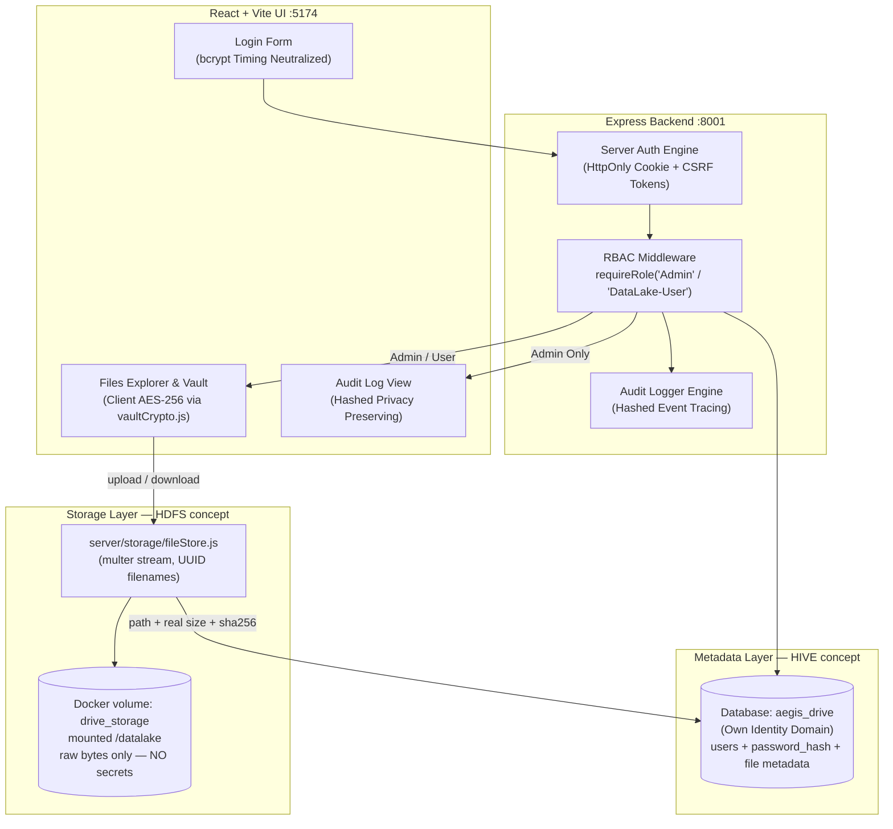

# 💾 IDEA1: AEGIS Drive LC (Secure NAS & Data Lake)

> **สถานะโค้ดปัจจุบัน (Code Status)**: ✅ Built & Implemented (Backend Express `:8001` + Frontend React/Vite `:5174` + Database `aegis_drive`)  
> **ไฟล์โค้ดหลัก**: `IDEA1-AEGIS_Drive_LC/server/`, `IDEA1-AEGIS_Drive_LC/src/lib/api.js`, `IDEA1-AEGIS_Drive_LC/src/lib/vaultCrypto.js`, `IDEA1-AEGIS_Drive_LC/src/screens/`

---

## 🆕 Storage Layer — ชั้นเก็บไฟล์จริงเปิดใช้งานแล้ว (2026-07-22)

ก่อนหน้านี้ Data Lake มีแค่ **Metadata Layer** จริง ๆ — endpoint อัปโหลดรับเฉพาะ
`{name, size, sha256}` แล้วเขียนแถวใน `files` ที่ชี้ไปยัง path สมมุติ
(`/datalake/uploads/<ชื่อไฟล์>`) โดยไม่มี byte ไหนถูกเขียนลงดิสก์เลย ตอนนี้ชั้น
Storage ของจริงถูกสร้างแล้ว:

* **`server/storage/fileStore.js` (ใหม่)** — Storage Layer (แนวคิด HDFS) เป็น
  filesystem ธรรมดาบน Docker named volume `drive_storage` ที่ mount ไว้ที่
  `/datalake` ในคอนเทนเนอร์ drive **เฉพาะ IDEA1 เท่านั้น** (monitor/gateway ไม่ mount)
  — ไม่ใช้ Hadoop/Hive เพราะ Beelink 8GB รับไม่ไหวและไม่จำเป็น สิ่งที่ต้องการคือ
  "ไฟล์ดิบอยู่คนละชั้นกับ metadata" เท่านั้น
* **`POST /api/files/upload`** เปลี่ยนเป็น `multipart/form-data` ผ่าน **multer 2.x**
  (`diskStorage` แบบ stream — ไฟล์ 1GB ไม่กิน RAM 1GB บนเครื่อง 8GB) เพดาน 1 GiB/ไฟล์
* **`GET /api/files/:id/download` (ใหม่)** — stream byte จริงจากดิสก์ พร้อม
  `Content-Disposition: attachment` + `X-Content-Type-Options: nosniff` เสมอ
  (ไฟล์ HTML/SVG ที่ผู้ใช้อัปโหลดต้องไม่ถูก render ใน origin เดียวกัน = กัน XSS)
* **`DELETE /api/files/:id`** ลบ byte บนดิสก์ตามหลังลบแถว metadata — ไฟล์ที่ผู้ใช้
  "ลบแล้ว" ต้องไม่นอนค้างบนดิสก์ต่อไปโดยไม่มีใครเห็นและไม่มีใครลบได้อีก

**ข้อตัดสินใจด้านความปลอดภัยของชั้นนี้:**

1. **ชื่อไฟล์บนดิสก์เป็น UUID ทึบ** (`<uuid>.bin`) ไม่มีเศษของชื่อที่ผู้ใช้ตั้งปนเลย
   แม้แต่นามสกุล → (ก) คนที่เข้าถึงได้แค่ดิสก์อ่านไม่ออกว่าไฟล์ไหนคืออะไร
   (ข) ชื่อจากผู้ใช้ไม่มีวันกลายเป็น path บนดิสก์ = **ตัด path traversal ตั้งแต่ต้นทาง**
   ไม่ต้องพึ่ง sanitize ที่อาจพลาด — ชื่อจริงอยู่คอลัมน์ `name` ใน Metadata Layer
2. **`size` และ `sha256` เซิร์ฟเวอร์คำนวณเองจาก byte บนดิสก์เสมอ** ไม่เชื่อค่าที่ client
   แจ้ง — ถ้า client แนบ sha256 มาด้วยจะถูกใช้แค่ "เทียบ" ถ้าไม่ตรง = ไฟล์เพี้ยน
   ระหว่างทาง → ตอบ **422** ทิ้งทั้ง byte และไม่เขียน metadata
3. **ลำดับ write ต้องเป็น byte → metadata** ถ้าสลับกันแล้วดิสก์ล้มเหลวจะเหลือแถวที่ชี้ไป
   ยังไฟล์ที่ไม่มีอยู่จริง (metadata โกหก) และถ้า INSERT ล้มเหลวทีหลัง byte ถูกลบทิ้ง
   (`discardUploaded`) — ไม่เหลือไฟล์กำพร้า
4. **`resolveKey()` บังคับว่า path ที่ resolve แล้วต้องอยู่ใต้ `STORAGE_ROOT` เสมอ**
   ต่อให้ค่าใน DB ถูกแก้ให้เป็น `../../etc/passwd` ก็ออกนอกกรอบไม่ได้
5. **ห้ามมีรหัสผ่าน/ความลับใด ๆ ตกลงมาชั้นนี้** — bcrypt hash ทุกตัวอยู่ Metadata Layer
   เท่านั้น ชั้นนี้ถูกออกแบบให้ "ขโมยดิสก์ไปทั้งลูกก็ยังไม่ได้รหัสผ่านใคร"
6. **`initStorage()` ถูกเรียกก่อนเปิดพอร์ต** และเขียนไฟล์ทดสอบจริงหนึ่งครั้งเพื่อพิสูจน์
   สิทธิ์ — named volume ที่ mount มาใหม่มักเป็นของ `root` ขณะที่คอนเทนเนอร์รันด้วย user
   `node` ปัญหานี้ต้องดังตั้งแต่บูต ไม่ใช่ตอนผู้ใช้กดอัปโหลดแล้วเจอ 500 เงียบ ๆ
   (`Dockerfile` จึง `mkdir -p /datalake && chown node:node` **ก่อน** `USER node`)

ผลตรวจรอบ upload → download เทียบ byte ต่อ byte อยู่ใน `docs/auth-test.md` ข้อ 9

---

## 🆕 Admin Provisioning & Force Password Reset (2026-07-21)

Closed-registration bootstrap and account provisioning are now real (write to
`aegis_drive` Postgres, not the earlier demo-only stub):

* **Day-0 admin bootstrap** (`server/db/bootstrapAdmin.js`) — on first boot with
  zero `Admin` rows, reads `ADMIN_BOOTSTRAP_USERNAME` +
  `ADMIN_BOOTSTRAP_PASSWORD_HASH` from the environment and inserts the initial
  Admin. Only accepts an **already-hashed bcrypt value** — never a raw
  password — generated locally via `scripts/hash_password.py` (getpass,
  never echoed/logged/in shell history). Refuses to boot if the value doesn't
  look like a bcrypt hash. No-ops once any Admin exists (idempotent, safe on
  every container restart).
* **`POST /api/users`** (Admin only) provisions a `DataLake-User` with a
  server-generated, high-entropy temporary password (`generateTempPassword()`
  in `server/db/connection.js`) — the client can never supply the initial
  password. The plaintext temp password is returned **once** in the API
  response (never logged, never audited) for the Admin to relay out-of-band;
  `src/screens/Access.jsx` now shows a one-time reveal panel (copy button,
  matches the existing recovery-phrase reveal pattern in `Settings.jsx`)
  instead of silently discarding it. This endpoint deliberately cannot create
  another Admin, to limit blast radius if an Admin session is hijacked.
* **Force Password Reset** — new accounts (and the Day-0 admin) are created
  with `must_reset_password = TRUE`. `server/middleware/requireRole.js` blocks
  every endpoint except `/me`, `/logout`, and the new `POST /api/password/reset`
  until the user changes it (current-password re-verification + 12-char
  minimum). The flag lives in the session (`server/auth/session.js`) and is
  cleared in the same request that updates the DB hash, so no re-login is
  needed after resetting.
* **Local test fixture seeding** (`server/db/seedTestFixtures.js`, separate from
  the production flow above) — upserts a fixed 3-account matrix
  (`admin_drive`/`staff_01`/`staff_02`) from bcrypt hashes in `.env.test`, with
  `must_reset_password = FALSE` so testers can log in immediately with known
  passwords. Not called at boot; refuses to run under `NODE_ENV=production`.

---

---

## 🏗️ สถาปัตยกรรมระบบที่พัฒนาขึ้นจริง (Verified Architecture)

> ⚠️ ลูกศร `FileStore → DriveDB` คือหัวใจของการแยกสามชั้น: **byte อยู่ที่ volume,
> ส่วนชื่อ/ขนาด/เจ้าของ/hash อยู่ที่ Postgres** และ **รหัสผ่านอยู่ที่ Postgres เท่านั้น
> ไม่มีวันตกลงไปที่ volume** — ดู [[concepts/Three_Layer_Data_Lake]]

---

## 🔒 ฟีเจอร์ความปลอดภัยหลักที่เปิดใช้งานในโค้ด (Implemented Features)

1. **Own Identity Domain**:
   * ครอบครองฐานข้อมูล `aegis_drive` เป็นอิสระ แยกบัญชีผู้ใช้ `Admin` และ `DataLake-User` ออกจากโมดูลอื่นเด็ดขาด
2. **Client-Side Vault Encryption (`src/lib/vaultCrypto.js`)**:
   * ใช้ Web Crypto API (AES-GCM 256-bit + PBKDF2 100,000 iterations) เข้ารหัสไฟล์จากหน้าเบราว์เซอร์ก่อนส่งขึ้น NAS
   * NAS ทำหน้าที่เป็นโกดังเก็บ Ciphertext เท่านั้น แม้แต่ Admin ก็อ่านไฟล์ใน Vault ไม่ได้หากไม่มีกุญแจผู้ใช้ (Zero-Knowledge)
3. **Bcrypt Timing Equalization & Lockout**:
   * ระบบตรวจสอบรหัสผ่านใช้เวลาเปรียบเทียบเท่ากันเสมอกันแม้ไม่พบ Username (ป้องกัน Timing Attack)
   * ระบบบล็อกบัญชีอัตโนมัติเมื่อป้อนรหัสผิดเกิน 5 ครั้ง พร้อม Exponential Backoff
4. **VLAN-Aware Secure Share**:
   * กำหนดลิงก์แชร์ไฟล์ที่จำกัดการเข้าถึงเฉพาะวง VLAN/Subnet ที่อนุญาต ควบคุมผ่าน UFW Firewall ในระดับ Network Layer
5. **Privacy-Preserving Audit Log (`src/screens/Audit.jsx`)**:
   * ชื่อไฟล์ถูกเข้ารหัสเป็นค่าแฮช/UUID ก่อนบันทึกลง Metadata Layer ทำให้ Admin มองเห็นเฉพาะกิจกรรม แต่ไม่เห็นชื่อไฟล์จริงตามหลัก PDPA

---

## 📂 รายการไฟล์ซอร์สโค้ดสำคัญ (Codebase Paths)
* `IDEA1-AEGIS_Drive_LC/server/index.js` - Express API Server (`:8001`)
* `IDEA1-AEGIS_Drive_LC/src/lib/api.js` - HTTP Request Abstraction พร้อมระบบส่ง HttpOnly Cookie & CSRF Token
* `IDEA1-AEGIS_Drive_LC/src/lib/vaultCrypto.js` - ขุมพลังการเข้ารหัส Client-Side AES-256 / PBKDF2
* `IDEA1-AEGIS_Drive_LC/src/screens/Vault.jsx` - หน้าจอ Private Vault สำหรับเก็บไฟล์ลับเฉพาะ
* `IDEA1-AEGIS_Drive_LC/src/screens/Audit.jsx` - หน้าตรวจสอบ Audit Log ความปลอดภัย
* `IDEA1-AEGIS_Drive_LC/src/screens/Shares.jsx` - ระบบแชร์ไฟล์ล็อกวงเครือข่าย VLAN
* `IDEA1-AEGIS_Drive_LC/server/db/bootstrapAdmin.js` - Day-0 admin bootstrap จาก bcrypt hash ใน env var
* `IDEA1-AEGIS_Drive_LC/scripts/hash_password.py` - เครื่องมือฝั่งผู้ดูแลระบบสร้าง bcrypt hash (getpass, ไม่มี plaintext ค้าง)
* `IDEA1-AEGIS_Drive_LC/src/screens/Access.jsx` - จอ Admin governance พร้อม one-time reveal ของรหัสผ่านชั่วคราว
* `IDEA1-AEGIS_Drive_LC/server/storage/fileStore.js` - **Storage Layer** — multer stream, UUID filenames, ด่านกัน path traversal, sha256 จาก byte จริง

---

## 🔗 เอกสารที่เกี่ยวข้อง
* [[00 - 🗺️ AEGIS System Overview]]
* [[01 - 🚪 HUB-AEGIS Entry]]
* [[concepts/Three_Layer_Data_Lake]]
* [[concepts/Mnemonic_Recovery_and_Zero_Knowledge]]
* [[concepts/Identity_Decoupling]]
