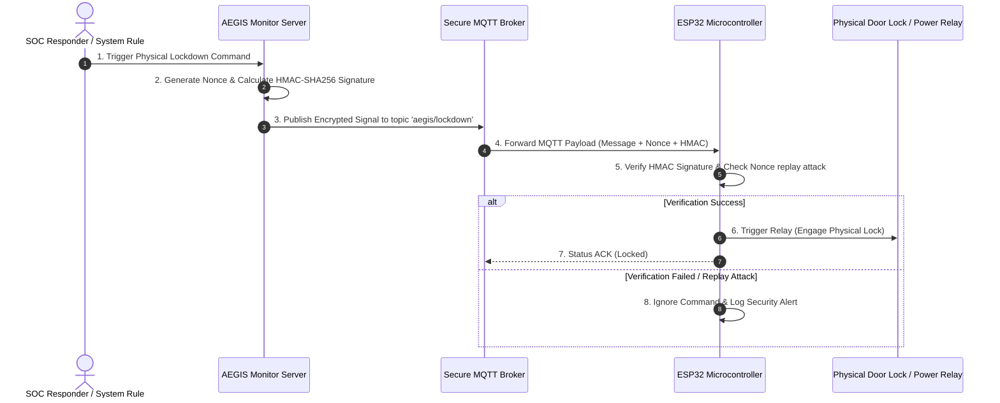

# 🔒 IDEA3: AEGIS Lockdown

> **หน้าที่หลัก**: ระบบตัดการเชื่อมต่อและปิดล็อกกายภาพอัตโนมัติเมื่อเกิดเหตุคุกคามสูง (Physical Emergency Lockdown System) สั่งงานบอร์ด ESP32 ผ่านโปรโตคอลความปลอดภัย MQTT + HMAC-SHA256

---

## ⚡ สถาปัตยกรรมการสั่งงาน Hardware & Firmware

---

## 🛠️ คุณสมบัติด้านความปลอดภัยทางกายภาพ

* **HMAC-SHA256 Validation**: บอร์ด ESP32 จะไม่ทำตามคำสั่งใดๆ หากลายเซ็น HMAC ไม่ถูกต้อง
* **Anti-Replay Attack (Nonce)**: ใช้ค่า Nonce สุ่มป้องกันคำสั่งดักจับแล้วส่งซ้ำ
* **Dead Man's Switch**: หากขาดการติดต่อจากเซิร์ฟเวอร์หลักเกินเวลาที่กำหนด ระบบจะสลับเข้าสู่โหมดปลอดภัยอัตโนมัติ

---

## 🔗 เอกสารที่เกี่ยวข้อง
* [[00 - 🗺️ AEGIS System Overview]]
* [[03 - 📹 IDEA2 AEGIS Monitor]]
* [[05 - 🛡️ Security Architecture]]
