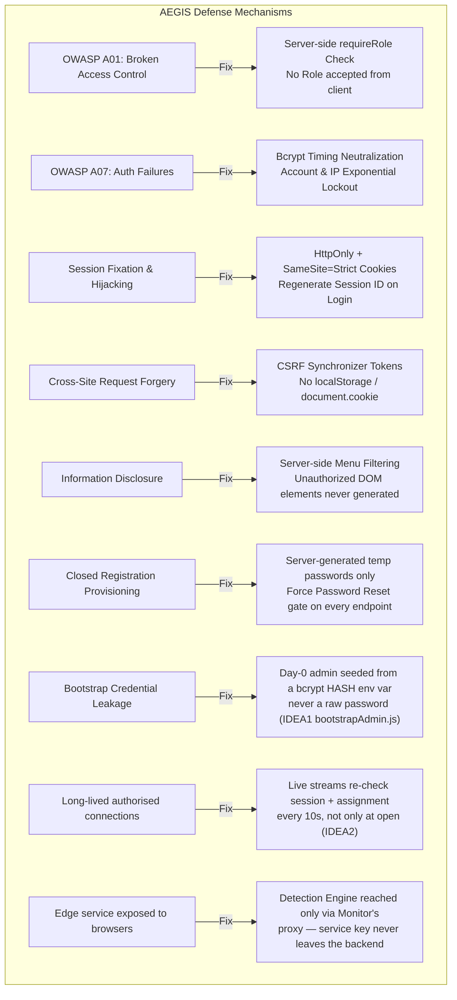
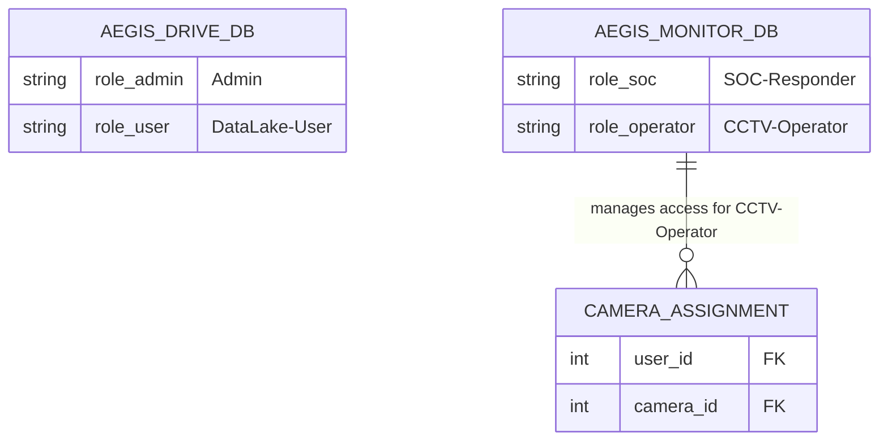

# 🛡️ AEGIS Security & Identity Architecture

> **Core Concept**: **Server-Side Enforcement & Per-App Identity** — The browser has no authority over Identity or Roles, and applications do not trust each other's sessions (Zero Trust Policy).

---

## 🛡️ OWASP Security Defense Summary

---

## 📋 Identity Partitioning Across Applications

1. **No `localStorage` / `sessionStorage`**: Store cookies exclusively as `HttpOnly`, `SameSite=Strict`, and `Secure` to prevent XSS script token theft.
2. **Timing Attack Protection**: Use uniform bcrypt hash timing comparisons even when a username is not found.
3. **Menu Filtering**: UI elements corresponding to unauthorized roles are filtered out at the server level, leaving no traces in the HTML DOM.
4. **Closed Registration Provisioning (2026-07-21, IDEA1 + IDEA2)**: System-wide self-registration is disabled. New accounts are created solely via Admin (`POST /api/users`, IDEA1) or SSH CLI (`server/cli/manage_users.py`, IDEA2). Initial temporary passwords are server/CLI generated, and all new accounts carry `must_reset_password = TRUE` — `requireRole.js` blocks all endpoints except `/me`, `/logout`, and `/password/reset` until password reset succeeds.
5. **Bootstrap Credential Hygiene (IDEA1)**: `ADMIN_BOOTSTRAP_PASSWORD_HASH` provided to the container must be a pre-calculated bcrypt hash (`scripts/hash_password.py`, using `getpass` without echoing or logging), never a raw password. `bootstrapAdmin.js` validates bcrypt formatting prior to boot, failing loudly if invalid.
6. **Authorisation is re-checked for the life of a connection (2026-07-27, IDEA2)**: a request/response check is insufficient for anything long-lived. A live MJPEG stream is authorised at open **and re-validated every 10s** — the session is re-read from the store and `camera_assignment` re-checked. Measured: logout cuts the stream at **t=10.06s**; a SOC revoking the camera cuts it at **t=10.03s**. Without this, a logged-out operator would keep receiving live video until they closed the tab.
7. **The edge service is never exposed to browsers (2026-07-27, IDEA2)**: the Detection Engine's MJPEG endpoint is gated by the shared service key and reached **only** by Monitor's backend. The browser talks to Monitor's own origin; the engine's address (`camera_heartbeat.stream_url`) and its key never appear in any client payload — the client receives only a `hasStream` boolean. Scoping (`canSeeCamera`) completes **before** any socket to the engine is opened.
8. **Values that reach the backend become attack surface**: `stream_url` arrives from the engine but becomes a destination Monitor itself dials, so it is validated to `http`/`https` on ingest (SSRF containment) — being authenticated is not the same as being trusted.
9. **Seeded credentials are single-use in both apps (2026-07-27)**: bcrypt hashes committed to a public repository are public knowledge forever. Both `seed.sql` files now set `must_reset_password = TRUE` with an idempotent follow-up `UPDATE` (matched on the git-known hashes) so databases created before the change are closed too. Plaintext passwords were also removed from IDEA2's seed header — a comment recording real credentials is itself the leak.

---

## 🔗 Related Notes
* [[00 - 🗺️ AEGIS System Overview]]
* [[01 - 🚪 HUB-AEGIS Entry]]
* [[02 - 💾 IDEA1 AEGIS Drive LC]]
* [[03 - 📹 IDEA2 AEGIS Monitor]]
* [[04 - 🔒 IDEA3 AEGIS Lockdown]]
* [[concepts/Honest_Telemetry_and_Unavailable_States]]
