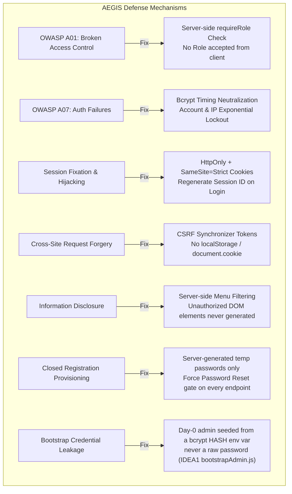
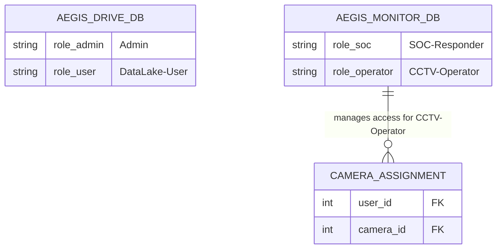

# 🛡️ AEGIS Security & Identity Architecture

> **แนวคิดหลัก**: **Server-Side Enforcement & Per-App Identity** — เบราว์เซอร์ไม่มีสิทธิ์ตัดสินใจเกี่ยวกับ Identity หรือ Role และแต่ละแอปพลิเคชันไม่วางใจ Session ของกันและกัน (Zero Trust Policy)

---

## 🛡️ สรุปมาตรการความปลอดภัยตามมาตรฐาน OWASP

---

## 📋 เปรียบเทียบสิทธิ์ผู้ใช้ในแต่ละแอปพลิเคชัน (Identity Partitioning)

1. **ไม่ใช้ localStorage / sessionStorage**: เก็บ Cookie ในรูปแบบ `HttpOnly`, `SameSite=Strict`, `Secure` เพื่อป้องกันสคริปต์ XSS ดึงสิทธิ์ไปใช้
2. **Timing Attack Protection**: ใช้การเปรียบเทียบรหัสผ่าน bcrypt แบบสม่ำเสมอเท่ากัน แม้พิมพ์ Username ผิด
3. **Menu Filtering**: ส่วนติดต่อผู้ใช้ (UI Elements) ของสิทธิ์ที่ไม่ได้รับอนุญาต จะถูกกรองออกตั้งแต่ฝั่ง Server ไม่หลงเหลือ Element ใน HTML DOM
4. **Closed Registration Provisioning (2026-07-21, IDEA1 + IDEA2)**: ไม่มี self-signup ทั้งระบบ — บัญชีใหม่เกิดจาก Admin (`POST /api/users`, IDEA1) หรือ SSH CLI (`server/cli/manage_users.py`, IDEA2) เท่านั้น รหัสผ่านเริ่มต้นถูกสุ่มฝั่งเซิร์ฟเวอร์/CLI เสมอ (client ไม่มีทางกำหนดเอง) และบัญชีใหม่ทุกใบติด `must_reset_password = TRUE` — `requireRole.js` ของทั้งสองแอปบล็อกทุก endpoint ยกเว้น `/me`, `/logout`, `/password/reset` จนกว่าจะรีเซ็ตสำเร็จ
5. **Bootstrap Credential Hygiene (IDEA1)**: `ADMIN_BOOTSTRAP_PASSWORD_HASH` ที่ container เห็นต้องเป็น bcrypt hash ที่คำนวณไว้แล้ว (`scripts/hash_password.py`, ใช้ `getpass` ไม่ echo/log) ไม่ใช่รหัสดิบ — `bootstrapAdmin.js` ตรวจรูปแบบ bcrypt ก่อนบูต ถ้าไม่ตรงจะปฏิเสธการบูตทันที (fail loud แทนเก็บรหัสดิบเงียบ ๆ)
6. **Identity Decoupling บังคับที่ตัว Postgres เอง (2026-07-22)**: แต่ละแอปต่อฐานข้อมูลด้วย **DB role ของตัวเอง** — `drive_app` ต่อได้เฉพาะ `aegis_drive`, `monitor_app` ต่อได้เฉพาะ `aegis_monitor` (`postgres/init/02-app-roles.sh`)
   * **ทำไมแค่แยก database ไม่พอ**: ก่อนหน้านี้ทั้งสองแอปต่อด้วย superuser `aegis` คนเดียวกัน แค่คนละ database — โปรเซสของ IDEA1 จึงถือ credential ที่ `\c aegis_monitor` แล้ว `SELECT password_hash` ของ IDEA2 ได้ทันที (ทดสอบแล้วอ่านได้จริงก่อนแก้) การแยกแบบนั้นเป็นแค่ "ธรรมเนียมใน connection string" ไม่ใช่ขอบเขตที่บังคับได้
   * **กุญแจคือ `REVOKE CONNECT … FROM PUBLIC`**: PostgreSQL แจก CONNECT ของทุก database ให้ PUBLIC โดยดีฟอลต์ — ถ้า `GRANT` ให้ role ที่ถูกต้องโดยไม่ถอนของ PUBLIC ก่อน การแยกจะไม่เกิดขึ้นเลย
   * ผลลัพธ์: ข้ามฐาน = ถูกปฏิเสธที่ **ชั้นเปิด connection** (`FATAL: … does not have CONNECT privilege`) ไม่ใช่ชั้น query → SQL injection จุดใดจุดหนึ่งใน IDEA1 ไปแตะข้อมูล IDEA2 ไม่ได้เลย
   * role ของแอปได้แค่ DML ไม่ได้เป็นเจ้าของตาราง → `DROP TABLE`/`CREATE TABLE` ถูกปฏิเสธ; superuser เหลือหน้าที่แค่ init/migrate/ตรวจสอบ ไม่มีบริการที่รันอยู่ใช้มัน
7. **Storage/Metadata Layer Separation (2026-07-22, IDEA1)**: `password_hash` ทุกตัวอยู่ Metadata Layer (Postgres) เท่านั้น ส่วน Storage Layer (`drive_storage` volume) เก็บแต่ byte ของไฟล์ที่ตั้งชื่อเป็น UUID ทึบ — ขโมยดิสก์ไปทั้งลูกก็ไม่ได้รหัสผ่านใคร และไม่รู้ว่าไฟล์ไหนคืออะไร (ดู [[02 - 💾 IDEA1 AEGIS Drive LC]])

---

## 🔗 เอกสารที่เกี่ยวข้อง
* [[00 - 🗺️ AEGIS System Overview]]
* [[01 - 🚪 HUB-AEGIS Entry]]
* [[02 - 💾 IDEA1 AEGIS Drive LC]]
* [[03 - 📹 IDEA2 AEGIS Monitor]]
* [[04 - 🔒 IDEA3 AEGIS Lockdown]]
