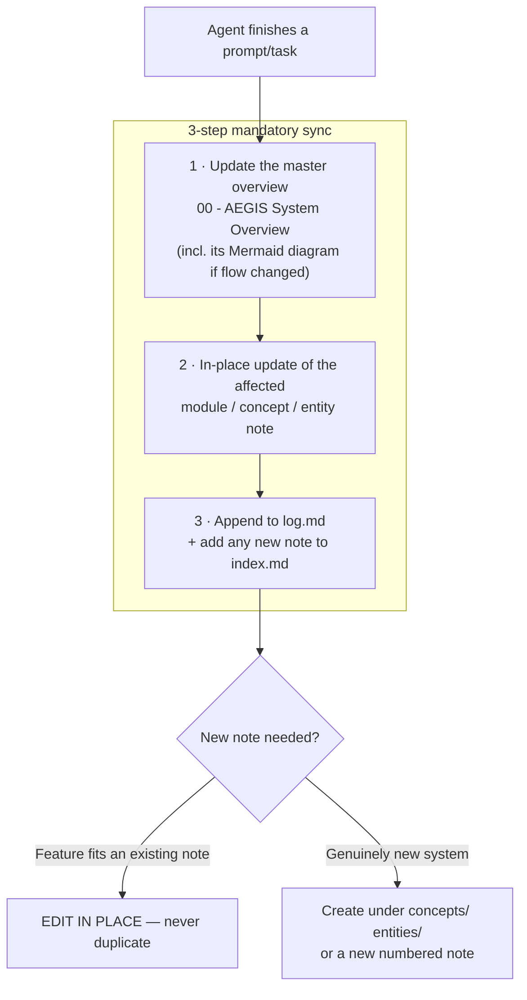

# 🤖 Agent Operating Rules

> **Why this note exists**: the rules governing how AI agents work in this repository lived only in repo-root files (`AGENTS.md`, `CLAUDE.md`) and skill definitions under `.claude/skills/`. None of it was represented in the vault, so the knowledge graph had no node for "how work gets done here" — even though every single `[[log]]` entry is a product of these rules. Start at [[START_HERE]] for the full reading protocol.

---

## The four core architectural principles (never violate)

These are the load-bearing constraints every agent and every commit must respect. Source: `CLAUDE.md`.

| # | Principle | Enforced by | Concept note |
|---|---|---|---|
| 1 | **Server-Side Enforcement** — all auth/RBAC checks occur on backend Express servers; hiding a menu in the UI is not a security control | `requireRole.js`, `canSeeCamera()` | [[05 - 🛡️ Security Architecture]] |
| 2 | **Identity Decoupling** — IDEA1, IDEA2, and HUB are independent identity domains | Separate DBs + `drive_app`/`monitor_app` Postgres roles with `REVOKE CONNECT … FROM PUBLIC` | [[concepts/Identity_Decoupling]] |
| 3 | **Fail-Secure & Air-Gap** — IDEA3 cuts WAN uplink on heartbeat loss | ESP32 relay, inverted logic | [[concepts/Dead_Mans_Switch]] · [[concepts/Contain_Before_Notify]] |
| 4 | **OWASP Hardening** — no `localStorage`/`sessionStorage` for tokens; HttpOnly + SameSite=Strict cookies + CSRF tokens | `csrf.js`, `session.js` | [[concepts/OWASP_Security_Defense]] |

> ⚠️ Note the one deliberate, documented exception to #4: `aegis_theme` and `lang` **are** stored in `localStorage`. These are UI preferences, not credentials — the principle scopes to tokens. Recorded here so future agents don't "fix" it as a violation.

---

## The post-prompt Obsidian sync requirement

`AGENTS.md` and `CLAUDE.md` both mandate that after finishing **any** prompt, feature, or coding task, the agent updates this vault in place. The procedure lives in the `vibe_coding_obsidian_sync` skill:

### The deduplication policy (the rule most often broken)
1. **In-place edit is the default.** If the work relates to an existing note, update that note — including replacing stale or outdated content — so the vault never carries two conflicting versions of the same fact.
2. **New files only for genuinely new systems.** A new `.md` under `concepts/`, `entities/`, or a new numbered top-level note is justified only when nothing existing covers the subject.

See [[.schema.md]] for the directory layout and frontmatter contract this policy operates within.

---

## The Impeccable UI design workflow

All English UI/design prompts route through the Impeccable command set rather than being improvised. Full detail in [[concepts/Impeccable_UI_Design_Workflow]]; the visual constraints those commands operate under are in [[07 - 🎨 Design System & UI Language]].

- Skill definition: `.claude/skills/impeccable/SKILL.md` (+ ~29 `reference/*.md` command files).
- ⚠️ **The skill tree exists four times — and the copies are NOT interchangeable.** `.claude/`, `.agents/`, `.cursor/`, and `.gemini/` each carry a version whose internal script paths are **rewritten to its own directory**, and each is wired to a live hook config:

  | Tree | Used by | Live hook |
  |---|---|---|
  | `.claude/` | Claude Code (auto-discovers `.claude/skills/`) | `.claude/settings.local.json` |
  | `.agents/` | Codex + the tool-neutral path cited by `AGENTS.md` / `README.md` | `.codex/hooks.json` → `.agents/…/hook.mjs` |
  | `.cursor/` | Cursor | `.cursor/hooks.json` → `.cursor/…/hook-before-edit.mjs` |
  | `.gemini/` | Gemini CLI | — |

  **Do not delete these to clean up the graph.** Deleting a tree breaks that tool's hook, and the copies cannot be substituted for one another because each hardcodes its own path. They are excluded from the graph by `userIgnoreFilters` instead — exclusion, not deletion, is the correct fix.

---

## Repository documentation map — what lives outside this vault

The repo root carries several real knowledge documents that are **not** vault notes. Each is now represented by a vault note so the graph has no blind spots:

| Repo file | Represented in vault by | Kind |
|---|---|---|
| `AGENTS.md`, `CLAUDE.md` | **this note** | Agent rules |
| `.claude/skills/vibe_coding_obsidian_sync/SKILL.md` | **this note** + [[.schema.md]] | Sync procedure |
| `.claude/skills/impeccable/**` | [[concepts/Impeccable_UI_Design_Workflow]] | Design workflow |
| `PRODUCT.md`, `DESIGN.md`, `AURORA-GLASS-PROMPT.md` | [[07 - 🎨 Design System & UI Language]] | Design system |
| `docs/superpowers/plans/`, `docs/superpowers/specs/` | [[07 - 🎨 Design System & UI Language]] | Design plans/specs |
| `docs/auth-test.md` | [[concepts/Terminal_Verification_Protocol]] | Verification |
| `shared/db-schema/README.md` | [[concepts/Schema_Ownership_Map]] | Data model |
| `IDEA2-AEGIS_CCTV-Operator/detection-engine/README.md` | [[entities/Detection_Engine_Service]] | Sensor service |
| `IDEA3-AEGIS_Lockdown/firmware/README.md` | [[04 - 🔒 IDEA3 AEGIS Lockdown]] · [[entities/ESP32_Relay_Module]] | Firmware |
| `README.md` (root) | [[00 - 🗺️ AEGIS System Overview]] | Monorepo map |

---

## ⚠️ Vault scope — why the graph looked like noise

The repository root contains a `.obsidian/` folder, meaning Obsidian can be opened on **the whole repo** rather than on `Obsidian_AEGIS_Vault/AEGIS_Knowledge`. When that happens Obsidian indexes every Markdown file in the tree:

| Source | `.md` files | Appears in graph as |
|---|---|---|
| `node_modules/**` | **374** | Hundreds of orphan `README` / `LICENSE` / `CHANGELOG` / `HISTORY` nodes |
| `.claude/` + `.agents/` + `.cursor/` + `.gemini/` skills | **~120** | The `SKILL` hub cluster (`spec-driven-testing`, `playwright-tests`, `tracing`, …) |
| `PUT-LOGOS-HERE.md` placeholders, `dist/` copies | ~5 | Isolated stray dots |
| **Real AEGIS knowledge** | **~45** | The one properly-interlinked cluster |

So roughly **92% of the nodes in the scattered graph were never project knowledge at all** — they are npm package docs and duplicated tool-config files. This is a *vault-scope* problem, not a knowledge-organization problem, and no amount of re-linking notes would have fixed it.

**Fix applied**: `.obsidian/app.json` at the repo root now sets `userIgnoreFilters` for `node_modules/`, the four skill directories, `.git/`, `.impeccable/`, `dist/`, `build/`, `__pycache__/`, `.venv/`, and `PUT-LOGOS-HERE.md`. Reopen the vault (or restart Obsidian) for the graph to re-index.

> **Recommended**: open Obsidian directly on `Obsidian_AEGIS_Vault/AEGIS_Knowledge` instead of the repo root. That folder has its own `.obsidian/` config and contains only real knowledge, so the ignore filters become a safety net rather than the primary defence.

---

## Related
[[START_HERE]] · [[00 - 🗺️ AEGIS System Overview]] · [[.schema.md]] · [[index]] · [[log]] · [[concepts/Impeccable_UI_Design_Workflow]] · [[07 - 🎨 Design System & UI Language]] · [[summaries/06_Wiki_Admin_and_Housekeeping]]
