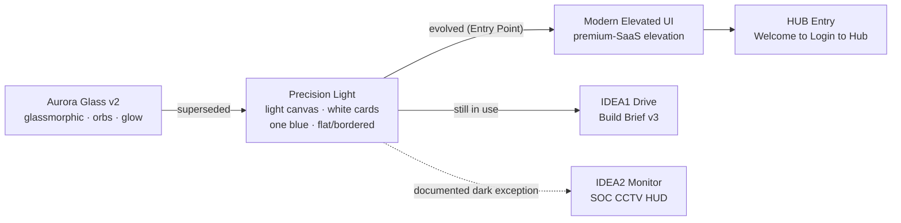

# 🎨 Design System & UI Language

> **Why this note exists**: the design system's source of truth lived entirely in repo-root files (`PRODUCT.md`, `DESIGN.md`, `AURORA-GLASS-PROMPT.md`) plus `docs/superpowers/`, with no vault representation — so ~22 `[[log]]` sessions of UI work had no design-rules node to link back to. History of *what was built* is in [[summaries/01_UI_Design_and_Theming]]; the *rules it should obey* are here.

---

## Product register (from `PRODUCT.md`)

**AEGIS Hub is the single entry gate**: it authenticates, receives the **server-decided** role, and launches exactly the modules that role is entitled to — nothing else exists in the output. Success = "feels like powering on a very expensive machine, while the code underneath demonstrates textbook least-privilege architecture."

**Three audiences**: Thai-first standard users (Drive), administrators (Drive + CCTV + Monitoring), and **graders/code reviewers** — this is a security-course project, so the source will be read for access-control correctness. That third audience is why [[concepts/OWASP_Security_Defense]] and [[05 - 🛡️ Security Architecture]] matter as *deliverables*, not just engineering hygiene.

### The five design principles
1. **One texture, one meaning.** The diagonal hatch is the AEGIS signature: SOLID = the system can see this; HATCHED = it cannot (pending gates, ciphertext, projections, denied cells). This is the visual counterpart of [[concepts/Honest_Telemetry_and_Unavailable_States]].
2. **Restraint.** Mostly grayscale; color appears only where it carries meaning.
3. **Precision.** Crisp edges, perfect alignment, tabular numerals, near-imperceptible shadows.
4. **Security invisible in UI, explicit in code.** Uniform auth errors, default-deny module resolution, no DOM trace of unauthorized capability — each with a Thai comment explaining why. Directly implements principle #1 of [[06 - 🤖 Agent Operating Rules]].
5. **Motion is state.** 120–400 ms, one easing curve; the login cascade gates on the server's answer. Fully usable under `prefers-reduced-motion`.

### Anti-references (deliberately removed directions)
Glow, bloom, glassmorphism, backdrop-blur, dark aurora gradients, particle fields, orbs · generic SaaS dashboards · consumer-playful voice, emoji, exclamation marks · **any UI that surfaces security mechanics to the user** (role pickers, "admin only" teasers, verbose auth errors — the last is an anti-enumeration requirement, not a taste call).

---

## Visual language lineage

- **`AURORA-GLASS-PROMPT.md` is superseded**, not current. It is kept as a historical brief; building from it today would violate the active ban list. Treat it as an archive document.
- **Token source of truth is each app's `src/index.css`** — not this note, and not `DESIGN.md`.
- **IDEA2 Monitor is the one documented dark exception** to the light-canvas default, because a SOC HUD is a dark-room surface.

## Measured contrast rules (the non-negotiable part)

`DESIGN.md` is unusually strict here, and the rules are **measurement-derived, not aesthetic**:

- **Anything set directly on the photograph must be measured against the photograph**, not against a token. Method: hide the element, screenshot what is behind it, take min and max luminance, worst-case both themes and both widths.
- `--ink-3` measures **3.34:1** on the desktop light gate — so **`--ink-3` never touches the bare photograph**. The hero runs `--ink` (14–17:1) and `--ink-2` (4.7–8.7:1).
- **The halo is a contrast fix, not decoration.** Without `.hub-halo` the Hub row description measures 3.04:1 light / **1.39:1 dark** — dark fails because a bright violet fibre tip crosses behind it, and at that point *no* text colour works, not even pure `--ink`. With the halo: 6.3:1 / 7.1:1.
- **`--gate-scrim` is a contrast fix, not decoration.** Card-on-void measures **1.02:1** unscrimmed — the card would read only as a shadow. Any future full-bleed surface owes the same measurement before it ships.
- WCAG AA throughout; `--ink-3` is captions only. Full keyboard operation, focus-visible rings (accent blue, 2 px offset). `prefers-reduced-motion` collapses transitions to 1 ms, and every animated state must also read statically via color/icon/label.
- **Thai-first i18n** (default `th`, TH/EN toggle); Thai body copy at line-height >= 1.7 so tone marks never clip.

---

## Documented drift between `DESIGN.md` and what shipped

Flagged per the Lint workflow in [[.schema.md]] ("flag contradictions between pages") rather than silently reconciled — resolving it is a design decision, not an agent's call:

`DESIGN.md` bans "glow-as-decoration, bloom, backdrop-blur, glassmorphism, dark aurora fields, particle canvases, orbs." But the 2026-07-25 sessions in [[log]] built exactly that on the Drive and Monitor **Login** screens — "Volumetric Aura Glow" (`blur-2xl` pulsing aura layers), neon purple/fuchsia plasma gradients, and large spread shadows.

Partial self-correction already happened: a later same-day pass re-hued everything to a single blue spectrum and **cut the glow intensity substantially** (`0 0 80px 20px @0.4` → `0 0 34px 2px @0.2`), explicitly citing "Precision Light — near-invisible shadows." So the trajectory is back toward the documented system.

**Still unresolved**: whether the remaining Login aura is (a) a sanctioned exception like the Monitor dark HUD and should be written into `DESIGN.md`, or (b) residue to be removed. Tracked in [[summaries/08_Outstanding_Items_Consolidated]].

---

## Design plans & critiques in the repo (`docs/superpowers/`)

Working artifacts from the Impeccable workflow, kept outside the vault as build records:

| File | Subject |
|---|---|
| `docs/superpowers/plans/2026-07-28-aegis-monitor-unified-ui.md` | Monitor unified-UI plan |
| `docs/superpowers/plans/2026-07-28-aegis-monitor-layout-contrast-plan.md` | Monitor layout/contrast plan |
| `docs/superpowers/specs/2026-07-28-aegis-monitor-layout-contrast-design.md` | Matching design spec |
| `IDEA2-AEGIS_CCTV-Operator/.impeccable/critique/2026-07-17T…mockup.md` | Operator mockup critique |

The command framework that produced them is documented in [[concepts/Impeccable_UI_Design_Workflow]].

---

## Related
[[START_HERE]] · [[00 - 🗺️ AEGIS System Overview]] · [[01 - 🚪 HUB-AEGIS Entry]] · [[02 - 💾 IDEA1 AEGIS Drive LC]] · [[03 - 📹 IDEA2 AEGIS Monitor]] · [[06 - 🤖 Agent Operating Rules]] · [[concepts/Impeccable_UI_Design_Workflow]] · [[concepts/Honest_Telemetry_and_Unavailable_States]] · [[summaries/01_UI_Design_and_Theming]]
