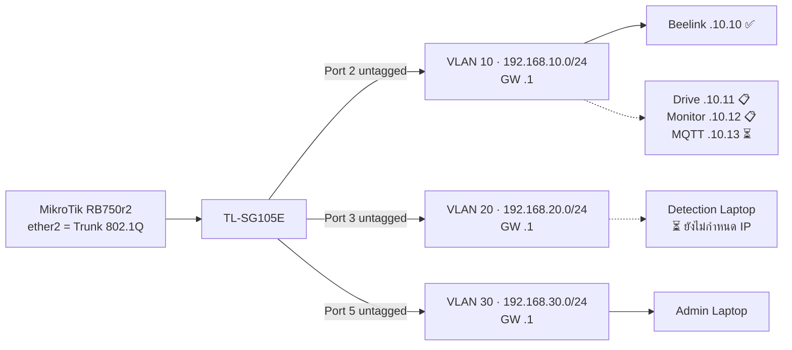

# 🌐 VLAN & IP Plan — ผังจริงที่ใช้งานอยู่

> ผังนี้คือ **ของจริงบนอุปกรณ์** ส่วนผังฉบับออกแบบในเล่มอยู่ที่ [[concepts/VLAN_Segmentation_and_Port_Mapping]]
> กลับไปหน้าศูนย์รวม: [[00-MOC/AEGIS-Infrastructure-MOC]]

---

## 🗺️ ตาราง VLAN / Subnet

| VLAN | Zone | Subnet | Gateway | อุปกรณ์ในวง | สถานะ |
| :--- | :--- | :--- | :--- | :--- | :--- |
| **10** | Server Zone | `192.168.10.0/24` | `192.168.10.1` | Beelink + Docker services | ✅ ใช้งานจริง |
| **20** | Detector Zone | `192.168.20.0/24` | `192.168.20.1` | Detection Laptop (Edge AI) | ✅ วงพร้อม / ⏳ ยังไม่กำหนด IP เครื่อง |
| **30** | Management Zone | `192.168.30.0/24` | `192.168.30.1` | Admin Laptop | ✅ ใช้งานจริง |
| **1** | Native / Technician | — | — | หน้าเว็บจัดการ Switch | ✅ ใช้จัดการ Switch ผ่าน Port 4 |

Gateway ทั้งสามวงทำงานบน [[10-Network/MikroTik-Config|MikroTik RB750r2]] ผ่าน VLAN Interface บน `ether2`

---

## 📍 ตารางจอง IP (VLAN 10 · Server Zone)

| IP | เจ้าของ | สถานะ | หมายเหตุ |
| :--- | :--- | :--- | :--- |
| `192.168.10.1` | Gateway (MikroTik VLAN 10) | ✅ | ping ผ่าน |
| `192.168.10.10` | **Beelink Host OS** (`aegis-system`) | ✅ **ใช้งานจริง + SSH ผ่าน** | [[20-Server/Beelink-Ubuntu-Host]] |
| `192.168.10.11` | IDEA1 **AEGIS Drive** (Macvlan) | 📋 **Design เท่านั้น — ยังไม่ deploy** | [[02 - 💾 IDEA1 AEGIS Drive LC]] |
| `192.168.10.12` | IDEA2 **AEGIS Monitor** (Macvlan) | 📋 **Design เท่านั้น — ยังไม่ deploy** | [[03 - 📹 IDEA2 AEGIS Monitor]] |
| `192.168.10.13` | **MQTT Broker** (IDEA3) | ⏳ **จองไว้ ยังไม่มีของจริง** | [[04 - 🔒 IDEA3 AEGIS Lockdown]] |

> ⚠️ `.11` / `.12` / `.13` เป็น **การจองบนกระดาษ** — ยังไม่มี container ใดถือ IP เหล่านี้จริง
> ⚠️ แผน Macvlan มีความเสี่ยงชนกับ Twingate Connector ที่รันบน Docker Bridge → ดูข้อ 4 ใน [[90-Status/Document-Conflicts]] และ [[40-Deployment/Docker-Stack-Plan]]

---

## 📍 ตารางจอง IP (VLAN 20 / 30)

| IP | เจ้าของ | สถานะ | หมายเหตุ |
| :--- | :--- | :--- | :--- |
| `192.168.20.1` | Gateway VLAN 20 | ✅ | |
| `192.168.20.x` | **Detection Laptop** | ⏳ **ยังไม่กำหนด Static / DHCP Reservation** | ต้องทำก่อนเชื่อม Detection Engine (P3 ใน [[90-Status/Open-Items-Backlog]]) |
| `192.168.30.1` | Gateway VLAN 30 | ✅ | |
| `192.168.30.10` | **Admin Laptop** | 📋 **กำหนดไว้ในแผน ยังไม่ fix จริง** | ปัจจุบันเข้าวง VLAN 30 ได้และ ping/SSH ผ่าน |
| `192.168.30.2` | Web UI ของ Switch | ✅ | เข้าได้ผ่าน Port 4 (Technician) |

---

## 🧪 ผลทดสอบ Routing (หลักฐาน)

| การทดสอบ | ผล | สถานะ |
| :--- | :--- | :--- |
| Ping VLAN 30 → VLAN 10 | **0% packet loss**, latency **0.5–0.8 ms** | ✅ |
| SSH จาก Admin Laptop (VLAN 30) → Beelink (VLAN 10) | เชื่อมต่อสำเร็จ | ✅ |
| Inter-VLAN Routing ผ่าน MikroTik | ทำงานหลังจัดลำดับ Firewall Rule ใหม่ | ✅ |

> ✅ ในโน้ตนี้ทุกอันมีหลักฐานการทดสอบข้างต้นกำกับ

---

## 🖼️ ผังจริง

---

## 🔗 โน้ตที่เกี่ยวข้อง

* [[00-MOC/AEGIS-Infrastructure-MOC]]
* [[10-Network/MikroTik-Config]] · [[10-Network/Switch-VLAN-Config]] · [[10-Network/Hardware-Inventory]]
* [[40-Deployment/Docker-Stack-Plan]]
* [[concepts/VLAN_Segmentation_and_Port_Mapping]] (ฉบับออกแบบในเล่ม)
* [[90-Status/Document-Conflicts]]
