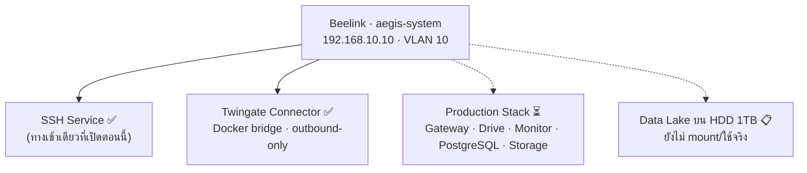

# 💻 Beelink Ubuntu Host — `aegis-system`

> Core Server ของทั้งระบบ AEGIS · สเปกฮาร์ดแวร์ดูที่ [[entities/Beelink_Mini_S_NAS]] และ [[10-Network/Hardware-Inventory]]
> กลับไปหน้าศูนย์รวม: [[00-MOC/AEGIS-Infrastructure-MOC]]

---

## ✅ สถานะปัจจุบัน

| รายการ | ค่า / รายละเอียด | สถานะ |
| :--- | :--- | :--- |
| **Hostname** | `aegis-system` | ✅ |
| **OS** | Ubuntu Server (Headless — ไม่มี GUI) | ✅ ติดตั้งแล้ว ใช้งานจริง |
| **IP** | `192.168.10.10` — VLAN 10 Server Zone | ✅ ping/SSH ผ่าน |
| **การเชื่อมต่อ** | LAN เข้า Port 2 ของ [[10-Network/Switch-VLAN-Config|TL-SG105E]] (Access VLAN 10) | ✅ |
| **SSH Service** | เปิดใช้งาน เข้าได้ทั้งจากภายในและผ่าน [[30-RemoteAccess/Twingate-Setup\|Twingate]] | ✅ |
| **Docker Environment** | ติดตั้งแล้ว และรัน [[30-RemoteAccess/Twingate-Setup\|Twingate Connector]] เป็น container อยู่จริง | ✅ |
| **Production Stack (Gateway/Drive/Monitor/PostgreSQL)** | **ยังไม่ deploy ลงเครื่องนี้** | ⏳ |

> ⚠️ **จุดที่ต้องระวังตอนเขียนเล่ม**: ข้อความ "Docker stack healthy · `http://localhost/monitor/` HTTP 200" ที่บันทึกไว้ใน [[00 - 🗺️ AEGIS System Overview]] เป็นผลจากการรันบน **เครื่อง dev ของผู้พัฒนา** ไม่ใช่บน Beelink ตัวนี้ → ดูข้อ 7 ใน [[90-Status/Document-Conflicts]]

---

## 🎯 บทบาทที่วางไว้

---

## ⏳ งานค้างที่ผูกกับ Host ตัวนี้

| งาน | ความสำคัญ | สถานะ |
| :--- | :--- | :--- |
| **ตรวจสถานะ UFW จริง** — เคยปิดชั่วคราวตอนทดสอบ routing | P1 | ⏳ **ห้ามสมมติว่าเปิดแล้ว ต้องรัน `ufw status verbose` ยืนยัน** |
| ปิดงาน SSH Hardening | P1 | 🔧 [[20-Server/SSH-Hardening-Status]] |
| Audit ว่า Docker / repo / secrets เป็นเวอร์ชันล่าสุดก่อน deploy | P2 | ⏳ |
| Deploy production stack | P2 | ⏳ [[40-Deployment/Docker-Stack-Plan]] |
| ทดสอบ Persistence / Health Check / Restart / Recovery | P2 | ⏳ |
| Backup config ของ Ubuntu (`/etc`, netplan, sshd_config, compose) | P2 | ⏳ |
| ยืนยันว่า OpenVPN service ถูก disable ไม่ให้รันค้าง | P1/P2 | ⏳ [[30-RemoteAccess/OpenVPN-Deprecated]] |

---

## 🔗 โน้ตที่เกี่ยวข้อง

* [[00-MOC/AEGIS-Infrastructure-MOC]]
* [[20-Server/Linux-User-Accounts]] · [[20-Server/SSH-Hardening-Status]]
* [[40-Deployment/Docker-Stack-Plan]]
* [[10-Network/VLAN-IP-Plan]]
* [[entities/Beelink_Mini_S_NAS]]
* [[90-Status/Open-Items-Backlog]]
