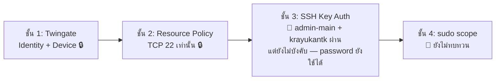

# 🔑 SSH Hardening — สถานะและ Checklist

> ⚠️ **สถานะรวม: 🔧 ยังไม่ปิดงาน** — `PasswordAuthentication` **ยังเปิดอยู่** ห้ามเขียนในเล่มว่าปิดแล้ว
> กลับไปหน้าศูนย์รวม: [[00-MOC/AEGIS-Infrastructure-MOC]]

> **Status correction 2026-08-11 (ผู้ดูแลระบบยืนยัน)**: `PermitRootLogin no`, `PubkeyAuthentication yes` และ UFW Twingate path ทำแล้ว; `admin-main`/`krayukantk` key ผ่าน. งานค้างคือ key ของ `pubpup2006p`, `PasswordAuthentication no`, UFW VLAN 30 direct test, Twingate token rotation และ DB password rotation
>
> **ลำดับถัดไป**: ทดสอบ UFW จาก VLAN 30 โดยคง Twingate/admin session; rotate Twingate Connector token พร้อมยืนยัน Healthy; ให้ `pubpup2006p` สร้างและทดสอบ key คู่ขนาน; หลัง key/cleanup ครบจึงปิด Password Auth; rotate DB passwords ก่อน deploy

---

## 📊 สถานะรายบัญชี

| บัญชี | สร้าง Key (ed25519) | ใส่ใน `~/.ssh/authorized_keys` | ทดสอบเข้าโดยไม่ถาม password | สถานะ |
| :--- | :--- | :--- | :--- | :--- |
| `admin-main` | ✅ | ✅ | ✅ **ผ่านแล้ว** | 🔧 (รอปิด global Password Auth) |
| `pubpup2006p` | ⏳ ต้องสร้าง**บนเครื่องตัวเอง** | ⏳ | ⏳ | ⏳ |
| `krayukantk` | ✅ สร้างบน Windows ของเจ้าของและตั้ง passphrase | ✅ เพิ่มในบัญชีตัวเองแล้ว | ✅ ใช้ `-i` + `IdentitiesOnly=yes` เข้าได้โดยถามเฉพาะ key passphrase | 🔧 รอ strict no-fallback test + ล้าง key เก่า/ซ้ำ |

| ค่าคอนฟิก `sshd_config` | สถานะปัจจุบัน |
| :--- | :--- |
| `PubkeyAuthentication` | ✅ effective value เป็น `yes` ตาม `sshd -T` |
| `PasswordAuthentication` | ⏳ effective value เป็น **`yes`** — กำหนด explicit โดย `/etc/ssh/sshd_config.d/50-cloud-init.conf:1`; ยังตั้งใจเปิดชั่วคราว |
| `PermitRootLogin` | ✅ **`no`** — ผู้ดูแลระบบยืนยันว่า apply แล้วเมื่อ 2026-08-11 |

### หลักฐาน Effective SSH Configuration (2026-08-08)

ตรวจผ่าน `admin-main` ด้วย `sudo sshd -T` ได้ค่าที่ SSH daemon ใช้งานจริง:

```text
permitrootlogin prohibit-password
pubkeyauthentication yes
passwordauthentication yes
```

การค้นทั้ง `/etc/ssh/sshd_config` และ `/etc/ssh/sshd_config.d/` พบ explicit setting เพียง:

```text
/etc/ssh/sshd_config.d/50-cloud-init.conf:1:PasswordAuthentication yes
```

ผลด้านบนเป็น baseline ก่อน hardening. เมื่อ 2026-08-11 ผู้ดูแลระบบยืนยันว่า `PermitRootLogin no` และ `PubkeyAuthentication yes` ถูกดำเนินการแล้ว แต่ไม่ได้ส่ง exact post-apply command output/rule file contents ใน prompt นี้ จึงบันทึกชนิดหลักฐานเป็น **operator-confirmed** โดยไม่แต่งรายละเอียดเพิ่ม ส่วน `PasswordAuthentication` ยังคง `yes` จนกว่า `pubpup2006p` จะผ่าน key

### ขอบเขตสิทธิ์ผู้ดูแล

* `krayukantk` รัน `sudo sshd -T ...` แล้วถูกปฏิเสธด้วย `sudo: I'm sorry krayukantk. I'm afraid I can't do that` จึงยืนยันได้ว่าบัญชีนี้ไม่มีสิทธิ์ sudo สำหรับงานระบบ
* งานแก้/ตรวจ SSH configuration ระดับ host ใช้ `admin-main`; การเข้าใหม่ด้วย key เฉพาะของ `admin-main` และ `IdentitiesOnly=yes` สำเร็จ ก่อนรันคำสั่งตรวจ effective config
* การไม่มี sudo ของสมาชิกทั่วไปสอดคล้องกับ least privilege; ห้ามยกระดับสิทธิ์เพียงเพื่อให้ทำขั้น hardening นี้ได้

### หลักฐานล่าสุด — `krayukantk` (2026-08-08)

* สร้างคู่กุญแจ ed25519 บนเครื่อง Windows ของเจ้าของเอง โดย Private Key ไม่ถูกนำมาบันทึกใน repo/วอลต์
* เพิ่มเฉพาะ Public Key ลง `/home/krayukantk/.ssh/authorized_keys` และตั้ง permission ของ `.ssh`/`authorized_keys`
* จาก Windows PowerShell ใช้ identity ของ `krayukantk` แบบระบุไฟล์และ `IdentitiesOnly=yes`; SSH ขอ **key passphrase** แล้วเข้า Ubuntu `aegis-system` สำเร็จ โดยไม่ถามรหัสผ่านของบัญชี Linux
* หลักฐานนี้ปิดขั้น “key ใช้งานได้” ได้ แต่ยังต้องทดสอบซ้ำด้วย `PasswordAuthentication=no` + `PreferredAuthentications=publickey` ฝั่ง client เพื่อพิสูจน์ว่าไม่มี password fallback ก่อนถือว่าผ่านแบบเข้ม
* ค่า `Last login ... from 192.168.10.10` มาจาก session ที่ SSH ซ้อนจาก Beelink เข้าหาตัวเอง จึง **ไม่ใช่** หลักฐาน source IP ของ Twingate; ค่า `172.17.0.2` ที่เห็นอีกรอบเป็นเพียงเบาะแส Docker bridge และต้องยืนยันด้วย `journalctl`/`ss`/`tcpdump` ก่อนนำไปเขียน UFW rule

---

## 🧭 หลักการที่ยึด

1. **Private Key อยู่บนเครื่องเจ้าของเท่านั้น — ห้ามแชร์ ห้ามส่งผ่านแชท ห้ามก๊อปข้ามเครื่อง**
2. **Public Key** เท่านั้นที่ถูกนำไปวางใน `~/.ssh/authorized_keys` บน Server
3. หนึ่งคน = หนึ่ง Key = หนึ่งบัญชี → ถอนสิทธิ์รายคนได้ด้วยการลบ Public Key บรรทัดเดียว

---

## 📕 บทเรียนที่ได้ (ต้องบันทึกไว้ในเล่ม)

> **เคยสร้าง Key ให้สมาชิกบน Laptop ของ admin หลัก** ซึ่ง **ผิดหลัก Production**
>
> เหตุผล: Private Key ต้อง **ไม่เคยออกจากเครื่องเจ้าของ** ถ้า admin เป็นคนสร้างให้ แปลว่า Private Key เคยอยู่บนเครื่องคนอื่นอย่างน้อยหนึ่งครั้ง — Key นั้นถือว่า "เปื้อน" แล้ว และ non-repudiation หายไป (พิสูจน์ไม่ได้ว่าใครใช้ Key นั้นเข้าระบบ)
>
> **การแก้**: ให้เจ้าของสร้าง Key ใหม่บนเครื่องตัวเอง แล้ว **ลบ Public Key เก่าที่สร้างผิดวิธีออกจาก `authorized_keys`**

---

## ✅ Checklist ก่อนปิด Password Login (ทำตามลำดับ ห้ามข้าม)

| # | ขั้นตอน | สถานะ |
| :-- | :--- | :--- |
| 1 | สมาชิกทุกคนสร้าง Key บนเครื่องตัวเอง (`ssh-keygen -t ed25519`) | 🔧 `admin-main` + `krayukantk` ผ่าน · `pubpup2006p` ค้าง |
| 2 | เพิ่ม **Public Key** ลงในบัญชี Linux ของตนเองบน Server | 🔧 `admin-main` + `krayukantk` ผ่าน · `pubpup2006p` ค้าง |
| 3 | ทดสอบเข้าผ่าน [[30-RemoteAccess/Twingate-Setup\|Twingate]] **จากเครือข่ายภายนอก** ด้วย key รายบุคคล | 🔧 Twingate/UFW path และ key ของ `krayukantk` ผ่านแล้ว; strict no-fallback ของสมาชิก + `pubpup2006p` ยังค้าง |
| 4 | ยืนยันว่า **ไม่ถูกถาม Ubuntu password** และบังคับ client `PasswordAuthentication=no` | 🔧 รอบปกติของ `krayukantk` ไม่ถาม Ubuntu password; strict test ยังค้าง |
| 5 | **ลบ Key เก่า / ซ้ำ / ที่สร้างผิดเครื่อง** ออกจาก `authorized_keys` ทุกบัญชี | ⏳ |
| 6 | **เปิด session สำรองค้างไว้อย่างน้อย 1 session** ก่อนแก้ `sshd_config` | ⏳ |
| 7 | ตั้ง `PermitRootLogin no` + explicit `PubkeyAuthentication yes` | ✅ ผู้ดูแลระบบยืนยันว่าทำแล้ว 2026-08-11 |
| 8 | เมื่อ key/cleanup ครบ จึงตั้ง `PasswordAuthentication no`; reload แล้ว **ทดสอบเปิด session ใหม่ให้ผ่านก่อน** จึงค่อยปิด session เก่า | ⏳ |

> ⚠️ **ข้อ 6 และ 8 คือกันตัวเองล็อกออกจาก Server** — Beelink เป็นเครื่อง headless ที่อยู่หลัง Double NAT ถ้าปิด password auth ผิดจังหวะแล้ว Key ใช้ไม่ได้ จะเหลือทางเดียวคือเดินไปต่อจอกับคีย์บอร์ดที่ตัวเครื่อง

---

## 🛡️ ตำแหน่งในโครงสร้าง Defense in Depth



> ตราบใดที่ชั้น 3 ยังรับ password อยู่ ความแข็งแรงของ SSH ยังขึ้นกับความแข็งของรหัสผ่าน 3 บัญชี ไม่ใช่ตัว Key

---

## 🔗 โน้ตที่เกี่ยวข้อง

* [[00-MOC/AEGIS-Infrastructure-MOC]]
* [[20-Server/Linux-User-Accounts]] · [[20-Server/Beelink-Ubuntu-Host]]
* [[30-RemoteAccess/Twingate-Setup]]
* [[05 - 🛡️ Security Architecture]] · [[concepts/OWASP_Security_Defense]]
* [[90-Status/Open-Items-Backlog]] (P1)
