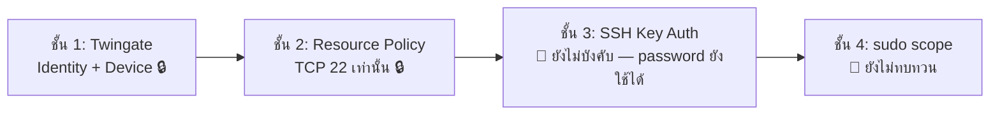

# 🔑 SSH Hardening — สถานะและ Checklist

> ⚠️ **สถานะรวม: 🔧 ยังไม่ปิดงาน** — `PasswordAuthentication` **ยังเปิดอยู่** ห้ามเขียนในเล่มว่าปิดแล้ว
> กลับไปหน้าศูนย์รวม: [[00-MOC/AEGIS-Infrastructure-MOC]]

---

## 📊 สถานะรายบัญชี

| บัญชี | สร้าง Key (ed25519) | ใส่ใน `~/.ssh/authorized_keys` | ทดสอบเข้าโดยไม่ถาม password | สถานะ |
| :--- | :--- | :--- | :--- | :--- |
| `admin-main` | ✅ | ✅ | ✅ **ผ่านแล้ว** | 🔧 (รอเพื่อนอีก 2 คน) |
| `pubpup2006p` | ⏳ ต้องสร้าง**บนเครื่องตัวเอง** | ⏳ | ⏳ | ⏳ |
| `krayukantk` | ⏳ ต้องสร้าง**บนเครื่องตัวเอง** | ⏳ | ⏳ | ⏳ |

| ค่าคอนฟิก `sshd_config` | สถานะปัจจุบัน |
| :--- | :--- |
| `PasswordAuthentication` | ⏳ **ยังเป็น `yes`** — ยังไม่ปิด |
| `PermitRootLogin` | ⏳ ยังไม่ยืนยัน/ยังไม่ตั้งเป็น `no` |

---

## 🧭 หลักการที่ยึด

1. **Private Key อยู่บนเครื่องเจ้าของเท่านั้น — ห้ามแชร์ ห้ามส่งผ่านแชท ห้ามก๊อปข้ามเครื่อง**
2. **Public Key** เท่านั้นที่ถูกนำไปวางใน `~/.ssh/authorized_keys` บน Server
3. หนึ่งคน = หนึ่ง Key = หนึ่งบัญชี → ถอนสิทธิ์รายคนได้ด้วยการลบ Public Key บรรทัดเดียว

---

## 📕 บทเรียนที่ได้ (ต้องบันทึกไว้ในเล่ม)

> **เคยสร้าง Key ให้สมาชิกบน Laptop ของ admin หลัก** ซึ่ง **ผิดหลัก Production**
>
> เหตุผล: Private Key ต้อง **ไม่เคยออกจากเครื่องเจ้าของ** ถ้า admin เป็นคนสร้างให้ แปลว่า Private Key เคยอยู่บนเครื่องคนอื่นอย่างน้อยหนึ่งครั้ง — Key นั้นถือว่า "เปื้อน" แล้ว และ non-repudiation หายไป (พิสูจน์ไม่ได้ว่าใครใช้ Key นั้นเข้าระบบ)
>
> **การแก้**: ให้เจ้าของสร้าง Key ใหม่บนเครื่องตัวเอง แล้ว **ลบ Public Key เก่าที่สร้างผิดวิธีออกจาก `authorized_keys`**

---

## ✅ Checklist ก่อนปิด Password Login (ทำตามลำดับ ห้ามข้าม)

| # | ขั้นตอน | สถานะ |
| :-- | :--- | :--- |
| 1 | เพื่อน 2 คน (`pubpup2006p`, `krayukantk`) **สร้าง Key บนเครื่องตัวเอง** (`ssh-keygen -t ed25519`) | ⏳ |
| 2 | เพิ่ม **Public Key** ลงในบัญชี Linux ของตนเองบน Server | ⏳ |
| 3 | ทดสอบเข้าผ่าน [[30-RemoteAccess/Twingate-Setup\|Twingate]] **จากเครือข่ายภายนอก** | ⏳ |
| 4 | ยืนยันว่า **ไม่ถูกถาม Ubuntu password** ตอน login | ⏳ |
| 5 | **ลบ Key เก่า / ซ้ำ / ที่สร้างผิดเครื่อง** ออกจาก `authorized_keys` ทุกบัญชี | ⏳ |
| 6 | **เปิด session สำรองค้างไว้อย่างน้อย 1 session** ก่อนแก้ `sshd_config` | ⏳ |
| 7 | ตั้ง `PasswordAuthentication no` + `PermitRootLogin no` | ⏳ |
| 8 | `reload sshd` แล้ว **ทดสอบเปิด session ใหม่ให้ผ่านก่อน** จึงค่อยปิด session เก่า | ⏳ |

> ⚠️ **ข้อ 6 และ 8 คือกันตัวเองล็อกออกจาก Server** — Beelink เป็นเครื่อง headless ที่อยู่หลัง Double NAT ถ้าปิด password auth ผิดจังหวะแล้ว Key ใช้ไม่ได้ จะเหลือทางเดียวคือเดินไปต่อจอกับคีย์บอร์ดที่ตัวเครื่อง

---

## 🛡️ ตำแหน่งในโครงสร้าง Defense in Depth

> ตราบใดที่ชั้น 3 ยังรับ password อยู่ ความแข็งแรงของ SSH ยังขึ้นกับความแข็งของรหัสผ่าน 3 บัญชี ไม่ใช่ตัว Key

---

## 🔗 โน้ตที่เกี่ยวข้อง

* [[00-MOC/AEGIS-Infrastructure-MOC]]
* [[20-Server/Linux-User-Accounts]] · [[20-Server/Beelink-Ubuntu-Host]]
* [[30-RemoteAccess/Twingate-Setup]]
* [[05 - 🛡️ Security Architecture]] · [[concepts/OWASP_Security_Defense]]
* [[90-Status/Open-Items-Backlog]] (P1)
