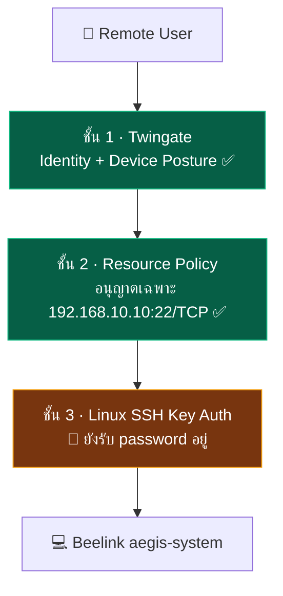

# ☁️ Twingate ZTNA — ช่องทาง Remote Access จริง

> **นี่คือช่องทาง Remote Access เดียวที่ใช้งานจริง** ส่วน OpenVPN ถูกยกเลิกแล้ว → [[30-RemoteAccess/OpenVPN-Deprecated]]
> กลับไปหน้าศูนย์รวม: [[00-MOC/AEGIS-Infrastructure-MOC]]

---

## 🎯 ทำไมเลือก Twingate แทน OpenVPN (เหตุผลเชิงสถาปัตยกรรม)

**ข้อจำกัดจริงที่บังคับให้ต้องเปลี่ยน:**

* Server อยู่หลัง **Double NAT** — `MikroTik ether1` → **Router บ้านเพื่อน** → ISP
* ทีม **ไม่มีสิทธิ์ Admin** เข้า Router ตัวหน้าสุด → **ทำ Port Forwarding ไม่ได้**
* ไม่มี Public IP / ไม่มี Inbound path ใด ๆ เข้ามาถึง MikroTik ได้เลย

**สิ่งที่ Twingate แก้ให้:**

* Connector เชื่อมออกแบบ **Outbound-only** ไปหา Twingate Relay → **ไม่ต้องเปิด Inbound Port แม้แต่พอร์ตเดียว**
* ผลลัพธ์ด้านความปลอดภัย: **Attack Surface ที่ขอบเครือข่ายเหลือศูนย์** — ไม่มีพอร์ตใดให้ scan เจอจากอินเทอร์เน็ต
* ต่างจาก VPN ตรงที่ให้สิทธิ์ **ระดับ Resource (IP:Port)** ไม่ใช่ระดับ "โยนเข้าไปในวง LAN"

> ข้อจำกัดนี้เปลี่ยนจาก "อุปสรรค" เป็น **จุดขายเชิงสถาปัตยกรรมของเล่ม** ได้ — ควรเขียนไว้ในเล่มแบบนี้แทนการเขียนว่า OpenVPN ทำงานได้

---

## ✅ สิ่งที่ทำจริงแล้ว

| รายการ | ค่า | สถานะ |
| :--- | :--- | :--- |
| **Remote Network** | `aegissut` | ✅ |
| **Connector** | รันเป็น **Docker container** บน Beelink | ✅ สถานะ **Online / Healthy** |
| **Network mode ของ Connector** | **Docker bridge** | ✅ (⚠️ มีผลต่อแผน Macvlan — ดูด้านล่าง) |
| **Resource** | `AEGIS-Beelink-SSH` → `192.168.10.10` | ✅ |
| **Protocol/Port ที่อนุญาต** | **TCP 22 เท่านั้น** (UDP / ICMP ปิด) | ✅ |
| **Access Policy** | ผูกกับ Group `Admin` และเพิ่มสมาชิกเข้ากลุ่มแล้ว | ✅ |

---

## 🧪 หลักฐานการทดสอบจากภายนอก (ขั้น 14)

ทดสอบผ่าน **Mobile Hotspot** (นอกเครือข่าย AEGIS ทั้งหมด):

* ✅ Windows client แสดง Network Interface ชื่อ **`Twingate`**
* ✅ `Test-NetConnection` → **`TcpTestSucceeded: True`** ที่ `192.168.10.10:22`
* ✅ **SSH เข้า Beelink จากนอกเครือข่ายสำเร็จ**

> นี่คือหลักฐานที่ทำให้ขั้น 12–14 ติดสถานะ ✅ ได้

---

## 🛡️ Defense in Depth ที่ได้จากช่องทางนี้

> ชั้นที่ 3 ยังไม่แข็งเต็มที่ → [[20-Server/SSH-Hardening-Status]]

---

## ⏳ Security Housekeeping ที่ยังค้าง

| งาน | เหตุผล | ความสำคัญ | สถานะ |
| :--- | :--- | :--- | :--- |
| **Rotate Connector Token** | Token **เคยปรากฏบนหน้าจอ** (ระหว่างตั้งค่า/บันทึกภาพ) → ต้องถือว่ารั่วแล้ว | **P1** | ⏳ |
| ตรวจ Group Membership ไม่ให้กว้างเกิน | ใครอยู่ใน `Admin` = เข้า SSH ได้ | P1 | ⏳ |
| ตั้ง **Restart Policy / Health Check** ให้ Connector container | ถ้า container ตายแล้วไม่ restart = **ล็อกตัวเองออกจาก Server ทั้งทีม** | P1 | ⏳ |
| เขียน **Recovery note** กรณี Connector container ล่ม | ตอนนี้ทางกู้เดียวคือเดินไปต่อจอที่ตัวเครื่อง | P2 | ⏳ |

> ⚠️ **ห้ามใส่ Connector Token / Service Key จริงลงในโน้ตนี้หรือใน repo** — ใช้ placeholder `<TWINGATE_CONNECTOR_TOKEN>` เท่านั้น

---

## ⚠️ ข้อควรระวังก่อน Deploy Docker Stack

Connector **รันบน Docker bridge network** ขณะที่แผนในเล่มกำหนดให้ Drive/Monitor ใช้ **Macvlan** (`.11` / `.12`)

* Linux มีข้อจำกัด **Macvlan-to-Host**: container/host บน bridge มักจะ **มองไม่เห็น** container ที่อยู่บน macvlan interface เดียวกัน
* ⇒ Connector อาจ **เข้าถึง Drive/Monitor ไม่ได้** แม้จะสร้าง Resource ชี้ไปที่ `.11` / `.12` แล้วก็ตาม
* แผนสำรอง: เปลี่ยน Connector เป็น `--network host` **หรือ** เลิกใช้ Macvlan แล้วใช้ Bridge + Reverse Proxy แทน

รายละเอียด: ข้อ 4 ใน [[90-Status/Document-Conflicts]] และ [[40-Deployment/Docker-Stack-Plan]]

---

## ⚠️ จุดที่ขัดกับหลักการในเล่ม

เล่ม §2.3.4 / §3.5.6 ระบุว่า **"ต้องเข้าวง VLAN 30 Management ก่อนจึงเข้าถึงบริการอื่นได้"**
แต่ Resource `AEGIS-Beelink-SSH` **ชี้ตรงไปที่ `192.168.10.10` (VLAN 10) โดยไม่ผ่าน VLAN 30**

→ ยังไม่ตัดสินใจว่าจะแก้ทางไหน ดูข้อ 3 ใน [[90-Status/Document-Conflicts]] ⏳

---

## 🔄 อัปเดตการจัดเก็บเอกสาร (2026-08-06)

สถานะการใช้งานจริงยังคงเดิม: Twingate `aegissut` เชื่อมต่อผ่าน Connector บน Beelink และเปิด Resource `AEGIS-Beelink-SSH` เฉพาะ TCP 22 ได้ โดยมีหลักฐานทดสอบจาก Mobile Hotspot แล้ว เอกสารชุดนี้ถูกเก็บร่วมกับ source ของ AEGIS ใน GitHub repository `kraveerachat/Project-End-The-AEGIS` บน branch `fix/hub-nginx-monitor-routing-and-ingest-guard` เพื่อให้ตรวจสอบย้อนหลังได้ ส่วน `main` ของ repository ปลายทางเป็นโปรเจกต์เดิมคนละระบบ จึงยังไม่ถูก overwrite

> ย้ำ: ใน repository และ Obsidian มีเฉพาะ placeholder เท่านั้น ห้าม commit Connector Token จริง และงาน P1 เดิม (rotate token, จำกัด Group, restart policy/health check) ยังไม่ปิด
## 🔗 โน้ตที่เกี่ยวข้อง

* [[00-MOC/AEGIS-Infrastructure-MOC]]
* [[30-RemoteAccess/OpenVPN-Deprecated]]
* [[20-Server/SSH-Hardening-Status]] · [[20-Server/Beelink-Ubuntu-Host]]
* [[10-Network/MikroTik-Config]] (Double NAT)
* [[concepts/ZTNA_Twingate_vs_OpenVPN]] (ฉบับออกแบบในเล่ม — ⚠️ ล้าสมัย)
* [[90-Status/Document-Conflicts]] · [[90-Status/Open-Items-Backlog]]
