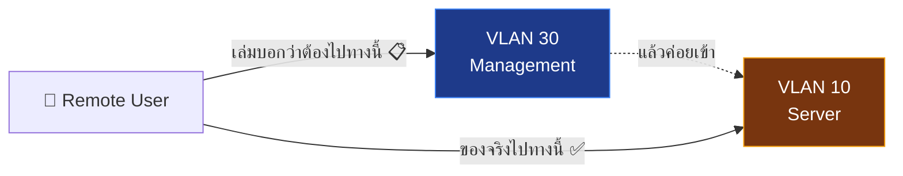

# ⚠️ Document Conflicts — จุดที่เอกสารขัดกับของจริง

> รายการนี้คือจุดที่ **เล่มรายงาน / โน้ตเดิมในวอลต์ ไม่ตรงกับสิ่งที่ทำจริงบนฮาร์ดแวร์**
> **หลักการตัดสิน: ยึดของจริงเป็นความจริง** แล้วแก้เอกสารตาม; ข้อ 3 มี operational direction แล้วเมื่อ 2026-08-08 แต่ถ้อยคำในเล่มยังต้องแก้
> กลับไปหน้าศูนย์รวม: [[00-MOC/AEGIS-Infrastructure-MOC]]

---

## 1️⃣ รุ่นอุปกรณ์

| | ค่า |
| :--- | :--- |
| **ของจริง** | MikroTik **RB750r2** + TP-Link **TL-SG105E** |
| **เอกสารเก่าบางที่** | `RB750Gr3` + `TL-SG108E` |
| **ตัดสิน** | ✅ **ยึดของจริง** |

> 🔍 **ตรวจแล้ว 2026-08-06**: ค้นทั้งวอลต์ (`grep RB750Gr3\|SG108E`) → **ไม่พบเลย** — [[entities/MikroTik_hEX_lite]], [[entities/TP-Link_TL-SG105E]] และ [[raw/AEGIS_System_Design_extracted]] ระบุรุ่น **ถูกต้องอยู่แล้ว**
> ⇒ ความขัดแย้งข้อนี้อยู่ใน **เอกสาร/สไลด์นอกวอลต์** ต้องไปแก้ที่นั่น ไม่ต้องแก้ในวอลต์

**สถานะ**: ✅ ในวอลต์ถูกต้องแล้ว · ⏳ นอกวอลต์ยังต้องตรวจ

---

## 2️⃣ สถาปัตยกรรม Remote Access

| | ค่า |
| :--- | :--- |
| **เล่มเขียน** | 2 เทคโนโลยีคู่ขนาน — OpenVPN (สำหรับ PC) + Twingate (สำหรับมือถือ) |
| **ของจริง** | **Twingate อย่างเดียว** และมี **Resource เดียวคือ SSH** (`AEGIS-Beelink-SSH` → `192.168.10.10:22/TCP`) |
| **ตัดสิน** | ✅ **แก้เล่มให้ตรงของจริง** — OpenVPN ใช้ไม่ได้เพราะ Double NAT |

**โน้ตในวอลต์ที่ยังไม่ตรง** ⏳:

* [[concepts/ZTNA_Twingate_vs_OpenVPN]] — ยังบรรยาย "Door 0-A / Door 0-B" แบบคู่ขนาน และระบุว่า Twingate เข้าถึง **AEGIS Drive port 443** ซึ่งของจริงยังไม่มี Resource นั้น
* [[entities/MikroTik_hEX_lite]] — ยังระบุว่า Router เป็น OpenVPN Server แจก pool `192.168.30.100–200`

→ แปะ banner เตือนไว้แล้ว (2026-08-06) แต่ยังไม่เขียนใหม่ทั้งฉบับ = **P3-8** ใน [[90-Status/Open-Items-Backlog]]

**สถานะ**: ⏳ ยังไม่แก้เล่ม · 🔧 วอลต์แปะเตือนแล้ว
รายละเอียด: [[30-RemoteAccess/OpenVPN-Deprecated]] · [[30-RemoteAccess/Twingate-Setup]]

---

## 3️⃣ ⚠️ สำคัญที่สุด — เส้นทางเข้าถึงขัดกับหลักการในเล่ม

| | ค่า |
| :--- | :--- |
| **เล่ม §2.3.4 / §3.5.6 ระบุ** | *"ต้องเข้าวง VLAN 30 Management ก่อน จึงเข้าถึงบริการอื่นได้"* (Out-of-band Management) |
| **ของจริง** | Twingate Resource ชี้ **ตรงไปที่ `192.168.10.10` (VLAN 10)** — **ไม่ผ่าน VLAN 30 เลย** |

### ข้อสรุปเชิงปฏิบัติ 2026-08-08: ยึด Resource-level path; แก้เล่มตาม

| ทางเลือก | วิธีทำ | ข้อดี | ข้อเสีย |
| :--- | :--- | :--- | :--- |
| **(ก) แก้ระบบให้ตรงเล่ม** | เปลี่ยน Twingate Resource เป็น `192.168.30.0/24` แล้วให้ผู้ใช้กระโดดผ่าน VLAN 30 | ตรงกับเล่มที่เขียนไว้ ไม่ต้องแก้เอกสาร | ให้สิทธิ์**ทั้งวง** = ขัดหลัก Least Privilege ของ ZTNA เอง และต้องมี jump host จริงใน VLAN 30 (ยังไม่มี) |
| **(ข) แก้เล่มให้ตรงระบบ** ⭐ | เขียนอธิบายว่า **ZTNA ให้สิทธิ์ระดับ Resource (IP:Port) ไม่ใช่ระดับวงเครือข่าย** จึงไม่จำเป็นต้องผ่าน Management VLAN — หลักการ Least Privilege ยังคงอยู่ แต่บังคับใช้ที่ชั้น Identity/Resource แทนชั้น L3 | สิทธิ์แคบกว่าเดิมจริง (แค่ 1 IP 1 port) และตรงกับที่ทำจริงอยู่แล้ว | ต้องแก้เล่ม §2.3.4 + §3.5.6 + ตาราง Layered Auth |

> ✅ Security Layer 0 จะใช้ทางเลือก (ข): คง `AEGIS-Beelink-SSH` ที่ `192.168.10.10:22/TCP` เพื่อรักษา least privilege และถือ VLAN 30 เป็น direct-management path แยกต่างหาก ไม่ใช่เงื่อนไขที่ Twingate ต้องผ่านก่อน
>
> ⚠️ ก่อน apply UFW ต้องยืนยัน path ที่ host เห็นจริง; ค่า `172.17.0.2` เดิมเป็นเพียงเบาะแส Docker bridge ส่วน `192.168.10.10` มาจาก nested local SSH. เมื่อ 2026-08-11 ผู้ดูแลยืนยันว่า Twingate UFW path ถูกตั้งและทดสอบแล้ว แม้ prompt นี้ไม่ได้แนบ exact rule/source output; `192.168.30.0/24` direct-management session ยังต้องทดสอบโดยคง Twingate/admin session ไว้สำหรับ rollback

**สถานะ**: ✅ ตัดสินเชิงปฏิบัติแล้ว · ✅ ผู้ดูแลยืนยัน UFW Twingate path · ⏳ VLAN 30 direct test · ⏳ เล่ม §2.3.4 / §3.5.6 / Layered Auth ยังต้องแก้

---

## 4️⃣ Docker Macvlan vs Twingate Bridge

| | ค่า |
| :--- | :--- |
| **เล่มกำหนด** | `192.168.10.11` = Drive, `192.168.10.12` = Monitor ผ่าน **Docker Macvlan** |
| **ของจริง** | **ยังไม่ deploy** — ยังไม่มี container ใดถือ IP เหล่านี้ |

⚠️ **ข้อควรระวังที่พบล่วงหน้า**: [[30-RemoteAccess/Twingate-Setup|Twingate Connector]] รันบน **Docker Bridge** และ Linux มีข้อจำกัด **Macvlan-to-Host isolation** → Connector อาจ **มองไม่เห็น** container ที่อยู่บน Macvlan แม้อยู่ subnet เดียวกัน

**แผนสำรองที่ต้องเตรียม**:
1. เปลี่ยน Connector เป็น `--network host` หรือ
2. เลิก Macvlan → ใช้ **Bridge + Reverse Proxy** (`gateway` NGINX ที่มีอยู่แล้ว) ⭐ สอดคล้องกับโค้ดปัจจุบันมากที่สุด

**สถานะ**: ⏳ **ยังไม่ตัดสินใจ** — เป็น P2-4 ใน [[90-Status/Open-Items-Backlog]]
รายละเอียด: [[40-Deployment/Docker-Stack-Plan]]

> โน้ต [[concepts/VLAN_Segmentation_and_Port_Mapping]] ยังลิสต์ `.11`/`.12`/`.13` เหมือนเป็นของที่ใช้งานอยู่ — ถูกแปะ banner แล้ว 2026-08-06

---

## 5️⃣ จำนวนแอปพลิเคชัน

| | ค่า |
| :--- | :--- |
| **ของจริง** | **3 ส่วน** — Gateway/HUB, AEGIS Drive, AEGIS Monitor |
| **ห้ามนับ** | CCTV Operator **ถูกรวมเข้า Monitor แล้ว** — ❌ **ห้ามนับเป็นแอปที่ 4** |

> `IDEA2-AEGIS_CCTV-Operator/detection-engine/` **ยังมีอยู่และยังใช้งานจริง** แต่มันคือ **Python process บน Detection Laptop (VLAN 20)** ไม่ใช่ web application และไม่อยู่ใน `docker-compose`

**สถานะ**: ✅ วอลต์บันทึกถูกต้องแล้ว ([[index|index.md]], [[00 - 🗺️ AEGIS System Overview]], [[03 - 📹 IDEA2 AEGIS Monitor]]) · ⏳ ตรวจในเล่มอีกครั้ง

---

## 6️⃣ HDFS / Hive

| | ค่า |
| :--- | :--- |
| **เล่มเขียน** | HDFS / Hive |
| **ของจริง** | **PostgreSQL + filesystem** (`drive_storage → /datalake`, plain ext4) |
| **ตัดสิน** | ✅ HDFS/Hive เป็น **แนวคิดอ้างอิงเท่านั้น** ต้องเขียนในเล่มให้ชัดว่าเป็น *conceptual analogy* ไม่ใช่สิ่งที่ติดตั้ง |

**สถานะ**: ⏳ ต้องแก้ถ้อยคำในเล่ม
รายละเอียด: [[concepts/Three_Layer_Data_Lake]]

---

## 7️⃣ 🆕 คำว่า "Deployed" หมายถึงเครื่องไหน (พบใหม่ 2026-08-06)

| | ค่า |
| :--- | :--- |
| **[[00 - 🗺️ AEGIS System Overview]] บันทึกไว้ (2026-07-28)** | *"`postgres`, `monitor`, `drive`, `gateway` healthy · `http://localhost/monitor/` returned HTTP 200"* |
| **ความจริง** | นั่นคือผลบน **เครื่อง dev ของผู้พัฒนา** — บน **Beelink `aegis-system` ยังไม่มี stack นี้เลย** มีแค่ Twingate Connector |

> ⚠️ นี่คือจุดที่อ่านแล้วเข้าใจผิดได้ง่ายที่สุดเวลาสรุปความคืบหน้า — โน้ตเดิมไม่ได้เขียนผิด แต่ **ไม่ได้ระบุว่าเป็นเครื่องไหน**
> ⇒ ต่อจากนี้ ทุกครั้งที่บันทึกผล deploy ต้องระบุเครื่องเป้าหมายเสมอ (`dev machine` หรือ `beelink`)

**สถานะ**: 🔧 แปะหมายเหตุไว้แล้วใน [[20-Server/Beelink-Ubuntu-Host]] และ [[40-Deployment/Docker-Stack-Plan]]

---

## 📊 สรุปสถานะการแก้

| ข้อ | เรื่อง | ตัดสินใจแล้ว? | แก้แล้ว? |
| :--- | :--- | :--- | :--- |
| 1 | รุ่นอุปกรณ์ | ✅ ยึดของจริง | ✅ วอลต์ · ⏳ นอกวอลต์ |
| 2 | OpenVPN + Twingate คู่ขนาน | ✅ ใช้ Twingate อย่างเดียว | ⏳ เล่ม · 🔧 วอลต์ |
| 3 | **ต้องผ่าน VLAN 30 ก่อนหรือไม่** | ✅ Twingate ไม่ต้องผ่าน; ใช้ Resource `192.168.10.10:22` และคง VLAN 30 เป็น direct-management path | ⏳ เล่ม + UFW proof/apply |
| 4 | Macvlan vs Bridge | ⏳ **ยังไม่ตัดสินใจ** | ⏳ |
| 5 | จำนวนแอป = 3 | ✅ | ✅ วอลต์ · ⏳ เล่ม |
| 6 | HDFS/Hive เป็นแนวคิด | ✅ | ⏳ เล่ม |
| 7 | "Deployed" บนเครื่องไหน | ✅ ต้องระบุเครื่องเสมอ | 🔧 |

---

## 🔗 โน้ตที่เกี่ยวข้อง

* [[00-MOC/AEGIS-Infrastructure-MOC]]
* [[90-Status/Progress-Log-2026-08-06]] · [[90-Status/Open-Items-Backlog]]
* [[concepts/ZTNA_Twingate_vs_OpenVPN]] · [[concepts/VLAN_Segmentation_and_Port_Mapping]] · [[entities/MikroTik_hEX_lite]]
