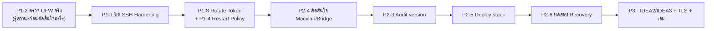

# 📌 Open Items Backlog — คิวงานถัดไป

> เรียงตามลำดับความสำคัญ **P1 → P2 → P3**
> ⚠️ ทุกข้อในโน้ตนี้คือ **"ยังไม่ทำ"** ห้ามนำไปเขียนในเล่มว่าทำแล้ว
> กลับไปหน้าศูนย์รวม: [[00-MOC/AEGIS-Infrastructure-MOC]]

---

## 🔴 P1 — ต้องทำก่อนถือว่าระบบปลอดภัยพอจะ deploy

| # | งาน | ทำไมเป็น P1 | โน้ต | สถานะ |
| :-- | :--- | :--- | :--- | :--- |
| P1-1 | **ปิดงาน SSH Hardening** — เพื่อน 2 คนสร้าง Key บนเครื่องตัวเอง → ทดสอบผ่าน Twingate → ลบ Key ผิดเครื่อง → ปิด Password Auth | ตอนนี้ทางเข้า Server ยังพึ่งรหัสผ่านล้วน | [[20-Server/SSH-Hardening-Status]] | ⏳ |
| P1-2 | **เปิด UFW Production Rules** | เคยปิดชั่วคราวตอนทดสอบ routing ⚠️ **ห้ามสมมติว่าเปิดแล้ว — ต้องรัน `ufw status verbose` ตรวจของจริงก่อน** | [[20-Server/Beelink-Ubuntu-Host]] | ⏳ **สถานะจริงยังไม่ทราบ** |
| P1-3 | **Rotate Twingate Connector Token** | Token เคยปรากฏบนหน้าจอ → ต้องถือว่ารั่วแล้ว | [[30-RemoteAccess/Twingate-Setup]] | ⏳ |
| P1-4 | ตั้ง **Restart Policy / Health Check** ให้ Twingate Connector | ถ้า container ตายแล้วไม่ restart = ล็อกทั้งทีมออกจาก Server | [[30-RemoteAccess/Twingate-Setup]] | ⏳ |
| P1-5 | ตรวจ **Twingate Group Membership** ไม่ให้กว้างเกิน | ใครอยู่ในกลุ่ม `Admin` = เข้า SSH ได้ | [[30-RemoteAccess/Twingate-Setup]] | ⏳ |
| P1-6 | ยืนยันว่า **OpenVPN service ถูก disable** ไม่ให้รันค้าง | service ที่ค้างโดยไม่มีใครดูแล = attack surface ที่ไม่จำเป็น | [[30-RemoteAccess/OpenVPN-Deprecated]] | ⏳ |

---

## 🟠 P2 — ต้องทำก่อน / ระหว่าง Deploy

| # | งาน | รายละเอียด | โน้ต | สถานะ |
| :-- | :--- | :--- | :--- | :--- |
| P2-1 | **Backup Config** | MikroTik export (`/export` + `.backup`), Switch config, Ubuntu config (`/etc`, netplan, `sshd_config`, compose) | [[10-Network/MikroTik-Config]] · [[10-Network/Switch-VLAN-Config]] | ⏳ |
| P2-2 | **Review Firewall Rule ครบชุด** ก่อน Production | ตอนทดสอบ routing มีการผ่อน rule ชั่วคราว ยังไม่ได้ไล่ตรวจว่าเหลืออะไรเปิดกว้าง | [[10-Network/MikroTik-Config]] | ⏳ |
| P2-3 | **Audit Docker / Repo / Secrets version ล่าสุดก่อน Deploy** | กันการ deploy ของเก่า / `.env` ที่ไม่ตรงกับโค้ดปัจจุบัน | [[40-Deployment/Docker-Stack-Plan]] | ⏳ |
| P2-4 | **ตัดสินใจ Macvlan vs Bridge + Reverse Proxy** | Twingate Connector อยู่บน bridge อาจมองไม่เห็น container บน macvlan | [[40-Deployment/Docker-Stack-Plan]] | ⏳ **ยังไม่ตัดสินใจ** |
| P2-5 | **Deploy Gateway + Drive + Monitor + PostgreSQL + Storage ลง Beelink** | ปัจจุบันบน Beelink มีแค่ Twingate Connector | [[40-Deployment/Docker-Stack-Plan]] | ⏳ |
| P2-6 | **ทดสอบ Persistence / Health Check / Restart / Recovery** | ต้องพิสูจน์ว่า `docker compose restart` / reboot เครื่องแล้วข้อมูลและบริการกลับมาครบ | [[40-Deployment/Docker-Stack-Plan]] | ⏳ |
| P2-7 | ทบทวน **sudo scope** ของแต่ละบัญชี | Least Privilege — และการอยู่ในกลุ่ม `docker` เทียบเท่า root | [[20-Server/Linux-User-Accounts]] | ⏳ |

---

## 🟡 P3 — งานต่อยอด / ปิดเล่ม

| # | งาน | รายละเอียด | โน้ต | สถานะ |
| :-- | :--- | :--- | :--- | :--- |
| P3-1 | **เชื่อม IDEA2 Detection Engine** | ต้อง **กำหนด IP ของ Detection Laptop (VLAN 20) ก่อน** เป็นเงื่อนไขนำ | [[10-Network/VLAN-IP-Plan]] · [[03 - 📹 IDEA2 AEGIS Monitor]] | ⏳ |
| P3-2 | **IDEA3 — MQTT / ESP32 / Relay / Heartbeat** | สถานะปัจจุบันคือ **"เขียนโค้ดแล้วยังไม่ทดสอบ"** ต้องตรวจว่ามีฮาร์ดแวร์จริงหรือยัง แล้วจอง `192.168.10.13` ให้ Broker | [[04 - 🔒 IDEA3 AEGIS Lockdown]] · [[concepts/Dead_Mans_Switch]] | ⏳ |
| P3-3 | **HTTPS / TLS** ที่ gateway | ตอนนี้ยังเป็น HTTP ล้วน | [[40-Deployment/Docker-Stack-Plan]] | ⏳ |
| P3-4 | **Monitoring** ของ Host และ container | uptime / disk / container health | [[20-Server/Beelink-Ubuntu-Host]] | ⏳ |
| P3-5 | **Backup / Restore Test** | backup ที่ไม่เคยทดสอบ restore = ยังไม่มี backup | — | ⏳ |
| P3-6 | **Incident Runbook** | รวมถึง Recovery note กรณี Twingate Connector ล่ม | [[30-RemoteAccess/Twingate-Setup]] · [[concepts/Contain_Before_Notify]] | ⏳ |
| P3-7 | **อัปเดตเล่มรายงาน §2.3.4 + §3.5.6 + ตาราง Layered Auth** ให้ตรงของจริง | เล่มยังเขียน OpenVPN + Twingate คู่ขนาน และหลักการ "ต้องผ่าน VLAN 30 ก่อน" | [[90-Status/Document-Conflicts]] | ⏳ |
| P3-8 | **เขียนโน้ตเดิมในวอลต์ใหม่ให้ตรงของจริง** | [[concepts/ZTNA_Twingate_vs_OpenVPN]] และ [[entities/MikroTik_hEX_lite]] ตอนนี้แค่แปะ banner เตือน ยังไม่ได้เขียนใหม่ | [[90-Status/Document-Conflicts]] | ⏳ |

---

## 🧭 ลำดับที่แนะนำให้ทำต่อ

---

## 🔗 โน้ตที่เกี่ยวข้อง

* [[00-MOC/AEGIS-Infrastructure-MOC]]
* [[90-Status/Progress-Log-2026-08-06]] · [[90-Status/Document-Conflicts]]
