# 🧭 START HERE — AEGIS Knowledge Entry Point

> **This is the single door into the AEGIS knowledge base.**
> Humans use this as the single door into the AEGIS knowledge base. Repository
> agents first read root `AGENTS.md`, then [[core/development-session-workflow]],
> then this orientation. It answers three questions in order: *what is this
> system*, *what has been done to it*, and *what is still open*.

---

## ⚡ 60-second orientation

**AEGIS** (*Autonomous Edge-Guard Infrastructure System*) is a Thai-first, on-premise **cyber-physical** security platform built as a monorepo: one entry hub plus three edge modules, defended in both the cyber and physical dimensions. It is a Suranaree University of Technology security-course project, so **the source is a graded deliverable** — least-privilege correctness matters as much as working features.

| | Module | Role | Port | Note |
|---|---|---|---|---|
| 🚪 | **HUB-AEGIS_Entry** | Static app picker. **No login, no backend, no session of its own** — by design | `/` | [[core/hub-aegis-entry]] |
| 💾 | **IDEA1 AEGIS Drive LC** | Secure NAS / Edge Data Lake + zero-knowledge Private Vault | `:8001` | [[idea1/idea1-status]] |
| 📹 | **IDEA2 AEGIS Monitor** | Dual-view SOC + scoped CCTV Operator console, live video | `:8002` | [[idea2/idea2-status]] |
| 🔒 | **IDEA3 AEGIS Lockdown** | Physical network isolation via ESP32 + relay (MQTT + HMAC) | — | [[idea3/idea3-status]] |
| 🎥 | **Detection Engine** | Headless sensor service on the Laptop (VLAN 20) — **holds no DB credential** | local | [[entities/Detection_Engine_Service]] |

### The four principles that constrain every change
1. **Server-Side Enforcement** — hiding a menu is not a security control. → [[core/security-architecture]]
2. **Identity Decoupling** — HUB / IDEA1 / IDEA2 are separate identity domains, isolated at the Postgres `CONNECT` level. → [[concepts/Identity_Decoupling]]
3. **Fail-Secure & Air-Gap** — heartbeat loss cuts the WAN uplink. → [[concepts/Dead_Mans_Switch]]
4. **OWASP Hardening** — no tokens in `localStorage`; HttpOnly + SameSite=Strict + CSRF. → [[concepts/OWASP_Security_Defense]]

Full task rules: **[[core/agent-operating-rules]]**. Multi-session planning,
evidence, checkpoint, handoff, and final receipt rules:
**[[core/development-session-workflow]]**.

---

## 🤖 Agent reading protocol

**Every task/session, before doing any work — read in this order:**

1. Repository-root **`AGENTS.md`** — authority, ownership, Git, receipt, and PR policy.
2. **[[core/development-session-workflow]]** — task/session state, evidence, checkpoints, and handoff.
3. **[[START_HERE]]** (this file) — orientation and the map below.
4. **[[core/agent-operating-rules]]** — durable architecture and collaboration rules.
5. **[[summaries/08_Outstanding_Items_Consolidated]]** — known open work; check before reporting a “new” bug.
6. **Choose the workspace dashboard before area detail**: [[core/core-moc]] for shared contracts and integration; [[idea1/idea1-moc]], [[idea2/idea2-moc]], [[idea3/idea3-moc]], or [[infrastructure/infrastructure-moc]] for an owned area. Then open that dashboard's canonical status note, relevant architecture, newest receipts, and current source/tests.

**Before a meaningful session checkpoint:** update only the canonical status note
owned by the task area, record evidence and the checkpoint SHA, then validate the
vault and diff. A session does not create a branch, Pull Request, or receipt.

**At final task handoff:** create exactly one immutable task receipt from
[[90-Status/logs/_template]], then list tests, canonical notes, shared surfaces,
and integration requests in the Pull Request. Kla integrates accepted cross-area
changes through [[90-Status/integration-queue]].

The historical [[log]] is frozen. Never append new task results to it.

> **The single most-violated rule**: create a new file only for a genuinely new system. Everything else is an in-place edit. See the dedup policy in [[core/agent-operating-rules]].

---

## 🕸️ Project knowledge network

How the groups actually relate — follow an edge to find the note that explains the next layer down.

```mermaid
flowchart TD
    SH["🧭 START_HERE"]:::entry

    SH --> RULES["🤖 06 · Agent Operating Rules"]:::admin
    SH --> OV["🗺️ Core · System Overview"]:::mod
    SH --> OPEN["🚦 Outstanding Items"]:::open

    OV --> HUB["🚪 01 · HUB Entry"]:::mod
    OV --> DRV["💾 IDEA1 MOC · Kla"]:::mod
    OV --> MON["📹 IDEA2 MOC · Pub"]:::mod
    OV --> LCK["🔒 IDEA3 MOC · Music"]:::mod
    OV --> INF["🌐 Infrastructure MOC · Kla"]:::mod
    OV --> SEC["🛡️ Security Architecture"]:::mod
    RULES --> DES["🎨 Design System"]:::mod
    RULES --> REC["🧾 Immutable task receipts"]:::admin
    REC --> QUEUE["🔗 Integration Queue"]:::admin

    MON --> ENG["🎥 Detection Engine"]:::ent
    LCK --> ESP["🔧 ESP32 Relay"]:::ent
    DRV --> NAS["🖥️ Beelink NAS"]:::ent
    ENG --> NAS

    SEC --> IDD["Identity Decoupling"]:::con
    SEC --> OWASP["OWASP Defense"]:::con
    SEC --> ZK["Zero-Knowledge Vault"]:::con
    SEC --> VER["🧪 Verification Protocol"]:::con
    IDD --> SCH["🗄️ Schema Ownership"]:::con
    DRV --> LAKE["3-Layer Data Lake"]:::con
    SCH --> LAKE

    LCK --> DMS["Dead Man's Switch"]:::con
    DMS --> CBN["Contain Before Notify"]:::con
    LCK --> CPD["Cyber-Physical Defense"]:::con
    CPD --> VLAN["VLAN Segmentation"]:::con
    VLAN --> ZTNA["ZTNA vs OpenVPN"]:::con
    ENG --> VLAN

    MON --> HON["Honest Telemetry"]:::con
    DRV --> HON
    DES --> HON
    DES --> IMP["Impeccable Workflow"]:::con
    RULES --> IMP

    MON --> ETH["📑 Ethics · HREC-SUT"]:::eth
    ENG --> ETH

    OV --> SUM["📊 Work Summaries<br/>by category"]:::sum
    SUM --> OPEN
    SUM --> LOG["📜 log.md<br/>frozen legacy history"]:::admin
    RULES --> SCHEMA["⚙️ .schema.md"]:::admin
    SCHEMA --> IDX["📚 index.md"]:::admin

    classDef entry fill:#1e40af,stroke:#93c5fd,color:#fff
    classDef mod fill:#0f766e,stroke:#5eead4,color:#fff
    classDef con fill:#3730a3,stroke:#a5b4fc,color:#fff
    classDef ent fill:#78350f,stroke:#fcd34d,color:#fff
    classDef eth fill:#831843,stroke:#f9a8d4,color:#fff
    classDef sum fill:#155e75,stroke:#67e8f9,color:#fff
    classDef admin fill:#374151,stroke:#d1d5db,color:#fff
    classDef open fill:#7f1d1d,stroke:#fca5a5,color:#fff
```

---

## 📇 Table of contents

### 🧭 Workspace dashboards — *choose the operating surface*
| Dashboard | Use it for |
|---|---|
| [[core/core-moc]] | Shared contracts, integration decisions, and shared-task completion |
| [[idea1/idea1-moc]] | AEGIS Drive LC work owned by Kla |
| [[idea2/idea2-moc]] | AEGIS Monitor, CCTV Operator, and Detection Engine work owned by Pub |
| [[idea3/idea3-moc]] | AEGIS Lockdown work owned by Music |
| [[infrastructure/infrastructure-moc]] | Network, server, remote-access, and deployment operational truth |

### 🏛️ Core modules — *what the system is*
| Note | Covers |
|---|---|
| [[core/core-moc]] | Shared contracts, integration queue, and the four workstream dashboards |
| [[core/system-overview]] | Monorepo topology, data-flow diagram, port map |
| [[core/hub-aegis-entry]] | Routing-only entry; why it has no auth |
| [[idea1/idea1-moc]] → [[idea1/idea1-status]] | Kla-owned Data Lake, Storage Layer, Private Vault, shares, audit |
| [[idea2/idea2-moc]] → [[idea2/idea2-status]] | Pub-owned SOC + Operator views, live MJPEG, clips, alert routing |
| [[idea3/idea3-moc]] → [[idea3/idea3-status]] | Music-owned ESP32 relay, MQTT + HMAC, air-gap actuation; design/report state until hardware proof |
| [[infrastructure/infrastructure-moc]] | Kla-owned network, server, remote access and deployment state |
| [[core/integration-points]] | Reviewed contracts shared by multiple workstreams |
| [[core/security-architecture]] | Server-side enforcement and identity model |
| [[core/agent-operating-rules]] | Principles, sync procedure, repo-doc map, vault scope |
| [[core/design-system-ui-language]] | Product register, tokens, measured contrast rules |

### 🧠 Concepts — *why it is built this way*
**Security & identity**: [[concepts/Identity_Decoupling]] · [[concepts/OWASP_Security_Defense]] · [[concepts/Mnemonic_Recovery_and_Zero_Knowledge]] · [[concepts/Schema_Ownership_Map]] · [[concepts/Terminal_Verification_Protocol]]
**Cyber-physical**: [[concepts/Cyber-Physical_Defense]] · [[concepts/Dead_Mans_Switch]] · [[concepts/Contain_Before_Notify]]
**Network**: [[concepts/VLAN_Segmentation_and_Port_Mapping]] · [[concepts/ZTNA_Twingate_vs_OpenVPN]]
**Data & honesty**: [[concepts/Three_Layer_Data_Lake]] · [[concepts/Honest_Telemetry_and_Unavailable_States]]
**Process**: [[concepts/Impeccable_UI_Design_Workflow]]

### 🛠️ Entities — *the physical and deployed things*
[[entities/Beelink_Mini_S_NAS]] · [[entities/Detection_Engine_Service]] · [[entities/ESP32_Relay_Module]] · [[entities/MikroTik_hEX_lite]] · [[entities/TP-Link_TL-SG105E]] · [[entities/Team_Roles_and_Responsibilities]]

### 📊 History — *what was done*
[[summaries/00_Work_Summary_Index]] routes to eight by-category digests of the historical sessions in frozen [[log]]:
[[summaries/01_UI_Design_and_Theming|UI]] · [[summaries/02_Security_Auth_and_Identity|Security]] · [[summaries/03_Infrastructure_Networking_and_Gateway|Infra]] · [[summaries/04_IDEA1_Drive_Build_Out|IDEA1]] · [[summaries/05_IDEA2_Monitor_and_Detection_Engine|IDEA2]] · [[summaries/06_Wiki_Admin_and_Housekeeping|Wiki]] · [[summaries/07_Ethics_and_Compliance|Ethics]] · **[[summaries/08_Outstanding_Items_Consolidated|🚦 Open items]]**

### 📑 Ethics, sources & administration
[[ethics/Participant_Information_Sheet_IDEA2]] · [[ethics/Informed_Consent_Form_IDEA2]] · [[raw/AEGIS_Project_Knowledge_v7]] · [[raw/AEGIS_System_Design_extracted]] · [[index]] · [[90-Status/integration-queue]] · [[90-Status/logs/_template]] · [[log]] · [[.schema.md]]

---

## 🚦 Current state at a glance

**Working end to end**: HUB routing · Drive auth/RBAC/upload/versions/share-links/Private Vault · Monitor auth/RBAC/scoped cameras/live MJPEG/clip playback/Telegram routing by camera · heartbeat-based node status · gateway routing for `/drive` and `/monitor` in production.

**The big open gaps** (full list: [[summaries/08_Outstanding_Items_Consolidated]]):
- 🔴 **No real face-recognition model** — the seam is complete, the model is absent, so every detection is `Unknown`.
- 🔴 IDEA1 `confirmDelete()` still swallows a 403 · no encryption at rest for Data Lake uploads · no IDEA2 audit log.
- 🟡 IDEA2 i18n rollout half-done · ~5 stacked duplicate CSS blocks (deferred by explicit user choice).
- ⚠️ Demo credentials rotate when test suites run — `docker compose down -v` restores them. Check before demoing.

---

## ⚠️ Two environment notes

- **Open Obsidian on `Obsidian_AEGIS_Vault/AEGIS_Knowledge`, not the repo root.** Opening the root indexes ~500 extra Markdown files from `node_modules/` and four duplicated AI-skill trees, which is what produced the scattered orphan graph. Ignore filters are now set at the root as a safety net — see [[core/agent-operating-rules]].
- **This project is under Git and uses protected Pull Requests.** Work on one task branch, fetch and synchronize from current `origin/main` as `AGENTS.md` specifies, checkpoint coherent sessions on that branch, push it, and wait for checks and human review. Do not rebase shared task work, force-push, push directly to `main`, or let an agent merge the Pull Request.
