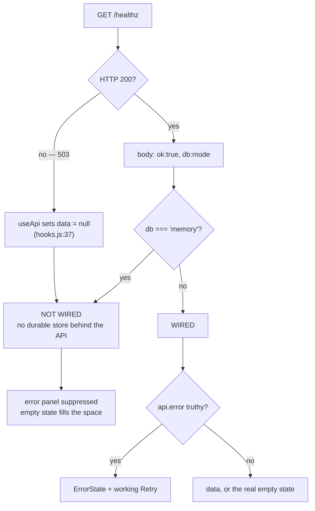

# 🖥️ Client Render-State Verification

> **Why this note exists**: [[concepts/Terminal_Verification_Protocol]] proves what the *server* returns when hit directly with `curl`. It says nothing about what the *screen* does with that answer. Two IDEA1 defects in a row lived entirely in that gap — the endpoint behaved correctly and the UI still told the user something false. This note records the principle that separates them and the harness that proves the client half.

---

## The governing principle: **reachable ≠ wired**

A health check answers *"is this service responding?"*. A screen needs the answer to a different question: *"is there anything behind it yet?"* Conflating the two produces UI that is individually truthful and collectively a lie.

The concrete case (IDEA1, 2026-08-07): with no PostgreSQL pool configured, `server/db/connection.js` → `checkDb()` returns `{ ok: true, mode: 'memory' }`. So `/healthz` answers **200, green**, the header pill reads `Edge node: online` — and every `/api/*` read behind the screens fails anyway, because there is no durable store. Both signals were accurate. The app looked broken.

> ⚠️ **The corollary that matters for future fixes**: the red error box was *not* a leftover component someone forgot to delete, which is what it looked like. `useApi` had a genuinely failed fetch behind it. Deleting the component would have destroyed the real error path. **The condition it renders under was the bug, not the component.** When a state looks hardcoded, prove the condition before deleting the consumer.

IDEA1 implements this diagram from one shared wiring predicate:

| Function | File | Used by |
|---|---|---|
| `isPlatformWired(healthData)` | `src/lib/fetchState.js` | `App.jsx`, Dashboard, and the Dashboard error wrapper |
| `visibleFetchError(error, placeholderMode)` | `src/lib/fetchState.js` | Eight primary data screens + Settings |
| `shouldShowDashboardFetchError(error, healthData)` | `src/lib/dashboardState.js` | Dashboard; delegates to `isPlatformWired` |

`App.jsx` owns one 15-second `/healthz` poll. It passes the same health object to TopBar and Dashboard and derives the `placeholderMode` prop for the other screens from `!isPlatformWired(healthData)`. This closed the former three-way predicate duplication and Dashboard's independently timed second poll; all consumers now observe the same health cycle.

---

## The harness: proving render state without a browser

The first complete audit used a scratch jsdom harness because IDEA1 originally had no DOM test dependency and most UI checks asserted only on **source text** (`assert.match(source, /…/)`). Source assertions cannot answer "does the box actually appear", only "does the code look like it would". The two failure modes found by that audit are now permanent negative tests in `tests/uiNegativeCases.test.js`, backed by the dev-only `jsdom` dependency; the full nine-screen harness remains the broader manual regression pass.

The method used instead, which adds nothing to the repo:

1. **Bundle the real screen components** with the app's own `esbuild` (already present via Vite) — entry file and output live in a scratchpad, never in the project.
2. **Render with `react-dom/client` into jsdom**, with `act()` around the render and a microtask flush so `useApi`'s effect resolves and commits.
3. **Stub `fetch` at the boundary `apiFetch` actually consumes** — it reads only `res.ok`, `res.status`, `res.json()`, so a plain object suffices; no `Response` polyfill, no server, no session, no CSRF.
4. **Assert on rendered DOM text**, e.g. `container.textContent.includes(t('errLoadTitle'))`.

> ⚠️ Fixture fidelity is part of the test. The first run crashed in `fmtDateTime` because the fixture sent ISO strings; the real API sends **epoch millis** (`new Date(r.created_at).getTime()`). A fixture that does not match the server's actual shape tests nothing — and in this case the crash was the harness's fault, not the app's. Verify payload shape against the server before trusting a red result.

### What this catches that source-grepping cannot

Both directions of the gate, and the branches around it:

| Case | Setup | Expected |
|---|---|---|
| Negative (the safety-critical one) | `db=postgres` + every `/api/*` → 500 | error box **must** appear |
| Regression control | `db=memory` + every `/api/*` → 500 | error box **must not** appear |
| False-positive control | `db=postgres` + all endpoints OK | error box **must not** appear |
| Secondary endpoints | one screen's *other* fetch fails | ← where the bugs actually were |

That last row is the point. Nine of nine screens passed on their primary endpoint; the audit found a screen whose **second** fetch had no gate at all, so its failure rendered as a confident false statement rather than an error. The Shares picker now runs `/api/files` through `visibleFetchError`, and a repository negative test pins `/api/shares` OK + `/api/files` 500 to the load-failed notice rather than `ยังไม่มีไฟล์`.

---

## House rules this adds

Extending the discipline list in [[concepts/Terminal_Verification_Protocol]]:

- **Test the direction that hides problems, not just the one that shows them.** "No error box appears when disconnected" and "an error box appears when genuinely broken" are different claims; the second is the one whose failure is silent in production.
- **Audit every `useApi` call on a screen, not just the one that owns the layout.** A secondary fetch with no error surface is invisible by construction.
- **An empty state must not assert a cause it cannot know.** `ยังไม่มีไฟล์` ("no files yet") rendered on a failed fetch is a fabricated fact — the same violation as a fabricated number under [[concepts/Honest_Telemetry_and_Unavailable_States]], just in words instead of digits.
- **Name what was not verified.** This harness does not exercise nginx routing, sessions, CSRF, or real browser paint, and it supplies `placeholderMode` as a prop transcribed from `App.jsx` rather than rendering the authenticated shell.

---

## Related
[[concepts/Terminal_Verification_Protocol]] · [[concepts/Honest_Telemetry_and_Unavailable_States]] · [[idea1/idea1-status]] · [[summaries/08_Outstanding_Items_Consolidated]] · [[summaries/04_IDEA1_Drive_Build_Out]] · [[core/design-system-ui-language]] · [[core/agent-operating-rules]] · [[START_HERE]]
