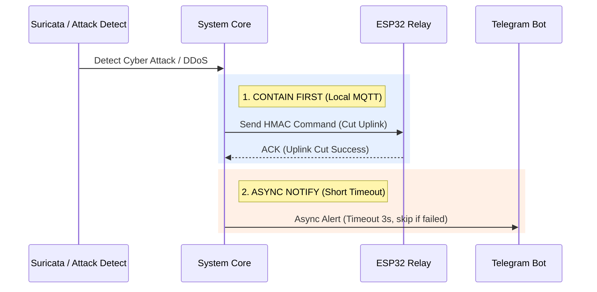

# 🛑 Contain Before Notify (NIST SP 800-61 Alignment)

> **Core Concept**: Reordering the Incident Response Workflow to prioritize **Containment before Notification**, analogous to "extinguishing the fire before calling relatives."

---

## 💡 Technical Rationale (The Paradox Solved)

If a DDoS attack occurs on the NAS, the WAN connection becomes saturated with traffic. Under traditional workflows (sending a Telegram alert before triggering isolation), Telegram requests would time out, causing the system to hang and never execute the actual network cutoff.

---

## 🔗 Related Notes
* [[04 - 🔒 IDEA3 AEGIS Lockdown]]
* [[concepts/Dead_Mans_Switch]]
* [[concepts/Cyber-Physical_Defense]]
