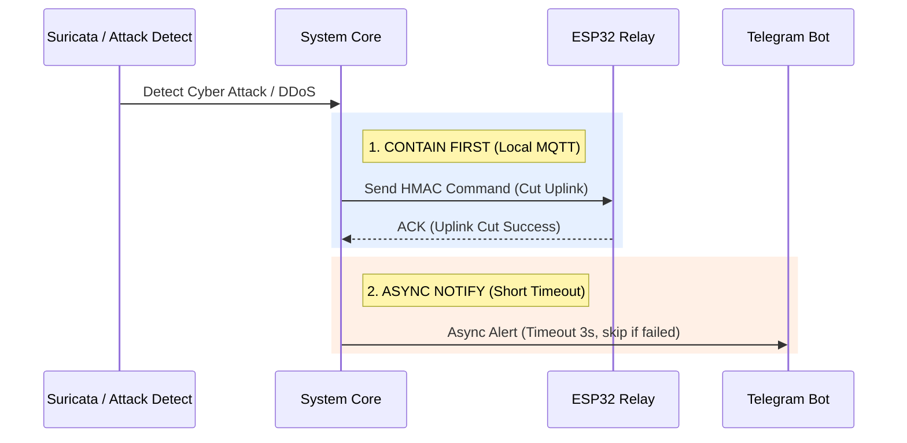

# 🛑 Contain Before Notify (NIST SP 800-61 Alignment)

> **แนวคิดหลัก**: การเปลี่ยนลำดับขั้นตอนตอบสนองเหตุการณ์ความมั่นคงปลอดภัย (Incident Response Workflow) โดยเลือก **ควบคุมความเสียหายและจำกัดการแพร่กระจาย (Containment) ก่อนส่งการแจ้งเตือน (Notification)** เปรียบเสมือน "ดับไฟก่อนโทรแจ้งญาติ"

---

## 💡 เหตุผลทางเทคนิค (The Paradox Solved)

หากเกิดการโจมตีประเภท DDoS บน NAS สายสัญญาณ WAN จะถูกจราจรหนาแน่นจนเต็ม Bandwidth หากระบบเลือกระดับขั้นตอนแบบเดิม (ส่ง Telegram ก่อนแล้วค่อยสั่งตัดวงจร) คำสั่ง Telegram จะติด Timeout ทำให้ระบบค้างและไม่เคยสั่งตัดวงจรจริง

---

## 🔗 ความสัมพันธ์กับโน้ตอื่น
* [[04 - 🔒 IDEA3 AEGIS Lockdown]]
* [[concepts/Dead_Mans_Switch]]
* [[concepts/Cyber-Physical_Defense]]
