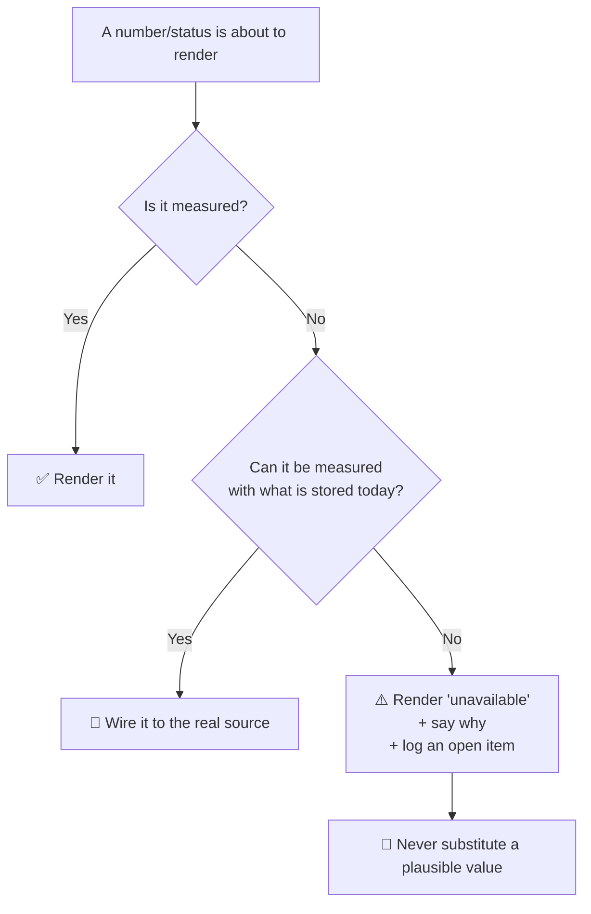

# 🔍 Honest Telemetry & "Unavailable" States

> **The rule**: a number on screen must come from a measurement. If a value cannot be measured yet, the interface says **`unavailable`** — and ideally *why* — rather than showing a plausible-looking figure.

This concept was extracted after the same failure pattern was found independently in **both** [[02 - 💾 IDEA1 AEGIS Drive LC]] and [[03 - 📹 IDEA2 AEGIS Monitor]]. It is now a standing rule for the project.

---

## 🚨 Why this matters more here than in an ordinary app

AEGIS is a **security** system. Its screens are read as evidence:

* An operator deciding whether to escalate reads "Edge node: online" as *the sensor layer is alive*.
* An auditor reading "AUTH // J. SMITH // 98%" concludes *the system recognised a specific person with high confidence*.
* A reviewer reading "Uptime 99.2% · 0 disconnects" concludes *this camera has been reliable*.

When those strings are constants, the interface is not merely incomplete — it is **manufacturing evidence about physical security events**. A placeholder in a marketing page is cosmetic. A placeholder in a surveillance console is a false statement about who was seen and whether the system was watching.

The failure is also self-concealing: fabricated telemetry looks *healthiest* exactly when the real system is most broken, because a hard-coded green pill cannot go red.

---

## 📐 The three-way test

For every value rendered, ask:

---

## 🧾 Worked examples from this codebase

| Value | Was | Now |
| :--- | :--- | :--- |
| Edge-link status | Two integers in memory; `online` forever, even with no engine | Derived from `camera_heartbeat` row age (≤15s online, ≤45s degraded, else lost) |
| Camera latency | `LAT_SERIES` — three hard-coded 12-point arrays | Real `latency_ms` / `latency_ms_avg` from the engine's `MetricsRegistry` |
| Uptime % · 24h disconnects | `99.2%` · `0` always | **`unavailable`** — the table keeps only the latest row per camera, so there is no history to compute from |
| Latency sparkline | Drawn from the hard-coded arrays | **Removed** — a chart with no samples is worse than no chart |
| Identity overlay | `J. SMITH // 98%` keyed to a camera id | Derived from the newest real detection; renders **nothing** when there is none |
| AI engine pill | `running` (green, always) | Count of engines actually reporting, or `no engine reporting` |
| Disk health / SMART (IDEA1) | Fabricated device rows | `unavailable` + the measured reason (no `CAP_SYS_RAWIO`, no raw block device) |
| Transfer volume (IDEA1) | Seven hard-coded rows + a fake `projected` flag | Real counts from `audit_log`, labelled **events, not GB**, because byte size is not stored |

---

## 🎯 Corollaries

1. **Silence is a valid signal — design for it.** The Detection Engine never posts "I am down". Rows stop arriving and the consumer ages the status itself. A live process cannot fake health and a dead one cannot hide. Prefer *absence-detected-by-the-consumer* over *self-reported health*.
2. **State the unit when it is not the obvious one.** "Events, not GB" is a one-word fix that prevents a reader inferring a quantity the system never measured.
3. **A comment is not a control** — and a comment can itself be the leak. Plaintext credentials documented in `seed.sql`'s header were removed for the same reason the credentials themselves were gated.
4. **Distinguish a drill from the real thing.** The link-outage demo control survives, but now returns `simulated: true` alongside `realStatus`, so a rehearsal is never mistaken for an incident.
5. **When you remove a fake, remove its vocabulary too.** Dead translation strings (`Running v1.3`, 132 lines in IDEA1) outlive the UI that used them and mislead the next reader who greps.
6. **Verify absence in the artefact, not the source.** After removing fabricated strings, grep the **built bundle** — that proves they cannot render, which reading the source does not.

---

## 🔗 Related Notes
* [[00 - 🗺️ AEGIS System Overview]]
* [[02 - 💾 IDEA1 AEGIS Drive LC]]
* [[03 - 📹 IDEA2 AEGIS Monitor]]
* [[05 - 🛡️ Security Architecture]]
* [[concepts/Dead_Mans_Switch]] — the same "silence is the signal" inversion, applied to physical cutoff
