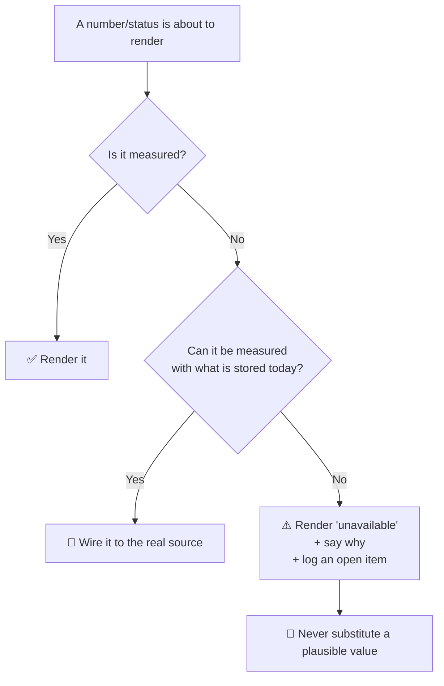

# 🔍 Honest Telemetry & "Unavailable" States

> **The rule**: a number on screen must come from a measurement. If a value cannot be measured yet, the interface says **`unavailable`** — and ideally *why* — rather than showing a plausible-looking figure.

This concept was extracted after the same failure pattern was found independently in **both** [[idea1/idea1-status]] and [[idea2/idea2-status]]. It is now a standing rule for the project.

---

## 🚨 Why this matters more here than in an ordinary app

AEGIS is a **security** system. Its screens are read as evidence:

* An operator deciding whether to escalate reads "Edge node: online" as *the sensor layer is alive*.
* An auditor reading "AUTH // J. SMITH // 98%" concludes *the system recognised a specific person with high confidence*.
* A reviewer reading "Uptime 99.2% · 0 disconnects" concludes *this camera has been reliable*.

When those strings are constants, the interface is not merely incomplete — it is **manufacturing evidence about physical security events**. A placeholder in a marketing page is cosmetic. A placeholder in a surveillance console is a false statement about who was seen and whether the system was watching.

The failure is also self-concealing: fabricated telemetry looks *healthiest* exactly when the real system is most broken, because a hard-coded green pill cannot go red.

---

## 📐 The three-way test

For every value rendered, ask:

---

## 🧾 Worked examples from this codebase

| Value | Was | Now |
| :--- | :--- | :--- |
| Edge-link status | Two integers in memory; `online` forever, even with no engine | Derived from `camera_heartbeat` row age (≤15s online, ≤45s degraded, else lost) |
| Camera latency | `LAT_SERIES` — three hard-coded 12-point arrays | Real `latency_ms` / `latency_ms_avg` from the engine's `MetricsRegistry` |
| Uptime % · 24h disconnects | `99.2%` · `0` always | **`unavailable`** — the table keeps only the latest row per camera, so there is no history to compute from |
| Latency sparkline | Drawn from the hard-coded arrays | **Removed** — a chart with no samples is worse than no chart |
| Identity overlay | `J. SMITH // 98%` keyed to a camera id | Derived from the newest real detection; renders **nothing** when there is none |
| AI engine pill | `running` (green, always) | Count of engines actually reporting, or `no engine reporting` |
| Disk health / SMART (IDEA1) | Fabricated device rows | `unavailable` + the measured reason (no `CAP_SYS_RAWIO`, no raw block device) |
| Transfer volume (IDEA1) | Seven hard-coded rows + a fake `projected` flag | Real counts from `audit_log`, labelled **events, not GB**, because byte size is not stored |

### Follow-up: a real source can still produce a misleading “live” label (2026-08-07)

The Drive live-status inventory exposed a second-order failure mode: a value may originate from a real endpoint but still overclaim what was measured.

| UI claim | Actual evidence |
|---|---|
| `Edge node: online` | **P2 closed:** renamed `Drive: online` and sourced only from the Application event-loop probe; no host-level claim remains |
| Data Lake Application / Metadata / Storage healthy with `12/4/2 ms` | **P2 closed:** each row consumes its own probe and measured latency—event-loop turn, PostgreSQL `SELECT 1`, or filesystem write/read/delete; unavailable evidence stays neutral |
| Active links | **P1 closed:** the shared store query excludes both revoked and expired rows before Dashboard or Shares consumes it |
| Security incidents | **P1 closed:** the KPI explicitly counts only `DENIED`/`BLOCKED` entries among the latest 100 audit rows; it does not claim unresolved incidents |
| Verify checksum | **P0 closed:** the server now rereads current Storage Layer bytes, recomputes SHA-256 and compares against the upload-time metadata hash; Vault plaintext verification is honestly unavailable server-side |
| One storage capacity | **P1 closed:** Sidebar, Dashboard and Storage keep the same source bytes and render through the same binary `fmtBytes` helper |
| Ordinary upload encryption/progress | **P0/P2 closed:** regular Data Lake bytes are explicitly labelled plaintext-at-rest on Uploads and the Login defense readout; only Vault claims browser-side encryption. Transfer progress now comes from XHR `loaded/total` byte events, never stage constants |

Access Control follows the same rule: “Account ready” means the real password-reset gate is clear, while session totals come from the current Express session store and are explicitly scoped to **this instance**. With `MemoryStore`, those counts are real but volatile; they are not evidence of a global, persistent session inventory.

The rule therefore has two parts: **measurement provenance** and **semantic scope**. A live label must state only what its probe proves, and every repeated rendering of one measurement must use one unit convention.

---

## 🎯 Corollaries

1. **Silence is a valid signal — design for it.** The Detection Engine never posts "I am down". Rows stop arriving and the consumer ages the status itself. A live process cannot fake health and a dead one cannot hide. Prefer *absence-detected-by-the-consumer* over *self-reported health*.
2. **State the unit when it is not the obvious one.** "Events, not GB" is a one-word fix that prevents a reader inferring a quantity the system never measured.
3. **A comment is not a control** — and a comment can itself be the leak. Plaintext credentials documented in `seed.sql`'s header were removed for the same reason the credentials themselves were gated.
4. **Distinguish a drill from the real thing.** The link-outage demo control survives, but now returns `simulated: true` alongside `realStatus`, so a rehearsal is never mistaken for an incident.
5. **When you remove a fake, remove its vocabulary too.** Dead translation strings (`Running v1.3`, 132 lines in IDEA1) outlive the UI that used them and mislead the next reader who greps.
6. **Verify absence in the artefact, not the source.** After removing fabricated strings, grep the **built bundle** — that proves they cannot render, which reading the source does not.

---

## 🔗 Related Notes
* [[core/system-overview]]
* [[idea1/idea1-status]]
* [[idea2/idea2-status]]
* [[core/security-architecture]]
* [[concepts/Dead_Mans_Switch]] — the same "silence is the signal" inversion, applied to physical cutoff
