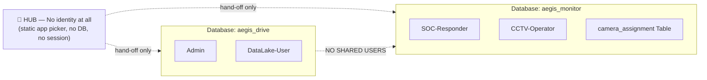

# 🔑 Identity Decoupling (v4 Architectural Shift)

> **Core Concept**: Eliminating shared user account systems (Centralized RBAC) across applications. Each application maintains an **independent User Database and Role Hierarchy** to restrict damage in case of compromise (Blast Radius Reduction).

---

## 📊 Identity Boundaries

| Application | Roles | Data Boundary |
| :--- | :--- | :--- |
| **[[idea1/idea1-status|AEGIS Drive (IDEA 1)]]** | `Admin`, `DataLake-User` | File management and 3-Layer Data Lake access control |
| **[[idea2/idea2-status|AEGIS Monitor (IDEA 2)]]** | `SOC-Responder`, `CCTV-Operator` | Overall CCTV system monitoring and scoped camera view per `camera_assignment` |
| **[[core/hub-aegis-entry\|HUB Entry]]** | **No roles** | No database, no accounts, no session — pure routing signpost |

---

## 🛡️ Enforced across "Three Layers", not just convention (2026-07-22)

Identity Decoupling is enforced across three overlapping physical layers:

1. **Account Layer** — Each app owns its `users` table + role hierarchy in separate databases with no foreign keys connecting them. Monitor accounts cannot log into Drive because the database tables are completely separate.

2. **Database Engine Layer (Postgres engine — REVOKE CONNECT)** — Separating by "different databases" is insufficient if both apps connect via the same superuser. Process of IDEA1 holding superuser credentials could execute `\c aegis_monitor` and read `password_hash` of IDEA2. Now:
   * Each app connects via its **own DB role** — `drive_app` (connects only to `aegis_drive`), `monitor_app` (connects only to `aegis_monitor`)
   * **Key mechanism: `REVOKE CONNECT … FROM PUBLIC`**: PostgreSQL grants `CONNECT` on every database to `PUBLIC` by default. If granted to the correct role without first revoking from `PUBLIC`, isolation fails.
   * Result: Cross-database queries are rejected at **connection establishment**, not query level — SQL injection in IDEA1 cannot access IDEA2 data. Superuser `aegis` is restricted to init/migrate tasks (`postgres/init/02-app-roles.sh`).

3. **Session Layer (Session Secret)** — `drive` and `monitor` sign cookies with **different secrets** (`DRIVE_SESSION_SECRET` / `MONITOR_SESSION_SECRET`). A leaked secret from one app cannot forge cookies for the other.

---

## 🚪 Why HUB has "NO" identity (2026-07-24)

If HUB issued its own session for downstream apps to trust, that would reintroduce Centralized RBAC — the exact pattern eliminated in v4.

HUB redirects users via plain `window.location.href` with **no tokens, no cookies, and no query params**. The target application relies strictly on its own independent session. Three cookies, three secrets, two databases — fully isolated.

---

## ⚠️ Only Cross-Dependency Exception
If a security incident occurs in IDEA 2/3 and the administrator needs to unblock an IP address via UFW Firewall during Incident Recovery, the administrator must use **IDEA 1 Admin** credentials because UFW runs directly on the Linux host operating system of the NAS hardware.

---

## 🔗 Related Notes
* [[idea1/idea1-status]]
* [[idea2/idea2-status]]
* [[concepts/OWASP_Security_Defense]]
