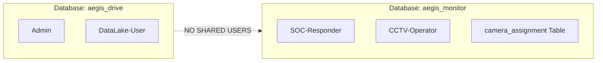

# 🔑 Identity Decoupling (v4 Architectural Shift)

> **แนวคิดหลัก**: การตัดการพึ่งพาระบบบัญชีผู้ใช้ร่วมกัน (Centralized RBAC) ระหว่างแอปพลิเคชัน โดยแต่ละแอปพลิเคชันจะมี **User Database และ Role Hierarchy ของตัวเองอย่างอิสระ** เพื่อจำกัดขอบเขตความเสียหายหากถูกโจมตี (Blast Radius Reduction)

---

## 📊 การแบ่งขอบเขตบัญชีผู้ใช้ (Identity Boundaries)

| แอปพลิเคชัน | สิทธิ์การใช้งาน (Roles) | ขอบเขตข้อมูล (Data Boundary) |
| :--- | :--- | :--- |
| **[[modules/02_IDEA1_AEGIS_Drive_LC|AEGIS Drive (IDEA 1)]]** | `Admin`, `DataLake-User` | จัดการไฟล์และสิทธิ์การเข้าถึงคลังข้อมูล Data Lake 3 Layers |
| **[[modules/03_IDEA2_AEGIS_Monitor|AEGIS Monitor (IDEA 2)]]** | `SOC-Responder`, `CCTV-Operator` | ดูภาพรวมระบบกล้อง และดูเฉพาะกล้องที่ผูกใน `camera_assignment` |

---

## ⚠️ ข้อยกเว้นเพียงหนึ่งเดียว (Only Cross-Dependency)
กรณีที่เกิดเหตุภัยคุกคามใน IDEA 2/3 แล้วต้องการปลดบล็อกแฮกเกอร์ด้วย UFW Firewall ในขั้นตอน Incident Recovery ผู้ดูแลระบบจะต้องใช้สิทธิ์ **Admin ของ IDEA 1** เนื่องจาก UFW เป็นบริการของระบบปฏิบัติการ Linux บนเครื่อง NAS Hardware

---

## 🔗 ความสัมพันธ์กับโน้ตอื่น
* [[modules/02_IDEA1_AEGIS_Drive_LC]]
* [[modules/03_IDEA2_AEGIS_Monitor]]
* [[concepts/OWASP_Security_Defense]]
