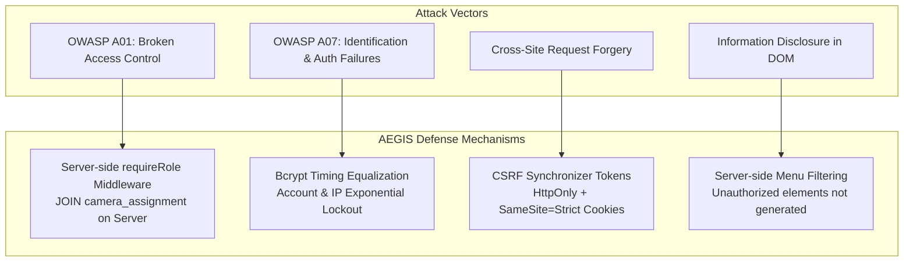

# 🛡️ OWASP Security Defense & System Hardening

> **แนวคิดหลัก**: มาตรการป้องกันภัยคุกคามไซเบอร์ตามมาตรฐาน OWASP Top 10 โดยมุ่งเน้นการปฏิบัติตามหลัก **Least Privilege**, **Default Deny**, และ **Server-Side Privilege Validation**

---

## 🛡️ สรุปกลไกป้องกัน OWASP ใน AEGIS System

---

## 📋 5 มาตรการสำคัญ

1. **Anti-Enumeration & Bcrypt Timing Neutralization**: กรณีใส่ Username ไม่ถูกต้อง ระบบจะทำการเปรียบเทียบรหัสผ่านกับ Dummy Hash เพื่อให้เวลาประมวลผล Bcrypt เท่ากันเสมอกัน ป้องกันการสุ่มวัดเวลาหา User (Timing Attack)
2. **Server-Side Access Control (OWASP A01)**: ไม่อนุญาตให้เบราว์เซอร์หรือสคริปต์ฝั่ง Client ส่งสิทธิ์/Role ขึ้นมาเอง ทุกคำสั่งจะถูกตรวจสอบผ่าน Middleware `requireRole` และทำการ JOIN ตาราง `camera_assignment` บน Server เสมอ
3. **No Storage of Tokens in Web Storage**: ไม่ใช้ `localStorage`, `sessionStorage`, หรือ `document.cookie` ป้องกันสคริปต์ XSS ดึง Session Token ไปใช้
4. **Server-Side Menu Filtering**: เมนูหรือปุ่มกดที่ไม่ตรงกับบทบาท จะถูกกรองออกตั้งแต่ฝั่ง Server ไม่มีการส่งโครงสร้าง HTML ของสิทธิ์ที่สูงกว่าไปซ่อนไว้ที่ฝั่ง Client
5. **Account & IP Lockout**: ป้อนรหัสผิดเกิน 5 ครั้ง บล็อกทันทีทั้งตาม IP และ Username พร้อมระบบ Exponential Backoff

---

## ⚖️ "ข้อความ error ต้อง generic" มีขอบเขตของมัน — อย่าเหมารวมเกินขอบเขต (บทเรียน 2026-07-26)

หลักการกัน username enumeration บอกว่า **ผลการตรวจรหัสผ่านต้องหน้าตาเหมือนกันหมด**
(ไม่บอกว่า "ไม่มีบัญชีนี้" vs "รหัสผิด") — ข้อนี้ยังคงบังคับใช้เต็มที่ใน `INVALID_CREDENTIALS`

**แต่หลักการนี้ใช้กับ "ผลการตรวจความลับ" เท่านั้น ไม่ใช่กับความล้มเหลวทุกชนิด**
การลากมันไปครอบทุก error ทำให้เกิดบั๊กจริงในโปรเจกต์นี้มาแล้ว:

| สิ่งที่ล้มเหลว | ตรวจความลับของผู้ใช้ไหม | ข้อความที่ถูกต้อง |
| :--- | :--- | :--- |
| รหัสผ่านผิด / ไม่มีบัญชี (`401`) | ✅ ใช่ | generic เหมือนกันหมด — **ห้ามแยก** |
| ถูกบล็อกด้วย CSRF (`403`) | ❌ ไม่เคยแตะ DB เลย | บอกตรง ๆ ว่าเป็น origin/token mismatch + ให้โหลดหน้าใหม่ |
| timeout / network / `5xx` | ❌ ไม่ | บอกว่าเป็นปัญหาการเชื่อมต่อ/เซิร์ฟเวอร์ |
| Argon2id (WASM) รันไม่ได้ | ❌ ไม่เคยตรวจกุญแจ | บอกว่าเครื่องมือถอดรหัสทำงานไม่ได้ ไม่ใช่ "กุญแจผิด" |
| passphrase ว่าง | ✅ ใช่ (เป็นการอ้างกุญแจ) | เหมือน "กุญแจผิด" ทุกประการ — **เหมารวมโดยเจตนา ถูกต้องแล้ว** |

**เหตุผล**: การบอกผู้ใช้ว่า "รหัสผ่านผิด" ทั้งที่ระบบไม่เคยตรวจรหัสผ่าน คือการ**พาไปแก้ผิดจุด**
(นั่งพิมพ์รหัสใหม่ ทั้งที่ต้องโหลดหน้าใหม่) และทำให้ทีมไล่บั๊กผิดทางด้วย —
รอบนี้เสียเวลาไปกับการเชื่อว่า "รหัสเดโม่ผิด" ทั้งที่ต้นเหตุคือ `changeOrigin` ใน vite proxy
รายละเอียดการแก้ทั้งเชน (csrf.js → api.js → auth.js → Login.jsx) ดู [[02 - 💾 IDEA1 AEGIS Drive LC]] หัวข้อ 8

---

## 🔗 ความสัมพันธ์กับโน้ตอื่น
* [[05 - 🛡️ Security Architecture]]
* [[concepts/Identity_Decoupling]]
* [[02 - 💾 IDEA1 AEGIS Drive LC]]
* [[03 - 📹 IDEA2 AEGIS Monitor]]
