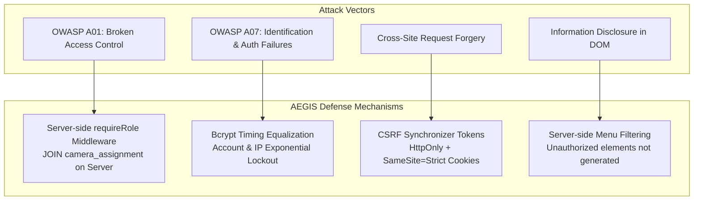

# 🛡️ OWASP Security Defense & System Hardening

> **Core Concept**: Cybersecurity threat mitigation adhering to OWASP Top 10 standards, emphasizing **Least Privilege**, **Default Deny**, and **Server-Side Privilege Validation**.

---

## 🛡️ OWASP Defense Mechanisms Summary

---

## 📋 5 Key Security Measures

1. **Anti-Enumeration & Bcrypt Timing Neutralization**: When an invalid username is submitted, the system performs a bcrypt hash comparison against a dummy hash to equalize processing time, preventing timing attacks.
2. **Server-Side Access Control (OWASP A01)**: Client-side role assertions are prohibited. All requests are checked by `requireRole` middleware and join the `camera_assignment` table on the server.
3. **No Tokens in Web Storage**: `localStorage`, `sessionStorage`, and `document.cookie` are avoided for token storage, preventing XSS token theft.
4. **Server-Side Menu Filtering**: Unauthorized menu items and UI buttons are filtered at the server level and never rendered into the DOM.
5. **Account & IP Lockout**: Exponential backoff and lockout trigger after 5 consecutive failed login attempts per username and IP.

---

## ⚖️ Scope of Generic Error Messages (2026-07-26 Lesson)

Username anti-enumeration requires **identical authentication failure responses** (not revealing whether a username exists). This rule is strictly enforced for `INVALID_CREDENTIALS`.

However, generic error messages apply strictly to **credential verification failures**, not all operational errors:

| Failure Type | Checks Credentials? | Correct Response |
| :--- | :--- | :--- |
| Wrong Password / Non-existent User (`401`) | ✅ Yes | Uniform generic response (`INVALID_CREDENTIALS`) |
| Blocked by CSRF (`403`) | ❌ No | Explicit origin/token mismatch notification |
| Timeout / Network / `5xx` | ❌ No | Connection/Server failure notification |
| Argon2id (WASM) execution failure | ❌ No | Crypto engine error notification |

---

## 🔗 Related Notes
* [[05 - 🛡️ Security Architecture]]
* [[concepts/Identity_Decoupling]]
* [[02 - 💾 IDEA1 AEGIS Drive LC]]
* [[03 - 📹 IDEA2 AEGIS Monitor]]
