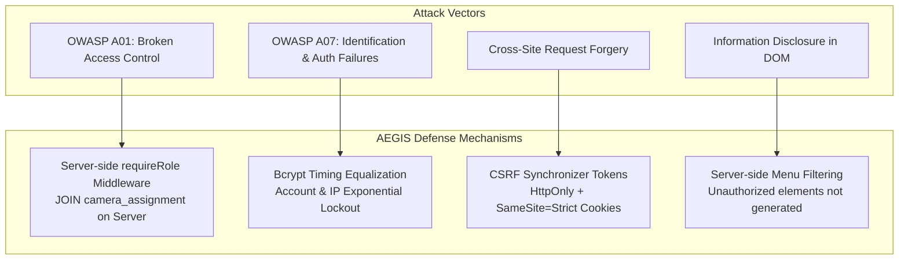

# 🛡️ OWASP Security Defense & System Hardening

> **แนวคิดหลัก**: มาตรการป้องกันภัยคุกคามไซเบอร์ตามมาตรฐาน OWASP Top 10 โดยมุ่งเน้นการปฏิบัติตามหลัก **Least Privilege**, **Default Deny**, และ **Server-Side Privilege Validation**

---

## 🛡️ สรุปกลไกป้องกัน OWASP ใน AEGIS System

---

## 📋 5 มาตรการสำคัญ

1. **Anti-Enumeration & Bcrypt Timing Neutralization**: กรณีใส่ Username ไม่ถูกต้อง ระบบจะทำการเปรียบเทียบรหัสผ่านกับ Dummy Hash เพื่อให้เวลาประมวลผล Bcrypt เท่ากันเสมอกัน ป้องกันการสุ่มวัดเวลาหา User (Timing Attack)
2. **Server-Side Access Control (OWASP A01)**: ไม่อนุญาตให้เบราว์เซอร์หรือสคริปต์ฝั่ง Client ส่งสิทธิ์/Role ขึ้นมาเอง ทุกคำสั่งจะถูกตรวจสอบผ่าน Middleware `requireRole` และทำการ JOIN ตาราง `camera_assignment` บน Server เสมอ
3. **No Storage of Tokens in Web Storage**: ไม่ใช้ `localStorage`, `sessionStorage`, หรือ `document.cookie` ป้องกันสคริปต์ XSS ดึง Session Token ไปใช้
4. **Server-Side Menu Filtering**: เมนูหรือปุ่มกดที่ไม่ตรงกับบทบาท จะถูกกรองออกตั้งแต่ฝั่ง Server ไม่มีการส่งโครงสร้าง HTML ของสิทธิ์ที่สูงกว่าไปซ่อนไว้ที่ฝั่ง Client
5. **Account & IP Lockout**: ป้อนรหัสผิดเกิน 5 ครั้ง บล็อกทันทีทั้งตาม IP และ Username พร้อมระบบ Exponential Backoff

---

## 🔗 ความสัมพันธ์กับโน้ตอื่น
* [[05 - 🛡️ Security Architecture]]
* [[concepts/Identity_Decoupling]]
* [[02 - 💾 IDEA1 AEGIS Drive LC]]
* [[03 - 📹 IDEA2 AEGIS Monitor]]
