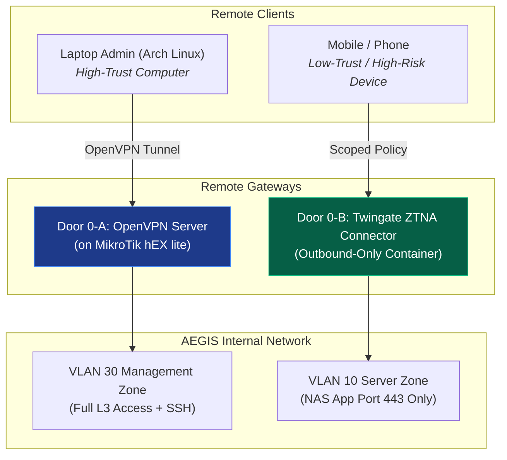

# 🌐 ZTNA Twingate vs OpenVPN Dual Remote Access

> **Key Principle (Section 2.3.4 & 3.5.6)**: Designing dual parallel remote access channels adhering to **Out-of-band Management** and **Least Privilege** based on endpoint device risk profiles.

---

## 📊 Remote Access Dual Path Comparison

---

## 🔑 In-Depth Functional Comparison

| Feature | Path 1: OpenVPN (Door 0-A) | Path 2: Twingate ZTNA (Door 0-B) |
| :--- | :--- | :--- |
| **Target Device** | Computers / Admin PCs | Mobile Phones / Handheld Devices |
| **Granted Permission** | Broad Network Access (Equivalent to physical Port 5) | Scoped Access (Locked per IP:Port per app) |
| **Connection Type** | Receives IP from pool `192.168.30.100–200` (VLAN 30) | Outbound-Only Connector (No inbound open ports) |
| **Capabilities** | SSH Terminal to Beelink, deep system administration | Access specifically to AEGIS Drive web UI on Port 443 |
| **Security** | Protected by Certificates & Passwords | Prevents network exposure if mobile is lost or infected |

---

---

## Relationship to the rest of the security model

Both doors are **remote-access paths into** the system; neither replaces the in-application controls. Whichever door a user arrives through, they still hit the same server-side gate: session → role → `camera_assignment` / ownership check. See [[05 - 🛡️ Security Architecture]] and [[concepts/Identity_Decoupling]] — a VPN grants *network reachability*, never application privilege.

The scoped, outbound-only ZTNA path is the same least-privilege reasoning applied at the network layer that [[concepts/Identity_Decoupling]] applies at the database layer and [[concepts/OWASP_Security_Defense]] applies at the request layer.

---

## 🔗 Related Notes
* [[START_HERE]]
* [[concepts/VLAN_Segmentation_and_Port_Mapping]]
* [[entities/MikroTik_hEX_lite]]
* [[02 - 💾 IDEA1 AEGIS Drive LC]]
* [[05 - 🛡️ Security Architecture]]
* [[concepts/Cyber-Physical_Defense]]
