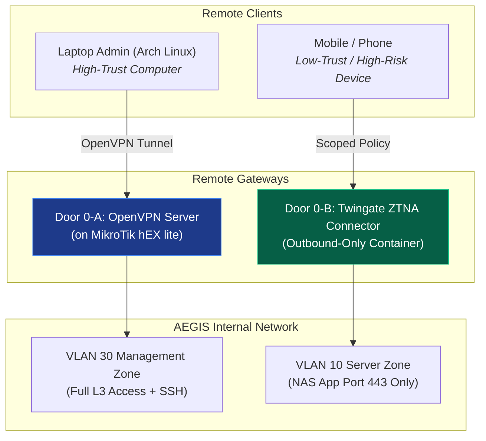

# 🌐 ZTNA Twingate vs OpenVPN Dual Remote Access

> **หลักการสำคัญ (จากรายงานหลัก Section 2.3.4 & 3.5.6)**: การออกแบบช่องทางเข้าถึงระยะไกล 2 เส้นทางคู่ขนาน ยึดหลัก **Out-of-band Management** และ **Least Privilege** โดยแบ่งตามระดับความเสี่ยงของอุปกรณ์ปลายทาง

---

## 📊 เปรียบเทียบ 2 เส้นทางเข้าถึงระยะไกล

---

## 🔑 เปรียบเทียบฟังก์ชันเชิงลึก

| คุณลักษณะ | เส้นทางที่ 1: OpenVPN (ด่าน 0-A) | เส้นทางที่ 2: Twingate ZTNA (ด่าน 0-B) |
| :--- | :--- | :--- |
| **อุปกรณ์เป้าหมาย** | คอมพิวเตอร์ / Admin PC | โทรศัพท์มือถือ / อุปกรณ์พกพา |
| **ระดับสิทธิ์ที่ได้รับ** | Broad Network Access (เสมือนต่อพอร์ต 5 หน้างาน) | Scoped Access (ล็อกราย IP:Port เฉพาะแอป) |
| **การเชื่อมต่อ** | รับ IP จากพูล `192.168.30.100–200` (VLAN 30) | Outbound-Only Connector (ไม่ต้องเปิดพอร์ต Inbound) |
| **ความสามารถ** | SSH Terminal เข้า Beelink, บริหารจัดการระบบเชิงลึก | เข้าใช้งานเฉพาะหน้าเว็บ AEGIS Drive พอร์ต 443 |
| **ความปลอดภัย** | ป้องกันด้วย ใบรับรองและรหัสผ่าน | ป้องกันปัญหาหากมือถือสูญหายหรือติดมัลแวร์ ไม่เห็นอุปกรณ์อื่นใน LAN |

---

## 🔗 ความสัมพันธ์กับโน้ตอื่น
* [[concepts/VLAN_Segmentation_and_Port_Mapping]]
* [[entities/MikroTik_hEX_lite]]
* [[02 - 💾 IDEA1 AEGIS Drive LC]]
