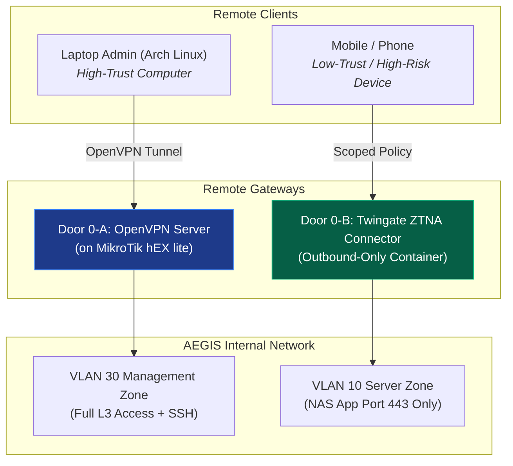

# 🌐 ZTNA Twingate vs OpenVPN Dual Remote Access

> ## ⚠️ Reality Check (2026-08-06)
>
> **หน้านี้บันทึกสถาปัตยกรรมที่ "ออกแบบไว้ในเล่ม" ไม่ใช่สิ่งที่ใช้งานจริง** เก็บไว้เพื่ออ้างอิงกระบวนการออกแบบ
>
> | ในหน้านี้เขียนว่า | ของจริง ณ 2026-08-06 |
> | :--- | :--- |
> | Door 0-A · **OpenVPN** สำหรับ Admin PC → VLAN 30 | ❌ **ใช้ไม่ได้จริง** (Double NAT → Port Forward ไม่ได้) → [[30-RemoteAccess/OpenVPN-Deprecated]] |
> | Door 0-B · **Twingate** สำหรับมือถือ → AEGIS Drive **port 443** | ✅ ใช้ Twingate **ช่องทางเดียวสำหรับทุกอุปกรณ์** และ Resource เดียวคือ **SSH TCP 22** → `192.168.10.10` |
> | เข้า **VLAN 30 Management** ก่อนจึงเข้าถึงบริการอื่น | ⚠️ Resource จริงชี้ตรงไป **VLAN 10** ไม่ผ่าน VLAN 30 — **ยังไม่ตัดสินใจว่าจะแก้ทางไหน** |
>
> 👉 สถานะจริงอยู่ที่ [[30-RemoteAccess/Twingate-Setup]] · รายการที่ขัดกันข้อ 2 และ 3 อยู่ที่ [[90-Status/Document-Conflicts]]
> 👉 การเขียนหน้านี้ใหม่ทั้งฉบับเป็นงาน **P3-8** ใน [[90-Status/Open-Items-Backlog]]

---

> **Key Principle (Section 2.3.4 & 3.5.6)**: Designing dual parallel remote access channels adhering to **Out-of-band Management** and **Least Privilege** based on endpoint device risk profiles.

---

## 📊 Remote Access Dual Path Comparison

---

## 🔑 In-Depth Functional Comparison

| Feature | Path 1: OpenVPN (Door 0-A) | Path 2: Twingate ZTNA (Door 0-B) |
| :--- | :--- | :--- |
| **Target Device** | Computers / Admin PCs | Mobile Phones / Handheld Devices |
| **Granted Permission** | Broad Network Access (Equivalent to physical Port 5) | Scoped Access (Locked per IP:Port per app) |
| **Connection Type** | Receives IP from pool `192.168.30.100–200` (VLAN 30) | Outbound-Only Connector (No inbound open ports) |
| **Capabilities** | SSH Terminal to Beelink, deep system administration | Access specifically to AEGIS Drive web UI on Port 443 |
| **Security** | Protected by Certificates & Passwords | Prevents network exposure if mobile is lost or infected |

---

## 🔗 Related Notes
* [[concepts/VLAN_Segmentation_and_Port_Mapping]]
* [[entities/MikroTik_hEX_lite]]
* [[02 - 💾 IDEA1 AEGIS Drive LC]]
