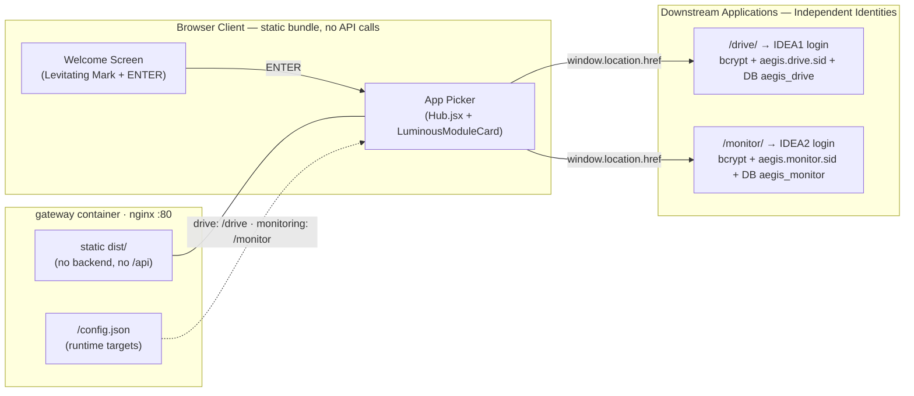

# 🚪 HUB-AEGIS Entry (Stateless App Picker — **Not** an Authentication Hub)

> **Codebase Status**: ✅ Static-only (Served via NGINX in the `gateway` image)
> — **No backend, no session, no database, no standalone user accounts.**
> **Primary Source Files**: `HUB-AEGIS_Entry/src/App.jsx`, `HUB-AEGIS_Entry/src/screens/Welcome.jsx`,
> `HUB-AEGIS_Entry/src/screens/Hub.jsx`, `HUB-AEGIS_Entry/src/components/LuminousModuleCard.jsx`,
> `HUB-AEGIS_Entry/public/config.json`, `gateway/nginx.conf`

> [!warning] Architecture Revision 2026-07-24 — Login forms fully removed
> Previous documentation described HUB as having an "Express Auth Server `:3001`" and "Split Vault Card Login" — **that information is obsolete**. The login forms, `server/` directory, and client-side password verification code were permanently removed. See [[concepts/Identity_Decoupling]] and test evidence in `docs/auth-test.md` §12.

---

## 🎨 Cross-App Theme Persistence System (2026-07-25)

All 3 AEGIS modules (`HUB-AEGIS_Entry`, `IDEA1-AEGIS_Drive_LC`, `IDEA2-AEGIS_Monitor`) maintain synchronized theme state (Dark Mode / Light Mode):

1. **Shared Key `aegis_theme` in `localStorage`**: Whenever the theme is toggled on Welcome or Hub screens, the value is saved to `localStorage.setItem('aegis_theme', theme)`.
2. **Seamless Initial Theme Hydration**: Navigating to Drive (`/drive/`) or Monitor (`/monitor/`) reads the `aegis_theme` key, hydrating cards and backgrounds immediately.
3. **DOM Class & Spec Sync**: Sets `html.dark` and `html.light` classes alongside `data-theme` on `document.documentElement` for Tailwind CSS v4 `@variant dark`.
4. **Cross-Tab Event Listener**: Listens for cross-tab theme changes via `window.addEventListener('storage', ...)`.

### Repository-wide tactical surface pass (2026-07-28)

The static HUB presentation layer now participates in the same dual-theme interaction contract as Drive and Monitor. `HUB-AEGIS_Entry/src/index.css` adds theme-aware surface tokens, focus-visible rings, restrained press feedback, responsive max-width behavior, and reduced visual noise while preserving the gate imagery, module routing, and all existing state logic. This was a CSS-only pass; HUB remains a stateless app picker.

---

## 🕳️ Vulnerability Refactoring Context (Legacy Client-Side Auth Fallback)

Legacy `src/lib/auth.js` previously executed a `POST /api/login` request. If the backend did not respond, it fell back to validating passwords client-side against an in-memory `DEMO_ACCOUNTS` array embedded in the JS bundle.

Because the `gateway` container serves HUB statically (returning `405`), any user submitting `admin` / `aegis-admin` received an Admin session without any server-side validation.

### Remediation: Surface Removal over Guard Addition
Rather than constructing a dedicated backend, the attack surface was completely removed:

| Removed Item | Reason |
|---|---|
| `src/screens/Login.jsx` | HUB Login Form |
| `src/lib/auth.js` | `DEMO_ACCOUNTS` + fallback logic |
| `src/lib/modules.js` | Client-side module filtering |
| `server/` (entire folder) | Unused Node auth/session server code |
| Login strings in `src/lib/strings.js` | Strings implying HUB performs authentication |

---

## 🏗️ Internal HUB Architecture (Current Implementation)

**Key Takeaway**: Navigation from AppPicker uses `window.location.href` to hand off to separate downstream applications deployed behind NGINX. HUB passes no tokens, cookies, or query parameters.

---

## 🔑 Key Features & Design (Verified Implementation)

1. **Welcome → App Picker (Two Screens)**:
   * First screen: Levitating Mark + wordmark + tagline + single ENTER button.
   * Pressing ENTER navigates to the App Picker without any login step.
   * Module cards use `LuminousModuleCard` components.
2. **No RBAC at HUB Level**:
   * Module listings are static public indices without role filtering.
3. **Runtime Configuration**:
   * `public/config.json` maps `drive → /drive` and `monitoring → /monitor`.
4. **NGINX Security Headers**:
   * CSP (no `unsafe-inline`/`unsafe-eval`), `X-Frame-Options: DENY`, `nosniff`, `Referrer-Policy: no-referrer`, HSTS, and `Permissions-Policy`.

---

## ✅ Resolved Issues — NGINX Routing & Security Headers (2026-07-26)

* Prefix stripping (`rewrite ^/drive/?(.*)$ /$1 break;` and `rewrite ^/monitor/?(.*)$ /$1 break;`) fixed routing to downstream Express root endpoints.
* Case-insensitive regex guard `location ~* ^/monitor/internal(/|$) { return 404; }` added to NGINX to block external requests to internal ingest endpoints.
* Header forwarding updated to `$http_host` to preserve port information in CSRF origin validation.

---

## 🧪 Verification & Evidence (`docs/auth-test.md` §12)

| Verification Item | Result |
|---|---|
| Demo credentials in bundle | `0` occurrences |
| `POST /api/login` on HUB | `405` (No fallback handling) |
| Outgoing auth requests on HUB | `0` (Only `GET /` and `GET /config.json`) |
| `<input type=password>` on HUB | `0` |
| `HUB-AEGIS_Entry/server/` | Removed |

---

## 📂 Codebase File Paths
* `HUB-AEGIS_Entry/src/App.jsx` - App state machine (Welcome → Hub)
* `HUB-AEGIS_Entry/src/screens/Welcome.jsx` - Welcome Screen
* `HUB-AEGIS_Entry/src/screens/Hub.jsx` - App picker + hand-off via `window.location.href`
* `HUB-AEGIS_Entry/src/components/LuminousModuleCard.jsx` - Luminous Module Cards
* `HUB-AEGIS_Entry/public/config.json` - Module runtime target mapping
* `HUB-AEGIS_Entry/nginx.conf` - Production NGINX configuration
* `HUB-AEGIS_Entry/Dockerfile` - Vite build → NGINX static server
* `gateway/nginx.conf` - Development gateway NGINX configuration
* `HUB-AEGIS_Entry/deploy/deploy.sh` - Automated deployment script

---

## 🔗 Related Notes
* [[core/system-overview]]
* [[idea1/idea1-status]]
* [[idea2/idea2-status]]
* [[core/security-architecture]]
* [[concepts/Identity_Decoupling]]
