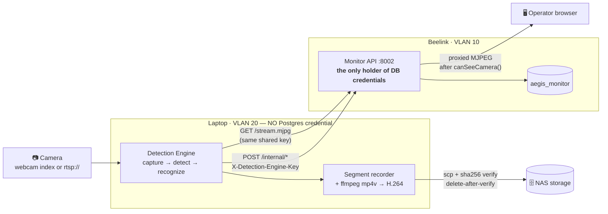

# 🎥 Detection Engine Service

> **Why this note exists**: the Detection Engine is a **separately deployed unit on its own host and VLAN**, with its own trust boundary and its own README — but it had no vault node, so it appeared only as prose inside [[idea2/idea2-status]]. It is the sensor layer of the whole cyber-physical system and deserves a node the graph can point at.

---

## What it is

**Runs on: Laptop (GPU host), VLAN 20. Headless background service — no UI.**

The sensor layer of the AEGIS Cyber-Physical Security System. It reads the camera, runs face recognition, records rolling segments, ships them to the NAS, raises Telegram alerts on unknown faces, and exposes a local API so the Monitor web app can stream live video and read metrics.

**Location**: `IDEA2-AEGIS_CCTV-Operator/detection-engine/` — note this lives inside the folder marked *deprecated*; that folder's README explicitly carves the engine out. **The engine is active; do not delete the folder.**

It is **absent from `docker-compose.yml` by design** — it runs on the Laptop, not in the Docker stack.

## Trust boundary (the important part)

**The engine never holds a database credential.** It posts metadata to `POST /internal/{detections,clips,alerts,heartbeat}` behind a timing-safe `X-Detection-Engine-Key` check; the backend is the only thing that touches Postgres. Video bytes go local disk → NAS and **Monitor is never in that path** — the `monitor` service declares no volume mounts at all.

## What is genuinely built

- **Capture** via `cv2.VideoCapture` — accepts a webcam index **or** an RTSP URL. RTSP swappability was proven at runtime with zero code changes.
- **Interactive device picker** (`setup_camera.py`) — probes and enumerates local cameras, writes the choice to `.env`, and propagates `AEGIS_CAMERA_DEVICE_NAME` through to the heartbeat payload.
- **Segment recording + NAS off-load** with sha256 verification and delete-after-verify.
- **Heartbeat** every 5s into `camera_heartbeat`; `/api/link` derives online/lost from row age (15s / 45s thresholds) — see [[concepts/Honest_Telemetry_and_Unavailable_States]].
- **Live MJPEG** at `GET /stream.mjpg` (`multipart/x-mixed-replace`), consumed through Monitor's authorizing proxy — never browser-to-engine.
- **Telegram alerting** routed by `camera_assignment` (not a hardcoded chat id) via `GET /internal/route/:cameraId` — see [[concepts/Schema_Ownership_Map]].

## ⚠️ The recognition model does not exist

`PlaceholderRecognizer` finds Haar boxes and labels **every** face `Unknown`, with a confidence derived from box area. Therefore `detections.result` is always `Unknown` and `matched_name` is always `NULL` — the "Authorized — name" rows the UI was designed around **cannot currently be produced**.

The integration seam is complete and tested; only the model is missing. This is the single largest open gap in the project — see [[summaries/08_Outstanding_Items_Consolidated]]. It is also what the ethics submission in [[ethics/Participant_Information_Sheet_IDEA2]] is written to cover once real faces are enrolled.

## Related hardware & concepts
Runs alongside [[entities/Beelink_Mini_S_NAS]] (which hosts the Monitor API and Postgres) across the VLAN boundary described in [[concepts/VLAN_Segmentation_and_Port_Mapping]]. Its fail-soft posting behaviour and honest `lost` reporting follow [[concepts/Honest_Telemetry_and_Unavailable_States]]; its physical-containment counterpart is [[concepts/Cyber-Physical_Defense]].

---

## Related
[[idea2/idea2-status]] · [[entities/Beelink_Mini_S_NAS]] · [[concepts/VLAN_Segmentation_and_Port_Mapping]] · [[concepts/Schema_Ownership_Map]] · [[concepts/Honest_Telemetry_and_Unavailable_States]] · [[concepts/Terminal_Verification_Protocol]] · [[ethics/Participant_Information_Sheet_IDEA2]] · [[summaries/05_IDEA2_Monitor_and_Detection_Engine]] · [[START_HERE]]
