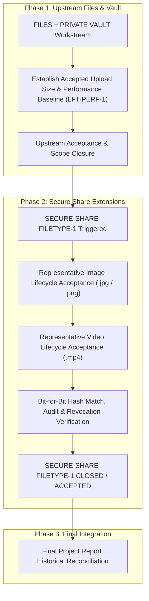

# IDEA1 Secure Share — Consolidated Historical Closeout and Post-Closeout Follow-ups

## Executive Status

```text
============================================================
EXECUTIVE STATUS DECLARATION
============================================================
ORIGINAL_SECURE_SHARE_STATUS    = CLOSED / ACCEPTED
PUBLIC_SHARE_ROLLOUT_STATUS     = CLOSED / ACCEPTED / MERGED
POST_MERGE_RUNTIME_ALIGNMENT    = PASS
TOTAL_ORIGINAL_ITEMS_DOCUMENTED = 43
TOTAL_ORIGINAL_CLOSED_ITEMS     = 43 (42 PASS / APPROVED / MERGED; 1 ACCEPTED LIMITATION)

NEW_POST_CLOSEOUT_ITEMS         = 3
- SECURE-SHARE-FILETYPE-1        = [NEW — PLANNED] / NOT YET ACCEPTED
- Files/Private Vault Dependency = [DEPENDENCY — WAITING]
- LFT-PERF-1 Reference           = [NEW — PLANNED] / BENCHMARK REFERENCE

RUNTIME_CODE_CHANGED            = NO
PRODUCTION_MUTATED              = NO
CLOUDFLARE_MUTATED              = NO
============================================================
```

The complete original Secure Share and Public Share rollout is **CLOSED, ACCEPTED, AND MERGED**. PR #141 was human-reviewed and merged into `main` as merge commit `721b797860063729b7c3c280161dcb908d0ff7f5`.

Following the merge, the Production repository checkout on `aegis-system` intentionally remained at `2806373bb300728a0babb953a63f98bcd714ffef` on branch `main`; no `git pull`, `git checkout`, or `git reset` was performed on the host. Post-merge acceptance verified runtime, artifact, and configuration alignment with the accepted Public Share deployment state (`POST_MERGE_RUNTIME_ALIGNMENT=PASS`): exact S5.11 overlay SHA and content, `PUBLIC_SHARE_UI_ENABLED=true`, correct Gateway CIDR, valid host firewall rules, zero drift, and healthy Drive, Gateway, PostgreSQL, and Cloudflare connector services.

In the post-merge Human Owner Production System Test Phase 1, **12/12 listed Phase 1 checks passed** (`IDEA1_SYS_P1_LOGIN` through `IDEA1_SYS_P1_SETTINGS`) with zero anomalies reported within the tested scope. Share-specific operations (`any` create, redeem, download byte match, revoke, post-revoke denial, and the Public Internet scope selector) were confirmed functional as a verified subset of that sweep.

This note functions as a **consolidated Secure Share historical closeout and handoff index**, clearly divided into two distinct parts:
- **PART A**: Everything implemented, tested, accepted, deployed, and closed in the original Secure Share and Public Share rollout (`[ORIGINAL — CLOSED]`).
- **PART B**: New follow-up extensions, workflow dependencies, and performance benchmarks planned after closure (`[NEW — PLANNED]`, `[DEPENDENCY — WAITING]`, `[ACCEPTED LIMITATION]`).

Individual immutable task receipts under `90-Status/logs/` and canonical notes (`idea1-status.md`, `idea1-public-share-architecture.md`) remain authoritative for granular historical evidence.

---

# PART A — Original Secure Share / Public Share — CLOSED

The original Secure Share system evolved from a local, authenticated single-node file sharing mechanism into a multi-tiered, perimeter-isolated, public-facing service protected by Cloudflare Edge routing, dedicated Gateway proxies, unprivileged Docker containers, host-level firewall scripts, and strict rate limiting.

Every architectural component, security boundary, network scope, and operational procedure in this original scope has been fully implemented, verified, and accepted.

## 1. Comprehensive 43-Item Chronological & Functional Closeout Matrix

| # | Feature / Test Area | What was tested | Historical Evidence & Milestones | Result | Final State |
| :-: | :--- | :--- | :--- | :-: | :-: |
| **1** | **Basic Secure Share Link Creation & Token Lifecycle** | Crypto-random token generation, SHA-256 token hashing (`token_hash CHAR(64)`), raw token returned only once at creation, file redemption and streaming download. | `server/routes/share.js`, `tests/shareRedemption.test.js`, PR #30, PR #31, Receipt [[90-Status/logs/2026-08-25_161618_kla_idea1-share-ownership-authorization-implementation]] | PASS | `[ORIGINAL — CLOSED]` |
| **2** | **Share Ownership & Authorization Hardening** | Authenticated owner-scoped listing (`GET /api/shares`), owner-scoped revocation (`DELETE /api/shares/:id`), cross-owner access returns HTTP 404 object hiding; Admin has zero cross-owner bypass. | `tests/shareOwnershipAuthorization.test.js`, atomic PostgreSQL `UPDATE` in `server/db/postgres.js`, Production acceptance `PROD-SHARE-1` through `PROD-SHARE-10` (10/10 PASS) on `aegis-system`, Receipt [[90-Status/logs/2026-08-26_215828_kla_idea1-share-ownership-production-closure]] | PASS | `[ORIGINAL — CLOSED]` |
| **3** | **Password Protection & Server-Side Verification** | Optional/required password configuration, bcrypt (cost 12) hashing (`password_hash`), server-side password comparison on `POST /s/:token`, form re-display on invalid password without disclosing validity, zero plaintext/hash leak. | `server/routes/share.js`, direct database column assertion in `tests/shareRedemption.test.js`, Production verification | PASS | `[ORIGINAL — CLOSED]` |
| **4** | **Expiry Configuration & Enforcement** | Configurable expiration timestamps (`expires_at`), server-side SQL filtering and route enforcement (`is_active` and `now() < expires_at`), expired tokens return generic 404. | `server/routes/share.js`, `tests/shareRedemption.test.js` | PASS | `[ORIGINAL — CLOSED]` |
| **5** | **Share Revocation & Immediate Link Invalidation** | Owner-triggered revocation setting `revoked_at = now()`, immediate blocking of all subsequent GET/POST redemption requests with generic 404, atomic DB update. | `tests/shareOwnershipAuthorization.test.js`, `tests/shareRedemption.test.js`, Production acceptance `PROD-SHARE-4` & `PROD-SHARE-5` | PASS | `[ORIGINAL — CLOSED]` |
| **6** | **Safe Failure Behavior & Oracle Elimination** | Unknown token, revoked token, expired token, and unavailable file all return the identical generic HTTP 404 error page/payload; eliminates timing and enumerative oracles; fail-closed behavior. | `server/routes/share.js`, `tests/shareRedemption.test.js`, internal differentiation maintained solely in `audit_log` | PASS | `[ORIGINAL — CLOSED]` |
| **7** | **Network Scopes Contract (`zones`, `any`, `public`)** | Three distinct network scopes supported: `zones` (VLAN/CIDR restricted), `any` (any reachable private/Twingate network), `public` (Public Internet via Cloudflare/Gateway). | Database CHECK constraint `shares_scope_check`, `tests/shareScopeTruthUi.test.js`, PR #96 (`idea1-public-share-backend-contract`), Migration 009 | PASS | `[ORIGINAL — CLOSED]` |
| **8** | **Zones Network Scope Acceptance** | `vlan_scope` CIDRs snapshotted from `network_zones` at creation; on redemption `ipAllowed(req.ip, cidrs)` allows in-scope source and blocks out-of-scope source with HTTP 403; creation refused if zero zones defined. | `server/routes/share.js`, `tests/shareRedemption.test.js`, on-site verification (2026-09-02) | PASS | `[ORIGINAL — CLOSED]` |
| **9** | **Anywhere (`any`) Scope Acceptance** | Creation of `any` share, redemption from Twingate/private reachable recipient, successful download, revocation, and post-revoke refusal. | On-site acceptance [[90-Status/logs/2026-09-02_202000_kla_idea1-onsite-file-share-acceptance]], Production System Test Phase 1 | PASS | `[ORIGINAL — CLOSED]` |
| **10** | **Audit Logging & Identity Privacy** | Comprehensive audit logging for `SHARE_CREATE`, `SHARE_REDEEM`, `SHARE_REVOKE`, `DENIED`, `BLOCKED`, `OUT_OF_SCOPE`; target logged as SHA-256 hash only; zero raw tokens, passwords, or filenames in audit log; source IP normalized. | `audit_log` table in PostgreSQL, `tests/shareRedemption.test.js`, `tests/shareOwnershipAuthorization.test.js`, PR #31, PR #112 | PASS | `[ORIGINAL — CLOSED]` |
| **11** | **Rate Limiting & Brute-Force Protection** | Rate limiter mounted on `/s/:token` (`scope: share`) via `server/auth/rateLimit.js` limiting password submission attempts; excessive attempts return HTTP 429 Too Many Requests; prevents brute-force guessing. | `server/auth/rateLimit.js`, `server/routes/share.js`, `tests/publicShareSecurityRegression.test.js` | PASS | `[ORIGINAL — CLOSED]` |
| **12** | **Response Safety & Disclosure Minimization** | All public/redemption responses enforce `X-Content-Type-Options: nosniff`, `Content-Disposition: attachment`, CSP nonce on form styles; zero server banners (`X-Powered-By` removed), zero stack traces, zero internal paths. | `server/routes/share.js`, `gateway/public-share/nginx.conf`, `tests/publicShareGatewayRuntime.test.js` | PASS | `[ORIGINAL — CLOSED]` |
| **13** | **Public Share Backend Contract** | Implementation of `public` scope handling, authenticated `GET /api/shares` returning `capabilities: { publicSelectable: boolean }`, UI kept disabled until server authorization. | PR #96, Receipt [[90-Status/logs/2026-09-08_005929_kla_idea1-public-share-backend-contract]], `server/routes/api.js`, `tests/publicShareBackend.test.js` | PASS | `[ORIGINAL — CLOSED]` |
| **14** | **Public Share UI Integration** | Modal scope selector supporting `zones`, `any`, `public`; server capability gating (`sharesApi.data?.capabilities?.publicSelectable === true`); password validation; expiry display; "Public" chip/badge rendering in active shares list. | PR #98, Receipt [[90-Status/logs/2026-09-08_154042_kla_idea1-public-share-ui]], `src/screens/Shares.jsx`, `tests/shareScopeTruthUi.test.js`, S5.11 UI overlay | PASS | `[ORIGINAL — CLOSED]` |
| **15** | **Dedicated Public Share Gateway Architecture** | Reverse proxy architecture ensuring Internet traffic never contacts Drive API directly; only redemption route `/s/:token` forwarded; redemption-only trust boundary; HTTP basic methods restricted. | PR #97, Receipt [[90-Status/logs/2026-09-08_044329_kla_idea1-public-share-gateway]], `gateway/public-share/nginx.conf`, `tests/publicShareGatewayRuntime.test.js` | PASS | `[ORIGINAL — CLOSED]` |
| **16** | **Gateway / Drive Network Isolation** | Isolated dual-bridge Docker architecture: `aegis_public_share_edge` (`172.31.240.0/29`, Gateway + connector) and `aegis_public_share_upstream` (`172.31.241.0/29`, Gateway + Drive). Drive does NOT attach to edge network; connector does NOT attach to upstream. | PR #114, Receipt [[90-Status/logs/2026-09-11_042000_kla_public-share-s5-4-gateway-networks]], Production runtime inspection | PASS | `[ORIGINAL — CLOSED]` |
| **17** | **cloudflared Connector Isolation** | Pinned connector image `cloudflare/cloudflared:2026.9.0` running in unprivileged container with dedicated egress network `172.31.242.0/29`; connector isolated from host and internal networks. | PR #118, Receipt [[90-Status/logs/2026-09-13_192000_kla_public-share-s5-5-cloudflared-egress-isolation]] | PASS | `[ORIGINAL — CLOSED]` |
| **18** | **Firewall & Egress Controls (`s5-5-firewall.sh`)** | iptables-nft / nft script enforcing destination-scoped established return rules (`-d 172.31.240.3/32`, `-d 172.31.242.2/32`), blocking RFC1918 traffic from connector, allowing only outbound tunnel traffic (TCP 7844) and edge Gateway access. | PR #118, S5.5-F Production verification, `gateway/public-share/production/s5-5-firewall.sh` | PASS | `[ORIGINAL — CLOSED]` |
| **19** | **systemd Persistence & Drift Protection** | systemd unit `aegis-public-share-s5-5-firewall.service` and drift timer (`aegis-public-share-drift.timer`) enforcing firewall state every 60s; verified service restart persistence and periodic drift enforcement. | PR #118, S5.5-G Production persistence acceptance, Receipt [[90-Status/logs/2026-09-13_192000_kla_public-share-s5-5-cloudflared-egress-isolation]] | PASS | `[ORIGINAL — CLOSED]` |
| **20** | **Cloudflare Public Hostname Route Activation** | Named tunnel routing `share.aegistk-pb.com` to edge Gateway `http://172.31.240.2:8080`; zero host port exposure; zero direct public exposure of host or Drive. | PR #126, S5.6-D, Receipt [[90-Status/logs/2026-09-14_020000_kla_public-share-s5-6-cloudflare-public-activation]] | PASS | `[ORIGINAL — CLOSED]` |
| **21** | **DNS, TLS & HTTP→HTTPS Enforcement** | Public DNS proxy answers (`104.21.40.88`, `172.67.183.68`); valid edge TLS certificate; HTTP port 80 requests return HTTP 308 permanent redirect targeting HTTPS authority `share.aegistk-pb.com`. | PR #126 (S5.6-E, S5.6-F), PR #130 (S5.7-E), verified via live curl probes | PASS | `[ORIGINAL — CLOSED]` |
| **22** | **Public Default-Deny Behavior** | Requests to root `/`, arbitrary non-existent paths, or malformed endpoints return HTTP 404 default-deny; zero access to Drive API, login, or files. | PR #126 (S5.6-G), PR #130 (S5.7-B), 20/20 requests returned 404 | PASS | `[ORIGINAL — CLOSED]` |
| **23** | **Public Security Matrix (Bounded 75 Rows)** | Bounded 75-row security matrix across 8 subareas (S5.7-A through S5.7-H): surface enumeration, methods, Host validation (unapproved Host -> 403), forwarding header injection (`X-Forwarded-For` spoofing rejected, delta=0), path normalization, traversal attempts, redirect safety (308 strictly targeting HTTPS, no open redirect), information leakage (zero internal leaks across 47 responses). Direct UI proof was NOT TESTED under secret-safe boundary in S5.7, subsequently superseded by direct S5.11 Production UI acceptance. | PR #130, Receipt [[90-Status/logs/2026-09-15_050500_kla_public-share-s5-7-public-security-matrix]], 74 PASS, 0 FAIL, 1 NOT TESTED (historical UI proof) | PASS | `[ORIGINAL — CLOSED]` |
| **24** | **Windows External Acceptance (Twingate OFF)** | External client on Windows Wi-Fi with Twingate completely disabled; accessed public Internet via `share.aegistk-pb.com`; successfully redeemed share, downloaded payload with download/content integrity match, revoked share, verified post-revoke 404 refusal. | S5.8 Human Owner Production evidence, PR #141, Receipt [[90-Status/logs/2026-09-16_043452_kla_public-share-s5-12-final-closeout]] | PASS | `[ORIGINAL — CLOSED]` |
| **25** | **Mobile Cellular External Acceptance (4G/5G, No Twingate)** | Mobile device with Wi-Fi OFF and no Twingate on cellular 4G/5G network; redeemed public share, downloaded payload with content integrity match, verified revocation blocking. | S5.8 Human Owner Production evidence, PR #141 | PASS | `[ORIGINAL — CLOSED]` |
| **26** | **Public IPv4 / IPv6 Evidence & Boundary** | Public IPv4 redemption recorded `SHARE_REDEEM` OK in audit log; public IPv6 redemption recorded OK. One historical IPv6 `DENIED` audit row exists. | S5.8 / S5.11 audit log inspection, PR #141 | ACCEPTED LIMITATION | `[ACCEPTED LIMITATION]` (Cause of one historical IPv6 `DENIED` row remains `NOT PROVEN`) |
| **27** | **Transfer Integrity Test (Deterministic 64 MiB SHA-256)** | Deterministic 64 MiB test payload generated, shared publicly, downloaded over public Internet, and exact SHA-256 matched source bit-for-bit. | S5.9 Human Owner Production evidence, PR #141 | PASS | `[ORIGINAL — CLOSED]` |
| **28** | **Interrupted Transfer Recovery** | Premature client disconnect during active download followed by successful recovery/re-download, with exact integrity preserved and zero accepted test-temp residue. | S5.9 Human Owner Production evidence, PR #141 | PASS | `[ORIGINAL — CLOSED]` |
| **29** | **Slow-Path Client Acceptance** | Throttled/slow-path transfer completed successfully within the tested scope. | S5.9 Human Owner Production evidence, PR #141 | PASS | `[ORIGINAL — CLOSED]` |
| **30** | **Concurrent Download Acceptance** | Four simultaneous external client downloads across public edge; all 4 transfers completed concurrently with integrity verified. | S5.9 Human Owner Production evidence, PR #141 | PASS | `[ORIGINAL — CLOSED]` |
| **31** | **Cleanup & Temp Artifact Verification** | Accepted test-temp artifact check reported zero residual artifacts. | S5.9 Human Owner Production evidence, PR #141 | PASS | `[ORIGINAL — CLOSED]` |
| **32** | **Public Exposure Rollback Verification** | Teardown of public exposure; removal of Cloudflare hostname routing, connector container, egress network, and S5.5 firewall additions; restoration of private baseline. | S5.10 Human Owner Production evidence, PR #141 | PASS | `[ORIGINAL — CLOSED]` |
| **33** | **Private Regression After Rollback** | Authenticated login, Files, `any` share lifecycle, core container health, and protected volumes verified functional after rollback; `zones` scope correctly blocked from Twingate vantage. | S5.10 Human Owner Production evidence, PR #141 | PASS | `[ORIGINAL — CLOSED]` |
| **34** | **Gate 6 (G6) Final Authorization** | Gate 6 was APPROVED by Human Owner prior to S5.11 deployment; subsequently recorded and reconciled in PR #141 closeout evidence. | G6 APPROVED by Human Owner on 2026-09-15, PR #141 | APPROVED | `[ORIGINAL — CLOSED]` |
| **35** | **Final Public Path Restoration** | Re-deployment of connector, egress network, firewall rules, systemd units, and Cloudflare tunnel routing following G6 approval. | S5.11 Human Owner Production evidence, PR #141 | PASS | `[ORIGINAL — CLOSED]` |
| **36** | **Final Public Share UI Activation** | Deployment of narrow Drive overlay `gateway/public-share/production/docker-compose.s5-11-ui.yml` setting `PUBLIC_SHARE_UI_ENABLED=true`; activated Public Internet option in Secure Shares modal. | S5.11 Human Owner Production evidence, PR #141 | PASS | `[ORIGINAL — CLOSED]` |
| **37** | **Final Production Health Audit** | Drive (`/healthz` ok, db=postgres), Gateway, cloudflared connector, PostgreSQL, firewall rules, drift timer, and protected volumes all verified healthy. | S5.11 Human Owner Production evidence, PR #141 | PASS | `[ORIGINAL — CLOSED]` |
| **38** | **Database Scope Contract & P6 Clarification** | Verification of `shares` table in canonical database `aegis_drive`; verified CHECK constraint `shares_scope_check` permits `any`, `zones`, `public`, `vlan`, `subnet`; recorded P6 false-negative clarification (verifier queried `aegis_db` instead of `aegis_drive`). | S5.3 / S5.11 inspection, PR #141 | PASS / ACCEPTED | `[ORIGINAL — CLOSED]` |
| **39** | **Final Public-Edge Endpoint Smoke** | HTTPS root `https://share.aegistk-pb.com/` returns HTTP 404; HTTP root `http://share.aegistk-pb.com/` returns HTTP 308 redirect to HTTPS. | S5.11 Human Owner Production evidence, PR #141 | PASS | `[ORIGINAL — CLOSED]` |
| **40** | **Repository Verification & S5.12 Regression Suite** | Focused Public Share suite (125 total, 119 pass, 0 fail, 6 skipped), full canonical regression (1,309 total, 1,228 pass, 9 historical accepted failures, 72 skipped, `NEW_FAILURES=0`), Vite production build, vault validation, collaboration policy, secret scan, git diff check. | S5.12 execution, PR #141, Receipt [[90-Status/logs/2026-09-16_043452_kla_public-share-s5-12-final-closeout]] | PASS | `[ORIGINAL — CLOSED]` |
| **41** | **Human Review & Merge of PR #141** | Final Human Owner review and merge of PR #141 into `main` as merge commit `721b797860063729b7c3c280161dcb908d0ff7f5`. | GitHub git log, PR #141 merge event | MERGED / CLOSED | `[ORIGINAL — CLOSED]` |
| **42** | **Post-Merge Production Alignment** | Production repository checkout intentionally remained at `2806373bb300728a0babb953a63f98bcd714ffef`; no git pull/reset was performed. Post-merge acceptance proved runtime/artifact/configuration alignment with the accepted Public Share deployment state (`POST_MERGE_RUNTIME_ALIGNMENT=PASS`). | Production host inspection, PR #143 baseline | PASS | `[ORIGINAL — CLOSED]` |
| **43** | **Post-Merge System Test Phase 1 Share Verification** | 12/12 listed Phase 1 checks passed (`IDEA1_SYS_P1_LOGIN` through `IDEA1_SYS_P1_SETTINGS`) with zero anomalies reported within the tested scope. Share-specific operations (`any` create/redeem/revoke/post-revoke denial and Public scope selectable) verified clean as a subset. | Human Owner evidence recorded in [[idea1/idea1-status]] and PR #143 baseline | PASS | `[ORIGINAL — CLOSED]` |

---

## 2. Original Scope Final Boundary

```text
============================================================
ORIGINAL SECURE SHARE / PUBLIC SHARE FINAL BOUNDARY
============================================================
Implementation             = CLOSED
Ownership/Auth             = CLOSED
Password                   = CLOSED
Expiry                     = CLOSED
Revocation                 = CLOSED
Network Zones              = CLOSED
Anywhere                   = CLOSED
Public Internet            = CLOSED
Audit                      = CLOSED
Rate Limiting              = CLOSED
Gateway                    = CLOSED
Connector Isolation        = CLOSED
Firewall / Drift           = CLOSED
Cloudflare Route           = CLOSED
External Windows E2E       = CLOSED
Mobile 4G/5G E2E           = CLOSED
Security Matrix            = CLOSED
Rollback                   = CLOSED
Private Regression         = CLOSED
UI Activation              = CLOSED
Repository Closeout        = CLOSED
Human Review / Main Merge  = CLOSED

OVERALL ORIGINAL SCOPE
= CLOSED / ACCEPTED
============================================================
```

The original Secure Share / Public Share rollout cannot be reopened by future work or post-closeout observations.

---

## 3. Accepted Limitations / Evidence Boundaries

The following items are explicit evidence boundaries established during the original rollout. They are **not open bugs or blockers** for the closed rollout:

1. **One historical IPv6 `SHARE_REDEEM` `DENIED` audit row:** The cause remains **NOT PROVEN**. It was not converted to PASS, nor was it treated as an unverified production flaw. Subsequent IPv6 redemptions completed successfully with `SHARE_REDEEM / OK`.
2. **Bounded representative transfer sizes:** Public Share acceptance was proven using bounded representative payloads up to **64 MiB**.
3. **20–30 GB Public Share transfer:** Remains **NOT TESTED / NOT CLAIMED**.
4. **Production 32 GiB Public Share transfer:** Remains **NOT TESTED / NOT CLAIMED**.
5. **Separation of agent verification and human evidence:** Repository verification runs locally in CI/test environments; live production runtime, Cloudflare controls, DNS propagation, and external cellular checks are classified as authoritative Human Owner evidence.
6. **S5.11 Execution-Order / Evidence Boundary (P2C Sequence Gap):**
   - The planned fresh P2C readiness/isolation/responsible-counter/2x-reconcile block (prescribed in the canonical S5.5/S5.11 execution sequence) was not separately captured as fresh accepted chat evidence before UI activation and public E2E execution.
   - Subsequent P4B, P5, and P6 evidence independently established firewall validity, drift health, service health, successful external/private E2E, and final operational health.
   - Earlier S5.6 isolation acceptance remains historical evidence.
   - Repository and git commit history searches confirmed no separate fresh P2C receipt or document exists.
   - **Classification:** **SEQUENCE / EVIDENCE GAP — NOT A PROVEN RUNTIME DEFECT**.

---

# PART B — New Secure Share Extensions / Future Work

```text
============================================================
POST-CLOSEOUT NOTICE
============================================================
The items in PART B were added AFTER the original Secure
Share and Public Share rollout was fully closed and merged.

They represent forward-looking backlog items and workflow
dependencies. They DO NOT reopen or invalidate PART A.
============================================================
```

## B1 — SECURE-SHARE-FILETYPE-1: Representative Non-Text File-Type Acceptance

- **Identifier:** `SECURE-SHARE-FILETYPE-1`
- **State:** `[NEW — PLANNED]` / NOT YET ACCEPTED
- **Purpose:** Provide representative Production acceptance evidence for non-text file sharing (specifically images and videos) before the Final Project report claims generalized multi-media coverage.

### Current Architectural Reality
The AEGIS Secure Share delivery layer is **already file-type agnostic by design**:
- Redemptions stream bytes directly from the underlying storage volume using `application/octet-stream` with `Content-Disposition: attachment; filename="<encoded>"` and `X-Content-Type-Options: nosniff`.
- Share creation is driven by `fileId`, with no MIME allow-list or extension-based restrictions in `server/routes/share.js`.
- Therefore, this is **not a missing feature implementation**. It is an acceptance requirement to prove that representative binary image and video payloads traverse the full end-to-end creation, public redemption, download, checksum matching, and revocation lifecycle in Production.

### Required Representative Acceptance Matrix

| Media Class | Representative Extension | Required Lifecycle Steps | Expected Result | Final Target State |
| :--- | :--- | :--- | :--- | :--- |
| **Image** | `.jpg` or `.png` | 1. Create share link<br>2. Configure optional password<br>3. External public redemption<br>4. Download payload<br>5. Verify exact byte size<br>6. Verify SHA-256 bit-for-bit match<br>7. Verify audit logging (`SHARE_REDEEM`)<br>8. Revoke share<br>9. Verify post-revoke HTTP 404 block | PASS | `[NEW — PLANNED]` |
| **Video** | `.mp4` | 1. Create share link<br>2. Configure optional password<br>3. External public redemption<br>4. Download payload<br>5. Verify exact byte size<br>6. Verify SHA-256 bit-for-bit match<br>7. Verify audit logging (`SHARE_REDEEM`)<br>8. Revoke share<br>9. Verify post-revoke HTTP 404 block | PASS | `[NEW — PLANNED]` |

### Scope Boundary & Claim Policy
- **Download/Share Lifecycle Only:** This acceptance test exercises the file sharing and download path. It does **not** include anonymous inline media playback or video streaming through the unauthenticated public share landing page. Inline preview remains exclusive to the authenticated Private Vault / Files surfaces unless explicitly specified in future architectural RFCs.
- **Representative, Not Exhaustive:** Testing will not claim that every possible MIME type or extension was tested.
- **Allowed Final Claim:** Upon successful completion, the Final Project report may state:
  > *"Secure Share is file-type agnostic by design, with representative Production acceptance for image and video files preserving bit-for-bit payload integrity."*

---

## B2 — Workflow Dependency on Files / Private Vault Workstream

- **Status:** `[DEPENDENCY — WAITING]`
- **Dependency:** `WAITING_FOR = FILES + PRIVATE VAULT ACCEPTED SCOPE`

### Strategic Rationale
The Human Owner has established an explicit operational dependency:
1. Do **not** execute `SECURE-SHARE-FILETYPE-1` immediately.
2. First complete and accept the upstream **Files + Private Vault** workstream.
3. Once upstream Files and Private Vault upload, download, preview, and file-size envelope behaviors are stable and accepted, representative image and video files will already be resident and verified in the Data Lake.
4. `SECURE-SHARE-FILETYPE-1` will then reuse these known-good files for its public share acceptance run.

This sequencing is a **workflow dependency** designed to avoid duplicate test data and uncoordinated testing; it is **not** an indication of any defect in Secure Share.

---

## B3 — Upstream Files / Private Vault Context (Reference Only)

*(Note: Detailed architectural changes to Files / Private Vault belong to their respective feature documents. This section records only the context relevant to Secure Share dependencies.)*

### Fresh Observation — 11.0 GB MP4 Files Upload Rejection
On 2026-09-16, an attempt to upload an approximately **11.0 GB `.mp4`** file through the Production Files UI was rejected before transfer started with the client dialog:
> *"Larger than the upload limit this system is configured for — this file was not sent."*

- **Classification:** **CONFIRMED CONFIGURED-SIZE REJECTION**.
- **What it is NOT:**
  - It is NOT a Twingate throughput failure (the file was never sent over the wire).
  - It is NOT an MP4 format incompatibility.
  - It is NOT a Google or Google Drive limitation.
  - It is NOT a storage exhaustion or browser crash.
- **Source Configuration Envelope:**
  - Default chunk size: `UPLOAD_CHUNK_SIZE_BYTES` = 16 MiB (allowed 8–64 MiB).
  - Default logical ceiling: `MAX_LOGICAL_FILE_BYTES` = 5 GiB.
  - Codebase supports configuration up to 32 GiB, but raises commit-route timeout considerations above ~8 GiB.
  - Increasing the live limit requires a deliberate deployment plan with storage-capacity, timeout, and rollback verification.

### New Backlog Item — LFT-PERF-1: Transfer Performance Benchmarking
- **Identifier:** `LFT-PERF-1`
- **State:** `[NEW — PLANNED]` / BENCHMARK REFERENCE
- **Purpose:** Establish empirical transfer benchmarks across network paths prior to proposing optimizations or architecture changes.
- **Comparative Test Vectors:** Direct wired LAN vs. local Wi-Fi vs. remote Twingate.
- **Measurement Metrics:**
  - Effective upload and download throughput (MB/s).
  - Wall-clock elapsed transfer time.
  - Network round-trip time (RTT) and connection mode (Twingate P2P Direct vs. Relayed).
  - Host disk read/write throughput and storage I/O wait.
  - CPU and RAM utilization during client hashing, encryption, and server commit.
  - Chunk size vs. concurrency tradeoffs.
  - Checksum verification duration.

`LFT-PERF-1` is tracked independently and will not be solved within PR #143.

---

## B4 — Future Execution Pipeline



---

## B5 — Canonical Note Scope Boundary & Current Next Action

```text
============================================================
CANONICAL RECONCILIATION NOTICE
============================================================
POST_MERGE_CANONICAL_RECONCILIATION_REQUIRED = YES

PR #143 task scope is bounded by its immutable receipt to:
1. idea1-secure-share-post-closeout-followups.md
2. 2026-09-16_063734_kla_idea1-secure-share-post-closeout-followups.md

Broader canonical notes (idea1-status.md,
idea1-public-share-architecture.md, idea1-moc.md) are NOT
modified in PR #143 to preserve receipt-scope invariance.
A separate docs-only reconciliation task is recommended
following the merge of PR #143.
============================================================
```

1. Maintain PR #143 as a clean documentation handoff without application code changes.
2. Complete repository collaboration policy and vault integrity validations.
3. Transition PR #143 to **Ready for Human Review**.
4. Human Owner review and merge of PR #143.
5. Proceed to the **Files + Private Vault** workstream as the next active development priority.
