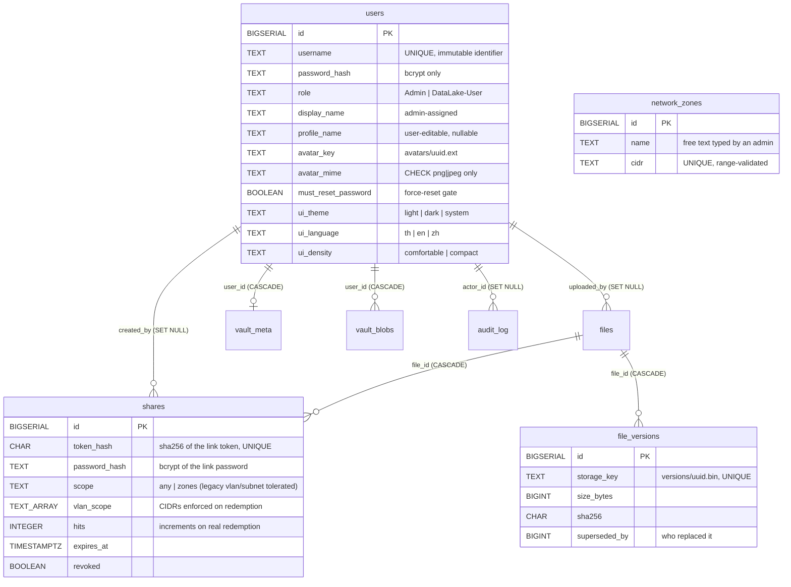

# 💾 IDEA1: AEGIS Drive LC (Secure NAS & Data Lake)

> [!info] Ownership
> Owner: **Kla**. This is the canonical IDEA1 status fragment. Other contributors request changes through their task receipt instead of editing it concurrently.

> [!important] Progress Update 6.1 — current handoff
> The detailed current-state checkpoint is [[idea1/IDEA1-Progress-Update-6.1]].
> Use that note first when resuming from a new chat/session: it contains the 10-screen
> acceptance matrix, Settings sub-gates, Dual Interface Style, RAID/Backup pipeline,
> Twingate TWIN-0/TWIN-1 evidence, production runtime deltas, known limitations and
> the ordered continuation queue as of 2026-09-05.

> **Current production source basis**: ⚠️ Three different SHAs are in play and must not be collapsed. The **Production Git checkout** remains at `2806373bb300728a0babb953a63f98bcd714ffef` (PR #80), which is what delivered PR #79 local Twingate runtime telemetry and PR #80 Vault auto-lock. It is **no longer the source basis of the running Drive application**: since 2026-09-06 that image is built from PR #92 head `64807e963359c6a85bc5d9ded7b6ff1b05226694` (see the PR #92 entry below), while PR #92 merged as `d4b8e921...`; later repository history may advance `main`, so resolve current `main` from Git rather than treating that merge SHA as a permanent `main` pointer. PR #81 merged the Backup Target classifier source fix at merge milestone `07ad78efdf1561f2a49a1ecc81440359b766b3bd`. On 2026-09-06 the reviewed classifier was deployed **only** to the live Host Backup Agent copy at `/opt/aegis/host-backup-agent/src/targets.js`; the Production Git checkout itself remained `2806373...`. The live classifier blob is `2a9dc27fbdb812dbb50a84d10f364343fc09d967`, `PrivateDevices=yes` was preserved, and Production accepted `hgst-usb-1 → DIFFERENT_DEVICE`.
> **PR #92 UI regression fixes — deployed and accepted (2026-09-06)**: PR #92
> merged as `d4b8e92134c569f77b98bfc7c229f4e164e18129`, which was also the
> reconciliation base `main` observed when that acceptance was recorded; later
> repository history may advance `main`, so resolve current `main` from Git.
> ⚠️ **Production was built from the PR head**
> `64807e963359c6a85bc5d9ded7b6ff1b05226694`, **not from the merge commit** — the
> merge added no file changes, so the two trees are byte-identical, but the
> deployed source SHA and the PR #92 merge SHA are different commits and must not be
> written as one. Drive image
> `sha256:55162c2f950607df3470e54319dc65b60e074562de86a40aab3482fc744059ca`;
> Drive running/healthy with `group_add` 29100 + 29102 preserved, `/datalake` RW,
> `/run/aegis-backup` RO, backup socket PASS; PostgreSQL, HUB and Monitor
> unchanged; `healthz` ok=true, db=postgres. Owner manual Production acceptance:
> Settings Account **Avatar Remove PASS / CLOSED**, Files **responsive tile/menu
> PASS / CLOSED**, Private Vault **responsive menu PASS / CLOSED**.
> **Backup classifier integration milestone**: PR #81 merged at `07ad78efdf1561f2a49a1ecc81440359b766b3bd`. This closes the classifier source/PR integration gate but does not itself change the running Production host Backup Agent. Resolve the live repository head from Git rather than treating this milestone SHA as a permanent `main` pointer.
> **Host CPU package temperature — implemented, NOT deployed (2026-09-07)**: the
> host telemetry agent now publishes `metrics.temperature` inside the existing
> `/internal/telemetry` V1 snapshot, discovered by listing `/sys/class/thermal`
> and selecting the zone whose `type` is exactly `x86_pkg_temp`; the Dashboard
> renders it as a CPU temperature tile naming its sensor. The Dashboard Server
> Telemetry card is now exactly six tiles — CPU / RAM / Disk on the first
> desktop row, Network / Uptime / CPU temperature on the second. The Twingate
> tile was dropped from that card because V1 has no approved connector source
> and it could never display anything; `metrics.twingate` remains in the
> `/api/telemetry` contract unchanged, and real connector health is planned for
> the Storage & Backup disk-health view via `/api/remote-access`, not here. There is **no
> fallback** — no `acpitz` (~27.8 °C chassis), no SSD SMART temperature
> (~40 °C, a separate `/api/storage` contract), no other zone, no `0` — an
> unusable sensor is `{ available: false }`. **No systemd privilege change was
> required or made**: production preflight **has already verified** that the
> existing `aegis-telemetry` identity UID/GID `29100` reads the Linux thermal
> sysfs under the current sandbox, and `PrivateDevices=yes`,
> `ProtectSystem=strict` and the empty capability set are untouched (the unit
> diff is comment-only). That account-read question is settled, not outstanding.
> Owner-supplied preflight recorded three **distinct physical sensors** on the
> host: `acpitz` ≈ 27.8 °C (chassis), `x86_pkg_temp` ≈ 55–56 °C (CPU package,
> the one the Dashboard shows), and `smartctl /dev/sda` ≈ 40 °C (SSD, reported
> separately through `/api/storage`). ⚠️ What remains pending is **Production
> deployment and end-to-end acceptance**: no image was built or deployed, no
> agent was restarted, and the tile has never rendered against the real sensor. ⚠️ **Rollout order is a hard constraint:
> deploy the Drive image before restarting the agent.** Drive treats the new
> group as optional and tolerates an older agent; an agent publishing it to an
> older Drive trips `unexpected-metric-group` and blanks every telemetry tile.
> Rollback reverses the order.
> **Host CPU package temperature — Production isolated the defect to the agent's
> wire projection (2026-09-07)**: the new Drive image
> `sha256:fd9d8f74f0d3df73c21cdb46256f2afb101b7b9fbf1d4e3d95142c22712e23a1`
> deployed successfully and is healthy, and is compatible with the previously
> accepted host agent. The new host telemetry agent was deployed, observed, and
> **rolled back successfully**; the previously accepted agent is active again.
> PostgreSQL, HUB and Monitor stayed healthy and HTTPS health was 200/200/200
> throughout. Production evidence proved that `x86_pkg_temp` discovery and the
> sampler were correct — `samplerMetricKeys` carried `cpu, memory, network,
> uptime, temperature` and `samplerTemperature` was
> `{ available: true, celsius: ~55, sensor: "x86_pkg_temp" }` — but the
> `GET /internal/telemetry` wire response carried only `cpu`, `memory`,
> `network` and `uptime`. **`shared/host-telemetry-agent/src/server.js` strict
> wire projection omitted `metrics.temperature`, preventing Drive from receiving
> the measurement.** The agent rebuilds its response body from
> `AGENT_METRIC_KEYS` rather than serializing the snapshot, and PR #95 added the
> metric to the sampler without adding it to that allowlist, so the projector
> correctly dropped an unlisted group. Fixed on branch
> `fix/idea1-host-temperature-wire-projection`: `AGENT_METRIC_KEYS.temperature`
> now lists exactly `available`, `celsius`, `sensor`, and
> `projectAgentSnapshot()` projects the group through the same strict
> `projectMetric()` helper — no spread, no pass-through, `{ available: false }`
> preserved for an unusable sensor, and no change to `thermal.js`, sensor
> discovery, the systemd unit, or the Drive schema. New wire-level regression
> tests assert the available, unavailable and extra-field cases against a real
> HTTP request over the Unix socket, because every sampler and thermal unit test
> stayed green throughout this defect. The Drive-before-agent rollout constraint
> is **already satisfied** — the deployed Drive image treats `temperature` as an
> optional group and tolerates an agent that omits it. ⚠️ **Production
> acceptance remains incomplete**: the fix is verified in tests only. No agent
> was rebuilt or restarted with it, and the Dashboard CPU temperature tile has
> still never rendered a real reading.
> **Latest full-suite evidence**: **1012 total / 945 pass / 0 fail / 67 PostgreSQL-gated skips** on PR #80, plus focused Vault auto-lock suites **9/9 + 9/9 PASS**. PR #79 separately recorded Drive **992 total / 925 pass / 0 fail / 67 skips** and host telemetry **139 total / 136 pass / 0 fail / 3 platform-gated skips**.
> **Current page acceptance headline**: Dashboard, Files, Private Vault tested scope, Secure Shares private/internal scope, File History, Trash, Storage & Backup accepted manual/removable-media scope, Audit Log and Access Control are **PASS / CLOSED**. Private Vault includes the accepted direct-VLAN30 high-bitrate preview scope for `START_LIVE.mp4` (~1.1 GB): first frame ~8 s, >60 s continuous playback without observed buffering, and successful seek/resume. Storage & Backup is now **PASS / CLOSED for the accepted manual/removable-media scope** after Production `DIFFERENT_DEVICE`, two successful manual backups, repository integrity checks, two successful isolated restore verifications, healthy final UI regression, and matching Backup audit events. Settings remains **PARTIAL** only because the latest exhaustive profile/avatar sweep is still optional/not re-tested; **Security & Privacy is PASS / CLOSED**, including SECURITY-2. Real RAID1 remains **DEFERRED / FUTURE HARDWARE**, and automatic scheduled execution (`STORAGE-AUTO-2`) remains **NOT TESTED / optional for the borrowed-HGST acceptance scope**.
> **Current infrastructure additions outside the original Drive image**: Host Backup Agent is active through `/run/aegis-backup/backup.sock`; Drive joins GID `29102` and mounts the socket directory read-only. HGST target `hgst-usb-1` is safely mounted at `/mnt/aegis-backup` and classified **DIFFERENT_DEVICE** with `PrivateDevices=yes`. The reviewed classifier source from PR #81 is deployed to the live agent copy while the Production Git checkout remains at `2806373...`, so repository checkout and live host-agent file must continue to be treated as distinct evidence. `restic 0.18.1`, `pg_dump 18.6`, and `pg_restore 18.6` are installed; PostgreSQL server is 15.19. Dedicated role `drive_backup` is LOGIN-only/non-superuser, has SELECT on all 14 public tables and all 7 public sequences, has 0 writable public tables, and cannot CONNECT to `aegis_monitor`. The restic repository is `/mnt/aegis-backup/AEGIS_BACKUP/aegis-restic`. Current policy is `activeTargetId=hgst-usb-1`, schedule disabled, retention `keep-7d-4w`, `enabled=false`, `nextRun=null`. Local Twingate connector runtime telemetry is **PASS / CLOSED**; the Twingate control plane remains **NOT MEASURED**.
> **Primary Source Files**: `server/app.js`, `server/db/connection.js`, `server/db/store.js`, `server/routes/api.js`, `server/routes/share.js`, `server/storage/fileStore.js`, `server/storage/avatarStore.js`, `src/lib/vaultCrypto.js`

## Current Task — PUBLIC-SHARE-7 / S5.5 — Cloudflared / Egress / Firewall Isolation

| Field | Current value |
| :--- | :--- |
| Task | `PUBLIC-SHARE-7 / S5.5 — Cloudflared / Egress / Firewall Isolation` |
| Branch | `feat/idea1-public-share-s5-5-cloudflared-egress-isolation` |
| Owner | `kla` |
| Starting SHA | `9ea9bbfcf40128f4565bc4ba37ba008a62c4879c` — PR #116 / S5.4 merge |
| Current state | **IN PROGRESS** |
| Started | 2026-09-11 |
| Last accepted checkpoint | S5.4 **CLOSED / PASS** at PR #116 merge `9ea9bbfcf40128f4565bc4ba37ba008a62c4879c` |
| Production mutation allowed | **NO — current S5.5-A repository/governance session only** |
| Final S5.5 receipt | Deferred until S5.5-H; this in-progress task currently has zero S5.5 receipts |

### Goal

Add an isolated Cloudflare connector layer while preserving the accepted S5.4
Gateway/Drive boundary and without creating public DNS exposure.

### Scope

- S5.5 repository design and documentation.
- Dedicated egress Docker network `172.31.242.0/29` with stable bridge identity
  `aegis-ps-eg` and future connector address `172.31.242.2`.
- One `cloudflared` connector attached only to edge + egress; the Gateway
  remains attached only to edge + upstream.
- Host-enforced firewall isolation, connector runtime acceptance, and
  rollback/persistence acceptance after separately authorised Production work.

### Out of scope

- Activating the public hostname `share.aegistk-pb.com`, creating a public DNS
  route, or enabling a public TLS route.
- Internet-recipient or 4G/5G acceptance, bypassing G5, enabling the Public
  Share UI, or beginning S5.6+.
- Unrelated MikroTik, Twingate, HUB, Monitor, PostgreSQL, or Drive behavior changes.

### Safety boundaries

- `PRODUCTION MUTATION ALLOWED = NO` for S5.5-A.
- No Docker Production, firewall/UFW/iptables/nftables, Cloudflare, DNS, tunnel,
  public-listener, or feature-flag mutation is authorised in this session.
- Later S5.5 Production mutation requires explicit owner approval after a
  read-only Production preflight and review of exact rollback and persistence.
- Credentials, tunnel tokens, `.env` contents, private keys, raw share tokens,
  and public bearer URLs must never enter Git, chat, screenshots, or logs.

### Accepted S5.4 baseline

S5.4 is **CLOSED / PASS** and PR #116 is **MERGED**. Its immutable final receipt
is [[90-Status/logs/2026-09-11_042000_kla_public-share-s5-4-gateway-networks]].
At S5.4 closeout, Production Drive State B and the dedicated hardened Gateway
were running and accepted on isolated internal networks:

| Boundary | Accepted state |
| :--- | :--- |
| Edge | **PRESENT** — `172.31.240.0/29`; Gateway `172.31.240.2`; connector `172.31.240.3` reserved |
| Upstream | **PRESENT** — `172.31.241.0/29`; Gateway `172.31.241.2`; Drive `172.31.241.3` |
| Gateway membership | edge + upstream only; hardened non-root/read-only runtime; zero host-published ports |
| Drive State B | accepted with Gateway `/32` trust and `PUBLIC_SHARE_UI_ENABLED=false` |
| Internal public-scope stream | accepted through the Gateway; final active public shares = `0` |
| `cloudflared` | **ABSENT / NOT YET IMPLEMENTED** |
| Egress | **ABSENT / NOT YET IMPLEMENTED** |
| Public DNS / TLS route | **NOT CONFIGURED** |
| Internet exposure | **NONE** |
| Public Share UI | **OFF** |
| Public Internet Share | **NOT IMPLEMENTED / NOT EXTERNALLY ACCEPTED** |

Domain `aegistk-pb.com` is **OWNED**. `share.aegistk-pb.com` is the intended
hostname only; it has no configured public DNS or TLS route. G5 and G6 remain
**OPEN**.

### S5.5 current state

Repository/governance preflight is complete and this canonical reconciliation
is in progress. No S5.5 source implementation exists yet, and the required
read-only Production firewall/runtime preflight has not been performed. Do not
describe S5.5 as implemented, deployed, accepted, or ready for G5.

### S5.5 Session Register

| ID | Scope | State | Result / evidence | Remaining | Next |
| :--- | :--- | :--- | :--- | :--- | :--- |
| S5.5-A | Audit / Preflight | **IN PROGRESS** | Repository audit complete; clean task worktree created from `9ea9bbf`; canonical reconciliation in progress; no Production mutation | read-only Production firewall/runtime preflight | complete preflight under explicit owner direction; do not begin S5.5-B yet |
| S5.5-B | Design / Repository Preparation | **NOT STARTED** | — | reviewed source and rollback design | after S5.5-A |
| S5.5-C | Egress Implementation | **NOT STARTED** | — | egress source/runtime | after S5.5-B and explicit approval |
| S5.5-D | Firewall Implementation | **NOT STARTED** | — | host-enforced isolation | after approved backend-specific design |
| S5.5-E | Cloudflared Connector | **NOT STARTED** | — | pinned connector without public route | after isolation is installed and verified |
| S5.5-F | Runtime / Isolation Acceptance | **NOT STARTED** | — | positive and negative probes | after connector runtime exists |
| S5.5-G | Rollback / Persistence | **NOT STARTED** | — | restart and reverse-order rollback evidence | after S5.5-F |
| S5.5-H | Final Documentation / Closeout | **NOT STARTED** | — | final canonical reconciliation and exactly one S5.5 receipt | after all S5.5 acceptance |

## Historical Task — PUBLIC-SHARE-7 S5.3 Production Drive/Database Preparation

| Field | Current value |
| :--- | :--- |
| Task | `PUBLIC-SHARE-7 S5.3 Production Drive/Database Preparation` |
| Branch | `feat/idea1-public-share-s5-3-drive-db-preparation` |
| Owner | `kla` |
| Pull Request | #114 |
| Current state | **CLOSED / PASS** |
| Started | 2026-09-10 |
| Starting SHA | `50ce6e1638c6bcdb2a378a3cee660050b9cb41d8` — PR #113 merge commit and frozen S5.3 release source |
| Last checkpoint | `a3515e39eb6b4e4bcd32ad0f1ca2d1dc09323812` (opening); closeout commit pending PR #114 |
| Production mutation allowed | **YES — narrow S5.3 scope only (COMPLETED)** |

### Goal

Prepare the Production Drive/database boundary for later Public Share work:
freeze the exact release source, complete both backup gates, apply and prove
migration 009 idempotently, and roll out only Drive in its existing private
network mode with the Public Share UI disabled. Stop before S5.4.

### G4 decision — APPROVED on 2026-09-09

The owner selected **§13 Option B / Managed Tunnel**:

```text
External Internet recipient
→ Cloudflare Edge HTTPS
→ named Cloudflare Tunnel
→ isolated outbound-only cloudflared connector
→ dedicated Public Share Gateway
→ dedicated Gateway→Drive network
→ AEGIS Drive
```

The decision explicitly accepts the documented residual trade-offs: under
**T-14**, Cloudflare/provider infrastructure may observe or log a public share
URL whose path contains the bearer token; under **T-27**, recipient attribution
depends on provider-asserted `CF-Connecting-IP`, accepted only through the
pre-exposure-tested pinned-connector adapter. Option B was chosen because the
measured site is behind upstream NAT/CGNAT, inbound forwarding is not practical,
and the existing perimeter posture has no inbound Internet listener.

G4 approval selects the architecture only. It does **not** approve exposure and
does not prove a tunnel, DNS, TLS, connector isolation, or public recipient flow.
**G5 remains OPEN. G6 remains OPEN. Public Internet Share remains NOT
IMPLEMENTED.**

### S5.3 scope

- Freeze release source `50ce6e1638c6bcdb2a378a3cee660050b9cb41d8`
  in an isolated Production release checkout; never build from the stale
  Production working tree.
- Re-run the hardened Backup Agent manual backup and isolated restore
  verification, then create and validate one separate root-protected PostgreSQL
  custom-format backup.
- Record non-secret database aggregates/digest, apply migration 009 with
  `ON_ERROR_STOP=1`, reapply it to prove idempotence, and prove the Drive
  application role cannot alter the table.
- Build/tag only the Drive image, capture an immutable rollback tag, and
  recreate only the Drive service through the measured Production Compose
  chain plus a minimal S5.3 override.
- Keep Drive on its three existing private networks, keep
  `PUBLIC_SHARE_UI_ENABLED=false`, and prove private and unrelated-service
  regression without exposing credentials or user content.
- Reconcile the post-S5.2 owner firewall/DNS measurement as later evidence;
  preserve the historical S5.2 receipt as immutable PARTIAL.

### Out of scope for S5.3

- S5.4 or later Public Share network/gateway/connector work.
- Creating `172.31.240.0/29`, `172.31.241.0/29`, or `172.31.242.0/29`, or
  attaching Drive to any Public Share network.
- Installing/running `cloudflared`; tunnel, DNS, TLS, UFW, iptables, nftables,
  MikroTik, VLAN, Twingate, NAT, route, or public-listener mutation.
- Monitor/HUB mutation, PostgreSQL recreation, whole-stack Compose operations,
  prune operations, protected-volume deletion/replacement, Production `.env`
  reads/edits, G5/G6 approval, Internet exposure, and UI activation.

### Safety boundaries

- `PRODUCTION MUTATION ALLOWED = YES` only for the explicitly authorised S5.3
  backup, additive migration, release-image, runtime-override, and Drive-only
  recreation operations.
- Never expose credentials, tunnel tokens, `.env` contents, private keys, raw
  share tokens, or bearer URLs in Git, chat, commands, screenshots, or logs.
- Never use blind `git pull` followed by whole-stack
  `docker compose up --build -d` on Production.
- Preserve the current Drive, Monitor, HUB, PostgreSQL and Twingate runtime
  identities unless a later separately approved step explicitly changes Drive.
- Preserve `aegis_drive_storage` and `aegis_postgres_data`; never use destructive
  volume/database cleanup as deployment or rollback.
- Keep `PUBLIC_SHARE_UI_ENABLED=false` until G6.

### Acceptance criteria

- Fresh Production preflight matches every load-bearing baseline before any
  mutation; unexplained drift stops the task rather than being auto-repaired.
- Both Backup Agent gates and the separate PostgreSQL custom dump/list gate pass
  before migration 009 runs.
- Migration 009 is applied transactionally, row aggregates/digest stay stable,
  `scope=public` remains zero, the second run proves idempotence, and application
  alter authority remains absent.
- The frozen Drive image carries the exact OCI revision, only Drive is recreated,
  health/private regression passes, and Monitor/HUB/PostgreSQL/Twingate keep
  their identities and health.
- Public Share UI stays off; gateway, connector, public networks/listener,
  DNS/TLS route and Internet exposure remain absent.
- G5/G6 remain OPEN, domain ownership is verified OWNED (no DNS/tunnel/TLS
  route activated), and S5.4/S5.5 remain NOT STARTED.

### Session Register

| ID | Scope | State | Evidence | Checkpoint | Result | Remaining | Next |
| :--- | :--- | :--- | :--- | :--- | :--- | :--- | :--- |
| S5.1 | Production freeze + deployment/rollback plan; documentation only | **MERGED / HISTORICAL PASS** | root governance **63/63 PASS**; focused collaboration policy **24/24 PASS**; vault validation PASS with two pre-existing owner-data canvas warnings; actual Draft PR body/file-list validation PASS; Ready simulation without a receipt rejected; GitHub Collaboration guardrails run `34394947958` SUCCESS | `2118b96f8601566c08a7a9c0f6ea92f4dbcd2dee`; PR #111 merge `618543ee0d88613a651305962b5ed64c8593c2e5` | **PASS** | No retroactive receipt; historical governance-transition outcome | superseded by separately governed S5.2 task |
| S5.2 | G5 readiness design: candidate subnets, trust, connector isolation, probes, rollback and exact next-mutation scope | **MERGED / HISTORICAL PARTIAL** | root governance **63/63 PASS**; focused collaboration policy **24/24 PASS**; vault PASS with two pre-existing warnings; repository subnet scan found no tracked collision; one final S5.2 receipt; no Production access. Post-S5.2 owner measurement later established Docker 29.7.1 iptables backend, iptables-nft compatibility, effective `DOCKER-USER`, FORWARD DROP, UFW routed deny, IPv4 forwarding, systemd-resolved uplinks, Cloudflare region DNS success and TCP/7844 PASS. | `c2fd417c328d34a776b43f749a203a89a5d502d7`; PR #113 merge `50ce6e1638c6bcdb2a378a3cee660050b9cb41d8` | **PARTIAL — design frozen; measurement gap subsequently closed by owner** | domain/zone proof; fresh Cloudflare allowlist and exact S5.5 firewall implementation; G5 remains OPEN | superseded by this separately authorised S5.3 task |
| S5.3 | Production Drive/database preparation and migration 009 | **CLOSED / PASS** | Production pre-mutation gate matched frozen baseline; Backup Agent job `0122772c-640a-45b7-a30b-8a2c70cca942` SUCCESS (integrity PASS); restore verify job `e91750fa-73d6-4759-8e38-98d10b6c1304` SUCCESS (integrity PASS, restore verify PASS); root dump `aegis_drive-pre-009-20260910T102518Z.dump` (size 93161, sha256 `2310220d37c3a2af9f2e63c5b4e1bbd44bdb9cffb59a0e69555516cc5383ae2c`, restore list 106 entries PASS); migration 009 SHA-256 `e5e7d166b2e4fda37a4c330507d8a4b04061c98faf4f681da6d66b59f70c0fa0` applied transactionally, row count (25 total, 0 public) and non-secret digest `dd83d35c0e62b34ed42b41cbad037e760e2d4e70a1eb1f3eafde92376dd1af15` preserved, second run idempotent, `drive_app` non-superuser/no ALTER authority; Drive built `sha256:04d2f81478fdb0d4284433cfd2d07197c9175d61425216565405a46f914766df` tagged `aegis-prod-drive:public-share-50ce6e1638`, rollback tag `aegis-prod-drive:rollback-pre-public-share-s5-3-20260910t102946z`, container `ef4305e74e177f2a068200c02c5360671ff793524ca91583021f4b315907abdf` recreated on 3 private networks (`172.19.255.3`, `172.18.0.3`, `192.168.10.11`), protected volumes preserved, unrelated services healthy; private smoke/browser PASS, public UI hidden, ANY share create/redeem/revoke PASS (owner-confirmed S5.3), ZONES share PASS (owner-confirmed, corroborated by historical B4 Production Network Scope acceptance), Storage and Audit carried-forward as HISTORICAL_PASS (accepted evidence; not re-executed as new S5.3 browser acceptance); domain ownership OWNED (`aegistk-pb.com` / Cloudflare) | PR #114 | **PASS** | G5/G6 remain OPEN; S5.4/S5.5 remain NOT STARTED; Public Internet Share NOT IMPLEMENTED; Public Share UI disabled | S5.4 dedicated public networks and gateway deployment |
| S5.4 | Dedicated Public Share networks + gateway deployment | **CLOSED / PASS** | pre-mutation gate PASSED; Phase A defects corrected (canonical `--env-file`, logical key `aegis_vlan10`, explicit `sudo` boundary; overlay SHA-256 `cc36d08c...`, gateway image `sha256:b61b...`); Phase B attempt 1 failed assertion on stale hard-coded share count (expected 25, actual 27) and cleanly rolled back to S5.3; Phase B v2 Drive State B PASSED (`7ca5cae9...`, 4 networks: `aegis_drive_proxy=172.19.255.3`, `aegis_internal=172.18.0.3`, `aegis_public_share_upstream=172.31.241.3`, `aegis_vlan10_macvlan=192.168.10.11`, exact trust `172.19.255.2/32,172.31.241.2/32`, UI false); private regression PASSED (`LOGIN`, `FILES`, `PUBLIC_UI_HIDDEN`, `ANY` lifecycle PASS; `ZONES` historical PASS / not rerun); Phase C Gateway runtime PASSED (`00f2cd8a...`, hardened non-root `101:101`, read-only, edge `172.31.240.2` + upstream `172.31.241.2`, 0 host ports); Phase D-A internal security PASSED (connector `172.31.240.3/32` trust only, CF headers stripped before Drive, negative probes 403/404/405, attribution PASS, rate limit 429 burst PASS); Phase D-B actual public stream PASSED (1 MiB stream HTTP 200, SHA-256 match, hit increment 1, canonical recipient `198.51.100.30`, forged source rejected, browser revoke HTTP 404, `active_public_shares_after_cleanup=0`, token-safe); containers preserved; cloudflared absent; egress absent; host 8080 absent; Internet exposure NONE | branch `feat/idea1-public-share-s5-4-gateway-networks` from PR #114 merge `dc673992b4c474716c4a14d2d375b3c9dd583feb`; PR #116 | **PASS** | G5/G6 remain OPEN; S5.5 remains NOT STARTED; Public Internet Share NOT IMPLEMENTED; Public Share UI disabled | S5.5 isolated cloudflared connector + named tunnel (after human review and authorization) |
| S5.5 | Isolated `cloudflared` connector + named tunnel without public route | **IN PROGRESS — S5.5-A** | repository audit complete; canonical reconciliation in progress; Production preflight not run | branch `feat/idea1-public-share-s5-5-cloudflared-egress-isolation` from PR #116 merge `9ea9bbfcf40128f4565bc4ba37ba008a62c4879c` | **PENDING** | read-only Production firewall/runtime preflight; S5.5-B through S5.5-H | continue S5.5-A only |
| G5 | Owner authorises actual Internet exposure | **OPEN** | — | — | — | public hostname activation | only after S5.5 evidence |
| S5.6 | Public hostname, DNS and TLS activation | NOT STARTED | — | — | — | external security acceptance | requires G5 |
| S5.7 | Pre-public security verification | NOT STARTED | — | — | — | real external client acceptance | after S5.6 |
| S5.8 | Twingate-OFF 4G/5G external acceptance | NOT STARTED | — | — | — | resilience acceptance | after S5.7 |
| S5.9 | 64 MiB SHA-256, resilience and interruption acceptance | NOT STARTED | — | — | — | rollback acceptance | after S5.8 |
| S5.10 | Ingress rollback + private-system regression | NOT STARTED | — | — | — | G6 decision | after S5.9 |
| G6 | Owner accepts completion and authorises UI activation | **OPEN** | — | — | — | UI activation | only after S5.10 evidence |
| S5.11 | Enable Public Share UI last | NOT STARTED | — | — | — | final E2E | requires G6 |
| S5.12 | Final E2E, canonical closeout and one immutable task receipt | NOT STARTED | — | — | — | task closure | after S5.11 |

### Owner-supplied measured Production baseline — frozen for planning

No value below was reproduced from Windows in S5.1.

| Boundary | Owner-supplied evidence |
| :--- | :--- |
| GitHub source | `origin/main = d32885b36c08c71dc5719109de12ed8ac8f6589e` |
| Production checkout | `/opt/aegis/Project-End-The-AEGIS`, branch `main`, clean, HEAD `2806373bb300728a0babb953a63f98bcd714ffef`, intentionally stale |
| Runtime Compose | `/opt/aegis/runtime/docker-compose.production.yml`; SHA-256 `5aae5cd7ded537f9124d2af8733d076f177871e0d3757208bf0c4a61fc635193` |
| Production `.env` | metadata only: `root:root`, mode `0600`; contents not read or copied |
| Drive | healthy; image `sha256:fd9d8f74f0d3df73c21cdb46256f2afb101b7b9fbf1d4e3d95142c22712e23a1`; OCI revision `913758a3111fb74e31eb55b7982a84d127cae8f5` |
| Monitor | healthy; image ID `sha256:9a3c20428308ab685a2037b72953adaa9621f327e88a9c6ea600f1bebbb4a4d9`; active overlay `/opt/aegis/runtime/monitor-single-camera-ui-20260906-204814/compose.active.yml` |
| HUB | healthy; image ID `sha256:8c365f8c8ae82b61d9e9048cb05afccb2e580b03b73a849edc8d830f99d560fc`; reliable OCI revision not proven |
| PostgreSQL / Twingate | `aegis-prod-postgres-1` and `twingate-aegis-connector-02` healthy |
| Protected volumes | `aegis_drive_storage` and `aegis_postgres_data` present |
| Database | `shares_scope_check` permits only `any`, `zones`, `vlan`, `subnet`; migration 009 **NOT APPLIED** |
| Public gateway / connector | no Production gateway/network; `cloudflared` not installed; service inactive |
| Perimeter | UFW active, incoming/routed deny, outgoing allow; no Public Share ingress |
| Public names | `aegistk-pb.com` and `share.aegistk-pb.com` = NXDOMAIN through Cloudflare and Google DoH; ownership/zone not verified |
| Runtime provenance | **PARTIALLY KNOWN**; whole-stack rebuild is prohibited |

### S5.3 Production measured baseline — 2026-09-10

| Boundary | Owner-supplied measured evidence |
| :--- | :--- |
| Release source | `50ce6e1638c6bcdb2a378a3cee660050b9cb41d8` (tree `709f7407cd602f7d43ae8ebd387eb46e2e99a865`) in `/opt/aegis/releases/public-share/50ce6e1638c6bcdb2a378a3cee660050b9cb41d8` |
| Production checkout | `/opt/aegis/Project-End-The-AEGIS`, branch `main`, clean, HEAD `2806373bb300728a0babb953a63f98bcd714ffef`, intentionally stale and untouched |
| Backup Agent manual backup | Job `0122772c-640a-45b7-a30b-8a2c70cca942`, status `SUCCESS`, snapshot `3eb550a1621c004f55cdbd8ddd88b65250fcb663b5dea98cc76c6ca3ab45656d`, integrity `PASS` |
| Backup Agent restore verify | Job `e91750fa-73d6-4759-8e38-98d10b6c1304`, status `SUCCESS`, integrity `PASS`, restore verification `PASS` |
| PostgreSQL custom backup | `/root/aegis-s5-3/aegis_drive-pre-009-20260910T102518Z.dump`, mode `0600`, size 93,161 bytes, SHA-256 `2310220d37c3a2af9f2e63c5b4e1bbd44bdb9cffb59a0e69555516cc5383ae2c`, restore list 106 entries `PASS` |
| Database migration 009 | SQL SHA-256 `e5e7d166b2e4fda37a4c330507d8a4b04061c98faf4f681da6d66b59f70c0fa0`. Applied transactionally; `shares_scope_check` permits `any, zones, public, vlan, subnet`. Row count (25 total, 0 public) and non-secret digest `dd83d35c0e62b34ed42b41cbad037e760e2d4e70a1eb1f3eafde92376dd1af15` preserved. Second run proved idempotence. `drive_app` role is non-superuser with no ALTER authority |
| Drive runtime | Built `sha256:04d2f81478fdb0d4284433cfd2d07197c9175d61425216565405a46f914766df` tagged `aegis-prod-drive:public-share-50ce6e1638` (OCI revision `50ce6e1638c6bcdb2a378a3cee660050b9cb41d8`). Rollback tag: `aegis-prod-drive:rollback-pre-public-share-s5-3-20260910t102946z` on `sha256:fd9d8f74f0d3df73c21cdb46256f2afb101b7b9fbf1d4e3d95142c22712e23a1`. Override `/opt/aegis/runtime/public-share/drive-s5-3.yml` (SHA-256 `324fb5126b2f13f7b1c529ef1391131ef37f81acc8c3921b9b50f649b179de62`). Container `ef4305e74e177f2a068200c02c5360671ff793524ca91583021f4b315907abdf` recreated |
| Drive networks & volumes | Retains three private networks (`172.19.255.3`, `172.18.0.3`, `192.168.10.11`). Protected volumes `aegis_drive_storage` and `aegis_postgres_data` present |
| Unrelated services | Monitor (`sha256:9a3c2042...`), HUB (`sha256:8c365f8c...`), PostgreSQL (`aegis-prod-postgres-1`), Twingate (`twingate-aegis-connector-02`) all healthy and untouched |
| Public gateway & connector | Absent; no Public Share networks created; `cloudflared` not installed; no public listeners |
| Domain ownership | `DOMAIN_OWNERSHIP=OWNED`, `DOMAIN=aegistk-pb.com`, `REGISTRAR=Cloudflare`. Proves ownership only; NO DNS/tunnel/TLS route activated |
| Private regression | HTTP 200/401 `PASS`; HUB login `PASS`; Files `PASS`; public UI hidden (Internet card not ready / not selectable); ANY share lifecycle `PASS` (classification: owner-confirmed S5.3); ZONES share `PASS` (classification: owner-confirmed, corroborated by historical B4 Production Network Scope acceptance); Storage `HISTORICAL_PASS` (classification: carried-forward accepted evidence; not re-executed as a new S5.3 browser acceptance); Audit `HISTORICAL_PASS` (classification: carried-forward accepted evidence; not re-executed as a new S5.3 browser acceptance) |
| Governance state | S5.1 = MERGED / HISTORICAL PASS, S5.2 = MERGED / HISTORICAL PARTIAL, S5.3 = MERGED / CLOSED / PASS at `dc673992b4c474716c4a14d2d375b3c9dd583feb`, S5.4 = CLOSED / PASS through PR #116 at `9ea9bbfcf40128f4565bc4ba37ba008a62c4879c`, S5.5 = IN PROGRESS at S5.5-A, G5 = OPEN, G6 = OPEN, Public Internet Share = NOT IMPLEMENTED / NOT EXTERNALLY ACCEPTED, UI = OFF |

### S5.4 Production runtime acceptance — 2026-09-11

```text
S5_4_PRE_MUTATION_GATE=PASS
S5_4_PHASE_A_CORRECTION_GATE=PASS
S5_4_DRIVE_STATE_B_V2=PASS
S5_4_GATEWAY_RUNTIME=PASS
S5_4_GATEWAY_SECURITY_DA=PASS
S5_4_ACTUAL_PUBLIC_STREAM=PASS
S5_4_GATEWAY_STREAMING_DB=PASS
S5_4_TEMP_PUBLIC_SHARE_CLEANUP=PASS
S5_5=NOT_STARTED
G5=OPEN
G6=OPEN
PUBLIC_SHARE_UI=OFF
ACTIVE_PUBLIC_SHARES=0
CLOUDFLARED=ABSENT
EGRESS_NETWORK=ABSENT
INTERNET_EXPOSURE=NONE
PUBLIC_INTERNET_SHARE=NOT_IMPLEMENTED
```

The S5.4 owner-run Production deployment and internal runtime acceptance completed successfully.

#### 1. Pre-mutation gate and Phase A integration defects & corrections
1. The read-only pre-mutation gate passed (`S5_4_PRE_MUTATION_GATE=PASS`). PostgreSQL probe false-negative was corrected by selecting the container-configured `POSTGRES_USER` inside the PostgreSQL container; corrected probe verified database healthy, migration 009 present, and zero public share rows.
2. During initial Phase A, Compose validation identified missing canonical `--env-file /opt/aegis/Project-End-The-AEGIS/.env`, incorrect logical network key `aegis_vlan10_macvlan:` (corrected to `aegis_vlan10:`), and operator privilege boundary requiring explicit `sudo` to read the root-owned mode `0600` env file.
3. Corrected overlay was installed to `/opt/aegis/runtime/public-share/drive-gateway-s5-4.yml` (blob `2987e195358f638d376ff32f163de42349ef2c64`, SHA-256 `cc36d08c16731f888f64cb2dcd84f1c9a41b11e9b447aa16ad67405bcdc12819`), gateway image built `sha256:b61b0b0dcaa78fcb4739fe197544d06f8d5685e04e8596fb87563b65b8877909`, and `S5_4_PHASE_A_CORRECTION_GATE=PASS`.

#### 2. Phase B — Drive State B and private regression
1. Attempt 1: Drive State B was recreated, but acceptance script asserted a stale hard-coded total share count (expected 25, actual 27). Automatic rollback to S5.3 passed. Investigation proved extra rows were legitimate previously-created/revoked private acceptance rows. Revoked rows persist; total share count must never be hard-coded.
2. Attempt 2 (v2): Corrected acceptance used snapshot/invariant comparison. Result: `S5_4_DRIVE_STATE_B_V2=PASS`, `AUTO_ROLLBACK=NOT_NEEDED`. Pre-acceptance baseline: shares=27, public=0, digest=`5b902108c177ec00f09cc2b47f265317`. Drive container `7ca5cae9e8563a9d8940322f24b1de6e91960e59caed4cdfba715debb05582a4` joined four networks: `aegis_drive_proxy=172.19.255.3`, `aegis_internal=172.18.0.3`, `aegis_public_share_upstream=172.31.241.3`, `aegis_vlan10_macvlan=192.168.10.11`. Upstream network `172.31.241.0/29` (isolated bridge). Drive proxy trust: `172.19.255.2/32,172.31.241.2/32`. Drive environment: `PUBLIC_SHARE_BASE_URL=https://share.aegistk-pb.com`, `PUBLIC_SHARE_GATEWAY_CIDR=172.31.241.2/32`, `PUBLIC_SHARE_UI_ENABLED=false`.
3. Fresh private regression: `LOGIN=PASS`, `FILES=PASS`, `PUBLIC_UI_HIDDEN=PASS` (Public Share card visible as not ready / unavailable, NOT selectable). Fresh `any` scope lifecycle: `ANY_CREATE=PASS`, `ANY_REDEEM=PASS`, `ANY_REVOKE=PASS`, `ANY_REDEEM_AFTER_REVOKE=BLOCKED`. `zones` scope was deliberately not rerun in S5.4: `ZONES=HISTORICAL_PASS`, `ZONES_S5_4_RERUN=NOT_RUN` (historical acceptance at `90-Status/logs/2026-08-24_170607_kla_idea1-b4-network-scope-acceptance.md`).

#### 3. Phase C — Gateway runtime
1. Gateway container `00f2cd8af06636f1e06ddf92519e5ed21dc05eaed48594fbc60bf90701300bcb` started: user `101:101`, read-only filesystem, `cap_drop=ALL`, `no-new-privileges=true`, 0 published host ports.
2. Networks: edge `172.31.240.0/29` (Gateway `172.31.240.2`, connector `172.31.240.3` reserved); upstream `172.31.241.0/29` (Gateway `172.31.241.2`, Drive `172.31.241.3`). Gateway environment: `PUBLIC_SHARE_HOST=share.aegistk-pb.com`. Result: `S5_4_GATEWAY_RUNTIME=PASS`. Drive container preserved, DB digest preserved.

#### 4. Phase D-A — Internal managed-edge security acceptance
1. Gateway edge trust: connector `172.31.240.3/32` only. Real IP header: `CF-Connecting-IP`.
2. Stripping: all Cloudflare provider and forwarding headers stripped before Drive (`CF-Connecting-IP`, `CF-Connecting-IPv6`, `CF-Pseudo-IPv4`, `True-Client-IP`, `CF-Visitor`, `CF-IPCountry`, `CF-Ray`, `CF-Worker`, `CDN-Loop`).
3. Negative tests passed: missing CF header 403, duplicate CF header 403, untrusted peer 403, PUT 405, wrong Host 404, `/api/me` 404, path traversal 404.
4. Positive attribution passed: synthetic GET canonical source `198.51.100.10`; synthetic POST canonical recipient `198.51.100.21`. Forged forwarding headers rejected. Rate limit burst: 404=11, 429=29, other=0. Temporary edge member removed. Result: `S5_4_GATEWAY_SECURITY_DA=PASS`.

#### 5. Phase D-B — Actual public share streaming through Gateway
1. Stream verification: 1048576 bytes streamed through Gateway (HTTP 200), SHA-256 matched stored file, Content-Type `application/octet-stream`. Hits incremented by exactly 1. Canonical source attribution: `198.51.100.30`. Forged source `203.0.113.77` rejected.
2. Browser revoke: `S5_4_TEMP_PUBLIC_SHARE_REVOKE=PASS`. Post-revoke gateway redemption returned 404, hits unchanged at 1, `active_public_shares_after_cleanup=0`. Gateway logs token-safe. Edge client removed. Containers preserved.
3. Workflow false starts: initial browser session expired (HTTP 401 on `/drive/api/me`); clipboard copied Console text; temporary public share id 32 remained active after raw bearer token was lost from browser memory (system persisted only token hash, raw token not recoverable); authenticated browser session called Drive API (`GET /drive/api/shares` identified active share as id 32, and `DELETE /drive/api/shares/32` with session/CSRF token revoked it; no raw token recovered from PostgreSQL, no row deleted from PostgreSQL); fresh temporary public share created, streamed through Gateway (HTTP 200), and revoked via browser UI; final active public share count was zero. Zero token leakage throughout.
4. Results: `S5_4_ACTUAL_PUBLIC_STREAM=PASS`, `S5_4_GATEWAY_STREAMING_DB=PASS`, `S5_4_TEMP_PUBLIC_SHARE_CLEANUP=PASS`.

### Done / Remaining / Next

**Done before S5.3:** G4 was recorded, S5.1 merged through PR #111 (`618543ee...`),
and S5.2 merged through PR #113 (`50ce6e1638c6bcdb2a378a3cee660050b9cb41d8`).
Post-S5.2 owner measurement established Docker 29.7.1 iptables backend,
iptables-nft compatibility, effective `DOCKER-USER`, FORWARD DROP, UFW routed deny,
IPv4 forwarding, systemd-resolved uplinks, Cloudflare region DNS success, and TCP/7844 PASS.

**Done in S5.3:** Release source `50ce6e1638c6bcdb2a378a3cee660050b9cb41d8`
(tree `709f7407cd602f7d43ae8ebd387eb46e2e99a865`) deployed via dedicated release
checkout. Fail-closed pre-mutation gate verified against frozen baseline.
Both backup boundaries passed: Backup Agent manual backup (`0122772c-...`) and
restore verification (`e91750fa-...`) both `SUCCESS` / `PASS`; root-protected
PostgreSQL custom dump created and verified (size 93,161 bytes, SHA-256 `2310220d...`,
restore list 106 entries `PASS`). Migration 009 applied transactionally with
`ON_ERROR_STOP=1`; constraint updated to include `public`; row count (25 total,
0 public) and non-secret digest preserved; second run proved idempotence; `drive_app`
application role verified non-superuser with no ALTER authority. Drive image
`sha256:04d2f814...` built and tagged `aegis-prod-drive:public-share-50ce6e1638`;
rollback tag `aegis-prod-drive:rollback-pre-public-share-s5-3-20260910t102946z`
captured; Drive container `ef4305e74e177f2a068200c02c5360671ff793524ca91583021f4b315907abdf`
recreated with override `/opt/aegis/runtime/public-share/drive-s5-3.yml` (SHA-256 `324fb5126b2f13f7b1c529ef1391131ef37f81acc8c3921b9b50f649b179de62`)
on existing three private networks (`172.19.255.3`, `172.18.0.3`, `192.168.10.11`).
Protected volumes preserved; Monitor, HUB, PostgreSQL, and Twingate untouched
and healthy. Private smoke, login, Files, ANY share lifecycle PASS (classification: owner-confirmed S5.3),
ZONES share PASS (classification: owner-confirmed, corroborated by historical B4 Production Network Scope acceptance),
and public UI hidden verified; Storage and Audit carried-forward as HISTORICAL_PASS
(classification: carried-forward accepted evidence; not re-executed as a new S5.3 browser acceptance).
Domain ownership verified `OWNED` (`aegistk-pb.com` on Cloudflare).

**Done in S5.4:** Owner-run Production runtime acceptance completed:
pre-mutation gate PASS (`S5_4_PRE_MUTATION_GATE=PASS`); Phase A integration corrections
(`S5_4_PHASE_A_CORRECTION_GATE=PASS`); Phase B attempt 1 rollback and Phase B v2 acceptance
(`S5_4_DRIVE_STATE_B_V2=PASS`, container `7ca5cae9...`, 4 networks, narrow trust); fresh private
regression (`LOGIN=PASS`, `FILES=PASS`, `PUBLIC_UI_HIDDEN=PASS`, `ANY` lifecycle PASS; `ZONES`
historical PASS / not rerun); Phase C Gateway runtime (`S5_4_GATEWAY_RUNTIME=PASS`, container
`00f2cd8a...`, hardened non-root `101:101`, read-only, 0 host ports); Phase D-A internal security
(`S5_4_GATEWAY_SECURITY_DA=PASS`, connector `172.31.240.3/32` trust only, CF headers stripped,
negative probes 403/404/405, attribution PASS, rate limiting PASS); Phase D-B actual public stream
(`S5_4_ACTUAL_PUBLIC_STREAM=PASS`, 1 MiB HTTP 200, SHA-256 match, hit increment 1, canonical
recipient `198.51.100.30`, forged source rejected, browser revoke HTTP 404, `active_public_shares_after_cleanup=0`,
token-safe); containers preserved; cloudflared absent; egress absent; host 8080 absent; Internet exposure NONE.

**Current / remaining:** S5.4 is CLOSED / PASS and PR #116 is MERGED. S5.5 is
**IN PROGRESS at S5.5-A only**: repository/governance preflight is complete,
canonical reconciliation is in progress, and the read-only Production
firewall/runtime preflight remains pending. No egress network, real
`cloudflared` connector, or S5.5 firewall implementation exists yet. G5 and G6
remain OPEN. Public DNS and the public TLS route are NOT CONFIGURED, Internet
exposure is NONE, Public Internet Share is NOT IMPLEMENTED / NOT EXTERNALLY
ACCEPTED, and the Public Share UI remains OFF
(`PUBLIC_SHARE_UI_ENABLED=false`).

**Next:** Finish the S5.5-A canonical checkpoint. Do not begin S5.5-B or any
Production preflight/mutation without the next explicit owner direction.

### Current acceptance reconciliation — 2026-09-06

> [!important] Authoritative current-state override
> Historical sections below are retained for traceability. When an older section conflicts with this block, this 2026-09-06 reconciliation is the current state.

| Area / gate | Current state |
| :--- | :--- |
| Dashboard | ✅ PASS / CLOSED |
| Files | ✅ PASS / CLOSED |
| Private Vault | ✅ PASS / CLOSED for tested scope |
| Secure Shares | ✅ PASS / CLOSED for private/internal scope; Public Internet Share remains NOT IMPLEMENTED |
| File History | ✅ PASS / CLOSED |
| Protected Trash | ✅ PASS / CLOSED for functional/manual workflow |
| Audit Log | ✅ PASS / CLOSED |
| Access Control | ✅ PASS / CLOSED |
| Settings → Appearance | ✅ PASS / CLOSED |
| Settings → Account | ✅ Change Password PASS / CLOSED; avatar **Remove** PASS / CLOSED in Production (PR #92, 2026-09-06). The broader profile/avatar *exhaustive* sweep remains NOT TESTED / optional — accepting Remove does not close it |
| Settings → Security & Privacy | ✅ PASS / CLOSED; SECURITY-1..5 accepted, including SECURITY-2 |
| Twingate local connector telemetry | ✅ PASS / CLOSED in Production; control-plane telemetry remains NOT MEASURED |
| Storage Capacity | ✅ PASS / CLOSED |
| Disk Health | ✅ PASS / CLOSED |
| RAID UI | ✅ PASS; real RAID1 = DEFERRED / FUTURE HARDWARE |
| Backup Agent connection | ✅ PASS / CLOSED |
| STORAGE-AUTO-1 policy persistence | ✅ PASS / CLOSED; current safe baseline is disabled/no active target |
| Administrator → Encryption at Rest | ✅ ADMIN-ENC-1 PASS / CLOSED; actual host filesystem/device encryption is NOT CONFIGURED and UI truthfully does not fabricate it |
| Administrator → Network Zones | ✅ PASS / CLOSED |
| Administrator → Backup Targets | ✅ PASS / CLOSED; Production `hgst-usb-1 → DIFFERENT_DEVICE` accepted with `PrivateDevices=yes` preserved |
| Backup Job E2E | ✅ PASS / CLOSED for accepted manual/removable-media scope; manual backup + integrity + isolated restore verified in Production |
| STORAGE-AUTO-2 real scheduled execution | ⚪ NOT TESTED / optional for borrowed-HGST acceptance; schedule remains disabled |
| Real RAID1 | ⏳ DEFERRED / FUTURE HARDWARE |

### Storage & Backup Production acceptance — 2026-09-06

> [!success] Current override
> This block supersedes older same-day statements that still describe Backup Target or Backup Job as pending.

- **Classifier deployment:** live `/opt/aegis/host-backup-agent/src/targets.js` changed from blob `fff9ad85671a291d50681e1c6f5cd6581a084dbd` to reviewed PR #81 blob `2a9dc27fbdb812dbb50a84d10f364343fc09d967`; rollback copy retained at `/opt/aegis/host-backup-agent/src/targets.js.pre-pr81-20260906T085339`. Only `aegis-backup.service` was restarted. `PrivateDevices=yes` remained unchanged and the service returned active/running.
- **Target acceptance:** `hgst-usb-1` changed from `UNKNOWN` to `DIFFERENT_DEVICE`. HGST remains `/dev/sdc2`, exFAT label `Backup`, UUID `6AF3-E5A5`, mounted at `/mnt/aegis-backup`. Only `/mnt/aegis-backup/AEGIS_BACKUP` is approved for new AEGIS backup content; Lexar remains disconnected/unused.
- **Runtime tools:** `restic 0.18.1`, `pg_dump 18.6`, and `pg_restore 18.6` installed and detected by the running agent. No host reboot was performed during acceptance.
- **Database backup identity:** PostgreSQL admin is `aegis`; server 15.19. Dedicated `drive_backup` is LOGIN-only, non-superuser, non-CREATEDB/CREATEROLE/REPLICATION/BYPASSRLS; public table SELECT coverage **14/14**, writable tables **0/14**, sequence SELECT **7/7**, `aegis_drive CONNECT=true`, `aegis_monitor CONNECT=false`. `PGPASSFILE=/etc/aegis/backup-agent.pgpass` is owned by `aegis-backup:aegis-backup` mode `0600`.
- **PostgreSQL dump preflight:** real custom-format dump completed as `drive_backup`; archive size 89,598 bytes, SHA-256 `cdb7866633fda84d5f5c56d7502f782345e51fb5ebc5e38fce26ee7a722187b2`; `pg_restore --list` returned 106 TOC entries and 14 TABLE DATA entries; temporary dump was removed.
- **Restic repository:** initialized at `/mnt/aegis-backup/AEGIS_BACKUP/aegis-restic`, repository ID `651dad07638162c11bc3b7aed9f4abf11c6be029b64e2fbeac38d2b086616b15`; initial `restic check` passed with 0 snapshots before the first backup. Password file is `/etc/aegis/backup-agent.restic-password`, owner `root:aegis-backup`, mode `0640`.
- **Manual Backup E2E #1:** job `9c1577f4-bd21-49ea-b9c4-1f052aa20fab` = **SUCCESS**; bytes scanned `1,557,495,037`; bytes backed up `1,556,523,170`; snapshot `e4408aae195b9e07207aa080a248ea7d3328672f322a05aef0b05960ac1e6ec6`; integrity `PASS`; error `null`. Runtime was observed from `QUIESCE_REQUESTED` through `SNAPSHOTTING` and `PRUNING` to `READY/SUCCESS`; fast intermediate phases may occur between one-second polls.
- **Isolated restore verification #1:** job `e7e19c89-959b-46f9-a9a5-88670015c431` = **SUCCESS**, integrity `PASS`, restore verification `PASS`, error `null`.
- **Final regression:** a second manual backup and second manual restore verification both completed **SUCCESS**. Final Storage UI shows `Backup protection · Healthy`, `Ready`, `Integrity check Pass`, `Restore verification Pass`, `Success rate (30 days) 100% (2)`, and four successful job-history rows (2 backup + 2 verify). Automatic schedule remains OFF and next run is not scheduled.
- **Audit evidence:** Production Audit Log records `BACKUP_RUN_REQUEST / OK`, `BACKUP_RUN_SUCCESS / OK`, `BACKUP_VERIFY_REQUEST / OK`, and `BACKUP_VERIFY_PASS / OK` for both acceptance rounds, plus `BACKUP_CONFIG_UPDATE / OK`. No `BACKUP_RUN_FAILED` or `BACKUP_VERIFY_FAIL` was observed in the acceptance sequence.

**Accepted result:** `Storage & Backup = PASS / CLOSED` for the **manual/removable-media acceptance scope**. This does not claim real RAID1 or automatic scheduled execution. `STORAGE-AUTO-2` remains NOT TESTED / optional for this borrowed-HGST scope, and real RAID1 remains DEFERRED / FUTURE HARDWARE.

**Encryption-at-rest evidence boundary:** browser-side Vault encryption is active, the server owns no Vault plaintext key, and read-only host inspection found no `TYPE=crypt`, no `crypto_LUKS`, an empty `/etc/crypttab`, no active crypt mappings, and an LVM/ext4 Data Lake. This closes the truthfulness/measurement acceptance; it does **not** claim disk encryption exists.

**Backup-media boundary:** the HGST 1 TB disk and Lexar 32 GB device are existing/shared equipment. Do not erase, reformat, repartition, resize, move or delete their existing data. Only new files inside the designated HGST `AEGIS_BACKUP` directory are allowed; Lexar remains disconnected/unused.


### Private Vault / LFT acceptance reconciliation — 2026-09-06

> [!important] LFT-specific current truth
> Older LFT-V2 E3.1/E3.2/E3.3 sections below intentionally preserve what was known at each development stage. Their `IN_PROGRESS` / `NOT RUN` wording is historical when it predates the later 2026-09-02 on-site field acceptance.

- PR #55 (E3.1) = merged; its Drive-only production deployment and streaming-path evidence are recorded.
- PR #56 (E3.2) = merged **and later production evidence confirms it was deployed** before the E3.3 throughput investigation. The older PR #56 receipt correctly says no production acceptance occurred on that source branch; do not reinterpret that receipt as the final project state.
- PR #58 (canonical E3.3 read-ahead) = merged. PR #57 was superseded and never merged/deployed.
- Direct VLAN30 field acceptance on 2026-09-02: `START_LIVE.mp4` (~1.1 GB / ~2 min) first frame ~8 s, continuous playback >60 s with no observed buffering/stutter, seek ~0:30 → ~1:18 resumed after a bounded transition, virtual media response HTTP 206, ciphertext chunks HTTP 200.
- Therefore `LARGE_V2_VIDEO_PREVIEW = PASS / CLOSED FOR THE DIRECT-VLAN TESTED SCOPE`. Remote high-bitrate performance remains a **remote delivery-environment / network-path limitation**; current evidence does not isolate Twingate as the sole cause.
- Exact field lifecycle subcases `close → reopen`, worker restart recovery, and `lock while playing → unlock → reopen` were not found as separately measured 2026-09-02 acceptance evidence. Source/regression coverage exists, but do not claim those individual field sub-gates were measured unless new evidence is recorded.
- 1.1 GB V2 upload and upload speed/ETA UI were observed PASS in the earlier test session; the later field work focused on preview/throughput rather than re-proving that upload.
- 20–30 GB real transfer acceptance and a production 32 GiB ceiling remain **NOT TESTED / NOT ACCEPTED**. Logical 1.1/5/32 GiB boundedness in source tests is not the same as transferring those sizes in Production.


### Repository-wide tactical surface pass (2026-07-28)

`IDEA1-AEGIS_Drive_LC/src/index.css` carries the shared visual interaction contract used across the AEGIS frontends: light/dark solid-surface tokens, neutral card elevation, focus-visible rings, restrained active press feedback, and responsive content bounds. The Drive dashboard remains the hierarchy reference for the sibling applications.

### UI foundation revision (2026-08-20)

* Appearance preferences are per-user database state (`users.ui_theme`, `ui_language`, `ui_density`) returned at login and `/api/me`, updated through `PATCH /api/preferences`, and mirrored into the active server session. New accounts default to Light / Thai / Comfortable. PostgreSQL remains authoritative; browser storage contains only the non-sensitive `aegis_shell_theme` presentation hint (`light`/`dark`/`system`) used before authentication and across logout. Existing databases use the idempotent `server/db/migrations/002_user_preferences.sql` migration before the revised server starts.
* The profile menu now exposes Profile, Settings, and Sign out; the unwired notification bell is absent. Global search explains the active page scope, and Dashboard provides Upload / Share / Private Vault quick actions.
* Protected screens are route-level lazy chunks. The production main JavaScript bundle reduced from approximately 970 kB to 471 kB before gzip and no longer triggers Vite's 500 kB chunk warning.
* The module-local visual contract is recorded in `IDEA1-AEGIS_Drive_LC/DESIGN.md` and `.impeccable/design.json`. Decorative glow, glass, gradient text/CTA, and particle layers were removed from the revised shell in favor of the canonical Precision Light direction.
* G-A trusted-proxy hardening was implemented and verified locally in Batch B2, then deployed and accepted in production through B4. Express requires explicit CIDR configuration in production, tracked nginx overwrites inbound forwarding attribution, and the deployment contract defines a dedicated HUB→Drive proxy network. B4 closes the application-layer Network Scope engine as **VERIFIED IN PRODUCTION / PASS / CLOSED** while preserving the documented topology limitation that Twingate does not expose the original endpoint IP to Drive.

### Dual interface theme system (2026-09-04)

* The current feature branch adds a server-owned `interfaceStyle` preference (`classic` or `neo`) alongside the independent `theme`, `language`, and `density` preferences. Existing rows and invalid/missing values fail closed to Classic; PostgreSQL receives the additive, idempotent `006_interface_style.sql` migration after Protected Trash migration `005` from `main`.
* Classic preserves the existing authenticated Precision Ledger interface. Neo applies a shared semantic token and material adapter across Dashboard, Files, Private Vault, Secure Shares, File History, Storage & Backup, Audit Log, Access Control, and Settings. Neo Light uses cool-white shadow-led layers; Neo Dark uses stepped graphite/navy layers. Content cards remain solid, and static glass is limited to Sidebar, Topbar, Modal, and segmented housing.
* Login is explicitly outside the interface-style system and remains visually and behaviorally unchanged. `data-ui-style` is absent before authentication and after logout. The saved account style is resolved synchronously before the authenticated shell mounts.
* Settings → Appearance exposes accessible Classic/Neo preview radios. A style change is confirmed, persisted first, and only then ends the current session. Save failure preserves the current session and current shell. The live browser pass found and fixed a credential-mapping omission that had discarded saved preferences at fresh login; the regression suite now covers a separate new authenticated session.
* Local visual QA covered all nine authenticated routes in Neo Light, Neo Dark, Comfortable, Compact, and a 390×844 viewport. No horizontal overflow was observed; mobile segmented controls meet a 44×44 CSS minimum, focus remains visible, and reduced-motion rules disable Neo transforms. This branch is not yet production-deployed or production-accepted.

### Upload completion and theme continuity follow-up (2026-08-22)

> [!success] Batch A production acceptance closed after PR #24
> **UPLOAD: VERIFIED IN PRODUCTION / REGRESSION PASS. THEME: VERIFIED IN PRODUCTION / RESOLVED.**
> PR #22 exposed the persisted-theme failure recorded below; merged PR #24 and
> the 2026-08-23 Batch A acceptance supersede that failure as the Current State.

| Production-discovered defect | Production status | Production acceptance after PR #22 |
| :--- | :--- | :--- |
| Successful upload gave no clear completion feedback | ✅ VERIFIED IN PRODUCTION | Upload succeeds; success popup is visible exactly once; uploaded file appears in Files |
| Floating upload queue stayed at 1 after completion | ✅ VERIFIED IN PRODUCTION | Floating active-queue badge disappears after completion |
| Theme transition was one-way (Dark Login → Light App) | ✅ **VERIFIED IN PRODUCTION / RESOLVED** | After PR #24, both Dark and Light authentication transitions passed production acceptance. |

* Successful normal-file uploads now produce one localized TH/EN/ZH completion notification per file, including its filename. A request-id and completion-id guard prevents route rerenders or React effect replay from duplicating queue items or success notifications.
* The floating queue indicator now derives from active `waiting`/`processing`/`uploading` work. Completed and cancelled items may remain visible as history but do not count as active; terminal failures use a separate attention-required launcher state. When no active or failed work remains the launcher is hidden.
* Login and the authenticated shell share one theme resolver, and continuity is bidirectional. A fresh client without a hint starts Light. Crossing the authentication boundary follows one precedence rule: an explicit Login-screen choice made during the current unauthenticated session > same-account one-shot logout continuity > the authenticated PostgreSQL account preference > the persisted shell hint > Light. The one-shot handoff is keyed to the authenticated user ID and kept only in React memory; browser storage still contains no identity, role, token, password, session, or authorization state. Theme application remains synchronous before the authenticated shell mounts.
* The theme is applied through an external early bootstrap module before the React entry, preserving the existing CSP without adding an unsafe inline-script exception. Existing theme-aware logo and Welcome background assets remain unchanged.
* **Known UX limitation.** The unauthenticated Login screen still offers a Light/Dark toggle only. `system` remains a fully supported account preference: it is chosen in Settings, persists in `users.ui_theme`, reaches the Login screen through the shell hint, and survives the login transition — but it cannot be newly selected while unauthenticated. Turning the gate control into a three-way selector was deliberately left out of this follow-up.

#### Batch A production acceptance after PR #24 (2026-08-23)

| Acceptance ID | Production result |
| :--- | :--- |
| A1 — Theme Dark | ✅ PASS |
| A2 — Theme Light | ✅ PASS |
| A3 — Password Share | ✅ PASS; duplicated `/s/s/` path = **NO** |
| A4 — Wrong password denied | ✅ PASS |
| A5 — No-password Share | ✅ PASS |
| A6 — Upload regression | ✅ PASS; popup exactly once = **YES**; queue idle = **YES** |
| A7 — Share Copy | ✅ PASS |

> [!success] Current production state
> **THEME = VERIFIED IN PRODUCTION / RESOLVED. PASSWORD SHARE = VERIFIED IN
> PRODUCTION / RESOLVED. SHARE COPY = VERIFIED IN PRODUCTION. UPLOAD = VERIFIED
> IN PRODUCTION / REGRESSION PASS.** Network Scope and Public Share retain their
> separate states below.

#### Historical production acceptance after PR #22 deployment (2026-08-22)

**Upload — VERIFIED IN PRODUCTION**

| Production check | Result |
| :--- | :--- |
| Upload success | ✅ PASS |
| Success popup visible | ✅ PASS |
| Success popup appears exactly once | ✅ PASS |
| Floating active-queue badge disappears after completion | ✅ PASS |
| Uploaded file visible in Files | ✅ PASS |

**Theme — historical failure, superseded by PR #24 acceptance**

| Flow | Result |
| :--- | :--- |
| Expected | Dashboard Dark → Logout → Login Dark → Login → Dashboard Dark |
| Observed | Dashboard Dark → Logout → Login Dark → Login → **Dashboard Light** |

> [!note] Historical evidence only
> This PR #22 failure remains recorded for traceability. PR #24 Batch A production
> acceptance passed A1 Dark and A2 Light, so it no longer defines Current State.

#### Theme continuity — local and historical evidence

Manual acceptance of the *first* theme-continuity fix confirmed two directions and
one failure. That failure was part of **this same open item**, not a new one, and
the follow-up fix made all three transitions pass locally. Production acceptance
after PR #22 nevertheless failed the no-new-toggle Dark transition above. PR #24
then passed both A1 Dark and A2 Light in production, closing the current Theme item.

| Transition | Expected | First fix | After follow-up fix (local) |
| :--- | :--- | :--- | :--- |
| Light Login → sign in → Dashboard | Light | ✅ PASS | ✅ PASS |
| Dark App → sign out → Login | Dark | ✅ PASS | ✅ PASS |
| Dark Login → sign in → Dashboard | Dark | ❌ FAIL — rendered Light | ✅ PASS |

Confirmed locally in the same pass:

| Behaviour | Local result |
| :--- | :--- |
| Fresh browser, no stored shell hint | ✅ Light |
| Explicit Login-screen theme synchronized into `users.ui_theme` after authentication | ✅ PASS |
| Visible theme flash during the login transition | ✅ None observed |

> [!success] Production closure overrides the historical failure
> PR #24 is merged and Batch A acceptance passed A1 Dark and A2 Light. Theme is
> therefore **VERIFIED IN PRODUCTION / RESOLVED**. Keep the older PR #22 result as
> regression history, not as Current State.

* **Confirmed Batch A root cause.** The authentication resolver had no same-account
  logout handoff. After logout it retained only the unkeyed shell presentation hint;
  on the next successful authentication a stale `users.ui_theme` could therefore
  win even though the same user had just left a Dark authenticated shell.
* **Fix (local).** `App.jsx` captures `{ userId, theme }` in an in-memory ref at
  logout and consumes it exactly once on the next authentication. It is supplied to
  `resolveAuthenticatedTheme()` only when the returned authenticated user ID matches.
  The resulting precedence is explicit Login selection > same-account one-shot
  continuity > account preference > shell hint > fresh-browser Light. A different
  account receives its own preference, and hard refresh continues to use the
  authenticated account preference. DOM theme application remains synchronous.
* **Production closure.** Merged PR #24 was accepted in production for both Dark
  and Light authentication transitions (A1/A2). The former no-new-toggle failure
  is retained only as regression history and is no longer an open Current State.
* **Evidence.** `IDEA1-AEGIS_Drive_LC/tests/themeAuthTransition.test.js` drives the
  real `App` and `Login` components and reads theme state from `<html>`, including
  Dark and Light same-account logout round trips, explicit-selection precedence,
  different-account isolation, fresh Light, hard refresh, and a mutation-observed
  no-flash assertion. Batch A focused result: `node --test --test-concurrency=1
  tests/themeAuthTransition.test.js tests/themeContinuity.test.js` — **29 pass,
  0 fail, 0 skip**.

### Secure Share production findings (2026-08-23)

> [!success] Batch A and B4 Network Scope acceptance closed
> **PASSWORD SHARE: VERIFIED IN PRODUCTION / RESOLVED. SHARE COPY: VERIFIED IN
> PRODUCTION. NETWORK SCOPE ENGINE: VERIFIED IN PRODUCTION / PASS / CLOSED. PUBLIC
> EXTERNAL SHARE: NOT IMPLEMENTED.**

| Share capability | Current production state | Evidence and boundary |
| :--- | :--- | :--- |
| Password-protected share | ✅ **VERIFIED IN PRODUCTION / RESOLVED** | A3 PASS; duplicated `/drive/s/s/:token` = **NO**. A4 confirmed a wrong password is denied, and A5 confirmed no-password sharing still passes. The earlier relative-action defect is historical and superseded by PR #24 acceptance. |
| Share Copy | ✅ **VERIFIED IN PRODUCTION** | A7 Share Copy = PASS; production displays the AEGIS-reachable scope semantics introduced by Batch A. |
| Network-scoped share | ✅ **VERIFIED IN PRODUCTION / PASS / CLOSED** | B4.3 proved direct-source CIDR allow/deny behavior and trusted-proxy spoof resistance. The engine enforces the canonical source observed by the application. Twingate endpoint-subnet attribution remains limited as documented below; this topology limitation is not an application enforcement failure. |
| Public external share | ⚪ **NOT IMPLEMENTED** | `aegis.internal` remains private and Twingate-reachable only. Dedicated share-only gateway source and the Shares UI now both exist and are locally verified, but no gateway is deployed, no ingress/DNS/TLS exists, and the UI capability ships **off by default** on every deployment. |

The current route implementation performs password, expiry, revoke, rate-limit,
Vault exclusion, and CIDR checks at the application layer.

### Batch B2 trusted-proxy hardening — historical pre-deployment evidence (2026-08-24)

> [!note] Historical B2 stage; superseded by B4 production acceptance
> **B2 = IMPLEMENTED AND VERIFIED LOCALLY AT THAT STAGE. B4 later verified the
> boundary in production and closed Network Scope. PUBLIC SHARE = NOT IMPLEMENTED.**

Production evidence collected before the B2 implementation established the path
that existed at that stage:

- HUB ingress at `192.168.10.10:80/443` was Docker-published; the production HUB
  was `172.18.0.5` on `aegis_internal`.
- Drive was `172.18.0.3` on `aegis_internal`, retained Macvlan
  `192.168.10.11`, and port `8001` was not host-published.
- The production HUB upstream was `drive:8001`.
- A Twingate/Windows request was observed by HUB as `172.18.0.1`.
  Endpoint identity was therefore lost before nginx on that published-port path;
  neither an Express nor nginx header change could reconstruct it, and
  `172.18.0.1` was not a valid recipient CIDR.

Batch B2 replaced hop-count trust with `TRUSTED_PROXY_CIDRS`, parsed by the
standard `proxy-addr` CIDR compiler. Production fails closed when the setting is
missing, malformed, contains multiple values, or differs from the explicitly
approved HUB identity `172.19.255.2/32`; development/test defaults to no trusted
proxy. The tracked deployment network is `aegis_drive_proxy`
(`172.19.255.0/29`, gateway `.1`, HUB `.2`, Drive `.3`) for HUB→Drive traffic,
but Express trusts only HUB `.2`, not the full `/29`. PostgreSQL, Monitor, and
Camera do not join that network; Drive retains `aegis_internal` for PostgreSQL.
Tracked Drive nginx locations overwrite `X-Forwarded-For` and `X-Real-IP` with
`$remote_addr`, preserve explicit proto/host, and remove inbound `Forwarded`.

Audit, restricted-share CIDR decisions, login/share rate limiting, and session
metadata all consume one Express-derived request source. Direct callers cannot
make arbitrary `X-Forwarded-For` authoritative. Restricted shares compare only
the source identity visible to AEGIS: direct VLAN CIDR is meaningful only when
ingress preserves it, Twingate recipients may appear as connector-visible
infrastructure identity, and application CIDR remains defense in depth rather
than a substitute for Twingate/device/firewall policy.

At the B2 stage, no production Docker network, environment, container, nginx
process, Macvlan, Twingate setting, UFW rule, or database schema was changed.
B3/B4 deployment and production allow/deny/spoof attribution acceptance were
still required then and were subsequently completed by B4 below.

### Batch B4 Network Scope production acceptance — current state (2026-08-24)

B4.3 production acceptance closes Network Scope with the following evidence:

| B4.3 production probe | Canonical source observed | Result |
| :--- | :--- | :--- |
| Restricted share from direct source `172.18.0.6` | `172.18.0.6` | HTTP 200; `SHARE_REDEEM / OK` |
| Same restricted share from direct source `172.18.0.7` | `172.18.0.7` | HTTP 403; `SHARE_REDEEM_OUT_OF_SCOPE / BLOCKED` |
| Restricted share from Windows/Twingate endpoint `192.168.0.104` | `172.19.255.1` | HTTP 403; `SHARE_REDEEM_OUT_OF_SCOPE / BLOCKED` |
| Unrestricted `scope=any`, `vlan_scope={}` share from Windows/Twingate | `172.19.255.1` | HTTP 200; 40-byte file delivered; `SHARE_REDEEM / OK` |

Trusted-proxy hardening prevented spoofed forwarding headers from changing canonical
source attribution. Therefore the **Network Scope engine = PASS**, **Twingate
connectivity = PASS**, and **production failure = NO**.

> [!warning] Twingate endpoint-IP topology limitation
> The current Twingate/Docker ingress path does not preserve the original Windows
> endpoint IP `192.168.0.104` to Drive. The application observes infrastructure
> identity `172.19.255.1`. Endpoint-subnet attribution through Twingate is therefore
> **LIMITED / NOT AVAILABLE**. Do not model `172.19.255.1` as a recipient subnet merely
> to force policy acceptance. This limitation does not reopen the verified
> application-layer CIDR engine.

#### B4 post-cleanup closure (2026-08-24)

Cleanup completed without changing the B4.3 acceptance result or the Twingate
attribution boundary:

| Post-cleanup check | Confirmed result |
| :--- | :--- |
| Drive HTTPS health | HTTP 200 |
| Monitor HTTPS health | HTTP 200 |
| Production containers | `aegis-prod-drive-1`, `aegis-prod-hub-1`, `aegis-prod-monitor-1`, and `aegis-prod-postgres-1` all `healthy` |
| Temporary B4 containers | No `b4-network-*` containers remain |
| Temporary network zones | `network_zones` = 0 rows |
| Temporary B4 test shares | Revoked; final SQL query for `file_name = AEGIS_BATCH_A_UPLOAD_REGRESSION.txt`, `revoked = false`, and `expires_at > now()` returned **0 rows** |

Production remained healthy after cleanup. B4 Network Scope acceptance remains
**VERIFIED IN PRODUCTION / PASS / CLOSED** with **PRODUCTION FAILURE = NO**. The
Twingate endpoint-IP preservation limitation remains **LIMITED / NOT AVAILABLE**.
Final cleanup state: `B4_TEMP_SHARES=NONE`, `B4_TEMP_ZONES=NONE`,
`B4_TEMP_CONTAINERS=NONE`, and `B4_POST_CLEANUP=PASS / CLOSED`.

Public Share remains not implemented.

### PUBLIC-SHARE-7 pre-exposure managed-tunnel adapter — PASS; PS7 overall IN PROGRESS (2026-09-08 → 2026-09-09)

> [!success] Pre-exposure task = PASS. PUBLIC-SHARE-7 overall = IN PROGRESS
> **The Managed-Tunnel Edge Adapter + Pre-Exposure Acceptance task is COMPLETE
> and its Docker runtime acceptance passed 20/20 (Session S4 below).**
>
> ⚠️ **That is not PUBLIC-SHARE-7.** Everything requiring the real Internet is
> still untouched: **PUBLIC-SHARE-7 overall = IN PROGRESS**, real Internet
> acceptance = **NOT RUN**, **G5 and G6 remain OPEN**, and
> `Public Internet Share = NOT IMPLEMENTED`. No tunnel, domain, DNS record, TLS
> certificate, NAT rule, firewall change, VLAN change, Twingate change or
> Production change was made by this work.

#### Plan and scope

G4's practical direction is **Managed Tunnel (§13 Option B)**: the PS7-01
read-only survey measured the Beelink behind upstream NAT/CGNAT (WAN
`192.168.1.100`, upstream `100.108.0.1`, public egress `184.22.149.147`), so
Option A's inbound port-forward is not available on the current topology. ⚠️ The
**G4 gate itself is still the owner's to record**; this work builds the adapter
that Option B requires and does not mark the decision as taken.

The sub-session goal is the code-only half: the **managed-tunnel trust adapter**
plus a **pre-exposure security harness**, so several PS7 matrix rows can be
proven in one run. Real Internet exposure is **deliberately deferred** to the
later external phase.

#### Work performed

- **A second fail-closed startup gate** in the Public Share Gateway image.
  `PUBLIC_SHARE_EDGE_MODE` (`direct` default, or `cloudflare`) and
  `PUBLIC_SHARE_EDGE_PROXY_CIDR` (one pinned connector `/32`, required *iff*
  managed mode) are validated character by character and then **generate**
  `/tmp/aegis-edge/http.conf`, which the template includes at an exact path.
  Nothing new passes through envsubst, so
  `NGINX_ENVSUBST_FILTER=^PUBLIC_SHARE_HOST$` is unchanged.
- **Pinned connector identity.** Only one immediate TCP peer may assert
  recipient identity. A range, a bare address, a list, a loopback, an
  unspecified or multicast address, an injected directive, an ambiguous mode, a
  connector without managed mode, or managed mode without a connector all
  refuse to start and render no trust file.
- **Real-IP canonicalisation** through nginx's own `realip` module behind the
  pinned peer only, so `$remote_addr`/`$binary_remote_addr` become the canonical
  recipient and every PUBLIC-SHARE-3 directive keeps its spelling.
- **Provider-header stripping** before Drive, in **both** modes:
  `CF-Connecting-IP`, `CF-Connecting-IPv6`, `CF-Pseudo-IPv4`, `True-Client-IP`,
  `CF-Visitor`, `CF-IPCountry`, `CF-Ray`, `CF-Worker`, `CDN-Loop`.
- **Per-recipient rate-limit identity.** The edge limit stays keyed on
  `$binary_remote_addr`, which canonicalisation makes the recipient rather than
  the connector — the T-05 self-DoS is what keying on the connector would cause.
- **Direct-mode compatibility preserved.** With the variables unset the
  generated file defines `$aegis_edge_deny` as a constant `0`, so the delivered
  PUBLIC-SHARE-3/6 behaviour is unchanged and the shared gate is inert.
- **Drive's trust model is NOT widened.** `server/request/sourceIp.js`,
  `server/request/ingress.js` and `server/config/trustedProxy.js` are
  **unchanged**. `TRUSTED_PROXY_CIDRS` still names the HUB identity plus the one
  gateway `/32`; no Cloudflare range, RFC1918 subnet, Docker bridge range or
  `0.0.0.0/0` was added anywhere. `requestSourceIp(req) → req.ip` remains the
  sole client-source accessor and `requestIngressKind(req)` still classifies the
  gateway peer, not the connector and not the recipient.

#### Defects discovered and fixed in this sub-session

- **Ambiguous provider identity was accepted (real defect, fixed).** Measured on
  the real pinned gateway image: a request carrying **two** `CF-Connecting-IP`
  headers was accepted with HTTP 200 and attributed to whichever header arrived
  first, because nginx's `realip` module reads the FIRST matching header and
  ignores the rest — a caller-influenced choice of identity. A fourth control,
  `$aegis_edge_recipient_ambiguous`, now refuses any value containing a comma
  (`$http_cf_connecting_ip` joins repeated headers with `", "`). Re-measured
  after the fix: duplicated header → **403**, comma-joined single value →
  **403**, single recipient → **200** with the correct `X-Forwarded-For`.
- **A test expectation was wrong, and the test was corrected rather than the
  adapter weakened.** `CF-Connecting-IP: 203.0.113.10:443` is **accepted** by
  nginx and canonicalised to `203.0.113.10`. Attribution is therefore still the
  correct recipient with the port dropped, so this is **not** an attribution
  defect. The suite previously expected 403 here; it now asserts the correct
  canonicalisation instead.

#### Evidence obtained so far

Source and structure, all green:

| Suite | Result |
| :--- | :--- |
| `publicShareManagedTunnelIntegration` (PS7-STRUCT-1..5) | 5 pass / 0 fail (PS7-PRE runtime test skipped, Docker-gated) |
| `publicShareGatewayStructure` | 12 pass / 0 fail |
| `publicShareConfig` | 24 pass / 0 fail |
| `publicShareBackend` | 21 pass / 0 fail / 2 skipped |
| `publicShareSecurityRegression` | 16 pass / 0 fail |
| `shareScopeTruthUi` | 19 pass / 0 fail |
| `shareRedemption` | 14 pass / 0 fail / 3 skipped |
| `publicShareStageBCredentialPlumbing` | 9 pass / 0 fail |
| `publicShareInternalIntegration` | inert/skipped by default, as designed |
| Full IDEA1 baseline | 1186 tests. Run 1: 1113 pass / **1 fail**; runs 2 and 3: 1114 pass / 0 fail. One flaky failure whose identity was not captured; `AUTOLOCK-5` passes in isolation. Not attributable to this change, whose IDEA1 edits are two deterministic test files. |
| `tests/collaborationPolicy.test.mjs` | 18 pass / 0 fail |
| `scripts/validate-vault.mjs` | pass, same two pre-existing owner-review canvas warnings |

Five **static negative controls** confirmed the source-shape controls are
load-bearing. Each mutation was applied in a disposable copy, produced the named
failure, and was reverted:

| Mutation | Caught by |
| :--- | :--- |
| drop `CF-Connecting-IP` stripping | `PS7-STRUCT-3` |
| remove the managed-proxy gate | `PS7-STRUCT-2` |
| widen `TRUSTED_PROXY_CIDRS` with a Cloudflare range | `PS7-STRUCT-5` |
| pin the connector as a `/24` instead of a `/32` | `PS7-STRUCT-5` |
| let the validator accept a prefix shorter than `/32` | `PS7-STRUCT-4` |

Rootless **Podman preflight** against the **real pinned gateway image**
(`nginx:alpine@sha256:4a73073b…`):

- `nginx -V` carries **`--with-http_realip_module`** — the design precondition,
  measured rather than assumed;
- `nginx -t` → *test is successful* in **both** `direct` and `cloudflare` mode;
- an **untrusted peer** was refused **403** on all six header shapes
  (`CF-Connecting-IP`, `True-Client-IP`, `X-Forwarded-For`, `X-Real-IP`,
  `Forwarded`, and no headers at all);
- from the pinned connector, **forged** `X-Forwarded-For`, `X-Real-IP`,
  `Forwarded`, `True-Client-IP` and `CF-Pseudo-IPv4` alongside a valid
  `CF-Connecting-IP` did **not** move attribution, and **no `CF-*` header
  reached the upstream** — the recorder saw only `host`, `x-forwarded-host`,
  `x-forwarded-for`, `x-real-ip` and `x-forwarded-proto`;
- a **missing**, empty, hostname-valued, truncated or CIDR-valued provider
  identity each failed closed with **403**;
- an **IPv6 recipient** (`2001:db8::1234`) was preserved end to end into
  `X-Forwarded-For`;
- **per-recipient rate limiting** held: a 40-request burst from one recipient
  gave 11×200 / 29×429 while a second recipient and an IPv6 recipient were both
  served 200 immediately afterwards and the first stayed 429.

> [!danger] Podman evidence is PREFLIGHT ONLY and is NOT Docker acceptance
> Rootless Podman was used to build the real image and exercise the gateway's
> **configuration and trust logic**. It cannot reproduce the harness's Docker
> isolation model — `internal: true` with
> `com.docker.network.bridge.gateway_mode_ipv4: isolated` is Docker Engine
> behaviour — and it involved no Drive, no PostgreSQL, no audit and no teardown
> evidence. **No isolation, attribution-in-audit, scope, revocation, log or
> Production-safety claim rests on it.** Every Podman object created was
> removed afterwards and the rootless store was verified empty, as it was
> before.

#### Session S4 — Docker runtime evidence (2026-09-09): CLOSED / PASS

> [!success] S4 = CLOSED. Pre-exposure managed-tunnel acceptance = PASS
> **PS7-PRE-01..14 = 20 tests, 20 passed, 0 failed, 0 skipped, acceptance exit
> code 0, post-run check failures 0.** All seven runtime negative controls are
> load-bearing. Production pre/post **IDENTICAL**, protected volumes **PRESENT**,
> teardown **CLEAN**, mutation residue **NONE**.
>
> ⚠️ **This closes the Managed-Tunnel Edge Adapter + Pre-Exposure Acceptance
> task, NOT PUBLIC-SHARE-7.** `PUBLIC-SHARE-7 overall = IN PROGRESS`. Real
> Internet acceptance = **NOT RUN**. G5 and G6 remain **OPEN** and
> `Public Internet Share = NOT IMPLEMENTED`. No tunnel, domain, DNS record, TLS
> certificate, NAT rule, firewall, VLAN, Twingate or Production change exists.

**What ran.** Nine full harness runs on the Beelink: one baseline, seven
negative controls each in a disposable copy of the tree, and one final re-run.
**Docker Engine 29.7.1**, native Linux. Evidence: `/tmp/ps7-evidence/`
(`01-normal.log`, `nc1..nc7.log`, `04-normal.log`, `summary.txt`).

**First result — baseline and its final re-run, identically: 20 tests, 18 pass,
2 fail, 0 skipped.** Zero unexpected skips. Passing: PS7-PRE-01, 02, 03, 04, 05,
06, 07, 08, 09, 10, 12, 13, 14, and all five PS7-STRUCT tests. The two failures
were PS7-PRE-11 and its parent.

**Final result after the fix — `05-normal-postfix.log`, 2026-09-09 07:35:
20 tests, 20 passed, 0 failed, 0 skipped; acceptance exit code 0; post-run check
failures 0.** The run was executed from the real checkout at commit
`994579590b10b06c3e0cde0e63331bb38fbd1051`, which contains the fix, with a clean
worktree — so the green result is the fixed code and not a re-reading of the old
one. `PS7-PRE-11`, which had failed deterministically on this host in all three
prior runs, now passes.

**The one failure, and its classification.**

```text
PS7-PRE-11  B5 holds: the gateway reaches its upstream and nothing else
  172.31.240.1 answered at L3: wget: download timed out
```

Classified **HARNESS_DEFECT**. The assertion required the literal word
`unreachable`. PUBLIC-SHARE-3 measured `Host is unreachable` on **Docker Desktop
28.3.2**; on **native Linux Docker 29.7.1** an isolated bridge drops the packet
with no ICMP reply at all, so the client times out instead. Both mean nothing
answered.

⚠️ **The isolation property itself held, and was not taken on trust.** In the
same subtest the `nc` probes to *both* bridge addresses (`172.31.240.1`,
`172.31.241.1`) returned **closed**, and the string **`Connection refused`
appears zero times in the entire run log** — that answer is the actual proof of
a *live* address, and it never occurred. Every other B5 assertion passed: no
default route, PostgreSQL closed, the private-surface stand-in closed, no
egress, and no resolvable name for `postgres`, `private-surface`, `monitor` or
`host.docker.internal`.

**The fix, which strengthens the control rather than relaxing it.**
`Connection refused` is now asserted **first**, as the discriminator the check
exists for; a timeout is accepted alongside `unreachable`; **any HTTP response
is explicitly rejected**; and PUBLIC-SHARE-3's ARP corroboration is added, so a
*completed* ARP entry for the bridge address fails the test regardless of how
the HTTP client words its failure. No security assertion was weakened, no
Production object was touched, and nothing was changed to make a test pass.

**Runtime negative controls — all seven proved load-bearing.** Each mutation was
applied to exactly one invariant in a disposable copy, produced the named
failure, and was reverted:

| # | Mutation | Caught by | What the failure showed |
| :--- | :--- | :--- | :--- |
| NC1 | pinned connector peer check disabled | `PS7-PRE-02`, `PS7-PRE-06` | an untrusted caller was admitted |
| NC2 | trust `X-Forwarded-For` instead of the provider header | `PS7-PRE-03/04/05/06/07/08/09/13`, `PS7-STRUCT-4` | 11 failures |
| NC3 | `set_real_ip_from 0.0.0.0/0` instead of the pinned `/32` | `PS7-PRE-01`, `PS7-STRUCT-4` | ⚠️ `PS7-PRE-02` did **not** fail — the peer pin denies an untrusted caller independently, so this is genuine defence in depth rather than a single point of failure |
| NC4 | edge limit keyed on `$server_name` | `PS7-PRE-06`, `PS7-STRUCT-2` | recipient buckets collapsed into one |
| NC5 | `X-Forwarded-For` authored from `$realip_remote_addr` | `PS7-PRE-03/04/05/09`, `PS7-STRUCT-3` | the audit recorded `172.31.240.3` (the connector) instead of `203.0.113.10` (the recipient) — the exact G3/T-05 collapse |
| NC6 | connector given a direct route to Drive | `PS7-PRE-12` | `drive-upstream: open` |
| NC7 | ambiguity control removed | `PS7-PRE-05` | a comma-joined recipient identity was accepted, `200 !== 403` |

⚠️ **`summary.txt` in the evidence directory says `NOT-CAUGHT-BY` for every
control, and that text is wrong.** The driver's matcher used `^not ok`, but
`node:test` indents subtests, so it only ever matched the parent test. The
per-log detail above is the authoritative reading; the matcher has been
corrected for future runs.

**Production safety — both full runs.** Stable inventory **IDENTICAL** (container
IDs, image IDs, Compose project, running state, health state, network
attachments); `aegis_postgres_data` and `aegis_drive_storage` **present**; both
harness-built images removed **by ID**; `postgres:15-alpine`, `node:20-alpine`
and `nginx:alpine` **preserved**; **50 `aegis-prod` rows unchanged**; the Compose
env file removed; **post-run check failures: 0** in each run.

**Teardown and residue.** No harness container, network, volume or image
survived any of the nine runs. `residue-gateway.txt` and `residue-idea1.txt` are
both **0 bytes** — the disposable copy was byte-identical to the real checkout
after every mutation was reverted — the copy was removed, `git-status.txt` is
empty, and no `/tmp/aegis-ps7-*` or `/tmp/ps7-nc-work` object remains.

The seven negative controls were **not** repeated after the fix, deliberately:
each catch is already demonstrated above, and `PS7-PRE-11` failed identically in
the baseline **and** in every control run, so it cannot have changed which
mutation was caught by which test.

#### Session register

| Session | Scope | State | Result |
| :--- | :--- | :--- | :--- |
| S1 | Survey and PS7-01 Production read-only baseline | CLOSED | PASS |
| S2 | Managed-tunnel adapter implementation, source/structure tests, static negative controls | CLOSED | PASS |
| S3 | Podman configuration preflight; duplicate-identity defect found and fixed; interim checkpoint `a07687c2` | CLOSED | PASS |
| S4 | Docker runtime matrix, runtime negative controls, Production safety, `PS7-PRE-11` fix `99457959` | **CLOSED** | **PASS** |
| S5 | External phase — Production deployment, real tunnel/DNS/TLS, 4G/5G acceptance, rollback, G5/G6 | **IN PROGRESS** | New task/branch opened; S5.1 planning in progress; no Production mutation |

#### Task status dashboard

| Item | State |
| :--- | :--- |
| Managed-tunnel source implementation | **PASS** |
| Pre-exposure Docker runtime acceptance | **PASS** |
| Runtime negative controls | **PASS** (7 of 7 load-bearing) |
| Production mutation | **NOT PERFORMED** |
| Real Cloudflare tunnel | **NOT RUN** |
| Public DNS | **NOT RUN** |
| External TLS | **NOT RUN** |
| Twingate-OFF 4G/5G acceptance | **NOT RUN** |
| Real Internet resilience matrix | **NOT RUN** |
| Ingress rollback acceptance | **NOT RUN** |
| G4 gate (ingress choice) | **APPROVED — Option B / Managed Tunnel (2026-09-09)** |
| G5 (exposure) | **OPEN** |
| G6 (completion) | **OPEN** |
| Public Internet Share | **NOT IMPLEMENTED** |
| **PUBLIC-SHARE-7 overall** | **IN PROGRESS** |

#### Planned · completed · remaining

**Planned for this task.** A managed-tunnel trust adapter for G4 Option B, plus
one integrated pre-exposure harness able to evidence several PS7 matrix rows in a
single run, with no Internet exposure and no Production change.

**Completed.** The fail-closed edge mode with one pinned connector identity;
real-IP canonicalisation; four independent trust controls; provider-header
stripping; per-recipient edge limiting; preserved direct mode; an isolated
six-service harness; a Production-safe runner; the acceptance suite; two defects
found and fixed; seven runtime and five static negative controls; and the
measured Production-safety and teardown evidence above.

**Remaining, and explicitly out of scope here.** Everything requiring the real
Internet: installing and running `cloudflared` in an approved isolated
deployment, obtaining a stable public domain, real DNS and TLS, **G5**, the
external 4G/5G matrix with Twingate off, real-Internet resilience testing,
ingress rollback acceptance, post-rollback private-system verification, and
**G6**. The PS7 matrix rows those cover — PS7-04, 05, 06, 07, 10..17, 25, 27, 28,
29, 30 — remain **NOT RUN**.

⚠️ **A deployment gate for the external phase, recorded rather than faked.** In
this harness the connector sits on an internal, isolated Docker network with no
route to Drive, PostgreSQL or a private surface. A real `cloudflared` connector
needs an outbound Internet path, so reproducing "the connector can reach nothing
but the gateway" in Production is **host-firewall and/or VLAN work**, not
something source can assert. It must be designed and reviewed before G5.

#### Pending

- **PS7-PRE-01..14 = PASS** — 20/20, exit 0 (Session S4, CLOSED)
- **Runtime negative controls = PASS** — all seven load-bearing (Session S4)
- **Production pre/post inventory = IDENTICAL** across all three full runs
- **Teardown / no-leftovers = CLEAN** across all ten runs; **mutation residue = NONE**
- **Real Cloudflare tunnel = NOT RUN**
- **Public DNS / external TLS = NOT RUN**
- **Twingate-OFF 4G/5G external acceptance = NOT RUN**
- **G5 = OPEN**
- **G6 = OPEN**
- **Public Internet Share = NOT IMPLEMENTED**

⚠️ The Docker half cannot be run from an agent session on this host: `sudo` here
is **sudo-rs**, whose authorisation timestamp is tty/session-scoped, and an
agent shell has no tty, so a ticket established in a human terminal is never
visible to it. The harness is therefore run by the owner from a normal terminal.
No sudoers, `tty_tickets`, docker-group or daemon change was made to work
around this.

### Public Share backend contract implemented, not deployed (2026-09-08)

> [!info] PUBLIC-SHARE-2 is backend contract work only
> **Backend public-share contract = IMPLEMENTED / TESTED LOCALLY. Public Share
> Gateway source = IMPLEMENTED / LOCALLY VERIFIED / NOT DEPLOYED. Public Internet ingress = NOT IMPLEMENTED. Public
> Internet UI option = NOT ENABLED. Production deployment = NOT DONE. External
> 4G/5G acceptance = NOT DONE.** No port, DNS record, NAT rule, tunnel,
> certificate, firewall, VLAN or Twingate change was made, and no migration was
> run against Production. Owner gates G1, G2 and G3 are approved; G4, G5 and G6
> remain open.

Durable facts established on branch `feat/idea1-public-share-backend-contract`
from `867f1ccf7714394217987978df00ba5fad7882e8`:

- **`scope=public` exists as a third explicit backend scope**, gated on a
  configured `PUBLIC_SHARE_BASE_URL`. Without that origin, creating one is
  refused with the existing generic `400 Invalid input`. `zones` and `any`
  semantics are unchanged, and `users.share_default_scope` deliberately stays
  `('any','zones')` so a saved preference can never publish a file on the
  sharer's behalf. Migration `009_public_share_scope.sql` widens the
  `shares.scope` CHECK additively and preserves the legacy `vlan`/`subnet`
  values; `schema.sql` reaches the same end state under the same constraint name.

- **The client/ingress identity split is implemented, not just specified.**
  `requestSourceIp(req)` → `req.ip` remains the sole client-source accessor and
  still drives `zones` CIDR enforcement, the rate-limit IP axis and the audit
  source. A new `server/request/ingress.js` derives ingress provenance from
  `req.socket.remoteAddress` alone, and only that decides whether a request
  arrived through the public gateway. Verified through the real Express stack: a
  request from the gateway peer carrying `X-Forwarded-For: 203.0.113.50` audits
  its source as `203.0.113.50`, not the gateway; and the same peer sending **no**
  forwarding header — where `req.ip` falls back to the peer — still classifies as
  public-gateway ingress. No forged header can manufacture that provenance.

- **The public ingress refuses `zones` and `any`**, with no bytes, no hit
  increment, and a `SHARE_REDEEM_OUT_OF_SCOPE / BLOCKED` audit event. `public`
  continues through the unchanged token, password, expiry, revoke, trash and
  Vault gates. **When no gateway identity is configured the rule is inert**, so
  this changes nothing for the configuration Production runs today.

- **Password rate limiting is namespaced by ingress** (`share` vs
  `share-public`), selected before any database access. A public-path lockout
  cannot lock private redemption, and neither can lock the login page.

- **Trusted proxy now has two approved production states**, per gate G2:
  `{ HUB /32 }` — the currently deployed state and still the default — or
  `{ HUB /32, one approved public-gateway /32 }` when
  `PUBLIC_SHARE_GATEWAY_CIDR` is set — which must be a single IPv4 `/32` that is
  **not inside** a forbidden network (evaluated by masking the host against
  `172.18.0.0/16`, the shared `aegis_internal` bridge, not by string comparison).
  Order is irrelevant. A gateway that is
  named but not trusted is refused at boot, because Express would otherwise stop
  at it when walking `X-Forwarded-For` and collapse `req.ip` to the gateway's own
  address. Every previous rejection still holds, and every pre-existing
  `trustedProxy` test passes unchanged.

`PUBLIC_SHARE_BASE_URL` rejects a trailing slash rather than trimming it, so the
configured origin and the emitted public URL are the same text.

Verification: full IDEA1 suite **1099 tests / 1029 pass / 1 fail / 69
PostgreSQL-gated skips**, build pass, **0 failures introduced by
PUBLIC-SHARE-2**. The single failure is the pre-existing,
unrelated `AUTOLOCK-5`, proven by stashing every change on this branch and
reproducing it on the resulting pristine `origin/main` tree. **Migration 009 is verified against a real
isolated PostgreSQL 16.15**: built from the pre-PR#99 base schema taken from Git
(`867f1cc`, blob `4c325785`), seeded with synthetic `any`/`zones`/`vlan`/`subnet`
rows, applied **twice** (both runs PASS, idempotency observed), after which the
catalog reports
`CHECK ((scope = ANY (ARRAY['any','zones','public','vlan','subnet'])))`, all four
pre-migration rows survive unchanged, a `public` insert succeeds, legacy
`vlan`/`subnet` inserts still succeed, `scope='internet'` is rejected,
`token_hash`/`password_hash`/`vlan_scope`/`expires_at`/`revoked`/`hits` keep their
contract, and `users.share_default_scope` still refuses `public`. The full IDEA1
suite against that database as the least-privilege `drive_app` role is **1099
tests / 1098 pass / 1 fail / 0 skips** — every previously gated test observed, the
one failure being the pre-existing `AUTOLOCK-5`. ⚠️ Production has still never had
009 applied; doing so remains a prerequisite of any deployment, and the observed
run was on PostgreSQL 16.15 while production runs the 15 line.

### Public-share internal integration acceptance passed, nothing deployed (2026-09-08)

> [!warning] PUBLIC-SHARE-6 is isolated internal evidence only
> **Real gateway in front of real Drive = YES. Real PostgreSQL 15.18 = YES.
> Migration 009 on a real 008-era database = YES. 64 MiB byte-exact delivery =
> YES. Slow client (75s stall) = YES. Interrupted transfer = YES. Concurrency =
> YES. Forbidden routes and Host termination = YES. Forged-header attribution =
> YES. Ingress split = YES. B5 = YES. Revocation = YES. Verified teardown = YES.
> Production migration 009 = NO. Production gateway = NO. Production UI
> activation = NO. Public DNS/TLS/NAT/tunnel/Internet ingress = NO. External
> acceptance = NO.**

`gateway/public-share/integration/` stands the **real** PUBLIC-SHARE-3 gateway
image in front of the **real** AEGIS Drive image on a **real** PostgreSQL 15.18,
across three `internal: true` + `gateway_mode_ipv4: isolated` networks with no
host port anywhere. `tests/publicShareInternalIntegration.test.js` drives it and
reports **16 tests, 16 passed, 0 failed in 148.2 s**. This is the first evidence
in the repository of the two tiers actually connected — PUBLIC-SHARE-3 measured
the gateway against a recorder, PUBLIC-SHARE-5 measured the application against a
modelled peer, and neither put one in front of the other.

The recipient is a container on the edge network only, so "a recipient cannot
reach Drive except through the gateway" is enforced by Docker and is probed
rather than asserted about a diagram.

Three facts this phase established that were not previously recorded:

- **Migration 009 now has real-database evidence.** The harness provisions the
  pre-009 constraint deliberately, then shows a `scope=public` share **cannot**
  be minted until 009 is applied, that re-applying it is a no-op, and that the
  scoped `drive_app` role is refused the migration. Previous 009 evidence was
  against `schema.sql`, which already carries `public` and therefore could not
  distinguish an applied migration from an unapplied one.
- **The production State B trusted-proxy pair is enforced at boot.** Drive
  refuses to start under `NODE_ENV=production` unless `TRUSTED_PROXY_CIDRS` is
  exactly the approved HUB identity **and** `PUBLIC_SHARE_GATEWAY_CIDR`. The
  first harness attempt failed the boot on precisely this — the control working,
  not a defect.
- **The gateway's raised timeouts are measurable.** With `proxy_buffering off`, a
  75 s client stall lands on `proxy_read_timeout` and `send_timeout`, whose nginx
  defaults are 60 s. The 64 MiB transfer completes only because the shipped
  template sets both to 300 s.

⚠️ **Historical PUBLIC-SHARE-6 boundary:** at this checkpoint no ingress method
had been chosen, nothing was exposed, and a container on an isolated Docker
network was not a recipient on ordinary Internet access. G4, G5 and G6 were
open and `Public Internet Share = NOT IMPLEMENTED`. No shipped gateway, backend
or UI source changed, and no Production database, gateway, network, volume or
migration was contacted. PUBLIC-SHARE-7 had not started.

**Historical checkpoint: PUBLIC-SHARE-6 = COMPLETE / PASS; PUBLIC-SHARE-7 had
not started.** Current PUBLIC-SHARE-7 state is recorded in the Current Task
section above.

**Stage B: gate APPROVED 2026-09-08. Attempts #1, #2 and #3 EXECUTED and FAILED
SAFELY; attempt #4 EXECUTED and PASSED — 16 tests, 16 passed, 0 failed, 0
skipped, acceptance exit 0, post-run check failures 0, runner RC 0**, against the
accepted source SHA `15c43d6bc4d5f3d7287d20e855677a44f0ec0231` on the real
Beelink host. PS6-INT-4 streamed the full 64 MiB (67,108,864 bytes,
`Content-Length` 67,109,045) in 262,144-byte chunks with **256 drain waits**,
`endedRequest=true` and `responseStatus=201`, and every subtest that earlier
attempts could only block or cascade executed and passed. Production pre/post
inventory **IDENTICAL**, every Production service healthy, both protected volumes
present, both PS6-built images removed by ID, the three base images preserved,
all 50 `aegis-prod` rows unchanged, the Compose env file and temporary workdir
removed, and no Production PostgreSQL connection, migration-009 read, Public-UI
read or config mutation at any point.

⚠️ **Historical PUBLIC-SHARE-6 evidence only.** No public Internet ingress
existed — no published port, DNS record, TLS certificate, NAT rule, tunnel or
firewall change. A recipient in this harness was a container on an isolated
Docker network, not someone on ordinary Internet access. G4, G5 and G6 were
OPEN and PUBLIC-SHARE-7 had not started at that checkpoint. Current truth:
G4 is now APPROVED for Option B; G5/G6 remain OPEN; `Public Internet Share =
NOT IMPLEMENTED`.

The owner
approved running the same isolated harness on the server hardware. The earlier
blocker — an agent session with no working SSH path to `192.168.10.10` — no
longer applies: work now happens **on** the `aegis-system` host. All fourteen
host preflight facts still remain **NOT MEASURED by the repository**; the figures
used for planning are **owner-supplied** and are not reproduced here.

Attempt #1, against PR #105 HEAD `160612de…`, passed guards 0–7 and then stopped
at the **first Compose invocation**. The suite generates its four throwaway
Compose interpolation values (`PS6_SUPER_USER`, `PS6_SUPER_PASSWORD`,
`PS6_DRIVE_DB_PASSWORD`, `PS6_SESSION_SECRET`) in its own child environment, and a
process environment does not cross the `sudo -n env -u DOCKER_HOST docker`
boundary — sudo correctly declined to carry them. Compose refused to interpolate.
**Acceptance matrix not executed; no PS6 stack created; cleanup PASS; Production
pre/post identity IDENTICAL with all services healthy; runner RC = 1; no product
defect found.** This was a harness credential-plumbing defect.

It is fixed without weakening the privilege boundary — no `sudo -E`, no
`--preserve-env`, no sudoers `env_keep`, no docker-group change, no passwordless
sudo, no global environment change. The four values now travel as an **argument**
rather than an environment variable: one PS6-owned file at
`$PS6_WORKDIR/evidence/compose.env`, mode `0600`, never printed, never committed,
removed by the existing cleanup trap, and passed to every Compose call — the
suite's and the runner's teardown alike — as `--env-file` before `-p` and `-f`.
A new guard 8 refuses any pinned source tree that predates this.

Attempt #2, against `dc9dda7c…`, cleared that: the credential plumbing passed and
the **isolated stack built and started**. It then reported **9 failures out of
16**, which were **one** failure. `PS6-INT-4`'s deterministic 64 MiB private-path
upload did not complete, and the harness called `JSON.parse` on the body a failed
request never returned — so the only thing the run said was
`SyntaxError: "undefined" is not valid JSON`, and the real transport cause was
destroyed. `PS6-INT-4` then minted no token, share id or file id, and seven
dependent subtests asked the gateway for `/s/undefined`, got its correct 404, and
were reported as defects. **They are not defects, and none is claimed as one.**
`PS6-INT-1/2/3/11` passed on their own terms; `PS6-INT-9` and `-13` passed with
token-shaped assertions that ran against the literal string `undefined` and are
recorded as weaker than they look. Cleanup passed, both built images were
removed, the Production inventory was **IDENTICAL** and every Production service
healthy.

The harness now classifies a response before parsing it (transport error, wrong
status, empty body, non-JSON — each a distinct, bounded, redacted finding),
captures PS6-only evidence before teardown (container status/exit code/
`OOMKilled`/restart count/health, the Drive health log, a bounded PS6 Drive log
tail and `compose ps`, each container checked against its own project label
first, never Production), and marks artifact-dependent subtests
`BLOCKED_BY_PS6_INT_4` instead of failing them. Guard 9 refuses a pinned tree
that would repeat any of it. **No shipped source changed and no acceptance was
weakened**: the upload is still the same shipped private endpoint, still 64 MiB,
still deterministic, still digest-checked.

Attempt #3, against `0b8c4060…`, used those diagnostics and isolated the
remaining failure to one condition: **`PS6-INT-4 upload transport failure:
status=0 error=EPIPE`**, with the PS6 Drive **running, healthy, exit code 0,
`OOMKilled` false and zero restarts**, PostgreSQL and the gateway healthy, and no
error of the Drive's own for that request. PS6-INT-1/2/3/9/11/13/15 passed and
the seven artifact-dependent subtests were correctly **SKIPPED** as
`BLOCKED_BY_PS6_INT_4` rather than failed. Cleanup passed, both built images were
removed, the Production inventory was **IDENTICAL** and every Production service
healthy.

⚠️ The one `shares_scope_check` error in that Drive log is **PS6-INT-3's
intentional pre-009 negative control** — PS6-INT-3 passed — and must not be
attributed to PS6-INT-4.

The remaining confirmed finding is therefore narrow: a 64 MiB request emitted by
the harness client ends with `EPIPE` against a Drive that stays healthy. The
harness client owned an obvious defect and it is now fixed: it built the whole
64 MiB file as one `Buffer`, concatenated a second whole `Buffer` for the
multipart body, and handed ~190 MiB to a single `req.write()`. It now streams the
body in bounded 256 KiB chunks, waits for `drain` whenever `write()` returns
false, and calls `end()` only after every chunk has been accepted — same
endpoint, same 64 MiB, same deterministic bytes (proven byte-identical), same
explicit `Content-Length`, same server-side digest check. A response that arrives
while the client is still writing is reported as an HTTP status rather than
collapsed into `EPIPE`, and the client-side write counters join the failure
evidence. Guard 10 refuses a pinned tree that would repeat it.

**The root cause of the attempt #3 `EPIPE` is still not claimed.** Attempt #4
shows the streamed client completing the same 64 MiB object on the same host,
endpoint and payload where the one-shot client failed, with 256 drain waits
recorded — which is what the evidence supports, not a proof that the unbounded
write was the sole cause.

Two host findings changed the harness. First, the administrative account is not
in the `docker` group and `DOCKER_HOST` points at a non-existent Podman socket
(re-confirmed on the host: `docker version` fails on
`unix:///run/user/1000/podman/podman.sock`), so Docker must be invoked as
`sudo env -u DOCKER_HOST docker`. The Stage A suite hardcoded `docker` and could
not have run there at all; every Docker call now goes through the `PS6_DOCKER`
override. Second, the runner must own a **named** Compose project rather than let
the suite pick `aegis-ps6-<pid>`, or a crash leaves objects no cleanup can
address; `PS6_PROJECT` now carries that identity, under an enforced `aegis-ps6-`
prefix, and an `EXIT`/`INT`/`TERM` trap tears down that project — and only that
project — together with the single temporary directory it owns.

`gateway/public-share/integration/run-stage-b.sh` has now reached a real Docker
daemon exactly once, in Stage B attempt #1, and got as far as Compose
interpolation. It still carries **no evidence about Production behaviour**: its
guards, refusals, cleanup trap, interrupt path and post-cleanup checks are
exercised against recording stubs, and `PUBLIC_SHARE_INTEGRATION_RUNTIME=1` 16/16
remains a developer-machine Stage A figure that has never been re-measured on
this host. The credential-plumbing fix itself has met neither a real `sudo` nor a
real daemon; the regression that proves it
(`tests/publicShareStageBCredentialPlumbing.test.js`, 9/9) models the
environment-stripping boundary with `env -i` and models Docker with a recorder.

### Public-share security regression matrix pinned, no source changed (2026-09-08)

> [!warning] PUBLIC-SHARE-5 is local regression evidence only
> **Security regression matrix = YES. Gateway regression = YES. Backend
> regression = YES. UI regression = YES. Token/password secrecy = YES. T-05
> namespace separation = YES. Audit secrecy/attribution = YES.
> Production migration 009 = NO. Production gateway = NO. Production UI
> activation = NO. Public DNS/TLS/NAT/tunnel/Internet ingress = NO. External
> acceptance = NO.**
> Public Internet Share therefore remains **NOT IMPLEMENTED**.

Branch `chore/idea1-public-share-security-regression` automates the full public-
share negative and positive matrix from the architecture's §16. It adds no
product behaviour: **no shipped gateway, backend or UI source changed**, and the
only new file is a test.

`IDEA1-AEGIS_Drive_LC/tests/publicShareSecurityRegression.test.js` owns the
recipient-facing and forensic half that no single existing suite covered end to
end: unknown/malformed/revoked/trashed links are one byte-identical refusal (only
the CSP nonce is normalised out of the comparison, and the captured nonce values
are asserted distinct across the four exercised responses — a freshness check,
not an entropy claim) while the audit deliberately keeps the distinct forensic
reason; the raw token is
returned once and is absent from the listing, the audit and the stored row,
which holds only a sha256 digest; the link password is never stored in plaintext
(bcrypt only), never echoed, never listed, never audited, and — proven against
the **real** gateway container — never present in its Docker logs after an
allowed form POST carrying a unique password sentinel; a wrong password is
denied and sustained guessing locks out with `Retry-After`; **T-05 holds in both
directions** — a public lockout leaves the private path and login working, and
private/login failures do not consume the public namespace; forged forwarding
headers through an untrusted peer cannot rotate limiter identity; a Vault-backed
share is refused at redemption as well as creation; only the owner may revoke
and a non-owner (including Admin) gets the object-hiding 404 while the link
stays alive; trashing kills live links without counting a hit; delivery counts
exactly one hit and revoked/expired links count none; the delivered file keeps
`attachment` / `octet-stream` / `nosniff` / `no-store` / `no-referrer`; refusal
and password pages stay `noindex,nofollow` under a `default-src 'none'` CSP; and
the audit records the canonical **recipient** address rather than the gateway
peer while containing no raw token, password or public URL.

Local evidence: the new suite is **16/16 PASS in memory mode and 16/16 PASS
against a disposable PostgreSQL 15.18 instance**; existing focused suites stay
green; gateway structure **12/12 PASS** and gateway runtime **18/18 PASS** with
`nginx -t` reporting `syntax is ok` / `test is successful` inside the real
internal network.

Two gates need direct row access because a well-behaved API cannot reach them —
a Vault-backed share row, and an already-expired row, since the shortest offered
expiry is 1h. Under PostgreSQL they are genuinely exercised; in memory-only mode
they report the evidence as unavailable rather than substituting a weaker
assertion.

Seven high-risk guards were proved load-bearing by temporarily breaking the
invariant and confirming the expected test failed — T-05 namespace separation,
the public-ingress scope block, the gateway default deny, gateway token-safe
logging, UI public-URL ownership, and — added at the PR #103 review — CSP nonce
freshness (a constant nonce) and gateway password-log secrecy (`$request_body`
added to the log format). Every mutation was reverted and the tree verified
clean.

No accepted invariant failed against current `main`. **At this PUBLIC-SHARE-5
checkpoint**, PUBLIC-SHARE-6/7 had not started and G4, G5 and G6 were open.
Current PUBLIC-SHARE-7 and gate state is recorded in the Current Task section.

### Secure Shares public-scope UI implemented behind a server switch, not activated (2026-09-08)

> [!warning] PUBLIC-SHARE-4 is local source evidence only
> **Public scope UI source = YES. Server-owned UI capability = YES. Default UI
> capability = OFF. Production UI activation = NO. Production gateway = NO.
> Production migration 009 = NO. Public DNS/TLS/NAT/tunnel/Internet ingress = NO.
> External acceptance = NO.**
> Public Internet Share therefore remains **NOT IMPLEMENTED**.

Branch `feat/idea1-public-share-ui` makes the Shares screen able to offer a
third network scope without claiming it is available. Security invariant 20 is
preserved rather than traded away: the interface *supports* `public`, but only
offers it when the server says so.

The decision is server-owned and defaults to off. A new optional, non-secret
variable `PUBLIC_SHARE_UI_ENABLED` is parsed once at boot; absent or empty is
false, and anything that is not exactly `true` or `false` fails the boot instead
of being coerced. Public becomes selectable only when **all three** hold —
`PUBLIC_SHARE_BASE_URL` set, `PUBLIC_SHARE_GATEWAY_CIDR` set, and the flag
`true` — and `GET /api/shares` carries the result as one coarse boolean,
`capabilities.publicSelectable`. The public origin, gateway identity, Docker
subnet, real hostname and G4 choice are never sent to the client. An unknown,
missing, non-boolean or failed read all mean unavailable, so the screen fails
toward the safe answer while the request is in flight.

**The flag is not authorization.** `POST /api/shares` still decides for itself,
from `PUBLIC_SHARE_BASE_URL` alone, whether a public share may be minted; a test
proves the outcome is identical with the flag on and off, so a UI switch can
never become an access-control switch. It is also not evidence that G6 passed —
it is the switch G6 authorises someone to flip, and `.env.example` ships it
commented out saying exactly that.

When the capability is off the screen shows two interactive scopes and keeps
Public Internet as a read-only unavailable fact, with the stale "a separate
gateway would be required" wording replaced by the truthful "not enabled on this
deployment". When it is on the screen offers three, with public-specific risk
copy that is not reused from `any`, a **mandatory link password** (the existing
8-character backend minimum, not a raised one), and a transient **1h** public
expiry default. The private auth and expiry choices are held separately and
restored intact on switching back, and nothing about a one-off public selection
is written to the account: `users.share_default_scope` stays `any | zones`.

The public URL comes from the backend `publicUrl` verbatim. It is never derived
from `window.location`, the `Host` header, `apiUrl(path)` or a hard-coded
domain, and a successful public response without a non-empty `publicUrl` fails
closed — no link is shown at all, rather than the internal path being handed to
an external recipient.

Local evidence: `shareScopeTruthUi` **17/17 PASS**, rewritten from the obsolete
"only zones and any exist" claim into a two-state matrix driven through the real
component in jsdom; `publicShareConfig` **24/24 PASS** including the flag and
effective-selector matrices; `publicShareBackend` **21 passed / 2 skipped**
including the coarse capability shape and the unchanged POST semantics. Layout
was checked in a real browser at 320, 375, 640 and 1280 px across Classic and
Neo and EN/TH/ZH: three stacked options, 44 px touch targets, no clipping and no
horizontal overflow.

**Historical PUBLIC-SHARE-4 checkpoint:** PUBLIC-SHARE-5/6/7 had not started,
and G4, G5 and G6 were open at that checkpoint. Current PUBLIC-SHARE-7 and gate
state is recorded in the Current Task section above.

### Dedicated Public Share Gateway source implemented, not deployed (2026-09-08)

> [!warning] PUBLIC-SHARE-3 is local source/runtime evidence only
> **Dedicated gateway source = YES. Isolated two-member test harness = YES.
> Production gateway = NO. Production migration 009 = NO. Public DNS/TLS/NAT/
> tunnel/Internet ingress = NO. Public UI = DISABLED. External acceptance = NO.**
> Public Internet Share therefore remains **NOT IMPLEMENTED**.

Branch `feat/idea1-public-share-gateway` adds a separate
`gateway/public-share/` container/config rather than widening either existing
general gateway. The only proxying location is the anchored, case-insensitive
`GET|POST /s/[A-Za-z0-9_-]+/?` route; every other path, method, raw traversal
form, and unapproved Host terminates locally. Forwarding identity is authored by
the gateway (`X-Forwarded-For` and `X-Real-IP` from the observed edge peer,
`Forwarded` cleared, HTTPS/public Host fixed from configuration). Responses are
unbuffered, bodies are capped at 16 KiB, explicit timeouts are present, and the
minimal log format excludes URI, query, referrer, Host and source address.

The test harness creates `aegis_public_share` as a Docker `internal: true`
network with bridge gateway mode `isolated`, exactly two members, and no
host-published port on either of them. Its test-only subnet is `172.31.254.0/29`
(gateway `.2`, Drive recorder `.3`) because this development machine already
owns `172.19.0.0/16`; Docker rejected the architecture example
`172.19.254.0/29` as overlapping. No existing Docker network was changed or
removed. Runtime teardown restored the pre-test Docker state.

`PUBLIC_SHARE_HOST` is substituted into nginx directive context, so it is
validated fail-closed **before** the template renders: the image entrypoint runs
`gateway/public-share/validate-public-share-host.sh` and refuses to start on
anything but one RFC 1123 hostname, never sanitising a bad value. On refusal no
config is generated at all, so a malformed value cannot widen the accepted
`Host` set or inject a directive.

Local evidence: structural T-10 **12/12 PASS**; real-container gateway runtime
**18/18 PASS**; `nginx -t` PASS inside the non-root/read-only gateway; ordinary
traffic passed while a deterministic 41-request sequence produced **29×429**
and only **12 upstream contacts**; a unique raw-token sentinel stayed absent
from gateway logs across success, denial, method rejection, throttling and a
routine upstream failure; a valid host rendered exactly one `server_name` while
**11 malformed values were refused before nginx started**. The positive recorder
tests prove gateway routing, not real Drive authorization; PUBLIC-SHARE-6 owns
that integration.

> [!info] B5 is enforced by two network controls, so the harness has no host listener
> `internal: true` removes normal external/default-route connectivity;
> `com.docker.network.bridge.gateway_mode_ipv4: "isolated"` (Docker Engine 28,
> here 28.3.2) removes the Docker-host bridge address for that network. Both are
> required: an ordinary internal bridge keeps that address, and host services
> bound to it stay reachable — measured side by side, `internal` alone answers
> ARP and returns `Connection refused`, while `internal` + `isolated` gives an
> incomplete ARP entry and `Host is unreachable`. Together they give source/test
> enforcement of `Gateway -> everything else = nothing`: the gateway has no
> default route, cannot reach `1.1.1.1`/`8.8.8.8`, finds `172.31.254.1`
> unreachable on every probed port, cannot resolve `host.docker.internal` or
> `gateway.docker.internal`, and reaches `drive:8001` and nothing else. Docker
> cannot publish a port from an internal network
> — it accepts the request and silently drops it — so neither member publishes a
> host port, and the runtime suite drives the gateway from inside the network
> using only the two existing members: the drive recorder calls
> `http://public-share-gateway:8080`, and the gateway calls its own
> `127.0.0.1:8080` for the upstream-failure/token-log check where the recorder
> must be stopped. No third client container exists. Owner-approved at the
> PR #100 review; B5 is **not** deferred to PUBLIC-SHARE-6. This proves the
> Docker network boundary, not a MikroTik/UFW/VLAN/Twingate or Production
> perimeter boundary.

**G3 is APPROVED.** Once real public ingress exists, the existing application
audit may retain the full canonical recipient IP from `requestSourceIp(req)` for
security attribution, rate-limit investigation and incident response. It must
never substitute the gateway peer for the recipient, persist a raw token,
plaintext password, or public URL containing the token, or introduce analytics/
profiling use. No real Internet recipient was observed by this task.

G4 (ingress choice), G5 (exposure) and G6 (final acceptance) remain open. No
Production action, PUBLIC-SHARE-4 UI work, or PUBLIC-SHARE-5/6/7 work is included.
The delivered header and rate-limit model assumes the gateway is the immediate
recipient-facing HTTP peer; if G4 later selects a managed reverse proxy/tunnel
that inserts an HTTP hop, PUBLIC-SHARE-6 must define and review the provider
trust/attribution adapter before deployment. No provider header is trusted here.

### Public Share Gateway architecture accepted as a contract (2026-09-07)

> [!info] PUBLIC-SHARE-1 is architecture and security-contract work only
> **Public Internet Share remains NOT IMPLEMENTED and NOT DEPLOYED.** No source,
> configuration, or infrastructure change accompanies it, and no port, DNS record,
> NAT rule, tunnel, firewall, VLAN or Twingate policy was created or modified.

The durable design for the future third share mode is now recorded in
[[idea1/idea1-public-share-architecture]]: a dedicated share-only Public Share
Gateway, default-denying every path except `GET /s/:token` and `POST /s/:token`,
stateless, on its own two-member Docker network, holding no secret, no database
handle and no Data Lake mount, with Drive keeping every authorization decision.
It carries the route contract, the scope contract, the configuration contract, a
28-entry threat model, the Option A / Option B ingress decision matrix, the
security invariants, the PUBLIC-SHARE-2..7 sequence, the ordered rollback, and
the production decision gates.

Three durable facts established by that review of current source:

- **`scope=public` must be a third explicit value, never an overload of
  `scope=any`.** Collapsing them would retroactively make every existing `any`
  share Internet-redeemable the moment a gateway was deployed, without its
  creator ever agreeing to that. `zones` and `any` semantics are unchanged.
- **`server/config/trustedProxy.js` is a hard, code-level blocker for any second
  proxy.** In production it accepts exactly one CIDR and it must be the approved
  HUB identity `172.19.255.2/32`; a public gateway added as a second peer makes
  Drive **refuse to boot**. The contract therefore defines two approved
  production states — `{HUB}` and `{HUB, one approved public-gateway /32}` — with
  the gateway identity optional until its rollout phase, so Drive still starts
  before the gateway exists and after a gateway rollback. This is a reviewed
  source change for PUBLIC-SHARE-2/3, not a config tweak, and it modifies a
  control that B4.3 production acceptance depends on.
- **Ingress provenance and client identity are two different facts, and the
  contract must never substitute one for the other.** Once the public gateway is
  a trusted proxy that forwards the real recipient address, Express resolves
  `req.ip` to the **recipient**, not to the gateway — measured against the
  repository's own `express`/`proxy-addr` with one trusted `/32` peer:
  `req.socket.remoteAddress` = the peer, `req.ip` = `203.0.113.50`. So the
  `scope=public` ingress rule cannot be written against `requestSourceIp()`.
  Client identity (`requestSourceIp(req)` → `req.ip`) drives `zones` CIDR
  enforcement, the rate-limit IP axis and the audit source address; ingress
  provenance is a separate central helper over the immediate socket peer, used
  only to decide whether a request arrived through the public gateway, and never
  derived from a client-supplied header. This was corrected during PR #97 review;
  the first pushed draft had the mechanism wrong.
- **The in-memory rate limiter creates a self-DoS risk specific to the public
  path.** If recipient addresses are not correctly attributed at the gateway,
  every public recipient collapses to one source IP and any five failures lock
  public redemption for everyone — the same defect class already found once when
  share guessing locked the login page for a whole NAT'd office. The public path
  therefore needs its own limiter scope, and the gateway must overwrite rather
  than append forwarding headers.

HTTP Range remains unsupported on the redemption path, so an interrupted public
download restarts from zero; the in-memory limiter and session store remain
single-process; and 20–30 GB / Production 32 GiB transfer scale remains
**NOT TESTED / NOT ACCEPTED**. None of that is changed by this task.

## 🧩 Current functional design baseline (2026-08-21)

> [!info] Scope of this section
> This is the current **application design and information architecture** for
> AEGIS Drive_LC. It records intended screen/function placement after the latest
> frontend revision. It is **not** a production-validation result, does not
> change any PASS/FAIL statement below, and does not assert that a UI capability
> has a completed backend, host collector, or deployed data source.

### Primary screen map — 10 screens

| Group | Primary screen | Intended responsibility |
| :--- | :--- | :--- |
| Workspace | Dashboard | AEGIS Drive operational overview and common workflow entry |
| Workspace | Files | File/folder exploration and normal Data Lake upload workflow |
| Workspace | Private Vault | Dedicated encrypted-file workspace and Vault lifecycle |
| Protection | Secure Shares | Secure-share creation, policy, lifecycle, tracking and revoke |
| Protection | File History / Versions | Per-file version history, historical access and restore workflow |
| Protection | Trash | Password-gated, owner-only 30-day recovery and permanent-deletion workflow for normal Data Lake files |
| Protection | Storage & Backup | Storage/backup-oriented status and configuration surface |
| Administration | Audit Log | Event, actor, IP and resource investigation surface |
| Administration | Access Control | User and access-administration surface |
| Administration | Settings | Application preferences and administrative configuration groups |

### Information-architecture decisions

- **Files + Upload consolidated:** Upload is no longer a standalone primary navigation screen. It is an action/workflow within **Files**, alongside file/folder exploration, contextual file/folder search, sort/filter, grid/list choice, folder navigation, folder creation, drag-and-drop, upload queue/status, and recent-upload context where useful. The capability was moved, not removed.
- **Legacy route compatibility:** current frontend navigation normalizes `/upload` and `/uploads` to the Files upload workflow (`Files` with upload open). This is a compatibility detail, not an additional primary screen.
- **Private Vault remains independent:** it is not a subsection inside Files. Its intended lifecycle is setup, unlock, lock, recovery, Vault-specific upload, and Vault file access. This section does not add a new cryptographic or production-verification claim.
- **File History / Versions replaces the old snapshot-oriented concept:** it represents file-level version/recovery behavior. It must not be described as a filesystem-level snapshot facility merely because an older design used that term.
- **Protected Trash is a separate recovery workspace:** Files moves normal Data Lake rows into a 30-day recoverable state without moving bytes; the Trash screen hides deleted-file metadata until current-account password step-up. It never includes Private Vault.
- **Secure Shares remains separate:** Files may launch a share action, but share selection, expiration, password/policy options, access tracking, revoke, and share history/status remain part of the Secure Shares workspace.

### Dashboard functional model

Dashboard is designed as the **AEGIS Drive operational overview**. Its current functional groups are:

- overview/summary: storage usage, total files, active shares, and denied or blocked event context (role terminology may vary);
- Data Lake operational status: Application Layer, Metadata Layer, and Storage Layer — separate from host telemetry;
- activity/context: login history, active shares, storage composition, activity, and recent-file context where the applicable source is available;
- Quick Actions: **Upload File**, **Create Secure Share**, and **Open Private Vault**, which provide fast entry into the three common workflows; and
- Server Telemetry: a separate UI contract for CPU, RAM, disk, network, Twingate, and host/application uptime categories. It is structured for real measurable sources when those sources are available.

Server Telemetry is part of the current Dashboard design, **not** a claim that a host collector, CPU temperature, Twingate RTT, or network telemetry has been production-verified. Unavailable telemetry must render an explicit unavailable/not-connected state rather than fabricated values or misleading zeroes.

### Server Telemetry V1 implementation (2026-08-27)

`SERVER_TELEMETRY_V1_IMPLEMENTATION = IMPLEMENTED / PRODUCTION DEPLOYED / PRODUCTION ACCEPTED`

`SERVER_TELEMETRY_PRODUCTION_ACCEPTANCE = PASS`

`RUNTIME_DIRECTORY_PERSISTENCE = PASS`

`AGENT_ACTIVE = YES`. `AGENT_ENABLED = YES`.

`BOOT_ENABLE = CONFIGURED_AND_VERIFIED`. `REBOOT_ACCEPTANCE = NOT_PERFORMED`.

The original local-only implementation record is historical. PR #35 source
commit `cee711c476cc7cddc597a44827752e811d956f35` merged to `main` as
`47342b46a7fe14276a15ea24341ecb26497d2277`, and the production deployment and
controlled persistence acceptance completed on 2026-08-27.

* A dedicated least-privilege host agent (`shared/host-telemetry-agent/`) reads
  five allowlisted files — `/proc/stat`, `/proc/meminfo`, `/proc/uptime`, and the
  `rx_bytes`/`tx_bytes` counters of the explicitly configured interface `enp1s0`
  — samples them on a background ~5 s timer, and serves one normalized snapshot
  over a Unix socket. No TCP listener, no shell execution, no capability, no
  Docker socket, no host PID namespace, and no host `/proc` or `/sys` mount into
  any container.
* Drive exposes authenticated `GET /api/telemetry` (`Cache-Control: no-store`,
  no audit row per poll). It combines validated host metrics with two values
  Drive already measures itself — Data Lake capacity via the existing
  `filesystemCapacity()`, and Drive process uptime, kept distinct from host
  uptime. Twingate remains explicitly unavailable with reason
  `no-approved-source`; no Twingate status projector was built.
* Partial availability is the normal case: a dead or malformed agent leaves disk
  and Drive service uptime available and still returns 200. Host data older than
  15 s is marked **stale** and shown with that label rather than blanked. An
  unavailable metric renders no number at all — never a fabricated zero.
* Data Lake disk semantics were inspected before implementation and **not
  changed**: total from `blocks`, free from `bavail` (not `bfree`), and
  `used = total - bavail`, so root-reserved blocks count as used and
  `used + free == total`. These already governed `/api/storage` and
  `/api/dashboard`; they are now documented in code and pinned by tests.
* **Production persistence checkpoints:** C1 source sync, C2 merged systemd
  unit installation, C3 `systemd-analyze verify` plus daemon reload, C4
  controlled stop/start without Drive recreation, C5 client/API/security/health
  acceptance, and C6 boot-enable configuration all passed.
* **Permanent runtime-directory fix:** the installed unit uses
  `RuntimeDirectoryPreserve=yes`. During the controlled service stop followed
  by start, `/run/aegis-telemetry` retained the directory inode and the Unix
  socket returned inside the already-running Drive container without recreating
  Drive. This closes the stale runtime-directory bind regression.
* **Boot boundary:** the agent is active and enabled, and boot enable is
  configured and verified. No actual machine reboot acceptance was performed;
  `REBOOT_ACCEPTANCE` remains **NOT PERFORMED**.
* **Least privilege retained:** Drive runs as `USER=node`, is not privileged,
  joins supplementary GID `29100`, and mounts `/run/aegis-telemetry` read-only.
  There is no Docker socket, privileged container, host PID namespace, host
  `/proc` or `/sys` mount, or new TCP listener.
* **Twingate boundary:** remote access is operational, but Connector telemetry
  still has no approved source. The truthful payload remains
  `available=false`, `scope=server-connector`, `status=unavailable`, and
  `reason=no-approved-source`; this is future scope, not a Dashboard defect.

Historical implementation evidence remains in
[[90-Status/logs/2026-08-27_023247_kla_idea1-server-telemetry-v1-integration]]
and the persistence-fix implementation in
[[90-Status/logs/2026-08-27_155951_kla_idea1-telemetry-runtime-directory-persistence]].
Current production closure is recorded in
[[90-Status/logs/2026-08-27_201226_kla_idea1-dashboard-production-closure]].

### Dashboard telemetry visibility policy (2026-08-27)

`TELEMETRY_VISIBILITY_POLICY = ALL AUTHENTICATED DRIVE USERS`

`DASHBOARD_AUTHENTICATED_VISIBILITY_PRODUCTION_ACCEPTANCE = PASS`

`PAGE_01_DASHBOARD = PASS / CLOSED`

An explicit product decision replaced the RBAC contract that Server Telemetry V1
shipped with. It is a server-side policy change, not a frontend presentation
change: the Dashboard was already rendering whatever the API reported.

**OLD** — host metrics were Admin-only. `GET /api/telemetry` called
`buildTelemetry({ includeHostMetrics: req.user.role === ROLES.ADMIN })`, so a
DataLake-User received `available: false` with `reason: 'requires-admin'` for
CPU, RAM, network and host uptime, and the tiles read **Restricted / Requires an
Admin role**.

**NEW** — approved host telemetry is visible to every authenticated Drive user.
CPU, RAM, network throughput with the already-approved interface name, host
uptime, Data Lake disk capacity and Drive service uptime are returned to Admin
and DataLake-User alike. `requireAuth` is now the entire authorization boundary
for this endpoint, enforced once at the route. The role-conditional branch and
the `requires-admin` reason were removed from `server/telemetry/index.js` rather
than merely left defaulted, so one code path serves both roles and the two
responses are provably identical in shape.

**UNCHANGED** — anonymous callers still receive **401**. The response allowlist
is still exactly the V1 schema: no telemetry field was added, and a
DataLake-User receives the same approved keys as an Admin, never a broader host
view. The agent keeps its dedicated `aegis-telemetry` user/group at fixed GID
`29100`, Unix socket only, no TCP listener, no privileged container, no Docker
socket, no host PID namespace, no host `/proc` or `/sys` mount into Drive, and a
read-only telemetry bind. Client timeout and staleness behavior,
`Cache-Control: no-store`, and the no-audit-row-per-poll rule are untouched. The
browser still cannot select an interface, host path, socket, agent, or
filesystem root. Twingate remains `available: false`,
`scope: server-connector`, `status: unavailable`, `reason: no-approved-source` —
future scope and non-blocking; no connector source was implemented or implied.

One accepted consequence: every authenticated Dashboard poll now opens the agent
socket, where previously only an Admin's did. The agent answers from an
in-memory snapshot behind the existing 1500 ms client ceiling, so the added work
is bounded and local, but it is a real load change and is called out here rather
than discovered later.

The generic **Restricted** rendering in `ServerTelemetry.jsx` and its three
localized strings were deliberately kept. Nothing in the current API produces
`requires-admin`, but the branch is reason-driven rather than role-driven: if a
future policy withholds a metric again, the screen must still say "not shown to
your account" instead of the untrue "could not be measured". It is covered by a
test that documents it as a defensive contract, not as current behavior.

**Historical local verification:** IDEA1 suite **288 pass, 0 fail, 19 pre-existing
`TEST_DATABASE_URL` skips** (307 discovered); `telemetryApi.test.js` **25/25**;
`serverTelemetryUi.test.js` **20/20**; repository-root policy suite **53/53**;
production build passed.

**Production deployment chronology:** PR #36 source commit
`3cee6df` merged to `main` as `499060637fabb8f7c829724fb874e38411c919e3`.
Production source was synchronized to that merged `main` state. The previous
Drive image was `sha256:9595...` and was retained under rollback tag
`aegis-prod-drive:rollback-dashboard-pr36-20260827_105003`; the accepted Drive
image is `sha256:66334...`. Deployment recreated Drive only. HUB, Monitor and
PostgreSQL were not recreated and remained healthy.

**Production authorization and schema acceptance:** unauthenticated access to
`GET /api/telemetry` returned **401**. Authenticated Admin and DataLake-User
requests both returned **200** with the same approved schema and usable CPU,
RAM, network throughput for `enp1s0`, host uptime, Drive uptime and Data Lake
disk values. Neither authenticated role received `requires-admin`. Eight Admin
polls and eight DataLake-User polls all returned **200**, and the polling run
created no audit events. A production browser session under DataLake-User showed
real Dashboard values and no **Restricted** state.

**Post-deployment runtime acceptance:** the host and Drive both observed runtime
directory inode `903027`, and the telemetry socket was visible from the
already-running Drive container. The Drive container remained `USER=node`,
non-privileged, with supplementary GID `29100` and a read-only runtime bind. It
still has no Docker socket, host PID namespace, host `/proc` or `/sys` mount, or
new TCP listener.

**Closure:** the authenticated telemetry visibility policy and Page 01
Dashboard are **VERIFIED IN PRODUCTION / PASS / CLOSED**. Twingate remote access
remains operational, while Connector telemetry remains unavailable because no
approved source exists; implementing such a source is future work and is not a
Dashboard acceptance failure.

Historical implementation evidence is recorded in
[[90-Status/logs/2026-08-27_181500_kla_idea1-dashboard-telemetry-authenticated-visibility]].
Current production closure is recorded in
[[90-Status/logs/2026-08-27_201226_kla_idea1-dashboard-production-closure]].

### Storage & Backup data phase (2026-09-03)

`FUNCTION_DATA_PHASE = COMPLETE` (source). `PRODUCTION_CHANGED = NO`.
`PRODUCTION_ACCEPTANCE = NOT TESTED`. The Capacity visualization is
deliberately unchanged; the Storage page redesign is the next, separate phase.

**Physical disk health (Goal A).** The Drive container still holds no raw
device access. A new bounded oneshot, `aegis-disk-health.service` +
`.timer` (dedicated user 29101, `CAP_SYS_RAWIO` only, `DevicePolicy=closed`,
`DeviceAllow=/dev/sda r`, no network), runs
`smartctl --json --info --health --attributes /dev/sda` every 10 minutes and
writes an allowlisted evidence file (`shared/host-telemetry-agent/collectors/`).
The unprivileged telemetry agent reads that one file — it remains a
file-reads-only process with an empty capability set — and publishes it on a
**new, separately versioned route** `GET /internal/disk-health`
(`schemaVersion: 1`); the production-verified `/internal/telemetry` V1 body is
byte-for-byte unchanged. Drive validates the document fail-closed
(`server/telemetry/diskHealthSchema.js`, unknown key = rejection, `null` =
not reported, never 0) and derives the status deterministically:
explicit SMART failure or a critical warning code → `CRITICAL`; SMART passed
with a measured warning → `WARNING`; SMART passed with none → `HEALTHY`;
missing, stale (>30 min) or unreported evidence → `UNKNOWN`. UNKNOWN is never
promoted. No serial number, raw attribute table, path or command output
crosses either boundary.

**Backup foundation (Goal B).** A third host identity,
`shared/host-backup-agent/` (user `aegis-backup` 29102, own socket
`/run/aegis-backup/backup.sock`, `CAP_DAC_READ_SEARCH` only, `ProtectSystem=strict`
with `ReadWritePaths` limited to the external mount) executes backups; Drive
never does. Engine: **restic** (encrypted, deduplicated, `check`, verified
restore, `forget --prune`), with `pg_dump --format=custom` of `aegis_drive`
proven readable by `pg_restore --list`. Backup set: `uploads/`, `versions/`,
`vault/` (ciphertext only — no key exists to back up), `avatars/`, and the
database dump; `.staging/` is excluded. **Failure-domain policy:** a target
counts as protected only when `/proc/self/mountinfo` supplies the mount's
`major:minor` identity and `/sys/dev/block/<major:minor>` + `/sys/class/block`
(partition → disk, device-mapper → slaves) resolve it to a physical disk not
shared with the Data Lake, or it is off-host; otherwise the state is
`SAME_FAILURE_DOMAIN` / `TARGET_UNAVAILABLE` and the UI says
*Unprotected — same failure domain* rather than anything green. The sysfs-first
path works with `PrivateDevices=true`; `/dev/...` remains a fallback, and
unresolved evidence remains fail-closed as `UNKNOWN`.
**Consistency model:** a bounded write-freeze lease with acknowledgement —
the agent requests a freeze, Drive refuses destructive mutations (delete,
same-name replace/commit, version restore, vault delete/commit) with
`503 BACKUP_MAINTENANCE`, drains in-flight ones, acknowledges; only then
`pg_dump` → `restic backup`; the freeze ends on completion or at the lease
(enforced on Drive's own clock); a snapshot finishing after the lease is
`FAILED / LEASE_EXPIRED`, and no acknowledgement within the deadline is
`FAILED / QUIESCE_TIMEOUT`. Reads, downloads, shares and uncommitted uploads
continue. **Restore verification** (`POST /internal/backup/verify`):
`restic check --read-data-subset=10%`, expected content present in the latest
snapshot, isolated restore of the dump into the agent's own state directory,
`pg_restore --list` → `PASS` / `FAIL`; `NOT_TESTED` until run.

**Contract and derivation.** `GET /api/storage` (all authenticated users) now
returns `capacityBytes`/`usage`/`unaccountedBytes` (unchanged), `diskHealth`,
`raid` (`NOT_CONFIGURED`, declared), `backup`, `maintenance`, and the
`unavailable` map with current reasons. Backup facts are derived from agent
job history only: `lastSuccessfulBackup`, `lastFailedBackup`,
`backupAgeSeconds`, `bytesCovered`, `integrity`, `restoreVerification`,
`successRate30d` = successful / all completed backup jobs in 30 days, **null
when there are none** (not 0 %, not 100 %). Risk: `UNKNOWN` (no evidence);
`NOT_CONFIGURED` (no protected target); `CRITICAL` (last backup failed with no
newer success, no successful backup yet, older than `maxBackupAgeHours`, or
restore verification failed); `WARNING` (past 75 % of max age, restore never
verified, or verification older than `verifyIntervalDays`); `HEALTHY`
otherwise. Configuration alone never yields HEALTHY. Admin-only:
`GET /api/backup`, `PATCH /api/backup/policy` (four allowlisted IDs/booleans —
no path, host or command ever leaves the browser), `POST /api/backup/run`,
`POST /api/backup/verify`. Audit: `BACKUP_CONFIG_UPDATE`, `BACKUP_RUN_REQUEST`,
`BACKUP_VERIFY_REQUEST` (actor = Admin), and `BACKUP_RUN_SUCCESS/FAILED`,
`BACKUP_VERIFY_PASS/FAIL` recorded by Drive's coordinator with actor
`SYSTEM:backup-agent` and `target_hash = sha256(jobId)`.

**UI (data-driven, not redesigned).** Storage shows the disk evidence and the
backup facts/risk/history with honest unavailable states in EN/TH/ZH; Settings
→ Storage & Data gives Admin a form of allowlisted IDs (target with its
protection classification, schedule preset, retention preset, enable) plus
*Back up now* / *Verify restore*; a DataLake-User sees a read-only note.

**Verification (local, Windows dev machine).** `shared/host-telemetry-agent`
99 tests / 96 pass / 3 POSIX-only skips; `shared/host-backup-agent` 51/51;
IDEA1 suite 826 tests / 759 pass / 0 fail / 67 PostgreSQL-gated skips (see the
receipt for the post-UI-test count); `npm run build` PASS; repository policy
suite 42/42; vault validator PASS.

**Historical 2026-09-03 not-done snapshot (superseded by the current status above).** Nothing was deployed at that checkpoint: no host unit installed, no
`smartmontools`/`restic`/`postgresql-client` on the host, no `drive_backup`
role, no external disk mounted, no Compose delta applied
(`shared/host-backup-agent/deploy/production-delta.md`,
`shared/host-telemetry-agent/deploy/README.md`). Whether `smartctl` can open
`/dev/sda` with `CAP_SYS_RAWIO` alone on this controller is unverified on
Linux. The Dashboard Server-Telemetry disk tile still reports `health:
smart-not-observable` (unchanged; Storage is the surface that shows disk
health). The dev `docker-compose.yml` needs no change. Receipt:
[[90-Status/logs/2026-09-03_230500_kla_idea1-storage-backup-data-phase]].

### Data-honesty and empty-state behavior

The current UI design distinguishes a usable but empty data source from a failed or unavailable dependency:

| State | Meaning |
| :--- | :--- |
| Empty data | The source is available but has no rows/items, for example “No files yet.” |
| Dependency/service unavailable | The application cannot retrieve the required source, for example metadata, SMART/RAID, Twingate live telemetry, or a host metric is unavailable. |

This is a product/design rule. It does not turn either presentation state into a production test result.

### Context-aware search and settings model

Search is contextual rather than one identical control everywhere:

| Context | Intended search scope |
| :--- | :--- |
| Dashboard | Global/application navigation and permitted file/user context |
| Files | Local file/folder search in the Files workspace |
| Private Vault | Explicitly unavailable when the encrypted Vault content cannot be safely indexed |
| Secure Shares | Share/file context |
| File History / Versions | File/version context |
| Audit Log | Event/user/IP/resource context |
| Access Control | User context |

Storage & Backup and Settings remain configuration-oriented surfaces; they do not imply a large generic content-search workflow. Settings is one primary screen with five conceptual groups: **Appearance**, **Account**, **Security & Privacy**, **Storage & Data**, and **Administrator**. The application design also supports Light/Dark themes, TH/EN/ZH localization, and theme-aware branding; visual polish details such as glow, animation, or exact asset placement are not part of this functional baseline.

### Current functional relationship model

```text
Authentication → RBAC → Files
                         ├─ Upload
                         ├─ File management
                         ├─ File History / Versions
                         ├─ Secure Share workflow
                         └─ Private Vault workflow where applicable

Files / metadata / storage / audit → Dashboard operational overview
System / infrastructure metrics → Dashboard Server Telemetry UI contract
```

---

## 🛡️ FT-1 security finding — File object-level authorization (2026-08-21)

> [!success] FT1D cross-owner authorization verified in production — PASS / CLOSED
> The file-object authorization patch is present in production. FT1D verified owner-scoped listing in both directions and completed DataLake-User → Admin cross-owner download, verify, and share-creation acceptance without disclosing file bytes, checksums, or a usable share.
>
> | Acceptance step | State |
> | :--- | :--- |
> | Patch deployed to production | ✅ DONE |
> | Cross-owner listing isolation (`GET /api/files`) | ✅ PASS observed in FT-1D |
> | FT1D.1 cross-owner **download** (`GET /api/files/4/download`) | ✅ PASS — HTTP 404; no attachment or file bytes disclosed |
> | FT1D.2 cross-owner **verify** (`POST /api/files/4/verify`) | ✅ PASS — HTTP 404; no checksum fields disclosed |
> | FT1D.3 cross-owner **share creation** (`POST /api/shares`, `fileId=4`) | ✅ PASS — HTTP 400; no share row, path, or usable token created |
>
> **FT1D_CROSS_OWNER_AUTHORIZATION=PASS / CLOSED; PRODUCTION_FAILURE=NO.** Keep the complete cross-owner regression suite in every future Drive redeployment. B4 remains PASS / CLOSED, and Public External Share remains NOT IMPLEMENTED.

### FT1D production closure evidence (2026-08-24)

The authenticated test identities were `admin` (`id=1`, role `Admin`) and
`datalake` (`id=2`, role `DataLake-User`). The primary cross-owner target was
Admin-owned `file_id=4`, `AEGIS_FT1D_ADMIN.txt`: `vault=false`, `verified=true`,
32 bytes.

| Probe | Expected / actual | Disclosure and persistence result | Audit |
| :--- | :--- | :--- | :--- |
| FT1D.1 DataLake → Admin download | HTTP 404 / HTTP 404 | JSON `Not found`; no `Content-Disposition`, octet-stream response, or Admin-owned bytes | `FILE_DOWNLOAD / DENIED`, actor `datalake`, source `192.168.10.10` |
| FT1D.2 DataLake → Admin verify | HTTP 404 / HTTP 404 | JSON `Not found`; `match`, `storedSha256`, and `actualSha256` absent, proving the owner check preceded checksum disclosure | `FILE_VERIFY / DENIED`, actor `datalake`, source `192.168.10.10` |
| FT1D.3 DataLake → Admin share creation | HTTP 400 / HTTP 400 | `Invalid input`; `share` and `path` absent. Share counts remained total `14`, file 4 `0`, max id `14`; final file-4 query returned 0 rows | No `SHARE_CREATE / DENIED` event because validation returns before the current success-only audit call |

The existing `datalake` credential was recovered/rotated during test preparation
through the application's `updatePasswordHash()` path inside the Drive container.
After recovery, identity `id=2`, role `DataLake-User`, and
`must_reset_password=false` were confirmed; subsequent authentication succeeded.
No password, password hash, CSRF value, session cookie, or other credential is
recorded here.

> [!info] Non-blocking audit-coverage improvement
> Cross-owner download and verify attempts create explicit DENIED audit events.
> Cross-owner share creation currently returns HTTP 400 before `SHARE_CREATE` is
> audited. Add a privacy-safe `SHARE_CREATE / DENIED` event in a future scoped
> task, without reopening FT1D.

FT-1 (Authentication / Session / RBAC) confirmed that role RBAC itself works correctly (`DataLake-User` gets `403` on `GET /api/users` and is blocked from `/audit`/`/access`; `200` on `GET /api/files` as an authenticated Files-capable role), but **file object-level authorization was incomplete** — a Broken Object Level Authorization / IDOR-class defect distinct from role RBAC.

**Known affected operations, confirmed:**

| Operation | Before this fix | After this fix |
| :--- | :--- | :--- |
| Listing (`GET /api/files`) | Returned every user's files to any authenticated caller | `store.listFiles(userId)` filters by `uploaded_by` in SQL — own files only |
| Verify (`POST /api/files/:id/verify`) | No ownership check — any authenticated user could checksum another user's file by id | Ownership checked before any Storage Layer read; cross-owner → `404` |
| Download (`GET /api/files/:id/download`) | No ownership check — any authenticated user could download another user's file by id | Ownership checked before `resolveKey`/`keyExists`/`openReadStream`; cross-owner → `404` |
| Secure Share creation (`POST /api/shares`) | No ownership check on the supplied `fileId` — one user could mint a public, no-login redemption link for another user's file | `createShare` now requires `uploaded_by === req.user.id`; cross-owner → `400` |

**Already owner-protected — unaffected, preserved as-is:**
- `DELETE /api/files/:id` — already compared `ownerId` with no Admin exception (`403`, audited `DENIED`).
- File-version routes (`GET /file-versions`, `GET /files/:id/versions[/:vid/download]`, `POST /files/:id/versions/:vid/restore`) — already owner-only, `404` for non-owners, no Admin exception.
- `findOwnFileByName` (upload/new-version detection) — already scoped to the uploader; same-name files from different owners remain distinct.

**Historical boundary, now superseded:** FT1D deliberately left `GET /api/shares` and `DELETE /api/shares/:id` unchanged until a separate policy decision was approved. The later OWNER ONLY decision is implemented by commit `78f631492ad65a903cfb88c21c4288739017d6ce` and recorded in [[#Share Ownership Authorization Hardening (2026-08-25)]]. Source integration, isolated PostgreSQL verification, Drive-only production deployment, and 10/10 production acceptance are complete. FT1D's production closure is unchanged.

**No Admin override was added or exists.** Both roles are bound by the identical `ownerId` check (`rbac/permissions.js`: the two roles manage files "equally" — Admin's only addition is the governance screens, never elevated file-content access). Regression tests prove this in both directions (Admin → DataLake-User file denied, and DataLake-User → Admin file denied) for listing, download, verify, and share creation.

**Fix + verification:**
- Source: `IDEA1-AEGIS_Drive_LC/server/db/store.js` (`listFiles(userId)` now mandatory-scoped; `dashboard(userId)` threads the same scoping through so Dashboard's `recentFiles`/file totals stop leaking other users' filenames; `createShare` now checks `uploaded_by`), `IDEA1-AEGIS_Drive_LC/server/routes/api.js` (owner checks added to verify/download before any Storage Layer access; `GET /files`, `GET /file-versions`, `GET /dashboard` pass `req.user.id` through).
- New regression suite: `IDEA1-AEGIS_Drive_LC/tests/fileObjectAuthorization.test.js` — 8 tests covering listing, download, verify (both cross-owner directions each), audited-denial evidence, DELETE/version-route preservation, share-creation ownership (both directions), and the DataLake-User `/api/users` 403 / `/api/files` 200 RBAC boundary.
- Full IDEA1 suite (in-memory dev-fallback mode, no local Postgres available in this environment): **175 tests, 156 pass, 0 fail, 19 skipped** (all pre-existing Postgres-only skips) — no regressions. Production build (`npm run build`) succeeded; the regenerated `dist/index.html` build artifact was reverted since no frontend change was made.
- **Not run in this pass:** the Postgres-backed branch of these same tests (no local PostgreSQL available in this environment). The SQL change is a single added `AND f.uploaded_by = $1` / `uploaded_by` column read, following the exact parameterized pattern already used by `findOwnFileByName` elsewhere in the same file. Recommend running `TEST_DATABASE_URL`-backed tests against an isolated `aegis_drive_test` database before/with the production redeploy.

Full evidence: `90-Status/logs/2026-08-21_231500_kla_idea1-file-object-authorization-fix.md`.

**Current state:** the authorization patch is deployed and FT1D production acceptance is **PASS / CLOSED**. Preserve FT-0, FT-1 role RBAC, and the complete file-owner isolation regression during future Drive redeployments. The remaining `SHARE_CREATE / DENIED` audit-coverage improvement is non-blocking and does not reopen the authorization finding.

---

## Share Ownership Authorization Hardening (2026-08-25)

> [!success] Verified in production / PASS / CLOSED
> **SHARE_OWNERSHIP_SOURCE_INTEGRATION = PASS / CLOSED.
> TEST_HARNESS_INTEGRATION = PASS / CLOSED THROUGH PR #31.
> SHARE_OWNERSHIP_AUTHORIZATION = VERIFIED IN PRODUCTION / PASS / CLOSED.
> OWNER_ONLY_POLICY = IMPLEMENTED. SHARE_LIST_AUTHORIZATION
> = OWNER-SCOPED. SHARE_REVOKE_AUTHORIZATION = OWNER-SCOPED.
> ADMIN_CROSS_OWNER_OVERRIDE = NONE. POSTGRES_VERIFICATION = PASS.
> POSTGRES_EXECUTION_GAP = CLOSED. PRODUCTION_DEPLOYMENT = PASS.
> PRODUCTION_ACCEPTANCE = 10/10 PASS. POST_ACCEPTANCE_HEALTH = PASS.
> READY_FOR_PRODUCTION = YES FOR THIS
> AUTHORIZATION SCOPE ONLY.**

The confirmed baseline was an authenticated horizontal-authorization weakness:
authenticated users could list active shares across owners and revoke another
user's share. The approved security model is **OWNER ONLY** for both Admin and
DataLake-User; Admin receives no implicit cross-owner governance override.

Implemented source behavior:

- `GET /api/shares` returns only active, non-expired shares whose `created_by`
  matches the authenticated user.
- Dashboard share samples and the share-derived `activeShares` metric use the
  same authenticated owner scope, preventing Dashboard from becoming a listing
  bypass.
- `DELETE /api/shares/:id` succeeds only for the authenticated owner's own
  active, non-expired share. PostgreSQL performs the owner and state checks in
  the same atomic `UPDATE`; the memory fallback applies the same visible
  contract.
- Cross-owner, nonexistent, revoked, expired, and malformed/unusable targets are
  object-hidden with HTTP 404 `{error:"Not found"}`. Admin has no exception.
- A successful owner revoke records `SHARE_REVOKE / OK`; an authenticated
  unsuccessful revoke records `SHARE_REVOKE / DENIED`. Audit attribution uses
  the canonical request source and hashes the supplied internal share identifier;
  it does not record a raw token, password/hash, or another owner's filename.
- The Secure Shares UI keeps a failed revoke visible through the existing generic
  localized action-failed message without disclosing why the target was hidden.
- No database migration or runtime configuration change is required.

Verification for implementation commit
`78f631492ad65a903cfb88c21c4288739017d6ce` and test-only normalization commit
`6c16f137988e4c09f5eff31aa60f1d8779a1b86e`, integrated through PR #30 and
PR #31 respectively:

| Verification | Result |
| :--- | :--- |
| Ownership authorization behavior | ✅ PASS in memory mode; 9 Node test blocks cover the 12 required behavior cases |
| Directly affected suites | ✅ 53 pass · 0 fail · 4 PostgreSQL-only skipped |
| Full IDEA1 suite | ✅ 214 pass · 0 fail · 19 PostgreSQL-only skipped |
| PostgreSQL share redemption | ✅ 17 pass · 0 fail · 0 skip |
| PostgreSQL ownership authorization | ✅ 9 pass · 0 fail · 0 skip |
| Affected PostgreSQL regression | ✅ 57 pass · 0 fail · 0 skip |
| Full IDEA1 PostgreSQL suite | ✅ 233 pass · 0 fail · 0 skip |
| Production Vite build | ✅ PASS; 2,657 modules transformed |
| PostgreSQL audit source IP | ✅ `203.0.113.42` persisted and observed correctly |

The initial affected PostgreSQL run failed only because
`tests/shareRedemption.test.js` read the memory representation `sourceIp`, while
the PostgreSQL read object exposes the persisted `source_ip` column. Direct
database evidence confirmed `audit_log.source_ip = 203.0.113.42`; request source
attribution, persistence, and runtime security behavior were correct. The
normalization `event?.source_ip ?? event?.sourceIp` is **test only** and does not
change application or runtime semantics.

`POSTGRES_VERIFICATION=PASS` and `POSTGRES_EXECUTION_GAP=CLOSED`. PR #31 closes
the test-harness integration gap. Production deployment and acceptance then used
the reviewed `origin/main` source SHA
`9992557f123dbbbf05841c107d27ab285ea77ad4` on host `aegis-system`:

| Production checkpoint | Result |
| :--- | :--- |
| Source transition | ✅ `6c1b59dd1eb887e8b7cc1539a49783e33a61756c` → `9992557f123dbbbf05841c107d27ab285ea77ad4`; final production checkout clean |
| Drive image transition | ✅ `sha256:9133518e1066db8d8f79d7992af04e3ee8ebef932d4fa81e2560f1d598f30bd8` → `sha256:ab51af1ca410c0dbe1b4da7cec695739130e02d1b6cc2da02d1c3554aa221846`; rollback tag pinned, rollback not required |
| Deployment scope | ✅ Drive recreated; HUB, Monitor, and PostgreSQL not recreated; no migration, schema, Compose, NGINX, or volume change |
| Proxy topology | ✅ Unchanged `aegis_drive_proxy`: gateway `172.19.255.1`, HUB `172.19.255.2`, Drive `172.19.255.3` |
| Production acceptance | ✅ `PROD-SHARE-1` through `PROD-SHARE-10`: **10/10 PASS** |
| Post-deployment health | ✅ Drive, HUB, Monitor, and PostgreSQL healthy; Drive `/healthz` reported `service=aegis-drive`, `ok=true`, `db=postgres`, with application, metadata, and storage layers true |

Production acceptance confirmed that Admin and DataLake users list only their
own shares in both the Secure Shares view and Dashboard, and each owner can
revoke their own share. Cross-owner revoke attempts in both directions returned
HTTP 404 and left the target share valid. Owner revoke auditing recorded
`SHARE_REVOKE / OK`; cross-owner denial recorded `SHARE_REVOKE / DENIED`.
The audit target remained privacy-safe SHA-256 evidence with no raw share token,
password/hash, or cross-owner filename.

The observed audit source IP was `172.19.255.1`. This is the known
infrastructure-visible NAT/Twingate identity, **not** the Windows recipient
endpoint IP; the result does not claim endpoint-IP recovery through Twingate.

`SHARE_OWNERSHIP_AUTHORIZATION=PASS / CLOSED` and
`READY_FOR_PRODUCTION=YES` apply only to this authorization scope. Server
Telemetry has **no production data source deployed** for CPU, RAM, disk,
network, Twingate, or uptime and must continue to render truthful unavailable
states in production; a source is now implemented and locally verified but not
deployed (see "Server Telemetry V1 implementation (2026-08-27)"). That
non-blocking product/infrastructure item remains separate.

Orphan shares with `created_by=NULL` remain invisible and non-revocable through
the ordinary owner API; their governance is a separate problem. Public External
Share remains **NOT IMPLEMENTED**.

---

## Acceptance evidence provenance (2026-08-25)

This reconciliation separates current canonical production closures from historical
reports whose detailed source evidence is unavailable. Missing provenance is a
documentation gap, not a newly demonstrated production runtime failure.

### Canonical production closures

- **Batch A — PASS / CLOSED**
- **B4 — PASS / CLOSED**
- **FT1D — PASS / CLOSED**
- **FT1D documentation integration — PASS / CLOSED**

### Historical acceptance evidence status

| Evidence set | Classification | Reconciled state |
| :--- | :--- | :--- |
| FT0 | `RECOVERED_PARTIAL_EVIDENCE` | Current IDEA1 status preserves FT-0 as a redeployment regression baseline, and the 2026-08-21 file-object-authorization receipt references prior FT-0/DPL results. The detailed matrix and production checkpoint were not recovered. |
| E1 | `USER_SUPPLIED_ONLY` | A historical/user-supplied PASS report exists, but no canonical Web Functional Baseline matrix, receipt, status entry, commit, or PR evidence was recovered. The similarly named design-functional-baseline receipt on an unmerged branch explicitly states that it is not production acceptance evidence. |
| E2 | `USER_SUPPLIED_ONLY` | A historical/user-supplied PASS/CLOSED report exists, but no independently attributable Browser Role/Workflow matrix, receipt, status entry, commit, or PR metadata was recovered. |
| FT1A | `USER_SUPPLIED_ONLY` | Historical/user-supplied PASS report; canonical matrix/evidence not recovered. |
| FT1B | `USER_SUPPLIED_ONLY` | Historical/user-supplied PASS report; canonical matrix/evidence not recovered. |
| FT1C | `USER_SUPPLIED_ONLY` | Historical/user-supplied PASS report; canonical matrix/evidence not recovered. |

The referenced historical artifact
`2026-08-21_214500_kla_idea1-production-deployment-checkpoint.md` is
`REFERENCED_ONLY`: later canonical material names the path, but no matching file,
blob, tree entry, reachable commit, remote branch copy, PR artifact, or Git note was
recovered.

### Phase C and FT2 boundary

- **Phase C = PARTIALLY SUPERSEDED for IDEA1.** The older infrastructure readiness
  checkpoint remains historically valid. Later Batch A, B4, and FT1D evidence
  supersedes its broad IDEA1 assumptions. DataLake provisioning is satisfied by
  FT1D, and trusted AEGIS CA readiness is satisfied by endpoint onboarding.
- Remaining Monitor/SOC/CCTV/camera-fixture readiness belongs to separately
  authorized cross-system or infrastructure testing and is not an automatic IDEA1
  blocker. Infrastructure-owned Phase C notes were not modified by this task.
- **FT2_SCOPE = NOT CANONICALLY DEFINED.** No explicit canonical IDEA1 FT2 matrix
  exists.
- **FT2_EXECUTION = NOT AUTHORIZED; READY_TO_EXECUTE_FT2 = NO.** Evidence
  reconciliation and an explicit functional-gap decision must precede any FT2
  definition or execution. No FT2 PASS, FAIL, or STARTED state is claimed.

---

## 🧭 What is real, and what this deployment cannot do

This module went through a pass (2026-07-27) whose whole purpose was removing data that *looked* measured but was written into the source. The table below is the honest state. **When code changes, this table changes in the same commit.**

| Area | State | Source of truth |
| :--- | :--- | :--- |
| Files (list/upload/download/delete) | ✅ Real | `files` table + bytes on `/datalake` |
| Private Vault (zero-knowledge) | ✅ Real | `vault_meta` / `vault_blobs` + `.aegisenc` on disk |
| Audit log | ✅ Real | `audit_log` table |
| Users / Access screen | ✅ Real | `users` table (see below) |
| Profile name + avatar | ✅ Real | `users.profile_name` / `avatar_key` / `avatar_mime` |
| Active sessions + remote revoke | ✅ Real | express-session store (**MemoryStore — lost on restart**) |
| Secure share links (redeem/password/hits/scope) | ✅ Real | `shares` table + `GET/POST /s/:token` |
| File history (earlier versions + restore) | ✅ Real | `file_versions` table + bytes under `versions/` |
| Storage capacity | ✅ Real | `fs.statfs` on the Data Lake mount |
| Dashboard activity (7 days) | ✅ Real | counted from `audit_log` |
| Network zones | 🟠 Real CIDR input for restricted shares; source-identity limit remains | `network_zones` snapshot into `shares.vlan_scope` + `req.ip` check |
| Encryption at rest for Data Lake uploads | 🔴 **Not implemented** — files are plaintext on disk | — |
| Disk health / SMART | 🟠 **Source-complete, not deployed** — evidence path exists (host collector → telemetry agent → Drive); Drive still has no device access and shows UNKNOWN until the collector runs | `/api/storage.diskHealth` via `server/telemetry/diskHealth.js`; see "Storage & Backup data phase (2026-09-03)" |
| RAID | 🔴 **Not configured** — no array in this deployment; declared, never guessed | `/api/storage.raid.status = NOT_CONFIGURED` |
| Off-site backup jobs | 🟠 **Source-complete, not deployed** — real restic + pg_dump host agent with failure-domain policy and write-freeze; nothing is being copied off the machine until it is installed | `/api/storage.backup` via `server/backup/*`; `shared/host-backup-agent/` |

### Features removed for claiming things that did not exist
* **Snapshots + rollback** — eight hardcoded rows; rollback set a `destroyed` flag and restored **zero bytes** while the UI reported "restored" plus GB lost. Replaced by real [[#🕓 File history (replaces Snapshots)]].
* **Encryption keys + "rotate now"** — reported an `AES-256-GCM` master key with an ID and rotation date. No such key exists: Data Lake files are plaintext, Vault keys are derived in the browser. `/api/keys*` now **404s**, pinned by a test.
* **Fabricated disks & backup jobs** — two `WD Red Pro 4TB` with serials/temperatures/`SMART PASSED` and three running backup jobs. None was read from anything.
* **`ScopeDiagram`** — animated VLAN/Guest/Internet bands with requests dissolving against a "FIREWALL" boundary, describing enforcement the app did not perform.
* **`otc` (one-time code) share option** — accepted by the server, but no code was ever generated or checked, so a link the user believed was code-protected opened for anyone holding it.

> ⚠️ These are the same class of defect as the removed 12-word vault recovery phrase (see [[concepts/Mnemonic_Recovery_and_Zero_Knowledge]]): the danger is not a wrong number on screen, it is an operator who stops checking the disks because it said `PASSED`, or who never sets up backups because it said `Nightly incremental · ok`.

---

## 🖥️ Infrastructure capability — measured, not assumed (2026-07-27)

Probed from a container mounting the real `drive_storage` volume under the same privileges as the `drive` service:

```
/datalake            ext4 on /dev/sde       1.05 TB total, 976 GB available
lvcreate / lvs / vgs absent
zfs / btrfs          absent
/dev/mapper          not present
raw block devices    none exposed
smartctl / mdadm     absent
/proc/mdstat         unavailable
CapEff               0x00000000a80425fb   (Docker default)
```

* **Point-in-time snapshots are impossible here.** `/datalake` is plain **ext4** — not LVM (no `/dev/mapper` at all), not ZFS, not Btrfs. Nothing to snapshot, and no tooling to do it with.
* **SMART / RAID telemetry is unreachable.** Binaries absent, no raw device exposed, `/proc/mdstat` missing. In that capability mask **`CAP_SYS_RAWIO` (bit 17) and `CAP_SYS_ADMIN` (bit 21) are both clear** — even with the binaries installed they could not talk to a device. Real telemetry is a **host-level infrastructure change**, not a coding task.
* **`fs.statfs` needs no privilege and works** — the one genuinely available storage number, and what the capacity UI now uses.

---

## 🔐 Storage Layer — how bytes are actually laid out

`server/storage/fileStore.js` operates on the Docker named volume `drive_storage` mounted at `/datalake`, **mounted to the `drive` container only** (`monitor` and `gateway` cannot reach it at the filesystem level).

```
/datalake/uploads/<uuid>.bin      current file bytes
/datalake/versions/<uuid>.bin     superseded bytes (file history)
/datalake/vault/<uuid>.aegisenc   client-encrypted ciphertext (zero-knowledge)
/datalake/avatars/<uuid>.png|jpg  profile pictures (EXIF stripped)
```

> ⚠️ **Correction (2026-07-27)**: this note previously stated that files are stored under content-based sharded SHA-256 paths such as `/datalake/files/ab/cd/abcd1234…`. **That was never true of the code.** `fileStore.js` writes a bare `randomUUID()` plus `.bin` under `uploads/`. The security property claimed was real, but the mechanism described was not — the opaque name is a random UUID, not a content hash, and there is no sharded directory tree.

Why an opaque random name: (1) someone with only disk access cannot tell which file is which, and (2) a user-supplied name can never become a path, which removes path traversal at the source rather than relying on sanitising. Real names live in `files.name`. `resolveKey()` is a second gate that refuses any key resolving outside `STORAGE_ROOT`.

Both `size_bytes` and `sha256` are computed **server-side from the bytes on disk**. A client-supplied hash is only ever used to *compare* — a mismatch discards the upload rather than storing something known to be incomplete.

---

## 👤 Identity — three names, three jobs

| Field | Who sets it | Can collide? | Used for |
| :--- | :--- | :--- | :--- |
| `username` | Admin at provisioning, immutable | No (unique) | Login, `audit_log.actor_label` |
| `display_name` | Admin at provisioning | Yes | Access screen — confirming who an account belongs to |
| `profile_name` | **The user, freely** | **Yes, on purpose** | Display everywhere (uploader label, share creator, TopBar) |

`profile_name` wins for display via `COALESCE(NULLIF(btrim(profile_name),''), display_name)` at read time, so a rename is retroactive and nothing is copied into rows.

> ⚠️ Because a profile name **can be set to a colleague's name**, every screen showing it also shows the `username`, and the Access screen additionally shows the administrator-assigned name whenever the two differ. A test asserts a profile name can never be used to log in. Authorisation is always `users.id`; never a display name.

### Profile picture — the four guarantees (`server/storage/avatarStore.js`)
1. **Type from magic bytes only** — PNG (`89 50 4E 47…`) and JPEG (`FF D8 FF`). Extension and browser-supplied `Content-Type` are ignored. SVG is refused because it is a document that can run `<script>`, and served from our own origin that is XSS with read access to the CSRF token. *A test uploads an SVG payload named `.png` with `Content-Type: image/png` and requires 415 with nothing written to disk.*
2. **2 MiB limit** — enforced in `sanitizeAvatar()` as well as in multer, so it holds even if the middleware is bypassed.
3. **Randomised filename** — bare `randomUUID()` + a server-chosen extension.
4. **Metadata stripped *before* the write** — PNG keeps only an allowlist of decode-critical chunks (dropping `eXIf` / `tEXt` / `zTXt` / `iTXt`); JPEG drops every `APPn` and `COM` segment. *Tests plant real GPS coordinates and a camera serial in valid files, confirm they are present, then grep the bytes on disk.*

> ⚠️ **Accepted trade-off**: dropping `APP1` also removes EXIF `Orientation`, so a phone photo that rotates via metadata will display sideways. Fixing that means rotating pixels, which means a codec — not worth a native dependency on an 8 GB target. Privacy beats rotation here.

---

## 🔗 Secure share links — the full redemption path

`server/routes/share.js`, mounted in `app.js` **before** `express.static` and the `'*'` SPA fallback (otherwise the fallback swallows `/s/…` and returns `index.html`).


* **`token_hash CHAR(64)`, not the raw token.** A token is a bearer credential — whoever holds it downloads the file without logging in — so a leaked backup or an over-broad `SELECT` would otherwise hand over working links to every active share. **Consequence accepted:** the server cannot show a link twice, so the URL appears once at creation (like a new account's temporary password) and a lost link means revoke and reissue.
* **`password_hash` is now genuinely used** — bcrypt cost 12, compared on redemption. *A test reads the column directly and asserts it holds a bcrypt hash with no trace of the plaintext.*
* **`hits` increments only on a completed redemption** — not on viewing the form, not on a wrong password. *Tested both ways.*
* **Every failure returns the same page.** Distinguishing "no such token" from "expired" would let anyone confirm which tokens once existed. `audit_log` keeps the reasons apart, because what the operator must see and what the recipient should learn are different questions.

### Network scope — what is enforced, and what is not
`vlan_scope` CIDRs are **snapshotted from `network_zones` at creation time** (reading them live would silently widen every previously issued link whenever an admin added a zone). On redemption `ipAllowed(req.ip, cidrs)` refuses anything outside the set.

> ⚠️ **This is an application-level source-address check** — real, tested, and it fails closed (an unparseable CIDR or a non-mapped IPv6 address does not pass). It is **not** the same as VLAN isolation at the firewall or switch, which stops the request from arriving at all. `req.ip` is trustworthy only as far as the reverse proxy sets `X-Forwarded-For`. The UI states this limit in plain language instead of drawing a firewall. See [[concepts/VLAN_Segmentation_and_Port_Mapping]].
>
> Selecting "approved networks" while **no** zone is defined is **refused**, rather than producing a link labelled restricted whose empty list restricts nothing.

---

## 🕓 File history (replaces Snapshots)

Screen `src/screens/FileHistory.jsx`, nav id `versions` (was `snapshots`).

Uploading a file under **a name you already own** keeps the bytes it replaces:

```
upload over own name  →  current bytes renamed into versions/<uuid>.bin
                      →  row in file_versions (size, sha256, superseded_by)
                      →  files row points at the new bytes
restore a version     →  current bytes become a version first (non-destructive)
                      →  the chosen version's bytes become current
```

* **Restore returns real bytes** — the tests download the content and compare it, not a status field.
* **Nothing is destroyed**, which is why the confirm step does not demand you type an id. Forcing typed confirmation for a reversible action only trains people to click through it.
* **Rename, not copy** — same volume, so it is a metadata operation; copying gigabytes on an edge HDD would cost time and double the space. *A test asserts the file count under `versions/` does not grow across a restore.*
* **Same-name upload only versions your *own* file.** Matching on name alone would let anyone overwrite someone else's file by naming theirs to match — write access to another user's data with no ownership check.
* **Owner-only for read, download and restore, with no Admin exception** (matching `DELETE /api/files/:id`). Past versions *are* the file's contents: reading them is reading their file; restoring them is writing to it.
* **Moving a file to Protected Trash preserves every version's bytes.** Permanent deletion or the 30-day auto-purge removes current and historical bytes before `ON DELETE CASCADE` removes metadata; a retry safely finishes a partial purge.

> ⚠️ **Scope, stated on the screen itself**: this is per-file history, **not** a point-in-time image of the Data Lake. Protected Trash retains deleted-file history for 30 days, but versions live on the same disk as the data, so they do not survive a drive failure. That is what off-site backup is for, and none is configured.

---

## 🗄️ Schema (`server/db/schema.sql`)



`vault_meta` / `vault_blobs` are unchanged — by construction they have **nowhere to put plaintext**: no `name`, no `mime`, no key column. See [[concepts/Three_Layer_Data_Lake]].

---

## 🚪 Force Password Reset — now covers the seeded demo accounts

1. **Day-0 Admin bootstrap** — `server/db/bootstrapAdmin.js` requires a pre-computed bcrypt hash in `ADMIN_BOOTSTRAP_PASSWORD_HASH` and **refuses to boot** if it looks like a raw password. Hash it with `scripts/hash_password.py` (`getpass`, no echo, no shell history).
2. **Admin provisioning** — `POST /api/users` generates the temporary password server-side and returns it **once**; it is never logged or stored anywhere else.
3. **Seeded demo accounts** — `seed.sql` now inserts `admin` and `user` with `must_reset_password = TRUE`, matching IDEA2's operator onboarding. Both bcrypt hashes are in public git, so the matching passwords are permanent public knowledge; the gate makes them **usable exactly once, to set a new password**.
4. **Remediation for existing databases** — `ON CONFLICT DO NOTHING` would leave an already-initialised database untouched, so `seed.sql` follows with an `UPDATE` scoped to rows whose hash is still one of the two committed ones. Idempotent (verified `UPDATE 2` then `UPDATE 0`), and it never re-gates an account that already rotated.
5. **The gate itself** — `requireRole.js` blocks every path except `/me`, `/logout`, `/password/reset` with `403 PASSWORD_RESET_REQUIRED`. `apiFetch()` preserves this as `errorKind: 'password-reset-required'`; `App.jsx` reads `user.mustResetPassword`, pauses Dashboard/health/files/users hooks with `null` paths, and renders only `MandatoryPasswordReset.jsx` until the existing reset endpoint succeeds.
6. **Unlock without reload** — the reset surface holds current/new/confirm fields only in React memory. A successful server response flips the in-memory session copy to `mustResetPassword:false`; the normal shell mounts and protected hooks start naturally. Wrong-current and weak-password responses remain distinct, and a wrong current password cannot trigger the global 401/logout interceptor.

> ⚠️ **Operational consequence**: the credentials documented in `seed.sql` are **single-use per database**. Running the test suite against a database also rotates them (see `tests/helpers/testClient.mjs`). `docker compose down -v` restores a clean state. Worth knowing before a demo.

### Live investigation: Files/Storage “failure” is the unhandled reset gate (2026-08-07)

The apparent `/api/storage` and `/api/files` backend failure on the live Docker stack was reproduced and traced without changing code or data. It is **not a PostgreSQL query error, timeout, pool exhaustion, or empty-table edge case**:

* Gateway access logs show `POST /drive/api/login` → `200` at 20:31, then at 20:35 `GET /drive/api/me` and `/drive/healthz` succeeded while `/drive/api/dashboard`, `/drive/api/files`, `/drive/api/storage`, and `/drive/api/users` all returned `403` with a 35-byte body. That body size matches `{"error":"PASSWORD_RESET_REQUIRED"}`. The same `403` pattern repeats on each poll through the captured log window; no `500` appears.
* Drive logs contain no `unhandled error` stack trace and PostgreSQL logs contain no query/connection error in that period because this is an intentional authorization response emitted before the route handlers run.
* The live `users` rows confirm `admin` and `user` both have `must_reset_password = TRUE`.
* Read-only calls inside the running Drive container executed `listFiles()` and `storageStatus()` three times each: all six calls succeeded. Files correctly returned zero rows; Storage returned real `statfs` capacity and zero for every application category. Empty `files`, `vault_blobs`, `vault_meta`, and `shares` tables therefore are not the trigger.

The reproducible bug was the **client integration around a correct server-side gate**: `Login.jsx` accepted the successful login response and the old `App.jsx` immediately mounted the authenticated shell and data hooks, while `apiFetch()` flattened the explicit reset code into generic `forbidden`.

**Closed 2026-08-07**: the client now classifies `PASSWORD_RESET_REQUIRED`, renders a full-screen password-reset gate before creating any protected screen, and starts zero protected reads while the flag is true. It calls the existing `/api/password/reset`, updates only the in-memory session flag on success, then mounts the normal shell without a page reload. The backend middleware and empty/error-state helpers were not changed.

---

## 📊 Dashboard & Storage — real aggregates only

* **Activity (7 days)** — counted from `audit_log` (successful events only), with `generate_series` filling empty days as zero; a chart that omits empty days silently distorts its own axis.
  > ⚠️ **The unit is event counts, not GB, and that is a real limit.** `audit_log` deliberately stores no per-event byte size, so events are countable but volume is not. Estimating it from current file sizes would be wrong the moment a file is replaced or deleted. A volume chart requires adding a size column to the audit log first — a **privacy decision**, not merely a technical one.
* **Capacity** — `fs.statfs` on the Data Lake mount. The former `342 GB` baseline and `1024 GB` total are gone; the `342` was the more insidious of the two because a fabricated figure with a real term added moves slightly and therefore *looks* measured. `null` means unreadable, never zero.
  > ⚠️ `statfs` reports the whole filesystem, not a per-directory quota. Space the app did not write is shown as a separate "other on this volume" band rather than folded into a category.
* **Usage by kind** — `SUM(size_bytes)` over `files`, `vault_blobs` and `file_versions`. Dashboard and Storage read the same source, and a test asserts the two screens report the same total.

### Dashboard empty-state contract (2026-08-07)

The authenticated Dashboard now keeps its complete visual structure when durable data is not connected: KPI cards, Data Lake health, login history, active shares, storage breakdown, seven-day activity chart and recent files all remain mounted. `src/lib/dashboardState.js` supplies a stable zero/empty payload contract (`storageBytes: 0`, `storageTotalBytes: 0`, numeric counters `0`, arrays `[]`) so a later real payload can replace values without changing layout.

* The seeded **in-memory development fallback is not treated as NAS telemetry** on the Dashboard. Its sample rows are normalized to the zero/empty placeholder state; a PostgreSQL-backed health response continues to unlock real Dashboard values.
* Widget-level empty states are quiet inline lines, not large warning screens. Storage keeps a visible 0% track; the activity chart keeps seven zero-value day slots; login history, shares and recent files retain their card chrome.
* A disconnected/not-yet-wired platform does not trigger the former page-level `if (dash.error) return <ErrorState>` branch. If `/healthz` confirms the platform is online **and backed by a durable store** (`db !== 'memory'`) but the Dashboard endpoint itself fails, a contained retry/error card may appear **without removing the rest of the Dashboard**.
* TopBar pills are sourced from `/healthz`: gray “Not connected” when unavailable, green/blue only when health is confirmed. Vite now proxies `/drive/healthz` in development, preventing a false offline status while the local backend is actually running; `in-memory` is named honestly instead of being labelled PostgreSQL.
* Sidebar storage now reads the same byte metrics (`storageBytes` / `storageTotalBytes`) and no longer falls back to the fabricated `1024 GB` total.

This UI placeholder does not redefine a server-provided explicit `null`: when PostgreSQL is connected and `statfs` returns `null`, capacity remains “unavailable,” not zero. The zero values above describe only the not-yet-wired/in-memory presentation state.

### All authenticated screens: stable empty-state contract (2026-08-07)

The Dashboard contract now extends to every other authenticated sidebar screen without changing Dashboard itself. `App.jsx` derives a shared `placeholderMode` from `/healthz`; an unavailable health result or the seeded `in-memory` development store keeps API fixture rows out of the presentation, while a PostgreSQL connection continues to render real API payloads in the same containers. Every screen retains its breadcrumb, title, cards, toolbars, table headers and create/upload actions.

* **Files** keeps view/sort/new-folder/upload controls and the root breadcrumb, then renders a muted empty folder message with a first-folder action.
* **Private Vault** keeps the Zero-Knowledge/AES-256 explanation and setup state; its file container remains visible with an encrypt-first-file action. This does not weaken or simulate the real browser-side encryption flow.
* **Uploads, Secure Shares and Audit** keep their drop zone, filters and table/list chrome. Empty collections become a single muted inline row rather than a page-level error.
* **File History** remains the real per-file `file_versions` feature. With no file selected it renders an empty dotted history track and a disabled restore action. It deliberately does **not** claim filesystem snapshots or point-in-time rollback, which the current ext4 volume cannot provide.
* **Storage & Backup** keeps its 0 GB category chart and backup table headers. RAID/SMART is neutral “not connected,” never fake Healthy; no backup schedule is invented.
* **Access Control** keeps only the authenticated account in development placeholder mode, reports the current browser session as `1 · this device`, and offers an inline add-user action for the absent additional accounts. PostgreSQL-backed account rows remain authoritative.
* **Settings** remains fully form-based. Remote Access is Twingate-only and defaults to Inactive because connector telemetry is not wired. The mnemonic recovery card remains visible but Generate is disabled: the current Vault has no real recovery-key integration, so generating unusable words would be a false security claim.

Shared `InlineEmptyState` markup centralizes the compact neutral presentation. Runtime errors may still be shown locally when a real connected fetch fails; they no longer erase normal screen structure. Regression coverage is in `tests/allScreensEmptyState.test.js`.

### The error panel is gated on a *wired* platform, not merely a reachable one (2026-08-07, follow-up)

The pass above gated the **data** on `placeholderMode` but left the fetch-**error** panel ungated, so every screen rendered its correct zero/empty state *and* stacked the red `errLoadTitle` / `errLoadHint` box ("โหลดหน้านี้ไม่สำเร็จ / เซิร์ฟเวอร์ Drive ไม่ตอบสนอง" + Retry) on top of it — an app that looks broken while reporting `Edge node: online` in the same viewport.

> ⚠️ **The box was not a hardcoded leftover; the failure it reported was real.** With no PostgreSQL pool configured, `checkDb()` returns `{ ok: true, mode: 'memory' }`, so `/healthz` answers green and the pills stay online while the `/api/*` reads behind each screen fail. Both signals were accurate in isolation — the missing distinction was between **"the platform is up"** and **"the platform is wired to a durable store"**. Removing the component would have been the wrong fix; the condition it renders under was what needed narrowing.

* `src/lib/fetchState.js` is the shared source of truth: `isPlatformWired(healthData)` requires a successful health body backed by a non-memory database, while `visibleFetchError(error, placeholderMode)` suppresses an endpoint error only during that honest unwired state. Every non-Dashboard screen derives a local error through the latter and never renders directly from a raw `api.error`.
* Applied to **Files, Private Vault, Uploads, Secure Shares, File History** (both the file list and the version detail), **Storage & Backup, Audit, Access Control** and **Settings** (active sessions + network zones). Settings now receives `placeholderMode` from `App.jsx` for the same reason the other screens do.
* `shouldShowDashboardFetchError` delegates the same decision to `isPlatformWired`; Dashboard derives its placeholder labels from that health decision alone. A missing Dashboard payload caused by a genuine PostgreSQL-backed fetch failure therefore shows the contained retry/error card without also labelling every KPI “ยังไม่เชื่อมต่อ”.
* **Nothing else moved.** No empty state, card, banner, form, table, filter, drop zone or health pill was touched, and no placeholder was substituted for the removed box — the existing empty states simply occupy the space. On a PostgreSQL-backed deployment a genuinely failing fetch still shows `ErrorState` with a working `useApi.retry`.

`App.jsx` now owns the sole 15-second `/healthz` poll and passes that exact health object to Dashboard and TopBar; the remaining screens consume `placeholderMode` derived from the same cycle. Coverage in `tests/allScreensEmptyState.test.js`, `tests/dashboardEmptyState.test.js`, and `tests/uiNegativeCases.test.js` pins the helper contract, single-poll topology, Shares secondary fetch, and Dashboard conflict case. The in-memory verification for this UI pass was 101 pass + 18 PostgreSQL-only skips; the current full PostgreSQL baseline is 119/119 and is recorded in the test-coverage section below.

### Audit: does the error actually fire when it should? (2026-08-07)

The passes above only ever proved the *suppressing* direction — "no box while unwired." The direction whose failure is silent in production is the opposite one, and it was audited separately by rendering the **real screen components** in jsdom against a stubbed `fetch` (method and its limits: [[concepts/Client_Render_State_Verification]]).

| Case | Setup | Result |
|---|---|---|
| Negative (safety-critical) | `db=postgres` + every `/api/*` → 500 | ✅ **9/9** screens show `ErrorState` + working Retry |
| Regression control | `db=memory` + every `/api/*` → 500 | ✅ 0/9 show it |
| False-positive control | `db=postgres` + all endpoints OK | ✅ 0/9 show it |

**All nine screens still gate correctly on their primary endpoint, and no screen has a hardcoded, absent, or hand-rolled condition.** The follow-up implementation closes every finding from this audit:

| Follow-up probe | Verified result |
|---|---|
| Shares: `/api/shares` OK + `/api/files` 500 | The file-picker Field keeps its chrome and shows the existing load-failed notice + Retry; it no longer claims `ยังไม่มีไฟล์` |
| File History: list OK + version-detail 500 | Detail error + Retry remains visible |
| Dashboard: dashboard OK + storage 500 | Storage-card error + Retry remains visible |
| Dashboard: `db=postgres` + dashboard 500 | Error + Retry appears, with **no** simultaneous `ยังไม่เชื่อมต่อ` KPI labels |

`isPlatformWired` is now the single predicate behind both App placeholder mode and Dashboard error/placeholder decisions. `App.jsx` owns the only `/healthz` poll; Dashboard and TopBar consume its shared result. The complete jsdom rerun retained the original controls: genuine failure **9/9** with Retry, unwired failure **0/9**, all healthy **0/9** false positives. The focused negative cases are now reproducible in the repository test suite instead of existing only in a scratch harness.

### Live-status surface inventory (2026-08-07, analysis only)

The 15 supplied screenshots were reconciled against the current React hooks and server payloads. No application source was changed in this pass. The current refresh contract is:

| Surface | Source | Refresh behavior |
|---|---|---|
| TopBar Edge/Metadata pills | `/healthz` | 15 s poll owned by `App.jsx` |
| TopBar clock | browser clock | 1 s |
| Dashboard KPIs, login history, active-link sample, security count, activity chart, recent files | `/api/dashboard` | 30 s |
| Sidebar storage meter | the App-owned `/api/dashboard` payload | 30 s |
| Dashboard/Storage capacity breakdown | `/api/storage` | 60 s |
| Share rows/hits | `/api/shares` | 30 s; countdown text advances every 1 s |
| Upload queue stage | in-browser hashing/request state | event-driven; recent files poll 30 s |
| Audit ledger | `/api/audit` | 30 s |
| Files, File History, Access users, Settings sessions/zones, Vault metadata | their route payloads | load-on-mount/manual retry; relative labels may tick locally without refetching |

The P0, P1 and P2 findings from this audit are now closed. The underlying lack of ordinary Data Lake encryption at rest remains a separate architecture gap and is labelled as such; this remediation does not claim to implement it.

These findings are recorded as awaiting a product decision in [[summaries/08_Outstanding_Items_Consolidated]] and extend the evidence rules in [[concepts/Honest_Telemetry_and_Unavailable_States]].

### Data-honesty remediation — P0 trust claims (2026-08-07)

* **Ordinary Data Lake surfaces no longer claim encryption.** `Uploads.jsx` now states that regular files are stored in the Data Lake and encryption at rest is not configured. The Login defense-layer readout says the same thing instead of retaining a contradictory “Encryption at rest” claim. The recent-file badge is neutral, the ordinary-file shield/ciphertext animation was removed, and the table heading describes storage protection rather than implying encryption. Private Vault keeps its separate and accurate browser-side AES-256-GCM claim. This is an honesty fix, **not** an encryption-at-rest implementation.
* **Checksum verification is now a fresh storage read.** `POST /api/files/:id/verify` resolves the opaque metadata path inside `STORAGE_ROOT`, streams the current bytes through SHA-256, compares that value to the upload-time metadata hash, records `FILE_VERIFY` in audit, and only then returns match/mismatch. The Files drawer starts at “not verified yet” and never reuses `file.verified` as an on-demand result. Vault plaintext verification is explicitly unavailable server-side because the server has neither plaintext nor the user's key; AES-GCM authentication remains browser-side.
* **Dashboard Demo Override was deleted.** The Flask control, local override state and all demo translation keys are gone. Dashboard health can no longer be forced Healthy/Degraded/Down from the running UI; P2 below replaced the former shared health bit and fixed latency constants with measured per-layer evidence.
* **Verification:** targeted RED→GREEN coverage proves a disk tamper changes the result from `match:true` to `match:false`. Full Node 24 run against a fresh, isolated `aegis_drive_test` database: **125/125 pass, 0 fail, 0 skip**. Production Vite build succeeds. The source was mounted read-only, the live `aegis_drive` connection string was never changed, and the test database was dropped and confirmed absent after the run.

### Data-honesty remediation — P1 shared semantics (2026-08-07)

* **One capacity contract:** Sidebar and Dashboard now keep storage values in bytes and render them through the same binary `fmtBytes` helper already used by Storage. One `statfs` payload therefore has one visible unit convention on all three surfaces.
* **One active-share predicate:** both PostgreSQL and the memory fallback now define active as `revoked = false` **and** `expires_at > now`. Dashboard totals/samples and `/api/shares` consume that shared query, so expired links cannot remain in an “active” count.
* **Security scope is explicit:** the Dashboard KPI filters only `DENIED`/`BLOCKED` results and is labelled “DENIED/BLOCKED events (latest 100)”; it no longer implies unresolved incidents.
* **Access evidence is scoped:** the former fabricated “Active” badge is now “Account ready”, based only on the real reset gate. Session counts are read from the current Express session store per user and labelled “this instance”. The authenticated browser is honestly known as at least one session. Counts are still volatile under `MemoryStore` and are neither global nor restart-persistent.
* **Verification:** targeted tests covered expired links, unit formatting, labels and real session counting. The full isolated PostgreSQL run passed **128/128, 0 fail, 0 skip**; production build passed. The process-scoped test URL never changed application `.env`, and `aegis_drive_test` was dropped and confirmed absent afterward.

### Data-honesty remediation — P2 measured telemetry (2026-08-07)

* **Independent layer probes:** `/healthz.layers` now reports three separate checks. Application measures a real Express event-loop turn; Metadata measures a real PostgreSQL `SELECT 1`; Storage writes 32 random bytes to the Data Lake mount, reads and compares them, then deletes the probe. The payload exposes only probe type/status/timing—never filesystem paths or internal errors.
* **No invented latency:** Dashboard reads each layer's own measured `latencyMs`; the fixed `12/4/2 ms` constants are gone. Missing, unchecked or memory-fallback Metadata evidence renders neutral “ไม่มีข้อมูล/ยังไม่เชื่อมต่อ”, not a green zero-millisecond claim. Application latency is explicitly labelled `Express event loop`; it is not described as host or end-to-end network latency.
* **Correct TopBar scope:** the former `Edge node: online` pill is now `Drive: online` and follows only the Application probe. Metadata has its own `SELECT 1` result. No host/Docker-node liveness is claimed because the browser endpoint has no such signal.
* **Real byte upload progress:** ordinary multipart upload uses `XMLHttpRequest.upload.onprogress`; queue state receives `loadedBytes`, `totalBytes` and the percentage derived from those events. If a browser cannot compute a total, progress stays at the last known value rather than moving through staged constants. CSRF, HttpOnly session-cookie behavior, timeout and first-class auth errors remain equivalent to `apiFetch`.
* **Verification:** new `healthTelemetry.test.js` and `uploadProgress.test.js` cover independent evidence, probe cleanup, removal of fixed latency/Edge labels and genuine browser byte events. Full isolated PostgreSQL run: **132/132 pass, 0 fail, 0 skip**; production and Docker builds passed. Live `/drive/healthz` returned measured Application/Metadata/Storage timings with all three probes successful; the rebuilt Drive container was healthy and the login surface loaded with no console warning/error. `aegis_drive_test` was dropped and confirmed absent.

---

## 🧾 Audit log — and why writes are awaited

Privacy-preserving by design: target names are stored as `sha256`, so an auditor can tell that several events concern **the same** file without learning its name. *A test plants a filename, confirms the raw string appears nowhere, and confirms the events still correlate by hash.* No link token, link password or account password ever reaches the log — anyone who can read the audit could otherwise download other people's files.

> ⚠️ **`recordAudit` is now awaited before responding** on every path. It used to be fire-and-forget, so under PostgreSQL a **denied** request answered `403` before its `DENIED` row committed: if the process died in that window, the rejected attempt vanished from the forensic record — the row you least want to lose. Secondary effect: the Audit screen and the activity chart both read one event stale. In a system that claims an audit trail, "the action succeeded" must include "it was recorded". The in-memory path writes synchronously, which is why this only surfaced against a real database.

### Filter labelling convention (2026-09-04)

The four filters above the ledger follow one rule: **a filter's resting option
states the filter's own name** — `Date range · All`, `Result · All`,
`Actor · All`, `Action · All`. A native `<select>` displays its selected
option, so that text is the only label the control has; a filter resting on a
bare "All" is anonymous to the auditor reading the row. The result filter used
to be exactly that and was fixed
([[2026-09-04_021500_kla_idea1-audit-result-filter-label]]).

The result filter's own name is `filterResult` (`Result` / `ผลลัพธ์` / `结果`),
a sibling of `filterActor` / `filterAction` / `filterRange`. It deliberately
does **not** reuse `colResult`: that is the table column head, and it is
declared twice in every locale, so the value it resolves to is not obvious at
the call site.

Its value domain is unchanged and intentionally coarse — `all` and `denied`
only, where `denied` means *any result that is not `OK`*. That is what keeps a
`BLOCKED` row visible under the same option as `DENIED` rather than dropping it
silently; splitting `OK` / `DENIED` / `BLOCKED` into separate options is not a
pending fix.

---

## 📡 API surface (IDEA1)

| Method & Path | Guard | Notes |
| :--- | :--- | :--- |
| `POST /api/login` · `/logout` · `GET /api/me` | — / session | rate limited, scope `login` |
| `PATCH /api/preferences` | `requireAuth` | current user only; validated theme/language/density |
| `POST /api/password/reset` | `requireAuth` | exempt from the force-reset gate |
| `GET /api/files` · `POST /api/files/upload` · `folder` | `requireAuth` + **owner-scoped listing** | listing filters `uploaded_by` in SQL (2026-08-21 fix); same-name upload ⇒ new version |
| `POST /api/files/:id/verify` | `requireAuth` + **owner only** | fresh SHA-256 over current Storage Layer bytes; cross-owner → 404, audited DENIED (2026-08-21 fix) |
| `GET /api/files/:id/download` | `requireAuth` + **owner only** | octet-stream + attachment + nosniff; cross-owner → 404, audited DENIED (2026-08-21 fix) |
| `DELETE /api/files/:id` | `requireAuth` + **owner only** | soft-delete to Protected Trash; atomically revokes shares; bytes and versions remain for 30 days |
| `GET /api/trash/status` · `POST /api/trash/unlock` · `/lock` | `requireAuth` + current-account password step-up | metadata stays hidden while locked; server-session window is 5 minutes; failures are rate-limited and audited |
| `GET /api/trash` · `POST /api/trash/:id/restore` | `requireAuth` + unlocked Trash + **owner only** | no Admin override; restore verifies retained bytes; name conflict → 409 with safe suggestion; revoked shares stay revoked |
| `DELETE /api/trash/:id` · `POST /api/trash/empty` | `requireAuth` + **owner only** + destructive re-verification | removes current + version bytes; empty requires exact `DELETE`; system auto-purge runs bounded hourly after 30 days |
| `GET /api/file-versions` | `requireAuth` + **owner-scoped listing** | own files + version counts |
| `GET /api/files/:id/versions[/:vid/download]` | **owner only** | 404 (not 403) for non-owners |
| `POST /api/files/:id/versions/:vid/restore` | **owner only** | non-destructive |
| `GET/POST/DELETE /api/shares[/:id]` | `requireAuth` + **owner only** for create/list/revoke; no Admin exception | create returns the token **once**; list returns only the caller's active, non-expired shares; revoke atomically requires caller ownership and active/unexpired state. Implemented in `78f631492ad65a903cfb88c21c4288739017d6ce`; PostgreSQL and production acceptance are **PASS / CLOSED**. |
| **`GET/POST /s/:token`** | **public** | redemption; own gates (see above) |
| `GET /api/storage` · `/api/dashboard` | `requireAuth` | real aggregates + `unavailable{}` |
| `PATCH /api/profile` · `POST/DELETE /api/profile/avatar` | `requireAuth` | session-scoped; never accepts a `userId` |
| `GET /api/users/:id/avatar` | `requireAuth` | sniffed mime + nosniff |
| `GET /api/sessions` · `DELETE /api/sessions/:ref` | `requireAuth` | own sessions only; `ref` is a hash, never the sid |
| `GET /api/users` · `POST /api/users` | `requireRole(Admin)` | same table for read and write |
| `GET /api/audit` | `requireRole(Admin)` | sha256 targets only |
| `GET/POST/DELETE /api/zones[/:id]` | `requireRole(Admin)` | CIDRs snapshot into newly created restricted shares; enforcement uses AEGIS-visible source identity |
| ~~`/api/keys`, `/api/keys/rotate`~~ | — | **removed — 404, pinned by test** |
| ~~`/api/snapshots`, `/api/snapshots/:id/rollback`~~ | — | **removed — 404, pinned by test** |

---

## 🧪 Test coverage (`npm test`)

| Suite | Covers |
| :--- | :--- |
| `accessUsers` | force-reset gate end to end; users list carries no fabricated fields |
| `accessReconciliation` | API response vs the `users` table row by row, via an **independent** pg connection |
| `profileIdentity` | profile name vs username; avatar sniffing / limit / EXIF stripping; real sessions + revoke |
| `shareRedemption` | redemption, link password, rate limit, hits, CIDR enforcement, expiry, revoke |
| `shareOwnershipAuthorization` | owner-only share list/Dashboard/revoke; no Admin override; object hiding; revoke OK/DENIED audit and privacy |
| `fileVersions` | version capture, real restore, owner-only, delete cleanup, honest storage payload |
| `dashboardAggregates` | activity counts move with real use; capacity is real; no `projected` flag |
| `auditViewer` | Admin-only; sha256 targets; DENIED recorded; no secrets in the log |
| `filesOwnership` | cross-user delete refused, bytes survive |
| `protectedTrash` · `protectedTrashUi` | password step-up, soft-delete, active-query hiding, restore/collision handling, version retention, share invalidation, permanent/auto purge, owner isolation, schema and real UI contract |
| `vaultApi` · `vaultPostgres` · `vaultCrypto` | zero-knowledge properties, incl. raw-SQL inspection |
| `passwordResetGate` | first-class 403 classification; reset-only shell; zero protected calls before reset; natural hook startup after success; normal-session bypass |

Both DB modes are required to pass: unset `TEST_DATABASE_URL` for the in-memory fallback, set it for real PostgreSQL (procedure in `docs/auth-test.md` §15.1).

### Isolated PostgreSQL release run (2026-08-07)

The 18 conditional tests are split across `accessReconciliation.test.js` (5), `vaultPostgres.test.js` (9), `accessUsers.test.js` (1), and `shareRedemption.test.js` (3). All are enabled by `TEST_DATABASE_URL`; the first two files use a shared `{ skip }` value derived directly from that variable, while the latter two call/declare skip when `usingPostgres` is false.

They **must never target the live `aegis_drive` database**. The suite deliberately executes broad cleanup (`DELETE FROM vault_blobs`, `vault_meta`, and `shares`), resets profile/avatar columns, exercises user FK cascade by deleting and recreating the seeded `user`, and the login helper may rotate the seed-account passwords. These operations are not wrapped in one rollback transaction.

Release verification therefore used a temporary `aegis_drive_test` database inside the existing Postgres container, loaded from the same `server/db/schema.sql` and `seed.sql`, with source mounted read-only into an ephemeral Node 24 runner. `TEST_DATABASE_URL` existed only on that runner's `docker exec` process; neither the repository `.env` nor Drive's live `DATABASE_URL` changed. Before the run, database OIDs proved isolation (`aegis_drive` 16385 vs test 16672), and both row-count snapshots were `users=2`, `vault_blobs=0`, `vault_meta=0`, `shares=0`.

Latest result after adding the client reset-gate regressions: **122 tests, 122 pass, 0 fail, 0 skip** in 47.1 seconds. Live row counts remained identical and `/drive/healthz` stayed `200 {ok:true,db:postgres}`. The runner and anonymous dependency volume were removed; all test-database sessions were closed; `aegis_drive_test` was dropped and a final `pg_database` listing contained only `aegis_db`, `aegis_drive`, `aegis_monitor`, and `postgres`.

> Operational caveat: the quoted glob in `npm test` (`"tests/**/*.test.js"`) is discovered by Node 24 but not by the Linux Node 20 runner (`Could not find '/work/tests/**/*.test.js'`). The failed Node 20 attempt stopped before loading any test or touching PostgreSQL. No package/test code was changed; the successful release run used Node 24 to match the local verified runtime.

> **Not covered**: the animated presentation details inside `Login.jsx` have no dedicated component suite (the first-login reset transition itself is covered by `passwordResetGate.test.js`), and `Uploads.jsx` is a thin client over `POST /api/files/upload` — its one piece of real client logic, refusing files over 1 GiB, is UI-only and untested.

---

## 📂 Codebase file paths
* `server/app.js` — Express assembly; `shareRouter` mounted before static/SPA fallback
* `server/routes/api.js` — `/api/*`; every audit write awaited
* `server/routes/share.js` — public `/s/:token` redemption, CIDR check, CSP-nonced pages
* `server/db/connection.js` — pool, users table access, `listUsers`, audit read/write
* `server/db/store.js` — files / shares / versions / zones / storage / dashboard
* `server/db/schema.sql` · `seed.sql` — schema + force-reset seeding & remediation
* `server/storage/fileStore.js` — uploads, versions, `statfs` capacity
* `server/storage/avatarStore.js` — sniffing, size limit, EXIF stripping
* `server/auth/rateLimit.js` — counters namespaced by scope (`login` / `share`)
* `src/screens/FileHistory.jsx` — replaces the removed `Snapshots.jsx`
* `src/lib/vaultCrypto.js` · `src/screens/Vault.jsx` — zero-knowledge vault

### Large-file transfer V2 — resumable chunked foundation (2026-08-28)

> [!warning] `LARGE_FILE_TRANSFER_V2 = IN_PROGRESS` · Stage A source complete, **production acceptance not started**
> The confirmed defect is **application transfer architecture**, not VLAN/LAN/Twingate bandwidth. Full analysis, the staged plan and the future acceptance matrix are in [[concepts/Large_File_Transfer_V2]].

The limits that were actually enforced before this change, measured in source:
`MAX_VAULT_CIPHERTEXT_BYTES` = 64 MiB (Private Vault, per request);
`MAX_UPLOAD_BYTES` = 1 GiB (Normal Files backend, which conflated *one request*
with *one file*); and `client_max_body_size 512m` at the HUB `/drive` location,
the tightest of the three. Both browser paths additionally called
`file.arrayBuffer()` before sending, so the practical ceiling was the smaller of
a per-request limit and the tab's RAM.

**Stage A (this change) — Normal Files only:**

* A resumable chunked upload protocol: `POST /api/files/uploads` →
  `PUT /api/files/uploads/:id/chunks/:index` → `GET /api/files/uploads/:id` →
  `POST /api/files/uploads/:id/commit`, plus `DELETE` to cancel and
  `GET /api/files/uploads/limits` for the ceilings the deployment enforces. Every
  route is behind `requireAuth` and CSRF, scoped to `req.user.id`; a session
  belonging to another user answers `404`, and no route accepts a `userId` from a
  request. There is no Admin exception.
* Chunks land in an opaque staging area (`STORAGE_ROOT/.staging/uploads/<id>/part`)
  as positional writes into one sparse file, so commit is an atomic `rename`
  rather than a copy, and a resent chunk is idempotent by construction. No row in
  `files` points at staged bytes at any point before commit, so a partial upload
  cannot appear in `GET /api/files`.
* Session state is durable in PostgreSQL (`upload_sessions`,
  `upload_session_chunks`; new databases via `schema.sql`, existing ones via the
  idempotent `server/db/migrations/003_upload_sessions.sql`). It survives browser
  retry, network interruption, failed requests and application restart.
* The browser no longer buffers whole files. Hashing is incremental over
  `file.slice()` ranges using `hash-wasm`'s streaming SHA-256 — an existing
  dependency, so no new package and no CSP change. **The server recomputes
  SHA-256 and the byte count from the stored bytes and refuses to publish on any
  mismatch**; the client checksum is only ever compared.
* The 1 GiB constant is no longer an architectural ceiling. `UPLOAD_CHUNK_SIZE_BYTES`
  (default 16 MiB, range 8–64 MiB) and `MAX_LOGICAL_FILE_BYTES` (default 5 GiB,
  a safe value for the current volume rather than a maximum) are deployment
  configuration. A session also opens only when
  `freeBytes − logicalSize ≥ max(2 GiB, 5% of the filesystem)`, so one upload
  cannot fill the volume and stop PostgreSQL, the audit log and the session store
  from writing. Where free space cannot be measured, the check is skipped **and
  declared skipped** rather than faked.
* The Uploads screen and the Files upload drawer both use the V2 path and report
  Preparing / Hashing / Uploading / Paused / Committing / Complete / Failed with
  bytes transferred, total, percentage and current chunk of total. A dropped
  connection pauses and offers Resume, which re-sends only the missing chunks.
  The screen shows the configured limit and the measured free space read from the
  server instead of a constant compiled into the bundle.
* Expired, uncommitted sessions and orphaned staging directories are reclaimed at
  boot and hourly. The cleanup can never touch a committed session or anything
  under `uploads/`/`versions/`.

**Deliberately unchanged in Stage A:** the Private Vault (no constant, format,
ownership rule or Preview policy was touched — its chunked zero-knowledge design
is specified for `LFT-V2-B` but not implemented); production nginx (`LFT-V2-C`
retunes `client_max_body_size`, `proxy_request_buffering` and timeouts to
chunk-sized semantics *after* the protocol is deployed); download, which remains
a real server read stream with no range-request support added; and the legacy
`POST /api/files/upload`, which stays available for existing clients while the UI
no longer uses it. Existing stored files were not migrated or rewritten and
remain readable, downloadable and verifiable.

**PostgreSQL integration gate (2026-08-28) — PASS.** The original evidence gap is
closed: every suite now runs against a real, isolated PostgreSQL 15.18 instance
provisioned by `IDEA1-AEGIS_Drive_LC/scripts/pg-integration-env.sh`, and the full
IDEA1 suite is **454/454 with zero skips** (the 19 previously-skipped Vault
Postgres tests included). Both database lifecycles are proven: a fresh database
from `schema.sql` + `seed.sql`, and a pre-V2 database migrated by
`003_upload_sessions.sql` — applied twice to prove idempotence, with the
pre-existing rows and column shape verified byte-identical afterwards. The
application connects as a non-superuser `drive_app` with DML only; `CREATE`,
`ALTER`, `DROP` and `TRUNCATE` are all refused, and `drive_app` cannot apply the
migration at all.

**The gate found and fixed two real defects.**

1. **The migration granted `drive_app` nothing when a different superuser applied
   it.** `003_upload_sessions.sql` relied on the `ALTER DEFAULT PRIVILEGES`
   statements in `postgres/init/02-app-roles.sh`. Measured against PostgreSQL 15,
   those only apply to tables created by *the same role that executed them*
   (`pg_default_acl.defaclrole`). A DBA migrating with any other superuser account
   would have got a migration reporting success and a Drive failing at runtime with
   `permission denied for table upload_sessions` on every upload. The migration now
   issues its own explicit, idempotent, role-guarded DML grant. **This rule applies
   to every future IDEA1/IDEA2 migration** — see the receipt's Integration requests.
2. **A failed metadata write left a session that lied about being ready.** Publish
   is a `rename`, so removing the published bytes after a metadata failure left the
   session `open` with its bytes gone while its chunk rows still reported
   `missing: []` — permanently uncommittable. The bytes are now moved back into
   staging so the commit can genuinely be retried, or the session is aborted
   honestly if that move fails.

Commit was additionally hardened: `upload_sessions.status` gains a short-lived
`committing` claim taken with a conditional `UPDATE … WHERE status = 'open'`, so
two concurrent commits of one session produce exactly `[201, 409]` and one `files`
row rather than relying on a `rename` failure. Cleanup's status filter became an
allow-list (`open`, `aborted`) so it can never delete staged bytes out from under
a running commit, and cancel refuses a session that is committing.

**Verification status:** source-complete and verified locally against real
PostgreSQL. **No part of this has been deployed, the migration has NOT been applied
to production `aegis_drive`, and no production acceptance has been performed.** The
matrix in [[concepts/Large_File_Transfer_V2]] is still a plan, not a result. The
largest file actually moved through the protocol in any test is ~16.8 MiB, so
multi-gigabyte behaviour remains argued from bounded memory rather than measured.

#### Commit crash recovery follow-up (2026-08-29) — PR #43 merged without the fix

**PR #43 merged as `5145770` and does not contain the crash-recovery work.** That
work was written and verified on the same branch as commit `a16a962`, whose parent
`13d408e` is the branch tip the merge actually took; the fix was authored after
the merge commit was formed and was left behind. Merged `main` therefore ships
Stage-A with **two correctness defects still open**, both closed by the follow-up
branch `fix/idea1-lft-v2-a-commit-crash-recovery`.

1. **Stranded `committing` sessions.** The commit claim puts a session in a status
   that expiry cleanup and the cancel button are both told never to touch — right
   while a commit runs, wrong the moment the owning process dies. With no lease and
   no recovery worker the row stayed `committing` forever: the user could not
   commit (status is not `open`), could not cancel, and cleanup would not reclaim
   it. The fix persists commit intent (`commit_started_at`, `commit_storage_key`,
   `committed_file_id`) before any filesystem action, writes the `files` row and
   the terminal status in **one** transaction, and adds `recoverStaleCommits()`,
   which takes rows past a bounded lease with `FOR UPDATE SKIP LOCKED`, one row per
   transaction, converging to `open`, `committed` or `aborted` from what is
   actually on disk and in the tables. No `recovering` status was added on purpose:
   a row lock is released when a dying worker's connection drops, whereas a new
   intermediate status would recreate the stuck-state problem one level up.
2. **Same-name versioning could destroy the user's existing file.** The V2 commit
   called `moveToVersions()` — a `rename` out of `uploads/` — *before* the metadata
   write. Reproduced against a live database, a crash in that window left
   `files.path` pointing at a key that no longer existed: the existing file
   returned `404` from `GET /api/files/:id/download` while the new upload was not
   committed either. The V2 path no longer moves those bytes at all; the
   `file_versions` row references the old key **in place** inside the same
   transaction that repoints `files.path`, so the window ceases to exist rather
   than narrowing.

**Re-verified on the follow-up branch, not carried over:** full IDEA1 suite
**467/467 with zero skips** against isolated PostgreSQL 15.18;
`commitCrashRecoveryPostgres` **12/12**; `resumableUploadPostgres` **19/19**; root
policy suites 53/53; IDEA1 build pass. Migration from the **merged Stage-A schema**
to the crash-safe schema was applied twice — columns added, FK present exactly
once, recovery index present, pre-existing row fingerprint byte-identical, new
columns `NULL`. `drive_app` remains non-superuser with DML sufficient and
`ALTER`/`CREATE`/`DROP`/`TRUNCATE` all refused. The lease was proven to survive a
`SIGKILL` and be picked up by a separate `node` process only after expiry.

**Consequence to know:** versions created by the V2 path keep a key under
`uploads/` rather than `versions/`, because nothing is renamed. Every consumer
resolves the stored key rather than a directory prefix, and the version list,
version download, current-file download and version restore are all covered
end-to-end against an `uploads/`-keyed version.

**Still open:** `LEGACY_V1_VERSIONING_CRASH_WINDOW = OPEN` — the legacy
`POST /api/files/upload` endpoint still calls `moveToVersions()` and still has this
window. It is unreachable from the UI but reachable by any authenticated client,
and is recorded rather than changed. Recovery is also **not instantaneous**: a
stranded commit becomes actionable up to roughly **15–20 minutes** after the crash
(15-minute lease plus a 5-minute recovery interval), which is accepted for this
follow-up.

`LARGE_FILE_TRANSFER_V2` remains **`IN_PROGRESS`**. Production is unchanged, the
migration has **not** been applied to production `aegis_drive`, and production
stays blocked until this follow-up merges.

---

### Private Vault chunked zero-knowledge transfer — LFT-V2-B (2026-08-29)

> [!warning] `LARGE_FILE_TRANSFER_V2 = IN_PROGRESS` · Stage B source complete and locally + PostgreSQL verified, **production acceptance not started**
> Private Vault large-file support stays **IN PROGRESS** until `LFT-V2-D`. Format, protocol, integrity language and recorded limitations are in [[concepts/Large_File_Transfer_V2]] §7.

`ROOT_CAUSE = WHOLE_FILE_ZERO_KNOWLEDGE_TRANSFER_ARCHITECTURE`. Vault V1 read the
whole file with `file.arrayBuffer()`, encrypted it as **one** AES-256-GCM message,
held the complete ciphertext, and sent it in a single multipart request; download
and preview mirrored that. `MAX_VAULT_CIPHERTEXT_BYTES` = 64 MiB was the
*consequence* of that shape, not the cause, so raising it was never a valid fix
and the constant is **unchanged**.

**What Stage B adds:**

* An explicitly versioned second format, `formatVersion = 2`, in its own tables
  (`vault_v2_blobs`, `vault_v2_blob_chunks`, `vault_v2_upload_sessions`,
  `vault_v2_upload_chunks`). No sentinel value, no `NOT NULL` dropped from V1, no
  existing ciphertext rewritten or moved.
* One random 256-bit DEK per logical file, wrapped by the KEK exactly as before,
  then **N independently authenticated AES-256-GCM chunks** (16 MiB plaintext
  default, 8–64 MiB configurable). A fresh random 96-bit IV per encryption, with
  no API for a caller to supply one. AAD is a canonical 34-byte binary layout
  binding format magic, a random 16-byte content id, chunk index and chunk count,
  pinned byte for byte by test; encrypted metadata has its own 33-byte AAD.
* Upload protocol under `/api/vault/uploads` (create / status / chunk PUT /
  commit / cancel) and bounded reads at
  `GET /api/vault/blobs/:id/chunks/:index`. Every route is behind `requireAuth`
  and CSRF, scoped to `req.user.id`, and another owner's resource is `404`.
* Chunk-write consistency across processes: a PostgreSQL **advisory lock** for
  the duration of the write plus a **writer token** compared on the finalising
  `UPDATE`, so a slow writer that was overtaken cannot attach its metadata to
  another writer's bytes. An in-process `Map` was rejected — production may run
  more than one process.
* Commit-exactly-once reuses the LFT-V2-A lease and recovery design from the
  start: the final storage key is recorded before any rename, the session is
  claimed conditionally, staged bytes are re-verified, and blob plus chunk
  metadata are written in one transaction. `recoverStaleVaultCommits()` takes
  stale rows with `FOR UPDATE SKIP LOCKED`. No `recovering` state exists.
* Bounded memory in both directions. The V2 upload path never calls
  `file.arrayBuffer()` on a whole file, proven by a regression test whose `File`
  **throws** from `arrayBuffer()`. Download fetches one chunk, rebuilds the AAD
  locally, decrypts, writes to the sink and releases it, with peak memory
  measured rather than asserted. Output uses `showSaveFilePicker()` →
  `createWritable()` inside the user's own click; browsers without it get a
  bounded 64 MiB RAM fallback and a truthful message above that.
* Truthful transfer UI: Preparing / Encrypting part X of N / Uploading part X of
  N / Paused / Committing / Complete / Failed, with bytes processed, total and
  chunk index all derived from real work. There is no timer-driven progress, and
  a test holds the transfer still and asserts the numbers do not move. A
  transient failure retries only the failing chunk and offers Resume, which
  sends only the missing indices.

**Two integrity claims, deliberately kept apart.**
`SERVER_CIPHERTEXT_INTEGRITY` — at commit the server re-reads staged bytes and
compares each chunk against the SHA-256 **it** computed on receipt; a
client-reported hash is never trusted. `CLIENT_AEAD_PLAINTEXT_AUTHENTICATION` —
the per-chunk GCM tag checked in the browser. `SERVER_PLAINTEXT_SHA256_VERIFY` is
**not** claimed for the Vault and never will be: the server holds no key.

**Stated honestly:** the server can derive the plaintext size arithmetically as
`ciphertext_size − 16 × chunk_count`. That is the same class of disclosure V1
already makes, and it is why no `plainSize` field is accepted from the client.

**PostgreSQL integration gate — PASS.** Full IDEA1 suite **586/586 with zero
skips** against an isolated PostgreSQL 15 provisioned by
`IDEA1-AEGIS_Drive_LC/scripts/pg-integration-env.sh`, and 519/586 with 67
PostgreSQL-gated skips in in-memory mode. `004_vault_v2.sql` was applied to a
pre-V2 database by a **different** superuser than the one holding the
`ALTER DEFAULT PRIVILEGES`, and the explicit role-guarded grant still delivered
all four DML privileges — the PR #43 rule carried forward rather than rediscovered.
Applied three times to prove idempotence; V1 rows verified byte-identical
afterwards and `vault_blobs.iv_b64` still `NOT NULL`. `drive_app` remains
non-superuser: DML on all four tables succeeds, `CREATE`/`ALTER`/`DROP`/`TRUNCATE`
are all refused. Crash points after claim, after verification, after publish and
after metadata each converge; two concurrent recovery workers produce one outcome.

**Recorded limitations, not softened:**
`VAULT_BROWSER_REFRESH_RESUME = NOT_IMPLEMENTED` (the session is durable but the
KEK is never persisted, by design);
`LARGE_V2_VIDEO_PREVIEW = IN_PROGRESS` (small buffered video is accepted; E3.1 and
E3.2 are deployed and proved the streaming path in production — 206 media ranges
bounded at exactly 16 MiB, 200 ciphertext chunks, first frame rendered, routine
Chromium range cancellation no longer fatal — but ~1.1 GB acceptance still fails
on **throughput**: playback stalls from the start, and the E3.3 read-ahead fix is
local/source-only pending browser acceptance);
`VAULT_V1_LEGACY_READ = SUPPORTED`;
`VAULT_V1_NEW_UPLOAD = SUPPORTED_BUT_UNUSED_BY_UI` — `POST /api/vault/blobs`
still works with its original 64 MiB ceiling and is **not** large-file capable.

**Defect found by the new tests and fixed here:** the V2 download progress
callback reports `bytesWritten` while the transfer panel reads `transferredBytes`,
so the byte counter would have sat at zero for the whole download while the
percentage advanced — two numbers on one bar contradicting each other. The screen
now translates between the two.

**Verification status:** source-complete, verified locally and against real
PostgreSQL. **Nothing has been deployed, `004_vault_v2.sql` has NOT been applied
to production `aegis_drive`, and no production acceptance has been performed.**
The largest file actually moved through the Vault protocol in any test is ~16 MiB;
multi-gigabyte behaviour remains argued from bounded memory rather than measured,
and the acceptance matrix in [[concepts/Large_File_Transfer_V2]] §9 is still a
plan. Next: `LFT-V2-D` production deployment and acceptance.

### Edge chunk-sized tuning — LFT-V2-C (2026-08-29)

> [!warning] `LARGE_FILE_TRANSFER_V2 = IN_PROGRESS` · Stage C source complete and edge config verified, **not deployed and not accepted in production**
> Large-file transfer remains **IN PROGRESS** until `LFT-V2-D` completes the production deployment and acceptance matrix in [[concepts/Large_File_Transfer_V2]] §9.

HUB and development-gateway route profiles now bound V2 work at the edge without
weakening the legacy V1 contract. Normal V2 chunks use `client_max_body_size
64m`; Vault V2 chunks use `65m` so a 64 MiB plaintext chunk plus its 16-byte
AES-GCM tag is accepted. Both chunk routes disable request buffering and use
120-second body/send/read inactivity windows. Normal and Vault commit routes use
a route-scoped 600-second upstream read timeout. Normal downloads and Vault V2
chunk downloads disable proxy response buffering. The parent `/drive/` remains
`512m` with a 60-second read timeout, preserving legacy
`POST /api/files/upload` clients.

The nested route profiles deliberately repeat only the upstream selection,
`/drive/` prefix rewrite and `proxy_pass` needed for nginx location execution.
They do not redefine trusted forwarding headers, `Forwarded` removal, CSP,
security headers, HTTP version or connect timeout. Structural tests pin those
boundaries. A disposable Docker smoke ran the actual HUB and gateway configs
through `nginx -t` and real requests, proving exact upstream paths for Normal and
Vault chunks and commits, unchanged legacy upload routing, inherited trusted
headers/CSP, and the existing `/monitor/internal/` block.

**Production state:** no runtime configuration was changed, no container was
restarted, and no production request was made. `LFT-V2-D` remains the next gate.

---

### Truthful transfer rate and 32 GiB deployment ceiling — LFT-V2-E1 (2026-08-29)

> [!warning] `LARGE_FILE_TRANSFER_V2 = IN_PROGRESS` · Stage E1 source complete and locally verified, **not deployed and not accepted in production**
> This stage changes what the transfer panel *says* and what a deployment is
> *allowed to configure*. It does not change the transfer protocol, the crypto,
> the schema or any route's behaviour, and no default changed for any deployment.

**Speed and time-remaining, derived only from bytes.** `src/lib/transferRate.js`
is a new dependency-free estimator: it takes `(transferredBytes, performance.now())`
and returns `{ bytesPerSecond, etaSeconds, stalled }`. It uses a 5-second rolling
window rather than a cumulative average, so a link that recovers stops being
punished by a slow patch it already left behind. It refuses to report anything
until it has at least three real byte advances spanning at least 750 ms; before
that the panel says it is measuring rather than showing a number that means
nothing. Four seconds without byte growth flips it to `stalled` and drops both
the rate and the ETA — leaving a stale speed on screen while nothing moves is the
most convincing lie this panel could tell. A byte count that moves *backwards*
(legitimate when an in-flight chunk fails and the count falls back to what the
server confirmed) re-baselines instead of reporting a negative rate.

Resume is handled by construction: the first sample of every session is a
reference point, never a measurement, so the bytes carried over from a previous
session cannot be counted as bytes that just crossed the wire.

The Vault transfer panel now renders a second line — `58.4 MB/s · about 12s
remaining` — in all three shipped languages, with the same 1024-based units as
the byte counter directly above it so the two lines divide into each other. No
rate is shown during `committing`: the server is hashing its own bytes and
nothing is on the wire, so a "waiting for the network" warning there would be a
false alarm inviting the user to cancel a healthy commit.

`transferRateLine(t, rate)` deliberately lives in the library, not in
`Vault.jsx`, so Normal Files can adopt the identical sentence. **Normal Files is
not yet wired to it** — that UI integration is outstanding, and the helper being
generic is the whole reason it can be done without duplicating logic.

**A 32 GiB ceiling that is a bound, not a gift.**
`MAX_SUPPORTED_LOGICAL_FILE_BYTES` = `34_359_738_368` (and its Vault mirror) now
bounds what `MAX_LOGICAL_FILE_BYTES` / `MAX_VAULT_LOGICAL_FILE_BYTES` may be set
to. Previously the bound was `Number.MAX_SAFE_INTEGER`, which is an implicit
claim that files of any size work made by nobody who measured it. **Defaults did
not move: a deployment that sets nothing still gets 5 GiB.** Setting a value above
32 GiB now fails at boot rather than being clamped silently, matching how every
other malformed value in these files behaves.

Both `/limits` endpoints now return `maxSupportedLogicalFileBytes` beside
`maxLogicalFileBytes`. They answer different questions — what this server accepts
today, versus what an administrator could configure — and a screen that shows the
second as the user's ceiling promises a size the server will refuse.

**Commit budget, stated rather than assumed.** `committing` is dominated by
reading the whole staged file to verify SHA-256, so it is linear in file size:
about 90 s for 5 GiB at ~60 MB/s, about 570 s for 32 GiB. The server-side lease is
already environment-controlled and settable to 24 h, so it needs no code change.
The **edge** timeout is static nginx config that cannot read the environment, and
600 s is not enough for 32 GiB. That gateway change is deliberately **not** made
here — no deployment has opted into a ceiling above 5 GiB, so broadening a shared
edge timeout would be risk with no benefit. It is filed as an integration request
against `gateway/nginx.conf` instead. See [[concepts/Large_File_Transfer_V2]] §11.

**Pre-existing flaky test fixed in passing.** `tests/vaultV2Api.test.js` tampered
with a staged file by writing `0xff` over one byte of a `randomBytes()` buffer.
When that byte already *was* `0xff` — once in 256 runs — the tamper was a no-op,
commit correctly succeeded, and the test failed with production code behaving
perfectly. It now flips the byte instead. This was observed live: one full-suite
run failed there before the cause was found.

**Verification:** full IDEA1 suite **611 tests, 544 pass, 0 fail, 67
PostgreSQL-gated skips** in in-memory mode; `npm run build` succeeded; root
`vaultStructure` + `vaultMultiWriter` 25/25; vault validator passed. **Nothing
was deployed and no production acceptance was performed.** No multi-gigabyte
transfer was measured in this stage — the estimator is pinned by deterministic
fake-clock tests, and throughput claims remain unmeasured.

---

### Bounded-concurrency Vault upload — LFT-V2-E2 (2026-08-29)

> [!warning] `LARGE_FILE_TRANSFER_V2 = IN_PROGRESS` · Stage E2 source complete and locally verified, **not deployed, not accepted in production, and no throughput measured**
> This stage changes the shape of the upload schedule and two configuration
> defaults. It changes no cryptography, no wire format, no schema and no route.

The Vault upload loop was strictly serial — encrypt, upload, wait, advance —
leaving the pipe idle once per chunk for the whole acknowledgement round trip.
`vaultChunkedUpload.js` now runs a fixed pool of workers over one shared queue of
missing indexes. Not batches: a batch waits for its slowest member before the next
starts, giving most of the saving back when the final chunk is a remainder.

**Every safety property is unchanged and separately pinned by test.** One index
can have only one successful writer from this client, because the queue hands out
indexes with a synchronous increment and no `await` between read and increment —
by structure, not by timing. Every encryption still draws a fresh 96-bit IV,
retries included, because a retry re-encrypts rather than resending held
ciphertext. The regression test whose `File.arrayBuffer()` **throws** now runs at
concurrency 4 and additionally records every slice range to prove none exceeds one
chunk. Commit still happens exactly once, after all workers drain, only when no
terminal failure occurred. Resume still re-reads authoritative server status.

**Progress cannot double-count.** Settled bytes and per-index in-flight bytes are
two disjoint counters; a chunk moves between them in adjacent statements with no
`await` in between, immediately before the progress callback. A retry resets that
chunk's in-flight contribution to zero, since the bytes of a failed attempt never
reached the server. The user-visible chunk index is the lowest still in flight, and
the stage label is derived once from whether any upload is active — otherwise both
would flicker between two racing chunks.

**A failure stops scheduling, it does not abandon work already sent.** The stop
condition is checked before a worker takes new work, never mid-request; dropping a
request in flight would discard bytes the server may already hold, which is exactly
what makes a later resume compute the wrong missing set. This produces a real,
correct behavioural difference: at concurrency 1 a permanent failure on chunk 1
means chunk 2 is never touched, while at concurrency 2 chunk 2 may already have
succeeded. Both are pinned, and the serial expectations now sit under an explicit
`concurrency: 1`.

**Two defaults moved, and the cost is stated rather than hidden.**
`VAULT_CHUNK_PLAINTEXT_BYTES` 16 MiB → **32 MiB**, and the new
`VAULT_UPLOAD_CONCURRENCY` defaults to **2** (range 1–4, published by
`GET /api/vault/uploads/limits` so no client bakes in its own number).

> Peak tab memory ≈ 2 × chunk × concurrency = **≈ 128 MiB**, up from ≈ 32 MiB.

That increase is real and deliberate. What matters is that it stays a **constant**:
it does not grow with the file, so a 32 GiB upload has the same ceiling as a
200 MiB one. A deployment serving low-memory clients sets
`VAULT_CHUNK_PLAINTEXT_BYTES=8388608` and `VAULT_UPLOAD_CONCURRENCY=1` for a
≈ 16 MiB peak, with no code change. 32 MiB of plaintext is 33,554,448 bytes of
ciphertext with its tag, comfortably under the 65m edge cap from LFT-V2-C.

The concurrency value is a **recommendation, not an enforced limit** — the server
cannot stop a client from opening more connections, and claiming otherwise would be
security theatre. Real protection lives at the edge and in the per-chunk write lock
(`CHUNK_WRITE_IN_PROGRESS`). The two sides therefore validate differently on
purpose: the server refuses to boot on a value outside 1–4, the client clamps it. A
tab must not refuse to upload because an administrator typed a bad number into an
advisory field.

**Verification:** full IDEA1 suite **621 tests, 554 pass, 0 fail, 67
PostgreSQL-gated skips**; `npm run build` passed; upload-client suite 20/20
including four new concurrency tests that hold every PUT open to measure real
simultaneity rather than infer it. **No throughput improvement is claimed and none
was measured** — concurrency removes a structural idle gap; whether that shows up
on the real link belongs to `LFT-V2-D` acceptance.

---

### Streaming preview for large encrypted video — LFT-V2-E3 (2026-08-29)

> [!warning] `LARGE_FILE_TRANSFER_V2 = IN_PROGRESS` · Stages E3.1 and E3.2 are deployed and the streaming path, its Range semantics and its cancellation handling are proven in production, but the real ~1.1 GB preview is still not accepted — it now fails on sustained throughput, not correctness; E3.3 is **implemented and verified locally only, not production accepted**
> No server route, schema, CSP directive or cryptographic rule changed. The
> 64 MiB buffered ceiling was **not** raised.

Preview built a whole plaintext object URL, so a multi-gigabyte video could only be
refused — correctly, since assembling gigabytes of decrypted video in a tab to make
a button look functional would reintroduce the exact problem V2 removed. What was
missing was not a bigger buffer but a way to answer *part* of the file. Players ask
for `bytes=start-end`; V2 already stores independently authenticated chunks; the
mapping is arithmetic.

A same-origin Service Worker scoped to `/drive/` now serves
`/drive/__vault_preview/<ephemeral-token>`. The page unwraps the DEK, hands it to
the worker as a **non-extractable `CryptoKey`** by structured clone with only the
metadata a chunk decrypt needs, and the worker maps each Range request to the
minimum chunk set, fetches those chunks from the **existing authenticated
endpoint**, rebuilds the AAD locally, decrypts, slices and streams. No plaintext
endpoint, no transcode, no mounted volume, no new route.

**The logic deliberately does not live in the worker.** A Service Worker cannot be
exercised by `node:test`, and code placed there becomes code nobody tests — here
that code decides byte offsets and whether a failed tag stops playback. The worker
is a thin shell over `vaultPreviewRange.js`, `vaultPreviewResponder.js` and
`vaultPreviewSession.js`, which carry 55 tests between them.

**Rules pinned by test:** only the required chunks are fetched (a 1 MiB request
into a 4 GiB file touches one or two); opening a preview issues no request at all,
and `preload="metadata"` stops the browser prefetching the rest; both 206 and
plain 200 responses stream one chunk at a time, while E3.1 may retain at most two
chunks/64 MiB for reuse, so memory remains O(chunk size), never O(file size); a
failed authentication tag stops the stream with no skipping or
zero-fill and tells the page why, so the UI reports an integrity failure rather
than a generic error — tampered bytes, a reordered chunk and a chunk from another
file all fail identically; the key exists only in page/worker memory, with no
persistent storage of any kind, **no Cache API**, and `Cache-Control: no-store` on every
response; and modal close, vault lock, auto-lock and unmount each revoke it, with
lock clearing every session rather than only the visible one.

**CSP is unchanged, and that is the point.** The virtual URL is same-origin so
`media-src 'self'` already covers it, and `worker-src` stays undeclared so it
inherits `default-src 'self'`. Two new tests assert nothing was widened and that
`connect-src` remains `'self'` — a worker holding a DEK must never be able to
reach another origin.

**Browsers that cannot do it are told so.** No Service Worker, no `ReadableStream`,
or an insecure context produces "this browser cannot stream large encrypted video,
download the file to watch it" plus the Download button. There is no silent
fallback to whole-file buffering, which would trade a clear message for a dead tab.
Still-image preview is untouched and still refuses above 64 MiB — an `` asks
for the whole file regardless, so range streaming buys it nothing.

**Verification:** full IDEA1 suite **649 tests, 582 pass, 0 fail, 67
PostgreSQL-gated skips**; `npm run build` passed and emits
`dist/vault-preview-sw.js` with a fixed unhashed name at the dist root (a worker's
scope is its own directory, and a hashed name reads as a new worker every deploy);
HUB `driveCspParity` 10/10 and IDEA1 `contentSecurityPolicy` 10/10.

**Production evidence superseding the original source-only limitation:** a real
~1.1 GB Vault V2 MP4 upload succeeds, and a ~5.4 MB V2 MP4 previews, plays and
seeks correctly. The ~1.1 GB streamed preview is **not reliable**: it can open
slowly or stall, stutter, and fail on a later attempt. Therefore
`LARGE_V2_VIDEO_PREVIEW = IN_PROGRESS`; this is not a production closure.

**LFT-V2-E3.1 local/source fix (2026-08-30):** open-ended Chromium media requests
(`bytes=X-`) now return a 16 MiB 206 window instead of planning through EOF;
finite and suffix ranges remain exact and 416 retains `bytes */total`. Logical
100 MiB, 1.1 GiB, 5 GiB and 32 GiB cases prove that a request near the start
touches one chunk regardless of total size. An unlocked page retains the exact
active non-extractable DEK in memory and can rehydrate an ephemeral Service Worker
once per request after restart; close, replacement, lock and unmount remove that
recovery path, and a lock racing an in-flight decrypt prevents late plaintext
delivery. The worker cache is memory-only, token+chunk scoped, LRU, at most two
entries, and capped at 64 MiB of retained plaintext. No Cache API, IndexedDB,
browser storage, server key handling or plaintext endpoint was added.

The UI now distinguishes unsupported browser, temporary worker/session failure,
network chunk failure, integrity failure, invalid range and media playback failure
in EN/TH/ZH. Optional diagnostics are off by default and allowlist only range,
chunk-count, timing, cache and failure-category metrics; they cannot emit tokens,
keys, plaintext or filenames. Small video at or below 64 MiB remains on the
existing buffered path.

**E3.1 source verification:** focused preview/Vault screen set **101 pass, 0 fail**;
focused CSP/Vault crypto/V2 regression set **117 pass, 0 fail**; full IDEA1 suite
**704 discovered, 637 pass, 0 fail, 67 PostgreSQL-gated skips**; production Vite
build passed. Edge/Chrome on Windows is the blocking browser target, Firefox is
secondary compatibility, and Safari/WebKit acceptance is deferred. No real
browser acceptance was run on this branch and nothing was deployed.

**LFT-V2-E3.2 local/source fix (2026-08-30):** with PR #55 deployed, production
evidence changed. The browser is capable (secure context, Service Worker,
`ReadableStream`), the E3.1 worker is active, virtual media requests return
**HTTP 206**, Vault ciphertext chunk requests return **HTTP 200**, and the first
video frame renders — Range mapping and client-side decrypt work. Two defects sat
on top of that working path, plus one lifecycle bug.

*Cancellation was being classified as failure.* Chromium opens overlapping media
ranges, keeps one and cancels the rest. Each cancelled response aborted its own
controller, the `AbortError` reached the generic chunk handler, and the UI
announced *"Video data could not be retrieved from the server"* while playback was
healthy. Cancellation now carries an attributable kind — this response was
superseded, or the session was deliberately torn down — and only those are silent.
A transport fault on a live response still emits `chunk-fetch-failed`, an
`AbortError` with no cancellation context is still a real failure, and an
integrity failure stays fatal even on a cancelled response.

*One cancelled range could poison another.* The shared chunk cache can hold an
in-flight Promise. While that load carried the `AbortSignal` of whichever range
started it, cancelling that range rejected the shared Promise and destroyed a
second, still-playing range awaiting the same chunk. Ownership moved to the
preview session: a bounded chunk may finish after one range is cancelled, but
close, Vault lock, close-all and session replacement abort every session-owned
load and no plaintext is delivered across those boundaries.

*An activated worker did not always control the page.* `registration.active` was
activated while `navigator.serviceWorker.controller` was `null`, so `<video>`
requests bypassed the worker entirely and the preview reported
`worker-controller-timeout`; only a manual reload recovered it. The page now sends
one `vault-preview-claim` message to the active worker, which calls
`clients.claim()`, and waits for `controllerchange` under a deadline. An
already-controlled page keeps its fast path and sends nothing; a failed or timed
out claim still reports `worker-controller-timeout` truthfully; a Vault locked
during the wait receives no session, key or virtual URL. **Nothing on this path
reloads the page** — the same uncontrolled state can reproduce on the next load,
and every reload destroys the in-memory DEK and the unlocked Vault.

The 64 MiB retained-plaintext ceiling, the two-chunk limit, the absence of Cache
API/IndexedDB/web storage, the non-extractable DEK and the Zero-Knowledge boundary
are unchanged, and no CSP, nginx, compose, Postgres or IDEA2 file was touched.

**E3.2 source verification:** focused preview/Vault screen set **144 pass, 0
fail**; full IDEA1 suite **747 discovered, 680 pass, 0 fail, 67 PostgreSQL-gated
skips**; production Vite build passed and emitted `dist/vault-preview-sw.js`. The
pre-fix wiring was reproduced separately and does emit `chunk-fetch-failed` on a
cancelled range and poison a second range, so the new regressions are not
vacuous. `LARGE_V2_VIDEO_PREVIEW = IN_PROGRESS`; production acceptance is NOT RUN
until the real ~1.1 GB MP4 passes on Windows Edge/Chrome.

**LFT-V2-E3.3 local/source fix (2026-08-30):** with PR #56 deployed, correctness
stopped being the problem and throughput became it. Measured on the real
`START_LIVE.mp4`: plaintext **1,206,241,622 B** over **~120 s**, so the media
needs about **10 MB/s** sustained. The virtual Range response was exactly
16 MiB (`bytes 83886080-100663295/1206241622`), the first frame rendered and
playback started — then stalled from the beginning. One ~16 MiB ciphertext chunk
took **5–8 s** to arrive; the Drive container moved **8.82 → 8.99 GB** of NET in
~42 s (**~4 MB/s**) at **0–8 % CPU** and 25–47 MiB RSS. A 16 MiB plaintext chunk
is only ~1.5–2 s of this video, so a pipeline that starts chunk N+1 only once the
browser asks for it can never keep up. The defect was the **shape** of the
pipeline — strictly demand-driven and strictly serial — not the bytes.

*Read-ahead is now session-owned and byte-budgeted.* When foreground playback
requests chunk N, the worker prioritises N and immediately begins loading N+1…N+k
concurrently. `k` is derived, never hard-coded: `cacheSlots =
floor(64 MiB / plaintextChunkSize)`, capped at 4. A 16 MiB profile therefore
retains 4 chunks (current + 3 ahead), a 32 MiB profile 2 (current + 1), and a
64 MiB profile 1 (no plaintext read-ahead) — all at the same unchanged **64 MiB**
retained-plaintext ceiling. The window is a function of chunk size and memory
budget only; 1.1 GiB, 5 GiB and 32 GiB files produce an identical window.

*The three budgets are now separate.* Retained plaintext bytes, cache entry count
and maximum in-flight ciphertext loads were previously one number, so the
read-ahead window could not widen without the memory ceiling widening with it.
Speculative loads are capped at `cacheSlots - 1` and one slot is reserved for
foreground work, so a seek never queues behind speculation. Transient in-flight
ciphertext is bounded at `(cacheSlots + 1) × (chunkSize + 16 B)` — about 80 MiB
on the 16 MiB profile, and O(window), never O(file size).

*Prefetched work is joined, not repeated.* A Range request for a chunk already
being read ahead attaches to the existing session-owned Promise and issues no
second ciphertext GET; if that prefetch is still queued it is promoted to
foreground priority immediately.

*Seeking reprioritises at once.* Jumping from chunk 10 to chunk 50 makes 50 the
foreground chunk immediately, rebuilds the window as 51/52/53, and discards
queued 11/12/13 before they ever reach the network. Work already in flight is
allowed to finish — it is bounded and cannot hold the reserved foreground slot.

*Eviction became playback-aware.* Plain LRU was actively wrong here: playback
touches the current chunk, so N+1 — fetched but not yet read — looked stalest and
was evicted about a second before it was needed, which would have made read-ahead
re-fetch everything it had just fetched while every cache-size assertion still
passed. Chunks behind the playhead are now evicted first.

Diagnostics gained aggregate throughput fields (ciphertext bytes, fetch and
decrypt durations and MB/s, foreground index, prefetch indexes, in-flight count,
prefetch hits/misses, discarded speculative chunks, retained plaintext bytes)
behind the same opt-in allow-list — still no key, passphrase, plaintext,
filename, decrypted metadata, cookie or Authorization header. The 16 MiB
`PREVIEW_RANGE_WINDOW_BYTES` was deliberately **not** enlarged: the fix is
read-ahead and concurrency, not a bigger Range response. Source review of
`GET /api/vault/blobs/:id/chunks/:index` found no server-side serialization — it
is stateless per request and streams a bounded range through
`openVaultCiphertextRange(...)` + `stream.pipe(res)` — so no server, nginx or API
contract change was made.

**E3.3 supersession of PR #57 (2026-08-30):** two competing E3.3 branches were
cut from the same post-#56 base. PR #57 (`fix/idea1-lft-v2-e3-3-pipelined-preview`)
used a fixed three-entry cache, fixed two concurrent loads and an N+1/N+2
pipeline; PR #58 (`fix/idea1-lft-v2-e3-3-read-ahead`) derives every bound from
the 64 MiB plaintext byte budget instead. **PR #58 is the canonical E3.3
implementation; PR #57 was never deployed, is not in `main`, and is closed
unmerged with no code cherry-picked from it.** Its regression suite was audited
contract by contract: eleven contracts were already covered or superseded, and
three hostile lifecycle/failure contracts that existed only in #57 were ported
into #58 — session replacement against an abort-ignoring loader, a lazy pull
from a replaced session, and a speculative integrity failure that must stay
`INTEGRITY_FAILED` (never a generic network error) once the same chunk becomes
foreground demand. Writing the first two against #58 exposed two real defects,
both fixed: `releaseSlot()` resolved its scheduler by token, so a late load from
a replaced session decremented the **live** session's in-flight counters and
silently raised its real concurrency above the ceiling while every size
assertion still passed; and `readChunk`/`readAhead` were keyed on the token
alone, so a lazy pull arriving after replacement could start a load with the
replaced session's DEK and cache the result under the new session. Both now
bind to session identity, and replacement remains benign teardown rather than a
reported preview failure. The #57 branch is retained until #58 is merged and its
production browser acceptance is complete.

**E3.3 source verification:** read-ahead suite **35 pass, 0 fail** (32
read-ahead properties plus the 3 contracts ported from #57); all twelve preview
suites together **205 pass, 0 fail**, covering E3.1 reliability/range/session,
E3.2 cancellation and E3.2 Service Worker claim unmodified; full IDEA1 suite
**782 discovered, 715 pass, 0 fail, 67 PostgreSQL-gated skips**; production Vite
build passed and emitted `dist/vault-preview-sw.js` (the tracked `dist/` was
restored afterwards, so no rebuilt bundle ships on this branch).
`LARGE_V2_VIDEO_PREVIEW = IN_PROGRESS`; production acceptance is NOT RUN until
the real ~1.1 GB MP4 plays without repeated buffering, seeks mid-file and near
the end, and survives close/reopen on Windows Edge/Chrome.

---

### Local Docker bootstrap guard (2026-08-07)

Root `.gitattributes` now forces every shell script to `eol=lf`, protected by `tests/dockerBootstrap.test.mjs`. This prevents Windows checkouts from turning the Postgres init shebang into `/bin/sh^M`, which previously aborted schema/role initialization and left Drive in a restart loop (`drive_app` absent) behind an NGINX 502. The affected local volume was repaired in place by running the existing schema/seed and scoped-role scripts; Drive subsequently reported PostgreSQL health through the gateway.


### IDEA1 file/share on-site acceptance — 2026-09-02

> [!success] Field acceptance closure for file preview and restricted-share network scope
> **DIRECT VLAN30 FILE PREVIEW = PASS. RESTRICTED SHARE VLAN30 ALLOW / OUTSIDE-ZONE DENY = PASS. VAULT 2 MiB ROUND-TRIP SHA-256 = PASS.**
> The high-bitrate Vault preview limitation previously observed over the remote path is classified as a **remote delivery-environment/network-path limitation**, not a demonstrated Vault crypto, Service Worker, Beelink CPU/RAM/disk, or local-LAN defect. The current evidence does **not** isolate Twingate as the sole cause.

#### A. Secure Share / network-scoped file sharing

| Check | Evidence | Result |
| :--- | :--- | :--- |
| Restricted-share zone | `Management VLAN30 = 192.168.30.0/24` | ✅ PASS |
| Allowed client path | Laptop `192.168.30.10` → Ethernet/VLAN30 → gateway `192.168.30.1` → AEGIS `192.168.10.10:443` | ✅ PASS |
| Restricted share from VLAN30 | Existing restricted link opened and file downloaded successfully; redemption/hit counter incremented | ✅ PASS |
| Outside-zone path | Local host override/route removed; `aegis.internal` resolved through Twingate to `100.96.97.113`, source `100.127.255.172` | ✅ PASS |
| Restricted share outside allowed CIDR | Same link returned “This link is restricted … outside that range”; file download denied | ✅ PASS |
| Remote/unrestricted share capability | Previously accepted in production/remote testing; not repeated as a new on-site requirement | ✅ PASS (existing evidence) |

Application-layer CIDR enforcement is therefore demonstrated with a real positive/negative pair: **VLAN30 allow** and **Twingate/outside-zone deny**. This remains defense in depth and does not replace Twingate/device/firewall policy.

#### B. Private Vault — encrypted-file integrity

The deterministic 2 MiB Vault round-trip test is closed:

- plaintext size before upload: **2,097,152 bytes**
- expected/pre-upload SHA-256: `91d3beb88a9b2f778a6c44a1c53b63d3c79931845a9aef84b3fb414610bd1938`
- Vault upload: **PASS**
- browser-side download/decrypt: **PASS**
- recovered size: **2,097,152 bytes**
- recovered SHA-256: exact match
- final: **`VAULT_2MIB_SHA256=PASS`**

This proves byte-for-byte recovery through the client-side encrypt → ciphertext storage → client-side decrypt path for the deterministic acceptance file.

#### C. Private Vault — large-video preview on direct VLAN30

**High-bitrate stress file — `START_LIVE.mp4` (~1.1 GB, ~2 min):**

| Measurement | On-site result |
| :--- | :--- |
| First frame | ~**8 s** |
| Continuous playback | **>60 s PASS** |
| Buffering/stutter during continuous play | **None observed** |
| Read-ahead | Buffer visibly remained ahead of playhead |
| Seek ~0:30 → 1:18 | ~**5 s** seek transition, ~**3 s** load before resumed playback |
| Virtual media response | HTTP **206** |
| Ciphertext chunk fetches | HTTP **200**, ~16.8 MiB chunks |

**Large-normal video — ~323 MB / 17:48:**

| Measurement | On-site result |
| :--- | :--- |
| First frame | ~**45–48 s** |
| Continuous playback 60 s | ✅ PASS |
| Buffering/stutter | None observed |
| Seek 1:09 → 6:30 | ~**1–2 s**, then continuous playback |
| Seek 8:40 → 15:30 | ~**6 s**, then continuous playback |
| Repeated ~5 s seeks | ✅ PASS |

The 323 MB first-frame latency remains a performance note; because sustained playback and seeks are healthy after startup, file/container metadata layout is a plausible contributor but is **not proven** and must not be stated as root cause.

#### D. Direct-LAN ciphertext throughput

Controlled browser fetch benchmark against Vault ciphertext chunks while using direct VLAN30:

| Parallel fetches | Data | Time | Aggregate throughput |
| :---: | ---: | ---: | ---: |
| 1 | 16.00 MiB | 1.57 s | **10.17 MiB/s** |
| 2 | 32.00 MiB | 3.04 s | **10.53 MiB/s** |
| 4 | 64.00 MiB | 6.12 s | **10.46 MiB/s** |

For comparison, the previous remote-path controlled benchmark was approximately **4.65 / 4.22 / 4.26 MiB/s** at 1/2/4 parallel fetches. The same ~1.1 GB high-bitrate file that stalled remotely plays continuously on direct VLAN30. Therefore the accepted conclusion is **remote delivery environment / network path limitation**; do not claim that Twingate alone was conclusively isolated.

#### E. Normal-file R2 deterministic round-trip closure — 2026-09-03

The dedicated **1 MiB Normal File R2** acceptance is now fully closed with direct browser and Windows evidence:

- source file: `AEGIS_R2_NORMAL_1MiB.bin`
- source size: **1,048,576 bytes**
- expected/source SHA-256: `fbbab289f7f94b25736c58be46a994c441fd02552cc6022352e3d86d2fab7c83`
- upload through the real **Files** page: **PASS** — UI reported completion, the queue finished, and the file appeared in Files
- download back to Windows: **PASS**
- downloaded path: `C:\Users\User\Downloads\AEGIS_R2_NORMAL_1MiB.bin`
- downloaded size: **1,048,576 bytes**
- `SizeOK=True`
- downloaded SHA-256: exact match with the source
- `HashOK=True`
- final: **`NORMAL_FILE_R2_ROUND_TRIP = PASS / CLOSED`**

This closes the previously pending deterministic Normal File integrity proof. It demonstrates that the tested file survives the real **Files upload → server storage → download** round trip byte-for-byte. It does not imply that every future file size or format is automatically accepted without regression testing.

For a separate formal “large-file storage” closure above 1 GiB, preview is not required for every file size. The storage criterion remains **upload + download + integrity/hash**; preview performance is a separate capability and the remote high-bitrate limitation remains documented separately.


### IDEA1 Web Functional Acceptance checkpoint — 2026-09-03

> [!info] Current page-level closure map
> This matrix records only evidence already collected. `PASS / CLOSED` means the current acceptance scope is complete; `PARTIAL / PENDING` means implementation may exist but the remaining page-level workflow has not yet been directly accepted.

| Primary screen | Current status | Closed evidence / remaining work |
| :--- | :--- | :--- |
| Dashboard | ✅ **PASS / CLOSED** | Production telemetry/authenticated visibility closure already recorded; no repeat required unless source/runtime changes affect the page. |
| Files | ✅ **PASS / CLOSED** | Normal upload regression PASS; file authorization evidence exists; deterministic 1 MiB R2 upload → download → SHA-256 exact match is now PASS/CLOSED. |
| Private Vault | ✅ **PASS / CLOSED (tested scope)** | 2 MiB encrypt/decrypt SHA-256 round trip, ~323 MB preview/seek and ~1.1 GB direct-VLAN30 high-bitrate preview passed. Remote high-bitrate limitation remains a delivery/network-path limitation. |
| Secure Shares | ✅ **PASS / CLOSED (private/internal scope)** | Password/wrong-password/no-password/copy plus restricted-share VLAN30 allow and outside-zone deny passed. Public external share remains not implemented and is not counted as an internal-share failure. |
| File History / Versions | 🟡 **PARTIAL / PAGE ACCEPTANCE PENDING** | Next target: create/observe a real version, open history, restore an earlier version, then verify restored bytes/content. |
| Storage & Backup | 🟡 **PARTIAL / PAGE ACCEPTANCE PENDING** | Infrastructure backup/restore/persistence is PASS, but the Web page must still be checked for real `statfs` data, truthful unavailable states, refresh/error/empty behaviour, and only implemented controls. |
| Audit Log | 🟡 **PARTIAL / PAGE ACCEPTANCE PENDING** | Backend audit evidence exists; page list/filter/details/role visibility and only supported export/retention behaviour remain to be accepted. |
| Access Control | 🟡 **PARTIAL PASS** | Server-side RBAC and provisioning are PASS; remaining Admin UI actions must be tested only where implemented. |
| Settings | 🟡 **PARTIAL PASS** | Theme continuity and Network Zone workflow have real acceptance evidence; remaining Account/Security & Privacy/Storage & Data/Administrator controls require page-level verification. |

**Recommended next acceptance order:** **File History / Versions → Storage & Backup → Audit Log → Access Control → Settings.** Dashboard, Files, Private Vault and Secure Shares should not be retested merely to reproduce an already closed state unless a later source/runtime change affects them.

---

### Capacity and functional Settings acceptance follow-up — 2026-09-04

- **Capacity visualization implemented:** the Storage & Backup capacity card now uses two concentric, exact-proportion rings. The outer ring uses the whole volume as its denominator (AEGIS data, other volume usage, free space); the inner ring uses AEGIS-managed bytes as its denominator (earlier versions, other files, vault, documents, archives, media). Tiny positive categories keep full band width and exact angle, with `<0.1%` text instead of a visually inflated tick.
- **Security & Privacy implemented as a functional surface:** authenticated users can persist vault auto-lock and enforceable default-share expiry, password requirement, and scope in one atomic save. The same panel reports current session, browser/OS user-agent claim, IP, login time, Drive reachability, and explicitly unmeasured remote-connector state without inventing telemetry.
- **Storage & Data implemented as a functional surface:** the application reports the measured storage root, total/used/free bytes, upload reserve, and usable capacity. Backup-agent connection and configuration are distinguished; Admin schedule/retention/target controls remain available only when a valid connected-agent contract exists, while absent or malformed integrations are labelled unavailable truthfully.
- **Verification:** local browser QA covered Classic/Neo, light/dark, desktop and 390×844 responsive layouts, style-switch logout/re-login, persisted security defaults, and disconnected integration states. The complete IDEA1 suite passed **897/964** with **67 PostgreSQL-only skips** and **0 failures**; the production build passed with the existing >500 kB chunk warning.
- **Acceptance boundary:** this is implemented and locally verified, but is not yet production-deployed or owner-accepted. Connected backup-agent browser behavior was contract/test verified because no connected agent was available locally.

### Backup Target / `PrivateDevices` classification update — 2026-09-06

**Overall state: `BACKUP TARGET = PASS / CLOSED` for the accepted Production scope.** Hardware discovery, preservation audit, safe HGST mount, target registration, root-cause analysis, source fix, regression tests, PR #81 integration, controlled live-agent deployment, and real Production classification are complete.

**Repository integration is closed.** PR #81 (`fix(backup): classify targets with PrivateDevices`) merged the classifier fix at milestone `07ad78efdf1561f2a49a1ecc81440359b766b3bd`. The source commit remains `a68de6f145d7e0f6935f2a2a0609ca4be432cdff`. Focused target tests pass **9/9** and the complete host backup-agent suite passes **52/52**.

**Production deployment is accepted.** The reviewed classifier blob `2a9dc27fbdb812dbb50a84d10f364343fc09d967` is deployed to the live `/opt/aegis/host-backup-agent/src/targets.js` copy. `PrivateDevices=yes` remains enabled, `aegis-backup.service` is active/running, and `hgst-usb-1` reports `DIFFERENT_DEVICE`. The Production Git checkout remains `2806373...`; do not collapse repository checkout and live host-agent deployment into one SHA claim.

Correct resolution architecture:

```text
/proc/self/mountinfo
  → major:minor
  → /sys/dev/block/<major:minor>
  → partition / device-mapper slave traversal
  → physical parent disk
```

The source change does not disable or weaken `PrivateDevices=true`; unresolved evidence remains fail-closed `UNKNOWN` by design.

| Gate | State | Evidence / remaining boundary |
| :--- | :--- | :--- |
| `RAID/BACKUP-HW-0` | **PASS / CLOSED** | Physical device discovery completed. |
| `RAID/BACKUP-HW-1` | **PASS / CLOSED** | Read-only preservation audit completed. |
| `BACKUP-TARGET-0` | **PASS / CLOSED** | Preflight completed. |
| `BACKUP-TARGET-1C` | **PASS / CLOSED** | HGST mounted safely; only `AEGIS_BACKUP` was created/write-verified. |
| `BACKUP-TARGET-2A` | **PASS / CLOSED** | Schema/config inspection completed. |
| `BACKUP-TARGET-2B` | **PASS / CLOSED** | Exact target schema confirmed. |
| `BACKUP-TARGET-2D / 2E` | **PASS / ROOT CAUSE CONFIRMED** | Service namespace proved `/dev` hidden while mountinfo/sysfs remained available. |
| `BACKUP-TARGET-2F1B` | **PASS / CLOSED** | Isolated worktree/branch verification completed. |
| `BACKUP-TARGET-2F2E` | **PASS / CLOSED** | PrivateDevices-compatible classifier + regression coverage implemented. |
| `BACKUP-TARGET-2F3B` | **PASS / CLOSED** | Commit created and feature branch pushed. |
| `BACKUP-TARGET-2F3C` | **PASS / CLOSED** | Local remote-tracking repaired and verified. |
| `BACKUP-TARGET-2F4` | **PASS / CLOSED** | PR #81 reviewed and merged. |
| Production classifier deployment | **PASS / CLOSED** | Reviewed classifier deployed only to live Host Backup Agent copy; rollback copy retained. |
| Production target acceptance | **PASS / CLOSED** | `hgst-usb-1 → DIFFERENT_DEVICE` with `PrivateDevices=yes`. |

**Current accepted Production policy:** `activeTargetId=hgst-usb-1`, schedule disabled, retention `keep-7d-4w`, `enabled=false`, `nextRun=null`.

**Data-preservation boundary:** HGST 1 TB and Lexar 32 GB are existing/shared equipment. Do not erase, reformat, repartition, resize, move or modify existing data. AEGIS may create new files only below `/mnt/aegis-backup/AEGIS_BACKUP`; Lexar remains disconnected/unused.

**Backup Job = PASS / CLOSED for accepted manual/removable-media scope.** `restic`, `pg_dump`, and `pg_restore` are installed; dedicated `drive_backup` least-privilege credentials are configured; manual backup, repository integrity, isolated restore verification, final UI regression, and Backup audit verification all passed. Automatic scheduled execution remains NOT TESTED / optional.

**RAID remains `DEFERRED / FUTURE HARDWARE`.** The truthful UI remains `NOT CONFIGURED`; current HGST/Lexar are not RAID members.

### Final core UI truthfulness source reconciliation — 2026-09-07 (pre-Production)

This source pass starts from `d3ea65934c898571694fb722fcc6db105861c775` and remains **not deployed**. Existing Production acceptance is not reused as evidence for the changed Dashboard, Storage, or Secure Share presentation; those three views still need controlled deployment and owner visual acceptance.

- **Secure Shares:** `scope=zones` (approved networks with administrator-defined CIDR enforcement) and `scope=any` are the only selectable modes and remain Production-verified PASS/CLOSED. `scope=any` means no additional Share-layer CIDR restriction, but the recipient still needs a valid route to AEGIS. Public External Internet Share is NOT IMPLEMENTED / FUTURE ARCHITECTURE and appears only as a read-only unavailable fact. An off-site client once reached a `scope=any` link with Twingate disabled, but the alternate route was not established; this proves AEGIS reachability, not a public gateway. A second Chonburi client without an established AEGIS path could not download.
- **Dashboard:** the locally verified source order is `CPU | RAM | Disk` then `Network | Uptime | CPU Temperature`. Temperature is the CPU **package** sensor `x86_pkg_temp`, from the host telemetry agent's bounded `/sys/class/thermal` discovery merged from PR #95 — no hardcoded thermal zone number, no SSD/SMART fallback, fail-closed `{ available: false }` when unusable. It is **not** `diskHealth.temperatureCelsius`: the SSD reads ~40 °C while the CPU package reads ~55–56 °C, so those are different physical sensors. The obsolete Dashboard Twingate tile is removed. This branch's own disk-health-derived temperature was reverted in favour of the merged PR #95 implementation rather than kept alongside it.
- **Storage:** Disk Health now presents `Model | Device | SMART` then `Twingate Local Connector | Power-on Hours | Device Capacity`. Temperature remains in backend health evidence. Connector state uses only `/api/remote-access.localConnector`; Twingate control-plane state remains NOT MEASURED. Connector evidence stays visible even when disk-health evidence is unavailable.
- **Backup:** manual Backup Job, configuration, integrity, restore verification, and HGST `DIFFERENT_DEVICE` target remain PASS/CLOSED for the accepted scope. Historical source/receipt audit found no real scheduler-triggered Production execution, so `STORAGE-AUTO-2` remains OPEN / UNPROVEN. Current schedule remains disabled; this task performed no Production action.
- **RAID:** UI is PASS; no real array is configured. Real validation remains DEFERRED / HARDWARE LIMITATION because there is no dedicated erasable disk pair. HGST 1 TB is the accepted Backup Target, never a RAID member or “RAID0”.
- **Settings:** existing owner-observed Production acceptance already covered Account/Profile/Avatar upload, Account/TopBar rendering, refresh, logout/login, removal and immediate fallback, persistence after refresh/logout-login, and re-upload. Account/Profile/Avatar and the parent Settings page are PASS/CLOSED; the former conservative re-test item is retired.

Local verification for this pass: focused regressions **140 total / 137 pass / 3 PostgreSQL-only skips / 0 fail**; full suite **1,042 total / 974 pass / 67 PostgreSQL-only skips / 1 pre-existing AUTOLOCK-5 false-positive failure**; production build PASS with the existing >500 kB chunk warning. Production telemetry-chain verification and visual acceptance remain pending.

## 🔗 Related Notes
* [[core/system-overview]]
* [[core/hub-aegis-entry]]
* [[idea2/idea2-status]]
* [[core/security-architecture]]
* [[concepts/Mnemonic_Recovery_and_Zero_Knowledge]]
* [[concepts/Three_Layer_Data_Lake]]
* [[concepts/OWASP_Security_Defense]]
* [[concepts/VLAN_Segmentation_and_Port_Mapping]]
* [[concepts/Identity_Decoupling]]
* [[concepts/Large_File_Transfer_V2]]
