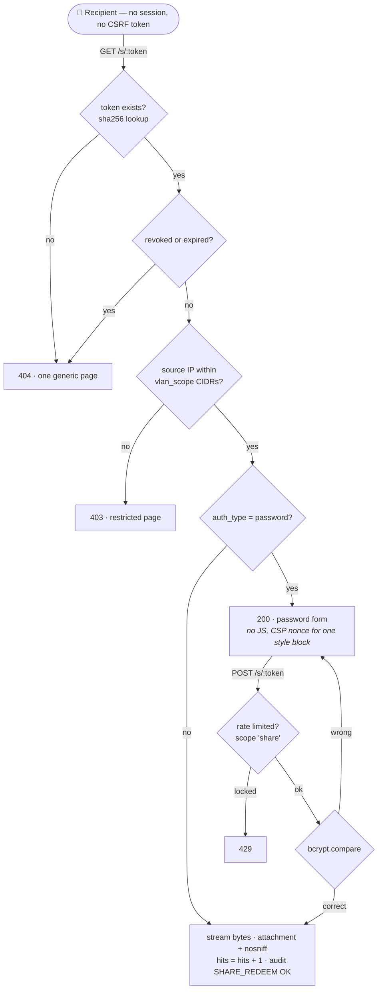
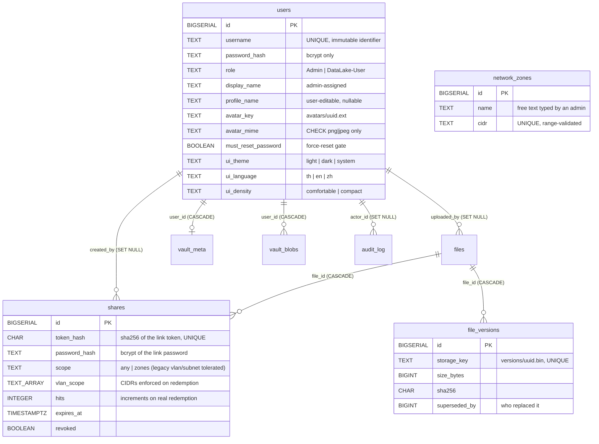

# 💾 IDEA1: AEGIS Drive LC (Secure NAS & Data Lake)

> [!info] Ownership
> Owner: **Kla**. This is the canonical IDEA1 status fragment. Other contributors request changes through their task receipt instead of editing it concurrently.

> **Codebase Status**: ✅ Built & Implemented (Backend Express `:8001` + Frontend React/Vite `:5174` + Database `aegis_drive` + Dual Theme Light/Dark)
> **Test Status**: **132/132 pass against isolated PostgreSQL**, 0 fail, 0 skip (2026-08-07). PostgreSQL-only coverage must continue to use an isolated `aegis_drive_test`; the suite performs destructive writes and has no suite-wide rollback.
> **Latest change verification**: **213 discovered · 194 pass · 0 fail · 19 PostgreSQL-only skip** in the in-memory development mode, plus a successful production Vite build (2026-08-23). This does not replace the isolated-PostgreSQL release result above or constitute production acceptance.
> **Primary Source Files**: `server/app.js`, `server/db/connection.js`, `server/db/store.js`, `server/routes/api.js`, `server/routes/share.js`, `server/storage/fileStore.js`, `server/storage/avatarStore.js`, `src/lib/vaultCrypto.js`

### Repository-wide tactical surface pass (2026-07-28)

`IDEA1-AEGIS_Drive_LC/src/index.css` carries the shared visual interaction contract used across the AEGIS frontends: light/dark solid-surface tokens, neutral card elevation, focus-visible rings, restrained active press feedback, and responsive content bounds. The Drive dashboard remains the hierarchy reference for the sibling applications.

### UI foundation revision (2026-08-20)

* Appearance preferences are per-user database state (`users.ui_theme`, `ui_language`, `ui_density`) returned at login and `/api/me`, updated through `PATCH /api/preferences`, and mirrored into the active server session. New accounts default to Light / Thai / Comfortable. PostgreSQL remains authoritative; browser storage contains only the non-sensitive `aegis_shell_theme` presentation hint (`light`/`dark`/`system`) used before authentication and across logout. Existing databases use the idempotent `server/db/migrations/002_user_preferences.sql` migration before the revised server starts.
* The profile menu now exposes Profile, Settings, and Sign out; the unwired notification bell is absent. Global search explains the active page scope, and Dashboard provides Upload / Share / Private Vault quick actions.
* Protected screens are route-level lazy chunks. The production main JavaScript bundle reduced from approximately 970 kB to 471 kB before gzip and no longer triggers Vite's 500 kB chunk warning.
* The module-local visual contract is recorded in `IDEA1-AEGIS_Drive_LC/DESIGN.md` and `.impeccable/design.json`. Decorative glow, glass, gradient text/CTA, and particle layers were removed from the revised shell in favor of the canonical Precision Light direction.
* G-A trusted-proxy hardening is implemented locally in Batch B2: Express now requires explicit CIDR configuration in production, tracked nginx overwrites inbound forwarding attribution, and the tracked deployment contract defines a dedicated HUB→Drive proxy network. This is not deployed and does not recover endpoint IP lost before nginx; Network Scope remains open pending production B3/B4 acceptance.

### Upload completion and theme continuity follow-up (2026-08-22)

> [!success] Batch A production acceptance closed after PR #24
> **UPLOAD: VERIFIED IN PRODUCTION / REGRESSION PASS. THEME: VERIFIED IN PRODUCTION / RESOLVED.**
> PR #22 exposed the persisted-theme failure recorded below; merged PR #24 and
> the 2026-08-23 Batch A acceptance supersede that failure as the Current State.

| Production-discovered defect | Production status | Production acceptance after PR #22 |
| :--- | :--- | :--- |
| Successful upload gave no clear completion feedback | ✅ VERIFIED IN PRODUCTION | Upload succeeds; success popup is visible exactly once; uploaded file appears in Files |
| Floating upload queue stayed at 1 after completion | ✅ VERIFIED IN PRODUCTION | Floating active-queue badge disappears after completion |
| Theme transition was one-way (Dark Login → Light App) | ✅ **VERIFIED IN PRODUCTION / RESOLVED** | After PR #24, both Dark and Light authentication transitions passed production acceptance. |

* Successful normal-file uploads now produce one localized TH/EN/ZH completion notification per file, including its filename. A request-id and completion-id guard prevents route rerenders or React effect replay from duplicating queue items or success notifications.
* The floating queue indicator now derives from active `waiting`/`processing`/`uploading` work. Completed and cancelled items may remain visible as history but do not count as active; terminal failures use a separate attention-required launcher state. When no active or failed work remains the launcher is hidden.
* Login and the authenticated shell share one theme resolver, and continuity is bidirectional. A fresh client without a hint starts Light. Crossing the authentication boundary follows one precedence rule: an explicit Login-screen choice made during the current unauthenticated session > same-account one-shot logout continuity > the authenticated PostgreSQL account preference > the persisted shell hint > Light. The one-shot handoff is keyed to the authenticated user ID and kept only in React memory; browser storage still contains no identity, role, token, password, session, or authorization state. Theme application remains synchronous before the authenticated shell mounts.
* The theme is applied through an external early bootstrap module before the React entry, preserving the existing CSP without adding an unsafe inline-script exception. Existing theme-aware logo and Welcome background assets remain unchanged.
* **Known UX limitation.** The unauthenticated Login screen still offers a Light/Dark toggle only. `system` remains a fully supported account preference: it is chosen in Settings, persists in `users.ui_theme`, reaches the Login screen through the shell hint, and survives the login transition — but it cannot be newly selected while unauthenticated. Turning the gate control into a three-way selector was deliberately left out of this follow-up.

#### Batch A production acceptance after PR #24 (2026-08-23)

| Acceptance ID | Production result |
| :--- | :--- |
| A1 — Theme Dark | ✅ PASS |
| A2 — Theme Light | ✅ PASS |
| A3 — Password Share | ✅ PASS; duplicated `/s/s/` path = **NO** |
| A4 — Wrong password denied | ✅ PASS |
| A5 — No-password Share | ✅ PASS |
| A6 — Upload regression | ✅ PASS; popup exactly once = **YES**; queue idle = **YES** |
| A7 — Share Copy | ✅ PASS |

> [!success] Current production state
> **THEME = VERIFIED IN PRODUCTION / RESOLVED. PASSWORD SHARE = VERIFIED IN
> PRODUCTION / RESOLVED. SHARE COPY = VERIFIED IN PRODUCTION. UPLOAD = VERIFIED
> IN PRODUCTION / REGRESSION PASS.** Network Scope and Public Share retain their
> separate states below.

#### Historical production acceptance after PR #22 deployment (2026-08-22)

**Upload — VERIFIED IN PRODUCTION**

| Production check | Result |
| :--- | :--- |
| Upload success | ✅ PASS |
| Success popup visible | ✅ PASS |
| Success popup appears exactly once | ✅ PASS |
| Floating active-queue badge disappears after completion | ✅ PASS |
| Uploaded file visible in Files | ✅ PASS |

**Theme — historical failure, superseded by PR #24 acceptance**

| Flow | Result |
| :--- | :--- |
| Expected | Dashboard Dark → Logout → Login Dark → Login → Dashboard Dark |
| Observed | Dashboard Dark → Logout → Login Dark → Login → **Dashboard Light** |

> [!note] Historical evidence only
> This PR #22 failure remains recorded for traceability. PR #24 Batch A production
> acceptance passed A1 Dark and A2 Light, so it no longer defines Current State.

#### Theme continuity — local and historical evidence

Manual acceptance of the *first* theme-continuity fix confirmed two directions and
one failure. That failure was part of **this same open item**, not a new one, and
the follow-up fix made all three transitions pass locally. Production acceptance
after PR #22 nevertheless failed the no-new-toggle Dark transition above. PR #24
then passed both A1 Dark and A2 Light in production, closing the current Theme item.

| Transition | Expected | First fix | After follow-up fix (local) |
| :--- | :--- | :--- | :--- |
| Light Login → sign in → Dashboard | Light | ✅ PASS | ✅ PASS |
| Dark App → sign out → Login | Dark | ✅ PASS | ✅ PASS |
| Dark Login → sign in → Dashboard | Dark | ❌ FAIL — rendered Light | ✅ PASS |

Confirmed locally in the same pass:

| Behaviour | Local result |
| :--- | :--- |
| Fresh browser, no stored shell hint | ✅ Light |
| Explicit Login-screen theme synchronized into `users.ui_theme` after authentication | ✅ PASS |
| Visible theme flash during the login transition | ✅ None observed |

> [!success] Production closure overrides the historical failure
> PR #24 is merged and Batch A acceptance passed A1 Dark and A2 Light. Theme is
> therefore **VERIFIED IN PRODUCTION / RESOLVED**. Keep the older PR #22 result as
> regression history, not as Current State.

* **Confirmed Batch A root cause.** The authentication resolver had no same-account
  logout handoff. After logout it retained only the unkeyed shell presentation hint;
  on the next successful authentication a stale `users.ui_theme` could therefore
  win even though the same user had just left a Dark authenticated shell.
* **Fix (local).** `App.jsx` captures `{ userId, theme }` in an in-memory ref at
  logout and consumes it exactly once on the next authentication. It is supplied to
  `resolveAuthenticatedTheme()` only when the returned authenticated user ID matches.
  The resulting precedence is explicit Login selection > same-account one-shot
  continuity > account preference > shell hint > fresh-browser Light. A different
  account receives its own preference, and hard refresh continues to use the
  authenticated account preference. DOM theme application remains synchronous.
* **Production closure.** Merged PR #24 was accepted in production for both Dark
  and Light authentication transitions (A1/A2). The former no-new-toggle failure
  is retained only as regression history and is no longer an open Current State.
* **Evidence.** `IDEA1-AEGIS_Drive_LC/tests/themeAuthTransition.test.js` drives the
  real `App` and `Login` components and reads theme state from `<html>`, including
  Dark and Light same-account logout round trips, explicit-selection precedence,
  different-account isolation, fresh Light, hard refresh, and a mutation-observed
  no-flash assertion. Batch A focused result: `node --test --test-concurrency=1
  tests/themeAuthTransition.test.js tests/themeContinuity.test.js` — **29 pass,
  0 fail, 0 skip**.

### Secure Share production findings (2026-08-23)

> [!warning] Batch A closed; network/public boundaries remain
> **PASSWORD SHARE: VERIFIED IN PRODUCTION / RESOLVED. SHARE COPY: VERIFIED IN
> PRODUCTION. NETWORK-SCOPED SHARE: OPEN / BLOCKED FOR VALID ACCEPTANCE. PUBLIC
> EXTERNAL SHARE: NOT IMPLEMENTED.**

| Share capability | Current production state | Evidence and boundary |
| :--- | :--- | :--- |
| Password-protected share | ✅ **VERIFIED IN PRODUCTION / RESOLVED** | A3 PASS; duplicated `/drive/s/s/:token` = **NO**. A4 confirmed a wrong password is denied, and A5 confirmed no-password sharing still passes. The earlier relative-action defect is historical and superseded by PR #24 acceptance. |
| Share Copy | ✅ **VERIFIED IN PRODUCTION** | A7 Share Copy = PASS; production displays the AEGIS-reachable scope semantics introduced by Batch A. |
| Network-scoped share | ⛔ **OPEN / BLOCKED FOR VALID ACCEPTANCE** | Audit/application evidence currently records source IP `172.18.0.1`. This Docker bridge/proxy address is not valid evidence of the recipient CIDR and must not be accepted as successful CIDR enforcement. Correct and verify real-client-IP/trusted-proxy behavior, or document the Twingate limitation precisely, before claiming enforcement. |
| Public external share | ⚪ **NOT IMPLEMENTED** | `aegis.internal` remains private and Twingate-reachable only. The desired future mode is a separate share-only public gateway exposing only `GET /s/:token` and `POST /s/:token`; no such public gateway exists today. |

The current route implementation performs password, expiry, revoke, rate-limit,
Vault exclusion, and CIDR checks at the application layer. Batch A production
acceptance validates the password/no-password and copy paths, but it does not
validate Network Scope.

### Batch B2 trusted-proxy hardening — implemented locally, not deployed (2026-08-24)

> [!warning] Security boundary hardened locally; endpoint preservation still unresolved
> **B2 = IMPLEMENTED AND VERIFIED LOCALLY / NOT DEPLOYED. NETWORK SCOPE = OPEN /
> BLOCKED FOR VALID PRODUCTION ACCEPTANCE. PUBLIC SHARE = NOT IMPLEMENTED.**

Production evidence collected before this implementation establishes the actual
current path:

- HUB ingress at `192.168.10.10:80/443` is Docker-published; the production HUB
  is `172.18.0.5` on `aegis_internal`.
- Drive is `172.18.0.3` on `aegis_internal`, retains Macvlan
  `192.168.10.11`, and port `8001` is not host-published.
- The current production HUB upstream is `drive:8001`.
- A Twingate/Windows request is already observed by HUB as `172.18.0.1`.
  Therefore endpoint identity is lost before nginx on this published-port path;
  neither an Express nor nginx header change can reconstruct it, and
  `172.18.0.1` must not be treated as the recipient CIDR.

Batch B2 replaces hop-count trust with `TRUSTED_PROXY_CIDRS`, parsed by the
standard `proxy-addr` CIDR compiler. Production fails closed when the setting is
missing, malformed, contains multiple values, or differs from the explicitly
approved HUB identity `172.19.255.2/32`; development/test defaults to no trusted
proxy. The tracked deployment network remains `aegis_drive_proxy`
(`172.19.255.0/29`, gateway `.1`, HUB `.2`, Drive `.3`) for HUB→Drive traffic,
but Express trusts only HUB `.2`, not the full `/29`. PostgreSQL, Monitor, and
Camera do not join that network; Drive retains `aegis_internal` for PostgreSQL.
Tracked Drive nginx locations overwrite `X-Forwarded-For` and `X-Real-IP` with
`$remote_addr`, preserve explicit proto/host, and remove inbound `Forwarded`.

Audit, restricted-share CIDR decisions, login/share rate limiting, and session
metadata all consume one Express-derived request source. Direct callers cannot
make arbitrary `X-Forwarded-For` authoritative. Restricted shares still compare
only the source identity visible to AEGIS: direct VLAN CIDR is meaningful only
when ingress preserves it, Twingate recipients may appear as connector-visible
infrastructure identity, and application CIDR remains defense in depth rather
than a substitute for Twingate/device/firewall policy.

No production Docker network, environment, container, nginx process, Macvlan,
Twingate setting, UFW rule, or database schema was changed. B3/B4 must deploy the
reviewed boundary and run production allow/deny/spoof attribution acceptance
before Network Scope can change state. Public Share remains not implemented.

## 🧩 Current functional design baseline (2026-08-21)

> [!info] Scope of this section
> This is the current **application design and information architecture** for
> AEGIS Drive_LC. It records intended screen/function placement after the latest
> frontend revision. It is **not** a production-validation result, does not
> change any PASS/FAIL statement below, and does not assert that a UI capability
> has a completed backend, host collector, or deployed data source.

### Primary screen map — 9 screens

| Group | Primary screen | Intended responsibility |
| :--- | :--- | :--- |
| Workspace | Dashboard | AEGIS Drive operational overview and common workflow entry |
| Workspace | Files | File/folder exploration and normal Data Lake upload workflow |
| Workspace | Private Vault | Dedicated encrypted-file workspace and Vault lifecycle |
| Protection | Secure Shares | Secure-share creation, policy, lifecycle, tracking and revoke |
| Protection | File History / Versions | Per-file version history, historical access and restore workflow |
| Protection | Storage & Backup | Storage/backup-oriented status and configuration surface |
| Administration | Audit Log | Event, actor, IP and resource investigation surface |
| Administration | Access Control | User and access-administration surface |
| Administration | Settings | Application preferences and administrative configuration groups |

### Information-architecture decisions

- **Files + Upload consolidated:** Upload is no longer a standalone primary navigation screen. It is an action/workflow within **Files**, alongside file/folder exploration, contextual file/folder search, sort/filter, grid/list choice, folder navigation, folder creation, drag-and-drop, upload queue/status, and recent-upload context where useful. The capability was moved, not removed.
- **Legacy route compatibility:** current frontend navigation normalizes `/upload` and `/uploads` to the Files upload workflow (`Files` with upload open). This is a compatibility detail, not a tenth screen.
- **Private Vault remains independent:** it is not a subsection inside Files. Its intended lifecycle is setup, unlock, lock, recovery, Vault-specific upload, and Vault file access. This section does not add a new cryptographic or production-verification claim.
- **File History / Versions replaces the old snapshot-oriented concept:** it represents file-level version/recovery behavior. It must not be described as a filesystem-level snapshot facility merely because an older design used that term.
- **Secure Shares remains separate:** Files may launch a share action, but share selection, expiration, password/policy options, access tracking, revoke, and share history/status remain part of the Secure Shares workspace.

### Dashboard functional model

Dashboard is designed as the **AEGIS Drive operational overview**. Its current functional groups are:

- overview/summary: storage usage, total files, active shares, and denied or blocked event context (role terminology may vary);
- Data Lake operational status: Application Layer, Metadata Layer, and Storage Layer — separate from host telemetry;
- activity/context: login history, active shares, storage composition, activity, and recent-file context where the applicable source is available;
- Quick Actions: **Upload File**, **Create Secure Share**, and **Open Private Vault**, which provide fast entry into the three common workflows; and
- Server Telemetry: a separate UI contract for CPU, RAM, disk, network, Twingate, and host/application uptime categories. It is structured for real measurable sources when those sources are available.

Server Telemetry is part of the current Dashboard design, **not** a claim that a host collector, CPU temperature, Twingate RTT, or network telemetry has been production-verified. Unavailable telemetry must render an explicit unavailable/not-connected state rather than fabricated values or misleading zeroes.

### Data-honesty and empty-state behavior

The current UI design distinguishes a usable but empty data source from a failed or unavailable dependency:

| State | Meaning |
| :--- | :--- |
| Empty data | The source is available but has no rows/items, for example “No files yet.” |
| Dependency/service unavailable | The application cannot retrieve the required source, for example metadata, SMART/RAID, Twingate live telemetry, or a host metric is unavailable. |

This is a product/design rule. It does not turn either presentation state into a production test result.

### Context-aware search and settings model

Search is contextual rather than one identical control everywhere:

| Context | Intended search scope |
| :--- | :--- |
| Dashboard | Global/application navigation and permitted file/user context |
| Files | Local file/folder search in the Files workspace |
| Private Vault | Explicitly unavailable when the encrypted Vault content cannot be safely indexed |
| Secure Shares | Share/file context |
| File History / Versions | File/version context |
| Audit Log | Event/user/IP/resource context |
| Access Control | User context |

Storage & Backup and Settings remain configuration-oriented surfaces; they do not imply a large generic content-search workflow. Settings is one primary screen with five conceptual groups: **Appearance**, **Account**, **Security & Privacy**, **Storage & Data**, and **Administrator**. The application design also supports Light/Dark themes, TH/EN/ZH localization, and theme-aware branding; visual polish details such as glow, animation, or exact asset placement are not part of this functional baseline.

### Current functional relationship model

```text
Authentication → RBAC → Files
                         ├─ Upload
                         ├─ File management
                         ├─ File History / Versions
                         ├─ Secure Share workflow
                         └─ Private Vault workflow where applicable

Files / metadata / storage / audit → Dashboard operational overview
System / infrastructure metrics → Dashboard Server Telemetry UI contract
```

---

## 🛡️ FT-1 security finding — File object-level authorization (2026-08-21)

> [!warning] Authorization patch deployed; acceptance NOT yet complete — do not mark this finding resolved
> The file-object authorization patch **is present in production**, and FT-1D observed owner-scoped **listing** isolation in both directions: Admin did not see the DataLake-User file, and DataLake-User did not see the Admin file.
>
> | Acceptance step | State |
> | :--- | :--- |
> | Patch deployed to production | ✅ DONE |
> | Cross-owner listing isolation (`GET /api/files`) | ✅ PASS observed in FT-1D |
> | Cross-owner **download** (`GET /api/files/:id/download`) acceptance | ⏳ PENDING |
> | Cross-owner **verify** (`POST /api/files/:id/verify`) acceptance | ⏳ PENDING |
> | Cross-owner **share creation** (`POST /api/shares`) acceptance | ⏳ PENDING |
>
> **This finding stays OPEN until the pending cross-owner download, verify, and share-creation acceptance is executed against production and recorded.** Keep the complete cross-owner regression suite in every future Drive redeployment. This production fact also does not mark the separate Theme UI finding above as resolved; Upload has been verified separately in production.

FT-1 (Authentication / Session / RBAC) confirmed that role RBAC itself works correctly (`DataLake-User` gets `403` on `GET /api/users` and is blocked from `/audit`/`/access`; `200` on `GET /api/files` as an authenticated Files-capable role), but **file object-level authorization was incomplete** — a Broken Object Level Authorization / IDOR-class defect distinct from role RBAC.

**Known affected operations, confirmed:**

| Operation | Before this fix | After this fix |
| :--- | :--- | :--- |
| Listing (`GET /api/files`) | Returned every user's files to any authenticated caller | `store.listFiles(userId)` filters by `uploaded_by` in SQL — own files only |
| Verify (`POST /api/files/:id/verify`) | No ownership check — any authenticated user could checksum another user's file by id | Ownership checked before any Storage Layer read; cross-owner → `404` |
| Download (`GET /api/files/:id/download`) | No ownership check — any authenticated user could download another user's file by id | Ownership checked before `resolveKey`/`keyExists`/`openReadStream`; cross-owner → `404` |
| Secure Share creation (`POST /api/shares`) | No ownership check on the supplied `fileId` — one user could mint a public, no-login redemption link for another user's file | `createShare` now requires `uploaded_by === req.user.id`; cross-owner → `400` |

**Already owner-protected — unaffected, preserved as-is:**
- `DELETE /api/files/:id` — already compared `ownerId` with no Admin exception (`403`, audited `DENIED`).
- File-version routes (`GET /file-versions`, `GET /files/:id/versions[/:vid/download]`, `POST /files/:id/versions/:vid/restore`) — already owner-only, `404` for non-owners, no Admin exception.
- `findOwnFileByName` (upload/new-version detection) — already scoped to the uploader; same-name files from different owners remain distinct.

**Deliberately left unchanged (out of scope for this patch):** `GET /api/shares` (listing) and `DELETE /api/shares/:id` (revoke) remain un-scoped by design intent already pinned by an existing regression test (`tests/shareRedemption.test.js`, "ผู้ใช้ที่ล็อกอินแล้วเพิกถอนลิงก์ของคนอื่นได้ … ต้องเป็นการตัดสินใจที่ตั้งใจ ไม่ใช่หลุดไปเงียบ ๆ") stating that an ownership gate on shares would need to be a deliberate, separate decision. This finding did not extend to that decision; flagged here for awareness, not fixed.

**No Admin override was added or exists.** Both roles are bound by the identical `ownerId` check (`rbac/permissions.js`: the two roles manage files "equally" — Admin's only addition is the governance screens, never elevated file-content access). Regression tests prove this in both directions (Admin → DataLake-User file denied, and DataLake-User → Admin file denied) for listing, download, verify, and share creation.

**Fix + verification:**
- Source: `IDEA1-AEGIS_Drive_LC/server/db/store.js` (`listFiles(userId)` now mandatory-scoped; `dashboard(userId)` threads the same scoping through so Dashboard's `recentFiles`/file totals stop leaking other users' filenames; `createShare` now checks `uploaded_by`), `IDEA1-AEGIS_Drive_LC/server/routes/api.js` (owner checks added to verify/download before any Storage Layer access; `GET /files`, `GET /file-versions`, `GET /dashboard` pass `req.user.id` through).
- New regression suite: `IDEA1-AEGIS_Drive_LC/tests/fileObjectAuthorization.test.js` — 8 tests covering listing, download, verify (both cross-owner directions each), audited-denial evidence, DELETE/version-route preservation, share-creation ownership (both directions), and the DataLake-User `/api/users` 403 / `/api/files` 200 RBAC boundary.
- Full IDEA1 suite (in-memory dev-fallback mode, no local Postgres available in this environment): **175 tests, 156 pass, 0 fail, 19 skipped** (all pre-existing Postgres-only skips) — no regressions. Production build (`npm run build`) succeeded; the regenerated `dist/index.html` build artifact was reverted since no frontend change was made.
- **Not run in this pass:** the Postgres-backed branch of these same tests (no local PostgreSQL available in this environment). The SQL change is a single added `AND f.uploaded_by = $1` / `uploaded_by` column read, following the exact parameterized pattern already used by `findOwnFileByName` elsewhere in the same file. Recommend running `TEST_DATABASE_URL`-backed tests against an isolated `aegis_drive_test` database before/with the production redeploy.

Full evidence: `90-Status/logs/2026-08-21_231500_kla_idea1-file-object-authorization-fix.md`.

**Next step:** run the outstanding cross-owner **download**, **verify**, and **share-creation** acceptance against production and record the result here; only then may this finding be marked resolved. Preserve FT-0, FT-1 role RBAC, and the complete file-owner isolation regression during the next Drive-only redeployment. The authorization patch is already deployed; this item is pending **acceptance**, not pending deployment. Theme remains a separate open production failure after PR #22, while Upload is verified in production.

---

## 🧭 What is real, and what this deployment cannot do

This module went through a pass (2026-07-27) whose whole purpose was removing data that *looked* measured but was written into the source. The table below is the honest state. **When code changes, this table changes in the same commit.**

| Area | State | Source of truth |
| :--- | :--- | :--- |
| Files (list/upload/download/delete) | ✅ Real | `files` table + bytes on `/datalake` |
| Private Vault (zero-knowledge) | ✅ Real | `vault_meta` / `vault_blobs` + `.aegisenc` on disk |
| Audit log | ✅ Real | `audit_log` table |
| Users / Access screen | ✅ Real | `users` table (see below) |
| Profile name + avatar | ✅ Real | `users.profile_name` / `avatar_key` / `avatar_mime` |
| Active sessions + remote revoke | ✅ Real | express-session store (**MemoryStore — lost on restart**) |
| Secure share links (redeem/password/hits/scope) | ✅ Real | `shares` table + `GET/POST /s/:token` |
| File history (earlier versions + restore) | ✅ Real | `file_versions` table + bytes under `versions/` |
| Storage capacity | ✅ Real | `fs.statfs` on the Data Lake mount |
| Dashboard activity (7 days) | ✅ Real | counted from `audit_log` |
| Network zones | 🟠 Real CIDR input for restricted shares; source-identity limit remains | `network_zones` snapshot into `shares.vlan_scope` + `req.ip` check |
| Encryption at rest for Data Lake uploads | 🔴 **Not implemented** — files are plaintext on disk | — |
| Disk health / SMART, RAID | 🔴 **Not measurable here** (needs host access) | declared via `storageStatus().unavailable` |
| Off-site backup jobs | 🔴 **None configured anywhere** | declared via `storageStatus().unavailable` |

### Features removed for claiming things that did not exist
* **Snapshots + rollback** — eight hardcoded rows; rollback set a `destroyed` flag and restored **zero bytes** while the UI reported "restored" plus GB lost. Replaced by real [[#🕓 File history (replaces Snapshots)]].
* **Encryption keys + "rotate now"** — reported an `AES-256-GCM` master key with an ID and rotation date. No such key exists: Data Lake files are plaintext, Vault keys are derived in the browser. `/api/keys*` now **404s**, pinned by a test.
* **Fabricated disks & backup jobs** — two `WD Red Pro 4TB` with serials/temperatures/`SMART PASSED` and three running backup jobs. None was read from anything.
* **`ScopeDiagram`** — animated VLAN/Guest/Internet bands with requests dissolving against a "FIREWALL" boundary, describing enforcement the app did not perform.
* **`otc` (one-time code) share option** — accepted by the server, but no code was ever generated or checked, so a link the user believed was code-protected opened for anyone holding it.

> ⚠️ These are the same class of defect as the removed 12-word vault recovery phrase (see [[concepts/Mnemonic_Recovery_and_Zero_Knowledge]]): the danger is not a wrong number on screen, it is an operator who stops checking the disks because it said `PASSED`, or who never sets up backups because it said `Nightly incremental · ok`.

---

## 🖥️ Infrastructure capability — measured, not assumed (2026-07-27)

Probed from a container mounting the real `drive_storage` volume under the same privileges as the `drive` service:

```
/datalake            ext4 on /dev/sde       1.05 TB total, 976 GB available
lvcreate / lvs / vgs absent
zfs / btrfs          absent
/dev/mapper          not present
raw block devices    none exposed
smartctl / mdadm     absent
/proc/mdstat         unavailable
CapEff               0x00000000a80425fb   (Docker default)
```

* **Point-in-time snapshots are impossible here.** `/datalake` is plain **ext4** — not LVM (no `/dev/mapper` at all), not ZFS, not Btrfs. Nothing to snapshot, and no tooling to do it with.
* **SMART / RAID telemetry is unreachable.** Binaries absent, no raw device exposed, `/proc/mdstat` missing. In that capability mask **`CAP_SYS_RAWIO` (bit 17) and `CAP_SYS_ADMIN` (bit 21) are both clear** — even with the binaries installed they could not talk to a device. Real telemetry is a **host-level infrastructure change**, not a coding task.
* **`fs.statfs` needs no privilege and works** — the one genuinely available storage number, and what the capacity UI now uses.

---

## 🔐 Storage Layer — how bytes are actually laid out

`server/storage/fileStore.js` operates on the Docker named volume `drive_storage` mounted at `/datalake`, **mounted to the `drive` container only** (`monitor` and `gateway` cannot reach it at the filesystem level).

```
/datalake/uploads/<uuid>.bin      current file bytes
/datalake/versions/<uuid>.bin     superseded bytes (file history)
/datalake/vault/<uuid>.aegisenc   client-encrypted ciphertext (zero-knowledge)
/datalake/avatars/<uuid>.png|jpg  profile pictures (EXIF stripped)
```

> ⚠️ **Correction (2026-07-27)**: this note previously stated that files are stored under content-based sharded SHA-256 paths such as `/datalake/files/ab/cd/abcd1234…`. **That was never true of the code.** `fileStore.js` writes a bare `randomUUID()` plus `.bin` under `uploads/`. The security property claimed was real, but the mechanism described was not — the opaque name is a random UUID, not a content hash, and there is no sharded directory tree.

Why an opaque random name: (1) someone with only disk access cannot tell which file is which, and (2) a user-supplied name can never become a path, which removes path traversal at the source rather than relying on sanitising. Real names live in `files.name`. `resolveKey()` is a second gate that refuses any key resolving outside `STORAGE_ROOT`.

Both `size_bytes` and `sha256` are computed **server-side from the bytes on disk**. A client-supplied hash is only ever used to *compare* — a mismatch discards the upload rather than storing something known to be incomplete.

---

## 👤 Identity — three names, three jobs

| Field | Who sets it | Can collide? | Used for |
| :--- | :--- | :--- | :--- |
| `username` | Admin at provisioning, immutable | No (unique) | Login, `audit_log.actor_label` |
| `display_name` | Admin at provisioning | Yes | Access screen — confirming who an account belongs to |
| `profile_name` | **The user, freely** | **Yes, on purpose** | Display everywhere (uploader label, share creator, TopBar) |

`profile_name` wins for display via `COALESCE(NULLIF(btrim(profile_name),''), display_name)` at read time, so a rename is retroactive and nothing is copied into rows.

> ⚠️ Because a profile name **can be set to a colleague's name**, every screen showing it also shows the `username`, and the Access screen additionally shows the administrator-assigned name whenever the two differ. A test asserts a profile name can never be used to log in. Authorisation is always `users.id`; never a display name.

### Profile picture — the four guarantees (`server/storage/avatarStore.js`)
1. **Type from magic bytes only** — PNG (`89 50 4E 47…`) and JPEG (`FF D8 FF`). Extension and browser-supplied `Content-Type` are ignored. SVG is refused because it is a document that can run `<script>`, and served from our own origin that is XSS with read access to the CSRF token. *A test uploads an SVG payload named `.png` with `Content-Type: image/png` and requires 415 with nothing written to disk.*
2. **2 MiB limit** — enforced in `sanitizeAvatar()` as well as in multer, so it holds even if the middleware is bypassed.
3. **Randomised filename** — bare `randomUUID()` + a server-chosen extension.
4. **Metadata stripped *before* the write** — PNG keeps only an allowlist of decode-critical chunks (dropping `eXIf` / `tEXt` / `zTXt` / `iTXt`); JPEG drops every `APPn` and `COM` segment. *Tests plant real GPS coordinates and a camera serial in valid files, confirm they are present, then grep the bytes on disk.*

> ⚠️ **Accepted trade-off**: dropping `APP1` also removes EXIF `Orientation`, so a phone photo that rotates via metadata will display sideways. Fixing that means rotating pixels, which means a codec — not worth a native dependency on an 8 GB target. Privacy beats rotation here.

---

## 🔗 Secure share links — the full redemption path

`server/routes/share.js`, mounted in `app.js` **before** `express.static` and the `'*'` SPA fallback (otherwise the fallback swallows `/s/…` and returns `index.html`).



* **`token_hash CHAR(64)`, not the raw token.** A token is a bearer credential — whoever holds it downloads the file without logging in — so a leaked backup or an over-broad `SELECT` would otherwise hand over working links to every active share. **Consequence accepted:** the server cannot show a link twice, so the URL appears once at creation (like a new account's temporary password) and a lost link means revoke and reissue.
* **`password_hash` is now genuinely used** — bcrypt cost 12, compared on redemption. *A test reads the column directly and asserts it holds a bcrypt hash with no trace of the plaintext.*
* **`hits` increments only on a completed redemption** — not on viewing the form, not on a wrong password. *Tested both ways.*
* **Every failure returns the same page.** Distinguishing "no such token" from "expired" would let anyone confirm which tokens once existed. `audit_log` keeps the reasons apart, because what the operator must see and what the recipient should learn are different questions.

### Network scope — what is enforced, and what is not
`vlan_scope` CIDRs are **snapshotted from `network_zones` at creation time** (reading them live would silently widen every previously issued link whenever an admin added a zone). On redemption `ipAllowed(req.ip, cidrs)` refuses anything outside the set.

> ⚠️ **This is an application-level source-address check** — real, tested, and it fails closed (an unparseable CIDR or a non-mapped IPv6 address does not pass). It is **not** the same as VLAN isolation at the firewall or switch, which stops the request from arriving at all. `req.ip` is trustworthy only as far as the reverse proxy sets `X-Forwarded-For`. The UI states this limit in plain language instead of drawing a firewall. See [[concepts/VLAN_Segmentation_and_Port_Mapping]].
>
> Selecting "approved networks" while **no** zone is defined is **refused**, rather than producing a link labelled restricted whose empty list restricts nothing.

---

## 🕓 File history (replaces Snapshots)

Screen `src/screens/FileHistory.jsx`, nav id `versions` (was `snapshots`).

Uploading a file under **a name you already own** keeps the bytes it replaces:

```
upload over own name  →  current bytes renamed into versions/<uuid>.bin
                      →  row in file_versions (size, sha256, superseded_by)
                      →  files row points at the new bytes
restore a version     →  current bytes become a version first (non-destructive)
                      →  the chosen version's bytes become current
```

* **Restore returns real bytes** — the tests download the content and compare it, not a status field.
* **Nothing is destroyed**, which is why the confirm step does not demand you type an id. Forcing typed confirmation for a reversible action only trains people to click through it.
* **Rename, not copy** — same volume, so it is a metadata operation; copying gigabytes on an edge HDD would cost time and double the space. *A test asserts the file count under `versions/` does not grow across a restore.*
* **Same-name upload only versions your *own* file.** Matching on name alone would let anyone overwrite someone else's file by naming theirs to match — write access to another user's data with no ownership check.
* **Owner-only for read, download and restore, with no Admin exception** (matching `DELETE /api/files/:id`). Past versions *are* the file's contents: reading them is reading their file; restoring them is writing to it.
* **Deleting a file removes every version's bytes.** `ON DELETE CASCADE` takes the rows, but the bytes would otherwise sit unreferenced and unreachable — content the user believes is gone.

> ⚠️ **Scope, stated on the screen itself**: this is per-file history, **not** a point-in-time image of the Data Lake. Deleted files keep no history, and versions live on the same disk as the data, so they do not survive a drive failure. That is what off-site backup is for, and none is configured.

---

## 🗄️ Schema (`server/db/schema.sql`)



`vault_meta` / `vault_blobs` are unchanged — by construction they have **nowhere to put plaintext**: no `name`, no `mime`, no key column. See [[concepts/Three_Layer_Data_Lake]].

---

## 🚪 Force Password Reset — now covers the seeded demo accounts

1. **Day-0 Admin bootstrap** — `server/db/bootstrapAdmin.js` requires a pre-computed bcrypt hash in `ADMIN_BOOTSTRAP_PASSWORD_HASH` and **refuses to boot** if it looks like a raw password. Hash it with `scripts/hash_password.py` (`getpass`, no echo, no shell history).
2. **Admin provisioning** — `POST /api/users` generates the temporary password server-side and returns it **once**; it is never logged or stored anywhere else.
3. **Seeded demo accounts** — `seed.sql` now inserts `admin` and `user` with `must_reset_password = TRUE`, matching IDEA2's operator onboarding. Both bcrypt hashes are in public git, so the matching passwords are permanent public knowledge; the gate makes them **usable exactly once, to set a new password**.
4. **Remediation for existing databases** — `ON CONFLICT DO NOTHING` would leave an already-initialised database untouched, so `seed.sql` follows with an `UPDATE` scoped to rows whose hash is still one of the two committed ones. Idempotent (verified `UPDATE 2` then `UPDATE 0`), and it never re-gates an account that already rotated.
5. **The gate itself** — `requireRole.js` blocks every path except `/me`, `/logout`, `/password/reset` with `403 PASSWORD_RESET_REQUIRED`. `apiFetch()` preserves this as `errorKind: 'password-reset-required'`; `App.jsx` reads `user.mustResetPassword`, pauses Dashboard/health/files/users hooks with `null` paths, and renders only `MandatoryPasswordReset.jsx` until the existing reset endpoint succeeds.
6. **Unlock without reload** — the reset surface holds current/new/confirm fields only in React memory. A successful server response flips the in-memory session copy to `mustResetPassword:false`; the normal shell mounts and protected hooks start naturally. Wrong-current and weak-password responses remain distinct, and a wrong current password cannot trigger the global 401/logout interceptor.

> ⚠️ **Operational consequence**: the credentials documented in `seed.sql` are **single-use per database**. Running the test suite against a database also rotates them (see `tests/helpers/testClient.mjs`). `docker compose down -v` restores a clean state. Worth knowing before a demo.

### Live investigation: Files/Storage “failure” is the unhandled reset gate (2026-08-07)

The apparent `/api/storage` and `/api/files` backend failure on the live Docker stack was reproduced and traced without changing code or data. It is **not a PostgreSQL query error, timeout, pool exhaustion, or empty-table edge case**:

* Gateway access logs show `POST /drive/api/login` → `200` at 20:31, then at 20:35 `GET /drive/api/me` and `/drive/healthz` succeeded while `/drive/api/dashboard`, `/drive/api/files`, `/drive/api/storage`, and `/drive/api/users` all returned `403` with a 35-byte body. That body size matches `{"error":"PASSWORD_RESET_REQUIRED"}`. The same `403` pattern repeats on each poll through the captured log window; no `500` appears.
* Drive logs contain no `unhandled error` stack trace and PostgreSQL logs contain no query/connection error in that period because this is an intentional authorization response emitted before the route handlers run.
* The live `users` rows confirm `admin` and `user` both have `must_reset_password = TRUE`.
* Read-only calls inside the running Drive container executed `listFiles()` and `storageStatus()` three times each: all six calls succeeded. Files correctly returned zero rows; Storage returned real `statfs` capacity and zero for every application category. Empty `files`, `vault_blobs`, `vault_meta`, and `shares` tables therefore are not the trigger.

The reproducible bug was the **client integration around a correct server-side gate**: `Login.jsx` accepted the successful login response and the old `App.jsx` immediately mounted the authenticated shell and data hooks, while `apiFetch()` flattened the explicit reset code into generic `forbidden`.

**Closed 2026-08-07**: the client now classifies `PASSWORD_RESET_REQUIRED`, renders a full-screen password-reset gate before creating any protected screen, and starts zero protected reads while the flag is true. It calls the existing `/api/password/reset`, updates only the in-memory session flag on success, then mounts the normal shell without a page reload. The backend middleware and empty/error-state helpers were not changed.

---

## 📊 Dashboard & Storage — real aggregates only

* **Activity (7 days)** — counted from `audit_log` (successful events only), with `generate_series` filling empty days as zero; a chart that omits empty days silently distorts its own axis.
  > ⚠️ **The unit is event counts, not GB, and that is a real limit.** `audit_log` deliberately stores no per-event byte size, so events are countable but volume is not. Estimating it from current file sizes would be wrong the moment a file is replaced or deleted. A volume chart requires adding a size column to the audit log first — a **privacy decision**, not merely a technical one.
* **Capacity** — `fs.statfs` on the Data Lake mount. The former `342 GB` baseline and `1024 GB` total are gone; the `342` was the more insidious of the two because a fabricated figure with a real term added moves slightly and therefore *looks* measured. `null` means unreadable, never zero.
  > ⚠️ `statfs` reports the whole filesystem, not a per-directory quota. Space the app did not write is shown as a separate "other on this volume" band rather than folded into a category.
* **Usage by kind** — `SUM(size_bytes)` over `files`, `vault_blobs` and `file_versions`. Dashboard and Storage read the same source, and a test asserts the two screens report the same total.

### Dashboard empty-state contract (2026-08-07)

The authenticated Dashboard now keeps its complete visual structure when durable data is not connected: KPI cards, Data Lake health, login history, active shares, storage breakdown, seven-day activity chart and recent files all remain mounted. `src/lib/dashboardState.js` supplies a stable zero/empty payload contract (`storageBytes: 0`, `storageTotalBytes: 0`, numeric counters `0`, arrays `[]`) so a later real payload can replace values without changing layout.

* The seeded **in-memory development fallback is not treated as NAS telemetry** on the Dashboard. Its sample rows are normalized to the zero/empty placeholder state; a PostgreSQL-backed health response continues to unlock real Dashboard values.
* Widget-level empty states are quiet inline lines, not large warning screens. Storage keeps a visible 0% track; the activity chart keeps seven zero-value day slots; login history, shares and recent files retain their card chrome.
* A disconnected/not-yet-wired platform does not trigger the former page-level `if (dash.error) return <ErrorState>` branch. If `/healthz` confirms the platform is online **and backed by a durable store** (`db !== 'memory'`) but the Dashboard endpoint itself fails, a contained retry/error card may appear **without removing the rest of the Dashboard**.
* TopBar pills are sourced from `/healthz`: gray “Not connected” when unavailable, green/blue only when health is confirmed. Vite now proxies `/drive/healthz` in development, preventing a false offline status while the local backend is actually running; `in-memory` is named honestly instead of being labelled PostgreSQL.
* Sidebar storage now reads the same byte metrics (`storageBytes` / `storageTotalBytes`) and no longer falls back to the fabricated `1024 GB` total.

This UI placeholder does not redefine a server-provided explicit `null`: when PostgreSQL is connected and `statfs` returns `null`, capacity remains “unavailable,” not zero. The zero values above describe only the not-yet-wired/in-memory presentation state.

### All authenticated screens: stable empty-state contract (2026-08-07)

The Dashboard contract now extends to every other authenticated sidebar screen without changing Dashboard itself. `App.jsx` derives a shared `placeholderMode` from `/healthz`; an unavailable health result or the seeded `in-memory` development store keeps API fixture rows out of the presentation, while a PostgreSQL connection continues to render real API payloads in the same containers. Every screen retains its breadcrumb, title, cards, toolbars, table headers and create/upload actions.

* **Files** keeps view/sort/new-folder/upload controls and the root breadcrumb, then renders a muted empty folder message with a first-folder action.
* **Private Vault** keeps the Zero-Knowledge/AES-256 explanation and setup state; its file container remains visible with an encrypt-first-file action. This does not weaken or simulate the real browser-side encryption flow.
* **Uploads, Secure Shares and Audit** keep their drop zone, filters and table/list chrome. Empty collections become a single muted inline row rather than a page-level error.
* **File History** remains the real per-file `file_versions` feature. With no file selected it renders an empty dotted history track and a disabled restore action. It deliberately does **not** claim filesystem snapshots or point-in-time rollback, which the current ext4 volume cannot provide.
* **Storage & Backup** keeps its 0 GB category chart and backup table headers. RAID/SMART is neutral “not connected,” never fake Healthy; no backup schedule is invented.
* **Access Control** keeps only the authenticated account in development placeholder mode, reports the current browser session as `1 · this device`, and offers an inline add-user action for the absent additional accounts. PostgreSQL-backed account rows remain authoritative.
* **Settings** remains fully form-based. Remote Access is Twingate-only and defaults to Inactive because connector telemetry is not wired. The mnemonic recovery card remains visible but Generate is disabled: the current Vault has no real recovery-key integration, so generating unusable words would be a false security claim.

Shared `InlineEmptyState` markup centralizes the compact neutral presentation. Runtime errors may still be shown locally when a real connected fetch fails; they no longer erase normal screen structure. Regression coverage is in `tests/allScreensEmptyState.test.js`.

### The error panel is gated on a *wired* platform, not merely a reachable one (2026-08-07, follow-up)

The pass above gated the **data** on `placeholderMode` but left the fetch-**error** panel ungated, so every screen rendered its correct zero/empty state *and* stacked the red `errLoadTitle` / `errLoadHint` box ("โหลดหน้านี้ไม่สำเร็จ / เซิร์ฟเวอร์ Drive ไม่ตอบสนอง" + Retry) on top of it — an app that looks broken while reporting `Edge node: online` in the same viewport.

> ⚠️ **The box was not a hardcoded leftover; the failure it reported was real.** With no PostgreSQL pool configured, `checkDb()` returns `{ ok: true, mode: 'memory' }`, so `/healthz` answers green and the pills stay online while the `/api/*` reads behind each screen fail. Both signals were accurate in isolation — the missing distinction was between **"the platform is up"** and **"the platform is wired to a durable store"**. Removing the component would have been the wrong fix; the condition it renders under was what needed narrowing.

* `src/lib/fetchState.js` is the shared source of truth: `isPlatformWired(healthData)` requires a successful health body backed by a non-memory database, while `visibleFetchError(error, placeholderMode)` suppresses an endpoint error only during that honest unwired state. Every non-Dashboard screen derives a local error through the latter and never renders directly from a raw `api.error`.
* Applied to **Files, Private Vault, Uploads, Secure Shares, File History** (both the file list and the version detail), **Storage & Backup, Audit, Access Control** and **Settings** (active sessions + network zones). Settings now receives `placeholderMode` from `App.jsx` for the same reason the other screens do.
* `shouldShowDashboardFetchError` delegates the same decision to `isPlatformWired`; Dashboard derives its placeholder labels from that health decision alone. A missing Dashboard payload caused by a genuine PostgreSQL-backed fetch failure therefore shows the contained retry/error card without also labelling every KPI “ยังไม่เชื่อมต่อ”.
* **Nothing else moved.** No empty state, card, banner, form, table, filter, drop zone or health pill was touched, and no placeholder was substituted for the removed box — the existing empty states simply occupy the space. On a PostgreSQL-backed deployment a genuinely failing fetch still shows `ErrorState` with a working `useApi.retry`.

`App.jsx` now owns the sole 15-second `/healthz` poll and passes that exact health object to Dashboard and TopBar; the remaining screens consume `placeholderMode` derived from the same cycle. Coverage in `tests/allScreensEmptyState.test.js`, `tests/dashboardEmptyState.test.js`, and `tests/uiNegativeCases.test.js` pins the helper contract, single-poll topology, Shares secondary fetch, and Dashboard conflict case. The in-memory verification for this UI pass was 101 pass + 18 PostgreSQL-only skips; the current full PostgreSQL baseline is 119/119 and is recorded in the test-coverage section below.

### Audit: does the error actually fire when it should? (2026-08-07)

The passes above only ever proved the *suppressing* direction — "no box while unwired." The direction whose failure is silent in production is the opposite one, and it was audited separately by rendering the **real screen components** in jsdom against a stubbed `fetch` (method and its limits: [[concepts/Client_Render_State_Verification]]).

| Case | Setup | Result |
|---|---|---|
| Negative (safety-critical) | `db=postgres` + every `/api/*` → 500 | ✅ **9/9** screens show `ErrorState` + working Retry |
| Regression control | `db=memory` + every `/api/*` → 500 | ✅ 0/9 show it |
| False-positive control | `db=postgres` + all endpoints OK | ✅ 0/9 show it |

**All nine screens still gate correctly on their primary endpoint, and no screen has a hardcoded, absent, or hand-rolled condition.** The follow-up implementation closes every finding from this audit:

| Follow-up probe | Verified result |
|---|---|
| Shares: `/api/shares` OK + `/api/files` 500 | The file-picker Field keeps its chrome and shows the existing load-failed notice + Retry; it no longer claims `ยังไม่มีไฟล์` |
| File History: list OK + version-detail 500 | Detail error + Retry remains visible |
| Dashboard: dashboard OK + storage 500 | Storage-card error + Retry remains visible |
| Dashboard: `db=postgres` + dashboard 500 | Error + Retry appears, with **no** simultaneous `ยังไม่เชื่อมต่อ` KPI labels |

`isPlatformWired` is now the single predicate behind both App placeholder mode and Dashboard error/placeholder decisions. `App.jsx` owns the only `/healthz` poll; Dashboard and TopBar consume its shared result. The complete jsdom rerun retained the original controls: genuine failure **9/9** with Retry, unwired failure **0/9**, all healthy **0/9** false positives. The focused negative cases are now reproducible in the repository test suite instead of existing only in a scratch harness.

### Live-status surface inventory (2026-08-07, analysis only)

The 15 supplied screenshots were reconciled against the current React hooks and server payloads. No application source was changed in this pass. The current refresh contract is:

| Surface | Source | Refresh behavior |
|---|---|---|
| TopBar Edge/Metadata pills | `/healthz` | 15 s poll owned by `App.jsx` |
| TopBar clock | browser clock | 1 s |
| Dashboard KPIs, login history, active-link sample, security count, activity chart, recent files | `/api/dashboard` | 30 s |
| Sidebar storage meter | the App-owned `/api/dashboard` payload | 30 s |
| Dashboard/Storage capacity breakdown | `/api/storage` | 60 s |
| Share rows/hits | `/api/shares` | 30 s; countdown text advances every 1 s |
| Upload queue stage | in-browser hashing/request state | event-driven; recent files poll 30 s |
| Audit ledger | `/api/audit` | 30 s |
| Files, File History, Access users, Settings sessions/zones, Vault metadata | their route payloads | load-on-mount/manual retry; relative labels may tick locally without refetching |

The P0, P1 and P2 findings from this audit are now closed. The underlying lack of ordinary Data Lake encryption at rest remains a separate architecture gap and is labelled as such; this remediation does not claim to implement it.

These findings are recorded as awaiting a product decision in [[summaries/08_Outstanding_Items_Consolidated]] and extend the evidence rules in [[concepts/Honest_Telemetry_and_Unavailable_States]].

### Data-honesty remediation — P0 trust claims (2026-08-07)

* **Ordinary Data Lake surfaces no longer claim encryption.** `Uploads.jsx` now states that regular files are stored in the Data Lake and encryption at rest is not configured. The Login defense-layer readout says the same thing instead of retaining a contradictory “Encryption at rest” claim. The recent-file badge is neutral, the ordinary-file shield/ciphertext animation was removed, and the table heading describes storage protection rather than implying encryption. Private Vault keeps its separate and accurate browser-side AES-256-GCM claim. This is an honesty fix, **not** an encryption-at-rest implementation.
* **Checksum verification is now a fresh storage read.** `POST /api/files/:id/verify` resolves the opaque metadata path inside `STORAGE_ROOT`, streams the current bytes through SHA-256, compares that value to the upload-time metadata hash, records `FILE_VERIFY` in audit, and only then returns match/mismatch. The Files drawer starts at “not verified yet” and never reuses `file.verified` as an on-demand result. Vault plaintext verification is explicitly unavailable server-side because the server has neither plaintext nor the user's key; AES-GCM authentication remains browser-side.
* **Dashboard Demo Override was deleted.** The Flask control, local override state and all demo translation keys are gone. Dashboard health can no longer be forced Healthy/Degraded/Down from the running UI; P2 below replaced the former shared health bit and fixed latency constants with measured per-layer evidence.
* **Verification:** targeted RED→GREEN coverage proves a disk tamper changes the result from `match:true` to `match:false`. Full Node 24 run against a fresh, isolated `aegis_drive_test` database: **125/125 pass, 0 fail, 0 skip**. Production Vite build succeeds. The source was mounted read-only, the live `aegis_drive` connection string was never changed, and the test database was dropped and confirmed absent after the run.

### Data-honesty remediation — P1 shared semantics (2026-08-07)

* **One capacity contract:** Sidebar and Dashboard now keep storage values in bytes and render them through the same binary `fmtBytes` helper already used by Storage. One `statfs` payload therefore has one visible unit convention on all three surfaces.
* **One active-share predicate:** both PostgreSQL and the memory fallback now define active as `revoked = false` **and** `expires_at > now`. Dashboard totals/samples and `/api/shares` consume that shared query, so expired links cannot remain in an “active” count.
* **Security scope is explicit:** the Dashboard KPI filters only `DENIED`/`BLOCKED` results and is labelled “DENIED/BLOCKED events (latest 100)”; it no longer implies unresolved incidents.
* **Access evidence is scoped:** the former fabricated “Active” badge is now “Account ready”, based only on the real reset gate. Session counts are read from the current Express session store per user and labelled “this instance”. The authenticated browser is honestly known as at least one session. Counts are still volatile under `MemoryStore` and are neither global nor restart-persistent.
* **Verification:** targeted tests covered expired links, unit formatting, labels and real session counting. The full isolated PostgreSQL run passed **128/128, 0 fail, 0 skip**; production build passed. The process-scoped test URL never changed application `.env`, and `aegis_drive_test` was dropped and confirmed absent afterward.

### Data-honesty remediation — P2 measured telemetry (2026-08-07)

* **Independent layer probes:** `/healthz.layers` now reports three separate checks. Application measures a real Express event-loop turn; Metadata measures a real PostgreSQL `SELECT 1`; Storage writes 32 random bytes to the Data Lake mount, reads and compares them, then deletes the probe. The payload exposes only probe type/status/timing—never filesystem paths or internal errors.
* **No invented latency:** Dashboard reads each layer's own measured `latencyMs`; the fixed `12/4/2 ms` constants are gone. Missing, unchecked or memory-fallback Metadata evidence renders neutral “ไม่มีข้อมูล/ยังไม่เชื่อมต่อ”, not a green zero-millisecond claim. Application latency is explicitly labelled `Express event loop`; it is not described as host or end-to-end network latency.
* **Correct TopBar scope:** the former `Edge node: online` pill is now `Drive: online` and follows only the Application probe. Metadata has its own `SELECT 1` result. No host/Docker-node liveness is claimed because the browser endpoint has no such signal.
* **Real byte upload progress:** ordinary multipart upload uses `XMLHttpRequest.upload.onprogress`; queue state receives `loadedBytes`, `totalBytes` and the percentage derived from those events. If a browser cannot compute a total, progress stays at the last known value rather than moving through staged constants. CSRF, HttpOnly session-cookie behavior, timeout and first-class auth errors remain equivalent to `apiFetch`.
* **Verification:** new `healthTelemetry.test.js` and `uploadProgress.test.js` cover independent evidence, probe cleanup, removal of fixed latency/Edge labels and genuine browser byte events. Full isolated PostgreSQL run: **132/132 pass, 0 fail, 0 skip**; production and Docker builds passed. Live `/drive/healthz` returned measured Application/Metadata/Storage timings with all three probes successful; the rebuilt Drive container was healthy and the login surface loaded with no console warning/error. `aegis_drive_test` was dropped and confirmed absent.

---

## 🧾 Audit log — and why writes are awaited

Privacy-preserving by design: target names are stored as `sha256`, so an auditor can tell that several events concern **the same** file without learning its name. *A test plants a filename, confirms the raw string appears nowhere, and confirms the events still correlate by hash.* No link token, link password or account password ever reaches the log — anyone who can read the audit could otherwise download other people's files.

> ⚠️ **`recordAudit` is now awaited before responding** on every path. It used to be fire-and-forget, so under PostgreSQL a **denied** request answered `403` before its `DENIED` row committed: if the process died in that window, the rejected attempt vanished from the forensic record — the row you least want to lose. Secondary effect: the Audit screen and the activity chart both read one event stale. In a system that claims an audit trail, "the action succeeded" must include "it was recorded". The in-memory path writes synchronously, which is why this only surfaced against a real database.

---

## 📡 API surface (IDEA1)

| Method & Path | Guard | Notes |
| :--- | :--- | :--- |
| `POST /api/login` · `/logout` · `GET /api/me` | — / session | rate limited, scope `login` |
| `PATCH /api/preferences` | `requireAuth` | current user only; validated theme/language/density |
| `POST /api/password/reset` | `requireAuth` | exempt from the force-reset gate |
| `GET /api/files` · `POST /api/files/upload` · `folder` | `requireAuth` + **owner-scoped listing** | listing filters `uploaded_by` in SQL (2026-08-21 fix); same-name upload ⇒ new version |
| `POST /api/files/:id/verify` | `requireAuth` + **owner only** | fresh SHA-256 over current Storage Layer bytes; cross-owner → 404, audited DENIED (2026-08-21 fix) |
| `GET /api/files/:id/download` | `requireAuth` + **owner only** | octet-stream + attachment + nosniff; cross-owner → 404, audited DENIED (2026-08-21 fix) |
| `DELETE /api/files/:id` | `requireAuth` + **owner only** | no Admin exception; also deletes version bytes |
| `GET /api/file-versions` | `requireAuth` + **owner-scoped listing** | own files + version counts |
| `GET /api/files/:id/versions[/:vid/download]` | **owner only** | 404 (not 403) for non-owners |
| `POST /api/files/:id/versions/:vid/restore` | **owner only** | non-destructive |
| `GET/POST/DELETE /api/shares[/:id]` | `requireAuth` (**create: owner only**, 2026-08-21 fix) | create returns the token **once**; list/revoke deliberately remain unscoped — pinned by `tests/shareRedemption.test.js` |
| **`GET/POST /s/:token`** | **public** | redemption; own gates (see above) |
| `GET /api/storage` · `/api/dashboard` | `requireAuth` | real aggregates + `unavailable{}` |
| `PATCH /api/profile` · `POST/DELETE /api/profile/avatar` | `requireAuth` | session-scoped; never accepts a `userId` |
| `GET /api/users/:id/avatar` | `requireAuth` | sniffed mime + nosniff |
| `GET /api/sessions` · `DELETE /api/sessions/:ref` | `requireAuth` | own sessions only; `ref` is a hash, never the sid |
| `GET /api/users` · `POST /api/users` | `requireRole(Admin)` | same table for read and write |
| `GET /api/audit` | `requireRole(Admin)` | sha256 targets only |
| `GET/POST/DELETE /api/zones[/:id]` | `requireRole(Admin)` | CIDRs snapshot into newly created restricted shares; enforcement uses AEGIS-visible source identity |
| ~~`/api/keys`, `/api/keys/rotate`~~ | — | **removed — 404, pinned by test** |
| ~~`/api/snapshots`, `/api/snapshots/:id/rollback`~~ | — | **removed — 404, pinned by test** |

---

## 🧪 Test coverage (`npm test`)

| Suite | Covers |
| :--- | :--- |
| `accessUsers` | force-reset gate end to end; users list carries no fabricated fields |
| `accessReconciliation` | API response vs the `users` table row by row, via an **independent** pg connection |
| `profileIdentity` | profile name vs username; avatar sniffing / limit / EXIF stripping; real sessions + revoke |
| `shareRedemption` | redemption, link password, rate limit, hits, CIDR enforcement, expiry, revoke |
| `fileVersions` | version capture, real restore, owner-only, delete cleanup, honest storage payload |
| `dashboardAggregates` | activity counts move with real use; capacity is real; no `projected` flag |
| `auditViewer` | Admin-only; sha256 targets; DENIED recorded; no secrets in the log |
| `filesOwnership` | cross-user delete refused, bytes survive |
| `vaultApi` · `vaultPostgres` · `vaultCrypto` | zero-knowledge properties, incl. raw-SQL inspection |
| `passwordResetGate` | first-class 403 classification; reset-only shell; zero protected calls before reset; natural hook startup after success; normal-session bypass |

Both DB modes are required to pass: unset `TEST_DATABASE_URL` for the in-memory fallback, set it for real PostgreSQL (procedure in `docs/auth-test.md` §15.1).

### Isolated PostgreSQL release run (2026-08-07)

The 18 conditional tests are split across `accessReconciliation.test.js` (5), `vaultPostgres.test.js` (9), `accessUsers.test.js` (1), and `shareRedemption.test.js` (3). All are enabled by `TEST_DATABASE_URL`; the first two files use a shared `{ skip }` value derived directly from that variable, while the latter two call/declare skip when `usingPostgres` is false.

They **must never target the live `aegis_drive` database**. The suite deliberately executes broad cleanup (`DELETE FROM vault_blobs`, `vault_meta`, and `shares`), resets profile/avatar columns, exercises user FK cascade by deleting and recreating the seeded `user`, and the login helper may rotate the seed-account passwords. These operations are not wrapped in one rollback transaction.

Release verification therefore used a temporary `aegis_drive_test` database inside the existing Postgres container, loaded from the same `server/db/schema.sql` and `seed.sql`, with source mounted read-only into an ephemeral Node 24 runner. `TEST_DATABASE_URL` existed only on that runner's `docker exec` process; neither the repository `.env` nor Drive's live `DATABASE_URL` changed. Before the run, database OIDs proved isolation (`aegis_drive` 16385 vs test 16672), and both row-count snapshots were `users=2`, `vault_blobs=0`, `vault_meta=0`, `shares=0`.

Latest result after adding the client reset-gate regressions: **122 tests, 122 pass, 0 fail, 0 skip** in 47.1 seconds. Live row counts remained identical and `/drive/healthz` stayed `200 {ok:true,db:postgres}`. The runner and anonymous dependency volume were removed; all test-database sessions were closed; `aegis_drive_test` was dropped and a final `pg_database` listing contained only `aegis_db`, `aegis_drive`, `aegis_monitor`, and `postgres`.

> Operational caveat: the quoted glob in `npm test` (`"tests/**/*.test.js"`) is discovered by Node 24 but not by the Linux Node 20 runner (`Could not find '/work/tests/**/*.test.js'`). The failed Node 20 attempt stopped before loading any test or touching PostgreSQL. No package/test code was changed; the successful release run used Node 24 to match the local verified runtime.

> **Not covered**: the animated presentation details inside `Login.jsx` have no dedicated component suite (the first-login reset transition itself is covered by `passwordResetGate.test.js`), and `Uploads.jsx` is a thin client over `POST /api/files/upload` — its one piece of real client logic, refusing files over 1 GiB, is UI-only and untested.

---

## 📂 Codebase file paths
* `server/app.js` — Express assembly; `shareRouter` mounted before static/SPA fallback
* `server/routes/api.js` — `/api/*`; every audit write awaited
* `server/routes/share.js` — public `/s/:token` redemption, CIDR check, CSP-nonced pages
* `server/db/connection.js` — pool, users table access, `listUsers`, audit read/write
* `server/db/store.js` — files / shares / versions / zones / storage / dashboard
* `server/db/schema.sql` · `seed.sql` — schema + force-reset seeding & remediation
* `server/storage/fileStore.js` — uploads, versions, `statfs` capacity
* `server/storage/avatarStore.js` — sniffing, size limit, EXIF stripping
* `server/auth/rateLimit.js` — counters namespaced by scope (`login` / `share`)
* `src/screens/FileHistory.jsx` — replaces the removed `Snapshots.jsx`
* `src/lib/vaultCrypto.js` · `src/screens/Vault.jsx` — zero-knowledge vault

### Local Docker bootstrap guard (2026-08-07)

Root `.gitattributes` now forces every shell script to `eol=lf`, protected by `tests/dockerBootstrap.test.mjs`. This prevents Windows checkouts from turning the Postgres init shebang into `/bin/sh^M`, which previously aborted schema/role initialization and left Drive in a restart loop (`drive_app` absent) behind an NGINX 502. The affected local volume was repaired in place by running the existing schema/seed and scoped-role scripts; Drive subsequently reported PostgreSQL health through the gateway.

---

## 🔗 Related Notes
* [[core/system-overview]]
* [[core/hub-aegis-entry]]
* [[idea2/idea2-status]]
* [[core/security-architecture]]
* [[concepts/Mnemonic_Recovery_and_Zero_Knowledge]]
* [[concepts/Three_Layer_Data_Lake]]
* [[concepts/OWASP_Security_Defense]]
* [[concepts/VLAN_Segmentation_and_Port_Mapping]]
* [[concepts/Identity_Decoupling]]
