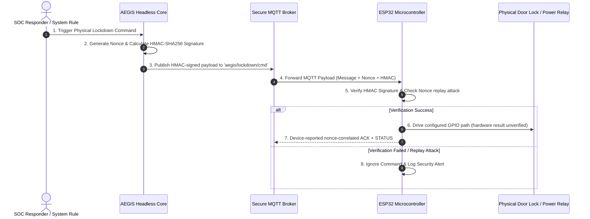

# 🔒 IDEA3: AEGIS Lockdown

> [!warning] Ownership and evidence boundary
> Owner: **Music**. The Security Center and Headless Core from PR #91 are on shared `main`. Fix1A application-startup fail-secure behavior and the Deadman → relay → RJ45 path now have fresh physical evidence. Electrical reset-window 1B, Router/Switch real-Ethernet E2E, live adapters, and production deployment remain open; durable Web audit persistence is closed by Project Sequence PR6. ACK and protocol-correlated STATUS must never be promoted to direct electrical relay proof.

> **Primary Function**: Automatic disconnection and physical lockdown system triggered upon critical threats (Physical Emergency Lockdown System). Commands ESP32 microcontrollers via secure MQTT + HMAC-SHA256 protocol.

---

## ⚡ Hardware & Firmware Architecture



---

## 🛠️ Physical Security Features

* **HMAC-SHA256 Validation**: Firmware source rejects commands whose signature does not match; this branch verifies the contract through tests and compile-only evidence.
* **Anti-Replay Attack (Nonce)**: Firmware source tracks single-use nonces and now echoes command correlation through ACK/command-triggered STATUS.
* **Dead Man's Switch**: The source contract sends heartbeat every 15 seconds and triggers Deadman after 60 seconds without heartbeat. Fresh physical testing observed RJ45 Pin 2 disappear after timeout, remain absent after reconnect, and return only after explicit authenticated RESTORE.

---

## ⚙️ Headless Core / Command & Physical Evidence track

Personal planning label: **IDEA3 PR4**. The Headless Core publication from
`feat/idea3-headless-core-pr4` was merged through
[GitHub PR #91](https://github.com/kraveerachat/Project-End-The-AEGIS/pull/91)
and is part of the current canonical `main` baseline. Historical source
checkpoints remain recorded below for traceability.

### Fix1A application startup and Deadman physical E2E — PASS (2026-09-08)

- Application state now initializes as `LOCKDOWN`; the active-low relay value is preloaded with `RELAY_TRIGGER` before GPIO27 becomes an output, so the application-startup GPIO27 state is LOW.
- Regression `test_firmware_boots_relay_in_fail_secure_state` protects the locked initial state, trigger polarity, absence of a setup-time release, and preload-before-output ordering.
- Physical post-flash boot observation: RJ45 Pin 2 was absent after application startup.
- Source timing contract: heartbeat interval = 15 seconds; Deadman timeout = 60 seconds.
- Explicit RESTORE/NORMAL: `1 2 3 4 5 6 7 8`.
- Deadman timeout: `1 _ 3 4 5 6 7 8`.
- Heartbeat/MQTT reconnect without RESTORE: `1 _ 3 4 5 6 7 8`; reconnect does not auto-RESTORE.
- Explicit authenticated RESTORE after reconnect: `1 2 3 4 5 6 7 8`.

Fresh canonical Task 4 verification on `fix/idea3-fail-secure-boot-deadman-e2e`:

- Fix1A regression — **1 passed**.
- Relay/controller/firmware/runtime focused tests — **44 passed**.
- Full Python suite — **63 passed**.
- Ruff and compileall — **PASS**.
- Project-local dependencies — `pytest 9.1.1`, `ruff 0.16.3`, `paho-mqtt 2.1.0`; `pip check` passes.
- PlatformIO — **compile-only SUCCESS**, RAM 46,588/327,680 bytes (14.2%), Flash 789,325/1,310,720 bytes (60.2%); final `firmware.bin` 795,904 bytes, SHA256 `2b2ebb37c79f8e8751b1f3a8ebec682d3c0825bc77dcbbfb6982ad984e8065a7`.
- Repository policy tests — **56 passed, 0 failed**; their nested Git fixtures required normal `/tmp` process permissions after the sandboxed run returned `EPERM`.
- Vault validation — **PASS** with two pre-existing owner-data canvas warnings; neither canvas changed.
- No firmware upload/flash, ESP32 reset/power-cycle, hardware change, command publication, or production deployment occurred during this canonical PR execution.

> [!warning] 1B electrical reset-window — OPEN / KNOWN LIMITATION
> Prior physical observation: before EN/reset, Pin 2 was absent; while EN was held/reset, Pin 2 returned; after application boot, Pin 2 was absent again. Fix1A covers application-startup behavior only and does not prove fail-secure behavior before application code runs, when GPIO27 may be high-impedance. Optional external pull-down mitigation remains to be validated.

> [!info] Deferred final hardware validation
> Task 3 Router/Switch real Ethernet E2E is **DEFERRED TO FINAL HARDWARE CLOSURE PR**. Required proof remains RESTORE traffic/link works → CUT traffic/link fails → RESTORE traffic/link recovers. IDEA3 is not fully complete.

### Operational mode ownership — CLOSED

- Core owns the operational safety gate `ARMED` / `DISARMED` independently from the `auto_contain` policy.
- Default Core operational mode is `ARMED`.
- `set_armed(armed, origin)` persists the mode and audits the previous/current value plus origin.
- While `DISARMED`, detector events remain observable/auditable but automatic containment cannot publish `CUT_UPLINK`.
- Historical source checkpoint: `e2aa6acd`.

### Command ownership — CLOSED

- `AegisSupervisor.issue_command()` is the public Core command-lifecycle entry point and delegates signing/publication to the existing controller.
- A sent command creates Core-owned pending state containing `action`, `sent_at`, and `nonce`.
- Automatic detector containment uses the same `issue_command()` path rather than a second command implementation.
- Historical source checkpoint: `1ab38dfc`.

### ACK nonce correlation — CLOSED

- Firmware ACK includes the parsed command nonce for valid/rejected command paths where a nonce exists; malformed JSON uses an empty nonce.
- MQTTManager forwards `(ack, detail, nonce)` to Core.
- Missing or mismatched ACK nonce is ignored and audited fail-closed; only the matching pending command can be acknowledged.
- The legacy GUI callback accepts the nonce and duplicate ACK callback binding was removed.
- Historical source checkpoint: `1ab38dfc`.

### ACK versus physical evidence — CLOSED at protocol lifecycle level

```text
Requested != Published != ACK != Executed != Physical Evidence
```

- ACK success alone never proves relay or network isolation.
- CUT expects `LOCKDOWN`; RESTORE expects `NORMAL`; the opposite state cannot confirm the command.
- `ACK → STATUS` and `STATUS → ACK` are both retained without later evidence overwriting earlier evidence.
- ACK timeout and physical-confirmation timeout are separate; physical confirmation waits `8` seconds after ACK.
- A CUT physical timeout degrades runtime when no LOCKDOWN truth exists.
- A RESTORE timeout cannot hide current `LOCKDOWN` physical truth.
- Late matching physical evidence is accepted while the original `physical_timeout_at` history remains recorded.
- Historical source checkpoint: `1ab38dfc`.

### Task 2D6 Physical STATUS correlation — IMPLEMENTED / CLOSED

- Approved design: `IDEA3-AEGIS_Lockdown/docs/superpowers/specs/2026-09-04-idea3-physical-status-correlation-design.md` (`ad0c3d37`).
- Command-triggered CUT/RESTORE STATUS includes `command_nonce` (`12f207f1`).
- Boot, periodic heartbeat, Deadman, and Secure Boot STATUS remains uncorrelated.
- MQTTManager forwards optional `command_nonce`; the legacy GUI accepts the expanded callback signature.
- Every valid STATUS may update device/uplink physical truth, including uncorrelated fail-secure STATUS.
- Active command evidence changes only when `STATUS.command_nonce` matches the tracked command nonce; confirmation additionally requires the expected physical state.
- Missing/mismatched correlation is ignored for command completion and audited without false confirmation (`cfb6efe2`).

### Historical PR4 verification — 2026-09-06

- Python: `pytest -p no:cacheprovider -q` — **62 passed**; final pre-review rerun completed in 0.38s.
- Ruff: scoped check of `aegis_soc`, detector entry points, and tests — **All checks passed**.
- Python compileall — **PASS**.
- Firmware: `platformio run -d firmware` — **compile-only SUCCESS**, RAM 46,572/327,680 bytes (14.2%), Flash 789,309/1,310,720 bytes (60.2%).
- Repository tests: `node --test --test-concurrency=1 tests/*.test.mjs` — **56 passed, 0 failed**.
- Collaboration policy — **PASS**.
- Vault validation — **PASS** with two pre-existing owner-data canvas warnings; neither canvas is changed by PR #91.
- Secret/path scan — **PASS**; no real `.env`, `secrets.h`, private-key/token signature, recording, or generated firmware output is included.
- GitHub `collaboration-guardrails` — **PASS** on PR #91.
- `git diff --check origin/main...HEAD` — **PASS** after documentation reconciliation.
- No firmware upload, flash, serial write, MQTT connection, command publication, GPIO/relay action, network change, or deployment occurred.

### Follow-up evidence audit — CLOSED

- Filled the previously missing actual PR #91 state and repository/policy/vault/secret/GitHub-check results.
- Corrected the architecture description from encrypted traffic to the implemented HMAC-signed payload and the actual `aegis/lockdown/cmd` topic.
- Relabelled historical standalone hardware tables so they cannot be mistaken for fresh PR4 evidence.
- `MISSING_FROM_OBSIDIAN=NONE` after this reconciliation for the requested PR4 checklist.

### Still open

- 1B electrical reset-window mitigation/validation; GPIO27 may be high-impedance before application code runs.
- Task 3 Router/Switch real Ethernet E2E in the final hardware-closure PR.
- Production Web → Core → MQTT live integration remains open; durable Web audit persistence is closed by PR6.
- Full migration of remaining GUI-owned operational state/heartbeat behavior into the Core/API boundary where duplication still exists.

Protocol-correlated STATUS remains device-reported evidence, not direct electrical
measurement of relay contacts. The cable-tester Deadman path is physically
observed, but Router/Switch traffic isolation and reset-window mitigation remain
**NOT_COMPLETED**; the complete hardware program is not yet closed.

---

## 🖥️ Security Center implementation status (2026-09-04)

The first repository implementation is established under `IDEA3-AEGIS_Lockdown/web/` as an Admin-only React/Vite interface with an Express security boundary. It provides 11 operational pages: Dashboard, Overview, IDEA1 Security, IDEA2 Detection, IDEA3 Lockdown, Alerts, Incidents, Audit, Devices, Recovery, and Settings.

Implemented and locally verified:

- canonical evidence states `HEALTHY`, `DEGRADED`, `FAILED`, `UNKNOWN`, `NOT_CONFIGURED`, `STALE`, and `DISABLED`;
- allowlisted read-only adapters for IDEA1, IDEA2, and IDEA3 runtime data, including malformed/future/stale evidence rejection;
- same-origin Admin session, CSRF enforcement, login throttling, security headers, and fail-closed production configuration;
- event deduplication and same-IP correlation within a bounded time window;
- clearly isolated Demo mode for UI review;
- alert acknowledgement, incident notes, bounded audit export, settings validation, and recovery validation as audited server-side actions;
- architecture-first Overview with an explicit environment/provider/persistence boundary, validated evidence flow, per-IDEA integration contracts, a freshness-aware matrix, and visible production-readiness gaps; runtime ACK and requested mode remain distinct from physical relay proof;
- conservative `HEALTHY` evidence gating: evidence must be `FRESH` and include a parseable validation timestamp; missing or malformed timestamps fail closed to `UNKNOWN`;
- desktop/tablet/mobile layouts, light/dark themes, and UI styling derived from IDEA1's design language without modifying IDEA1 source.

Current Overview-pass evidence: affected client regressions pass 31/31; the full web suite passes 102/102 across 15 files; `npm run build` succeeds with 1,677 modules transformed; repository UI detection returns `[]`; and fresh browser QA at desktop and the 390×844 mobile preset finds no document-level horizontal overflow or console errors in Light or Dark themes. At the narrow preset, the Live comparison table scrolls inside its wrapper (241/609) and the Demo table does the same (241/567) rather than overflowing the page.

Known limitations:

- IDEA1, IDEA2, and IDEA3 live endpoints are not configured or integration-tested in this task;
- operational snapshot state remains runtime-owned, while Web audit records are durable in SQLite schema version 1 under PR6;
- the browser has no MQTT, relay, isolation, broker-secret, signing-secret, or recovery-execution endpoint; Recovery is dry-run validation only;
- production deployment, gateway routing, external identity provider, live cross-IDEA integration, and final real-hardware closure remain deferred.

---

## PR6 verified closure and PR7 inventory/design baseline — 2026-09-08

### VERIFIED IMPLEMENTATION

- GitHub PR #101 merged PR6 into `main` at
  `5f30bc54f8603195ed9618e755fe3726ea343bb6`; every listed PR6 commit is an
  ancestor of that merge.
- PR6 established durable SQLite schema version 1 audit persistence with WAL,
  reopen/restart durability, bounded Admin reads, allowlisted sanitization, and
  HTTP 503 fail-closed behavior when an audit write cannot be persisted.
- PR6 also established production session-secret and bcrypt policy, disabled
  development login in production, throttled login failures, and durably
  audited authentication and operational-failure events.
- Exactly one PR6 receipt exists:
  `90-Status/logs/2026-09-08_111604_music_idea3-production-reliability.md`.
- Inventory classification totals are `VERIFIED=26`, `STALE_DOC=1`,
  `MISSING_EVIDENCE=0`, and `UNRESOLVED=3`.
- `web/server/providers/liveProvider.js` still presents the Audit Store as
  `In-memory repository` with `MEMORY_ONLY` provenance. This contradicts the
  durable PR6 Web audit implementation and is a PR7 source correction; the
  runtime-owned event snapshot store remains non-durable.

### VERIFIED TEST EVIDENCE

- Fresh verification on the PR7 base: Python **63/63**, Ruff **PASS**,
  compileall **PASS**, Web **168/168 across 18 files**, Web build **PASS** with
  1,677 modules, offline production dependency audit **0 vulnerabilities**,
  repository tests **56/56**, firmware compile-only **PASS**, and vault
  validation **PASS** with two known unchanged owner-data canvas warnings.
- The firmware compile used the checked-in placeholder secrets header in an
  isolated copy. Its output hash is intentionally not compared with the
  historical secret-dependent binary hash.
- Initial failures caused by an unintended PlatformIO Python, old global
  dependencies, missing Node modules, and a missing local firmware header were
  environmental. Clean isolated reruns using pinned project dependencies
  produced the results above.

### HISTORICAL PHYSICAL EVIDENCE

- Fix1A application-start behavior and the Deadman → relay → RJ45 cable-tester
  path remain verified historical evidence. They were not physically rerun for
  PR7 and do not prove the pre-application reset window, router/switch traffic
  isolation, or total-power-loss fail-secure behavior.

### PR7 CONTRACT INVENTORY — DESIGN ONLY

- `IDEA1_CONTRACT=PARTIAL`: `GET /api/audit` exposes bounded current audit data
  only to a human Admin session, omits a stable event ID and explicit severity,
  and does not provide a service-to-service read boundary.
- `IDEA2_CONTRACT=PARTIAL`: Monitor alert/detection routes require human
  session/RBAC; its internal API-key routes are write-only. The Detection
  Engine recent-events route is unauthenticated, sensitive, non-durable, and
  unsuitable as a production feed.
- `IDEA3_ADAPTER_BASE=PARTIAL`: the current Web adapters send no integration
  credential and assume producer schemas that do not match current IDEA1,
  IDEA2, or the Python runtime status file. Fetch success currently substitutes
  for event-time freshness.
- `AEGIS_IDEA1_STATUS_URL`, `AEGIS_IDEA2_STATUS_URL`,
  `AEGIS_IDEA3_RUNTIME_STATUS_URL`, `AEGIS_MAX_EVIDENCE_AGE_MS`, and
  `AEGIS_ADAPTER_TIMEOUT_MS` are all `USED_IN_SOURCE`. Direct environment-key
  wiring assertions do not exist, so none is classified `USED_AND_TESTED`.
- The approved PR7 direction is upstream-owned, versioned, bounded read-only
  event feeds protected by dedicated integration credentials, translated by
  IDEA3-only adapters. Human-session automation, direct database reads, and
  the unauthenticated Detection Engine ring buffer are rejected.
- The normalized event design requires stable source event IDs and event-time
  freshness. Cross-IDEA correlation additionally requires fresh eligible
  IDEA1 + IDEA2 evidence with the same non-null reviewed correlation key inside
  ten minutes. Current upstream source does not supply that common key.
- The lifecycle stops at `Containment Accepted`. All command-request,
  publication, ACK, execution, and physical-evidence fields remain false.
- Design:
  `IDEA3-AEGIS_Lockdown/docs/superpowers/specs/2026-09-08-idea3-pr7-live-security-integration-design.md`.
- Implementation plan:
  `IDEA3-AEGIS_Lockdown/docs/superpowers/plans/2026-09-08-idea3-pr7-live-security-integration.md`.

### OPEN / NOT PROVEN

```text
IDEA1_IDEA3_LIVE_EVENT_INTEGRATION = OPEN / PR7 (upstream feed absent)
IDEA2_IDEA3_LIVE_EVENT_INTEGRATION = OPEN / PR7 (upstream feed absent)
CROSS_IDEA_EVENT_NORMALIZATION = IMPLEMENTED_UNEXERCISED / PR7
CROSS_IDEA_INCIDENT_CORRELATION = IMPLEMENTED_UNEXERCISED / PR7
CROSS_IDEA_CONTAINMENT_ACCEPTANCE = IMPLEMENTED_UNEXERCISED / PR7
1B_RESET_WINDOW = OPEN / PR8
ROUTER_SWITCH_REAL_ETHERNET_E2E = OPEN / PR8
KALI_E2E = OPEN / PR9
WINDOWS_EXE = OPEN / PR10
PRODUCTION_DEPLOYMENT = OPEN / PR11
FINAL_SYSTEM_ACCEPTANCE = OPEN / PR12
IDEA3_PRODUCTION_COMPLETE = NO
```

No PR7 application source, upstream source, firmware, MQTT behavior, hardware,
network, production data, deployment, or physical system was changed by this
inventory/design baseline.

---

## PR7 IDEA3-side implementation — 2026-09-08

### IMPLEMENTED AND TESTED (IDEA3 source only)

- Canonical cross-IDEA event contract in
  `web/server/domain/integrationEvents.js`. `event_type` is restricted to the
  single reviewed value `ACCESS_DENIED`, so the design-only `CAMERA_TAMPER`
  value is rejected before normalization and can never become
  containment-eligible. `subject` is always emitted as `null`, so raw human
  names and other privacy-sensitive producer free text cannot survive
  normalization; both properties are regression-tested.
- Read-only source adapters in `web/server/providers/` over a shared HTTP
  boundary: GET-only, `Accept: application/json`, per-source bearer credential,
  redirect rejection, non-`http(s)` URL rejection, 2.5 s timeout, 256 KiB
  response limit, `schema_version=1` envelope, and a 500-event bound. Neither the
  credential nor a raw body is ever returned in a result.
- Two new configuration keys, `AEGIS_IDEA1_INTEGRATION_TOKEN` and
  `AEGIS_IDEA2_INTEGRATION_TOKEN`, are per-source and default to absent. The
  five previously documented adapter keys now have direct configuration-wiring
  assertions and are therefore `USED_AND_TESTED`.
- `liveProvider` no longer treats fetch success as evidence freshness. Envelope
  freshness and per-event freshness are evaluated separately, stale/future
  evidence stays observable but containment-ineligible, and a stale envelope
  raises the new `ADAPTER_EVIDENCE_STALE` operational error.
- `liveProvider` audit provenance corrected to `SQLITE_AUDIT_ONLY` with the Audit
  Store reported as a durable SQLite store; the event snapshot store is reported
  honestly as `RUNTIME_ONLY` and is still not persisted.
- Deterministic correlation in `web/server/domain/correlate.js`: eligible
  IDEA1 + IDEA2 evidence sharing one validated non-null `correlation_key` inside
  the ten-minute window, sorted by `occurred_at` then `source:event_id`, with a
  stable hashed incident ID. The only produced state is
  `CONTAINMENT_CANDIDATE`. The former same-`sourceIp` heuristic is removed.
- Containment acceptance boundary: `POST /api/security/incidents/:id/containment`
  under Admin + same-origin + CSRF. It is idempotent for a repeated identical
  decision, returns HTTP 409 on the opposite decision, is denied in Demo Mode,
  and always returns `command_requested`, `command_published`, `acknowledged`,
  `executed`, and `physical_evidence` as `false`. A source-level test asserts the
  route and domain import no controller, MQTT, broker, firmware, or command
  module.
- Additive SQLite schema **version 2** adds `containment_decisions`,
  `integration_lifecycle`, and `correlated_incidents`. Every schema v1 table and
  audit row is preserved and a v1 database is migrated in place on reopen.
- Durable integration lifecycle audit using only `ADAPTER_FAILURE`,
  `ADAPTER_RECOVERED`, `EVENT_REJECTED`, `EVENT_ID_CONFLICT`,
  `INCIDENT_CORRELATED`, `CONTAINMENT_ACCEPTED`, and `CONTAINMENT_REJECTED`.
  Coalescing is durable across restart: one row per active failure period, one
  recovery row per validated recovery, one row per stable conflict, and one row
  per stable correlated incident. Demo Mode writes none of them.
- Python `aegis_soc.runtime.safe_status_projection()` exports a versioned,
  allowlisted runtime projection (`schemaVersion`, `generatedAt`, canonical
  `status`, allowlisted `components`, `modes`, `issues`, `evidenceSource`). Free
  text `detail`, `pid`, paths, addresses, and configuration values are dropped
  rather than sanitized, and a missing or malformed document fails closed to
  `RUNTIME_STATUS_ABSENT`.

### VERIFIED TEST EVIDENCE — 2026-09-08

- Python `pytest -p no:cacheprovider -q` — **80 passed** (63 baseline plus 17 new
  runtime-projection tests).
- `ruff check aegis_soc detector.py sim_auto_detector.py tests --no-cache` —
  **All checks passed**.
- Python `compileall` — **PASS**.
- Web `npm test` — **277 passed across 22 files** (168 on the PR7 base).
- Web `npm run build` — **PASS**.
- `npm audit --omit=dev --offline` — **0 vulnerabilities**.
- Repository `node --test --test-concurrency=1 tests/*.test.mjs` — **56 passed**.
- `git diff --check` — **PASS**.
- Vault validation — **PASS** with the two pre-existing owner-data canvas
  warnings; neither canvas changed.
- No MQTT connection, command publication, ACK, firmware compile or flash, relay
  action, network change, production database access, deployment, or physical
  evidence claim occurred. Every adapter test used an injected fetch stub; no
  real upstream host was contacted.

### NOT PROVEN — LIVE INTEGRATION REMAINS OPEN

- No reviewed IDEA1 or IDEA2 service event feed exists in current source, so the
  adapters were never exercised against a real producer. `IDEA1_SERVICE_EVENT_FEED`
  and `IDEA2_SERVICE_EVENT_FEED` remain `ABSENT` and both live integrations stay
  `OPEN`.
- No reviewed shared cross-IDEA `correlation_key` exists upstream, so no real
  cross-IDEA incident has been produced. Correlation and containment acceptance
  are implemented and unit-tested but unexercised against live evidence.
- The reviewed privacy-safe contract carries no source IP, so live IDEA1/IDEA2
  evidence tables and the live incident view render no `sourceIp`. Demo Mode is
  unaffected. Rebinding those views to the new contract is deliberately not part
  of PR7.
- `web/server/domain/normalize.js` still exports the legacy
  `normalizeIdea1Event` / `normalizeIdea2Event` producer shims. They are no longer
  reachable from `liveProvider` and remain only for their own direct tests.
- Firmware was not compiled for PR7: no firmware path changed, so a compile would
  add no evidence.

---

## 🔗 Related Notes
* [[core/system-overview]]
* [[idea2/idea2-status]]
* [[core/security-architecture]]
