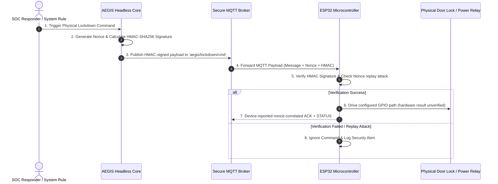

# 🔒 IDEA3: AEGIS Lockdown

> [!warning] Ownership and evidence boundary
> Owner: **Music**. The Security Center and Headless Core from PR #91 are on shared `main`. Fix1A application-startup fail-secure behavior and the Deadman → relay → RJ45 path now have fresh physical evidence. Electrical reset-window 1B, Router/Switch real-Ethernet E2E, live adapters, and production deployment remain open; durable Web audit persistence is closed by Project Sequence PR6. ACK and protocol-correlated STATUS must never be promoted to direct electrical relay proof.

> **Primary Function**: Automatic disconnection and physical lockdown system triggered upon critical threats (Physical Emergency Lockdown System). Commands ESP32 microcontrollers via secure MQTT + HMAC-SHA256 protocol.

---

## ⚡ Hardware & Firmware Architecture



---

## 🛠️ Physical Security Features

* **HMAC-SHA256 Validation**: Firmware source rejects commands whose signature does not match; this branch verifies the contract through tests and compile-only evidence.
* **Anti-Replay Attack (Nonce)**: Firmware source tracks single-use nonces and now echoes command correlation through ACK/command-triggered STATUS.
* **Dead Man's Switch**: The source contract sends heartbeat every 15 seconds and triggers Deadman after 60 seconds without heartbeat. Fresh physical testing observed RJ45 Pin 2 disappear after timeout, remain absent after reconnect, and return only after explicit authenticated RESTORE.

---

## ⚙️ Headless Core / Command & Physical Evidence track

Personal planning label: **IDEA3 PR4**. The Headless Core publication from
`feat/idea3-headless-core-pr4` was merged through
[GitHub PR #91](https://github.com/kraveerachat/Project-End-The-AEGIS/pull/91)
and is part of the current canonical `main` baseline. Historical source
checkpoints remain recorded below for traceability.

### Fix1A application startup and Deadman physical E2E — PASS (2026-09-08)

- Application state now initializes as `LOCKDOWN`; the active-low relay value is preloaded with `RELAY_TRIGGER` before GPIO27 becomes an output, so the application-startup GPIO27 state is LOW.
- Regression `test_firmware_boots_relay_in_fail_secure_state` protects the locked initial state, trigger polarity, absence of a setup-time release, and preload-before-output ordering.
- Physical post-flash boot observation: RJ45 Pin 2 was absent after application startup.
- Source timing contract: heartbeat interval = 15 seconds; Deadman timeout = 60 seconds.
- Explicit RESTORE/NORMAL: `1 2 3 4 5 6 7 8`.
- Deadman timeout: `1 _ 3 4 5 6 7 8`.
- Heartbeat/MQTT reconnect without RESTORE: `1 _ 3 4 5 6 7 8`; reconnect does not auto-RESTORE.
- Explicit authenticated RESTORE after reconnect: `1 2 3 4 5 6 7 8`.

Fresh canonical Task 4 verification on `fix/idea3-fail-secure-boot-deadman-e2e`:

- Fix1A regression — **1 passed**.
- Relay/controller/firmware/runtime focused tests — **44 passed**.
- Full Python suite — **63 passed**.
- Ruff and compileall — **PASS**.
- Project-local dependencies — `pytest 9.1.1`, `ruff 0.16.3`, `paho-mqtt 2.1.0`; `pip check` passes.
- PlatformIO — **compile-only SUCCESS**, RAM 46,588/327,680 bytes (14.2%), Flash 789,325/1,310,720 bytes (60.2%); final `firmware.bin` 795,904 bytes, SHA256 `2b2ebb37c79f8e8751b1f3a8ebec682d3c0825bc77dcbbfb6982ad984e8065a7`.
- Repository policy tests — **56 passed, 0 failed**; their nested Git fixtures required normal `/tmp` process permissions after the sandboxed run returned `EPERM`.
- Vault validation — **PASS** with two pre-existing owner-data canvas warnings; neither canvas changed.
- No firmware upload/flash, ESP32 reset/power-cycle, hardware change, command publication, or production deployment occurred during this canonical PR execution.

> [!warning] 1B electrical reset-window — OPEN / KNOWN LIMITATION
> Prior physical observation: before EN/reset, Pin 2 was absent; while EN was held/reset, Pin 2 returned; after application boot, Pin 2 was absent again. Fix1A covers application-startup behavior only and does not prove fail-secure behavior before application code runs, when GPIO27 may be high-impedance. Optional external pull-down mitigation remains to be validated.

> [!info] Deferred final hardware validation
> Task 3 Router/Switch real Ethernet E2E is **DEFERRED TO FINAL HARDWARE CLOSURE PR**. Required proof remains RESTORE traffic/link works → CUT traffic/link fails → RESTORE traffic/link recovers. IDEA3 is not fully complete.

### Operational mode ownership — CLOSED

- Core owns the operational safety gate `ARMED` / `DISARMED` independently from the `auto_contain` policy.
- Default Core operational mode is `ARMED`.
- `set_armed(armed, origin)` persists the mode and audits the previous/current value plus origin.
- While `DISARMED`, detector events remain observable/auditable but automatic containment cannot publish `CUT_UPLINK`.
- Historical source checkpoint: `e2aa6acd`.

### Command ownership — CLOSED

- `AegisSupervisor.issue_command()` is the public Core command-lifecycle entry point and delegates signing/publication to the existing controller.
- A sent command creates Core-owned pending state containing `action`, `sent_at`, and `nonce`.
- Automatic detector containment uses the same `issue_command()` path rather than a second command implementation.
- Historical source checkpoint: `1ab38dfc`.

### ACK nonce correlation — CLOSED

- Firmware ACK includes the parsed command nonce for valid/rejected command paths where a nonce exists; malformed JSON uses an empty nonce.
- MQTTManager forwards `(ack, detail, nonce)` to Core.
- Missing or mismatched ACK nonce is ignored and audited fail-closed; only the matching pending command can be acknowledged.
- The legacy GUI callback accepts the nonce and duplicate ACK callback binding was removed.
- Historical source checkpoint: `1ab38dfc`.

### ACK versus physical evidence — CLOSED at protocol lifecycle level

```text
Requested != Published != ACK != Executed != Physical Evidence
```

- ACK success alone never proves relay or network isolation.
- CUT expects `LOCKDOWN`; RESTORE expects `NORMAL`; the opposite state cannot confirm the command.
- `ACK → STATUS` and `STATUS → ACK` are both retained without later evidence overwriting earlier evidence.
- ACK timeout and physical-confirmation timeout are separate; physical confirmation waits `8` seconds after ACK.
- A CUT physical timeout degrades runtime when no LOCKDOWN truth exists.
- A RESTORE timeout cannot hide current `LOCKDOWN` physical truth.
- Late matching physical evidence is accepted while the original `physical_timeout_at` history remains recorded.
- Historical source checkpoint: `1ab38dfc`.

### Task 2D6 Physical STATUS correlation — IMPLEMENTED / CLOSED

- Approved design: `IDEA3-AEGIS_Lockdown/docs/superpowers/specs/2026-09-04-idea3-physical-status-correlation-design.md` (`ad0c3d37`).
- Command-triggered CUT/RESTORE STATUS includes `command_nonce` (`12f207f1`).
- Boot, periodic heartbeat, Deadman, and Secure Boot STATUS remains uncorrelated.
- MQTTManager forwards optional `command_nonce`; the legacy GUI accepts the expanded callback signature.
- Every valid STATUS may update device/uplink physical truth, including uncorrelated fail-secure STATUS.
- Active command evidence changes only when `STATUS.command_nonce` matches the tracked command nonce; confirmation additionally requires the expected physical state.
- Missing/mismatched correlation is ignored for command completion and audited without false confirmation (`cfb6efe2`).

### Historical PR4 verification — 2026-09-06

- Python: `pytest -p no:cacheprovider -q` — **62 passed**; final pre-review rerun completed in 0.38s.
- Ruff: scoped check of `aegis_soc`, detector entry points, and tests — **All checks passed**.
- Python compileall — **PASS**.
- Firmware: `platformio run -d firmware` — **compile-only SUCCESS**, RAM 46,572/327,680 bytes (14.2%), Flash 789,309/1,310,720 bytes (60.2%).
- Repository tests: `node --test --test-concurrency=1 tests/*.test.mjs` — **56 passed, 0 failed**.
- Collaboration policy — **PASS**.
- Vault validation — **PASS** with two pre-existing owner-data canvas warnings; neither canvas is changed by PR #91.
- Secret/path scan — **PASS**; no real `.env`, `secrets.h`, private-key/token signature, recording, or generated firmware output is included.
- GitHub `collaboration-guardrails` — **PASS** on PR #91.
- `git diff --check origin/main...HEAD` — **PASS** after documentation reconciliation.
- No firmware upload, flash, serial write, MQTT connection, command publication, GPIO/relay action, network change, or deployment occurred.

### Follow-up evidence audit — CLOSED

- Filled the previously missing actual PR #91 state and repository/policy/vault/secret/GitHub-check results.
- Corrected the architecture description from encrypted traffic to the implemented HMAC-signed payload and the actual `aegis/lockdown/cmd` topic.
- Relabelled historical standalone hardware tables so they cannot be mistaken for fresh PR4 evidence.
- `MISSING_FROM_OBSIDIAN=NONE` after this reconciliation for the requested PR4 checklist.

### Still open

- 1B electrical reset-window mitigation/validation; GPIO27 may be high-impedance before application code runs.
- Task 3 Router/Switch real Ethernet E2E in the final hardware-closure PR.
- Production Web → Core → MQTT live integration remains open; durable Web audit persistence is closed by PR6.
- Full migration of remaining GUI-owned operational state/heartbeat behavior into the Core/API boundary where duplication still exists.

Protocol-correlated STATUS remains device-reported evidence, not direct electrical
measurement of relay contacts. The cable-tester Deadman path is physically
observed, but Router/Switch traffic isolation and reset-window mitigation remain
**NOT_COMPLETED**; the complete hardware program is not yet closed.

---

## 🖥️ Security Center implementation status (2026-09-04)

The first repository implementation is established under `IDEA3-AEGIS_Lockdown/web/` as an Admin-only React/Vite interface with an Express security boundary. It provides 11 operational pages: Dashboard, Overview, IDEA1 Security, IDEA2 Detection, IDEA3 Lockdown, Alerts, Incidents, Audit, Devices, Recovery, and Settings.

Implemented and locally verified:

- canonical evidence states `HEALTHY`, `DEGRADED`, `FAILED`, `UNKNOWN`, `NOT_CONFIGURED`, `STALE`, and `DISABLED`;
- allowlisted read-only adapters for IDEA1, IDEA2, and IDEA3 runtime data, including malformed/future/stale evidence rejection;
- same-origin Admin session, CSRF enforcement, login throttling, security headers, and fail-closed production configuration;
- event deduplication and same-IP correlation within a bounded time window;
- clearly isolated Demo mode for UI review;
- alert acknowledgement, incident notes, bounded audit export, settings validation, and recovery validation as audited server-side actions;
- architecture-first Overview with an explicit environment/provider/persistence boundary, validated evidence flow, per-IDEA integration contracts, a freshness-aware matrix, and visible production-readiness gaps; runtime ACK and requested mode remain distinct from physical relay proof;
- conservative `HEALTHY` evidence gating: evidence must be `FRESH` and include a parseable validation timestamp; missing or malformed timestamps fail closed to `UNKNOWN`;
- desktop/tablet/mobile layouts, light/dark themes, and UI styling derived from IDEA1's design language without modifying IDEA1 source.

Current Overview-pass evidence: affected client regressions pass 31/31; the full web suite passes 102/102 across 15 files; `npm run build` succeeds with 1,677 modules transformed; repository UI detection returns `[]`; and fresh browser QA at desktop and the 390×844 mobile preset finds no document-level horizontal overflow or console errors in Light or Dark themes. At the narrow preset, the Live comparison table scrolls inside its wrapper (241/609) and the Demo table does the same (241/567) rather than overflowing the page.

Known limitations:

- IDEA1, IDEA2, and IDEA3 live endpoints are not configured or integration-tested in this task;
- operational snapshot state remains runtime-owned, while Web audit records are durable in SQLite schema version 1 under PR6;
- the browser has no MQTT, relay, isolation, broker-secret, signing-secret, or recovery-execution endpoint; Recovery is dry-run validation only;
- production deployment, gateway routing, external identity provider, live cross-IDEA integration, and final real-hardware closure remain deferred.

---

## PR6 verified closure and PR7 inventory/design baseline — 2026-09-08

### VERIFIED IMPLEMENTATION

- GitHub PR #101 merged PR6 into `main` at
  `5f30bc54f8603195ed9618e755fe3726ea343bb6`; every listed PR6 commit is an
  ancestor of that merge.
- PR6 established durable SQLite schema version 1 audit persistence with WAL,
  reopen/restart durability, bounded Admin reads, allowlisted sanitization, and
  HTTP 503 fail-closed behavior when an audit write cannot be persisted.
- PR6 also established production session-secret and bcrypt policy, disabled
  development login in production, throttled login failures, and durably
  audited authentication and operational-failure events.
- Exactly one PR6 receipt exists:
  `90-Status/logs/2026-09-08_111604_music_idea3-production-reliability.md`.
- Inventory classification totals are `VERIFIED=26`, `STALE_DOC=1`,
  `MISSING_EVIDENCE=0`, and `UNRESOLVED=3`.
- `web/server/providers/liveProvider.js` still presents the Audit Store as
  `In-memory repository` with `MEMORY_ONLY` provenance. This contradicts the
  durable PR6 Web audit implementation and is a PR7 source correction; the
  runtime-owned event snapshot store remains non-durable.

### VERIFIED TEST EVIDENCE

- Fresh verification on the PR7 base: Python **63/63**, Ruff **PASS**,
  compileall **PASS**, Web **168/168 across 18 files**, Web build **PASS** with
  1,677 modules, offline production dependency audit **0 vulnerabilities**,
  repository tests **56/56**, firmware compile-only **PASS**, and vault
  validation **PASS** with two known unchanged owner-data canvas warnings.
- The firmware compile used the checked-in placeholder secrets header in an
  isolated copy. Its output hash is intentionally not compared with the
  historical secret-dependent binary hash.
- Initial failures caused by an unintended PlatformIO Python, old global
  dependencies, missing Node modules, and a missing local firmware header were
  environmental. Clean isolated reruns using pinned project dependencies
  produced the results above.

### HISTORICAL PHYSICAL EVIDENCE

- Fix1A application-start behavior and the Deadman → relay → RJ45 cable-tester
  path remain verified historical evidence. They were not physically rerun for
  PR7 and do not prove the pre-application reset window, router/switch traffic
  isolation, or total-power-loss fail-secure behavior.

### PR7 CONTRACT INVENTORY — DESIGN ONLY

- `IDEA1_CONTRACT=PARTIAL`: `GET /api/audit` exposes bounded current audit data
  only to a human Admin session, omits a stable event ID and explicit severity,
  and does not provide a service-to-service read boundary.
- `IDEA2_CONTRACT=PARTIAL`: Monitor alert/detection routes require human
  session/RBAC; its internal API-key routes are write-only. The Detection
  Engine recent-events route is unauthenticated, sensitive, non-durable, and
  unsuitable as a production feed.
- `IDEA3_ADAPTER_BASE=PARTIAL`: the current Web adapters send no integration
  credential and assume producer schemas that do not match current IDEA1,
  IDEA2, or the Python runtime status file. Fetch success currently substitutes
  for event-time freshness.
- `AEGIS_IDEA1_STATUS_URL`, `AEGIS_IDEA2_STATUS_URL`,
  `AEGIS_IDEA3_RUNTIME_STATUS_URL`, `AEGIS_MAX_EVIDENCE_AGE_MS`, and
  `AEGIS_ADAPTER_TIMEOUT_MS` are all `USED_IN_SOURCE`. Direct environment-key
  wiring assertions do not exist, so none is classified `USED_AND_TESTED`.
- The approved PR7 direction is upstream-owned, versioned, bounded read-only
  event feeds protected by dedicated integration credentials, translated by
  IDEA3-only adapters. Human-session automation, direct database reads, and
  the unauthenticated Detection Engine ring buffer are rejected.
- The normalized event design requires stable source event IDs and event-time
  freshness. Cross-IDEA correlation additionally requires fresh eligible
  IDEA1 + IDEA2 evidence with the same non-null reviewed correlation key inside
  ten minutes. Current upstream source does not supply that common key.
- The lifecycle stops at `Containment Accepted`. All command-request,
  publication, ACK, execution, and physical-evidence fields remain false.
- Design:
  `IDEA3-AEGIS_Lockdown/docs/superpowers/specs/2026-09-08-idea3-pr7-live-security-integration-design.md`.
- Implementation plan:
  `IDEA3-AEGIS_Lockdown/docs/superpowers/plans/2026-09-08-idea3-pr7-live-security-integration.md`.

### OPEN / NOT PROVEN

```text
IDEA1_IDEA3_LIVE_EVENT_INTEGRATION = OPEN / PR7 (upstream feed absent)
IDEA2_IDEA3_LIVE_EVENT_INTEGRATION = OPEN / PR7 (upstream feed absent)
CROSS_IDEA_EVENT_NORMALIZATION = IMPLEMENTED_UNEXERCISED / PR7
CROSS_IDEA_INCIDENT_CORRELATION = IMPLEMENTED_UNEXERCISED / PR7
CROSS_IDEA_CONTAINMENT_ACCEPTANCE = IMPLEMENTED_UNEXERCISED / PR7
1B_RESET_WINDOW = OPEN / PR8
ROUTER_SWITCH_REAL_ETHERNET_E2E = OPEN / PR8
KALI_E2E = OPEN / PR9
WINDOWS_EXE = OPEN / PR10
PRODUCTION_DEPLOYMENT = OPEN / PR11
FINAL_SYSTEM_ACCEPTANCE = OPEN / PR12
IDEA3_PRODUCTION_COMPLETE = NO
```

No PR7 application source, upstream source, firmware, MQTT behavior, hardware,
network, production data, deployment, or physical system was changed by this
inventory/design baseline.

---

## PR7 IDEA3-side implementation — 2026-09-08

### IMPLEMENTED AND TESTED (IDEA3 source only)

- Canonical cross-IDEA event contract in
  `web/server/domain/integrationEvents.js`. `event_type` is restricted to the
  single reviewed value `ACCESS_DENIED`, so the design-only `CAMERA_TAMPER`
  value is rejected before normalization and can never become
  containment-eligible. `subject` is always emitted as `null`, so raw human
  names and other privacy-sensitive producer free text cannot survive
  normalization; both properties are regression-tested.
- Read-only source adapters in `web/server/providers/` over a shared HTTP
  boundary: GET-only, `Accept: application/json`, per-source bearer credential,
  redirect rejection, non-`http(s)` URL rejection, 2.5 s timeout, 256 KiB
  response limit, `schema_version=1` envelope, and a 500-event bound. Neither the
  credential nor a raw body is ever returned in a result.
- Two new configuration keys, `AEGIS_IDEA1_INTEGRATION_TOKEN` and
  `AEGIS_IDEA2_INTEGRATION_TOKEN`, are per-source and default to absent. The
  five previously documented adapter keys now have direct configuration-wiring
  assertions and are therefore `USED_AND_TESTED`.
- `liveProvider` no longer treats fetch success as evidence freshness. Envelope
  freshness and per-event freshness are evaluated separately, stale/future
  evidence stays observable but containment-ineligible, and a stale envelope
  raises the new `ADAPTER_EVIDENCE_STALE` operational error.
- `liveProvider` audit provenance corrected to `SQLITE_AUDIT_ONLY` with the Audit
  Store reported as a durable SQLite store; the event snapshot store is reported
  honestly as `RUNTIME_ONLY` and is still not persisted.
- Deterministic correlation in `web/server/domain/correlate.js`: eligible
  IDEA1 + IDEA2 evidence sharing one validated non-null `correlation_key` inside
  the ten-minute window, sorted by `occurred_at` then `source:event_id`, with a
  stable hashed incident ID. The only produced state is
  `CONTAINMENT_CANDIDATE`. The former same-`sourceIp` heuristic is removed.
- Containment acceptance boundary: `POST /api/security/incidents/:id/containment`
  under Admin + same-origin + CSRF. It is idempotent for a repeated identical
  decision, returns HTTP 409 on the opposite decision, is denied in Demo Mode,
  and always returns `command_requested`, `command_published`, `acknowledged`,
  `executed`, and `physical_evidence` as `false`. A source-level test asserts the
  route and domain import no controller, MQTT, broker, firmware, or command
  module.
- Additive SQLite schema **version 2** adds `containment_decisions`,
  `integration_lifecycle`, and `correlated_incidents`. Every schema v1 table and
  audit row is preserved and a v1 database is migrated in place on reopen.
- Durable integration lifecycle audit using only `ADAPTER_FAILURE`,
  `ADAPTER_RECOVERED`, `EVENT_REJECTED`, `EVENT_ID_CONFLICT`,
  `INCIDENT_CORRELATED`, `CONTAINMENT_ACCEPTED`, and `CONTAINMENT_REJECTED`.
  Coalescing is durable across restart: one row per active failure period, one
  recovery row per validated recovery, one row per stable conflict, and one row
  per stable correlated incident. Demo Mode writes none of them.
- Python `aegis_soc.runtime.safe_status_projection()` exports a versioned,
  allowlisted runtime projection (`schemaVersion`, `generatedAt`, canonical
  `status`, allowlisted `components`, `modes`, `issues`, `evidenceSource`). Free
  text `detail`, `pid`, paths, addresses, and configuration values are dropped
  rather than sanitized, and a missing or malformed document fails closed to
  `RUNTIME_STATUS_ABSENT`.

### VERIFIED TEST EVIDENCE — 2026-09-08

- Python `pytest -p no:cacheprovider -q` — **80 passed** (63 baseline plus 17 new
  runtime-projection tests).
- `ruff check aegis_soc detector.py sim_auto_detector.py tests --no-cache` —
  **All checks passed**.
- Python `compileall` — **PASS**.
- Web `npm test` — **277 passed across 22 files** (168 on the PR7 base).
- Web `npm run build` — **PASS**.
- `npm audit --omit=dev --offline` — **0 vulnerabilities**.
- Repository `node --test --test-concurrency=1 tests/*.test.mjs` — **56 passed**.
- `git diff --check` — **PASS**.
- Vault validation — **PASS** with the two pre-existing owner-data canvas
  warnings; neither canvas changed.
- No MQTT connection, command publication, ACK, firmware compile or flash, relay
  action, network change, production database access, deployment, or physical
  evidence claim occurred. Every adapter test used an injected fetch stub; no
  real upstream host was contacted.

### NOT PROVEN — LIVE INTEGRATION REMAINS OPEN

- No reviewed IDEA1 or IDEA2 service event feed exists in current source, so the
  adapters were never exercised against a real producer. `IDEA1_SERVICE_EVENT_FEED`
  and `IDEA2_SERVICE_EVENT_FEED` remain `ABSENT` and both live integrations stay
  `OPEN`.
- No reviewed shared cross-IDEA `correlation_key` exists upstream, so no real
  cross-IDEA incident has been produced. Correlation and containment acceptance
  are implemented and unit-tested but unexercised against live evidence.
- The reviewed privacy-safe contract carries no source IP, so live IDEA1/IDEA2
  evidence tables and the live incident view render no `sourceIp`. Demo Mode is
  unaffected. Rebinding those views to the new contract is deliberately not part
  of PR7.
- `web/server/domain/normalize.js` still exports the legacy
  `normalizeIdea1Event` / `normalizeIdea2Event` producer shims. They are no longer
  reachable from `liveProvider` and remain only for their own direct tests.
- Firmware was not compiled for PR7: no firmware path changed, so a compile would
  add no evidence.

---

## PR7 merge reconciliation and PR8 Windows standalone decision — 2026-09-08

### VERIFIED CURRENT GIT STATE

- Project-sequence PR7 is merged through GitHub PR #104. Current `main` and
  `origin/main` both resolve to merge commit
  `c68946cbe917a71349a8234a4bc028fbf4c6967d`.
- The PR7 inventory/design split in GitHub PR #106 and the PR7 implementation
  receipt both remain reachable from `main`. Historical receipts remain
  immutable and are not rewritten to add later merge facts.
- PR7 live-source limitations are unchanged: both upstream service feeds and a
  reviewed shared correlation key remain absent, so correlation and containment
  acceptance remain `IMPLEMENTED_UNEXERCISED` against real producers.

### PR8 CHECKPOINT

```text
PROJECT_SEQUENCE = PR8_WINDOWS_EXE_STANDALONE_RUNTIME
BASE_SHA = c68946cbe917a71349a8234a4bc028fbf4c6967d
BRANCH = feat/idea3-windows-standalone-pr8
ARCHITECTURE = LAUNCHER_EXE_PLUS_BUNDLED_COMPONENTS_ONEDIR
STATUS = LINUX_IMPLEMENTATION_COMPLETE / WINDOWS_ACCEPTANCE_BLOCKED
WINDOWS_BUILD_EVIDENCE = NOT_RUN
WINDOWS_SMOKE_EVIDENCE = NOT_RUN
IDEA3_PRODUCTION_COMPLETE = NO
```

> Superseded by the PR8 implementation section below. Implementation plan Tasks
> 1-10 and 12 are complete on Linux; Task 11 Windows build and clean-machine
> smoke acceptance is BLOCKED pending a real Windows x64 machine.

- The approved package separates an immutable application payload from external
  writable configuration, databases, logs, and runtime state under
  `%LOCALAPPDATA%\AEGIS\IDEA3` by default.
- A PyInstaller one-folder launcher will supervise packaged Python Core and a
  pinned Node runtime, while Express serves the prebuilt React application at
  `/security/` on loopback only.
- Linux-only detector, UFW, voice, audio, and Tk operator surfaces are not
  represented as working Windows components. Missing IDEA1/IDEA2 feeds remain
  `NOT_CONFIGURED` or `UNAVAILABLE`; absent device, relay, and physical evidence
  remain `UNKNOWN`.
- Design:
  `IDEA3-AEGIS_Lockdown/docs/superpowers/specs/2026-09-08-idea3-pr8-windows-standalone-design.md`.
- Implementation plan:
  `IDEA3-AEGIS_Lockdown/docs/superpowers/plans/2026-09-08-idea3-pr8-windows-standalone.md`.

### CORRECT PROJECT-SEQUENCE ROADMAP

```text
PROJECT PR6 Production Reliability = CLOSED / MERGED
PROJECT PR7 Cross-IDEA Integration Boundary = CLOSED / MERGED
PROJECT PR8 Windows EXE / Standalone Runtime = LINUX IMPLEMENTATION COMPLETE / WINDOWS ACCEPTANCE BLOCKED
PROJECT PR9 Production Runtime / Deployment Preparation = OPEN
PROJECT PR10 Final Hardware Closure = OPEN / WAITING FOR PHYSICAL COMPONENTS
PROJECT PR11 Kali Cross-IDEA Security E2E = OPEN
PROJECT PR12 Final System Acceptance = OPEN

IDEA1_SERVICE_EVENT_FEED = OPEN
IDEA2_SERVICE_EVENT_FEED = OPEN
SHARED_CORRELATION_KEY = OPEN
LIVE_CROSS_IDEA_EXERCISE = OPEN
IDEA3_PRODUCTION_COMPLETE = NO
```

No PR8 application behavior, package, Windows build, deployment, network,
firmware, MQTT publication, relay action, or physical test is claimed at this
checkpoint.

---

## PR8 Windows standalone implementation — 2026-09-09

### IMPLEMENTED AND TESTED (Linux source side only)

- External runtime path contract in `aegis_soc/paths.py`: writable configuration,
  databases, logs, and runtime state resolve outside the installed payload, under
  `%LOCALAPPDATA%\AEGIS\IDEA3` by default with an absolute-path `AEGIS_DATA_DIR`
  override and an `AEGIS_CONFIG_FILE` override for the config file alone.
- Cross-platform single-instance locking in `aegis_soc/platform_lock.py`: IDEA3
  imports on Windows without `fcntl` while Linux locking semantics are preserved.
- Honest Windows capability projection in `aegis_soc/runtime.py`: dry-run, absent
  hardware, and Linux-only capabilities are never promoted to `HEALTHY`;
  `UNKNOWN` / `UNAVAILABLE` / `DEGRADED` stay as reported.
- Production Web runtime in `web/server/runtime.js` and `web/server/createApp.js`:
  `/security` base path, safe health route, hashed-asset caching, SPA/API
  separation, and idempotent HTTP/SQLite shutdown.
- Launcher control and lifecycle in `aegis_soc/windows_launcher.py`: loopback-only
  control API, token-protected stop, Core-then-Web start order, Web-first
  shutdown, and cleanup on partial startup failure.
- Secure configuration provisioning: `write_configuration()` writes the external
  `.env` atomically. The operator password only ever reaches the bcrypt hasher
  (`web/server/passwordHash.js`, stdin-only, cost 12); the session secret is
  generated locally; integration and MQTT values are written blank so an
  unconfigured install fails closed instead of inheriting a bundled credential.
- Evaluator commands `configure`, `status`, `open`, `logs`, `doctor`: `status`
  returns non-zero for any state other than `RUNNING`, `open` reaches a browser
  only after Web health succeeds, and `doctor` validates locally without
  contacting or actuating the broker, device, or relay and without echoing any
  configuration value.
- Deterministic packaging inputs in `windows/`: PyInstaller 6.22.2 and Node
  24.20.0 x64 pinned with SHA-256, a one-folder spec, a fail-fast `build.ps1`
  that refuses a dirty tree or a hash mismatch and scans the payload for secret
  and forbidden artifacts, and `smoke.ps1` clean-machine acceptance.

### VERIFIED TEST EVIDENCE — 2026-09-09 (Arch Linux)

- Python `pytest tests -q` — **145 passed**.
- `ruff check aegis_soc tests windows detector.py sim_auto_detector.py` — **All checks passed**.
- Python `compileall` — **PASS**.
- Web `vitest run` — **292 passed across 24 files**.
- Web production build — **PASS**.
- `npm audit --omit=dev --offline` — **0 vulnerabilities**.
- Repository `node --test tests/*.test.mjs` — **56 passed, 0 failed**.
- Vault validation — **PASS** with the two pre-existing owner-data canvas
  warnings; neither canvas changed.
- `git diff --check` — **PASS**.
- No forbidden or generated path is introduced by this branch; the only
  non-`IDEA3-AEGIS_Lockdown/` path changed is this canonical note.

### WINDOWS ACCEPTANCE — STAGING BUNDLE PASSED AT `c7cdc2b2`; CURRENT SHA NOT VERIFIED

> [!note] Historical record as of 2026-09-09
> This block records only the `c7cdc2b2` staging-bundle evidence. Current PR8
> acceptance state is in "PR8 merge reconciliation — 2026-09-10" below.

```text
WINDOWS_BUILD_VERIFIED_AT_c7cdc2b2 = YES
WINDOWS_STAGING_BUNDLE_SMOKE_AT_c7cdc2b2 = PASS (25 checks, 0 failed)
WINDOWS_EXTRACTED_ZIP_SMOKE_AT_c7cdc2b2 = NO
WINDOWS_BUILD_VERIFIED_FOR_CURRENT_SHA = NO
WINDOWS_SMOKE_VERIFIED_FOR_CURRENT_SHA = NO
PR8_IMPLEMENTATION_PLAN_TASK_11 = ACCEPTANCE PENDING
BLOCKER = the post-main-sync SHA requires a fresh Windows build and extracted-ZIP smoke
```

- Real Windows build at `c7cdc2b2e70e4224a756b53f3e87363b55c9ea58`:
  Python **202 passed**, Web **298 passed across 24 files**, Vite build PASS,
  PyInstaller PASS, production npm install PASS, forbidden-artifact and manifest
  checks PASS, ZIP PASS, and final BUILD OK. Artifact
  `AEGIS-IDEA3-c7cdc2b2e70e.zip`, SHA-256
  `faaeaea5259647dea0292d6cc6db286fea540162c41c8a8d63a8eaa774a93694`.
- Real Windows smoke at that SHA passed **25 checks with 0 failed** against the
  freshly built staging bundle at `windows/out/AEGIS-IDEA3`: configuration,
  Core/Web RUNNING status, Admin login, `Secure; HttpOnly; SameSite=Strict`
  cookie validation, audit read, honest absent-integration/hardware states,
  logout, stop/restart, audit persistence, external durable DB, no surviving
  bundle children, and clean completion.
- This is not extracted-ZIP acceptance. The attempted extraction wrapper had an
  interactive PowerShell `if/elseif` parsing mistake, so `BundlePath` remained
  `windows/out/AEGIS-IDEA3` instead of the extracted ZIP directory.
- Core root cause: generated blank `AEGIS_BROKER_PORT` was parsed with
  `int("")`; its Thai import-time fallback diagnostic then raised
  `UnicodeEncodeError` under `cp1252`. The fix treats blank broker settings as
  explicitly unconfigured, uses a safe default port without import-time output,
  disables MQTT connection startup when unconfigured, fails live mode closed,
  and restores the approved default lab/headless/dry-run launcher profile.
- Smoke root cause: acceptance called unprefixed `/api/...` URLs even though
  production mounts `/security/api/...`; `/security/healthz` also hit the SPA
  fallback rather than the JSON health route. All acceptance URLs now derive
  from one `/security/api` base.
- Secure-cookie audit: `express-session` suppresses a production Secure cookie
  on ordinary HTTP. IDEA3 now recognizes only a proven loopback request as the
  browser-trusted localhost context while retaining `Secure`, `HttpOnly`, and
  `SameSite=Strict`. Smoke validates those attributes, carries the opaque cookie
  explicitly because PowerShell does not implement the browser localhost
  exception, and supplies the required CSRF token on logout.
- `origin/main` advanced to `d32885b36c08c71dc5719109de12ed8ac8f6589e`
  during Windows acceptance and was merged normally with no conflicts. The
  resulting implementation/evidence checkpoint is
  `8214792022a4d29672227f6637e8399a7f1e189c`.
- Fresh Arch verification at that reconciled checkpoint: focused Python **161
  passed, 6 skipped**; focused Web **58 passed**; full Python **196 passed, 6
  Windows-only skipped**; Web **298 passed across 24 files**; Vite build PASS
  with 1,677 modules; Ruff PASS; compileall PASS with cache redirected to
  `/tmp`; production npm audit **0 vulnerabilities**; repository tests **57
  passed**; vault validation PASS with the two unchanged owner-data canvas
  warnings.

The `c7cdc2b2` build and staging-bundle smoke are historical evidence for that
exact SHA only. They do not verify the post-merge SHA and do not substitute for
fresh extracted-ZIP smoke acceptance.

### STILL OPEN

```text
PROJECT PR8 = SEE "PR8 merge reconciliation — 2026-09-10"
IDEA1_SERVICE_EVENT_FEED = OPEN
IDEA2_SERVICE_EVENT_FEED = OPEN
SHARED_CORRELATION_KEY = OPEN
LIVE_CROSS_IDEA_EXERCISE = OPEN
CROSS_IDEA_EVENT_NORMALIZATION = IMPLEMENTED_UNEXERCISED
CROSS_IDEA_INCIDENT_CORRELATION = IMPLEMENTED_UNEXERCISED
CROSS_IDEA_CONTAINMENT_ACCEPTANCE = IMPLEMENTED_UNEXERCISED
IDEA3_PRODUCTION_COMPLETE = NO
```

No MQTT connection or publication, ACK, relay CUT/RESTORE, firmware compile or
flash, network change, production database access, deployment, or physical
evidence occurred during PR8.

---

## PR8 merge reconciliation — 2026-09-10

PR8 source is merged through GitHub PR #107 at
`f320bbf55456450406fe0c5547848fbdce099a96`, and the PR8 head
`25fb442d15cdf2037817c9e63add4d7e96bcd568` is reachable from current `main`.

```text
PR8_FINAL_WINDOWS_ACCEPTANCE_AT_25fb442d = PASS (owner-reported, 2026-09-10)
PR8_FINAL_EXTRACTED_ZIP_SMOKE_AT_25fb442d = PASS, 25/25 checks (owner-reported)
PR8_CANONICAL_DOCUMENTATION = STALE / MISSING THE FINAL EVIDENCE
PR8_RECEIPT = UNCHANGED (historically partial)
```

- The project owner reports that final PR8 Windows acceptance exists for
  `25fb442d`, including the final extracted-ZIP smoke with 25/25 checks passed.
  Earlier statements in this note and in the PR9 records that PR8 extracted-ZIP
  acceptance was absent described missing canonical documentation, not missing
  Windows acceptance.
- The final evidence itself — build result, ZIP digest, and smoke transcript for
  `25fb442d` — is not yet recorded in this note, in `04_SESSION_HANDOFF.md`, or
  in the PR #107 description, which at merge still listed the extracted-ZIP smoke
  as pending. Recording those artifacts here is an owner follow-up. PR9 did not
  rerun or observe Windows acceptance, so this is owner-supplied evidence.
- The 2026-09-09 block above remains the historical `c7cdc2b2` staging-bundle
  record. The immutable PR8 receipt
  `90-Status/logs/2026-09-09_022203_music_idea3-pr8-windows-standalone.md` keeps
  `status: partial` as recorded at its own checkpoint and is not edited.

## Current Task

Task: PR9 Production Runtime / Deployment Preparation
Branch: `feat/idea3-production-runtime-pr9`
Owner: `music`
PR: [#115](https://github.com/kraveerachat/Project-End-The-AEGIS/pull/115) — Draft
Current state: BLOCKED — S1-S6 CLOSED; waiting at the PR5 merge gate
Started: 2026-09-10
Base SHA: `50ce6e1638c6bcdb2a378a3cee660050b9cb41d8`
Last checkpoint: the truth-model correction commit that contains this record
(exact SHA in PR #115); preceded by `15b5b94a0b26131db2b14f2274dcc6022c776b2b`
Production mutation allowed: NO
PR5 dependency: OPEN / WAITING FOR MERGE

### Goal

Prepare and locally verify the Core+Web production service lifecycle,
configuration, paths, readiness, persistence, authentication, and operations
boundary that is safe before PR5 merges.

### Scope

IDEA3-owned server runtime source, tests, service example, operations runbook,
isolated production-like acceptance, and truthful Git/Obsidian reconciliation.

### Out of scope

PR5 merge synchronization, final PR9 acceptance/receipt/Ready state, Production
deployment, Kali E2E, MQTT publication, firmware/relay changes, network changes,
live IDEA1/IDEA2 feeds, and physical acceptance.

### Safety boundaries

Use only disposable local paths, loopback listeners, generated test-only
credentials, and absent/injected dependencies. Do not touch Production or
hardware, do not create a PR9 receipt, and do not mark the future Draft Ready.

### Acceptance criteria

S1-S6 must produce source-backed design, a TDD plan, strict production contracts,
Core+Web lifecycle/readiness evidence, focused negative regressions, a clean
production-like isolated acceptance, an operations runbook, and exact evidence.
S7 and S8 remain blocked until PR5 merges.

## Session Register

| ID | Scope | State | Evidence | Checkpoint | Result | Remaining | Next |
|---|---|---|---|---|---|---|---|
| S1 | Runtime inventory/design/plan | CLOSED | Source, tests, Git ancestry, PR5 ref and PR8 evidence audited; source-backed design and TDD plan committed | `6a1cee51a87786a3af1f9849d16c60a0db786f87` | PASS | none | start S2 |
| S2 | Production config/path contract | CLOSED | strict production Web numerics + absolute audit DB path (`b55fcf1f`); server settings, external data root, payload paths, `.env.example` (`de42b990`); config and settings tests green | `de42b990c17ff1da564b0663535b4669942c3737` | PASS | none | S3 |
| S3 | Lifecycle + readiness | CLOSED | `/security/api/readiness` (`b55fcf1f`); composite Core+Web lifecycle, fail-on-child-exit, status model, CLI (`4e789af1`); lifecycle tests green | `4e789af14ff8f73e34a2b747a72d8fc7c02b9cee` | PASS | none | S4 |
| S4 | Persistence/auth regressions | CLOSED | focused MQTT/runtime/controller/core, adapter/provider/correlation, SQLite/reliability, and config/auth/security suites all green; no source change needed | `15b5b94a0b26131db2b14f2274dcc6022c776b2b` (evidence SHA) | PASS | none | S5 |
| S5 | Production-like isolated acceptance | CLOSED | driver `8d4c76bb`; two acceptance runs `PRODUCTION_LIKE_VERIFIED`; 10/10 loopback negative controls; clean-stop status defect found and fixed RED→GREEN | `15b5b94a0b26131db2b14f2274dcc6022c776b2b` | PASS | none | S6 |
| S6 | Runbook + evidence reconciliation | CLOSED | runbook, composite service example, README (`2b64b565`); reconciliation (`32a62fe1`); truth-model correction: configured-but-unprobed IDEA1/IDEA2 service status `UNKNOWN`, PR8 wording reconciled; vault, policy, diff, secret and artifact checks | `2b64b565a731f0eb4af6236cb96cebdd14fca048`; correction checkpoint = the commit containing this row | PASS | none | stop at PR5 gate |
| S7 | PR5 merge sync + final acceptance | BLOCKED | PR5 is not merged; `origin/main` still `50ce6e16` and the PR5 ref `3f07f80c` is already its ancestor | — | BLOCKED | fresh main sync and final gates | wait for `PR5 MERGED` |
| S8 | Final closeout / receipt / review | BLOCKED | S7 not run | — | BLOCKED | immutable receipt and Ready state | wait for S7 |

S2-S5 source commits were produced by an earlier session on this branch without a
register update. They were re-verified at the current tree before being recorded
here; no evidence below is carried forward from that session.

### Task Status Dashboard

| Area | Status | Evidence / Note |
|---|---|---|
| Design and plan | CLOSED | `6a1cee51` |
| Source implementation | LOCAL VERIFIED | full Python and Web suites at `15b5b94a` |
| Negative regressions | PASS | focused suites plus 10/10 loopback negative controls |
| Production-like isolated acceptance | PASS — `PRODUCTION_LIKE_VERIFIED` | disposable loopback lab/headless/dry-run only |
| Operations runbook | DOCUMENTED | not exercised on a host |
| systemd installation | NOT RUN | `deploy/aegis-idea3.service.example` is an example |
| Production deployment | NOT RUN | `PRODUCTION_MUTATION_ALLOWED = NO` |
| PR5 sync and final acceptance (S7) | BLOCKED | PR5 open |
| Receipt, Ready, review (S8) | BLOCKED | waits for S7 |

### Git reconciliation

| Commit | Session | Content |
|---|---|---|
| `6a1cee51` | S1 | source-backed design and TDD plan |
| `1e6cec43` | S1 | S1 documentation checkpoint |
| `b55fcf1f` | S2/S3 | strict production Web numerics, absolute audit DB path, readiness route |
| `de42b990` | S2 | `ProductionSettings`: external `AEGIS_DATA_DIR`, explicit payload paths, loopback and distinct ports, `.env.example` keys |
| `4e789af1` | S3 | `ProductionRuntime`, fail-on-child-exit and peer cleanup in the shared launcher, status model, `start/stop/restart/status/doctor` |
| `2b64b565` | S6 | runbook, composite service example replacing the Core-only example, README routing |
| `8d4c76bb` | S5 | isolated acceptance driver and contract tests |
| `15b5b94a` | S5 | fix: truthful clean-stop service status |
| `32a62fe1` | S6 | documentation checkpoint for S2-S6 |
| correction checkpoint (SHA in PR #115) | S6 | configured-but-unprobed IDEA1/IDEA2 service status reads `UNKNOWN`; PR8 canonical wording reconciled |

`de42b990` is the plan's Task 2 commit. It was verified in place and is
preserved unchanged; every commit above is linear on `50ce6e16` with no rebase.

### File reconciliation

| Path | Change | Before → after |
|---|---|---|
| `IDEA3-AEGIS_Lockdown/aegis_soc/production_runtime.py` | added | no server owner for Core+Web → validated composite owner, status projection, CLI |
| `IDEA3-AEGIS_Lockdown/aegis_soc/windows_launcher.py` | modified | child death left the owner running `DEGRADED` → owner fails, cleans the peer, removes the token, exits 1; duplicate start leaves the running status/token untouched |
| `IDEA3-AEGIS_Lockdown/web/server/config.js` | modified | malformed production numerics silently defaulted; relative audit DB accepted → both rejected at startup in production |
| `IDEA3-AEGIS_Lockdown/web/server/createApp.js` | modified | liveness only → separate schema-v2 readiness (200 `READY` / 503 `DEGRADED`) |
| `IDEA3-AEGIS_Lockdown/.env.example` | modified | relative audit DB default → blank (service derives it); server payload keys documented |
| `IDEA3-AEGIS_Lockdown/deploy/aegis-idea3.service.example` | added | composite hardened unit, `UMask=0077`, `ReadWritePaths=/var/lib/aegis-idea3` |
| `IDEA3-AEGIS_Lockdown/deploy/aegis-supervisor.service.example` | deleted | Core-only unit contradicted the Core+Web topology |
| `IDEA3-AEGIS_Lockdown/deploy/production-like-acceptance.py` | added | isolated two-generation acceptance driver |
| `IDEA3-AEGIS_Lockdown/docs/operations/production-runtime.md` | added | server runbook |
| `IDEA3-AEGIS_Lockdown/README.md` | modified | PR9 operator routing |
| `IDEA3-AEGIS_Lockdown/tests/test_production_runtime.py` | added | settings, status, stop, restart, CLI, terminal-status tests |
| `IDEA3-AEGIS_Lockdown/tests/test_production_like_acceptance.py` | added | driver contract tests |
| `IDEA3-AEGIS_Lockdown/tests/test_windows_launcher.py` | modified | child-exit, duplicate-start, no-RESTORE tests |
| `IDEA3-AEGIS_Lockdown/web/tests/server/config.test.js` | modified | strict numeric and audit-path tests |
| `IDEA3-AEGIS_Lockdown/web/tests/server/productionRuntime.test.js` | modified | readiness tests |
| `IDEA3-AEGIS_Lockdown/docs/superpowers/specs/2026-09-10-idea3-pr9-production-runtime-design.md` | added | design |
| `IDEA3-AEGIS_Lockdown/docs/superpowers/plans/2026-09-10-idea3-pr9-production-runtime.md` | added | plan |
| `IDEA3-AEGIS_Lockdown/doc/Content/04_SESSION_HANDOFF.md` | modified | PR9 handoff sections 39-40 |
| `Obsidian_AEGIS_Vault/AEGIS_Knowledge/idea3/idea3-status.md` | modified | this task record |

Configuration contract: production Web requires an absolute audit DB path and
well-formed numerics; the composite service requires an absolute
`AEGIS_DATA_DIR` outside the payload. Schema state: Web audit stays at schema v2;
no schema change or migration was added.

### Maturity by capability

| Capability | Implemented | Automated tests | Local runtime | Documented | Open |
|---|---|---|---|---|---|
| Strict production Web config | yes | yes | yes (acceptance) | yes | — |
| Liveness vs readiness | yes | yes | yes (200 `READY`; unusable DB → Web exits → `FAILED`) | yes | — |
| Composite lifecycle and crash cleanup | yes | yes | yes | yes | systemd install |
| Service status model | yes | yes | yes | yes | MQTT `UNAVAILABLE` also shown when Core reports broker `UNKNOWN` (owner decision) |
| Backup, restore, upgrade, rollback, secret rotation | procedure only | no | no | yes | host exercise |
| MQTT delivery, ESP32, relay, WAN isolation | unchanged | existing only | no | yes | PR5 / hardware closure |

### Work performed and defects — this session

- Verified HEAD `8d4c76bb`, the seven commits over `50ce6e16`, and `de42b990`.
- Defect introduced by this task (`4e789af1`), found by the first isolated
  acceptance run: after a clean stop, `runtime/service-status.json` recorded
  `status: STOPPED` but `components: {core: FAILED, web: FAILED}` and
  `audit: DEGRADED`, because the terminal write probed the Web readiness route it
  had just stopped. RED: the new parametrized test failed 2/2 on the probe. Fix
  `15b5b94a`: terminal writes skip the probe, report audit `UNKNOWN`, and map a
  clean stop to `STOPPED` components as the PR8 launcher already did. GREEN, and
  acceptance run 2 recorded the corrected terminal state.

### Tests / Evidence — 2026-09-10

```text
host = Arch Linux; python = 3.14.7 venv (pytest 9.1.1, ruff 0.16.3, paho-mqtt 2.1.0, pip check clean); node = v24.16.0
source_sha = 8d4c76bb (before fix) / 15b5b94a (after fix)

Full Python  pytest -p no:cacheprovider -q        = 218 passed, 6 skipped @8d4c76bb; 220 passed, 6 skipped @15b5b94a
Ruff         ruff check --no-cache aegis_soc tests windows deploy detector.py sim_auto_detector.py server_admin.py = PASS
compileall   aegis_soc deploy detector.py server_admin.py sim_auto_detector.py = PASS (pycache redirected outside the tree)
Full Web     npx vitest run                        = 309 passed across 24 files (Web source unchanged by the fix)
Vite build                                         = PASS, 1677 modules
npm audit --omit=dev --offline                     = 0 vulnerabilities
Repository   node --test --test-concurrency=1 tests/*.test.mjs = 63 passed, 0 failed
Focused lifecycle: production_runtime + windows_launcher + acceptance + paths = 119 passed, 6 skipped
Focused S4 Python: mqtt_client + runtime + controller + core                  = 80 passed
Focused S4 Web: adapters/provider/normalize/correlate/events/containment      = 112 passed (6 files)
Focused S4 Web: sqliteRepository + productionReliability                      = 45 passed (2 files)
Focused S4 Web: config/auth/security/securityRoutes/productionRuntime/passwordHash = 72 passed (6 files)
```

### Truth-model correction — 2026-09-10

`runtime/service-status.json` reported a configured IDEA1/IDEA2 feed as
`UNAVAILABLE` although this status source never contacts the feeds. It now
reports `UNKNOWN`; `UNAVAILABLE` is reserved for a dependency that was checked
and found unavailable, and no network probe was added. The Web snapshot remains
the feed-evidence authority.

- RED: `test_service_snapshot_reports_configured_but_unprobed_feeds_as_unknown`
  failed with `assert 'UNAVAILABLE' == 'UNKNOWN'`; it also asserts that only the
  readiness URL is probed.
- GREEN in `aegis_soc/production_runtime.py`.
- The PR8 records were reconciled: owner-reported final Windows acceptance at
  `25fb442d` (including the extracted-ZIP 25/25 smoke) versus stale canonical
  documentation. See "PR8 merge reconciliation — 2026-09-10".

```text
source = working tree committed as the correction checkpoint (parent 32a62fe1)
Focused lifecycle: production_runtime + windows_launcher + acceptance + paths = 120 passed, 6 skipped
Focused S4 Python: mqtt_client + runtime + controller + core                  = 80 passed
Full Python  = 221 passed, 6 Windows-only skipped
Ruff = PASS; compileall = PASS
Full Web     = 309 passed across 24 files (Web source unchanged)
Vite build   = PASS, 1677 modules; npm audit --omit=dev --offline = 0 vulnerabilities
Repository   = 63 passed, 0 failed
Isolated acceptance run 3 = PRODUCTION_LIKE_VERIFIED; final components STOPPED, audit UNKNOWN
Negative controls run 4 = 10/10 PASS; configured IDEA1/IDEA2 service status = UNKNOWN
Vault validation = PASS (2 known canvas warnings); collaboration policy = PASS
Secret/artifact scan = 0 findings; git diff --check = PASS
```

Loopback listeners and nested Git fixtures were permitted in this session; no
sandbox `EPERM` occurred. The first vault-validation call failed with
`MODULE_NOT_FOUND` because a relative script path resolved from the Web
directory; the absolute-path rerun passed with the two known canvas warnings.

### Isolated production-like acceptance

`python deploy/production-like-acceptance.py --data-root <empty disposable path containing spaces>`
passed twice (`@8d4c76bb`, `@15b5b94a`): `PRODUCTION_LIKE_VERIFIED`, 2
generations, liveness, readiness `READY` schema v2, Admin login with a generated
test-only bcrypt credential, LIVE snapshot with IDEA1/IDEA2 `NOT_CONFIGURED`,
durable audit write, restart, audit read-back after restart, CSRF logout, clean
stop exit 0, no control token, no temporary files, no Web listener, no surviving
Core/Web process, no secret in logs/runtime, and owner-only 0600 files / 0700
directories.

### Negative controls — loopback only

A session-local harness reused the committed driver helpers, a fresh disposable
root per case, and a loopback feed server requiring a generated bearer token.
Run 1: 9/10 — the malformed-feed case failed only because the harness expected
`MALFORMED_RESPONSE`, while `web/server/providers/liveProvider.js` intentionally
reports `ADAPTER_RESPONSE_REJECTED`; the product degraded correctly. Run 2 at
`15b5b94a` after correcting that expectation: **10/10 PASS**. After the
truth-model correction the harness expects configured IDEA1/IDEA2 service
status `UNKNOWN`. Run 3 reported 10/10 FAIL, all caused by the harness residue
matcher: it matched the invoking shell, whose command line named these
processes and whose working directory was the IDEA3 source. Product values were
as expected in every case. The matcher now counts only real `python`/`node`
processes. Run 4, from the same directory: **10/10 PASS**, and an independent
residue scan found nothing.

| Case | Observed |
|---|---|
| positive control: fresh IDEA1 feed | snapshot IDEA1 `HEALTHY/FRESH`; clean stop |
| missing `SESSION_SECRET` | Web rejects policy → service `FAILED`, exit 1 |
| audit DB path unusable | SQLite open fails → service `FAILED`, exit 1 |
| live Core without broker/HMAC/PIN | Core preflight `FAILED` → service `FAILED`, exit 1 |
| IDEA1 unavailable | IDEA1 `UNKNOWN`, `ADAPTER_UNAVAILABLE`, 0 incidents |
| IDEA1 stale envelope | IDEA1 `UNKNOWN/STALE`, `ADAPTER_EVIDENCE_STALE`, 0 incidents |
| IDEA2 malformed body | IDEA2 `UNKNOWN`, `ADAPTER_RESPONSE_REJECTED`, 0 incidents |
| IDEA2 schema rejected | IDEA2 `UNKNOWN`, `ADAPTER_RESPONSE_REJECTED`, 0 incidents |
| IDEA2 unavailable | IDEA2 `UNKNOWN`, `ADAPTER_UNAVAILABLE`, 0 incidents |
| MQTT unavailable (dry-run) | service `mqtt: UNAVAILABLE`; nothing published |

Every case kept `physicalEvidence: UNKNOWN` and ended with no control token,
no surviving process, no Web listener, and no secret in logs/runtime. All
disposable roots were deleted after the evidence was captured.

### Known limitations

- `PRODUCTION_LIKE_VERIFIED` is local lab/headless/dry-run evidence only. No
  systemd install, Production host, broker, device, relay, WAN, or live
  IDEA1/IDEA2 producer was used.
- Service-status `idea1`/`idea2` never probes the feeds. Since the truth-model
  correction a configured feed reads `UNKNOWN` there (formerly `UNAVAILABLE`,
  which claimed a check that never happened); blank reads `NOT_CONFIGURED`. The
  Web snapshot remains the feed-evidence authority.
- Service-status `mqtt` still reads `UNAVAILABLE` whenever a broker is configured
  and Core does not report `CONNECTED`, including when Core reports broker
  `UNKNOWN` (observed in the dry-run MQTT negative control). Whether that should
  also read `UNKNOWN` is an owner decision; it was left unchanged.
- The negative-control harness is session-local and not committed.
- Backup/restore, upgrade/rollback, and secret rotation are documented only.
- PR8 final Windows acceptance at `25fb442d`, including the extracted-ZIP 25/25
  smoke, is owner-reported; what is missing is its canonical documentation (see
  "PR8 merge reconciliation — 2026-09-10"), not the acceptance. PR9 does not
  rerun it.

### Planned / Completed / Remaining

- Completed: S1-S6 — design/plan, strict config, composite lifecycle,
  readiness, negative regressions, isolated acceptance, runbook, reconciliation,
  Draft PR #115 without a receipt.
- Remaining: S7 — merge current `origin/main` after PR5, reconcile
  hardware/reset/relay/CUT/RESTORE status fields, rerun the full gate. S8 — one
  immutable PR9 receipt, Ready request, human review and merge.

## Handoff

### Current branch

`feat/idea3-production-runtime-pr9`

### Current HEAD

The truth-model correction checkpoint that contains this record; PR #115 shows
its exact SHA as the branch head. Earlier checkpoints: `32a62fe1`
(documentation) and `15b5b94a` (implementation/evidence).

### Current task state

BLOCKED at the PR5 merge gate. Draft PR #115 is open without a receipt.

### Sessions closed

S1-S6.

### Session currently open

None. S7 and S8 are BLOCKED.

### Verified evidence

At the correction checkpoint: Python 221 passed / 6 Windows-only skipped; Web
309 passed across 24 files; build 1677 modules; npm audit 0; repository 63
passed; Ruff and compileall PASS; isolated acceptance `PRODUCTION_LIKE_VERIFIED`;
negative controls 10/10. Details are in the PR9 evidence section above.

### Known issues

PR5 is open; `origin/main` was still `50ce6e16` at publication and the PR5 ref
`3f07f80c` adds nothing over it. Service-status MQTT may read `UNAVAILABLE`
while Core reports broker `UNKNOWN` (owner decision). PR8 final Windows
acceptance at `25fb442d` is owner-reported; its canonical documentation is
stale/missing.

### Exact remaining work

S7 after the owner states `PR5 MERGED`: `git fetch origin`, `git merge
origin/main` (no rebase), reconcile hardware/reset/relay/CUT/RESTORE status
fields with PR5 truth, rerun the full gate and isolated acceptance. S8: create
the one PR9 receipt, update this record, then request Ready.

### Next command / next action

Wait for `PR5 MERGED`. Then start S7 with `git fetch origin` and
`git merge origin/main` on `feat/idea3-production-runtime-pr9`.

### Do not do

Do not create the final PR9 receipt, mark the Draft Ready, merge, deploy, enable
MQTT/hardware, claim physical evidence, rebase/force-push, or mutate Production.

---

## 🔗 Related Notes
* [[core/system-overview]]
* [[idea2/idea2-status]]
* [[core/security-architecture]]
