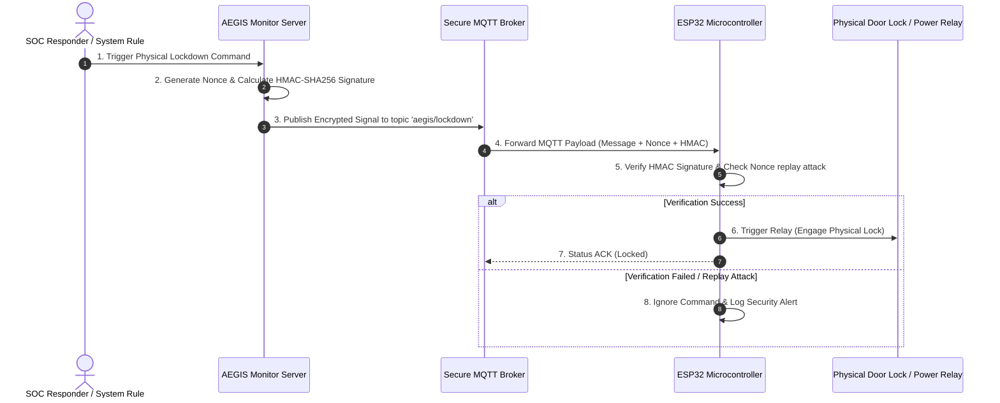

# 🔒 IDEA3: AEGIS Lockdown

> [!warning] Ownership and evidence boundary
> Owner: **Music**. This note currently describes the report/design baseline. Do not promote hardware, firmware or deployment claims to “implemented” until a Music-owned task receipt records concrete test evidence.

> **Primary Function**: Automatic disconnection and physical lockdown system triggered upon critical threats (Physical Emergency Lockdown System). Commands ESP32 microcontrollers via secure MQTT + HMAC-SHA256 protocol.

---

## ⚡ Hardware & Firmware Architecture

---

## 🛠️ Physical Security Features

* **HMAC-SHA256 Validation**: The ESP32 board rejects any commands lacking valid HMAC signatures.
* **Anti-Replay Attack (Nonce)**: Random nonces prevent command interception and replay attacks.
* **Dead Man's Switch**: If heartbeat communication from the central server drops beyond the threshold, the system automatically triggers fail-secure isolation.

---

## 🔗 Related Notes
* [[core/system-overview]]
* [[idea2/idea2-status]]
* [[core/security-architecture]]
