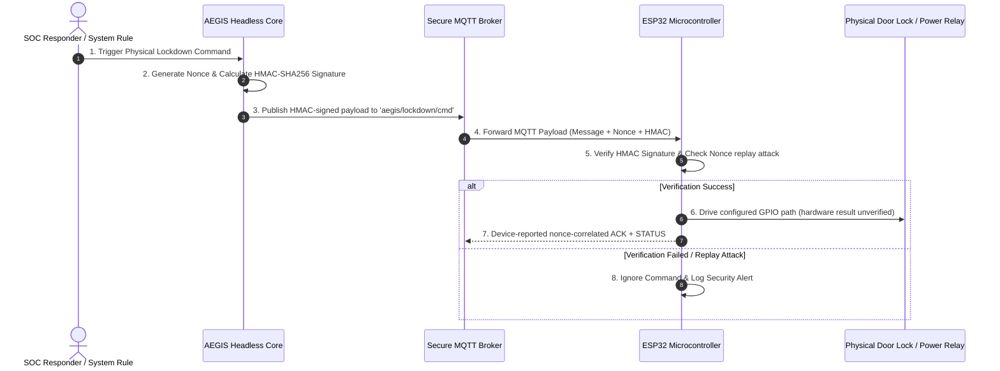

# 🔒 IDEA3: AEGIS Lockdown

> [!warning] Ownership and evidence boundary
> Owner: **Music**. The Security Center and Headless Core from PR #91 are on shared `main`. Project-sequence PR5 was merged through GitHub PR #117 at `58f19f2051170685757627a6baea90b264a877c4`; its owner-observed lab evidence covers the external fail-secure circuit, powered EN/reset behavior, and Router/Switch real-Ethernet CUT/RESTORE within the stated boundaries. PR9 passed its post-PR5 S7 verification at `e5863fc664e239b78f37dd4ce663bc1186f22744`, S8 recorded its one receipt, and GitHub PR #115 was merged by a human reviewer at `2c21cc3e5843bcd75eb1dd2b7f607a745cce254d`. PR9 `PRODUCTION_LIKE_VERIFIED` is local loopback/dry-run evidence only; `PRODUCTION_DEPLOYED = NO`. PR10 is IN PROGRESS. Its S1 documentation (the read-only real deployment inventory and architecture gate) reached `main` when a human reviewer merged GitHub PR #120 at `93170862cbf5b5a802042d12c84944abd39d9123` before PR10 was complete. That merge is a documentation checkpoint only. The owner accepted the PR10 architecture decisions D1–D8 on 2026-09-12, and the read-only live AEGIS Server inventory passed the same day (`LIVE_SERVER_INVENTORY = PASS`). The IDEA3 owner reported Kla's integration approval of the K1–K12 package for the D3/D5 shared infrastructure on 2026-09-12 (architecture/integration only), so **PR10 S1 is PASS / CLOSED**. PR10 remains IN PROGRESS. A human reviewer merged GitHub PR #122 at `b2f61ebf361a5e22f00d28e7e99dcbf3ce006d95`; it is the immutable S1 closeout. The owner approved the continuation model on 2026-09-12. PR10 S2 — the repository-only, non-Production Server → Core accepted-action boundary — is now IN PROGRESS on `feat/idea3-pr10-s2-server-core-boundary`. No Production change is authorized, and nothing is deployed. Read "PR10 pre-flight evidence reconciliation — 2026-09-11" and the PR10 Current Task below first. Total-control-power-loss behavior, deployment-grade mechanical hardening, final relay-cycle Twingate auto-recovery, live adapters, and production deployment remain open. ACK and protocol-correlated STATUS must never be promoted to direct electrical relay proof.

> **Primary Function**: Automatic disconnection and physical lockdown system triggered upon critical threats (Physical Emergency Lockdown System). Commands ESP32 microcontrollers via secure MQTT + HMAC-SHA256 protocol.

---

## PR10 pre-flight evidence reconciliation — 2026-09-11

> [!important] Current IDEA3 truth — read this section first
> Documentation-only audit on `docs/idea3-pr10-preflight-evidence-reconciliation`
> from `origin/main` `9ea9bbfcf40128f4565bc4ba37ba008a62c4879c`. Every fact here
> was re-checked against Git ancestry, GitHub PR metadata, current source, and
> the immutable receipts. No hardware was re-run and no Production system was
> touched. Later sections of this note remain as dated history.

### Verified Git and GitHub state

```text
CURRENT_MAIN = 9ea9bbfcf40128f4565bc4ba37ba008a62c4879c (merge of GitHub PR #116, IDEA1)
PR9 = GitHub PR #115 MERGED 2026-09-10T21:41:47Z (human merge)
PR9_MERGE_COMMIT = 2c21cc3e5843bcd75eb1dd2b7f607a745cce254d (parents 58f19f20 + 09b91528)
PR9_FINAL_HEAD = 09b9152882da4e7068fb883a4b25372953f2c8bc
PR9_FINAL_EVIDENCE_CHECKPOINT = e5863fc664e239b78f37dd4ce663bc1186f22744 (ancestor of main)
PR5 = GitHub PR #117 MERGED 2026-09-10T19:54:01Z at 58f19f2051170685757627a6baea90b264a877c4
OPEN_IDEA3_GITHUB_PRS_BEFORE_THIS_TASK = NONE
PRODUCTION_LIKE_VERIFIED = YES (PR9; local loopback, lab/headless/dry-run only)
PRODUCTION_DEPLOYED = NO
IDEA3_PRODUCTION_COMPLETE = NO
```

### Evidence truth model — preserved

```text
Requested != Published
Published != ACK
ACK != Executed
Executed != Relay Confirmation
Relay Confirmation != Physical Evidence
```

ACK proves only a nonce-correlated device reply. Command-triggered STATUS with a
matching `command_nonce` is device-reported state, not electrical measurement.
Cable-tester continuity is not traffic proof. An MQTT connection is not ESP32
online evidence. Telegram delivery is none of these. Web containment acceptance
stops at `Containment Accepted` with every command/ACK/execution/physical field
`false`.

### Project-sequence PR1–PR9 evidence matrix

The repository explicitly labels PR4–PR9. It does **not** label PR1–PR3; the
mapping below follows the owner's task sequence. By merge date, the 11-page
Security Center (GitHub #62, 2026-09-03) predates the Dashboard (#85) and
Overview (#87) deliveries (both 2026-09-06). Counts are the results recorded at
each task's own checkpoint and are not re-run here.

| Project PR | Scope | GitHub PR → merge commit | Receipt | Recorded evidence | State | Limitations kept |
|---|---|---|---|---|---|---|
| PR1 | Dashboard Mission Control + Thai/English/Chinese UI | #85 → `73daa3e5` | `2026-09-06_032258_music_idea3-dashboard-trilingual-consolidation.md` (`partial` at its checkpoint) | Web 98/98 (15 files); affected 50/50; Vite 1,677 modules; browser QA at 4 presets | CLOSED / MERGED | language selector scoped to Dashboard and shell; monitoring only |
| PR2 | Architecture-first Overview UI Pass 01 | #87 → `2e33595a` | `2026-09-06_034354_music_idea3-overview-ui-pass-01-review.md` (`partial` at its checkpoint) | Web 102/102; affected 31/31; `HEALTHY` needs `FRESH` + parseable timestamp; Light/Dark desktop and 390×844 QA | CLOSED / MERGED | Chromium-only QA; Demo `HEALTHY` is fixture data |
| PR3 | Security Center foundation: 11 pages, Admin session, CSRF, login throttling, headers, Live/Demo | #62 → `1b335f09` | `2026-09-03_034620_music_idea3-security-center-11-page.md` | Web 59/59 (12 files); Vite 1,675 modules; npm audit 0; browser QA of all 11 routes | CLOSED / MERGED | in-memory audit at the time (superseded by PR6) |
| PR4 | Headless Core: ARMED/DISARMED, single command owner, ACK nonce, ACK/STATUS lifecycle, Task 2D6 `command_nonce` | #91 → `a8ea876d` | `2026-09-06_202113_music_idea3-headless-core-pr4.md` | Python 62; Ruff; compileall; firmware compile-only; repository 56/56 | CLOSED / MERGED | no hardware action in that PR |
| PR4 follow-up | Fix1A fail-secure application boot + Deadman cable-tester E2E | #98 → `3f07f80c` | `2026-09-08_005140_music_idea3-fail-secure-boot-deadman.md` | Python 63; firmware compile-only; owner-observed Deadman, reconnect, RESTORE | CLOSED / MERGED | its open 1B result is SUPERSEDED by PR5 |
| PR5 | Final hardware closure: external pull-down + ULN2003, powered EN/reset, real Ethernet | #117 → `58f19f20` | `2026-09-11_004410_music_idea3-pr5-final-hardware-closure.md` | owner-observed lab matrix (below); Python 196 passed / 6 skipped; repository 63/63 | CLOSED / MERGED — OWNER LAB EVIDENCE | power loss NOT PROVEN; Twingate relay-cycle auto-recovery NOT CLAIMED; breadboard |
| PR6 | SQLite audit persistence + production auth hardening | #101 → `5f30bc54` | `2026-09-08_111604_music_idea3-production-reliability.md` | Python 63; Web 168/168 (18 files); npm audit 0; firmware compile-only; repository 56/56 | CLOSED / MERGED | runtime event snapshot store remains non-durable |
| PR7 | Cross-IDEA integration boundary (inventory/design + IDEA3-side implementation) | #106 → `188fbc90`; #104 → `c68946cb` | `2026-09-08_153936_music_idea3-pr7-inventory-design.md`; `2026-09-08_191700_music_idea3-pr7-live-security-implementation.md` (`partial`) | Python 80; Web 277 (22 files); npm audit 0; repository 56/56 | CLOSED / MERGED — IMPLEMENTED_UNEXERCISED | no upstream feed or shared `correlation_key`; stub-only adapter tests |
| PR8 | Windows standalone runtime | #107 → `f320bbf5` (head `25fb442d`) | `2026-09-09_022203_music_idea3-pr8-windows-standalone.md` (`partial`) | Linux Python 145, Web 292; Windows `c7cdc2b2` build OK and staging-bundle smoke 25/25; final `25fb442d` extracted-ZIP 25/25 owner-reported | HISTORICAL COMPLETED IMPLEMENTATION — NOT FINAL DEPLOYMENT TARGET | `25fb442d` build log, ZIP digest, and smoke transcript NOT FOUND IN REPOSITORY |
| PR9 | Production runtime preparation: composite Core+Web service | #115 → `2c21cc3e` (head `09b91528`) | `2026-09-11_040839_music_idea3-pr9-production-runtime.md` | at `e5863fc6`: Python 245 passed / 6 skipped; Web 309/309 (24 files); Vite 1,677; npm audit 0; repository 63/63; `PRODUCTION_LIKE_VERIFIED`; negative controls 13/13 | CLOSED / MERGED | `PRODUCTION_DEPLOYED = NO`; systemd not installed; real Telegram delivery NOT VERIFIED |

### Capability inventory on current `main`

| Area | Implementation | Evidence | Maturity | Open / limitation |
|---|---|---|---|---|
| Web / Security Center | `web/` React/Vite client and Express API; 11 operational pages plus Login in `web/src/pages/`; `server/security/auth.js`, `csrf.js`, `rateLimit.js`; isolated Demo provider; liveness separate from `/security/api/readiness`; Audit page with bounded export | PR3, PR1, PR2, PR6, PR9 receipts | LOCAL VERIFIED | not server-hosted (PR10) |
| Core | `aegis_soc/supervisor.py` `issue_command()` is the single command owner; `set_armed()` with `ARMED` default; automatic containment reuses `issue_command()`; RESTORE needs explicit authorization; no shutdown path sends `RESTORE_UPLINK` | PR4 receipt; `tests/test_runtime.py`, `tests/test_controller.py`; PR9 lifecycle tests | LOCAL VERIFIED | final Arch Linux deployment (PR10) |
| MQTT / protocol | `aegis_soc/security.py` HMAC-SHA256 over action, nonce, and timestamp; firmware `mbedtls` HMAC verify, `MAX_COMMAND_AGE_SEC = 30`, single-use nonce; ACK echoes nonce; command STATUS carries `command_nonce`; `aegis/heartbeat` with 60 s Deadman | PR4 receipt; `tests/test_core.py`, `tests/test_firmware_contract.py`; firmware compile-only; owner physical Deadman (PR4 follow-up, PR5) | SOURCE + LOCAL VERIFIED; physical Deadman owner-observed | final-environment broker/ESP32 baseline (PR10) |
| Persistence / production security | SQLite `SCHEMA_VERSION = 2` (v1 PR6 + additive v2 PR7), `PRAGMA journal_mode = WAL`, reopen/restart durability, bounded Admin reads, allowlisted sanitization, HTTP 503 on audit-write failure; production `SESSION_SECRET` policy, bcrypt Admin hash, development login disabled in production | PR6, PR7 receipts; PR9 acceptance `PERSISTED_ACROSS_RESTART` | LOCAL VERIFIED | backup/restore documented only (PR12) |
| Cross-IDEA boundary | `integrationEvents.js` (`ACCESS_DENIED` only, `subject` always `null`); `httpJsonClient.js` GET-only, per-source bearer, redirect rejection, 2.5 s, 256 KiB, `schema_version=1`, 500-event bound; envelope and per-event freshness; `correlate.js` deterministic `correlation_key` within 10 minutes → `CONTAINMENT_CANDIDATE`; Admin + CSRF containment decision, idempotent, 409 on reversal; durable lifecycle audit | PR7 receipts; PR9 negative controls 13/13 | IMPLEMENTED_UNEXERCISED | live feeds and shared key (PR11) |
| Windows standalone | `windows/` packaging, launcher, external `%LOCALAPPDATA%` data root | PR8 receipt; owner-reported `25fb442d` acceptance | HISTORICAL COMPLETED IMPLEMENTATION | NOT FINAL DEPLOYMENT TARGET; not a PR10 target |
| PR9 production runtime | `aegis_soc/production_runtime.py` start/stop/restart/status/doctor; Core-then-Web start, Web-then-Core stop, fail-on-child-exit peer cleanup; strict production config; `runtime/service-status.json` separated fields; `deploy/aegis-idea3.service.example`; acceptance and 13-case negative-control drivers; `docs/operations/production-runtime.md` | PR9 receipt | PRODUCTION_LIKE_VERIFIED (loopback) | single-host composite topology; systemd example not installed |

### Hardware evidence — owner-observed, not re-run

The authoritative matrix is "Project-sequence PR5 Final Hardware Closure" below
and its receipt. Firmware source agrees with the recorded polarity:
`RELAY_IN = 27`, `RELAY_TRIGGER = LOW`, `RELAY_RELEASE = HIGH`.

```text
GPIO27 LOW  = LOCKDOWN / CUT
GPIO27 HIGH = NORMAL / RESTORE
PHYSICAL_LOCKDOWN_PIN2 = PASS
PHYSICAL_RESTORE_PIN2 = PASS
RESET_WINDOW_1B = PASS (powered control circuit only)
RECONNECT_DOES_NOT_AUTO_RESTORE = PASS
EXPLICIT_RESTORE_REQUIRED = PASS
REAL_ETHERNET_RESTORE_BASELINE = PASS
REAL_ETHERNET_CUT = PASS
REAL_ETHERNET_RESTORE_RECOVERY = PASS
SSH_CUT_EFFECT = PASS
SSH_POST_RESTORE_RECONNECT = PASS
TWINGATE_DIRECT_BASELINE = PASS
TWINGATE_CONNECTOR_HEALTH_AFTER_MANUAL_RESTART = PASS
TOTAL_CONTROL_POWER_LOSS_FAIL_SECURE = NOT PROVEN
TWINGATE_FINAL_RELAY_CYCLE_AUTO_RECOVERY = NOT CLAIMED / NOT CONCLUSIVELY VERIFIED
MECHANICAL_BREADBOARD_STABILITY = PROTOTYPE LIMITATION
HARDWARE_RERUN_IN_THIS_RECONCILIATION = NO
```

### Historical and superseded items

| Item | Repository finding | Classification |
|---|---|---|
| Dashboard UI Pass / trilingual UI | original checkpoint `eaa605db` on `origin/feature/aegis-security-ui-redesign` is not an ancestor of `main`; its behaviour reached `main` through #85 (`431124ff`) | HISTORICAL — delivered by PR1; old branch receipts intentionally not copied |
| Overview UI Pass 01 | historical checkpoint `d7f1c57e` is not present in this clone; the #87 receipt records exact source parity with it before merge | HISTORICAL — delivered by PR2 |
| IDEA1-hosted file-backed IDEA3 status bridge (`AEGIS_IDEA3_STATUS_PATH`, `IDEA1-AEGIS_Drive_LC/server/idea3/status.js`) | merged by #60 (`7a7936bf`), reverted on `main` by `5473e552`; absent from `main` | SUPERSEDED / REVERTED |
| "Web Runtime Integration Pass 01", old file-backed IDEA3 runtime adapter, old runtime evidence helper | no commit, branch, file, or receipt in any fetched ref | NOT FOUND IN REPOSITORY — no current functionality gap identified |
| Current runtime integration | `AEGIS_IDEA3_RUNTIME_STATUS_URL` → `web/server/config.js` → `liveProvider.js` HTTP JSON → `normalizeRuntimeStatus()`; PR8/PR9 owners point it at the Core loopback `/v1/core-status` | CURRENT |
| Same-`sourceIp` correlation heuristic (PR3) | removed by PR7; `correlate.js` no longer references `sourceIp` | SUPERSEDED |
| In-memory Web audit (PR3) | replaced by durable SQLite (PR6, schema v2 in PR7) | SUPERSEDED |
| Core-only `deploy/aegis-supervisor.service.example` (PR4) | deleted by PR9; replaced by composite `aegis-idea3.service.example` | SUPERSEDED |
| Legacy `normalizeIdea1Event` / `normalizeIdea2Event` | still exported by `web/server/domain/normalize.js`; unreachable from `liveProvider` | HISTORICAL CODE — cleanup unscheduled |
| 2026-09-08 roadmap numbering (PR8 hardware, PR9 Kali, PR10 Windows, PR11 deployment) and the later PR7-merge roadmap (PR10 hardware closure, PR11 Kali) | hardware closure shipped as project PR5 (#117); Windows as PR8; runtime preparation as PR9 | SUPERSEDED — current PR10–PR12 scope below |

### Stale facts corrected by this reconciliation

- PR9 / GitHub PR #115 described as awaiting human review and not merged → MERGED
  at `2c21cc3e` (top callout, PR5 block, PR9 task, dashboard, remaining work,
  handoff, and the IDEA3 MOC entry statement).
- PR9 Current Task, Session Register, and Handoff relabelled as historical.
- Both older roadmap blocks relabelled SUPERSEDED.
- Security Center (2026-09-04) section: same-IP correlation, SQLite schema v1,
  "final real-hardware closure deferred", and "Current" Overview-pass evidence
  relabelled against later evidence.

### Contradictions outside this note — not edited here

- `AGENTS.md` ownership table and `core/agent-operating-rules.md` still say IDEA3
  implementation is not established, and `START_HERE.md` still describes IDEA3
  as design/report state until hardware proof. These are Kla-owned shared
  surfaces; the PR7 inventory receipt already requested the correction and it
  remains unresolved.
- `IDEA3-AEGIS_Lockdown/README.md`, `PROGRESS.md`, and
  `doc/Content/04_SESSION_HANDOFF.md` still describe PR #115 as awaiting review,
  and the handoff plus the PR6/PR7 specs and plans still carry the superseded
  PR8–PR12 numbering. IDEA3-owned; left for a separate source-document update
  because this task is limited to the canonical Obsidian notes.
- PR1–PR3 labels differ from merge chronology (see the matrix note).
- PR9 implemented a **single-host** composite service: one service account, Core
  and Web under one owner, `AEGIS_BIND_HOST=127.0.0.1`. The PR10 target below
  splits Web (AEGIS Server) from Core (Arch Linux). No split-host or
  Server-to-Core boundary exists in source: NOT IMPLEMENTED.

### PR10 — server-hosted deployment: IN PROGRESS (S1 documentation merged via PR #120; D1–D8 owner-accepted; live server inventory PASS; K1–K12 Kla-approved; S1 PASS / CLOSED; S2 IN PROGRESS)

Target architecture as defined by the owner on 2026-09-11. It has not yet been
designed in a repository spec or plan; the S1 inventory is
`IDEA3-AEGIS_Lockdown/docs/operations/PR10_DEPLOYMENT_INVENTORY.md`:

```text
AEGIS Server : React static build, Express, SQLite, integration adapters, correlation, accepted-action state
Arch Linux   : Python Core, Supervisor, Controller, MQTT command ownership, heartbeat
ESP32        : MQTT client, HMAC, nonce, ACK, STATUS, heartbeat, relay output
Browser      : never owns MQTT actuation
```

```text
SERVER_HOSTED_IDEA3_WEB_DEPLOYMENT = OPEN
ARCH_LINUX_CORE_FINAL_DEPLOYMENT = OPEN
REAL_SYSTEMD_INSTALLATION = OPEN (example only)
SERVER_TO_CORE_DURABLE_ACCEPTED_ACTION_BOUNDARY = OPEN / NOT IMPLEMENTED
REAL_MQTT_FINAL_ENVIRONMENT_BASELINE = OPEN
REAL_ESP32_BROKER_BASELINE = OPEN
REAL_CLIENT_TO_SERVER_IDEA3_ACCESS = OPEN
RESTART_RECOVERY_BASELINE = OPEN (PR9 proved loopback restart only)
```

### PR10 Current Task

Task: IDEA3 PR10 — real Arch Linux Core + server-hosted IDEA3 Web deployment baseline
Branch: `feat/idea3-pr10-real-deployment` (S1 branch; merged through PR #120, receives no further commits)
Owner: `music`
PR: GitHub PR #120 — MERGED by a human reviewer at `93170862cbf5b5a802042d12c84944abd39d9123` (2026-09-11T16:21:40Z) while PR10 was still IN PROGRESS; see "PR10 workflow exception" below
Workflow-recovery branch: `docs/idea3-pr10-postmerge-reconciliation` — GitHub PR #121 (docs-only reconciliation; not S2). Its single receipt, `90-Status/logs/2026-09-11_234455_music_idea3-pr10-postmerge-reconciliation.md`, covers the reconciliation only and is not the PR10 final receipt
S1 closeout branch: `docs/idea3-pr10-d1-d8-architecture-decisions` — GitHub PR #122 (docs-only: D1–D8, the S1 live inventory, the K1–K12 package and its Kla approval, and the S1 closeout receipt; not S2) — MERGED by a human reviewer at `b2f61ebf361a5e22f00d28e7e99dcbf3ce006d95` (2026-09-12). It is immutable and receives no further commits
S2 task branch: `feat/idea3-pr10-s2-server-core-boundary` — the new task and PR for PR10 S2 (repository-only, non-Production). The PR is not yet opened. Its one receipt will be an S2 receipt, not the final PR10 receipt
Current state: IN PROGRESS
Started: 2026-09-11
Base SHA: `895c79ac8ab9b39f322919fabc9facfdc34ba20b` (PR10 start); S2 base `b2f61ebf361a5e22f00d28e7e99dcbf3ce006d95`
Last checkpoint: S1 `ea2414f44445b9c090e0794ea086e098913d5a45` (reviewed S1 pre-closeout head); S2 G1 `32545cebcba8bd8ed9f7a60a930a5e622d8aa717` (design + TDD plan with the topology and configurable-bind clarifications; awaiting owner review)
Production mutation allowed: NO (S1, S2)
Hardware testing: NOT RUN

```text
PR120                     = MERGED (93170862cbf5b5a802042d12c84944abd39d9123) — documentation checkpoint only
PR10_STATE                = IN PROGRESS
D1_D8                     = DECIDED / OWNER-ACCEPTED (2026-09-12) — architecture only, not implemented
LIVE_SERVER_INVENTORY     = PASS (2026-09-12, read-only)
KLA_DECISIONS_K1_K12      = APPROVED (2026-09-12)
KLA_INTEGRATION_APPROVAL  = APPROVED (architecture/integration only)
PRODUCTION_CHANGE_AUTHORIZED = NONE
S1                        = PASS / CLOSED (2026-09-12)
OWNER_CONTINUATION_APPROVAL = APPROVED (2026-09-12)
READY_FOR_PR10_S2         = YES
PR10_S2                   = IN PROGRESS (G1: design + TDD plan; source not started)
S2_STARTED                = YES (2026-09-12)
PRODUCTION_DEPLOYED       = NO
IDEA3_PRODUCTION_COMPLETE = NO
PRODUCTION_MUTATION       = NONE
HARDWARE_TESTING          = NOT RUN
FINAL_PR10_RECEIPT        = NONE
```

Goal: a real, evidence-backed deployment baseline with IDEA3 Web on the AEGIS
Server at `/security/` and the Python Core on an Arch Linux host, joined by a
durable, authenticated Server → Core accepted-action boundary. Out of scope for
S1: deployment, systemd, packages, firewall, proxy, Docker, Twingate, broker
configuration, MQTT actuation, firmware, and IDEA1/IDEA2/HUB source. Acceptance
for S1: the owner decides the architecture (D1–D8, done 2026-09-12); the live
server inventory passes (done 2026-09-12); Kla approves the K1–K12 integration
package for the D3/D5 shared infrastructure (done 2026-09-12). All three are
met, so S1 is PASS / CLOSED.

S1 findings (public-safe summary; evidence labels are in the inventory document,
and host-level specifics are deliberately not published):

- The initial S1 attempt had `SERVER_ACCESS = ACCESS_NOT_AVAILABLE`. The
  read-only live AEGIS Server inventory on 2026-09-12 then passed; see "PR10 S1
  live AEGIS Server inventory" below.
- The Arch Core host is a CANDIDATE, NOT READY. It is not yet attached to the
  final AEGIS network segment, its hardening is not at a production baseline, and
  it already hosts an MQTT broker and IDEA2-owned services.
- The current MQTT baseline requires production hardening before PR10
  deployment. Recorded ESP32 sessions used a temporary lab network outside the
  AEGIS VLANs. D1 now selects a dedicated private access point on the Core host
  (decided, not implemented).
- `/security/` reverse-proxy integration requires design and review (D3). The
  current production Web assumes loopback-only access, and Express mounts
  `/security` itself, so a proxy must forward the full path.
- CUT isolates the whole server, including server-hosted remote access. The
  Core, broker, RESTORE authority, and post-publish evidence must remain
  available independently of the relayed server uplink (D2, D4). A durable
  Server → Core boundary is required, and the browser must not own MQTT
  actuation.

### PR10 workflow exception — premature merge of PR #120

PR #120 was merged by a human while it still represented the S1
inventory/architecture checkpoint. The merge records the S1 documentation on
`main` but does not satisfy the PR10 completion gate. PR10 remains IN PROGRESS
and S2 was blocked pending the stated prerequisites. The owner approved the
continuation on 2026-09-12.

Verified facts (GitHub and Git, 2026-09-11):

- PR #120 was marked Ready at 16:21:33Z and merged at 16:21:40Z. The
  collaboration-guardrails run on that Ready transition (`34621524129`) failed:
  "A final Obsidian task receipt is required before Ready/non-Draft review;
  found 0." Before that, the PR's valid Draft run had passed.
- Merge commit `93170862cbf5b5a802042d12c84944abd39d9123` has parents
  `895c79ac` and `54bb6a08`, and its tree is identical to the reviewed head
  `54bb6a08`. The merge brought in only the three public-safe IDEA3 S1 files:
  the inventory, this note, and the IDEA3 MOC.
- No PR10 task receipt exists. None was created, because PR10 has not reached
  its final handoff.

The merge does **not** mean:

- S1 PASS or S1 CLOSED;
- PR10 CLOSED;
- Production deployment;
- S2 authorization.

The merged S1 documentation is correct and public-safe, so it is kept. No
revert, reset, or rewrite of `main` is proposed.

**Continuation model — APPROVED by the owner on 2026-09-12:**

- PR10 remains the project-sequence umbrella for the real deployment baseline.
- The original "one open PR for all PR10 sessions" lifecycle cannot continue,
  because its PR is already merged. That is the only reason a new PR is needed;
  PR10 is not complete.
- Future implementation continues as a new, explicitly named IDEA3 task branch
  and PR beginning with S2. It must reference PR #120, merge commit
  `93170862cbf5b5a802042d12c84944abd39d9123`, the S1 inventory, and this
  reconciliation. It may start only after the S2 prerequisites below are met
  and the owner approves.
- The single final PR10 receipt belongs to the PR that performs the PR10 final
  handoff. It must record PR #120 as a premature human merge of the S1
  documentation checkpoint.
- S2 started on 2026-09-12 as the new task branch
  `feat/idea3-pr10-s2-server-core-boundary`; see "PR10 Session S2" below.

### PR10 architecture decisions D1–D8 — owner-accepted 2026-09-12

The owner accepted this decision set on 2026-09-12. It is architecture only:
nothing here is implemented, installed, configured, deployed, or flashed. The
detailed record is §14 of
`IDEA3-AEGIS_Lockdown/docs/operations/PR10_DEPLOYMENT_INVENTORY.md`.

| ID | Accepted decision |
|---|---|
| D1 | The Core host runs a dedicated private Wi-Fi access point for the ESP32 only. Nothing is forwarded or routed from it; the ESP32 reaches the Core and MQTT directly; the Core provides the ESP32's time source. No new access-point hardware or VLAN. |
| D2 | The MQTT broker runs on the Core host and listens only on the access-point address plus loopback. Separate Core and ESP32 credentials, a per-topic ACL, and no anonymous access. The host firewall blocks MQTT from the wired/uplink side. MQTT uses TLS, and the ESP32 verifies the broker against a pinned private CA. The ESP32 signs ACK and STATUS, and the Core verifies them. |
| D3 | IDEA3 Web runs as a hardened container on a dedicated internal network behind HUB/NGINX at `/security/`, with no direct public host port. NGINX is the single owner of browser-facing security headers and CSP, and parity tests verify the intended IDEA3 policy. |
| D4 | RESTORE during LOCKDOWN is authorized only through an authenticated, audited Core-local CLI (for example `aegisctl restore`), run from the console or approved Management-VLAN SSH, through the Core's single command owner. It is never automatic and requires explicit operator confirmation, reason, and incident context. There is no Telegram or Web recovery authority. |
| D5 | The Core pulls, claims, and reports server dispatch actions through HUB HTTPS 443 on a dedicated machine path under `/security/`. A HUB edge guard restricts that path to the Core host and hides it from normal users, and an mTLS client certificate authenticates the Core. No new published server port. Route ownership needs Kla/infrastructure review before implementation. |
| D6 | The current Arch laptop becomes a dedicated Core appliance: personal desktop use stops; it gets a dedicated service account and production hardening; sleep, suspend, and lid-suspend are disabled; its host firewall denies by default; maintenance happens in controlled windows because Core downtime can trigger a Deadman CUT. Its wired segment is VLAN 20 via switch port 3, and its Wi-Fi is reserved for the D1 access point. IDEA2 may remain only if separately approved, unprivileged, isolated, and kept off the ESP32 AP/control boundary. |
| D7 | One unique `action_id` per accepted incident, with terminal single-shot claims. The claim is an atomic `PENDING_DISPATCH → CORE_CLAIMED` transition, and a claimed action is never re-dispatched automatically. A CUT action expires 120 s after acceptance; the Core re-checks expiry before publishing, and expired actions are never published. No valid ACK or no correlated STATUS gives `OUTCOME_UNKNOWN`, which requires human review. No automatic retry. Device STATUS remains the physical-state evidence source. |
| D8 | Production Web uses a bounded in-memory TTL session store. It keeps the current login, CSRF, and logout semantics and the existing secure cookie policy. The idle timeout is `AEGIS_SESSION_IDLE_MS`, default 30 minutes. The store caps its entries and prunes periodically. No auth session state is persisted to disk, so a container restart invalidates sessions and logs the Admin out. |

The authorized read-only live AEGIS Server inventory is done
(`LIVE_SERVER_INVENTORY = PASS`, 2026-09-12). The last S1 gate was the
Kla/integration-owner decision, and its reconciliation, for the D3/D5 shared
infrastructure. That includes `/security/` ownership in the runtime and Git
HUB configurations, the HUB↔IDEA3 network and subnet, mTLS placement and CA
ownership, and sequencing relative to PR #118 / S5.5.

That decision set was prepared as the K1–K12 review package (see "PR10 S1 Kla
review package K1–K12" below) and accepted for owner review. Kla then approved
it for architecture/integration (reported 2026-09-12), which closed the gate.

Current state:

```text
D1_D8 = DECIDED / OWNER-ACCEPTED
LIVE_SERVER_INVENTORY = PASS
KLA_DECISIONS_K1_K12 = APPROVED
KLA_INTEGRATION_APPROVAL = APPROVED
PRODUCTION_CHANGE_AUTHORIZED = NONE
S1 = PASS / CLOSED
OWNER_CONTINUATION_APPROVAL = APPROVED (2026-09-12)
READY_FOR_PR10_S2 = YES
S2_STARTED = YES (2026-09-12; repository-only, non-Production)
PRODUCTION_MUTATION = NONE
HARDWARE_TESTING = NOT RUN
```

### PR10 S1 live AEGIS Server inventory — 2026-09-12 (read-only) — PASS

This is a public-safe summary; the full record with evidence labels is §2A of
`IDEA3-AEGIS_Lockdown/docs/operations/PR10_DEPLOYMENT_INVENTORY.md`. Evidence
came from unprivileged read-only SSH reads and root-only read-only reads run by
the owner. Nothing was changed on the server, and no hardware was touched.

- **OBSERVED:**
  - The HUB is the single host-published browser entry (80 → HTTPS, 443 TLS).
    `/drive/` and `/monitor/` exist in the active NGINX; **`/security/` does not
    exist**; no mTLS client-certificate route is deployed.
  - The host runtime NGINX configuration matched the HUB container-loaded
    configuration at the observed time, but it still differs from Git
    (`DRIFT_FOUND = YES`).
  - The firewall uses `nf_tables` with `INPUT DROP`, `FORWARD DROP`,
    `OUTPUT ACCEPT`. `AEGIS-PS-EGRESS` is anchored first in `DOCKER-USER`, and
    `AEGIS-PS-INPUT` comes before the UFW input chains.
  - **S5.5 is PARTIALLY PRESENT**: the egress network and `AEGIS-PS-*` chains
    exist, but the connector is not running and no S5.5 runtime file or systemd
    unit was observed. It is neither fully deployed nor fully absent.
  - A candidate IDEA3 /29 did not overlap the observed live Docker IPv4
    subnets. Final allocation belongs to the Kla/integration owner.
  - The last 24 h of HUB logs showed only Docker-gateway and loopback source
    classes.
- **INFERRED / FEASIBLE:**
  - **D3 is FEASIBLE**: a hardened IDEA3 container on a dedicated internal
    network behind the HUB at `/security/`, with no direct public IDEA3 port.
  - **D5 is FEASIBLE WITH CONDITIONS**: Core → HUB HTTPS 443, with D5 mTLS as
    the primary machine authentication.
- **NOT PROVEN:**
  - preservation of the real Core source address at the HUB, so source
    allowlisting remains defense-in-depth only;
  - the Core → HUB path from VLAN 20 (not tested);
  - whether the S5.5 chains persist across a host reboot.
- **PROPOSED:** the D3/D5 components, which are not deployed.

`PRODUCTION_MUTATION = NONE`; `HARDWARE_TESTING = NOT RUN`.

### PR10 S1 Kla review package K1–K12 — APPROVED (architecture/integration only)

On 2026-09-12 the owner accepted the recommended direction of every K-decision
for the D3/D5 shared infrastructure for owner review. The IDEA3 owner then
reported Kla's integration approval of K1–K12 the same day, which closed the S1
gate. **Provenance:** relayed by the IDEA3 owner; no approval comment or review
was on PR #122 at closeout. After closeout, Kla's GitHub account submitted an
APPROVED review of PR #122 (2026-09-12T07:58:33Z, no review text) and merged it
at `b2f61ebf`.

- **Scope:** the approval is **architecture/integration only** and authorizes
  **no Production change**. Every future shared-infrastructure change needs its
  own reviewed, authorized change, and the PR10 Production rollout stays
  **blocked** until then.
- **External dependencies stay separately owned:**
  - K12: Kla + IDEA1 confirmation before any PR10 Production rollout;
  - D6: separate Pub/IDEA2 approval for IDEA2 co-residence.
- `LIVE_SERVER_INVENTORY = PASS`.
- The full package, with implementation conditions and NOT PROVEN items, is
  §15A of `IDEA3-AEGIS_Lockdown/docs/operations/PR10_DEPLOYMENT_INVENTORY.md`.

| K | Subject | Accepted direction (summary) | Status |
|---|---|---|---|
| K1 | HUB NGINX ownership | Kla is the single editor in Git and Production; reconcile the Git↔runtime drift first; `/security/` only after that baseline; IDEA3 supplies the contract, policy, and tests | APPROVED |
| K2 | `/security/` contract | Redirect, full-path proxy, no host port; NGINX owns the headers and CSP; single-hop headers with `Host` preserved; machine path 404 on the browser block; parity tests; enumerate every Helmet header first | APPROVED |
| K3 | Sequencing with PR #118 / S5.5 | S5.5 stable or rolled back first; separate windows and rollbacks; non-Production work continues | APPROVED |
| K4 | IDEA3 subnet | The non-colliding candidate `/29`: HUB `.2` pinned, IDEA3 Web `.3`; Kla allocates and records it | APPROVED |
| K5 | IDEA3 network | `internal: true`, not attachable, HUB and IDEA3 Web only; Music owns the service; Kla owns the network and the HUB's membership | APPROVED |
| K6 | Server firewall | PR10 adds no server firewall or UFW rules; never touches the S5.5 chains; any future rule is a separate Kla change after the S5.5 anchors | APPROVED |
| K7 | HUB network join | Managed Compose recreate of the HUB only; canonical file order updated; validated, announced window; rollback to the previous list | APPROVED |
| K8 | Machine route | HUB 443 only; router allows VLAN 20 → 443; acceptance test from VLAN 20 | APPROVED |
| K9 | mTLS server name | Separate SNI block with a required client certificate; browser block stays `default_server`; verified identity headers only from the HUB | APPROVED |
| K10 | Machine-client CA | Dedicated `clientAuth` CA; Kla holds the key offline; Core key stays on the Core; ~90-day certificates; local CRL plus subject check | APPROVED |
| K11 | Source allowlisting | mTLS primary; allowlist optional and only once real source is proven; never the Docker gateway address | APPROVED |
| K12 | Partial S5.5 state (Kla + IDEA1) | Confirm the intent and reboot persistence in writing before any PR10 rollout; reboot outside both windows | APPROVED |

### PR10 Session Register

| ID | Scope | State | Evidence | Checkpoint | Result | Remaining | Next |
|---|---|---|---|---|---|---|---|
| S1 | Real infrastructure inventory + architecture gate (read-only) | CLOSED | `IDEA3-AEGIS_Lockdown/docs/operations/PR10_DEPLOYMENT_INVENTORY.md` (§2A, §14, §15, §15A); PR #122 checks; `git diff --check`; vault validation; receipt `90-Status/logs/2026-09-12_141734_music_idea3-pr10-s1-architecture-gate.md` | `ea2414f44445b9c090e0794ea086e098913d5a45` (reviewed pre-closeout head; earlier `8250d694`) | PASS — D1–D8 DECIDED / OWNER-ACCEPTED; LIVE SERVER INVENTORY PASS; K1–K12 KLA-APPROVED (architecture/integration only, 2026-09-12); PR #120 remains a merged documentation checkpoint; no Production change authorized | — (S1 closed) | S2 — the owner approved the continuation model on 2026-09-12; new task branch `feat/idea3-pr10-s2-server-core-boundary` |
| S2 | Server → Core durable accepted-action boundary (repository-only: design, TDD plan, source, tests; non-Production) | IN PROGRESS | G1: design spec + TDD plan (documentation only; no source changed); `git diff --check`, vault and Draft policy validation pass | `32545cebcba8bd8ed9f7a60a930a5e622d8aa717` (G1: design + plan, with the machine-listener topology and configurable-bind clarifications — AWAITING OWNER REVIEW; earlier G1 checkpoints `6076ef85`, `f1c5c1e1`) | pending | G1 owner review; then Tasks 0–11 of the plan | G1 owner review — no source change before explicit approval |

### PR10 Session S2 — Server → Core durable accepted-action boundary

State: IN PROGRESS — G1 checkpoint `32545cebcba8bd8ed9f7a60a930a5e622d8aa717` is AWAITING OWNER REVIEW. It is the design + TDD plan, plus two clarifications:

- **Topology:** the machine listener is container-internal, has no host-published port, and is reachable only over the HUB↔IDEA3 internal network.
- **Bind address:** it comes from `AEGIS_IDEA3_DISPATCH_HOST`. Local and test runs default to `127.0.0.1`; loopback is never hard-coded; the Production value is not selected in S2 and is deferred to K4/K5/K7.

Earlier G1 checkpoints: `6076ef85`, `f1c5c1e1`. Source not started
Started: 2026-09-12
Branch: `feat/idea3-pr10-s2-server-core-boundary`
Starting SHA: `b2f61ebf361a5e22f00d28e7e99dcbf3ce006d95` (merge of GitHub PR #122)
Production mutation allowed: NO
Evidence class: LOCAL / SIMULATED only

**Continuation references:**

- PR #120 and merge commit `93170862cbf5b5a802042d12c84944abd39d9123`, the
  premature S1 documentation checkpoint;
- the S1 inventory,
  `IDEA3-AEGIS_Lockdown/docs/operations/PR10_DEPLOYMENT_INVENTORY.md`;
- PR #121, the post-merge reconciliation;
- PR #122 (`b2f61ebf`), the S1 closeout.

**Plan:** the owner approved the kickoff definition on 2026-09-12. The work
runs in this order:

1. write the design spec and TDD plan;
2. **G1 owner review — stop;**
3. baseline the regression suites;
4. implement the Web schema v3, minting, machine app, and evidence;
5. implement the Core ledger, client, and worker;
6. add the shared contract fixture;
7. run the negative controls NC1–NC5;
8. run the full regression;
9. canonical closeout with one S2 receipt;
10. open a Draft PR and stop before Ready.

- **Spec:**
  `IDEA3-AEGIS_Lockdown/docs/superpowers/specs/2026-09-12-idea3-pr10-s2-server-core-boundary-design.md`
- **Plan:**
  `IDEA3-AEGIS_Lockdown/docs/superpowers/plans/2026-09-12-idea3-pr10-s2-server-core-boundary.md`

**Why:** `SERVER_TO_CORE_DURABLE_ACCEPTED_ACTION_BOUNDARY = OPEN / NOT
IMPLEMENTED`. Inventory §13.3 defines the boundary constraints for S2, and D7
defines the claim model.

**Scope:** limited to the §13.3 boundary, D7, and the IDEA3 side of D5.

- **Web:**
  - additive schema v3;
  - Admin acceptance mints one `action_id` with a 120 s TTL;
  - atomic single-shot claim;
  - machine identity (pinned HUB peer + verified mTLS headers + expected
    subject);
  - append-only reconciliation;
  - dispatch status display.
- **Core:**
  - durable dispatch ledger;
  - dispatch client;
  - claim → publish only through `issue_command`;
  - reconciliation outbox;
  - credential pause.
- **Default:** both halves are disabled by default.

**Expected changes:** only IDEA3 paths, as listed in the plan: Web server,
tests, dashboard/i18n, Core modules and tests, `.env.example`, the spec and
plan, and the canonical IDEA3 notes.

**Expected evidence:**

- W1–W14, C1–C10, and NC1–NC5;
- the regression suites against the Task 0 baseline;
- the PR9 drivers (`PRODUCTION_LIKE_VERIFIED`, 13/13);
- vault, policy, diff, and secret checks.

**Safety / Do-not-touch:**

- **Production:** no Production deployment or Production database migration.
- **Edge and network:** no live HUB, NGINX, Docker, Compose, or network
  change; no firewall, UFW, or nftables change; no router, VLAN, or Twingate
  change.
- **Credentials:** no real certificate or CA issuance or installation.
- **Hardware:** no firmware flashing; no hardware CUT/RESTORE.
- **Other owners:** no IDEA1, IDEA2, or shared-infrastructure mutation.
- **Access:** no SSH to the server or the Core host.
- **Deferred:** every Production-facing K1–K12 action.

**Dependencies:**

- **Inherited K constraints:** K2 machine-path 404 contract, K4 pinned peer,
  K9 identity headers, K10 subject and credential pause, K11 no allowlist,
  K5 Core pulls.
- **Before any rollout:** K12 (Kla + IDEA1).
- **Separately owned:** D6 (Pub/IDEA2).

### PR11 — live cross-IDEA and authorized E2E: OPEN

```text
LIVE_IDEA1_SERVICE_EVENT_FEED = OPEN
LIVE_IDEA2_SERVICE_EVENT_FEED = OPEN
SHARED_CORRELATION_KEY = OPEN
ADMIN_ACCEPTED_TO_CORE = OPEN
CORE_TO_MQTT_TO_ESP32_E2E = OPEN
AUTHORIZED_KALI_E2E = OPEN
PHYSICAL_CUT_E2E = OPEN
RESTORE_RECOVERY_E2E = OPEN
```

### PR12 — final acceptance: OPEN

```text
REBOOT_ACCEPTANCE = OPEN
BACKUP_RESTORE_ACCEPTANCE = OPEN (documented only)
ROLLBACK_ACCEPTANCE = OPEN (documented only)
FINAL_SECURITY_REGRESSION = OPEN
FINAL_REAL_E2E_RERUN = OPEN
EVIDENCE_FREEZE = OPEN
REPORT_BASELINE = OPEN
PRODUCTION_COMPLETE_DECISION = OPEN
REAL_TELEGRAM_PRODUCTION_DELIVERY = NOT VERIFIED
IDEA3_PRODUCTION_COMPLETE = NO
```

### Pre-flight reconciliation task record — historical

Task: IDEA3 PR10 pre-flight evidence audit and Obsidian reconciliation
Branch: `docs/idea3-pr10-preflight-evidence-reconciliation`
Owner: `music`
PR: GitHub PR #119, merged into `main` at `895c79ac8ab9b39f322919fabc9facfdc34ba20b`
Current state: CLOSED — documentation-only; merged
Started: 2026-09-11
Base SHA: `9ea9bbfcf40128f4565bc4ba37ba008a62c4879c`
Production mutation allowed: NO
Hardware testing: NOT RUN

### Pre-flight Session Register — historical

| ID | Scope | State | Evidence | Checkpoint | Result | Remaining | Next |
|---|---|---|---|---|---|---|---|
| S1 | Git, GitHub, source, and receipt audit; canonical reconciliation | CLOSED | this section; vault validation, collaboration-policy tests, `git diff --check` | documentation-only commit (SHA in the PR) | PASS | — (merged via #119) | PR10 S1 inventory (see PR10 Current Task above) |

### Pre-flight handoff — historical (superseded by the PR10 Current Task)

Next action at that checkpoint: human review of this reconciliation PR. Then, under a separately
authorized task, design the PR10 split-host deployment and the Server-to-Core
durable accepted-action boundary starting from the PR9 composite runtime. Do not
deploy, install systemd, contact a broker, ESP32, relay, or network device,
restore the Windows standalone as the deployment target, or let an agent merge.

---

## Project-sequence PR5 Final Hardware Closure — MERGED (2026-09-11)

```text
PR5 FINAL HARDWARE CLOSURE = MERGED / OWNER LAB EVIDENCE ACCEPTED
PR5 PR #117 MERGE COMMIT = 58f19f2051170685757627a6baea90b264a877c4
PR9_PR115_PR5_GATE = SATISFIED
PR9 #115 = MERGED at 2c21cc3e5843bcd75eb1dd2b7f607a745cce254d (S7 PASS / S8 CLOSED)
TOTAL_CONTROL_POWER_LOSS_FAIL_SECURE = NOT PROVEN
TWINGATE_FINAL_RELAY_CYCLE_AUTO_RECOVERY = NOT CLAIMED / NOT CONCLUSIVELY VERIFIED
MECHANICAL_BREADBOARD_STABILITY = PROTOTYPE LIMITATION
IDEA3_PRODUCTION_COMPLETE = NO
```

This PR records owner-observed evidence; Codex did not flash firmware, reset the
ESP32, publish a hardware command, change network state, or manipulate the
circuit. The firmware semantic contract is unchanged:

```text
GPIO27 LOW  = LOCKDOWN / CUT
GPIO27 HIGH = NORMAL / RESTORE
```

### Accepted final topology and polarity

```text
ESP32 GPIO27
  ├─ 10 kΩ pull-down → GND
  └─ ULN2003 IN1

ULN2003
  + → +5 V
  - → common GND
  OUT1 → Relay IN node

Relay IN node
  ULN2003 OUT1 + 10 kΩ pull-up → +5 V
Relay VCC/DC+ → +5 V
Relay GND/DC- → common GND
trigger jumper → H

Ethernet Pin 2
  TP-Link side Pin 2 → Terminal CH1 → Relay COM → Relay NC
  → Terminal CH2 → Beelink side Pin 2
Relay NO unused
```

ULN2003 OUT1 was continuity-verified against chip pin 16. External inversion
produces the required fail-secure relay semantics:

- GPIO27 LOW → ULN OFF / OUT high-impedance → 10 kΩ pull-up drives Relay IN
  HIGH → high-trigger relay activates → COM-NC opens → Pin 2 CUT.
- GPIO27 HIGH → ULN ON → OUT sinks Relay IN LOW → relay releases → COM-NC
  closes → Pin 2 restored.
- RESTORE/NORMAL LEDs: red power ON, green trigger OFF, network passes.
- CUT/LOCKDOWN LEDs: red power ON, green trigger ON, network blocked.

### Physical RJ45 continuity — PASS

```text
RESTORE: 1 2 3 4 5 6 7 8
CUT:     1 _ 3 4 5 6 7 8
RESTORE: 1 2 3 4 5 6 7 8

PHYSICAL_LOCKDOWN_PIN2=PASS
PHYSICAL_RESTORE_PIN2=PASS
```

This establishes the selected Pin 2 contact behavior only; cable-tester
continuity is not treated as Ethernet traffic proof.

### Powered electrical reset-window 1B — PASS within stated scope

Starting from CUT with Pin 2 absent, Pin 2 remained absent while EN was held,
after release/reboot, and after the ESP32 and broker reconnected. Reconnect did
not auto-restore the uplink. Only an explicit authenticated RESTORE returned
Pins 1–8.

```text
RESET_WINDOW_1B=PASS
RECONNECT_DOES_NOT_AUTO_RESTORE=PASS
EXPLICIT_RESTORE_REQUIRED=PASS
```

The pass applies only while the relay/control circuit remains powered.
Total-control-power-loss fail-secure behavior is **NOT PROVEN**; if relay power
is lost, the relay's mechanical NC path may reconnect.

### Router/Switch real Ethernet E2E — PASS

Accepted baseline topology and addresses:

- MikroTik VLAN 10 gateway: `192.168.10.1`.
- Beelink: `192.168.10.10` on `VLAN10-Server`.
- Laptop: `192.168.30.99`; VLAN 30 gateway: `192.168.30.1`.
- MikroTik ping from `192.168.10.1` to Beelink: 5/5, 0% loss.
- Beelink ARP was reachable on `VLAN10-Server`; direct laptop → Beelink SSH
  succeeded.

During RESTORE, continuous ping and SSH succeeded. During CUT, ping returned
`Destination Host Unreachable`/no replies and the existing SSH session froze.
After RESTORE, ping resumed and a **new** SSH session succeeded; the old severed
SSH session was not used as the recovery criterion.

```text
REAL_ETHERNET_RESTORE_BASELINE=PASS
REAL_ETHERNET_CUT=PASS
REAL_ETHERNET_RESTORE_RECOVERY=PASS
SSH_CUT_EFFECT=PASS
SSH_POST_RESTORE_RECONNECT=PASS
```

### Twingate and prototype limitations

Direct-LAN Beelink reachability, ping to `1.1.1.1`, DNS resolution for
`api.twingate.com`, and HTTPS/TLS passed. After earlier I/O errors, the
connector was manually restarted once and observed progressing Offline →
Authentication → Authentication → Online; a teammate then confirmed
connectivity on the direct-LAN baseline.

```text
TWINGATE_DIRECT_BASELINE=PASS
TWINGATE_CONNECTOR_HEALTH_AFTER_MANUAL_RESTART=PASS
TWINGATE_FINAL_RELAY_CYCLE_AUTO_RECOVERY=NOT CLAIMED / NOT CONCLUSIVELY VERIFIED
```

The final relay CUT → RESTORE automatic Twingate recovery was not conclusively
rerun without restart. Breadboard, ESP32, and jumper movement also caused
intermittent bring-up behavior; the final sequence passed after reseating and
stabilization. Strain relief and a secure PCB/interconnect remain required for
deployment-grade use.

---

## ⚡ Hardware & Firmware Architecture



---

## 🛠️ Physical Security Features

* **HMAC-SHA256 Validation**: Firmware source rejects commands whose signature does not match; this branch verifies the contract through tests and compile-only evidence.
* **Anti-Replay Attack (Nonce)**: Firmware source tracks single-use nonces and now echoes command correlation through ACK/command-triggered STATUS.
* **Dead Man's Switch**: The source contract sends heartbeat every 15 seconds and triggers Deadman after 60 seconds without heartbeat. Fresh physical testing observed RJ45 Pin 2 disappear after timeout, remain absent after reconnect, and return only after explicit authenticated RESTORE.

---

## ⚙️ Headless Core / Command & Physical Evidence track

Personal planning label: **IDEA3 PR4**. The Headless Core publication from
`feat/idea3-headless-core-pr4` was merged through
[GitHub PR #91](https://github.com/kraveerachat/Project-End-The-AEGIS/pull/91)
and is part of the current canonical `main` baseline. Historical source
checkpoints remain recorded below for traceability.

### Fix1A application startup and Deadman physical E2E — PASS (2026-09-08)

- Application state now initializes as `LOCKDOWN`; the active-low relay value is preloaded with `RELAY_TRIGGER` before GPIO27 becomes an output, so the application-startup GPIO27 state is LOW.
- Regression `test_firmware_boots_relay_in_fail_secure_state` protects the locked initial state, trigger polarity, absence of a setup-time release, and preload-before-output ordering.
- Physical post-flash boot observation: RJ45 Pin 2 was absent after application startup.
- Source timing contract: heartbeat interval = 15 seconds; Deadman timeout = 60 seconds.
- Explicit RESTORE/NORMAL: `1 2 3 4 5 6 7 8`.
- Deadman timeout: `1 _ 3 4 5 6 7 8`.
- Heartbeat/MQTT reconnect without RESTORE: `1 _ 3 4 5 6 7 8`; reconnect does not auto-RESTORE.
- Explicit authenticated RESTORE after reconnect: `1 2 3 4 5 6 7 8`.

Fresh canonical Task 4 verification on `fix/idea3-fail-secure-boot-deadman-e2e`:

- Fix1A regression — **1 passed**.
- Relay/controller/firmware/runtime focused tests — **44 passed**.
- Full Python suite — **63 passed**.
- Ruff and compileall — **PASS**.
- Project-local dependencies — `pytest 9.1.1`, `ruff 0.16.3`, `paho-mqtt 2.1.0`; `pip check` passes.
- PlatformIO — **compile-only SUCCESS**, RAM 46,588/327,680 bytes (14.2%), Flash 789,325/1,310,720 bytes (60.2%); final `firmware.bin` 795,904 bytes, SHA256 `2b2ebb37c79f8e8751b1f3a8ebec682d3c0825bc77dcbbfb6982ad984e8065a7`.
- Repository policy tests — **56 passed, 0 failed**; their nested Git fixtures required normal `/tmp` process permissions after the sandboxed run returned `EPERM`.
- Vault validation — **PASS** with two pre-existing owner-data canvas warnings; neither canvas changed.
- No firmware upload/flash, ESP32 reset/power-cycle, hardware change, command publication, or production deployment occurred during this canonical PR execution.

> [!warning] Historical pre-PR5 1B observation — SUPERSEDED
> The 2026-09-08 checkpoint observed Pin 2 returning while EN was held and therefore left 1B open. Project-sequence PR5 later accepted a powered external pull-down/inverting-driver topology in which Pin 2 remained absent through EN/reset and reconnect. The historical result remains here for traceability; the current evidence and power-loss boundary are recorded above.

> [!info] Historical PR4 deferral — CLOSED BY PR5 OWNER EVIDENCE
> The 2026-09-08 checkpoint deferred Router/Switch real Ethernet E2E. Project-sequence PR5 now records RESTORE traffic works → CUT traffic fails → RESTORE traffic and a new SSH connection recover. IDEA3 remains not production-complete for the separate open items above.

### Operational mode ownership — CLOSED

- Core owns the operational safety gate `ARMED` / `DISARMED` independently from the `auto_contain` policy.
- Default Core operational mode is `ARMED`.
- `set_armed(armed, origin)` persists the mode and audits the previous/current value plus origin.
- While `DISARMED`, detector events remain observable/auditable but automatic containment cannot publish `CUT_UPLINK`.
- Historical source checkpoint: `e2aa6acd`.

### Command ownership — CLOSED

- `AegisSupervisor.issue_command()` is the public Core command-lifecycle entry point and delegates signing/publication to the existing controller.
- A sent command creates Core-owned pending state containing `action`, `sent_at`, and `nonce`.
- Automatic detector containment uses the same `issue_command()` path rather than a second command implementation.
- Historical source checkpoint: `1ab38dfc`.

### ACK nonce correlation — CLOSED

- Firmware ACK includes the parsed command nonce for valid/rejected command paths where a nonce exists; malformed JSON uses an empty nonce.
- MQTTManager forwards `(ack, detail, nonce)` to Core.
- Missing or mismatched ACK nonce is ignored and audited fail-closed; only the matching pending command can be acknowledged.
- The legacy GUI callback accepts the nonce and duplicate ACK callback binding was removed.
- Historical source checkpoint: `1ab38dfc`.

### ACK versus physical evidence — CLOSED at protocol lifecycle level

```text
Requested != Published != ACK != Executed != Relay Confirmation != Physical Evidence
```

- ACK success alone never proves relay or network isolation.
- CUT expects `LOCKDOWN`; RESTORE expects `NORMAL`; the opposite state cannot confirm the command.
- `ACK → STATUS` and `STATUS → ACK` are both retained without later evidence overwriting earlier evidence.
- ACK timeout and physical-confirmation timeout are separate; physical confirmation waits `8` seconds after ACK.
- A CUT physical timeout degrades runtime when no LOCKDOWN truth exists.
- A RESTORE timeout cannot hide current `LOCKDOWN` physical truth.
- Late matching physical evidence is accepted while the original `physical_timeout_at` history remains recorded.
- Historical source checkpoint: `1ab38dfc`.

### Task 2D6 Physical STATUS correlation — IMPLEMENTED / CLOSED

- Approved design: `IDEA3-AEGIS_Lockdown/docs/superpowers/specs/2026-09-04-idea3-physical-status-correlation-design.md` (`ad0c3d37`).
- Command-triggered CUT/RESTORE STATUS includes `command_nonce` (`12f207f1`).
- Boot, periodic heartbeat, Deadman, and Secure Boot STATUS remains uncorrelated.
- MQTTManager forwards optional `command_nonce`; the legacy GUI accepts the expanded callback signature.
- Every valid STATUS may update device/uplink physical truth, including uncorrelated fail-secure STATUS.
- Active command evidence changes only when `STATUS.command_nonce` matches the tracked command nonce; confirmation additionally requires the expected physical state.
- Missing/mismatched correlation is ignored for command completion and audited without false confirmation (`cfb6efe2`).

### Historical PR4 verification — 2026-09-06

- Python: `pytest -p no:cacheprovider -q` — **62 passed**; final pre-review rerun completed in 0.38s.
- Ruff: scoped check of `aegis_soc`, detector entry points, and tests — **All checks passed**.
- Python compileall — **PASS**.
- Firmware: `platformio run -d firmware` — **compile-only SUCCESS**, RAM 46,572/327,680 bytes (14.2%), Flash 789,309/1,310,720 bytes (60.2%).
- Repository tests: `node --test --test-concurrency=1 tests/*.test.mjs` — **56 passed, 0 failed**.
- Collaboration policy — **PASS**.
- Vault validation — **PASS** with two pre-existing owner-data canvas warnings; neither canvas is changed by PR #91.
- Secret/path scan — **PASS**; no real `.env`, `secrets.h`, private-key/token signature, recording, or generated firmware output is included.
- GitHub `collaboration-guardrails` — **PASS** on PR #91.
- `git diff --check origin/main...HEAD` — **PASS** after documentation reconciliation.
- No firmware upload, flash, serial write, MQTT connection, command publication, GPIO/relay action, network change, or deployment occurred.

### Follow-up evidence audit — CLOSED

- Filled the previously missing actual PR #91 state and repository/policy/vault/secret/GitHub-check results.
- Corrected the architecture description from encrypted traffic to the implemented HMAC-signed payload and the actual `aegis/lockdown/cmd` topic.
- Relabelled historical standalone hardware tables so they cannot be mistaken for fresh PR4 evidence.
- `MISSING_FROM_OBSIDIAN=NONE` after this reconciliation for the requested PR4 checklist.

### Still open at the historical 2026-09-08 checkpoint

- 1B electrical reset-window mitigation/validation; GPIO27 may be high-impedance before application code runs.
- Task 3 Router/Switch real Ethernet E2E in the final hardware-closure PR.
- Production Web → Core → MQTT live integration remains open; durable Web audit persistence is closed by PR6.
- Full migration of remaining GUI-owned operational state/heartbeat behavior into the Core/API boundary where duplication still exists.

Protocol-correlated STATUS remains device-reported evidence, not direct electrical
measurement of relay contacts. At this historical checkpoint the cable-tester
Deadman path was observed while Router/Switch traffic isolation and reset-window
mitigation were still **NOT_COMPLETED**. The newer PR5 section above supersedes
that old open-state assessment without rewriting its historical evidence.

---

## 🖥️ Security Center implementation status (2026-09-04)

The first repository implementation is established under `IDEA3-AEGIS_Lockdown/web/` as an Admin-only React/Vite interface with an Express security boundary. It provides 11 operational pages: Dashboard, Overview, IDEA1 Security, IDEA2 Detection, IDEA3 Lockdown, Alerts, Incidents, Audit, Devices, Recovery, and Settings.

Implemented and locally verified:

- canonical evidence states `HEALTHY`, `DEGRADED`, `FAILED`, `UNKNOWN`, `NOT_CONFIGURED`, `STALE`, and `DISABLED`;
- allowlisted read-only adapters for IDEA1, IDEA2, and IDEA3 runtime data, including malformed/future/stale evidence rejection;
- same-origin Admin session, CSRF enforcement, login throttling, security headers, and fail-closed production configuration;
- event deduplication and same-IP correlation within a bounded time window (SUPERSEDED: PR7 replaced the same-`sourceIp` heuristic with deterministic `correlation_key` correlation);
- clearly isolated Demo mode for UI review;
- alert acknowledgement, incident notes, bounded audit export, settings validation, and recovery validation as audited server-side actions;
- architecture-first Overview with an explicit environment/provider/persistence boundary, validated evidence flow, per-IDEA integration contracts, a freshness-aware matrix, and visible production-readiness gaps; runtime ACK and requested mode remain distinct from physical relay proof;
- conservative `HEALTHY` evidence gating: evidence must be `FRESH` and include a parseable validation timestamp; missing or malformed timestamps fail closed to `UNKNOWN`;
- desktop/tablet/mobile layouts, light/dark themes, and UI styling derived from IDEA1's design language without modifying IDEA1 source.

Historical Overview-pass evidence (GitHub PR #87): affected client regressions pass 31/31; the full web suite passes 102/102 across 15 files; `npm run build` succeeds with 1,677 modules transformed; repository UI detection returns `[]`; and fresh browser QA at desktop and the 390×844 mobile preset finds no document-level horizontal overflow or console errors in Light or Dark themes. At the narrow preset, the Live comparison table scrolls inside its wrapper (241/609) and the Demo table does the same (241/567) rather than overflowing the page.

Known limitations:

- IDEA1, IDEA2, and IDEA3 live endpoints are not configured or integration-tested in this task;
- operational snapshot state remains runtime-owned, while Web audit records are durable in SQLite (schema version 1 under PR6; additive schema version 2 since PR7);
- the browser has no MQTT, relay, isolation, broker-secret, signing-secret, or recovery-execution endpoint; Recovery is dry-run validation only;
- production deployment, gateway routing, external identity provider, and live cross-IDEA integration remain deferred; final real-hardware closure was later accepted within the PR5 owner-evidence boundary.

---

## PR6 verified closure and PR7 inventory/design baseline — 2026-09-08

### VERIFIED IMPLEMENTATION

- GitHub PR #101 merged PR6 into `main` at
  `5f30bc54f8603195ed9618e755fe3726ea343bb6`; every listed PR6 commit is an
  ancestor of that merge.
- PR6 established durable SQLite schema version 1 audit persistence with WAL,
  reopen/restart durability, bounded Admin reads, allowlisted sanitization, and
  HTTP 503 fail-closed behavior when an audit write cannot be persisted.
- PR6 also established production session-secret and bcrypt policy, disabled
  development login in production, throttled login failures, and durably
  audited authentication and operational-failure events.
- Exactly one PR6 receipt exists:
  `90-Status/logs/2026-09-08_111604_music_idea3-production-reliability.md`.
- Inventory classification totals are `VERIFIED=26`, `STALE_DOC=1`,
  `MISSING_EVIDENCE=0`, and `UNRESOLVED=3`.
- `web/server/providers/liveProvider.js` still presents the Audit Store as
  `In-memory repository` with `MEMORY_ONLY` provenance. This contradicts the
  durable PR6 Web audit implementation and is a PR7 source correction; the
  runtime-owned event snapshot store remains non-durable.

### VERIFIED TEST EVIDENCE

- Fresh verification on the PR7 base: Python **63/63**, Ruff **PASS**,
  compileall **PASS**, Web **168/168 across 18 files**, Web build **PASS** with
  1,677 modules, offline production dependency audit **0 vulnerabilities**,
  repository tests **56/56**, firmware compile-only **PASS**, and vault
  validation **PASS** with two known unchanged owner-data canvas warnings.
- The firmware compile used the checked-in placeholder secrets header in an
  isolated copy. Its output hash is intentionally not compared with the
  historical secret-dependent binary hash.
- Initial failures caused by an unintended PlatformIO Python, old global
  dependencies, missing Node modules, and a missing local firmware header were
  environmental. Clean isolated reruns using pinned project dependencies
  produced the results above.

### HISTORICAL PHYSICAL EVIDENCE

- Fix1A application-start behavior and the Deadman → relay → RJ45 cable-tester
  path remain verified historical evidence. They were not physically rerun for
  PR7 and do not prove the pre-application reset window, router/switch traffic
  isolation, or total-power-loss fail-secure behavior.

### PR7 CONTRACT INVENTORY — DESIGN ONLY

- `IDEA1_CONTRACT=PARTIAL`: `GET /api/audit` exposes bounded current audit data
  only to a human Admin session, omits a stable event ID and explicit severity,
  and does not provide a service-to-service read boundary.
- `IDEA2_CONTRACT=PARTIAL`: Monitor alert/detection routes require human
  session/RBAC; its internal API-key routes are write-only. The Detection
  Engine recent-events route is unauthenticated, sensitive, non-durable, and
  unsuitable as a production feed.
- `IDEA3_ADAPTER_BASE=PARTIAL`: the current Web adapters send no integration
  credential and assume producer schemas that do not match current IDEA1,
  IDEA2, or the Python runtime status file. Fetch success currently substitutes
  for event-time freshness.
- `AEGIS_IDEA1_STATUS_URL`, `AEGIS_IDEA2_STATUS_URL`,
  `AEGIS_IDEA3_RUNTIME_STATUS_URL`, `AEGIS_MAX_EVIDENCE_AGE_MS`, and
  `AEGIS_ADAPTER_TIMEOUT_MS` are all `USED_IN_SOURCE`. Direct environment-key
  wiring assertions do not exist, so none is classified `USED_AND_TESTED`.
- The approved PR7 direction is upstream-owned, versioned, bounded read-only
  event feeds protected by dedicated integration credentials, translated by
  IDEA3-only adapters. Human-session automation, direct database reads, and
  the unauthenticated Detection Engine ring buffer are rejected.
- The normalized event design requires stable source event IDs and event-time
  freshness. Cross-IDEA correlation additionally requires fresh eligible
  IDEA1 + IDEA2 evidence with the same non-null reviewed correlation key inside
  ten minutes. Current upstream source does not supply that common key.
- The lifecycle stops at `Containment Accepted`. All command-request,
  publication, ACK, execution, and physical-evidence fields remain false.
- Design:
  `IDEA3-AEGIS_Lockdown/docs/superpowers/specs/2026-09-08-idea3-pr7-live-security-integration-design.md`.
- Implementation plan:
  `IDEA3-AEGIS_Lockdown/docs/superpowers/plans/2026-09-08-idea3-pr7-live-security-integration.md`.

### OPEN / NOT PROVEN — 2026-09-08 roadmap numbering (SUPERSEDED)

> [!warning] Superseded project numbering
> The PR8–PR12 labels below are the 2026-09-08 plan. Hardware closure later
> shipped as project PR5 (#117), Windows as PR8, and runtime preparation as PR9.
> Current PR10–PR12 scope is in "PR10 pre-flight evidence reconciliation".

```text
IDEA1_IDEA3_LIVE_EVENT_INTEGRATION = OPEN / PR7 (upstream feed absent)
IDEA2_IDEA3_LIVE_EVENT_INTEGRATION = OPEN / PR7 (upstream feed absent)
CROSS_IDEA_EVENT_NORMALIZATION = IMPLEMENTED_UNEXERCISED / PR7
CROSS_IDEA_INCIDENT_CORRELATION = IMPLEMENTED_UNEXERCISED / PR7
CROSS_IDEA_CONTAINMENT_ACCEPTANCE = IMPLEMENTED_UNEXERCISED / PR7
1B_RESET_WINDOW = OPEN / PR8
ROUTER_SWITCH_REAL_ETHERNET_E2E = OPEN / PR8
KALI_E2E = OPEN / PR9
WINDOWS_EXE = OPEN / PR10
PRODUCTION_DEPLOYMENT = OPEN / PR11
FINAL_SYSTEM_ACCEPTANCE = OPEN / PR12
IDEA3_PRODUCTION_COMPLETE = NO
```

No PR7 application source, upstream source, firmware, MQTT behavior, hardware,
network, production data, deployment, or physical system was changed by this
inventory/design baseline.

---

## PR7 IDEA3-side implementation — 2026-09-08

### IMPLEMENTED AND TESTED (IDEA3 source only)

- Canonical cross-IDEA event contract in
  `web/server/domain/integrationEvents.js`. `event_type` is restricted to the
  single reviewed value `ACCESS_DENIED`, so the design-only `CAMERA_TAMPER`
  value is rejected before normalization and can never become
  containment-eligible. `subject` is always emitted as `null`, so raw human
  names and other privacy-sensitive producer free text cannot survive
  normalization; both properties are regression-tested.
- Read-only source adapters in `web/server/providers/` over a shared HTTP
  boundary: GET-only, `Accept: application/json`, per-source bearer credential,
  redirect rejection, non-`http(s)` URL rejection, 2.5 s timeout, 256 KiB
  response limit, `schema_version=1` envelope, and a 500-event bound. Neither the
  credential nor a raw body is ever returned in a result.
- Two new configuration keys, `AEGIS_IDEA1_INTEGRATION_TOKEN` and
  `AEGIS_IDEA2_INTEGRATION_TOKEN`, are per-source and default to absent. The
  five previously documented adapter keys now have direct configuration-wiring
  assertions and are therefore `USED_AND_TESTED`.
- `liveProvider` no longer treats fetch success as evidence freshness. Envelope
  freshness and per-event freshness are evaluated separately, stale/future
  evidence stays observable but containment-ineligible, and a stale envelope
  raises the new `ADAPTER_EVIDENCE_STALE` operational error.
- `liveProvider` audit provenance corrected to `SQLITE_AUDIT_ONLY` with the Audit
  Store reported as a durable SQLite store; the event snapshot store is reported
  honestly as `RUNTIME_ONLY` and is still not persisted.
- Deterministic correlation in `web/server/domain/correlate.js`: eligible
  IDEA1 + IDEA2 evidence sharing one validated non-null `correlation_key` inside
  the ten-minute window, sorted by `occurred_at` then `source:event_id`, with a
  stable hashed incident ID. The only produced state is
  `CONTAINMENT_CANDIDATE`. The former same-`sourceIp` heuristic is removed.
- Containment acceptance boundary: `POST /api/security/incidents/:id/containment`
  under Admin + same-origin + CSRF. It is idempotent for a repeated identical
  decision, returns HTTP 409 on the opposite decision, is denied in Demo Mode,
  and always returns `command_requested`, `command_published`, `acknowledged`,
  `executed`, and `physical_evidence` as `false`. A source-level test asserts the
  route and domain import no controller, MQTT, broker, firmware, or command
  module.
- Additive SQLite schema **version 2** adds `containment_decisions`,
  `integration_lifecycle`, and `correlated_incidents`. Every schema v1 table and
  audit row is preserved and a v1 database is migrated in place on reopen.
- Durable integration lifecycle audit using only `ADAPTER_FAILURE`,
  `ADAPTER_RECOVERED`, `EVENT_REJECTED`, `EVENT_ID_CONFLICT`,
  `INCIDENT_CORRELATED`, `CONTAINMENT_ACCEPTED`, and `CONTAINMENT_REJECTED`.
  Coalescing is durable across restart: one row per active failure period, one
  recovery row per validated recovery, one row per stable conflict, and one row
  per stable correlated incident. Demo Mode writes none of them.
- Python `aegis_soc.runtime.safe_status_projection()` exports a versioned,
  allowlisted runtime projection (`schemaVersion`, `generatedAt`, canonical
  `status`, allowlisted `components`, `modes`, `issues`, `evidenceSource`). Free
  text `detail`, `pid`, paths, addresses, and configuration values are dropped
  rather than sanitized, and a missing or malformed document fails closed to
  `RUNTIME_STATUS_ABSENT`.

### VERIFIED TEST EVIDENCE — 2026-09-08

- Python `pytest -p no:cacheprovider -q` — **80 passed** (63 baseline plus 17 new
  runtime-projection tests).
- `ruff check aegis_soc detector.py sim_auto_detector.py tests --no-cache` —
  **All checks passed**.
- Python `compileall` — **PASS**.
- Web `npm test` — **277 passed across 22 files** (168 on the PR7 base).
- Web `npm run build` — **PASS**.
- `npm audit --omit=dev --offline` — **0 vulnerabilities**.
- Repository `node --test --test-concurrency=1 tests/*.test.mjs` — **56 passed**.
- `git diff --check` — **PASS**.
- Vault validation — **PASS** with the two pre-existing owner-data canvas
  warnings; neither canvas changed.
- No MQTT connection, command publication, ACK, firmware compile or flash, relay
  action, network change, production database access, deployment, or physical
  evidence claim occurred. Every adapter test used an injected fetch stub; no
  real upstream host was contacted.

### NOT PROVEN — LIVE INTEGRATION REMAINS OPEN

- No reviewed IDEA1 or IDEA2 service event feed exists in current source, so the
  adapters were never exercised against a real producer. `IDEA1_SERVICE_EVENT_FEED`
  and `IDEA2_SERVICE_EVENT_FEED` remain `ABSENT` and both live integrations stay
  `OPEN`.
- No reviewed shared cross-IDEA `correlation_key` exists upstream, so no real
  cross-IDEA incident has been produced. Correlation and containment acceptance
  are implemented and unit-tested but unexercised against live evidence.
- The reviewed privacy-safe contract carries no source IP, so live IDEA1/IDEA2
  evidence tables and the live incident view render no `sourceIp`. Demo Mode is
  unaffected. Rebinding those views to the new contract is deliberately not part
  of PR7.
- `web/server/domain/normalize.js` still exports the legacy
  `normalizeIdea1Event` / `normalizeIdea2Event` producer shims. They are no longer
  reachable from `liveProvider` and remain only for their own direct tests.
- Firmware was not compiled for PR7: no firmware path changed, so a compile would
  add no evidence.

---

## PR7 merge reconciliation and PR8 Windows standalone decision — 2026-09-08

### VERIFIED CURRENT GIT STATE

- Project-sequence PR7 is merged through GitHub PR #104. Current `main` and
  `origin/main` both resolve to merge commit
  `c68946cbe917a71349a8234a4bc028fbf4c6967d`.
- The PR7 inventory/design split in GitHub PR #106 and the PR7 implementation
  receipt both remain reachable from `main`. Historical receipts remain
  immutable and are not rewritten to add later merge facts.
- PR7 live-source limitations are unchanged: both upstream service feeds and a
  reviewed shared correlation key remain absent, so correlation and containment
  acceptance remain `IMPLEMENTED_UNEXERCISED` against real producers.

### PR8 CHECKPOINT

```text
PROJECT_SEQUENCE = PR8_WINDOWS_EXE_STANDALONE_RUNTIME
BASE_SHA = c68946cbe917a71349a8234a4bc028fbf4c6967d
BRANCH = feat/idea3-windows-standalone-pr8
ARCHITECTURE = LAUNCHER_EXE_PLUS_BUNDLED_COMPONENTS_ONEDIR
STATUS = LINUX_IMPLEMENTATION_COMPLETE / WINDOWS_ACCEPTANCE_BLOCKED
WINDOWS_BUILD_EVIDENCE = NOT_RUN
WINDOWS_SMOKE_EVIDENCE = NOT_RUN
IDEA3_PRODUCTION_COMPLETE = NO
```

> Superseded by the PR8 implementation section below. Implementation plan Tasks
> 1-10 and 12 are complete on Linux; Task 11 Windows build and clean-machine
> smoke acceptance is BLOCKED pending a real Windows x64 machine.

- The approved package separates an immutable application payload from external
  writable configuration, databases, logs, and runtime state under
  `%LOCALAPPDATA%\AEGIS\IDEA3` by default.
- A PyInstaller one-folder launcher will supervise packaged Python Core and a
  pinned Node runtime, while Express serves the prebuilt React application at
  `/security/` on loopback only.
- Linux-only detector, UFW, voice, audio, and Tk operator surfaces are not
  represented as working Windows components. Missing IDEA1/IDEA2 feeds remain
  `NOT_CONFIGURED` or `UNAVAILABLE`; absent device, relay, and physical evidence
  remain `UNKNOWN`.
- Design:
  `IDEA3-AEGIS_Lockdown/docs/superpowers/specs/2026-09-08-idea3-pr8-windows-standalone-design.md`.
- Implementation plan:
  `IDEA3-AEGIS_Lockdown/docs/superpowers/plans/2026-09-08-idea3-pr8-windows-standalone.md`.

### PROJECT-SEQUENCE ROADMAP AS OF 2026-09-08 — SUPERSEDED

> [!warning] Superseded roadmap
> This roadmap placed hardware closure at PR10. It shipped as project PR5
> (#117) instead. Current PR10–PR12 scope is in "PR10 pre-flight evidence
> reconciliation".

```text
PROJECT PR6 Production Reliability = CLOSED / MERGED
PROJECT PR7 Cross-IDEA Integration Boundary = CLOSED / MERGED
PROJECT PR8 Windows EXE / Standalone Runtime = LINUX IMPLEMENTATION COMPLETE / WINDOWS ACCEPTANCE BLOCKED
PROJECT PR9 Production Runtime / Deployment Preparation = OPEN
PROJECT PR10 Final Hardware Closure = OPEN / WAITING FOR PHYSICAL COMPONENTS
PROJECT PR11 Kali Cross-IDEA Security E2E = OPEN
PROJECT PR12 Final System Acceptance = OPEN

IDEA1_SERVICE_EVENT_FEED = OPEN
IDEA2_SERVICE_EVENT_FEED = OPEN
SHARED_CORRELATION_KEY = OPEN
LIVE_CROSS_IDEA_EXERCISE = OPEN
IDEA3_PRODUCTION_COMPLETE = NO
```

No PR8 application behavior, package, Windows build, deployment, network,
firmware, MQTT publication, relay action, or physical test is claimed at this
checkpoint.

---

## PR8 Windows standalone implementation — 2026-09-09

### IMPLEMENTED AND TESTED (Linux source side only)

- External runtime path contract in `aegis_soc/paths.py`: writable configuration,
  databases, logs, and runtime state resolve outside the installed payload, under
  `%LOCALAPPDATA%\AEGIS\IDEA3` by default with an absolute-path `AEGIS_DATA_DIR`
  override and an `AEGIS_CONFIG_FILE` override for the config file alone.
- Cross-platform single-instance locking in `aegis_soc/platform_lock.py`: IDEA3
  imports on Windows without `fcntl` while Linux locking semantics are preserved.
- Honest Windows capability projection in `aegis_soc/runtime.py`: dry-run, absent
  hardware, and Linux-only capabilities are never promoted to `HEALTHY`;
  `UNKNOWN` / `UNAVAILABLE` / `DEGRADED` stay as reported.
- Production Web runtime in `web/server/runtime.js` and `web/server/createApp.js`:
  `/security` base path, safe health route, hashed-asset caching, SPA/API
  separation, and idempotent HTTP/SQLite shutdown.
- Launcher control and lifecycle in `aegis_soc/windows_launcher.py`: loopback-only
  control API, token-protected stop, Core-then-Web start order, Web-first
  shutdown, and cleanup on partial startup failure.
- Secure configuration provisioning: `write_configuration()` writes the external
  `.env` atomically. The operator password only ever reaches the bcrypt hasher
  (`web/server/passwordHash.js`, stdin-only, cost 12); the session secret is
  generated locally; integration and MQTT values are written blank so an
  unconfigured install fails closed instead of inheriting a bundled credential.
- Evaluator commands `configure`, `status`, `open`, `logs`, `doctor`: `status`
  returns non-zero for any state other than `RUNNING`, `open` reaches a browser
  only after Web health succeeds, and `doctor` validates locally without
  contacting or actuating the broker, device, or relay and without echoing any
  configuration value.
- Deterministic packaging inputs in `windows/`: PyInstaller 6.22.2 and Node
  24.20.0 x64 pinned with SHA-256, a one-folder spec, a fail-fast `build.ps1`
  that refuses a dirty tree or a hash mismatch and scans the payload for secret
  and forbidden artifacts, and `smoke.ps1` clean-machine acceptance.

### VERIFIED TEST EVIDENCE — 2026-09-09 (Arch Linux)

- Python `pytest tests -q` — **145 passed**.
- `ruff check aegis_soc tests windows detector.py sim_auto_detector.py` — **All checks passed**.
- Python `compileall` — **PASS**.
- Web `vitest run` — **292 passed across 24 files**.
- Web production build — **PASS**.
- `npm audit --omit=dev --offline` — **0 vulnerabilities**.
- Repository `node --test tests/*.test.mjs` — **56 passed, 0 failed**.
- Vault validation — **PASS** with the two pre-existing owner-data canvas
  warnings; neither canvas changed.
- `git diff --check` — **PASS**.
- No forbidden or generated path is introduced by this branch; the only
  non-`IDEA3-AEGIS_Lockdown/` path changed is this canonical note.

### WINDOWS ACCEPTANCE — STAGING BUNDLE PASSED AT `c7cdc2b2`; CURRENT SHA NOT VERIFIED

> [!note] Historical record as of 2026-09-09
> This block records only the `c7cdc2b2` staging-bundle evidence. Current PR8
> acceptance state is in "PR8 merge reconciliation — 2026-09-10" below.

```text
WINDOWS_BUILD_VERIFIED_AT_c7cdc2b2 = YES
WINDOWS_STAGING_BUNDLE_SMOKE_AT_c7cdc2b2 = PASS (25 checks, 0 failed)
WINDOWS_EXTRACTED_ZIP_SMOKE_AT_c7cdc2b2 = NO
WINDOWS_BUILD_VERIFIED_FOR_CURRENT_SHA = NO
WINDOWS_SMOKE_VERIFIED_FOR_CURRENT_SHA = NO
PR8_IMPLEMENTATION_PLAN_TASK_11 = ACCEPTANCE PENDING
BLOCKER = the post-main-sync SHA requires a fresh Windows build and extracted-ZIP smoke
```

- Real Windows build at `c7cdc2b2e70e4224a756b53f3e87363b55c9ea58`:
  Python **202 passed**, Web **298 passed across 24 files**, Vite build PASS,
  PyInstaller PASS, production npm install PASS, forbidden-artifact and manifest
  checks PASS, ZIP PASS, and final BUILD OK. Artifact
  `AEGIS-IDEA3-c7cdc2b2e70e.zip`, SHA-256
  `faaeaea5259647dea0292d6cc6db286fea540162c41c8a8d63a8eaa774a93694`.
- Real Windows smoke at that SHA passed **25 checks with 0 failed** against the
  freshly built staging bundle at `windows/out/AEGIS-IDEA3`: configuration,
  Core/Web RUNNING status, Admin login, `Secure; HttpOnly; SameSite=Strict`
  cookie validation, audit read, honest absent-integration/hardware states,
  logout, stop/restart, audit persistence, external durable DB, no surviving
  bundle children, and clean completion.
- This is not extracted-ZIP acceptance. The attempted extraction wrapper had an
  interactive PowerShell `if/elseif` parsing mistake, so `BundlePath` remained
  `windows/out/AEGIS-IDEA3` instead of the extracted ZIP directory.
- Core root cause: generated blank `AEGIS_BROKER_PORT` was parsed with
  `int("")`; its Thai import-time fallback diagnostic then raised
  `UnicodeEncodeError` under `cp1252`. The fix treats blank broker settings as
  explicitly unconfigured, uses a safe default port without import-time output,
  disables MQTT connection startup when unconfigured, fails live mode closed,
  and restores the approved default lab/headless/dry-run launcher profile.
- Smoke root cause: acceptance called unprefixed `/api/...` URLs even though
  production mounts `/security/api/...`; `/security/healthz` also hit the SPA
  fallback rather than the JSON health route. All acceptance URLs now derive
  from one `/security/api` base.
- Secure-cookie audit: `express-session` suppresses a production Secure cookie
  on ordinary HTTP. IDEA3 now recognizes only a proven loopback request as the
  browser-trusted localhost context while retaining `Secure`, `HttpOnly`, and
  `SameSite=Strict`. Smoke validates those attributes, carries the opaque cookie
  explicitly because PowerShell does not implement the browser localhost
  exception, and supplies the required CSRF token on logout.
- `origin/main` advanced to `d32885b36c08c71dc5719109de12ed8ac8f6589e`
  during Windows acceptance and was merged normally with no conflicts. The
  resulting implementation/evidence checkpoint is
  `8214792022a4d29672227f6637e8399a7f1e189c`.
- Fresh Arch verification at that reconciled checkpoint: focused Python **161
  passed, 6 skipped**; focused Web **58 passed**; full Python **196 passed, 6
  Windows-only skipped**; Web **298 passed across 24 files**; Vite build PASS
  with 1,677 modules; Ruff PASS; compileall PASS with cache redirected to
  `/tmp`; production npm audit **0 vulnerabilities**; repository tests **57
  passed**; vault validation PASS with the two unchanged owner-data canvas
  warnings.

The `c7cdc2b2` build and staging-bundle smoke are historical evidence for that
exact SHA only. They do not verify the post-merge SHA and do not substitute for
fresh extracted-ZIP smoke acceptance.

### STILL OPEN

```text
PROJECT PR8 = SEE "PR8 merge reconciliation — 2026-09-10"
IDEA1_SERVICE_EVENT_FEED = OPEN
IDEA2_SERVICE_EVENT_FEED = OPEN
SHARED_CORRELATION_KEY = OPEN
LIVE_CROSS_IDEA_EXERCISE = OPEN
CROSS_IDEA_EVENT_NORMALIZATION = IMPLEMENTED_UNEXERCISED
CROSS_IDEA_INCIDENT_CORRELATION = IMPLEMENTED_UNEXERCISED
CROSS_IDEA_CONTAINMENT_ACCEPTANCE = IMPLEMENTED_UNEXERCISED
IDEA3_PRODUCTION_COMPLETE = NO
```

No MQTT connection or publication, ACK, relay CUT/RESTORE, firmware compile or
flash, network change, production database access, deployment, or physical
evidence occurred during PR8.

---

## PR8 merge reconciliation — 2026-09-10

PR8 source is merged through GitHub PR #107 at
`f320bbf55456450406fe0c5547848fbdce099a96`, and the PR8 head
`25fb442d15cdf2037817c9e63add4d7e96bcd568` is reachable from current `main`.

```text
PR8_FINAL_WINDOWS_ACCEPTANCE_AT_25fb442d = PASS (owner-reported, 2026-09-10)
PR8_FINAL_EXTRACTED_ZIP_SMOKE_AT_25fb442d = PASS, 25/25 checks (owner-reported)
PR8_CANONICAL_DOCUMENTATION = STALE / MISSING THE FINAL EVIDENCE
PR8_RECEIPT = UNCHANGED (historically partial)
```

- The project owner reports that final PR8 Windows acceptance exists for
  `25fb442d`, including the final extracted-ZIP smoke with 25/25 checks passed.
  Earlier statements in this note and in the PR9 records that PR8 extracted-ZIP
  acceptance was absent described missing canonical documentation, not missing
  Windows acceptance.
- The final evidence itself — build result, ZIP digest, and smoke transcript for
  `25fb442d` — is not yet recorded in this note, in `04_SESSION_HANDOFF.md`, or
  in the PR #107 description, which at merge still listed the extracted-ZIP smoke
  as pending. Recording those artifacts here is an owner follow-up. PR9 did not
  rerun or observe Windows acceptance, so this is owner-supplied evidence.
- The 2026-09-09 block above remains the historical `c7cdc2b2` staging-bundle
  record. The immutable PR8 receipt
  `90-Status/logs/2026-09-09_022203_music_idea3-pr8-windows-standalone.md` keeps
  `status: partial` as recorded at its own checkpoint and is not edited.

## Historical Task — PR9 Production Runtime (MERGED)

Task: PR9 Production Runtime / Deployment Preparation
Branch: `feat/idea3-production-runtime-pr9`
Owner: `music`
PR: [#115](https://github.com/kraveerachat/Project-End-The-AEGIS/pull/115) — merged by a human reviewer at `2c21cc3e5843bcd75eb1dd2b7f607a745cce254d` (2026-09-10T21:41:47Z)
Current state: CLOSED / MERGED — S1-S8 CLOSED
Started: 2026-09-10
Base SHA: `50ce6e1638c6bcdb2a378a3cee660050b9cb41d8`
Last implementation checkpoint: `c7a1a7af7bc346b86a96f2f9bcb8a6f9ffce29aa` (Telegram outbound pre-gate)
Final implementation/evidence checkpoint: `e5863fc664e239b78f37dd4ce663bc1186f22744`
(S7 `origin/main` sync; every S7 gate ran at this tree)
Production mutation allowed: NO
PR5 dependency: MERGED at `58f19f2051170685757627a6baea90b264a877c4` — `PR9_PR115_PR5_GATE = SATISFIED`
Final receipt: `90-Status/logs/2026-09-11_040839_music_idea3-pr9-production-runtime.md`

### Goal

Finalize and locally verify the Core+Web production service lifecycle,
configuration, paths, readiness, persistence, authentication, notifications,
and operations boundary after reconciling the merged PR5 hardware evidence.

### Scope

IDEA3-owned server runtime source, tests, service example, operations runbook,
isolated production-like acceptance, and truthful Git/Obsidian reconciliation.

### Out of scope

Production deployment, Kali E2E, MQTT publication, firmware/relay changes,
network changes, live IDEA1/IDEA2 feeds, and new physical acceptance.

### Safety boundaries

Use only disposable local paths, loopback listeners, generated test-only
credentials, and absent/injected dependencies. Do not touch Production or
hardware. Every S7 gate passed before S8 created the one receipt and requested
Ready. An agent never merges PR #115.

### Acceptance criteria

S1-S6 must produce source-backed design, a TDD plan, strict production contracts,
Core+Web lifecycle/readiness evidence, focused negative regressions, a clean
production-like isolated acceptance, an operations runbook, and exact evidence.
S7 must pass completely before S8 creates the final receipt and requests Ready.
Met: S7 PASS at `e5863fc6`; S8 CLOSED with one receipt.

## PR9 Session Register — CLOSED

| ID | Scope | State | Evidence | Checkpoint | Result | Remaining | Next |
|---|---|---|---|---|---|---|---|
| S1 | Runtime inventory/design/plan | CLOSED | Source, tests, Git ancestry, PR5 ref and PR8 evidence audited; source-backed design and TDD plan committed | `6a1cee51a87786a3af1f9849d16c60a0db786f87` | PASS | none | start S2 |
| S2 | Production config/path contract | CLOSED | strict production Web numerics + absolute audit DB path (`b55fcf1f`); server settings, external data root, payload paths, `.env.example` (`de42b990`); config and settings tests green | `de42b990c17ff1da564b0663535b4669942c3737` | PASS | none | S3 |
| S3 | Lifecycle + readiness | CLOSED | `/security/api/readiness` (`b55fcf1f`); composite Core+Web lifecycle, fail-on-child-exit, status model, CLI (`4e789af1`); lifecycle tests green | `4e789af14ff8f73e34a2b747a72d8fc7c02b9cee` | PASS | none | S4 |
| S4 | Persistence/auth/fail-closed regressions | CLOSED | focused MQTT/runtime/controller/core suites 80 passed at `d66b44aa`; adapter/provider/correlation, SQLite/reliability, and config/auth/security Web suites green at `15b5b94a` and inside the full Web 309/309 at `d66b44aa`; committed negative controls 13/13 | `d66b44aad1a4083181617e0cba4cfa12cc285deb` (evidence SHA) | PASS | none | S5 |
| S5 | Production-like isolated acceptance | CLOSED | driver `8d4c76bb`; clean-stop defect fixed `15b5b94a`; driver now measures service states, process residue, and owner-only permissions (`0cf2b007`); reproducible negative-control driver (`d66b44aa`); measured run `PRODUCTION_LIKE_VERIFIED` | `d66b44aad1a4083181617e0cba4cfa12cc285deb` | PASS | none | S6 |
| S6 | Runbook + evidence reconciliation | CLOSED | runbook, composite service example, README (`2b64b565`); reconciliation (`32a62fe1`); truth-model correction and PR8 wording (`0a97248f`); this pre-PR5 closure record; vault, policy, diff, secret and artifact checks | `2b64b565a731f0eb4af6236cb96cebdd14fca048`; `0a97248f9fcb4e5ea3a7f50e1e03eaeed5c08ad1` | PASS | none | stop at PR5 gate |
| S7 | PR5 merge sync + final acceptance | CLOSED | PR #117 merged at `58f19f20`; normal `origin/main` merge `e5863fc6` audited; full Python 245/6 skipped, Web 309/309, Vite, Ruff, compileall, npm audit 0, repository 63/63, vault, policy, diff/secret/artifact scans, `PRODUCTION_LIKE_VERIFIED`, negative controls 13/13 — see "S7 post-PR5 sync and final acceptance" | `e5863fc664e239b78f37dd4ce663bc1186f22744` | PASS | none | S8 |
| S8 | Final closeout / receipt / review | CLOSED | canonical state, handoff section 45, merge-mislabelled headings corrected, one receipt `2026-09-11_040839_music_idea3-pr9-production-runtime.md`; vault/policy/diff/secret/artifact rerun | receipt-bearing closeout commit (SHA in PR #115) | PASS | human review and merge | human reviewer |

S2-S5 source commits were produced by an earlier session on this branch without a
register update. They were re-verified at the current tree before being recorded
here; no evidence below is carried forward from that session.

### Task Status Dashboard

| Area | Status | Evidence / Note |
|---|---|---|
| Design and plan | CLOSED | `6a1cee51` |
| Source implementation | LOCAL VERIFIED | full Python and Web suites at post-sync `e5863fc6` |
| Negative regressions | PASS | focused suites plus the committed negative-control driver, 13/13 at `e5863fc6` |
| Production-like isolated acceptance | PASS — `PRODUCTION_LIKE_VERIFIED` | disposable loopback lab/headless/dry-run only, rerun at `e5863fc6` |
| Telegram outbound pre-gate | LOCAL VERIFIED | `c7a1a7af`; network faked; `REAL_TELEGRAM_API_CALLED = NO` |
| Operations runbook | DOCUMENTED | not exercised on a host |
| systemd installation | NOT RUN | `deploy/aegis-idea3.service.example` is an example |
| Production deployment | NOT RUN | `PRODUCTION_MUTATION_ALLOWED = NO`; `PRODUCTION_DEPLOYED = NO` |
| PR5 gate | SATISFIED | PR #117 merged at `58f19f20` |
| PR5 sync and final acceptance (S7) | CLOSED / PASS | `e5863fc6` |
| Receipt, Ready, review (S8) | CLOSED / PASS | one receipt; PR #115 merged at `2c21cc3e` |

### Git reconciliation

| Commit | Session | Content |
|---|---|---|
| `6a1cee51` | S1 | source-backed design and TDD plan |
| `1e6cec43` | S1 | S1 documentation checkpoint |
| `b55fcf1f` | S2/S3 | strict production Web numerics, absolute audit DB path, readiness route |
| `de42b990` | S2 | `ProductionSettings`: external `AEGIS_DATA_DIR`, explicit payload paths, loopback and distinct ports, `.env.example` keys |
| `4e789af1` | S3 | `ProductionRuntime`, fail-on-child-exit and peer cleanup in the shared launcher, status model, `start/stop/restart/status/doctor` |
| `2b64b565` | S6 | runbook, composite service example replacing the Core-only example, README routing |
| `8d4c76bb` | S5 | isolated acceptance driver and contract tests |
| `15b5b94a` | S5 | fix: truthful clean-stop service status |
| `32a62fe1` | S6 | documentation checkpoint for S2-S6 |
| `0a97248f` | S6 | configured-but-unprobed IDEA1/IDEA2 service status reads `UNKNOWN`; PR8 canonical wording reconciled |
| `0cf2b007` | S5 | acceptance driver measures service states, process-tree residue, final stop, and owner-only permissions |
| `d66b44aa` | S4/S5 | reproducible fail-closed negative-control driver and contract tests |
| `5578e08c` | S6 | pre-PR5 closure documentation checkpoint |
| `97f03921` | S6 | MQTT service-status truth correction |
| `c7a1a7af` | S6 addendum | Telegram outbound-only pre-gate: fail-soft, secret-safe, one alert per observed transition |
| `e5863fc6` | S7 | normal `origin/main` merge after PR #117 (`58f19f20`); three IDEA3 document conflicts reconciled |
| closeout commit | S8 | canonical reconciliation and the one receipt (SHA in PR #115) |

`de42b990` is the plan's Task 2 commit. It was verified in place and is
preserved unchanged. Every commit above is on the first-parent line from
`50ce6e16`; `e5863fc6` is a normal merge, and nothing was rebased or force-pushed.

### File reconciliation

| Path | Change | Before → after |
|---|---|---|
| `IDEA3-AEGIS_Lockdown/aegis_soc/production_runtime.py` | added | no server owner for Core+Web → validated composite owner, status projection, CLI |
| `IDEA3-AEGIS_Lockdown/aegis_soc/windows_launcher.py` | modified | child death left the owner running `DEGRADED` → owner fails, cleans the peer, removes the token, exits 1; duplicate start leaves the running status/token untouched |
| `IDEA3-AEGIS_Lockdown/web/server/config.js` | modified | malformed production numerics silently defaulted; relative audit DB accepted → both rejected at startup in production |
| `IDEA3-AEGIS_Lockdown/web/server/createApp.js` | modified | liveness only → separate schema-v2 readiness (200 `READY` / 503 `DEGRADED`) |
| `IDEA3-AEGIS_Lockdown/.env.example` | modified | relative audit DB default → blank (service derives it); server payload keys documented |
| `IDEA3-AEGIS_Lockdown/deploy/aegis-idea3.service.example` | added | composite hardened unit, `UMask=0077`, `ReadWritePaths=/var/lib/aegis-idea3` |
| `IDEA3-AEGIS_Lockdown/deploy/aegis-supervisor.service.example` | deleted | Core-only unit contradicted the Core+Web topology |
| `IDEA3-AEGIS_Lockdown/deploy/production-like-acceptance.py` | added | isolated two-generation acceptance driver that measures service states, process residue, and owner-only permissions |
| `IDEA3-AEGIS_Lockdown/deploy/production-like-negative-controls.py` | added | 13-case loopback-only fail-closed negative-control driver |
| `IDEA3-AEGIS_Lockdown/tests/test_production_like_negative_controls.py` | added | negative-control contract tests |
| `IDEA3-AEGIS_Lockdown/docs/operations/production-runtime.md` | added | server runbook |
| `IDEA3-AEGIS_Lockdown/README.md` | modified | PR9 operator routing; current PR5-gate/PR9 header |
| `IDEA3-AEGIS_Lockdown/tests/test_production_runtime.py` | added | settings, status, stop, restart, CLI, terminal-status tests |
| `IDEA3-AEGIS_Lockdown/tests/test_production_like_acceptance.py` | added | driver contract tests |
| `IDEA3-AEGIS_Lockdown/tests/test_windows_launcher.py` | modified | child-exit, duplicate-start, no-RESTORE tests |
| `IDEA3-AEGIS_Lockdown/web/tests/server/config.test.js` | modified | strict numeric and audit-path tests |
| `IDEA3-AEGIS_Lockdown/web/tests/server/productionRuntime.test.js` | modified | readiness tests |
| `IDEA3-AEGIS_Lockdown/docs/superpowers/specs/2026-09-10-idea3-pr9-production-runtime-design.md` | added | design |
| `IDEA3-AEGIS_Lockdown/docs/superpowers/plans/2026-09-10-idea3-pr9-production-runtime.md` | added | plan |
| `IDEA3-AEGIS_Lockdown/doc/Content/04_SESSION_HANDOFF.md` | modified | PR9 handoff sections 39-43 and 45; inherited PR5 section renumbered 44 |
| `Obsidian_AEGIS_Vault/AEGIS_Knowledge/idea3/idea3-status.md` | modified | this task record |
| `IDEA3-AEGIS_Lockdown/aegis_soc/comms.py` | modified | synchronous alert that logged exception text → daemon-thread dispatch with fixed secret-safe failure wording |
| `IDEA3-AEGIS_Lockdown/aegis_soc/mqtt_client.py` | modified | alert on every `LOCKDOWN`/`NORMAL` STATUS (missing state defaulted to `NORMAL`) → one alert per observed transition; missing state never notifies; alert failure isolated |
| `IDEA3-AEGIS_Lockdown/tests/test_comms.py` | added | missing-config, daemon-thread, fail-soft/secret-safe tests |
| `IDEA3-AEGIS_Lockdown/tests/test_mqtt_client.py` | modified | transition/suppression and failure-isolation tests |
| `IDEA3-AEGIS_Lockdown/PROGRESS.md` | modified | stale "PR #115 blocked until PR5" header → PR5 merged / gate satisfied |
| `Obsidian_AEGIS_Vault/AEGIS_Knowledge/idea3/idea3-moc.md` | modified | stale PR5-blocked entry statement → merged gate and PR9 review state |
| `Obsidian_AEGIS_Vault/AEGIS_Knowledge/90-Status/logs/2026-09-11_040839_music_idea3-pr9-production-runtime.md` | added | the one final PR9 receipt |

Configuration contract: production Web requires an absolute audit DB path and
well-formed numerics; the composite service requires an absolute
`AEGIS_DATA_DIR` outside the payload. Schema state: Web audit stays at schema v2;
no schema change or migration was added.

### Maturity by capability

| Capability | Implemented | Automated tests | Local runtime | Documented | Open |
|---|---|---|---|---|---|
| Strict production Web config | yes | yes | yes (acceptance) | yes | — |
| Liveness vs readiness | yes | yes | yes (200 `READY`; unusable DB → Web exits → `FAILED`) | yes | — |
| Composite lifecycle and crash cleanup | yes | yes | yes | yes | systemd install |
| Service status model | yes | yes | yes | yes | MQTT preserves Core evidence: unconfigured `NOT_CONFIGURED`, configured/unprobed `UNKNOWN`, observed disconnect `UNAVAILABLE`, connected `CONNECTED` |
| Backup, restore, upgrade, rollback, secret rotation | procedure only | no | no | yes | host exercise |
| MQTT delivery, ESP32, relay, WAN isolation | unchanged | existing only | no | yes | PR9 claims none; PR5 owner lab evidence merged via #117 (top section) |
| Telegram outbound notification | yes | yes (network faked) | no | yes | real delivery unverified |

### Work performed and defects — this session

- Verified HEAD `8d4c76bb`, the seven commits over `50ce6e16`, and `de42b990`.
- Defect introduced by this task (`4e789af1`), found by the first isolated
  acceptance run: after a clean stop, `runtime/service-status.json` recorded
  `status: STOPPED` but `components: {core: FAILED, web: FAILED}` and
  `audit: DEGRADED`, because the terminal write probed the Web readiness route it
  had just stopped. RED: the new parametrized test failed 2/2 on the probe. Fix
  `15b5b94a`: terminal writes skip the probe, report audit `UNKNOWN`, and map a
  clean stop to `STOPPED` components as the PR8 launcher already did. GREEN, and
  acceptance run 2 recorded the corrected terminal state.

### Tests / Evidence — 2026-09-10

```text
host = Arch Linux; python = 3.14.7 venv (pytest 9.1.1, ruff 0.16.3, paho-mqtt 2.1.0, pip check clean); node = v24.16.0
source_sha = 8d4c76bb (before fix) / 15b5b94a (after fix)

Full Python  pytest -p no:cacheprovider -q        = 218 passed, 6 skipped @8d4c76bb; 220 passed, 6 skipped @15b5b94a
Ruff         ruff check --no-cache aegis_soc tests windows deploy detector.py sim_auto_detector.py server_admin.py = PASS
compileall   aegis_soc deploy detector.py server_admin.py sim_auto_detector.py = PASS (pycache redirected outside the tree)
Full Web     npx vitest run                        = 309 passed across 24 files (Web source unchanged by the fix)
Vite build                                         = PASS, 1677 modules
npm audit --omit=dev --offline                     = 0 vulnerabilities
Repository   node --test --test-concurrency=1 tests/*.test.mjs = 63 passed, 0 failed
Focused lifecycle: production_runtime + windows_launcher + acceptance + paths = 119 passed, 6 skipped
Focused S4 Python: mqtt_client + runtime + controller + core                  = 80 passed
Focused S4 Web: adapters/provider/normalize/correlate/events/containment      = 112 passed (6 files)
Focused S4 Web: sqliteRepository + productionReliability                      = 45 passed (2 files)
Focused S4 Web: config/auth/security/securityRoutes/productionRuntime/passwordHash = 72 passed (6 files)
```

### Truth-model correction — 2026-09-10

`runtime/service-status.json` reported a configured IDEA1/IDEA2 feed as
`UNAVAILABLE` although this status source never contacts the feeds. It now
reports `UNKNOWN`; `UNAVAILABLE` is reserved for a dependency that was checked
and found unavailable, and no network probe was added. The Web snapshot remains
the feed-evidence authority.

- RED: `test_service_snapshot_reports_configured_but_unprobed_feeds_as_unknown`
  failed with `assert 'UNAVAILABLE' == 'UNKNOWN'`; it also asserts that only the
  readiness URL is probed.
- GREEN in `aegis_soc/production_runtime.py`.
- The PR8 records were reconciled: owner-reported final Windows acceptance at
  `25fb442d` (including the extracted-ZIP 25/25 smoke) versus stale canonical
  documentation. See "PR8 merge reconciliation — 2026-09-10".

```text
source_sha = 0a97248f9fcb4e5ea3a7f50e1e03eaeed5c08ad1
Focused lifecycle: production_runtime + windows_launcher + acceptance + paths = 120 passed, 6 skipped
Focused S4 Python: mqtt_client + runtime + controller + core                  = 80 passed
Full Python  = 221 passed, 6 Windows-only skipped
Ruff = PASS; compileall = PASS
Full Web     = 309 passed across 24 files (Web source unchanged)
Vite build   = PASS, 1677 modules; npm audit --omit=dev --offline = 0 vulnerabilities
Repository   = 63 passed, 0 failed
Isolated acceptance run 3 = PRODUCTION_LIKE_VERIFIED; final components STOPPED, audit UNKNOWN
Negative controls run 4 = 10/10 PASS; configured IDEA1/IDEA2 service status = UNKNOWN
Vault validation = PASS (2 known canvas warnings); collaboration policy = PASS
Secret/artifact scan = 0 findings; git diff --check = PASS
```

Loopback listeners and nested Git fixtures were permitted in this session; no
sandbox `EPERM` occurred. The first vault-validation call failed with
`MODULE_NOT_FOUND` because a relative script path resolved from the Web
directory; the absolute-path rerun passed with the two known canvas warnings.

### Pre-PR5 closure — measured acceptance and committed negative controls

- Task 6 gap closed in `0cf2b007`. The driver had reported IDEA1, IDEA2, MQTT,
  and physical evidence as constants, and it inferred cleanup from the Web
  listener alone. It now reads the running `service-status.json` and requires
  audit `READY`, IDEA1/IDEA2/MQTT `NOT_CONFIGURED`, and ESP32/physical evidence
  `UNKNOWN`. It records the service owner's whole process tree by parent link and
  start time, which also covers Core components started in new sessions, and
  requires none of it to survive each stop. It requires a final `STOPPED` status
  with `STOPPED` components and rejects any group/world-accessible path under the
  data root. RED: 5 new contract tests failed before the helpers existed.
- Task 5 gap closed in `d66b44aa`. The session-local harness is now the committed
  `deploy/production-like-negative-controls.py` with contract tests. RED: test
  collection failed because the module did not exist. The first GREEN attempt
  hit two tooling-only problems: the test loaded the module without registering
  it in `sys.modules`, which `dataclasses` requires, and Ruff SIM102. Both were
  fixed without any product change.
- Environment: task-local disposable venv `/tmp/aegis-pr9-venv` (Python 3.14.7;
  pytest 9.1.1, ruff 0.16.3, paho-mqtt 2.1.0, exactly the `requirements-dev.txt`
  pins; `pip check` clean), created from the system interpreter. No global
  Python or PlatformIO installation was modified. Node v24.16.0.

```text
source_sha = d66b44aad1a4083181617e0cba4cfa12cc285deb
Contract: test_production_like_acceptance + test_production_like_negative_controls = 15 passed
Focused lifecycle: production_runtime + windows_launcher + both drivers + paths = 130 passed, 6 skipped
Focused S4 Python: mqtt_client + runtime + controller + core = 80 passed
Full Python  = 231 passed, 6 Windows-only skipped
Ruff = PASS; compileall = PASS
Full Web     = 309 passed across 24 files (includes every focused S4 Web suite; Web source unchanged since 15b5b94a)
Vite build   = PASS, 1677 modules; npm audit --omit=dev --offline = 0 vulnerabilities
Repository   = 63 passed, 0 failed
Acceptance   = PRODUCTION_LIKE_VERIFIED (measured; see below)
Negative controls = 13/13 PASS
```

### Isolated production-like acceptance

`python deploy/production-like-acceptance.py --data-root <empty disposable path containing spaces>`
passed twice (`@8d4c76bb`, `@15b5b94a`): `PRODUCTION_LIKE_VERIFIED`, 2
generations, liveness, readiness `READY` schema v2, Admin login with a generated
test-only bcrypt credential, LIVE snapshot with IDEA1/IDEA2 `NOT_CONFIGURED`,
durable audit write, restart, audit read-back after restart, CSRF logout, clean
stop exit 0, no control token, no temporary files, no Web listener, no surviving
Core/Web process, no secret in logs/runtime, and owner-only 0600 files / 0700
directories. In those runs, process residue and permissions were checked by
hand outside the driver.

At `d66b44aa` the driver measures these properties itself. `python
deploy/production-like-acceptance.py --data-root <empty disposable path
containing spaces>` returned `PRODUCTION_LIKE_VERIFIED` with: 2 generations; Web
`READY`; audit `PERSISTED_ACROSS_RESTART`; measured `idea1`/`idea2`/`mqtt`
`NOT_CONFIGURED` and `esp32`/`physicalEvidence` `UNKNOWN`; 3 owned processes
observed per generation (service owner, Core, Web); 0 surviving; control token
`ABSENT`; owner-only permissions `true`; final status `STOPPED`;
`productionMutation: false`. Admin login and CSRF logout ran in both
generations.

### Negative controls — loopback only

A session-local harness reused the committed driver helpers, a fresh disposable
root per case, and a loopback feed server requiring a generated bearer token.
Run 1: 9/10 — the malformed-feed case failed only because the harness expected
`MALFORMED_RESPONSE`, while `web/server/providers/liveProvider.js` intentionally
reports `ADAPTER_RESPONSE_REJECTED`; the product degraded correctly. Run 2 at
`15b5b94a` after correcting that expectation: **10/10 PASS**. After the
truth-model correction the harness expects configured IDEA1/IDEA2 service
status `UNKNOWN`. Run 3 reported 10/10 FAIL, all caused by the harness residue
matcher: it matched the invoking shell, whose command line named these
processes and whose working directory was the IDEA3 source. Product values were
as expected in every case. The matcher now counts only real `python`/`node`
processes. Run 4, from the same directory: **10/10 PASS**, and an independent
residue scan found nothing.

The committed driver (`d66b44aa`) replaces that harness. `python
deploy/production-like-negative-controls.py --data-root <empty disposable path
containing spaces>` returned **13/13 PASS**. Residue is the recorded process
tree plus a scan for any python/node service, Core, or Web process still running
from the source tree.

| Case | Category | Observed at `d66b44aa` |
|---|---|---|
| positive control: fresh IDEA1 feed | control | snapshot IDEA1 `HEALTHY`; service `idea1: UNKNOWN`; clean stop |
| missing `SESSION_SECRET` | invalid-config | Web rejects policy → service `FAILED`, exit 1 |
| malformed production `PORT` | invalid-config | owner rejects settings → exit 2, no runtime state, no child |
| live Core without broker/HMAC/PIN | invalid-config | Core preflight `FAILED` → service `FAILED`, exit 1 |
| audit DB path unusable | audit-failure | SQLite open fails → service `FAILED`, exit 1 |
| MQTT unavailable (dry-run) | mqtt | service `mqtt: UNAVAILABLE` (Core broker `UNKNOWN`); nothing published |
| IDEA1 unavailable | idea1 | IDEA1 `UNKNOWN`, `ADAPTER_UNAVAILABLE`, 0 incidents |
| IDEA2 unavailable | idea2 | IDEA2 `UNKNOWN`, `ADAPTER_UNAVAILABLE`, 0 incidents |
| IDEA1 stale envelope | stale-evidence | IDEA1 `UNKNOWN`, `ADAPTER_EVIDENCE_STALE`, 0 incidents |
| IDEA2 stale envelope | stale-evidence | IDEA2 `UNKNOWN`, `ADAPTER_EVIDENCE_STALE`, 0 incidents |
| IDEA1 malformed body | malformed-evidence | IDEA1 `UNKNOWN`, `ADAPTER_RESPONSE_REJECTED`, 0 incidents |
| IDEA2 malformed body | malformed-evidence | IDEA2 `UNKNOWN`, `ADAPTER_RESPONSE_REJECTED`, 0 incidents |
| IDEA2 schema rejected | malformed-evidence | IDEA2 `UNKNOWN`, `ADAPTER_RESPONSE_REJECTED`, 0 incidents |

Every case kept `physicalEvidence: UNKNOWN` and ended with no control token,
no surviving process, no Web listener, and no secret in logs/runtime. Every
degraded feed read `UNKNOWN` in both the Web snapshot and the service status.
All disposable roots were deleted after the evidence was captured.

### Known limitations

- `PRODUCTION_LIKE_VERIFIED` is local lab/headless/dry-run evidence only. No
  systemd install, Production host, broker, device, relay, WAN, or live
  IDEA1/IDEA2 producer was used.
- Service-status `idea1`/`idea2` never probes the feeds. Since the truth-model
  correction a configured feed reads `UNKNOWN` there (formerly `UNAVAILABLE`,
  which claimed a check that never happened); blank reads `NOT_CONFIGURED`. The
  Web snapshot remains the feed-evidence authority.
- Service-status `mqtt` does not probe or create another connection. It maps
  only Core evidence: blank configuration → `NOT_CONFIGURED`; configured plus
  Core `UNKNOWN` → `UNKNOWN`; Core `DISCONNECTED` → `UNAVAILABLE`; Core
  `CONNECTED` → `CONNECTED`.
- Both drivers read `/proc` and use POSIX process groups, so they are
  Linux-only; Windows acceptance remains the PR8 `windows/smoke.ps1` path.
- Backup/restore, upgrade/rollback, and secret rotation are documented only.
- PR8 final Windows acceptance at `25fb442d`, including the extracted-ZIP 25/25
  smoke, is owner-reported; what is missing is its canonical documentation (see
  "PR8 merge reconciliation — 2026-09-10"), not the acceptance. PR9 does not
  rerun it.

### Final pre-PR5 MQTT truth correction — 2026-09-10

The service owner previously collapsed every configured non-`CONNECTED` Core
broker state to `UNAVAILABLE`. That overstated configured-but-unprobed dry-run
evidence. The projection now preserves the existing Core truth without adding a
probe or second MQTT connection:

| MQTT configuration / Core broker evidence | Service `mqtt` |
|---|---|
| not configured / `UNKNOWN` | `NOT_CONFIGURED` |
| configured / `UNKNOWN` | `UNKNOWN` |
| configured / `DISCONNECTED` | `UNAVAILABLE` |
| configured / `CONNECTED` | `CONNECTED` |

The four-case regression failed first only for configured + `UNKNOWN`
(`UNAVAILABLE` observed, `UNKNOWN` required), then passed 4/4 after the minimal
mapping change. The 13-case disposable driver was corrected to label and assert
its actual dry-run state: MQTT is configured but deliberately unprobed, Core is
`UNKNOWN`, and service `mqtt` is `UNKNOWN`; it passed 13/13. Core
`DISCONNECTED` → service `UNAVAILABLE` and Core `CONNECTED` → service
`CONNECTED` are verified by the focused projection matrix without contacting a
broker. In every matrix row, `esp32` and `physicalEvidence` remain `UNKNOWN`:
an ACK is not physical evidence, MQTT connection is not ESP32-online evidence,
and MQTT connection is not relay-success evidence.

Fresh pre-PR5 verification at the correction tree: focused runtime/MQTT/Core/
controller/driver contracts 116 passed; full Python 236 passed with 6
Windows-only skips; full Web 309/309 across 24 files; Vite 1,677 modules; Ruff,
compileall, offline npm audit, and repository 63/63 passed. Disposable
acceptance returned `PRODUCTION_LIKE_VERIFIED`; disposable negative controls
passed 13/13 with no surviving process, listener, token, secret leak, or claimed
physical evidence. The final SHA, vault/policy checks, and remote PR/PR5 state
are recorded after the one correction commit is created and pushed.

### S7 post-PR5 sync and final acceptance — 2026-09-11

```text
PR5 = GitHub PR #117 MERGED at 58f19f2051170685757627a6baea90b264a877c4 (head d416d1ecea338e38247510e7b547f63d42447e11)
PR9_PR115_PR5_GATE = SATISFIED
PRE_SYNC_HEAD = c7a1a7af7bc346b86a96f2f9bcb8a6f9ffce29aa
MAIN_SYNC_COMMIT = e5863fc664e239b78f37dd4ce663bc1186f22744
S7 = CLOSED / PASS
S8 = CLOSED / PASS
```

`e5863fc6` merges `origin/main` normally; its parents are `c7a1a7af` and
`58f19f20`. An earlier session created it locally before this S7 run, so it was
audited before use: its tree differs from a plain auto-merge only in the three
conflicted IDEA3-owned documents (`IDEA3-AEGIS_Lockdown/README.md`,
`doc/Content/04_SESSION_HANDOFF.md`, and this note), no conflict marker remains,
and no source, firmware, IDEA1/IDEA2, shared, or receipt path was hand-edited.
The resolution kept PR9 handoff sections 39-43, renumbered the PR5 section to
44, and kept both PR5 hardware truth and PR9 runtime truth here. One merge
defect was corrected in S8: the auto-merge had applied PR5's "Historical ... PR8
snapshot" heading renames onto this live PR9 Session Register and Handoff.

The PR5 hardware matrix at the top of this note is carried forward unchanged.
PR9 adds no physical evidence, and continuity evidence remains distinct from
real Ethernet traffic evidence.

#### Telegram outbound pre-gate — `c7a1a7af`

Audited unchanged on the merged tree:

- `test_uplink_state_transitions_send_one_outbound_notification_each` — an
  observed `LOCKDOWN` transition schedules one alert and an observed `NORMAL`
  transition one restore alert; repeated unchanged state is suppressed.
- `test_missing_telegram_configuration_opens_no_network_request` — a blank
  `AEGIS_TG_TOKEN` or `AEGIS_TG_CHAT` makes no request.
- `test_webhook_delivery_is_deferred_to_a_daemon_thread` and
  `test_webhook_network_failure_is_fail_soft_and_secret_safe` — delivery leaves
  the MQTT callback; failure prints fixed wording without token, chat ID, bot
  URL, or exception detail.
- `test_telegram_failure_does_not_change_status_ack_or_physical_correlation` —
  alert failure does not affect STATUS, ACK, or physical correlation.
- Production starts Core with `--headless`; `TelegramListener` and inbound
  `/cut`/`/restore` are constructed only in GUI mode.

```text
Telegram delivered != publication / ACK / execution / relay confirmation / WAN isolation / physical evidence
REAL_TELEGRAM_API_CALLED = NO
PRODUCTION_TELEGRAM_LISTENER_STARTED = NO
PRODUCTION_REMOTE_CUT_ENABLED = NO
PRODUCTION_REMOTE_RESTORE_ENABLED = NO
REAL_TELEGRAM_PRODUCTION_DELIVERY = NOT VERIFIED
```

#### Post-sync verification at `e5863fc6`

Arch Linux; task-local venv `/tmp/aegis-pr9-venv` (Python 3.14.7,
`requirements-dev.txt` pins); Node v24.16.0. Counts above this section are
historical pre-sync evidence.

```text
Focused runtime/MQTT/Core/controller/Telegram/drivers/paths = 224 passed, 6 Windows-only skipped
Telegram subset (test_comms + test_mqtt_client)             = 8 passed
Full Python  = 245 passed, 6 Windows-only skipped
Full Web     = 309 passed across 24 files
Vite build   = PASS, 1,677 modules
Ruff = PASS; compileall = PASS
npm audit --omit=dev --offline = 0 vulnerabilities
Repository tests = 63 passed, 0 failed
Vault validation = PASS, 2 known owner-data canvas warnings
Collaboration policy (live PR #115 Draft body) = PASS
git diff --check origin/main...HEAD = PASS
Secret scan = 0 findings; artifact scan = 0 findings; 25 changed paths, all IDEA3-owned
Isolated acceptance = PRODUCTION_LIKE_VERIFIED (2 generations, Web READY, audit persisted, IDEA1/IDEA2/MQTT NOT_CONFIGURED, ESP32/physical UNKNOWN, 0 surviving, owner-only, final STOPPED)
Negative controls = 13/13 PASS (configured-but-unprobed MQTT: Core UNKNOWN / service UNKNOWN)
Residue = 0 surviving processes, 0 loopback listeners; disposable roots removed
```

Every MQTT, IDEA1/IDEA2, ESP32, relay, and Telegram boundary was absent,
injected, or faked. No Production host, broker, device, relay, MikroTik,
TP-Link, Twingate, Telegram API, or real upstream feed was contacted.

#### PR8 current truth

```text
PR8_HEAD = 25fb442d15cdf2037817c9e63add4d7e96bcd568
PR8 = MERGED (GitHub PR #107)
FINAL_WINDOWS_ACCEPTANCE = PASS (owner-reported)
FINAL_EXTRACTED_ZIP_SMOKE = PASS / 25 of 25 (owner-reported)
PR8_BUILD_ZIP_DIGEST_AND_TRANSCRIPT = NOT RECORDED IN CANONICAL DOCUMENTATION
PR8_RECEIPT = UNCHANGED (historically partial)
```

#### Open after PR9

```text
PRODUCTION_DEPLOYED = NO
REAL_TELEGRAM_PRODUCTION_DELIVERY = NOT VERIFIED
LIVE_IDEA1_SERVICE_EVENT_FEED = OPEN
LIVE_IDEA2_SERVICE_EVENT_FEED = OPEN
SHARED_CORRELATION_KEY = OPEN
LIVE_CROSS_IDEA_EXERCISE = OPEN
TOTAL_CONTROL_POWER_LOSS_FAIL_SECURE = NOT PROVEN
TWINGATE_FINAL_RELAY_CYCLE_AUTO_RECOVERY = NOT CLAIMED / NOT CONCLUSIVELY VERIFIED
MECHANICAL_BREADBOARD_STABILITY = PROTOTYPE LIMITATION
IDEA3_PRODUCTION_COMPLETE = NO
```

### Planned / Completed / Remaining

- Completed: S1-S6 — design/plan, strict config, composite lifecycle,
  readiness, negative regressions, measured isolated acceptance, reproducible
  13-case negative controls, runbook, truth-model and MQTT corrections,
  Telegram outbound pre-gate. S7 — normal post-PR5 main sync and the full gate
  on the merged tree. S8 — canonical reconciliation and one immutable receipt.
- Remaining for PR9: none — PR #115 was merged by a human reviewer at
  `2c21cc3e`. Production deployment and every item under "Open after PR9" are
  outside PR9; current PR10–PR12 scope is in "PR10 pre-flight evidence
  reconciliation".

## PR9 Handoff — historical (PR #115 merged)

> [!note] Superseded handoff
> PR #115 merged at `2c21cc3e`. The current handoff is in "PR10 pre-flight
> evidence reconciliation".

### Current branch

`feat/idea3-production-runtime-pr9`

### Current HEAD

Final implementation/evidence checkpoint
`e5863fc664e239b78f37dd4ce663bc1186f22744`; the S8 receipt-bearing closeout
commit follows it. PR #115 shows the exact pushed head.

### Current task state

CLOSED / MERGED. S1-S8 CLOSED with one final receipt; merged through GitHub PR #115 at `2c21cc3e`.

### Sessions closed

S1-S8.

### Session currently open

None.

### Verified evidence

See "Post-sync verification at `e5863fc6`" above: Python 245 passed / 6
Windows-only skipped, Web 309/309, Vite, Ruff, compileall, npm audit 0,
repository 63/63, vault, policy, scans, `PRODUCTION_LIKE_VERIFIED`, and
negative controls 13/13.

### Known issues

None blocking review. PR8 final Windows acceptance is owner-reported and its
artifacts are not yet in canonical documentation.

### Exact remaining work

None for PR9. A Production deployment is a separately authorized PR10 task.

### Next command / next action

See the current Handoff in "PR10 pre-flight evidence reconciliation".

### Do not do

Do not let an agent merge PR #115. Do not deploy, install systemd, enable MQTT
actuation or the Telegram listener, flash or reset hardware, manipulate the
relay or network, claim physical evidence, rebase/force-push, or mutate
Production.
---

## Historical Task and Handoff — Project-sequence PR5 pre-merge snapshot

```text
Task: IDEA3 PR5 Final Hardware Closure
Branch: fix/idea3-final-hardware-closure
Owner: music
State: READY FOR REVIEW / OWNER LAB EVIDENCE ACCEPTED
Production mutation allowed: NO
IDEA3_PRODUCTION_COMPLETE = NO
```

### Closed in this task

- External pull-down/ULN2003/high-trigger relay topology documented with the
  firmware polarity unchanged.
- RJ45 Pin 2 CUT/RESTORE continuity accepted.
- Powered EN/reset and reconnect behavior accepted without auto-restore.
- Explicit authenticated RESTORE requirement accepted.
- Real Router/Switch Ethernet ping and SSH CUT/RESTORE accepted.
- Direct-LAN Twingate baseline and connector health after one manual restart
  accepted.

### Remaining after this task

- Human review and merge of the PR5 GitHub PR.
- GitHub PR #115 remains Draft/blocked until that merge; its S7/S8 production
  work must not proceed early.
- Total-control-power-loss fail-secure behavior is not proven.
- Final relay-cycle Twingate automatic recovery without manual restart is not
  conclusively verified.
- Breadboard mechanics require strain relief and secure PCB/interconnect before
  deployment-grade use.
- Production adapters, deployment, and overall IDEA3 production acceptance
  remain open.

### Safety and next action

Do not merge this PR automatically. Do not change firmware polarity, flash or
reset hardware, publish MQTT commands, manipulate the circuit, or unblock PR
#115 before the PR5 GitHub PR is actually merged. The next action is owner and
integration review of the PR5 evidence boundary.

---

## 🔗 Related Notes
* [[core/system-overview]]
* [[idea2/idea2-status]]
* [[core/security-architecture]]
