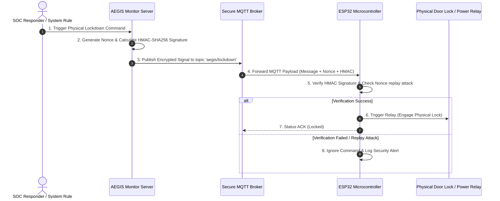

# 🔒 IDEA3: AEGIS Lockdown

> [!warning] Ownership and evidence boundary
> Owner: **Music**. The Security Center web application is now implemented and locally verified, but live adapters, durable storage, hardware control, and production deployment remain unproven. Do not promote those runtime claims until a Music-owned receipt records concrete integration evidence.

> **Primary Function**: Automatic disconnection and physical lockdown system triggered upon critical threats (Physical Emergency Lockdown System). Commands ESP32 microcontrollers via secure MQTT + HMAC-SHA256 protocol.

---

## ⚡ Hardware & Firmware Architecture

---

## 🛠️ Physical Security Features

* **HMAC-SHA256 Validation**: The ESP32 board rejects any commands lacking valid HMAC signatures.
* **Anti-Replay Attack (Nonce)**: Random nonces prevent command interception and replay attacks.
* **Dead Man's Switch**: If heartbeat communication from the central server drops beyond the threshold, the system automatically triggers fail-secure isolation.

---

## 🖥️ Security Center implementation status (2026-09-04)

The first repository implementation is established under `IDEA3-AEGIS_Lockdown/web/` as an Admin-only React/Vite interface with an Express security boundary. It provides 11 operational pages: Dashboard, Overview, IDEA1 Security, IDEA2 Detection, IDEA3 Lockdown, Alerts, Incidents, Audit, Devices, Recovery, and Settings.

Implemented and locally verified:

- canonical evidence states `HEALTHY`, `DEGRADED`, `FAILED`, `UNKNOWN`, `NOT_CONFIGURED`, `STALE`, and `DISABLED`;
- allowlisted read-only adapters for IDEA1, IDEA2, and IDEA3 runtime data, including malformed/future/stale evidence rejection;
- same-origin Admin session, CSRF enforcement, login throttling, security headers, and fail-closed production configuration;
- event deduplication and same-IP correlation within a bounded time window;
- clearly isolated Demo mode for UI review;
- alert acknowledgement, incident notes, bounded audit export, settings validation, and recovery validation as audited server-side actions;
- architecture-first Overview with an explicit environment/provider/persistence boundary, validated evidence flow, per-IDEA integration contracts, a freshness-aware matrix, and visible production-readiness gaps; runtime ACK and requested mode remain distinct from physical relay proof;
- desktop/tablet/mobile layouts, light/dark themes, and UI styling derived from IDEA1's design language without modifying IDEA1 source.

Current Overview-pass evidence: affected client regressions pass 30/30; the full web suite passes 101/101 across 15 files when run outside the sandbox (the sandbox run reaches 87/101 because all 14 server failures are `listen EPERM`); `npm run build` succeeds with 1,677 modules transformed; repository UI detection returns `[]`; and browser QA at 1920×1080, 1440×900, 1366×768, and 390×844 finds no document-level horizontal overflow or console errors. At 390×844 the comparison table intentionally scrolls inside its wrapper (298/590) rather than overflowing the page.

Known limitations:

- IDEA1, IDEA2, and IDEA3 live endpoints are not configured or integration-tested in this task;
- operational and audit repositories are in-memory and are not production-durable;
- the browser has no MQTT, relay, isolation, broker-secret, signing-secret, or recovery-execution endpoint; Recovery is dry-run validation only;
- production deployment, gateway routing, persistent database, external identity provider, and real hardware remain deferred.

---

## 🔗 Related Notes
* [[core/system-overview]]
* [[idea2/idea2-status]]
* [[core/security-architecture]]
