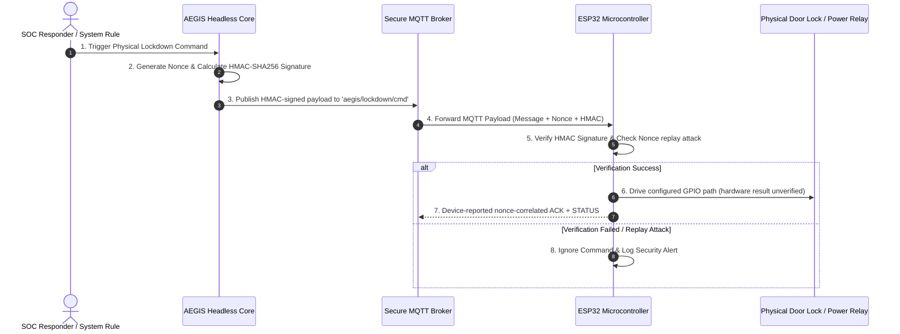

# 🔒 IDEA3: AEGIS Lockdown

> [!warning] Ownership and evidence boundary
> Owner: **Music**. The Security Center is on shared `main`; the Headless Core implementation and local automated evidence are in open PR #91 and are not merged yet. Live adapters, durable storage, ESP32 flash, MQTT hardware E2E, relay actuation, physical WAN isolation, and production deployment remain unproven. ACK and protocol-correlated STATUS must never be promoted to direct electrical relay proof.

> **Primary Function**: Automatic disconnection and physical lockdown system triggered upon critical threats (Physical Emergency Lockdown System). Commands ESP32 microcontrollers via secure MQTT + HMAC-SHA256 protocol.

---

## ⚡ Hardware & Firmware Architecture



---

## 🛠️ Physical Security Features

* **HMAC-SHA256 Validation**: Firmware source rejects commands whose signature does not match; this branch verifies the contract through tests and compile-only evidence.
* **Anti-Replay Attack (Nonce)**: Firmware source tracks single-use nonces and now echoes command correlation through ACK/command-triggered STATUS.
* **Dead Man's Switch**: Firmware source retains fail-secure heartbeat-loss behavior; this revision has not rerun the behavior on real hardware.

---

## ⚙️ Headless Core / Command & Physical Evidence track

Personal planning label: **IDEA3 PR4**. Git publication branch:
`feat/idea3-headless-core-pr4`. The historical source checkpoints were audited
from `feat/idea3-headless-core`. Actual publication is open as
[GitHub PR #91](https://github.com/kraveerachat/Project-End-The-AEGIS/pull/91):
`OPEN / READY_FOR_REVIEW / MERGEABLE / REVIEW_REQUIRED`, not merged. This
follow-up evidence audit started from base
`9ade0dab6361f2bb1212fd67dc7469122463c989` and head
`24d152d0f734ccaed2036f22a1cd89e61547fd88`.

### Operational mode ownership — CLOSED

- Core owns the operational safety gate `ARMED` / `DISARMED` independently from the `auto_contain` policy.
- Default Core operational mode is `ARMED`.
- `set_armed(armed, origin)` persists the mode and audits the previous/current value plus origin.
- While `DISARMED`, detector events remain observable/auditable but automatic containment cannot publish `CUT_UPLINK`.
- Historical source checkpoint: `e2aa6acd`.

### Command ownership — CLOSED

- `AegisSupervisor.issue_command()` is the public Core command-lifecycle entry point and delegates signing/publication to the existing controller.
- A sent command creates Core-owned pending state containing `action`, `sent_at`, and `nonce`.
- Automatic detector containment uses the same `issue_command()` path rather than a second command implementation.
- Historical source checkpoint: `1ab38dfc`.

### ACK nonce correlation — CLOSED

- Firmware ACK includes the parsed command nonce for valid/rejected command paths where a nonce exists; malformed JSON uses an empty nonce.
- MQTTManager forwards `(ack, detail, nonce)` to Core.
- Missing or mismatched ACK nonce is ignored and audited fail-closed; only the matching pending command can be acknowledged.
- The legacy GUI callback accepts the nonce and duplicate ACK callback binding was removed.
- Historical source checkpoint: `1ab38dfc`.

### ACK versus physical evidence — CLOSED at protocol lifecycle level

```text
Requested != Published != ACK != Executed != Physical Evidence
```

- ACK success alone never proves relay or network isolation.
- CUT expects `LOCKDOWN`; RESTORE expects `NORMAL`; the opposite state cannot confirm the command.
- `ACK → STATUS` and `STATUS → ACK` are both retained without later evidence overwriting earlier evidence.
- ACK timeout and physical-confirmation timeout are separate; physical confirmation waits `8` seconds after ACK.
- A CUT physical timeout degrades runtime when no LOCKDOWN truth exists.
- A RESTORE timeout cannot hide current `LOCKDOWN` physical truth.
- Late matching physical evidence is accepted while the original `physical_timeout_at` history remains recorded.
- Historical source checkpoint: `1ab38dfc`.

### Task 2D6 Physical STATUS correlation — IMPLEMENTED / CLOSED

- Approved design: `IDEA3-AEGIS_Lockdown/docs/superpowers/specs/2026-09-04-idea3-physical-status-correlation-design.md` (`ad0c3d37`).
- Command-triggered CUT/RESTORE STATUS includes `command_nonce` (`12f207f1`).
- Boot, periodic heartbeat, Deadman, and Secure Boot STATUS remains uncorrelated.
- MQTTManager forwards optional `command_nonce`; the legacy GUI accepts the expanded callback signature.
- Every valid STATUS may update device/uplink physical truth, including uncorrelated fail-secure STATUS.
- Active command evidence changes only when `STATUS.command_nonce` matches the tracked command nonce; confirmation additionally requires the expected physical state.
- Missing/mismatched correlation is ignored for command completion and audited without false confirmation (`cfb6efe2`).

### Fresh verification — 2026-09-06

- Python: `pytest -p no:cacheprovider -q` — **62 passed**; final pre-review rerun completed in 0.38s.
- Ruff: scoped check of `aegis_soc`, detector entry points, and tests — **All checks passed**.
- Python compileall — **PASS**.
- Firmware: `platformio run -d firmware` — **compile-only SUCCESS**, RAM 46,572/327,680 bytes (14.2%), Flash 789,309/1,310,720 bytes (60.2%).
- Repository tests: `node --test --test-concurrency=1 tests/*.test.mjs` — **56 passed, 0 failed**.
- Collaboration policy — **PASS**.
- Vault validation — **PASS** with two pre-existing owner-data canvas warnings; neither canvas is changed by PR #91.
- Secret/path scan — **PASS**; no real `.env`, `secrets.h`, private-key/token signature, recording, or generated firmware output is included.
- GitHub `collaboration-guardrails` — **PASS** on PR #91.
- `git diff --check origin/main...HEAD` — **PASS** after documentation reconciliation.
- No firmware upload, flash, serial write, MQTT connection, command publication, GPIO/relay action, network change, or deployment occurred.

### Follow-up evidence audit — CLOSED

- Filled the previously missing actual PR #91 state and repository/policy/vault/secret/GitHub-check results.
- Corrected the architecture description from encrypted traffic to the implemented HMAC-signed payload and the actual `aegis/lockdown/cmd` topic.
- Relabelled historical standalone hardware tables so they cannot be mistaken for fresh PR4 evidence.
- `MISSING_FROM_OBSIDIAN=NONE` after this reconciliation for the requested PR4 checklist.

### Still open

- ESP32 flash/upload and real MQTT/HMAC end-to-end acceptance.
- Physical CUT/RESTORE relay observation and actual WAN isolation verification.
- Deadman and recovery hardware acceptance for this revision.
- Production Web → Core → MQTT integration and durable production/audit persistence.
- Full migration of remaining GUI-owned operational state/heartbeat behavior into the Core/API boundary where duplication still exists.

Protocol-correlated STATUS remains device-reported evidence, not direct electrical
measurement of relay contacts. Hardware E2E is **NOT_COMPLETED** and physical
isolation is **NOT_PROVEN**.

---

## 🖥️ Security Center implementation status (2026-09-04)

The first repository implementation is established under `IDEA3-AEGIS_Lockdown/web/` as an Admin-only React/Vite interface with an Express security boundary. It provides 11 operational pages: Dashboard, Overview, IDEA1 Security, IDEA2 Detection, IDEA3 Lockdown, Alerts, Incidents, Audit, Devices, Recovery, and Settings.

Implemented and locally verified:

- canonical evidence states `HEALTHY`, `DEGRADED`, `FAILED`, `UNKNOWN`, `NOT_CONFIGURED`, `STALE`, and `DISABLED`;
- allowlisted read-only adapters for IDEA1, IDEA2, and IDEA3 runtime data, including malformed/future/stale evidence rejection;
- same-origin Admin session, CSRF enforcement, login throttling, security headers, and fail-closed production configuration;
- event deduplication and same-IP correlation within a bounded time window;
- clearly isolated Demo mode for UI review;
- alert acknowledgement, incident notes, bounded audit export, settings validation, and recovery validation as audited server-side actions;
- architecture-first Overview with an explicit environment/provider/persistence boundary, validated evidence flow, per-IDEA integration contracts, a freshness-aware matrix, and visible production-readiness gaps; runtime ACK and requested mode remain distinct from physical relay proof;
- conservative `HEALTHY` evidence gating: evidence must be `FRESH` and include a parseable validation timestamp; missing or malformed timestamps fail closed to `UNKNOWN`;
- desktop/tablet/mobile layouts, light/dark themes, and UI styling derived from IDEA1's design language without modifying IDEA1 source.

Current Overview-pass evidence: affected client regressions pass 31/31; the full web suite passes 102/102 across 15 files; `npm run build` succeeds with 1,677 modules transformed; repository UI detection returns `[]`; and fresh browser QA at desktop and the 390×844 mobile preset finds no document-level horizontal overflow or console errors in Light or Dark themes. At the narrow preset, the Live comparison table scrolls inside its wrapper (241/609) and the Demo table does the same (241/567) rather than overflowing the page.

Known limitations:

- IDEA1, IDEA2, and IDEA3 live endpoints are not configured or integration-tested in this task;
- operational and audit repositories are in-memory and are not production-durable;
- the browser has no MQTT, relay, isolation, broker-secret, signing-secret, or recovery-execution endpoint; Recovery is dry-run validation only;
- production deployment, gateway routing, persistent database, external identity provider, and real hardware remain deferred.

---

## 🔗 Related Notes
* [[core/system-overview]]
* [[idea2/idea2-status]]
* [[core/security-architecture]]
