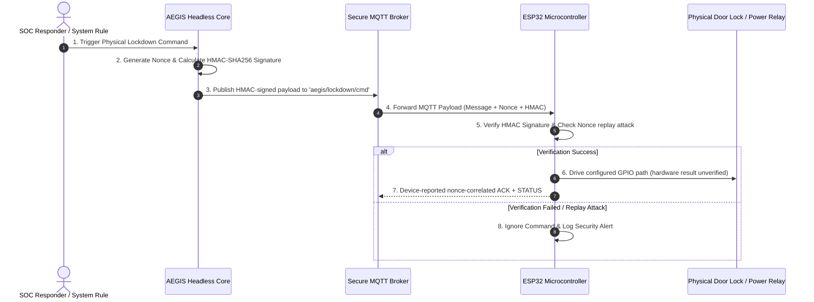

# 🔒 IDEA3: AEGIS Lockdown

> [!warning] Ownership and evidence boundary
> Owner: **Music**. The Security Center and Headless Core from PR #91 are on shared `main`. Project-sequence PR5 was merged through GitHub PR #117 at `58f19f2051170685757627a6baea90b264a877c4`; its owner-observed lab evidence covers the external fail-secure circuit, powered EN/reset behavior, and Router/Switch real-Ethernet CUT/RESTORE within the stated boundaries. PR9 passed its post-PR5 S7 verification at `e5863fc664e239b78f37dd4ce663bc1186f22744`, S8 recorded its one receipt, and GitHub PR #115 was merged by a human reviewer at `2c21cc3e5843bcd75eb1dd2b7f607a745cce254d`. PR9 `PRODUCTION_LIKE_VERIFIED` is local loopback/dry-run evidence only; `PRODUCTION_DEPLOYED = NO`. PR10 is IN PROGRESS. Its S1 documentation (the read-only real deployment inventory and architecture gate) reached `main` when a human reviewer merged GitHub PR #120 at `93170862cbf5b5a802042d12c84944abd39d9123` before PR10 was complete. That merge is a documentation checkpoint only. The owner accepted the PR10 architecture decisions D1–D8 on 2026-09-12, and the read-only live AEGIS Server inventory passed the same day (`LIVE_SERVER_INVENTORY = PASS`). The IDEA3 owner reported Kla's integration approval of the K1–K12 package for the D3/D5 shared infrastructure on 2026-09-12 (architecture/integration only), so **PR10 S1 is PASS / CLOSED**. PR10 remains IN PROGRESS. A human reviewer merged GitHub PR #122 at `b2f61ebf361a5e22f00d28e7e99dcbf3ce006d95`; it is the immutable S1 closeout. The owner approved the continuation model on 2026-09-12. PR10 S2 — the repository-only, non-Production Server → Core accepted-action boundary — is **PASS / CLOSED**: a human reviewer merged GitHub PR #123 at `d903327e56a744de3a535f105797a53f0dccebaf` (2026-09-12), with LOCAL / SIMULATED evidence only. No Production change is authorized, and nothing is deployed. PR11 (live cross-IDEA and authorized E2E) is **IN PROGRESS**. Its Phase 0 — the 0A repository/GitHub preflight and the 0B live read-only preflight — is **PASS / EVIDENCE COMPLETE** (owner gate, 2026-09-13). Phase 1A and Phase 1B are PASS. PR #127 merged the Phase 1 owner-decision package at `90efbc8ec95aa026ca7dd8f12f8de91a99d1645b`; its Music-owned Phase 1 decision-documentation reconciliation is **COMPLETE** with exactly one final receipt. Music's K1/K2/K3/K4/K5/K7/K9/K10/K12/D6 architecture/integration decisions are recorded. Kla and Pub are normal GitHub reviewers; Kla approved PR #131 before its human merge at `c448dfb914d2480f81fbc35abfbc8e5633dd3a38`, and Pub's review was not recorded. PR #132 merged the Phase 2 repository package at `509723680207b6fb8cbbe409d19ac7ad7dd9cc8a`; Phase 2 runtime remains incomplete. A human merged PR #133, the Phase 3 Core Live repository preparation, at `2742be27d9a904cf73378724ea831d9ef385948b`, after Kla and Pub (D6) APPROVED reviews. Phase 3 runtime is still incomplete. Music approved Phase 4 G1 on 2026-09-15, and PR #135 merged the Protocol v1 repository package at `f0a87ee1eb119a5107b63df008218a6163661123`; Phase 4 runtime is incomplete. The owner-run P2-E1 read-only Production evidence (2026-09-15) is recorded: K1 FAIL (live NGINX drift), K3 Public Share baseline PASS with non-overlap NOT PROVEN, K4 live recheck PASS, K7 BLOCKED, K8/K9/K10 BLOCKED, and K12 NOT PROVEN. A human merged that record as PR #136 at `1dc786353dd4dcea0a5959a926667470dd394ffe`. Pub approved it; Kla submitted no review, so the K1/K3/K7 owner decisions were not recorded. A docs-only follow-up asked Kla for them. A human merged it as PR #137 at `7a80596392520050acbe1d00c778959b002cda6b`, and Kla's APPROVED review had an empty body, so all three remain `PENDING_KLA`. The D4 Core-local RESTORE repository implementation is COMPLETE and LOCAL VERIFIED. A human merged it as PR #138 at `3fd8d4d1026b345f84d03b7294b9c9017f54bf55`. It has never run live, and Web, Telegram, and automatic RESTORE remain unavailable. K1 is now reconciled in the repository and merged (PR #144 at `e4183fefd83727eba82cdb6c0d94d14b4bf349e4`); the Phase 2B overlay form is merged (PR #145 at `c89eeecaf3c6b577dd96343861a1dc7091a8d31e`); neither merge changed the running HUB or enabled Phase 2B. The K1 reconciliation: the owner-captured live HUB artifact (`16cee162…`) is the reviewed baseline, the IR-1 `/security` browser route is added on top, the Phase 2B mTLS block is reviewed but not included, and a HUB routing contract test proves preservation plus the additions. K3 is CLEAR on the merged IDEA1 PR #141 closeout. A human merged Music's final approve-only K1/K3/K7 package as PR #139 at `8cf917bfab6ca9dc321839d08255562741374603` after an APPROVED review by `kraveerachat`, so the K1, K3, and K7 decisions are ACCEPTED. Owner-run read-only Stage A and K7 comparison evidence (2026-09-15/16) explained the running HUB's config-hash drift. Music's approve-only K3/K7 pre-mutation package is prepared for Kla's review on `docs/idea3-pr11-phase2-k3-k7-premutation-package`; K3 needs Kla's written confirmation that the IDEA1 window is closed. Phase 4 live work, Stage B, and all Production mutation remain unauthorized. Read "IDEA3 PR11 Post-Containment Reconciliation + Live-Readiness Contract — 2026-09-23" first (this reconciliation task; confirms PR #181 merged at `21d7b7824e6edf1950a7bd914f5d780366fd13c7` and its PR #182 recovery receipt merged at `f2f92425...`; `SOFTWARE_IP_BLOCKING = SOURCE_IMPLEMENTED`, `SOFTWARE_IP_UNBLOCK = SOURCE_IMPLEMENTED`, still not host-verified; defines the exact host-verification contract required before `SOFTWARE_BLOCK_IP`/`SOFTWARE_UNBLOCK = IMPLEMENTED_AND_HOST_VERIFIED`; no live mutation performed), then "IDEA3 PR11 MVP dynamic IP containment — source implementation — 2026-09-22" (PR #181, now MERGED — no longer Draft; BLOCK_IP/UNBLOCK_IP source implemented through a root socket-activated nftables helper; Core stays unprivileged; generic attacker events now use software containment instead of automatic CUT; `SOFTWARE_IP_BLOCKING = SOURCE_IMPLEMENTED`, not host-verified), then "IDEA3 Final Project — PR11 MVP Scope Freeze — 2026-09-22" (PR #178 merged at `3b91fc40`; IDEA3 Final Project scope formally frozen as Security Orchestrator + Physical Containment MVP; PR11 exit criteria and PR12 A1–A7 acceptance defined; software IP blocking and live cross-IDEA integrations open; IDEA2 narrowed preservation decision pending; production hardening deferred; `PR11_MVP_COMPLETE = NO`, `PR12_FINAL_ACCEPTANCE = OPEN`), then "IDEA3 PR11 Phase 4 L1 disk-threshold owner decision reconciliation — 2026-09-22" (PR #178 merged; canonical threshold 90%, PR #174 conflict resolved for repository purposes; live L1 blocked on disk usage 96%, IDEA2 §10, and authorizations), then "IDEA3 PR11 Phase 4 Official L0 live baseline — durable closeout — 2026-09-21" (official post-repair read-only baseline accepted; disk 96% used blocks L1, disk threshold contract reconciliation required, IDEA2 §10 remains freshly blocking, L1 live backend not implemented fail-closed; `PHASE4_RUNTIME_COMPLETE = NO`, `PHASE4_LIVE_READINESS = NOT READY`), then "IDEA3 PR11 Phase 4 L0 harness portability and fail-closed repair — 2026-09-21" (repository repair of locale determinism, paths with spaces in argv-aware filesystem reads, and fail-closed metadata handling), then "IDEA3 PR11 Phase 4 live-readiness reconciliation — 2026-09-21", then "IDEA3 PR11 Phase 4 L1 package installation handler repository registration — 2026-09-21", then "IDEA3 PR11 Phase 3 runtime completion — in progress — 2026-09-17" (repository-only systemd 261 unit correction; `PHASE3_RUNTIME_COMPLETE = NO`), then "IDEA3 PR11 Phase 2 runtime — final closeout — 2026-09-17" (owner-run T3 wrong-CA and T4 revoked-certificate gates PASS; `PHASE2_RUNTIME_COMPLETE = YES`; K12, Phase 3, Phase 4, D4 live, and PR11 remain open), then "IDEA3 PR11 Phase 2 runtime — live evidence reconciliation — 2026-09-16" (Phase 2A PASS and Phase 2B activated live; its T3/T4 SKIP state is superseded), then "IDEA3 PR11 K10 server-held client CA amendment — 2026-09-16," then "IDEA3 PR11 Phase 2 runtime completion — post-#144/#145 reconciliation — 2026-09-16," then "IDEA3 PR11 Phase 2 pre-mutation owner package — K3, K7 — 2026-09-16," then "IDEA3 PR11 Phase 2 final owner-decision package — K1, K3, K7 — 2026-09-16," then "IDEA3 PR11 D4 Core-local RESTORE — repository implementation — 2026-09-16," then "IDEA3 PR11 Phase 2 Kla owner-decision confirmation — 2026-09-16," then "IDEA3 PR11 Phase 2 live evidence reconciliation — P2-E1 — 2026-09-15," then the Phase 4, Phase 3, Phase 2, Phase 1, Phase 0, and PR10 sections below. Total-control-power-loss behavior, deployment-grade mechanical hardening, final relay-cycle Twingate auto-recovery, live adapters, and production deployment remain open. ACK and protocol-correlated STATUS must never be promoted to direct electrical relay proof.

> **Primary Function**: Automatic disconnection and physical lockdown system triggered upon critical threats (Physical Emergency Lockdown System). Commands ESP32 microcontrollers via secure MQTT + HMAC-SHA256 protocol.

---

## IDEA3 PR11 Phase 4 L2 live — ACCEPTED (containment host verification PARTIAL) — 2026-09-24

> [!important] L2 firewall/forwarding persistence live acceptance PROVEN (owner-run; results as reported by the owner)
> `L1_LIVE_ACCEPTANCE = PROVEN` (predecessor, see the L1 rerun2 section below)
> `L2_LIVE_EXECUTED = YES`, `L2_VERIFY = PASS`, `L2_POST_CAPTURE = COMPLETE`, `L2_PRE_POST_COMPARE = PASS`,
> `L2_S10_PRESERVATION = PASS`, `L2_LIVE_ACCEPTANCE = PROVEN`
> `FORWARDING = DISABLED` (all seven sysctls 0), `NAT = ABSENT`, `MASQUERADE = ABSENT`, `BRIDGE = ABSENT`
> `NFT_IDEA3_TABLE = LOADED` (`inet aegis_idea3`, set `blocked_ipv4`), `CONTAINMENT_SOCKET = ACTIVE_ENABLED`
> (`aegis-idea3-containment.service` loaded, inactive, `MainPID=0`, static: no containment request was sent)
> `CONTAINMENT_LIVE_HOST_VERIFICATION = PARTIAL`, `SOFTWARE_IP_BLOCKING = SOURCE_IMPLEMENTED`,
> `SOFTWARE_IP_UNBLOCK = SOURCE_IMPLEMENTED`, `HOST_VERIFIED = NO`
> `L3_LIVE_EXECUTED = NO`, `PR11_COMPLETE = NO`, `PHASE4_RUNTIME_COMPLETE = NO`
>
> Authorization: same-day Music batch authorization (`pull/190#issuecomment-5799763300`, `L2=AUTHORIZED`,
> `PRODUCTION_SCOPE=REVIEWED_PHASE4_STAGE_HANDLERS_ONLY`, `ROLLBACK_SCOPE=CURRENT_STAGE_ONLY`) and Kla K3 / integration
> confirmation (`pull/190#issuecomment-5800317385`, `K3_L2=CONFIRMED`, `IDEA1_WINDOW_OVERLAP=NONE`,
> `L2_INTEGRATION_REVIEW=APPROVED`); canonical gate `AUTHORIZATION_RECORD=VALID`, `K3_CONFIRMATION=VALID`.
> Owner-approved live values: interface `wlp0s20f3`, AP subnet `10.77.30.0/28`, Core AP address `10.77.30.1`, channel 6, country TH,
> protected CIDRs `10.77.30.0/28,192.168.1.0/24,100.96.0.0/12,192.168.10.10/32`. Private render/evidence stay outside the repository.
> Window: `JOURNAL_SINCE = 2026-09-23 21:20:13 UTC`; evidence under `~/idea3-p4-evidence/2026-09-24-l2/`
> (`pre-root`, `post-root`, `compare-pre-post.txt`, `render`, `stage-work`); both bundles `SHA256SUMS = PASS`.
> Apply (owner-run reviewed handler, `AEGIS_P4_FS_ROOT` unset): `L2_APPLY=PASS`, `L2_TABLE=inet/aegis_idea3`,
> `FORWARDING_TARGET=DISABLED`, `APPLY_RC=0`. Compare (L2 allow files, threshold 90): `NEW_OR_WORSENED_DRIFT=0`,
> `BASELINE_UNHEALTHY_BUT_UNCHANGED=0`, `INCOMPARABLE=0`, `APPROVED_CHANGE=22`, `INFO=3`; `DRIFT_RESULT=PASS`,
> `PRESERVATION_S10=PASS`, `COMPARE_RESULT=PASS`. PRE=POST: Engine `868`/`0`, Tunnel `398125`/`16`, Twingate `2972`/`0`;
> `:8077`, `:18002`, default route via `enp62s0`, `192.168.10.10` via `sdwan0` preserved; disk 88%; chronyd loaded/inactive/disabled;
> `listen.udp.ephemeral_filter = kernel-range-32768-60999`. `runtime_healthy = NOT_PROVEN` remains the read-only L0 limitation.
> The `PRODUCTION_MUTATION_PERFORMED=NO` printed by verify/compare describes those read-only steps, not the L2 apply.
>
> Containment limitation: `/opt/aegis-idea3/current` is not installed on the host, so the helper runtime was deliberately not
> activated and live containment contract items 7–13 (block, idempotency, observed traffic denial, listing, unblock, restoration,
> audit) were not performed; no authorized external test source is defined, and any test source must lie outside the protected CIDRs.
> Source and local functional evidence (`verify-containment-functional.sh`) are unchanged and are not host proof.
>
> Documentation discrepancy (not a Production change): the live `forward` chain has `policy accept` plus
> `iifname "wlp0s20f3" drop`; AP-originated forwarding is denied, which is the approved behavior. Older prose saying the whole
> forward-chain policy must be `drop` is a history discrepancy.

---

## IDEA3 PR11 Phase 4 L1 live rerun2 — ACCEPTED — 2026-09-24

> [!important] L1 live acceptance PROVEN in a fresh preservation window (owner-run; results as reported by the owner)
> `L1_LIVE_RERUN2 = PASS`, `L1_VERIFY = PASS`, `L1_POST_CAPTURE = COMPLETE`,
> `L1_PRE_POST_COMPARE = PASS`, `L1_S10_PRESERVATION = PASS`, `L1_LIVE_ACCEPTANCE = PROVEN`
> `CHRONY_INSTALLED = YES` (`chrony 4.8-3`), `CHRONYD_ACTIVE = NO`, `CHRONYD_ENABLED = NO`
> (`LoadState=loaded`, `ActiveState=inactive`, `SubState=dead`, `UnitFileState=disabled`, `MainPID=0`, `NRestarts=0`)
> `L2_LIVE_EXECUTED = NO`, `PR11_COMPLETE = NO`, `PHASE4_RUNTIME_COMPLETE = NO`
>
> History (kept, not rewritten): (1) the first L1 live attempt executed; (2) its PRE→POST/S10 formal proof was blocked by
> the old evidence harness and the reviewed L1 rollback restored chrony to ABSENT (section below); (3) PR #192 fixed the
> harness and a human merged it at `e614e7f17bd50531297c12d9cbbd5e862ac12dc4`; (4) rerun2 used the merged harness in a new
> window and namespace; (5) rerun2 passed. The first attempt's evidence (`2026-09-24-l1/{pre,post,rb}-root`) is historical and untouched.
>
> Rerun2 window: `JOURNAL_SINCE = 2026-09-23 19:34:46 UTC`; evidence under `~/idea3-p4-evidence/2026-09-24-l1-rerun2/`
> (`pre-root`, `post-root`, `compare-pre-post.txt`, `stage-work`); both bundles `SHA256SUMS = PASS`.
> Apply (owner-run, reviewed handler, `AEGIS_L1_BACKEND=live`, `AEGIS_P4_FS_ROOT` unset): `L1_SIMULATE_INSTALL=COMPLETE`,
> `L1_VERIFY=PASS`, `L1_SERVICES_STARTED=NONE`, `L1_SERVICES_ENABLED=NONE`, `LIVE_L1=EXECUTED`, `L1_APPLY=COMPLETE`.
> Compare (L1 allow files, threshold 90): `NEW_OR_WORSENED_DRIFT=0`, `BASELINE_UNHEALTHY_BUT_UNCHANGED=0`,
> `INCOMPARABLE=0`, `APPROVED_CHANGE=6`, `INFO=3`; `DRIFT_RESULT=PASS`, `PRESERVATION_S10=PASS`, `COMPARE_RESULT=PASS`.
> Preservation PRE=POST: Engine `MainPID=868`/`NRestarts=0`; Tunnel `MainPID=398125`/`NRestarts=16`; Twingate
> `MainPID=2972`/`NRestarts=0`; all active; `:8077` and `:18002` present; `sdwan0` route to 192.168.10.10 present; root disk 88%.
> Harness proof on the live host: `listen.udp.ephemeral_filter = kernel-range-32768-60999` (PRE and POST);
> `time.chrony.leap` `not-installed` → `installed-inactive`.
> The compare line `PRODUCTION_MUTATION_PERFORMED=NO` describes the comparison step only, not the L1 apply.
> `runtime_healthy = NOT_PROVEN` remains the read-only L0 limitation. L2 and later stages are not executed and need their own windows.

---

## IDEA3 PR11 Phase 4 L1 live attempt — ROLLED BACK — evidence-harness fix — 2026-09-24

> [!note] Historical first attempt — superseded by the rerun2 section above; `L1_COMPLETE = NO` below describes the state before rerun2.

> [!important] L1 live attempt rolled back; formal S10 proof blocked by the evidence harness
> `L1_LIVE_ATTEMPT = ROLLED_BACK` (owner-reported: L1 apply and verify passed, PRE→POST compare FAILED,
> the reviewed L1 rollback completed with `L1_ROLLBACK_PACKAGE_STATE=ABSENT`, RB capture COMPLETE,
> PRE→RB compare FAILED with only UDP listener churn: 56 findings, 0 incomparable)
> `L1_COMPLETE = NO`, `FORMAL_S10_PROOF = BLOCKED_BY_EVIDENCE_HARNESS`
> `PRODUCTION_HOST_STATE = ROLLED_BACK` (chrony absent again; no L2 executed)
> `L2_EXECUTED = NO`, `PRODUCTION_MUTATION_BY_THIS_TASK = NO`
> Root causes (repository-only fix on `fix/idea3-pr11-phase4-evidence-harness`, Draft PR):
> (A) `p4-l0-capture.sh` recorded transient UDP client sockets on kernel-assigned ephemeral ports as listeners;
> UDP sockets inside the host's `ip_local_port_range` are now excluded from the per-port inventory (range recorded as
> `listen.udp.ephemeral_filter`; unreadable range = no filtering; TCP unfiltered).
> (B) passive L1 chrony was recorded as `UNAVAILABLE`; it is now `installed-inactive` only with proof
> (`chronyd.service` loaded and inactive), any other failed query stays `UNAVAILABLE` and fails closed.
> The original live evidence (`pre-root`, `post-root`, `rb-root`) is preserved unchanged and is not comparable
> under the fixed semantics. Production resumes only after human merge and a fresh L1 PRE window.
> Residual risk: a real UDP service bound inside the ephemeral range is not distinguishable by `ss` alone.

---

## IDEA3 PR11 Phase 4 IDEA2 §10 window-delta criterion — ACCEPTED — 2026-09-24

> [!important] Post-merge reconciliation (2026-09-24) — owner acceptance APPROVED
> `PR189 = MERGED`, `PR189_MERGE_SHA = 9f6a0f4167d814cd090c47916d12d7b10397cb0e`
> `IDEA2_OWNER_ACCEPTANCE = APPROVED` (Pub, `pubpup2006p-design`)
> `IDEA2_S10_WINDOW_DELTA_CRITERION = ACCEPTED`
> `IDEA2_NARROWED_CRITERION = WINDOW_DELTA_ACCEPTED_BY_IDEA2_OWNER`
> `S10_STAGE_PRESERVATION_EVIDENCE = REQUIRED_PER_STAGE` (the stage gate now prints
> `S10_CRITERION_OWNER_ACCEPTANCE=APPROVED` and `S10_PRESERVATION_EVIDENCE=REQUIRED_PER_STAGE`;
> it cannot itself prove fresh BEFORE/AFTER preservation, so `S10_IDEA2_CAVEAT=OPEN` is retired.)
> `FRESH_DISK_USE = 88%`, `LAST_FRESH_IDEA2_OBSERVATION_SECONDS = 821`,
> `ENGINE_NRESTARTS = 0->0`, `TUNNEL_NRESTARTS = 15->15`
> `L1_LIVE_EXECUTION = NOT_RUN`, `A_L1 = NOT_ISSUED`, `FRESH_K3_L1 = NOT_ISSUED`,
> `PRODUCTION_MUTATION = NO`. The text below is the historical PR #189 candidate record.

> [!note] Historical — candidate state at PR #189 creation
> Branch `fix/idea3-pr11-s10-window-delta-criterion` (Draft PR, base `baf0a94e`)
> reconciles the IDEA2 §10 preservation contract with observed reality. A
> historical absolute `idea2.tunnel.NRestarts > 0` is no longer, by itself, an
> unhealthy L0 tunnel baseline; the recorded count is never normalized. The
> preservation dimension is the window delta: `NRestarts` and `MainPID` unchanged
> pass, any increase or PID change fails. A new failure class, `:8077`/`:18002`
> loss, and a currently unhealthy tunnel (inactive, `:18002` absent, journal
> failure class) still fail. Focused RED→GREEN tests cover cases A–F; the PR11
> suite passes (885). The compare summary prints
> `IDEA2_NARROWED_CRITERION=WINDOW_DELTA_CANDIDATE_PENDING_OWNER_ACCEPTANCE` (now `WINDOW_DELTA_ACCEPTED_BY_IDEA2_OWNER`).
>
> Fresh read-only evidence (owner-run, no lifecycle action):
> `FRESH_DISK_USE = 88%`, `DISK_L1_GATE = PASS` (threshold 90%),
> `FRESH_IDEA2_OBSERVATION_SECONDS = 821`, `ENGINE_NRESTARTS = 0->0`,
> `TUNNEL_NRESTARTS = 15->15`, `TUNNEL_MAINPID_UNCHANGED = YES`,
> `LISTEN_8077 = YES`, `LISTEN_18002 = YES`, `MONITOR_HEALTHZ = PASS`.
>
> `CONTRACT_REALITY_MISMATCH = RESOLVED_IN_CANDIDATE_CODE`
> `IDEA2_OWNER_ACCEPTANCE = PENDING_PR_REVIEW` at that time (now APPROVED, see above)
> `S10_IDEA2_CAVEAT = OPEN` at that time (superseded by `S10_PRESERVATION_EVIDENCE = REQUIRED_PER_STAGE`)
> `L1_LIVE_EXECUTION = NOT_RUN`, `PRODUCTION_MUTATION = NO`.
> Superseded: owner acceptance was later given on PR #189.

## IDEA3 PR11 Phase 3 runtime completion — in progress — 2026-09-17

> [!important] Current IDEA3 task — IN PROGRESS
> Phase 3 runtime completion has started on
> `feat/idea3-pr11-phase3-runtime-completion` from `232759cf`. Session P3-R1
> (this task's first session; distinct from PR #133's repository-preparation
> P3-R1 below) is a repository-only systemd 261 compatibility correction. No
> Core host, service, directory, broker, network, or Production state was
> changed by the agent. The Phase 2 final closeout below remains the latest
> closed record.

```text
PHASE3_RUNTIME_TASK            = IN PROGRESS
P3_R1_REPO_CORRECTION          = DONE — CPUAccounting= removed from deploy/aegis-idea3-core.service.example; P3-C8 test updated (TDD)
P3_T9_REPOSITORY_IMPLEMENTED   = YES — systemd LoadCredential delivery for k_c2d, k_d2c, mqtt-core.pass, admin.pin
P3_T9_LOCAL_STATIC_VERIFIED    = YES — credential fail-closed tests, systemd-analyze verify, compileall, full pytest
G12_REPOSITORY_SIDE            = IMPLEMENTED / LOCAL VERIFIED
G13_REPOSITORY_SIDE            = IMPLEMENTED / LOCAL VERIFIED
G12_LIVE_DELIVERY              = NOT PROVEN
G13_LIVE_DELIVERY              = NOT PROVEN
SYSTEMD261_COMPATIBILITY       = CPUAccounting= removed/ignored on systemd 261.2 (owner-run Core preflight; reproduced on a systemd 261.2 workstation)
CPU_ACCOUNTING                 = host unified cgroup hierarchy (no unit directive)
MEMORY/TASKS/IO_ACCOUNTING     = true (unchanged)
QUOTAS                         = none (unchanged; unmeasured)
UNIT_STATIC_VALIDATION         = only expected pre-deployment ExecStart missing-path warning remains
IDEA2_CONTRACT                 = no IDEA2 unit reference anywhere in the Core unit (test-proven)
CORE_SERVICE_INSTALLED         = NO
PRODUCTION_MUTATION            = NO (agent)
PHASE4_RUNTIME_PREREQUISITES   = PARTIAL_REPOSITORY_ONLY — T9/G12/G13 repository support exists; live broker/PKI/network/credential delivery remains open
PHASE3_RUNTIME_COMPLETE        = NO
PHASE4_RUNTIME_COMPLETE        = NO
D4_LIVE_VERIFIED               = NO
K12                            = NOT_PROVEN
FINAL_RECEIPT                  = 90-Status/logs/2026-09-18_000451_music_idea3-pr11-phase3-t9-credentials.md
```

### Current Task

Task: IDEA3 PR11 Phase 3 runtime completion — T9 credential integration
Branch: `feat/idea3-pr11-phase3-t9-credentials`
Owner: `music`
Integration: T9 repository checkpoint is now carried by Draft PR #149 (`feat/idea3-pr11-phase3-runtime-completion`); human review/merge pending
Current state: REPOSITORY INTEGRATED INTO DRAFT PR #149 — local verification complete; human review/merge pending
Started: 2026-09-17
Base SHA: `bacb64fa24d55029387a84d07492061b702a125a`
Last checkpoint: the commit containing the T9 implementation/evidence receipt
Production mutation allowed: NO

- **Goal:** complete the Phase 3 Core runtime within separately authorized
  gates, starting with repository corrections found by owner-run read-only
  Core evidence.
- **Out of scope for the T9 repository subtask:** unit installation or
  credential provisioning on the Core; `/opt`, `/etc`, `/var/lib`, `/run`, or
  `/var/log` host mutation; real secret generation; IDEA2, Mosquitto, Twingate,
  Docker, or any service lifecycle; MQTT/AP/firmware/CUT/RESTORE/reboot work;
  ESP32 flash/NVS write; pushing or merging.

### Owner-run read-only Core evidence (2026-09-17, owner-reported)

- Arch Linux, systemd 261.2. `enp62s0` = `192.168.20.254/24`; route to
  `192.168.10.10` via `192.168.20.1 dev enp62s0 src 192.168.20.254`.
- With Twingate stopped, an authenticated Core → HUB request using the real K10
  certificate returned HTTP 200.
- IDEA2 `aegis-detection-engine.service` and `aegis-detection-tunnel.service`
  active/running before and after the evidence.
- `aegis-idea3` user/group exist (prior K10 work); `aegis-idea3-core.service`
  not installed; `/etc/aegis-idea3` and `/etc/aegis-idea3/pki` exist;
  `/opt/aegis-idea3/current`, `/var/lib/aegis-idea3`, `/run/aegis-idea3`, and
  `/var/log/aegis-idea3` do not exist.
- Root filesystem 59G total, 53G used, 3.8G available (94%).
- Mosquitto: existing live plaintext `listener 1883`, `allow_anonymous false`,
  `password_file /etc/mosquitto/passwd`; no `listener 8883`.
- Absent: `/etc/aegis-idea3/pki/mqtt-ca.crt`,
  `/run/credentials/aegis-idea3-core.service/k_c2d` and `k_d2c`,
  `/etc/aegis-idea3/credentials/restore.credential`.
- Static `systemd-analyze verify` of the candidate: `CPUAccounting=` removed and
  ignored (real incompatibility), and the ExecStart Python not executable
  (expected before release staging).

### Why the Core cannot be started yet (source-verified)

`aegis_soc/runtime.py` `RuntimeSettings.preflight` fails a production live
start when any of these is missing, and the supervisor then exits 2:

- `_production_mqtt_errors`: MQTT TLS enabled, port not 1883, a readable
  `AEGIS_MQTT_CA_FILE`, and a Core broker username/password. The live broker has
  no 8883 TLS listener, so even a passing preflight could not connect.
- `protocol_configuration_errors`: a valid `AEGIS_P1_DEVICE_ID` and loadable
  per-direction C2D/D2C key files.
- A non-default Admin PIN.
- When `AEGIS_RESTORE_CREDENTIAL_FILE` is set (as in the example environment),
  an unsafe or missing D4 credential is also a preflight error.

T9 now provides the repository-side delivery path for the two Protocol v1 keys,
the Core MQTT password, and the Admin PIN through systemd credentials. This does
not prove any live credential exists or has been delivered. The live TLS broker,
MQTT CA, broker/device credentials, network stages, disk headroom, preservation
gates, and separately authorized Core installation/start remain open, so the
Core unit is not installed or started.

### T9 repository/local evidence

```text
T9_LOADCREDENTIAL_COUNT        = 4
CORE_ENV_INLINE_T9_SECRETS     = NONE
SYSTEMD_ANALYZE_VERIFY         = PASS (systemd 261.2; disposable verification copy)
COMPILEALL                     = PASS
FULL_PYTEST                    = 1170 passed, 6 skipped
DIFF_CHECK                     = PASS
REAL_SECRET_GENERATION         = NO
CORE_HOST_MUTATION             = NO
ESP32_FLASH                    = NO
ESP32_NVS_WRITE                = NO
PRODUCTION_MUTATION            = NO
```

### Phase 3 Runtime Session Register

| ID | Scope | State | Evidence | Checkpoint | Result | Remaining | Next |
|---|---|---|---|---|---|---|---|
| P3-R1 | systemd 261 compatibility correction (repository only) | PASS | P3-C8 RED then GREEN; full IDEA3 pytest, Ruff, compileall, diff check, vault and collaboration-policy validation, secret/binary scan; static unit verify leaves only the expected ExecStart warning | P3-R1 commit | CORRECTED — LOCAL / STATIC only | Phase 4 runtime prerequisites | Phase 4 MQTT/v1 runtime gate, separately authorized |
| P3-T9 | G12/G13 Core credential delivery integration (repository only) | PASS / LOCAL VERIFIED | TDD credential reader + config integration; 4 `LoadCredential=` directives; inline T9 secrets absent from Core env; `systemd-analyze verify` PASS; compileall PASS; full pytest `1170 passed, 6 skipped`; diff check PASS | the commit containing the T9 receipt | REPOSITORY IMPLEMENTED / LOCAL VERIFIED; live delivery NOT PROVEN | human review/merge of Draft PR #149 | no live action |
| P3-L1 | Live Core installation and validation | BLOCKED | — | — | — | live TLS listener, MQTT CA, broker/device credential delivery, v1 device config, disk headroom, fresh preservation baseline, fresh K3, explicit Production mutation authorization | — |

## IDEA3 PR11 Phase 4 T1 / G-15 capture, compare, and stage-gate harness — REPOSITORY CLOSEOUT COMPLETE — 2026-09-17

> [!important] T1 / G-15 repository framework — CLOSED (repository boundary only; human merge pending)
> T1 implements only the repository-side part of G-15: a read-only L0 capture,
> a deterministic before/after preservation comparison, a fail-closed stage
> authorization gate, and a rollback-handler **contract**, under
> `IDEA3-AEGIS_Lockdown/deploy/pr11-phase4/`. No stage mutation or rollback
> handler exists. Nothing ran on the Core, and no host, network, firewall, time,
> broker, certificate, secret, firmware, or service state changed. Human review
> of PR #152 passed. The G-15 **repository framework** is closed; live rollout,
> live acceptance, and Phase 4 runtime remain open.

```text
T0_COMPLETE                    = YES (PR #151 merged 94793b02)
T1_IMPLEMENTATION_STARTED      = YES
T1_REPOSITORY_IMPLEMENTED      = YES — implementation/evidence checkpoint 9c82e4a0 (LOCAL VERIFIED only)
G15_REPOSITORY_FRAMEWORK       = CLOSED — repository boundary only; live rollout NOT RUN
PHASE3_RUNTIME_COMPLETE        = NO
PHASE4_RUNTIME_COMPLETE        = NO
PHASE4_LIVE_READINESS          = NOT READY
D4_LIVE_VERIFIED               = NO
K12                            = NOT_PROVEN
IDEA2_TUNNEL_HEALTHY           = NO
IDEA2_RUNTIME_HEALTHY          = NO
PRODUCTION_MUTATION            = NO
LIVE_STAGE_AUTHORIZED          = NO (the gate always prints NO)
FINAL_RECEIPT                  = Obsidian_AEGIS_Vault/AEGIS_Knowledge/90-Status/logs/2026-09-17_095220_music_idea3-pr11-phase4-t1-g15.md
T2_T9_IMPLEMENTATION_STARTED   = NO
```

### Current Task

Task: IDEA3 PR11 Phase 4 T1 / G-15 capture, compare, and stage-gate harness
Branch: `feat/idea3-pr11-phase4-capture-harness`
Owner: `music`
PR: #152 (Ready/non-Draft)
Current state: ACCEPTANCE PENDING — repository closeout complete; human merge pending
Started: 2026-09-17
Base SHA: `94793b02e0bbd124f87c779fab3cbe3b12e3e0fd`
Last checkpoint: `e96d8188` (documentation); implementation/evidence checkpoint `9c82e4a0`
Production mutation allowed: NO

- **Goal:** a reviewed repository framework, so later Phase 4 live stages can
  capture L0 read-only, compare before/after preservation deterministically,
  refuse to proceed without same-day authorization and K3, and plug in
  stage-specific rollback handlers under one contract.
- **Scope:** `IDEA3-AEGIS_Lockdown/deploy/pr11-phase4/**`,
  `IDEA3-AEGIS_Lockdown/tests/test_pr11_phase4_harness.py`, this note, and the
  Phase 4 execution document status lines.
- **Out of scope:**
  - any live stage, AP/IP/DHCP/DNS/nftables/sysctl/rfkill/NetworkManager/Mosquitto change;
  - chrony, certificate, key, or secret creation;
  - Core install/start, ESP32 work, CUT, RESTORE, reboot;
  - IDEA2 diagnosis or fix;
  - stage apply/rollback handlers;
  - T2–T9; PR #149 and PR #147;
  - merging.
- **Safety boundaries:**
  - every capture host command passes the anchored `p4_ro` read-only allowlist;
  - secret-bearing files are metadata only, and journals are reduced to counts;
  - §10 is not weakened: an unhealthy IDEA2 baseline fails the comparison even
    when unchanged, and no narrowed criterion is accepted;
  - the gate never authorizes a live stage.
- **Acceptance criteria:** focused and full IDEA3 tests pass; restoring
  negative controls prove the guard, secret handling, §10 finding, denylist,
  K3, freshness, and forwarding rules are load-bearing; repository validation
  passes; human code/content review; then final closeout with one receipt.

### Session Register

| ID | Scope | State | Evidence | Checkpoint | Result | Remaining | Next |
|---|---|---|---|---|---|---|---|
| P4-T1-S1 | T1 test-first implementation: L0 capture, compare, stage gate, rollback contract (repository only) | CLOSED | RED 122 failed / 37 passed (scripts absent); GREEN focused 159 passed; full IDEA3 1120 passed / 6 skipped (base 961 / 6); compileall PASS; `bash -n` PASS; shellcheck NOT RUN (not installed); ruff: T1 file PASS, 8 pre-existing base findings unchanged; restoring negative controls NC1–NC9 fail→restore→pass with no residue; changed-line secret scan 0 material; human PR review PASS | `9c82e4a0` | PASS — REPOSITORY_IMPLEMENTED / HUMAN_REVIEW_PASS / REPOSITORY_CLOSEOUT_COMPLETE (LOCAL VERIFIED only) | human merge PR #152; live Phase 4 remains separate and unauthorized | human merge PR #152 |

---

## IDEA3 PR11 Phase 4 live runtime prerequisites — T0 complete — 2026-09-17

> [!important] IDEA3 PR11 Phase 4 prerequisite reconciliation (T0) — COMPLETE (repository-only)
> Human Content Review of PR #151 = PASS (owner confirmation, 2026-09-17).
> Closing T0 closes **only** the prerequisite reconciliation and task split. It
> does not close Phase 3 or Phase 4 runtime, and `PHASE4_LIVE_READINESS` stays
> `NOT READY`. Human approval and merge of PR #151 remain separate steps.
> This task reconciles the merged Phase 4 Protocol v1 repository package
> (PR #135) with the owner-run read-only Core evidence P4-E1 to P4-E3. The
> current execution document is
> `IDEA3-AEGIS_Lockdown/docs/superpowers/specs/2026-09-17-idea3-pr11-phase4-runtime-prerequisites.md`.
> No Core host, Wi-Fi, network, firewall, time, broker, certificate, secret,
> firmware, or service state was changed. The Phase 2 final closeout below
> remains the latest closed record.

```text
P4_PREREQ_T0                   = COMPLETE
P4_PREREQ_CONTENT_REVIEW       = PASS (PR #151 Human Content Review, 2026-09-17)
PHASE4_LIVE_READINESS          = NOT READY — owner values, owner decisions, and repository gaps outstanding
REPOSITORY_GAPS                = 16 (G-01..G-16; 14 BLOCKING, 2 LOW) — see execution document §6
OWNER_VALUES / DECISIONS       = OV-01..OV-14 / OD-01..OD-17 — none chosen or generated by the agent (OD-15 = optional hardening, not blocking)
PLANNING_FINDINGS              = PF-01..PF-05 recorded, all OPEN (execution document §6.1)
TASK_SPLIT                     = T0..T9 recorded (execution document §14); T1..T9 NOT STARTED
PHASE3_DEPENDENCY              = YES for Core install/start and device stages (PR #149, Draft, unmerged; integration strategy OD-17); NO for AP/firewall/NTP/broker stages
K3                             = OWNER_CONFIRMATION_REQUIRED (open IDEA1 Draft PRs #148 and #150 prove neither an active nor a closed Production mutation/verification window; Production activity is not inferred from PR state)
IDEA2_PROCESS_ACTIVE           = YES (OWNER-RUN; unit/process state only)
IDEA2_TUNNEL_HEALTHY           = NO  (tunnel flapping, NRestarts > 1450; SSH :22 timeout; :18002 absent)
IDEA2_RUNTIME_HEALTHY          = NO  (Detection Engine heartbeat connection refused) — outside IDEA3 ownership; not diagnosed or fixed here
LIVE_MUTATION_AUTHORIZED       = NO
PRODUCTION_MUTATION            = NO
PHASE3_RUNTIME_COMPLETE        = NO
PHASE4_RUNTIME_COMPLETE        = NO
D4_LIVE_VERIFIED               = NO
K12                            = NOT_PROVEN
T1_T9_IMPLEMENTATION_STARTED   = NO
FINAL_RECEIPT                  = 90-Status/logs/2026-09-17_043011_music_idea3-pr11-phase4-runtime-prereqs-t0.md
```

> [!warning] IDEA2 preservation caveat (OWNER-RUN, 2026-09-17)
> `PROCESS_ACTIVE != TUNNEL_HEALTHY != IDEA2_RUNTIME_HEALTHY`. The earlier
> P4-E evidence ("IDEA2 units active") proves process state only.
> `aegis-detection-engine.service` runs with `NRestarts=0` and local `:8077`
> listens. `aegis-detection-tunnel.service` is active but flapping
> (`Restart=always`, `RestartSec=5s`, NRestarts > 1450). SSH to
> `192.168.10.10:22` times out, `127.0.0.1:18002` is absent, and the heartbeat
> fails with connection refused. The Phase 4 §10 IDEA2 preservation check
> cannot pass as written, so every future live stage would stop until the
> IDEA2 owners restore the tunnel or accept a narrowed criterion in writing.

### Current Task

Task: IDEA3 PR11 Phase 4 live runtime prerequisite reconciliation (T0)
Branch: `feat/idea3-pr11-phase4-runtime-prereqs`
Owner: `music`
PR: #151 (Draft)
Current state: COMPLETE (T0) — Human Content Review PASS; one final receipt; PR #151 awaits human approval and merge
Started: 2026-09-17
Base SHA: `232759cf4e44094c61f15e3d041c09eb1478b42c`
Last checkpoint: `24f23698` (final documentation checkpoint before closeout; P4-P1 `b1d938c8`, P4-P2 `f5c1276b` + `24f23698`)
Production mutation allowed: NO

- **Goal:** a precise, evidence-based live-readiness matrix, owner-value and
  decision list, repository-gap list, and staged, rollback-safe execution
  order for Phase 4 live runtime.
- **Out of scope:** any live mutation; package installation; secret or
  certificate creation; IDEA1/IDEA2 source; the final receipt; merging.

### Session Register

| ID | Scope | State | Evidence | Checkpoint | Result | Remaining | Next |
|---|---|---|---|---|---|---|---|
| P4-P1 | Readiness audit and execution document (repository only) | PASS | Source/template audit at `232759cf`; owner-reported P4-E1..E3; GitHub read of PR #148/#149; repository validation (see PR) | `b1d938c8` | NOT READY FOR LIVE — gaps and owner inputs recorded | owner decisions OD-01..OD-14; gap-closure PRs G-01..G-16 | owner decisions, then repository gap closure |
| P4-P2 | Plan-review corrections (T0): IDEA2 preservation caveat, PF-01..PF-05, OD-15..OD-17, T0–T9 task split, K3 #148/#150 and OD-15 wording (repository only) | CLOSED | owner-run IDEA2 evidence E-25..E-32; plan review 2026-09-17; guardrail run 35151245753 PASS at `24f23698` | `f5c1276b`, `24f23698` | PASS — Human Content Review PASS | none for T0 | T0 closeout |
| P4-C | T0 final closeout and single receipt (repository only) | CLOSED | Human Content Review PASS; final repository validation (see PR #151) | `24f23698` (final documentation checkpoint; the receipt commit SHA is recorded in PR #151) | PASS — T0 COMPLETE; Phase 4 live NOT READY | human approval and merge of PR #151; owner decisions OD-01..OD-17; T1–T9 | after human merge of #151: T1, T2, T7 on independent branches; T8 after its owner decisions |

---

## IDEA3 PR11 Phase 2 runtime — final closeout — 2026-09-17

> [!important] Current IDEA3 truth — read this section first
> The owner ran the two residual Phase 2B gates against Production on
> 2026-09-16, 17:18Z–18:05Z. T3 (wrong CA) and T4 (revoked certificate) both
> **PASS**, so the design §6.2 step 16 gates are met and
> **`PHASE2_RUNTIME_COMPLETE = YES`**. This reconciliation (2026-09-17) read the
> checksummed Core evidence bundle `~/idea3-pr11-phase2-final-evidence/` directly
> (`sha256sum -c` 7/7 OK) and ran no Production action. The full record is
> "Final T3/T4 window" and "Final outcome" in
> `IDEA3-AEGIS_Lockdown/docs/superpowers/specs/2026-09-16-idea3-pr11-phase2-runtime-closeout.md`.
> The next section (2026-09-16) is kept as history. Its T3/T4 SKIP and
> `PHASE2_RUNTIME_COMPLETE = NO` are superseded.

```text
PHASE2A                        = PASS
PHASE2B                        = PASS (activation LIVE; final Core matrix PASS; final server matrix PASS)
K8 = PASS    K9 = PASS    K10 = PASS    K12 = NOT_PROVEN
T1 = PASS 200   T2 = PASS 400   T3 = PASS 400   T4 = PASS 400
T5_EXPIRED_CERT                = NOT TESTED / NOT CLAIMED
T6 = PASS (a 200 / b 400 / c 200)   T7 = PASS (a 404 / b 200 / c 404)
SERVER_FINAL                   = S1 403/403, S2 200/403, S3 404, S4 block/verify/cert/CA/CRL PASS, S5 PASS (dispatch vars 5)
T4_LIFECYCLE                   = test CSR CN=idea3-core sha256 df00869b…; test cert serial 2DCBAA5B…; real Core serial 19198902… (distinct);
                                 before-revoke 200 (owner-reported); revoke only the test cert; publish CRL; nginx -t + reload (owner-reported);
                                 final run: test cert 400, real Core cert 200
FINAL_CRL                      = sha256 2a737ea8ac775d527f433dad394e7e399ef187de4bbbbf8f6283f98b6f397b31 (canonical = published);
                                 lastUpdate Sep 16 17:55:54 2026 GMT; nextUpdate Oct 16 17:55:54 2026 GMT
HUB_PRESERVATION               = PASS — ID 743f3831…, started 2026-09-16T09:04:13Z, restarts 0, healthy; not recreated
UNRELATED_SERVICE_PRESERVATION = PASS — Drive, Monitor, Postgres, Public Share gateway + connector, Twingate connector unchanged
K3_NON_OVERLAP                 = CONFIRMED by kraveerachat (PR #146 comment) for the T4 window
T4_AUTHORIZATION               = CONSUMED — not reusable; authorizes nothing further
PHASE2_RUNTIME_COMPLETE        = YES
PHASE3_RUNTIME_COMPLETE        = NO
PHASE4_RUNTIME_COMPLETE        = NO
D4_LIVE_VERIFIED               = NO
PR11_COMPLETE                  = NO
PRODUCTION_MUTATION_DURING_RECONCILIATION = NO
FINAL_RECEIPT                  = 90-Status/logs/2026-09-17_011132_music_idea3-pr11-phase2-runtime-closeout.md
```

### Evidence limits

- **In the checksummed bundle:** the final Core matrix, the final server matrix,
  preservation verdicts, CRL hashes and metadata, the T4 CSR hash, and the public
  metadata of both test certificates. The real Core serial and its distinctness
  were re-derived from the public Core certificate copy.
- **Owner-reported only:** the before-revoke 200, the OpenSSL CRL check output,
  the `MODE=revoke`/`MODE=publish` PASS lines, `nginx -t` and reload, the
  issued-certificate paths, the final physical route with Twingate stopped, and
  the preserved service names.
- The final runs used the fixed harness (`fc64be49`). That closes the "not rerun
  live" limitation. The server S5 "bound on 8004" check cannot fail (`|| true`);
  the S2 200 is the real listener evidence.
- The Core's public `~/idea3-machine-client-ca.crl` is still the first CRL
  (`491c87cc…`). The final CRL is `2a737ea8…`.
- CRL renewal before Oct 16 2026 and certificate renewal before Dec 15 2026 are
  not scheduled.

### Verification (LOCAL, 2026-09-17, documentation-only closeout)

```text
evidence bundle sha256sum -c                   7/7 OK
IDEA3 pytest (full)                            961 passed, 6 skipped
test_pr11_phase2_harness.py + k10_server_ca    75 passed
IDEA3 Web (vitest)                             31 files, 549/549
HUB tests                                      31/31
repository tests/*.test.mjs                    63/63
bash -n (pr11-phase2)                          13/13
shellcheck                                     NOT RUN — not installed on this workstation; no script changed in this closeout
MODE=local p2-final-preflight.sh               FINAL_PREFLIGHT_LOCAL=FAIL on the K3 heuristic only (open IDEA1 Draft PR #148); pre-mutation gate, no mutation here; T4-window K3 confirmed by kraveerachat
vault validation / collaboration policy / git diff --check / secret scan / binary scan / receipts — see the final receipt
```

### Next action

1. Human owners decide Ready, fresh CODEOWNER review on the closeout head, and
   merge. The agent does not mark Ready or merge.
2. Separately authorized later: K12 reboot persistence, Phase 3, Phase 4, D4
   live, CRL and certificate renewal.

## IDEA3 PR11 Phase 2 runtime — live evidence reconciliation — 2026-09-16

> [!important] Current IDEA3 truth — read this section first
> The owner ran Phase 2A and then Phase 2B against Production on 2026-09-16,
> before this repository reconciliation. Phase 2A is **PASS**. Phase 2B is
> **ACTIVATED LIVE**: `idea3-web` was recreated with dispatch enabled, the HUB
> was not recreated, and the single machine mTLS block was written in place and
> reloaded. K8, K9, and K10 are **PASS** on owner-run evidence. The Core mTLS
> matrix passed T1, T2, T6a–c, and T7a–c. **T3 (wrong CA), T4 (revoked), and T5
> (expired) are SKIP.** The Phase 2 design §6.2 step 16 makes wrong-CA and revoked
> rejection mandatory Phase 2B verification, so
> **`PHASE2_RUNTIME_COMPLETE = NO`**. Two evidence-harness defects caused false
> failures in the window, the server status parser and the optional `hostname`
> binary. Both are fixed on PR #146 with regression tests. The reconciliation
> itself ran no Production mutation. The Acer/Core was unplugged from TP-Link
> Port 3 only **after** the authoritative evidence was captured. The full record
> is `IDEA3-AEGIS_Lockdown/docs/superpowers/specs/2026-09-16-idea3-pr11-phase2-runtime-closeout.md`.

```text
PHASE2A                        = PASS (OWNER-RUN; owner-reported; per-step S1–S8 values not in the repository)
PHASE2B_ACTIVATION             = LIVE — overlay 0be5e5b4…; idea3-web only recreated; HUB not recreated (id 743f3831…, restarts 0); NGINX inode 2493536 kept; nginx -t + reload PASS
FINAL_PREFLIGHT_SERVER         = PASS pre-2B and post-2B (OWNER-RUN)
PRESERVATION                   = Drive, Monitor, Postgres, Public Share gateway + connector, Twingate, HUB running; Public Share firewall VALID
K8                             = PASS (Core archlinux, enp62s0 192.168.20.254 -> 192.168.20.1 -> 192.168.10.10:443, Twingate not running; 2026-09-16T15:41:14Z)
K9                             = PASS (idea3-core.aegis.internal -> 192.168.10.10; CN/SAN idea3-core.aegis.internal; serverAuth; AEGIS Internal Root CA; SNI isolation T7a/T7c 404)
K10                            = PASS (dedicated client CA 0cd51d4e…; CN=idea3-core clientAuth-only until Dec 15 2026; CRL next Oct 16 2026; not revoked)
SERVER_S1_S3                   = PASS from raw owner evidence (403/403/403/404; positive 200); the first harness run's FAIL lines were a parser false failure
T1 = PASS 200   T2 = PASS 400   T3 = SKIP   T4 = SKIP   T5 = SKIP
T6 = PASS (a 200 / b 400 / c 200)   T7 = PASS (a 404 / b 200 / c 404)
PHASE2B_MANDATORY_GATES_MET    = NO (T3, T4 required by design §6.2 step 16)
PHASE2_RUNTIME_COMPLETE        = NO
K12                            = NOT_PROVEN
PHASE3_RUNTIME_COMPLETE        = NO
PHASE4_RUNTIME_COMPLETE        = NO
D4_LIVE_VERIFIED               = NO
PR11_COMPLETE                  = NO
PRODUCTION_MUTATION_DURING_RECONCILIATION = NO
CORE_VLAN20_CABLE              = removed after capture; later live Core steps need VLAN 20 (or an accepted equivalent) again
FINAL_RECEIPT                  = none (Phase 2 runtime not complete)
```

### Harness defects fixed on PR #146

| Defect | Root cause | Fix | Tests |
|---|---|---|---|
| `p2b-tests-server.sh` reported correct 403/404 refusals as FAIL | awk `$2` of the last `HTTP/` line; BusyBox's `wget: server returned error: HTTP/1.1 403 Forbidden` makes it `server` → `0` | `p2_http_status` parses the code after `HTTP/x.y`; no status → `000`, fail closed | `test_pr11_phase2_harness.py` |
| Core scripts failed on the Arch Core (`hostname: command not found`) | the optional `hostname` binary is absent | `p2_host_identity`: `hostnamectl --static`, else `/etc/hostname`; undeterminable → fail; exact `CORE_DECLARED` match kept | `test_pr11_phase2_harness.py` |

Both helpers live in `deploy/pr11-phase2/p2-portable.sh`; `p2-lib.sh` sources it.

### Verification (LOCAL, 2026-09-16)

```text
test_pr11_phase2_harness.py                   RED 27 failed / 12 passed at fd871a07; GREEN 39 passed at fc64be49
test_pr11_k10_server_ca.py + harness           75 passed
IDEA3 pytest (full)                           961 passed, 6 skipped (first run: 1 failed in test_local_restore.py::test_closing_the_channel_cancels_an_incomplete_client_before_returning; passed 5/5 in isolation and in the full rerun — timing flake, unrelated file)
IDEA3 Web (vitest)                            31 files, 549/549
HUB tests (idea3RoutingContract)              31/31
repository tests/*.mjs                        63/63
bash -n (pr11-phase2)                         13/13
shellcheck 0.11.0 -S warning -x (pr11-phase2) 13/13 clean; touched scripts have info-level notes only (pre-existing eval-string SC2016/SC2329 pattern); p2-portable.sh clean at all severities
vault validation                              PASS (2 pre-existing canvas warnings)
git diff --check / secret scan / binary scan  PASS / 0 matches / 0 files
historical receipts changed                   0
MODE=local p2-final-preflight.sh              FINAL_PREFLIGHT_LOCAL=FAIL — only "no open IDEA1 PR declares runtime or Production work": the heuristic matched open Draft PR #148 (feat/idea1-files-upload-ux-refresh). This is a pre-mutation K3 gate for a future window; this reconciliation performs no mutation, so K3 must be rechecked before the next live step
```

### Next action

1. Fresh review of PR #146 by an authorized CODEOWNER on the new head. The
   `2cdb5ca7` approval does not cover the new commits.
2. Owner/reviewer decision on the residual T3/T4 gates (closeout record
   "Residual Phase 2 gates"). T3 is read-only but needs the Core back on
   VLAN 20. T4 is a Production CA mutation that needs its own explicit
   authorization with Kla as CA custodian.
3. Only after T3 and T4 PASS: the Phase 2 runtime closeout with exactly one
   final receipt, then Ready.

## IDEA3 PR11 K10 server-held client CA amendment — 2026-09-16

> [!important] Current IDEA3 truth — read this section first
> A K10 architecture amendment is **ACCEPTED BY AUTHORIZED CODEOWNER REVIEW** on
> PR #146 (Draft, unmerged; `pubpup2006p-design` APPROVED head `6fef3ad8`):
> `IDEA3-AEGIS_Lockdown/docs/superpowers/specs/2026-09-16-idea3-pr11-k10-server-held-ca-amendment.md`. It holds the dedicated IDEA3 machine-client CA key on the
> AEGIS Production Server (`/opt/aegis/pki/private/idea3-machine-client-ca.key`,
> `root:root 0600`, passphrase-encrypted, never in the HUB certificate mount, a
> container, or Git) instead of offline custody. This is weaker isolation than
> offline custody: a server root compromise would also compromise K10 issuing
> authority, and the amendment records that risk explicitly. Every other K10
> guarantee is unchanged: a dedicated `clientAuth`-only CA at `pathlen:0`,
> separate from the AEGIS Internal Root CA and the MQTT CA; a CRL; `CN=idea3-core`
> for about 90 days; expiry pauses dispatch only; never CUT or RESTORE; no
> browser-auth fallback; the Core key stays on the Core. The earlier offline-custody
> records are unchanged historical truth, with only a forward reference added.
> GitHub review authority follows current `main` `.github/CODEOWNERS`: `kraveerachat`,
> `pubpup2006p-design`, and `Kittipat050871` can each satisfy the review gate.
> Review authority is separate from custody: Kla stays the infrastructure / CA
> operational custodian, and Music stays the IDEA3 owner and Core key custodian.
> Review acceptance is not Production authorization: `init`, `sign`, `crl`,
> `revoke`, and `publish` each still need explicit mutation authorization. No
> Production action has been taken.
>
> **Superseded state (2026-09-16):** the K8/K9/K10, P2A, and P2B values in the
> block below predate the owner-run live window. Current values are in
> "IDEA3 PR11 Phase 2 runtime — live evidence reconciliation — 2026-09-16" above.

```text
K10_AMENDMENT                  = ACCEPTED_BY_AUTHORIZED_CODEOWNER (PR #146 unmerged)
CODEOWNER_REVIEW               = APPROVED — pubpup2006p-design on head 6fef3ad8 (2026-09-16T14:00:36Z); a later wording-only commit may need a fresh review from any authorized CODEOWNER
CURRENT_CODEOWNERS             = kraveerachat, pubpup2006p-design, Kittipat050871 (origin/main .github/CODEOWNERS)
K10_CA_MODEL                   = SERVER_HELD_DEDICATED_CLIENT_CA
K10_CA_KEY_HOST                = AEGIS Production Server
K10_CA_KEY_CUSTODIAN           = kraveerachat (infrastructure / CA operational custodian)
K10_CORE_KEY_CUSTODIAN         = music
K8                             = PASS (owner-run on the physical Core archlinux: 192.168.20.254 -> 192.168.20.1 -> HUB 192.168.10.10:443, Twingate stopped; Twingate is admin-only, never Core evidence)
K9_NAME_RESOLUTION             = PASS (Core hosts entry idea3-core.aegis.internal -> 192.168.10.10)
K9_CERTIFICATE_MATERIAL        = PASS (installed; CN/SAN idea3-core.aegis.internal, serverAuth only, CA:FALSE, AEGIS Internal Root CA; sslserver verify PASS; MODE=file K9_CANDIDATE_CERT=PASS)
K9_LIVE_SNI                    = NOT_ACTIVATED
K10_CORE_KEY_CSR               = PASS (key 0400 aegis-idea3, Core only; CSR CN=idea3-core SHA-256 5d912574…5610fe; hub-server-ca.crt installed)
K10_CA_ISSUANCE                = NOT_DONE
K10_CLIENT_CERT                = NOT_DONE
K10_CRL                        = NOT_DONE
K10_LIVE_MTLS                  = NOT_PROVEN
K10                            = NOT PASS
P2A                            = NOT EXECUTED
P2B                            = NOT_STARTED
PRODUCTION_MUTATION_AUTHORIZED = NO
PRODUCTION_MUTATION_PERFORMED  = NO (this session)
PHASE2_RUNTIME_COMPLETE        = NO
PRODUCTION_DEPLOYED            = NO
```

The K8/K9/K10 Core-side values above are owner-observed live evidence reported
into this session. This repository task did not re-run them. The
TEST-ONLY pytest fixtures are not K10 evidence.

### Repository change (PR #146)

- `e7756b41` — the amendment, plus one dated forward reference in each earlier
  K10 record (the PR10 inventory, the Phase 1 decision package and post-merge
  reconciliation, the Phase 2 design IR-6, the P2-E1 reconciliation §5.4, the
  Phase 3 design §11, and the Kla owner decisions §6). No receipt was touched.
- `34a2ca4b` — `p2-k10-server-ca.sh`: its default `preflight` and `verify` are
  read-only; `init`/`sign`/`crl`/`revoke`/`publish` need
  `AUTHORIZE_IDEA3_K10_SERVER_CA_MUTATION=YES`, root, and an interactive
  passphrase prompt. `init` refuses to overwrite. `sign` pins the CSR SHA-256
  and requires exactly `CN=idea3-core` on an EC P-256 key. The CRL is bounded to
  7–45 days. `publish` copies only the public CA certificate and CRL. The
  OpenSSL config is renamed from `.cnf.example` to `.cnf` and is consumed by the
  helper. `p2-k10-client-pki.sh MODE=contract` now describes the proposed
  model, and `MODE=verify` still fails on any CA private key on the Core. The
  NGINX machine block changed in comments only. README §8 and the handoff
  follow the proposed model. There are 36 new fixture tests.

### Verification (LOCAL, 2026-09-16)

```text
test_pr11_k10_server_ca.py                    36 passed
IDEA3 pytest (full)                           922 passed, 6 skipped
HUB tests (idea3RoutingContract 10/10)       31/31
repository tests/*.mjs                        63/63
bash -n + shellcheck -S warning (pr11-phase2) 12/12; p2-k10-server-ca.sh clean at all severities
vault validation                              PASS (2 pre-existing canvas warnings)
```

### Next action

The architecture review gate is met by an authorized CODEOWNER approval. If GitHub
stops counting it after a later commit, any authorized CODEOWNER may re-review; the
PR author alone cannot. PR #146 stays Draft until Phase 2 runtime closeout exists
with exactly one real final receipt. No helper mode other than `preflight` or
`verify` may run on the server until Music gives explicit Production authorization
in the executing session, and Kla, as the CA operational custodian, runs `init`,
`sign`, and `publish`.

## IDEA3 PR11 Phase 2 runtime completion — post-#144/#145 reconciliation — 2026-09-16

> [!important] Current IDEA3 truth — read this section first
> PR #144 (K1 HUB reconciliation) and PR #145 (Phase 2B overlay form) are both
> merged into `main`. The PR11 Phase 2 runtime branch merged `origin/main`
> without conflicts, and the runtime tooling now matches the merged artifacts.
> Every pinned hash still verifies, so none was changed. Two tooling defects were
> fixed, and a handoff instruction was corrected. The local read-only preflight
> passes. The server-side preflight has **not** run: it needs aegis-system with
> sudo, and this session ran on the owner workstation. A read-only check from
> that workstation shows the running HUB is unchanged: `/security/` still
> returns the 1117-byte HUB landing page (`e1516fa9…`). Repository acceptance is
> not a Production change. **Phase 2A and Phase 2B are NOT EXECUTED, and
> Production mutation is NOT AUTHORIZED.**

```text
ORIGIN_MAIN                    = c89eeecaf3c6b577dd96343861a1dc7091a8d31e
PR144_MERGE                    = e4183fefd83727eba82cdb6c0d94d14b4bf349e4 (reachable from origin/main)
PR145_MERGE                    = c89eeecaf3c6b577dd96343861a1dc7091a8d31e (reachable from origin/main)
PRE_MERGE_HEAD                 = 6670dd51f2fca82b48091a57ed005fa0fae64935
MAIN_RECONCILIATION_MERGE      = 15e356a072609a652f0c0043a6867447203e1181 (git merge origin/main; 0 conflicts)
TOOLING_FIX_CHECKPOINT         = 3ef2606fd95cebb963f66aede6684839b2f493be
K1_REPOSITORY                  = MERGED — HUB-AEGIS_Entry/nginx.conf 7ca8769e…5ce2 (as pinned)
K1_LIVE                        = NOT INSTALLED — the running HUB still serves the landing page at /security/ (workstation, TLS verified)
P2A_OVERLAY                    = 2feaad01… unchanged (as pinned)
P2B_OVERLAY                    = MERGED 0be5e5b4… (as pinned); 2-line delta vs 2A; not enabled
WEB_CONTEXT_PIN                = 1710d0ee… at 505dcdfb (valid); an origin/main archive is c8d93cda… (web/tests only; .dockerignored)
FINAL_PREFLIGHT_LOCAL          = PASS (2026-09-16T08:07Z, origin/main c89eeeca)
FINAL_PREFLIGHT_SERVER         = NOT RUN (needs aegis-system + sudo; owner-run)
K1 = REPOSITORY PASS / LIVE NOT INSTALLED   K3 = CLEAR (repo/GitHub; live recheck in baseline + S0)
K4 = NOT RE-PROVEN THIS SESSION (server)    K7 = PASS_OWNER_ACCEPTED (running hash not re-read this session)
K8 = BLOCKED    K9 = BLOCKED (no resolve; machine SNI serves the browser certificate)    K10 = BLOCKED    K12 = NOT_PROVEN
(K8/K9/K10 superseded by the later owner evidence in "IDEA3 PR11 K10 server-held client CA amendment — 2026-09-16" above)
PHASE2A_EXECUTED               = NO
PHASE2B_EXECUTED               = NO
PRODUCTION_MUTATION_AUTHORIZED = NO
PRODUCTION_MUTATION_PERFORMED  = NO
PHASE2_RUNTIME_COMPLETE        = NO
PR11_COMPLETE                  = NO
```

### Current Task

Task: IDEA3 PR11 — Phase 2 runtime completion
Branch: `feat/idea3-pr11-phase2-runtime-completion`
Owner: `music`
PR: #146 (Draft)
Current state: CLOSED — `PHASE2_RUNTIME_COMPLETE = YES` (2026-09-17 closeout); owner-run T3 and T4 PASS; one final receipt; PR #146 stays Draft for human Ready, review, and merge
Started: 2026-09-16
Last checkpoint: the receipt-bearing final closeout commit (SHA in PR #146)
Production mutation allowed: NO (the Phase 2B and T4 authorizations were both consumed; neither is reusable)

- **Goal:** execute and verify Phase 2A, then Phase 2B, with evidence, using the
  reviewed tooling in `IDEA3-AEGIS_Lockdown/deploy/pr11-phase2/`.
- **Out of scope:** PR12 (#147), Phase 3/4 runtime, CUT/RESTORE, GPIO, firmware.
- **Safety:** there is no mutating step without the exact phrase typed by Music in
  the executing session, `K3_EXECUTION_WINDOW=CLEAR`, `BASELINE=PASS`, and Kla
  present as the K7 rollback owner. A PR approval, a merge, or a repository PASS
  never authorizes a Production change.

### Session Register

| ID | Scope | State | Evidence | Checkpoint | Result | Remaining | Next |
|---|---|---|---|---|---|---|---|
| P2-RT1 | Runtime tooling (baseline, execute, verify, rollback, preflight, K8/K9/K10, 2B tests) | CLOSED | dry-run 12/12; extra 7/7; K9 7/7; K10 12/12; bash -n + shellcheck 11/11 | `6670dd51` | PASS (LOCAL) | — | P2-RT2 |
| P2-RT2 | Merge `origin/main` after #144/#145; re-inspect the contract; fix the tooling | PASS | 0 conflicts; all pins verify; post-merge matrix 11/11; dry-run 12/12; extra 7/7; K9 7/7; K10 12/12; bash -n + shellcheck 11/11; HUB 31/31; repository 63/63; Web 549/549; local preflight PASS | `3ef2606f` | PASS (LOCAL); server preflight NOT RUN | owner-run server preflight | P2-E2 |
| P2-E2 | Owner-run `p2a-baseline.sh` + `MODE=server p2-final-preflight.sh` on aegis-system | NOT STARTED | — | — | — | K3/K4/K7 live recheck | authorization decision |
| P2-K10A | K10 server-held client CA amendment (proposed), server CA helper, contract, tests | PASS (REPOSITORY) — ACCEPTED BY AUTHORIZED CODEOWNER (Pub, `6fef3ad8`) | K10 36/36; IDEA3 922 passed/6 skipped; HUB 31/31; repo 63/63; bash -n + shellcheck -S warning 12/12 | `34a2ca4b` | PROPOSED; no Production action | K10 CA/cert/CRL NOT_DONE; P2B NOT_STARTED; no final receipt | authorized K10 issuance (Kla custodian) |
| P2-LIVE | Owner-run Phase 2A, K8/K9/K10, Phase 2B activation, Core mTLS matrix, server raw controls | PASS WITH GAPS (OWNER-RUN LIVE) | P2A PASS; pre/post-2B server preflight PASS; K8/K9/K10 PASS; T1/T2/T6/T7 PASS; S1–S3 raw 403/403/403/404; T3/T4/T5 SKIP | owner evidence (Core `~/idea3-*.txt`; server `20260916T152635Z`) | PHASE2_RUNTIME_COMPLETE=NO | T3, T4 (design §6.2 step 16) | residual gate decision |
| P2-HX | Harness defects: BusyBox status parser; optional `hostname` binary | PASS (LOCAL) | RED 27/39 failing at `fd871a07`; GREEN 39/39 at `fc64be49`; bash -n 13/13; shellcheck -S warning 13/13 | `fc64be49` | not rerun live | live rerun optional | fresh CODEOWNER review |
| P2-REC | Live evidence reconciliation, closeout record, canonical status | PASS (REPOSITORY) | closeout record from evidence only; no Production mutation; no receipt (Phase 2 incomplete) | `fc04e322` | PR #146 Draft | T3/T4; final receipt | fresh CODEOWNER review |
| P2-T34 | Owner-run T3 wrong-CA and T4 revoke lifecycle (K3 non-overlap confirmed by `kraveerachat`; T4 authorization explicit, consumed) | PASS (OWNER-RUN LIVE) | T3 400; T4 test cert 400 after revoke, real Core cert 200; server matrix PASS; HUB not recreated; preserved services unchanged; final CRL `2a737ea8…`; bundle `sha256sum -c` 7/7 OK | Core `~/idea3-pr11-phase2-final-evidence/` | PHASE2B=PASS | T5 NOT CLAIMED; K12 NOT_PROVEN | P2-CLOSE |
| P2-CLOSE | Final Phase 2 runtime closeout: record, canonical status, one receipt | CLOSED | see "Final closeout" section; no Production mutation during reconciliation | receipt-bearing closeout commit (SHA in PR #146) | PHASE2_RUNTIME_COMPLETE=YES | — | human Ready, review, merge |

### P2-RT2 contract re-inspection

| Item | Finding | Class |
|---|---|---|
| `HUB-AEGIS_Entry/nginx.conf` = `7ca8769e…` | matches the preflight pin; no `include` of the 2B file | EXPECTED_AFTER_MERGE |
| `nginx.idea3-machine-phase2b.conf` | present, not included; the 2B server test greps agree | EXPECTED_AFTER_MERGE |
| 2A overlay `2feaad01…` / 2B overlay `0be5e5b4…` | both match the pins; the 2-line delta is confirmed | EXPECTED_AFTER_MERGE |
| `EXPECT_WEB_CONTEXT_SHA` `1710d0ee…` | valid for `505dcdfb`; `origin/main` archives to `c8d93cda…` because of `web/tests/server/phase2bOverlayContract.test.js` only | EXPECTED_AFTER_MERGE (constant kept) |
| HANDOFF §1 `git archive … origin/main` | would make execute S0 refuse the context | BUG — fixed to archive `505dcdfb` |
| Server preflight S1/S2/S5 ignored `PHASE` | `post2a`/`pre2b`/`post2b` could never pass | BUG — fixed with per-phase pins |
| `AEGIS_P2_ROOT` guard promised but absent | a fixture root plus `DRY_RUN=0` was not refused | BUG — guard added (execute, rollback) |
| `EXPECT_LIVE_NGINX_SHA`, `EXPECT_BASE_SHA`, `EXPECT_RUNNING_HUB_HASH`, `EXPECT_BASE_HUB_HASH`, `EXPECT_P2A_HUB_HASH`, `EXPECT_HUB_IMAGE_ID` | server-side values; unaffected by the merge; not re-read this session | unchanged / needs P2-E2 |
| 2A/2B overlay header says "four accepted Production Compose files" | pre-existing wording in hash-pinned files; K7 accepted the two-file model | pre-existing (not changed; changing it would move the pins) |
| No scripted Phase 2B placement/rollback | the README §9 steps are manual | known limitation |

Evidence class: the scratch harnesses (`p2a-dryrun-harness.sh`, `p2a-dryrun-extra.sh`,
the TEST-ONLY PKI generator) were not in the repository. They were reconstructed
byte-for-byte from the previous session's transcript, with its recorded later
patches applied, and they still run from the session scratchpad. TEST-ONLY
fixtures are not K9/K10 evidence.

### Next action

On aegis-system, owner-run, read-only:

```bash
sudo EVID_DIR=~/idea3-p2a-evidence/pre bash p2a-baseline.sh          # must end BASELINE=PASS
sudo PHASE=pre2a MODE=server bash p2-final-preflight.sh              # must end FINAL_PREFLIGHT_SERVER=PASS
```

Only after both pass, and only if Music then types
`AUTHORIZE_IDEA3_PR11_PHASE2_RUNTIME_PRODUCTION_MUTATION=YES` in the executing
session with Kla present, `DRY_RUN=1 p2a-execute.sh` and then the real Phase 2A
run follow `HANDOFF-POST-PR144.md` §3.

## IDEA3 PR11 K1 — HUB NGINX reconciliation and the IDEA3 edge routes — 2026-09-16

> [!important] Current IDEA3 truth — read this section first
> K1 is executed in the repository. The owner captured the live HUB artifact
> read-only, and it is now the reviewed baseline: `HUB-AEGIS_Entry/nginx.conf`
> holds the live bytes (`16cee162…`) in its own commit, with the accepted IDEA3
> IR-1 browser route added on top. The Phase 2B mTLS block is reviewed in
> `HUB-AEGIS_Entry/nginx.idea3-machine-phase2b.conf` and is deliberately not
> included yet, because its certificate, client-CA, and CRL files do not exist.
> `HUB-AEGIS_Entry/tests/idea3RoutingContract.test.mjs` proves both preservation
> and the additions. This is a cross-scope HUB change under
> `integration-review: yes`; Kla reviews it approve-only. Nothing in Production
> changed, and `nginx -t` has not run anywhere yet.
>
> K3 is now CLEAR on merged IDEA1 evidence, superseding the request below for a
> written confirmation: PR #141 merged Kla's Public Share S5.12 final closeout at
> `721b7978` (S5.8/S5.9/S5.10 PASS, G6 APPROVED, S5.11 CLOSED/PASS, S5.12
> repository verification PASS, `PRODUCTION_MUTATION_PERFORMED=NO`), and the only
> open IDEA1 PR, #143, is documentation-only.

```text
BASE_MAIN                      = 721b797860063729b7c3c280161dcb908d0ff7f5 (merge of IDEA1 PR #141)
K1                             = REPOSITORY RECONCILED — MERGED (PR #144, e4183fef); not yet installed live
K1_LIVE_BASELINE               = 16cee16232f5636eb11dd434d43ba42c6314d75a2b306265ee62032b84fb3722 (owner-captured, verified by the agent)
K1_STALE_GIT_ARTIFACT          = ac70bfbaf2254b3a878924635e8c76cb97961f8c464ae1de3ba61325c94668c6 (replaced, never restored to Production)
K3_EXECUTION_WINDOW            = CLEAR (merged IDEA1 PR #141 closeout; execution-time recheck still required)
K4                             = PASS (live recheck still required before the network is created)
K7                             = PASS_OWNER_ACCEPTED (ACCEPT_CURRENT_BASE_SEMANTICS_FOR_NEXT_HUB_RECREATE)
K8                             = BLOCKED (Core host not identified)
K9                             = BLOCKED (DNS name and machine server certificate absent)
K10                            = BLOCKED (client CA, CRL, and Core certificate absent)
K12                            = NOT_PROVEN
NGINX_SYNTAX_VALIDATED         = NO — no nginx binary or Docker daemon on the workstation; `nginx -t` runs in the HUB image before any install
PHASE2A_EXECUTION_READY        = YES (scripted and validated; gated)
PREMUTATION_GATE_READY         = NO
PRODUCTION_MUTATION_AUTHORIZED = NO
PHASE2_RUNTIME_COMPLETE        = NO
PHASE3_RUNTIME_COMPLETE        = NO
PHASE4_RUNTIME_COMPLETE        = NO
D4_LIVE_VERIFIED               = NO
PR11_COMPLETE                  = NO
```

### Current Task

Task: IDEA3 PR11 — K1 HUB NGINX repository reconciliation
Branch: `infra/idea3-k1-hub-nginx-reconciliation`
Owner: `music` (cross-scope HUB artifact; integration review by Kla)
Current state: ACCEPTANCE PENDING — Kla reviews approve-only
Base SHA: `721b797860063729b7c3c280161dcb908d0ff7f5`
Production mutation allowed: NO

- **Goal:** make the reviewed HUB artifact equal the accepted live artifact and
  add the approved IDEA3 edge routes, so Phase 2A installs a reviewed file.
- **Out of scope:** Production, DNS, certificates, HUB recreation, Phase 2A/2B
  execution, and the Phase 2B activation of the machine block.
- **Acceptance:** an APPROVED review by `kraveerachat`. No comment is required.

### K1 Session Register

| ID | Scope | State | Evidence | Checkpoint | Result | Remaining | Next |
|---|---|---|---|---|---|---|---|
| K1-B | Adopt the captured live artifact as the reviewed baseline | CLOSED | owner capture verified `16cee162…`; live-vs-Git diff reviewed | `1ccde5b7` | PASS | — | K1-R |
| K1-R | IR-1 browser route, IR-2 Phase 2B file, IR-3 contract test | CLOSED | 31/31 HUB tests; 63/63 policy tests; vault, policy, diff, secret scans | this task's closeout commit | PASS | Kla's approve-only review | Phase 2A gates |

## IDEA3 PR11 Phase 2 pre-mutation owner package — K3, K7 — 2026-09-16

> [!note] Pre-mutation package (PR #140, merged at `505dcdfb`) — superseded as the entry point by the K1 section above
> Kla APPROVED it, so `K7_OWNER_DECISION=ACCEPT_CURRENT_BASE_SEMANTICS_FOR_NEXT_HUB_RECREATE`
> is accepted. Its K3 state and its request for a separate written confirmation
> are superseded by the merged IDEA1 PR #141 closeout recorded above.
>
> PR #139 merged at `8cf917bf` after an APPROVED review by `kraveerachat`, so
> the K1, K3, and K7 decisions are ACCEPTED. Owner-run read-only Stage A and K7
> comparison evidence then showed why the running HUB's config-hash differs from
> the current base: the base pinned the HUB's `aegis_internal` address on
> 2026-09-12. There is no unexplained drift. Music's approve-only package in
> `IDEA3-AEGIS_Lockdown/docs/superpowers/specs/2026-09-16-idea3-pr11-phase2-k3-k7-premutation-package.md`
> proposes accepting the current base HUB semantics for the next HUB recreate.
> K3 was not proven clear then, so Kla was asked to confirm in writing that the
> IDEA1 window was closed. Nothing in Production changed. Stage B is not allowed.

```text
BASE_MAIN                      = 8cf917bfab6ca9dc321839d08255562741374603 (merge of PR #139, 2026-09-15T20:15:00Z, human merge)
PR139_KLA_REVIEW               = APPROVED by kraveerachat (2026-09-15T20:14:54Z) — K1/K3/K7 decisions ACCEPTED
K7_OWNER_PROPOSAL              = ACCEPT_CURRENT_BASE_SEMANTICS_FOR_NEXT_HUB_RECREATE — PENDING_KLA
K7_RECONCILIATION_STATUS       = DRIFT_EXPLAINED (running ed4f24db… vs base 2656d5a8…; Phase 2A b545835c… adds only aegis_idea3_internal 172.31.243.2)
K3_EXECUTION_WINDOW            = OWNER_CONFIRMATION_REQUIRED (IDEA1 recreated Gateway, Connector, and Drive on 2026-09-15; closure not recorded)
K1_RECONCILIATION              = PENDING (Kla PR for HUB-AEGIS_Entry/nginx.conf; live 16cee162… preserved)
K4                             = PASS (fresh owner-run recheck)
K8                             = BLOCKED
K9                             = FAIL
K10                            = BLOCKED
K12                            = NOT_PROVEN
STAGE_B_ALLOWED                = NO
PHASE2_RUNTIME_COMPLETE        = NO
PHASE3_RUNTIME_COMPLETE        = NO
PHASE4_RUNTIME_COMPLETE        = NO
D4_LIVE_VERIFIED               = NO
PR11_COMPLETE                  = NO
PRODUCTION_MUTATION_AUTHORIZED = NO
IDEA3_PRODUCTION_DEPLOYED      = NO
```

### Current Task

Task: IDEA3 PR11 Phase 2 — final K3/K7 pre-mutation owner package
Branch: `docs/idea3-pr11-phase2-k3-k7-premutation-package`
Owner: `music`
PR: opened from this branch; review requested from `kraveerachat` only
Current state: ACCEPTANCE PENDING — package complete; Kla's approve-only review and written K3 confirmation are pending
Started: 2026-09-16
Base SHA: `8cf917bfab6ca9dc321839d08255562741374603`
Last checkpoint: this task's closeout commit (SHA in Git history)
Production mutation allowed: NO

- **Goal:** record the owner-run evidence that explains the K7 HUB drift, Music's K7
  proposal, and the evidence-based K3 window state, so Kla only approves or
  requests changes.
- **Scope:** the package record under `IDEA3-AEGIS_Lockdown/docs/`, this note,
  `idea3-moc.md`, and one Music receipt.
- **Out of scope:**
  - every Production, Docker, Compose, NGINX, DNS, certificate, and network action;
  - HUB recreation and Stage B;
  - the K1 reconciliation and the Phase 2 design alignment;
  - IDEA1, IDEA2, HUB, shared, infrastructure, and `.github` files;
  - historical receipts.
- **Safety boundaries:** approval accepts the K7 proposal only. K3 changes only
  through Kla's written confirmation. Neither is Production authorization.
- **Acceptance:** an APPROVED review by `kraveerachat` on this package's PR.

The Phase 2 runtime-completion task (`feat/idea3-pr11-phase2-runtime-completion`,
no commits, no PR) is paused at Stage A. Its Stage B stays blocked until the
§9 prerequisites of the package are met.

### Session Register

| ID | Scope | State | Evidence | Checkpoint | Result | Remaining | Next |
|---|---|---|---|---|---|---|---|
| P2-SA | Stage A read-only preflight: agent workstation probes and the owner-run server script | CLOSED | OWNER-RUN (S2A) 2026-09-15T20:42:32Z; AGENT-RUN (WORKSTATION) probes | read-only (no commit) | EVIDENCE COMPLETE — mutation prerequisites FAIL (K1 Git side, K3, K7, K9, K10) | Core-side Stage A | P2-K7C |
| P2-K7C | K7 read-only field comparison of running HUB, base, and Phase 2A | CLOSED | OWNER-RUN (K7-E3) 2026-09-15T21:08:53Z | read-only (no commit) | PASS — drift explained; no unexplained drift | Kla decision | P2-PKG |
| P2-PKG | Approve-only K3/K7 pre-mutation package | CLOSED | package record; vault, policy, diff, scope, secret, and receipt-count checks | this task's closeout commit | PASS — PACKAGE COMPLETE; Kla acceptance pending | Kla's APPROVE or REQUEST_CHANGES; Kla's written K3 confirmation | K1 reconciliation (Kla) |
| P2-CORE | Core-side Stage A (K8, K9 resolution, K10 Core PKI) | BLOCKED | — | — | — | the owner identifies the Core host and runs the read-only Core script | — |

## IDEA3 PR11 Phase 2 final owner-decision package — K1, K3, K7 — 2026-09-16

> [!note] Final K1/K3/K7 package (PR #139) — superseded as the entry point by the pre-mutation package above
> Kla (`kraveerachat`) APPROVED it at 2026-09-15T20:14:54Z, and a human merged
> it at `8cf917bf`, so K1, K3, and K7 are ACCEPTED. The state block and Current
> Task below are the pre-approval record.
>
> Music records the complete proposed K1, K3, and K7 package in
> `IDEA3-AEGIS_Lockdown/docs/superpowers/specs/2026-09-16-idea3-pr11-phase2-kla-final-decisions.md`.
> Kla reviews it approve-only. An APPROVED review by `kraveerachat`, even with
> an empty body, accepts the whole package, and REQUEST_CHANGES rejects it.
> Until Kla approves, the values below are Music's proposal and K1/K3/K7 remain
> `PENDING_KLA`. The K7 values rest on fresh owner-run read-only evidence from
> 2026-09-16 (K7-E2). No Production mutation occurred, and approval authorizes
> none. Older sections below are dated history.

```text
BASE_MAIN                      = 3fd8d4d1026b345f84d03b7294b9c9017f54bf55 (merge of PR #138, 2026-09-15T19:31:02Z, human merge)
MUSIC_DECISION_PACKAGE         = COMPLETE
KLA_ACCEPTANCE                 = PENDING (approve-only; an empty-body APPROVED review from kraveerachat is accepted)
K1_OWNER_DECISION              = ACCEPT_LIVE_AS_NEW_CANONICAL_AND_RECONCILE_GIT — PROPOSED; PENDING_KLA until the package is approved
K3_OWNER_DECISION              = NON_OVERLAP_CONFIRMED — PROPOSED; PENDING_KLA; the IDEA1 window is rechecked immediately before any mutation, and a conflict stops IDEA3
K7_OWNER_DECISION              = PROPOSED as the five K7 lines below; PENDING_KLA until the package is approved
K7_CURRENT_HUB_MODEL           = /opt/aegis/runtime/docker-compose.production.yml
K7_PHASE2A_HUB_COMPOSE_LIST    = /opt/aegis/runtime/docker-compose.production.yml, then /opt/aegis/runtime/idea3/idea3-phase2.yml
K7_MONITOR_OVERLAY             = NOT_INCLUDED
K7_PUBLIC_SHARE_OVERLAYS       = NOT_INCLUDED_FOR_HUB_RECREATE (they stay service-scoped for Monitor, Drive, Gateway, and Connector)
K7_ROLLBACK_OWNER              = kraveerachat
K7_RENDERED_HUB_EQUIVALENCE    = PASS (four file lists render hub config hash 2656d5a8…9f25; OWNER-RUN 2026-09-16)
K7_RUNNING_HUB_CONFIG_HASH     = NOT_REPORTED (compare it with the base-only render before any Phase 2A mutation)
BASE_COMPOSE_PROVENANCE        = NOT_PROVEN (5aae5cd7… frozen historical; 61528b86… current owner-run measurement)
K8                             = BLOCKED
K9                             = BLOCKED
K10                            = BLOCKED
K12                            = NOT_PROVEN
D4_REPOSITORY_IMPLEMENTATION   = COMPLETE (PR #138 merged)
D4_LOCAL_VERIFICATION          = PASS
D4_LIVE_VERIFIED               = NO
PHASE2_RUNTIME_COMPLETE        = NO
PHASE3_RUNTIME_COMPLETE        = NO
PHASE4_RUNTIME_COMPLETE        = NO
PR11_COMPLETE                  = NO
PRODUCTION_MUTATION_AUTHORIZED = NO
IDEA3_PRODUCTION_DEPLOYED      = NO
```

### Current Task

Task: IDEA3 PR11 Phase 2 — final approve-only owner-decision package (K1, K3, K7)
Branch: `docs/idea3-pr11-phase2-kla-final-decisions`
Owner: `music`
PR: opened from this branch; review requested from `kraveerachat` only
Current state: ACCEPTANCE PENDING — package complete; Kla's approve-only review is pending
Started: 2026-09-16
Base SHA: `3fd8d4d1026b345f84d03b7294b9c9017f54bf55`
Last checkpoint: this task's closeout commit (SHA in Git history)
Production mutation allowed: NO

- **Goal:** record Music's complete K1, K3, and K7 package so that Kla only
  approves it or requests changes.
- **Scope:** the decision record under `IDEA3-AEGIS_Lockdown/docs/`, this
  note, `idea3-moc.md`, and one Music receipt.
- **Out of scope:**
  - the K1 reconciliation;
  - edits to the Phase 2 design;
  - IR-1 through IR-6 acceptance;
  - K8, K9, K10, and K12;
  - every Production, Docker, Compose, NGINX, DNS, certificate, network, and
    service action;
  - IDEA1, IDEA2, HUB, shared, infrastructure, and `.github` files;
  - historical receipts.
- **Safety boundaries:**
  - Kla's approval accepts decisions only. It is not Production authorization.
  - Only a review by `kraveerachat` counts.
- **Acceptance:** an APPROVED review by `kraveerachat` on this package's PR. The
  review body may be empty.

### Session Register

| ID | Scope | State | Evidence | Checkpoint | Result | Remaining | Next |
|---|---|---|---|---|---|---|---|
| P2-K7S | K7 provability check against the evidence on `main` | CLOSED | repository records at `3fd8d4d1`; no server access | read-only (no commit) | STOPPED — INSUFFICIENT_EVIDENCE: the Monitor overlay content was unknown and no rendered HUB comparison existed | owner-run read-only rendered-hash evidence | K7-E2 |
| P2-KF | Final approve-only K1/K3/K7 package, with K7-E2 recorded | CLOSED | K7-E2 (OWNER-RUN, 2026-09-16); decision record; vault, policy, diff, scope, secret, and receipt-count checks | this task's closeout commit | PASS — PACKAGE COMPLETE; Kla acceptance pending | Kla's APPROVE or REQUEST_CHANGES | after acceptance: the K1 reconciliation (Kla); alignment of Phase 2 design §6.2 and §6.3 and IR-5 (IDEA3) |

### After Kla approves

- The K1 reconciliation is a separate Kla-owned integration change. It re-bases
  IR-1, and `nginx -t` passes before any Production mutation.
- A later IDEA3 task records the acceptance in this note. It also aligns Phase
  2 design §6.2 and §6.3 and IR-5 with the K7 lists and adds two pre-mutation
  stops:
  - the running-HUB `config-hash` comparison;
  - the IDEA1 window recheck.
- The HUB identity capture (image, restart policy, mounts, networks) is still
  owed in Phase 2A step 1.

## IDEA3 PR11 Phase 2B — dispatch overlay repository preparation — 2026-09-16

> [!note] Repository-only Phase 2B preparation. Nothing is enabled in Production.
> Merged by a human as PR #145 at `c89eeeca`.
>
> Phase 2B turns on the IDEA3 machine listener. The accepted design says it
> changes exactly one value of the Phase 2A overlay, so this task adds the
> reviewed Phase 2B form of that file rather than editing it at execution time.
> `IDEA3-AEGIS_Lockdown/deploy/docker-compose.pr11-phase2b.yml` differs from the
> Phase 2A overlay in exactly two lines: `PHASE: 2A` → `2B`, and
> `AEGIS_IDEA3_DISPATCH_ENABLED: "false"` → `"true"`. It keeps the same
> Production path, so the accepted two-file HUB Compose list never changes and
> the rendered HUB service is unaffected; only `idea3-web` is recreated in a
> future Phase 2B window. `web/tests/server/phase2bOverlayContract.test.js`
> pins that relationship, so the two overlays cannot drift apart silently.

```text
P2B_OVERLAY_REPOSITORY_FORM = ADDED (docker-compose.pr11-phase2b.yml)
P2B_DIFF_VS_2A              = exactly 2 lines (phase label; dispatch switch)
P2B_PRODUCTION_PATH         = /opt/aegis/runtime/idea3/idea3-phase2.yml (unchanged)
P2B_ENABLED_IN_PRODUCTION   = NO
P2B_PREREQUISITES           = Phase 2A PASS; K8 PASS; K9 material; K10 artifacts; IR-2 installed
PRODUCTION_MUTATION         = NONE
```

## IDEA3 PR11 D4 Core-local RESTORE — repository implementation — 2026-09-16

> [!note] D4 repository implementation (PR #138, merged at `3fd8d4d1`) — superseded as the entry point by the final owner-decision package above
> D4 (owner-accepted 2026-09-12) allows RESTORE during LOCKDOWN only through
> an authenticated, audited Core-local CLI and the Core's single command owner.
> It now has a repository implementation, locally verified on
> `feat/idea3-pr11-d4-local-restore`. Nothing ran live: no Core host, broker,
> board, relay, GPIO, CUT, RESTORE, credential provisioning, service restart,
> network change, reboot, or Production mutation. PR #137, the Kla
> owner-decision request, merged at `7a805963`. Kla's APPROVED review on it has
> an empty body, so under that record's §3 rule K1, K3, and K7 stay
> `PENDING_KLA`. Older sections below are dated history.

```text
BASE_MAIN                      = a6acfde547417aa0c2c1c5dd948e5209ffc4dd84 (merge of PR #134; contains PR #137 at 7a805963)
PR137                          = MERGED at 7a80596392520050acbe1d00c778959b002cda6b (2026-09-15T18:43:26Z, human merge)
PR137_KLA_REVIEW               = APPROVED by kraveerachat (2026-09-15T18:43:19Z); review body empty — no decision lines
D4_IMPLEMENTATION_CHECKPOINT   = d3d195fbe3102288e845584663cf4ff03fad0b67
D4_VERIFIED_TREE               = f4adb4291d56862b871757411cb207841791091e (normal merge of origin/main into the checkpoint)
D4_SOURCE_IMPLEMENTED          = YES
D4_CLI_IMPLEMENTED             = YES (aegisctl restore; aegisctl restore-credential)
D4_AUDIT_FAIL_CLOSED           = YES (strict durable audit row before publication; audit failure publishes nothing)
D4_REPOSITORY_IMPLEMENTATION   = COMPLETE
D4_LOCAL_VERIFICATION          = PASS
D4_LIVE_VERIFIED               = NO
WEB_RESTORE_AVAILABLE          = NO
TELEGRAM_RESTORE_AVAILABLE     = NO
AUTOMATIC_RESTORE_AVAILABLE    = NO
LIVE_RESTORE_EXECUTED          = NO
GPIO_ACTUATED                  = NO
PRODUCTION_MUTATION            = NONE
K1_OWNER_DECISION              = PENDING_KLA
K3_OWNER_DECISION              = PENDING_KLA
K7_OWNER_DECISION              = PENDING_KLA
PHASE2_RUNTIME_COMPLETE        = NO
PHASE3_RUNTIME_COMPLETE        = NO
PHASE4_RUNTIME_COMPLETE        = NO
PR11_COMPLETE                  = NO
PRODUCTION_MUTATION_AUTHORIZED = NO
IDEA3_PRODUCTION_DEPLOYED      = NO
```

### Current Task

Task: IDEA3 PR11 D4 — Core-local RESTORE repository implementation
Branch: `feat/idea3-pr11-d4-local-restore`
Owner: `music`
PR: #138 — a human merged it at `3fd8d4d1026b345f84d03b7294b9c9017f54bf55` (2026-09-15T19:31:02Z). Pub (`pubpup2006p-design`) APPROVED it, and there was no `kraveerachat` review
Current state: COMPLETE — merged; repository implementation complete and locally verified; never run live
Started: after PR #136 merged at `1dc78635` (the branch base). The earlier implementation sessions were not recorded in this note; this closeout is 2026-09-16
Base SHA: `1dc786353dd4dcea0a5959a926667470dd394ffe`, then a normal merge of `a6acfde5`
Last checkpoint: `d3d195fb` (implementation); `f4adb429` (verified merge tree)
Production mutation allowed: NO

- **Goal:** implement D4 in the repository and prove it locally. RESTORE is
  Core-local only. It needs authentication, explicit typed confirmation, a
  reason, a durable audit, and the approved local origin, and it is never
  automatic.
- **Scope:** `IDEA3-AEGIS_Lockdown/**` source, tests, deployment examples and
  operator docs, this note, `idea3-moc.md`, and one Music receipt.
- **Out of scope:**
  - any live Core, broker, board, relay, GPIO, credential provisioning, service,
    network, reboot, CUT, or RESTORE action;
  - IDEA1, IDEA2, HUB, shared, infrastructure, and `.github` files;
  - historical receipts;
  - K1/K3/K7 decision values.
- **Safety boundaries:**
  - `GPIO27 LOW = CUT / LOCKDOWN`; `GPIO27 HIGH = RESTORE / NORMAL`.
  - `Requested != Published != ACK != Executed != Relay Confirmation != Physical Evidence`.
- **Acceptance:** human review of the PR. Merging authorizes no live D4 use.

### D4 contract as implemented

- **Channel:** `local-restore.sock` is an `AF_UNIX` socket in the Core runtime
  directory, with no network listener.
  - The socket is mode `0600`.
  - The runtime directory must be Core-owned and not group- or world-writable.
  - A non-socket path is never replaced, and a live listener is never taken
    over.
  - The server checks that the peer runs as the Core UID (`SO_PEERCRED`).
  - The client checks that the server runs as the Core UID before it sends the
    secret.
- **Credential:** a scrypt hash is kept outside Git in a regular file owned by
  the Core UID. `AEGIS_RESTORE_CREDENTIAL_FILE` names the file.
  - The file must be mode `0600`; a symlink is refused, and so are weak
    parameters.
  - With no file configured, D4 is disabled.
  - A misconfigured file fails startup preflight.
  - Three failed attempts lock authentication for 30 seconds.
- **Gate order:** peer, request shape, authentication, the exact typed
  confirmation `RESTORE UPLINK`, the reason, and the local origin are checked
  first. The reason must be printable, 12–240 characters, and free of control,
  surrogate, and bidirectional-format characters. The Core must have observed
  `LOCKDOWN`, and no command may be pending. Only then are the strict durable
  audit row and the single publication allowed.
  - Every refusal is audited and publishes nothing.
- **Command owner:**
  - Every Core command source is serialized through the supervisor command
    guard, including dispatch.
  - A CUT outranks a RESTORE that has not yet published.
  - A CUT arriving after a RESTORE has published queues behind it and drains
    at its ACK or timeout.
  - Dispatch rechecks the owner before it claims an action.
- **Evidence:**
  - The CLI prints every rung of the ladder.
  - Relay confirmation stays `NOT_AVAILABLE`, and physical evidence stays
    `NOT_PROVEN`.
  - Device ACK/STATUS is protocol evidence only.
  - An unexpected handler or post-publication failure reports
    `OUTCOME_UNKNOWN`, never `NOT_PUBLISHED`.
  - `--wait` (0–300 seconds) polls read-only and never resends.
- **Other paths:** none of these holds D4 RESTORE authority:
  - Web, browser API, and machine dispatch;
  - Telegram;
  - MQTT reconnect, Core restart, and ESP32 restart;
  - certificate and trusted-time recovery;
  - heartbeat and ACK/STATUS receipt;
  - shutdown and startup.

  With D4 enabled, the controller allowlist holds only the internal
  `aegisctl-local` origin. Production refuses origins supplied by a caller.

### D4 Session Register

| ID | Scope | State | Evidence | Checkpoint | Result | Remaining | Next |
|---|---|---|---|---|---|---|---|
| D4-R1 | D4 source, CLI, tests, deployment examples, operator docs | CLOSED | focused and full pinned suites; Ruff; compileall | `d3d195fb` | PASS — SOURCE IMPLEMENTED | — | D4-C |
| D4-C | Post-PR #137 merge, fresh verification, canonical closeout, receipt | CLOSED | the local evidence below, on `f4adb429` | `f4adb429` (implementation/evidence) plus this closeout commit | PASS — LOCAL VERIFIED | human PR review | Kla review; no live action |
| D4-L1 | Live credential provisioning and Core-local RESTORE on the Core host | BLOCKED | — | — | — | Phase 3 runtime, a Core host, an authorized maintenance window | — |

### D4 local evidence (E-LOCAL, on `f4adb429`)

Environment: this workstation, Linux; the pinned
`~/.venvs/aegis-idea3-core` (Python 3.14.7, paho 2.1.0, pytest 9.1.1); Node
24.16.0.

```text
tests/test_local_restore.py (focused D4)          = 150 passed
dispatch/controller/supervisor/runtime group      = 221 passed
Protocol v1 / MQTT / trusted-time group           = 353 passed
full pinned Python suite                          = 886 passed, 6 skipped, 0 failed
ruff 0.16.3 check aegis_soc tests --no-cache      = PASS
compileall -q aegis_soc tests                     = PASS
node --test (5 repository policy files)           = 63 passed, 0 failed
vault validation                                  = PASS (2 pre-existing canvas owner warnings)
D4 negative controls NC-D4-01..16                 = 16/16 detected; restored byte-identical; worktree untouched
production-like-negative-controls.py              = NOT EXECUTED — ENVIRONMENTAL (web/dist absent in this worktree; D4 changed no Web file)
secret scan / binary-artifact scan                = PASS (0 matches / 0 paths)
git diff --check                                  = PASS
```

The first NC-D4-15 attempt was invalid. That was a harness defect: the anchor
matched twice. After correction it was detected, and the source was restored
byte-identical. The system Python and the IDEA3 Web suite were not run: this
task changed no Web file, and the pinned runtime is the Core target.

### D4 known limitations

- Incident context is the free-text reason only. There is no structured
  incident identifier.
- One shared operator secret authenticates, and the operator runs as the Core
  UID. The audit records the peer UID and PID, not a distinct human identity.
- The D4 code does not enforce the console-or-Management-VLAN-SSH access rule.
  That rule depends on host and network controls that are not yet proven live.
- Relay confirmation and physical evidence are out of reach by design. A live
  RESTORE still needs independent physical verification.
- The provisioning and use steps in `docs/operations/production-runtime.md`
  are a future operator procedure. They are **NOT RUN**.

## IDEA3 PR11 Phase 2 Kla owner-decision confirmation — 2026-09-16

> [!note] PR #137 decision request (merged at `7a805963`) — superseded as the entry point by the newer sections above
> PR #136 merged the P2-E1 evidence package, but Kla's owner decisions on K1,
> K3, and K7 were not recorded: Pub approved PR #136, and Kla submitted no
> review. This docs-only follow-up asks Kla for a formal GitHub review of those
> three decisions. It adds no evidence, performs no Production mutation, and
> authorizes none. The decision record is
> `IDEA3-AEGIS_Lockdown/docs/superpowers/specs/2026-09-16-idea3-pr11-phase2-kla-owner-decisions.md`.
> The evidence stays in PR #136's package and receipt, described in the next
> section. Kla APPROVED PR #137 with an empty review body, so no decision line
> was recorded and K1/K3/K7 remain `PENDING_KLA`.

```text
BASE_MAIN                      = 1dc786353dd4dcea0a5959a926667470dd394ffe (merge of PR #136, 2026-09-15T16:46:47Z, human merge)
SOURCE_EVIDENCE_PR             = 136
SOURCE_EVIDENCE_MERGED         = YES (Pub APPROVED; Kla requested, no review recorded)
K1_OWNER_DECISION              = PENDING_KLA
K3_OWNER_DECISION              = PENDING_KLA
K7_OWNER_DECISION              = PENDING_KLA
K4_LIVE_COLLISION_RECHECK      = PASS (unchanged; re-check immediately before network creation)
K8                             = BLOCKED
K9                             = BLOCKED (later Phase 2B prerequisite; not decided in this task)
K10                            = BLOCKED (later Phase 2B prerequisite; not decided in this task)
K12                            = NOT_PROVEN
PHASE2_RUNTIME_COMPLETE        = NO
PHASE3_RUNTIME_COMPLETE        = NO
PHASE4_RUNTIME_COMPLETE        = NO
PRODUCTION_MUTATION_AUTHORIZED = NO
IDEA3_PRODUCTION_DEPLOYED      = NO
```

### Current Task

Task: IDEA3 PR11 Phase 2 — Kla owner-decision confirmation (K1, K3, K7)
Branch: `docs/idea3-pr11-phase2-kla-owner-decisions`
Owner: `music`
PR: #137 — a human merged it at `7a80596392520050acbe1d00c778959b002cda6b` (2026-09-15T18:43:26Z). `kraveerachat` APPROVED head `250b2374` with an empty review body
Current state: COMPLETE — merged documentation only; K1/K3/K7 remain `PENDING_KLA` because the approval carried no decision line
Started: 2026-09-16
Base SHA: `1dc786353dd4dcea0a5959a926667470dd394ffe`
Last checkpoint: `250b2374` (PR #137 head)
Production mutation allowed: NO

- **Goal:** obtain Kla's formal GitHub owner decision on K1, K3, and K7, with
  PR #136 as the evidence source.
- **Scope:** the decision record under `IDEA3-AEGIS_Lockdown/docs/`, this
  note, `idea3-moc.md`, and one Music receipt.
- **Out of scope:**
  - re-recording or changing PR #136's evidence or receipt;
  - deciding or implementing K9/K10;
  - accepting IR-1 through IR-6;
  - every Production, Docker, Compose, NGINX, DNS, certificate, network, and
    service action;
  - edits to the Phase 2 design, HUB, infrastructure, IDEA1, IDEA2, shared,
    and `.github` files.
- **Safety boundaries:**
  - Approval of this PR is not Production authorization.
  - Only a review by `kraveerachat` counts. Pub's review does not.
- **Acceptance:** an APPROVED GitHub review from `kraveerachat` that states the
  K1, K3, and K7 answers.

### Session Register

| ID | Scope | State | Evidence | Checkpoint | Result | Remaining | Next |
|---|---|---|---|---|---|---|---|
| P2-K | Docs-only Kla owner-decision record for K1, K3, K7 | CLOSED | decision record; vault, policy, diff, scope, and receipt-count checks | `250b2374` (merged via PR #137 at `7a805963`) | PASS — DECISION REQUEST RECORDED; K1/K3/K7 `PENDING_KLA` | Kla's three decision lines (the APPROVED review on PR #137 had an empty body) | Kla supplies the decision lines; a later IDEA3 task transcribes them |

### After Kla answers

- The K1 answer sets the IR-1 base artifact. Either path is a separate Kla-owned
  change. The restore path is never combined with the IDEA3 Phase 2A window.
- If the K7 file list differs from the design's `F4`/`F5` lists, a later IDEA3
  task updates Phase 2 design §6.2 and §6.3 before any Phase 2A step. The owner
  re-runs the missing K7 identity capture as read-only evidence.
- The remaining P2-A and P2-B blockers are unchanged from the P2-E1 section
  below.

## IDEA3 PR11 Phase 2 live evidence reconciliation — P2-E1 — 2026-09-15

> [!note] P2-E1 evidence record (PR #136, merged at `1dc78635`)
> The owner ran the Phase 2 design §6.1 read-only evidence package (P2-E1) on
> the Production host `aegis-system`. This docs-only task records that
> evidence, classifies the Phase 2 integration items, and asks Kla for the
> owner-held K1, K3, and K7 decisions. It is not Phase 2 runtime execution, it
> authorizes no Production mutation, and no Production state changed. The
> full record and the decision package are in
> `IDEA3-AEGIS_Lockdown/docs/superpowers/specs/2026-09-15-idea3-pr11-phase2-live-evidence-reconciliation.md`.
> Kla's decisions were not recorded on PR #136. The 2026-09-16 section above
> carries the follow-up request.

```text
BASE_MAIN                      = f0a87ee1eb119a5107b63df008218a6163661123 (merge of PR #135, 2026-09-15T14:23:12Z, human merge)
PHASE2_REPOSITORY_PREPARATION  = COMPLETE (PR #132)
P2_E1_READ_ONLY_EVIDENCE       = PARTIAL_COMPLETE (owner-run; HUB image/restart/mount/network capture not recorded)
K1                             = FAIL_LIVE_DRIFT (live container = live host = 16cee162…3722; reviewed Git = ac70bfba…68c6;
                                 no committed nginx*.conf version matches the live hash)
K3_PUBLIC_SHARE_BASELINE       = PASS (connector service and drift timer active; four Compose hashes recorded)
K3_NON_OVERLAP_WINDOW          = NOT_PROVEN
K4_LIVE_COLLISION_RECHECK      = PASS (no 172.31.243.0/29 network, route, or address; IR-4 record still open)
K7                             = BLOCKED_RECONCILIATION_REQUIRED (HUB labels: aegis-prod / hub / config_files =
                                 docker-compose.production.yml only)
K8                             = BLOCKED (Core not on VLAN 20)
K9                             = BLOCKED (no machine server block, DNS name, or machine certificate SAN)
K10                            = BLOCKED (no IDEA3 client CA, CRL, or PKI files)
K12                            = NOT_PROVEN (verify at next planned reboot)
KLA_DECISIONS_REQUESTED        = K1 reconciliation path; K3 non-overlap; K7 canonical HUB file list,
                                 Monitor overlay inclusion, rollback owner confirmation
PHASE2_RUNTIME_COMPLETE        = NO
PHASE3_RUNTIME_COMPLETE        = NO
PHASE4_RUNTIME_COMPLETE        = NO
PRODUCTION_MUTATION_AUTHORIZED = NO
IDEA3_PRODUCTION_DEPLOYED      = NO
```

### Current Task

Task: IDEA3 PR11 Phase 2 — live evidence reconciliation (P2-E1 record and Kla decision package)
Branch: `docs/idea3-pr11-phase2-live-evidence-reconciliation`
Owner: `music`
PR: #136 — a human merged it at `1dc786353dd4dcea0a5959a926667470dd394ffe` (2026-09-15T16:46:47Z). Pub APPROVED head `5bea776b`; Kla was requested and submitted no review
Current state: COMPLETE — merged documentation only; Phase 2 runtime remains blocked
Started: 2026-09-15
Base SHA: `f0a87ee1eb119a5107b63df008218a6163661123`
Last checkpoint: `5bea776bb260e41fd0c4a06eda453ebd30363f4d` (PR #136 head)
Production mutation allowed: NO

- **Goal:** record the owner-run P2-E1 evidence exactly as demonstrated,
  classify K1/K3/K4/K7/K8/K9/K10/K12 truthfully, and put the owner-held
  decisions to Kla.
- **Scope:** the reconciliation package under `IDEA3-AEGIS_Lockdown/docs/`,
  this note, `idea3-moc.md`, and one Music receipt.
- **Out of scope:** every Production, Docker, Compose, NGINX, DNS,
  certificate, firewall, Core, and hardware action; PKI generation; K1
  reconciliation in either direction; choosing the canonical Compose list;
  edits to the Phase 2 design, the overlay, HUB, infrastructure, IDEA1, IDEA2,
  shared files, and historical receipts.
- **Safety boundaries:** server facts are OWNER-RUN (the agent had no server
  path); `Absence of output != PASS`; `Reference != Ownership`.
- **Acceptance:** the evidence and decision package are recorded; vault
  validation, the collaboration-policy tests and a local policy run,
  `git diff --check`, and the scope, receipt, and secret checks pass.

### Session Register

| ID | Scope | State | Evidence | Checkpoint | Result | Remaining | Next |
|---|---|---|---|---|---|---|---|
| P2-E1 | Owner-run read-only Production evidence (Phase 2 design §6.1) | IN PROGRESS | owner-run on `aegis-system`; reconciliation package §3 | read-only (no commit) | PARTIAL_COMPLETE — K1 FAIL_LIVE_DRIFT, K3 baseline PASS, K4 PASS, K7 BLOCKED, K9/K10 BLOCKED | the §6.1 K7 identity line (image, restart policy, mounts, networks) | owner re-run after Kla's K7 answer |
| P2-E1R | Docs-only reconciliation and Kla decision package | CLOSED | reconciliation package; vault, policy, diff, scope, and secret checks | `5bea776b` (merged via PR #136 at `1dc78635`) | PASS — EVIDENCE RECORDED | Kla decisions K1, K3, K7 (not recorded on PR #136) | the 2026-09-16 follow-up (P2-K above) |

### Consequences for Phase 2A and 2B

- IR-1 was drafted against the Git artifact `ac70bfba…`; K1 decides its base
  artifact.
- The design's `F4`/`F5` file lists are not the model the running HUB was
  created from. The Phase 2 design §6.2 and §6.3 must follow Kla's K7 answer
  before any Phase 2A step; this task does not edit them.
- The Public Share hashes are the Phase 2A step 17 comparison baseline.
- Phase 2B additionally needs the K8 path, the K9 name and machine
  certificate, and the K10 CA, CRL, and client certificate.

## IDEA3 PR11 Phase 4 Protocol v1 — G1 design gate — 2026-09-15

> [!note] Phase 4 repository preparation merged — superseded as the entry point by the P2-E1 section above
> Music approved G1 on 2026-09-15 and authorized autonomous
> repository-only continuation. PR #135 merged the Phase 4 Protocol v1
> repository package at `f0a87ee1` (2026-09-15T14:23:12Z, human merge). No
> live machine, broker, board, key, certificate, access point, CUT, or
> RESTORE was touched. Older sections below are dated history. Phase 4
> repository preparation has local/static/compile evidence; it is not deployed.

```text
PR135                             = MERGED at f0a87ee1 (human merge, pubpup2006p-design, 2026-09-15T14:23:12Z)
CURRENT_MAIN                      = 2742be27d9a904cf73378724ea831d9ef385948b (at G1; superseded by f0a87ee1)
PR133                             = MERGED at 2742be27 (human merge, pubpup2006p-design, 2026-09-15T08:13:27Z)
PR133_REVIEWS                     = Pub APPROVED 08:09:21Z; Kla APPROVED 08:12:49Z
PUB_D6_REVIEW                     = APPROVED / RECORDED (Pub's GitHub APPROVED review on PR #133, requested for D6; body empty)
PR130                             = MERGED at 7022641 -> K3 = REPOSITORY_CONFLICT_CLOSED / LIVE_WINDOW_NOT_PROVEN
PHASE3_REPOSITORY_PREPARATION     = COMPLETE
PHASE3_RUNTIME_COMPLETE           = NO
PHASE2_RUNTIME_COMPLETE           = NO
PHASE4_REPOSITORY_PREPARATION     = COMPLETE (LOCAL / STATIC / COMPILE VERIFIED; merged via PR #135)
PHASE4_RUNTIME_COMPLETE           = NO
OD_2_DISPOSITION                  = ACCEPTED_CONSERVATIVE_REPOSITORY_DEFAULT (Music continuation validation order)
OD_3_DISPOSITION                  = ACCEPTED_CONSERVATIVE_REPOSITORY_DEFAULT (v1 default; legacy v0 non-production lab opt-in only)
PHASE4_LIVE_ALLOWED               = NO
PRODUCTION_MUTATION_AUTHORIZED    = NO
IDEA3_PRODUCTION_DEPLOYED         = NO
```

### Current Task

Task: IDEA3 PR11 Phase 4 Protocol v1 — repository implementation
Branch: `feat/idea3-pr11-phase4-protocol-v1`
Owner: `music`
PR: GitHub PR #135 — merged at `f0a87ee1` (human merge)
Current state: COMPLETE — repository preparation merged; live rollout blocked
Started: 2026-09-15
Base SHA: `2742be27d9a904cf73378724ea831d9ef385948b`
Last checkpoint: final closeout commit containing this record (SHA in Git history); preceding checkpoint `e8c3b830`
Production mutation allowed: NO

- **Goal:** implement and locally prove Protocol v1: the signed fixed-array
  envelope, two per-device keys with CORE_TO_DEVICE/DEVICE_TO_CORE domains,
  durable sequence and replay state, trusted time, TLS-only MQTT with an
  exact-topic ACL and distinct identities, firmware parity, and negative
  controls.
- **Scope:** `IDEA3-AEGIS_Lockdown/**` (including IDEA3 Web only if OD-7 is
  accepted), this note, `idea3-moc.md`, and one Music receipt at final
  closeout.
- **Out of scope:** any live or Production action. That covers broker, host,
  AP, firewall, NTP, and systemd changes; certificate or key generation;
  flashing or reset; CUT or RESTORE; and IDEA1, IDEA2, HUB, shared,
  infrastructure, historical-receipt, and Phase 1–3 document changes.
- **Safety boundaries:** R16 means no Phase 3 or Phase 4 live work until this
  PR merges, and merging alone authorizes none. The D4 RESTORE authority is
  unchanged. `Requested != Published != ACK != Executed != Relay Confirmation
  != Physical Evidence`.

Design:
`IDEA3-AEGIS_Lockdown/docs/superpowers/specs/2026-09-15-idea3-pr11-phase4-protocol-v1-design.md`.
Plan:
`IDEA3-AEGIS_Lockdown/docs/superpowers/plans/2026-09-15-idea3-pr11-phase4-protocol-v1.md`.

### Phase 4 Session Register

| ID | Scope | State | Evidence | Checkpoint | Result | Remaining | Next |
|---|---|---|---|---|---|---|---|
| P4-G1 | Clean-base verification, Step 0 baseline, reconciliation, design, TDD plan | CLOSED | clean base at `2742be27`; baseline below; vault PASS; node 63/63; `git diff --check` PASS; Music G1 approval with OD-1 to OD-7 dispositions (design §18) | G1 documentation commit (SHA recorded at the next checkpoint) | PASS — G1 APPROVED | — | P4-R1 |
| P4-R1 | Repository implementation, Tasks 0–16 of the plan | CLOSED | Protocol/vector/store/time/Core/firmware/broker/AP suites; both full Python bars; Web 545/545; 14/14 mutations detected; production-like 13/13 + acceptance; PlatformIO compile; vault/policy PASS | `e8c3b830` plus final closeout commit | PASS — LOCAL / STATIC / COMPILE VERIFIED | live and hardware evidence only | human Draft PR review; no live action |
| P4-L1 | Live broker, firmware, key, and certificate cutover | BLOCKED | — | — | — | Phase 2/3 runtime, D1/D6 host config, D4 recovery path, explicit authorization | — |

### P4-G1 baseline (E-LOCAL, re-proved on `2742be27`)

```text
ruff check aegis_soc tests --no-cache                 = PASS
python -m compileall -q aegis_soc tests               = PASS
/usr/bin/python3 pytest (paho 1.6.1)                  = 8 failed, 340 passed, 6 skipped
~/.venvs/aegis-idea3-core pytest (paho 2.1.0, pinned) = 0 failed, 348 passed, 6 skipped
BASELINE_FAILURE_CLASS                                = PRE_EXISTING_ENVIRONMENTAL (all 8 in test_mqtt_client.py;
                                                        CallbackAPIVersion missing in system paho 1.6.1; pass under the pin)
web vitest                                            = 30 files, 545 passed
vault validation                                      = PASS (2 pre-existing canvas owner warnings)
node --test tests/*.test.mjs                          = 63 passed
```

The earlier chat-only Phase 4 planning is not in the repository. The design
reconstructs it from the binding architecture, the approved R1, R3, R7, R8,
R13, R15, R16, and R18 closeouts, and current source. At G1 approval Music
supplied the binding validation order. Local time confidence comes before
HMAC, and ACK carries an authenticated device timestamp. Design §18 records
this together with every OD disposition.

### Phase 4 repository evidence boundary

`PHASE4_REPOSITORY_PREPARATION = COMPLETE`. System Python passed 733 tests
with 7 skips; the pinned Core environment passed 734 with 6 skips; Web passed
545; repository policy passed 63; all 14 temporary Phase 4 safety mutations
were detected; the inherited production-like controls passed 13/13 and their
acceptance ended `PRODUCTION_LIKE_VERIFIED`. The isolated TLS broker test passed,
and an ESP32 compile-only build succeeded at 14.3% RAM and 70.0% flash. No real
key/certificate was created, no firmware was flashed, and no live broker,
network, systemd, board, relay, CUT, or RESTORE action occurred.

Evidence classes: Python/Web/broker/negative controls are **LOCAL VERIFIED**;
deployment templates and ACLs are **STATIC ONLY**; firmware is **COMPILE
VERIFIED** plus host-native parity; physical and Production checks are **SKIP /
NOT AUTHORIZED**. `PHASE4_RUNTIME_COMPLETE = NO`, `PHASE4_LIVE_ALLOWED = NO`,
`PRODUCTION_MUTATION_AUTHORIZED = NO`, and `IDEA3_PRODUCTION_DEPLOYED = NO`.

## IDEA3 PR11 Phase 3 Core Live — repository preparation — 2026-09-15

> [!note] Phase 3 repository preparation — merged via PR #133 at `2742be27` (history; the Phase 4 section above is current)
> Architecture A is approved and the IDEA3-owned repository package is locally
> verified. The candidate `aegis-idea3-core.service` runs only the headless Core;
> PR #132's container remains the sole Production Web owner. No service was
> installed, no live machine was queried or changed, no credential was issued,
> and no network, CUT, RESTORE, or Production mutation occurred. Older sections
> below are dated history.

```text
CURRENT_MAIN                    = 509723680207b6fb8cbbe409d19ac7ad7dd9cc8a
PR132                           = MERGED (human merge)
ARCHITECTURE_GATE_P3_CORE_ONLY  = APPROVED
P3_TASK                         = PHASE3 CORE LIVE REPOSITORY PREPARATION
P3_TASK_STATUS                  = COMPLETE / LOCAL VERIFIED
PR133                           = OPEN / READY FOR HUMAN REVIEW
PR133_COLLABORATION_GUARDRAIL   = PASS (fresh post-Ready run 34930842212)
PR133_REVIEW_REQUESTS           = kraveerachat (Kla), pubpup2006p-design (Pub/D6)
P3_TASK_RECEIPT                 = 90-Status/logs/2026-09-15_114852_music_idea3-pr11-phase3-repository-preparation.md
P3_TASK_RECEIPT_COUNT           = 1
PHASE2_RUNTIME_COMPLETE         = NO
K8_VLAN20_PATH                  = NOT_PROVEN
K9_MACHINE_SNI                  = idea3-core.aegis.internal
K9_DNS_CERT_EVIDENCE            = NOT_PROVEN
K10_DEDICATED_CLIENT_CA         = YES
K10_CERTIFICATE_ISSUANCE        = NOT_DONE
K10_EXPIRY_BEHAVIOR             = PAUSE_DISPATCH (exact current transport regression PASS)
D6_IDEA2_CORE_CORESIDENCE       = APPROVE in Music decision package
PUB_D6_REVIEW                   = NOT_RECORDED
K12_REBOOT_PERSISTENCE          = NOT_PROVEN
PHASE3_RUNTIME_COMPLETE         = NO
PRODUCTION_MUTATION_AUTHORIZED  = NO
IDEA3_PRODUCTION_DEPLOYED       = NO
```

### Current Task

Task: IDEA3 PR11 Phase 3 Core Live — repository preparation
Branch: `feat/idea3-pr11-phase3-core-live`
Owner: `music`
PR: GitHub PR #133 — Ready; fresh post-Ready collaboration guardrail PASS;
Kla and Pub reviews requested
Current state: COMPLETE / LOCAL VERIFIED (repository preparation only)
Started: 2026-09-15
Base SHA: `509723680207b6fb8cbbe409d19ac7ad7dd9cc8a`
Last checkpoint: `b15e9c35` (implementation/evidence); PR #133 Ready guardrail PASS
Production mutation allowed: NO

- **Goal:** prepare a dedicated, reproducible Core-only systemd runtime and
  locally prove its process, path, transport, failure, and status contracts.
- **Scope:** IDEA3 Core runtime/status/path source, IDEA3 tests, a repository
  systemd and environment example, operations documentation, design, plan,
  this Music-owned canonical state, and one Music-owned task receipt.
- **Out of scope:** installation or live evidence; service-user, systemd,
  network, VLAN, certificate, CA, HUB, Docker, MQTT, firmware, CUT, RESTORE, or
  reboot mutation; IDEA1/IDEA2/shared/infrastructure/PR129 changes; merging.
- **Safety boundaries:** dispatch remains off by default; transport and
  credential failures do not cause CUT; restart recovery does not redispatch;
  shutdown does not RESTORE; IDEA2 and IDEA3 have no service dependency or
  restart chain; resource accounting is enabled but quotas remain unset.

Design:
`IDEA3-AEGIS_Lockdown/docs/superpowers/specs/2026-09-15-idea3-pr11-phase3-core-live-design.md`.
Plan:
`IDEA3-AEGIS_Lockdown/docs/superpowers/plans/2026-09-15-idea3-pr11-phase3-core-live.md`.

### Phase 3 Session Register

| ID | Scope | State | Evidence | Checkpoint | Result | Remaining | Next |
|---|---|---|---|---|---|---|---|
| P3-R1 | Repository preparation: audit, architecture, Core-only unit, external roots, status projection, credential regression, runbook | CLOSED | focused 177/177; full Python 8 failed, 340 passed, 6 skipped with the same eight baseline paho failures; Ruff/compileall/diff checks PASS; governance checks and one receipt; PR #133 fresh post-Ready guardrail PASS | `b15e9c35` (implementation/evidence) | PASS — REPOSITORY PREPARATION COMPLETE; LOCAL / STATIC only | Kla normal review; Pub D6 review; every live prerequisite below | Human review, then a separately authorized read-only/live session |
| P3-E1 | Owner-run read-only Core evidence package | NOT STARTED | commands prepared in the runbook only | — | — | Phase 2 runtime, K8/K9/K10/D6/K12 and IDEA1-window gates | only with explicit Music authorization |
| P3-L1 | Live Core installation and validation | BLOCKED | — | — | — | P3-E1 PASS and explicit Production mutation authorization | — |

### P3-R1 local evidence and live boundary

The new repository candidate directly executes `aegis_soc.supervisor` with
fixed production/live/headless/no-detector/no-voice arguments. It does not
invoke `aegis_soc.production_runtime`, Node, Web, a GUI, or a detector. The PR9
composite runtime and old unit are retained because repository acceptance
drivers still depend on the composite runtime; current Phase 3 instructions
use only the new Core unit.

The approved path contract is:

```text
/run/aegis-idea3                                      = ephemeral runtime only
/var/lib/aegis-idea3                                 = durable data root
/var/lib/aegis-idea3/data/core-dispatch.sqlite3      = durable dispatch ledger
/var/log/aegis-idea3                                 = logs
/etc/aegis-idea3/core.env                            = configuration
/etc/aegis-idea3/pki/                                = certificate material
```

An exact `SSLCertVerificationError` for an expired certificate now has a
regression through the real dispatch client/worker boundary proving
`CREDENTIAL -> PAUSED_CREDENTIAL`, with no ledger claim and no supervisor CUT
call. This is repository evidence of the current implementation, not evidence
that any Production certificate exists, has expired, or has been exercised.

```text
FOCUSED_PYTHON                 = 177 passed, 0 failed
FULL_PYTHON                    = 8 failed, 340 passed, 6 skipped
PYTHON_BASELINE                = 8 failed, 326 passed, 6 skipped
NEW_PYTHON_REGRESSIONS         = 0
BASELINE_FAILURE_CLASS         = PRE_EXISTING_ENVIRONMENTAL (system paho-mqtt 1.6.1)
RUFF                           = PASS
COMPILEALL                     = PASS
REFERENCE_SCAN                 = PASS; historical PR9 unit retained; acceptance drivers invoke only its runtime module
IDEA1_FILES_CHANGED            = 0
IDEA2_FILES_CHANGED            = 0
HUB_FILES_CHANGED              = 0
SHARED_FILES_CHANGED           = 0
PR129_FILES_CHANGED            = 0
HISTORICAL_RECEIPTS_MODIFIED   = 0
PRODUCTION_MUTATION            = NONE
```

Repository preparation does not satisfy any live prerequisite. The owner-run
read-only evidence commands are prepared in
`IDEA3-AEGIS_Lockdown/docs/operations/production-runtime.md` but were not run.
Live work remains blocked until Phase 2 runtime is complete, K8/K9/K10/K12 are
proven, Pub accepts D6, the conflicting IDEA1 window closes, and Music gives
explicit authorization.

## IDEA3 PR11 Phase 2 server integration — repository preparation — 2026-09-15

> [!important] Current IDEA3 truth — read this section first
> PR11 Phase 2 repository-only preparation is IN PROGRESS on
> `feat/idea3-pr11-phase2-server-integration`, created from `origin/main`
> `c448dfb914d2480f81fbc35abfbc8e5633dd3a38` (the PR #131 merge). No Production
> repository-preparation task is COMPLETE for PR #132. No Production system is
> changed. Production mutation is not authorized. The IDEA1 S5.7
> Production verification window (Draft PR #130) is active, so no IDEA3
> Production step may overlap it. Older sections below are dated history.

```text
CURRENT_MAIN                    = c448dfb914d2480f81fbc35abfbc8e5633dd3a38
PR131                           = MERGED (human merge; kraveerachat APPROVED)
KLA_PHASE1_REVIEW               = APPROVED (GitHub review on PR #131)
PUB_D6_REVIEW                   = NOT RECORDED (residual Phase 3/4 integration gate)
PR132_TASK                      = PHASE2 REPOSITORY PREPARATION
PR132_REPOSITORY_PREPARATION    = COMPLETE
PR132_TASK_RECEIPT              = 90-Status/logs/2026-09-15_034159_music_idea3-pr11-phase2-repository-preparation.md
PR132_TASK_RECEIPT_COUNT        = 1
PHASE2_RUNTIME_COMPLETE         = NO
PHASE2_STATE                    = BLOCKED / PENDING RUNTIME PREREQUISITES
K3_CURRENT_IDEA1_WINDOW         = ACTIVE (Draft PR #130, IDEA1 S5.7)
PRODUCTION_MUTATION_AUTHORIZED  = NO
IDEA3_PRODUCTION_DEPLOYED       = NO
FINAL_PHASE2_RUNTIME_RECEIPT_COUNT = 0
```

### Current Task

Task: IDEA3 PR11 Phase 2 — server integration, repository preparation
Branch: `feat/idea3-pr11-phase2-server-integration`
Owner: `music`
PR: GitHub PR #132 — repository-preparation closeout complete; pending Kla's normal human review
Current state: COMPLETE / PR-READY (repository preparation only)
Started: 2026-09-15
Base SHA: `c448dfb914d2480f81fbc35abfbc8e5633dd3a38`
Last checkpoint: `f574365a` (final P2-R1 implementation/evidence checkpoint)
Production mutation allowed: NO

- **Goal:** prepare, test-first, every IDEA3-owned repository change the D3
  `/security/` container integration needs, and write exact integration
  requests for the shared changes other owners hold.
- **Scope:** the IDEA3 Web proxied-listener mode and trusted-proxy boundary;
  the `/security`-scoped session cookie; the D8 bounded session store;
  file-sourced secrets; `web/Dockerfile` and `web/.dockerignore`; the IDEA3
  Compose overlay; `.env.example` and the runtime runbook; the design, the
  plan, and this record.
- **Out of scope:** any Production command; HUB/NGINX, network, firewall,
  certificate, DNS, IDEA1, IDEA2, Public Share, and PR #129 files; certificate,
  key, or CA generation; a Phase 2 runtime receipt; merging.
- **Safety boundaries:** `Reference != Ownership`. A shared change becomes an
  integration request (design §5, IR-1 to IR-6), never an edit. The Kla-owned
  stanzas inside the IDEA3 overlay (the network and the HUB membership)
  require Kla's integration review.
- **Acceptance for this session:** the design and plan are recorded; the source
  changes pass their new tests and the full Web suite; `git diff --check`, vault
  validation, and the collaboration-policy tests pass; the ownership, secret,
  binary, and historical-receipt checks pass.

Design:
`IDEA3-AEGIS_Lockdown/docs/superpowers/specs/2026-09-15-idea3-pr11-phase2-server-integration-design.md`.
Plan:
`IDEA3-AEGIS_Lockdown/docs/superpowers/plans/2026-09-15-idea3-pr11-phase2-server-integration.md`.

### Phase 2 Session Register

| ID | Scope | State | Evidence | Checkpoint | Result | Remaining | Next |
|---|---|---|---|---|---|---|---|
| P2-R1 | Repository preparation: branch repair, design, plan, TDD source, container and overlay artifacts | CLOSED | Web 545/545 (baseline 493); NC1–NC4 observed and restored, no residue; overlay parsed by the strict test reader and by `yaml` 2.9.1; K1 Git hash and K4 repository scan re-verified; closeout self-audit at `8b030e26`; one task receipt | `f574365a` (final implementation/evidence checkpoint); `dbc9ad92` (image-input checkpoint named by the overlay tag); `c2f82136` (source); `adbd19ec` (design, plan, record) | PASS — REPOSITORY PREPARATION COMPLETE; LOCAL / STATIC only; Phase 2 runtime incomplete | Kla review of PR #132 and IR-1 to IR-6; every runtime prerequisite remains pending | P2-E1 only in a separately authorized Music-owned read-only session |
| P2-E1 | Owner-run read-only Production evidence (design §6.1) | IN PROGRESS | owner-run on `aegis-system` (2026-09-15); see the P2-E1 section above | read-only (no commit) | PARTIAL_COMPLETE — K1 FAIL_LIVE_DRIFT; K3 baseline PASS; K4 live PASS; K7 BLOCKED; K9/K10 BLOCKED | HUB image/restart/mount/network capture | Kla decisions K1, K3, K7; owner re-run of the K7 identity line |
| P2-A | Phase 2A Production window (browser route) | BLOCKED | — | — | — | K1 decision and its separately authorized execution (K1 FAIL_LIVE_DRIFT); K7 canonical HUB file list; K3 non-overlap confirmation; IR-1 (base per K1), IR-3, IR-4, and IR-5 accepted; K4 re-check before network creation (live PASS 2026-09-15); Music's authorization | — |
| P2-B | Phase 2B Production window (machine route, mTLS) | BLOCKED | — | — | — | P2-A; IR-2 and IR-6; K8 VLAN 20 path; K9 DNS name and machine certificate (BLOCKED); K10 CA, CRL, and client certificate (BLOCKED) | — |

The repository package preserves the design's 2A/2B staging recommendation
(§4.9). Any runtime use still requires a separate Music authorization and the
applicable Kla-owned integration acceptance.

### P2-R1 results — 2026-09-15 (LOCAL / STATIC evidence only)

```text
BRANCH_REPAIRED              = YES (stale local branch, base 9ea9bbfc, 0 unique commits, renamed to
                               local/idea3-pr11-phase2-stale-base-20260915; task branch recreated from c448dfb9)
WEB_SUITE                    = npx vitest run: 30 files, 545 passed, 0 failed (baseline 28 files, 493 at c448dfb9)
                               environment = local Arch Linux checkout, Node v24.16.0; source_sha = f574365a
NEW_TESTS                    = P2-C1–C3 config; P2-A1–A7 proxied runtime and header inventory;
                               P2-S1–S6 D8 store; P2-D1–D5 image and overlay contract
NEGATIVE_CONTROLS            = NC1 express-session trusts X-Forwarded-Proto from any peer -> P2-A3 failed
                               NC2 cookie Path removed -> P2-A1 and the loopback cookie-scope test failed
                               NC3 trust proxy = true -> P2-A3 and P2-A4 failed
                               NC4 one-pinned-proxy check removed -> P2-C2 failed
                               each restored with git checkout; residue = none; final 120/120
OVERLAY_YAML                 = strict test reader PASS; independent parse with yaml 2.9.1 PASS
IMAGE_BUILD / CONTAINER_RUN  = NOT RUN (no Docker daemon or compose plugin locally)
COMPOSE_RENDER               = NOT RUN (Production package step 3)
PYTHON_SUITE                 = 8 failed, 326 passed, 6 skipped (tests/test_mqtt_client.py). Identical on the unmodified
                               c448dfb9 tree in the same interpreter (system Python 3.14.7, paho-mqtt 1.6.1):
                               PRE-EXISTING / ENVIRONMENTAL, not introduced; no Python source changed
COLLABORATION_POLICY_TESTS   = 24 passed, 0 failed
K1_GIT_ARTIFACT              = blob 5028b6afe49742fd6d4c36eab48691c24e00be2f; SHA-256 ac70bfba…68c6 (re-verified); live NOT PROVEN
K4_REPOSITORY_COLLISION_SCAN = PASS; live recheck NOT PROVEN
CHANGED_PATHS                = 16 before closeout, all IDEA3-owned; final closeout adds exactly one Music receipt;
                               IDEA1 0; IDEA2 0; HUB 0; infrastructure canonical 0; shared runtime 0;
                               historical receipts modified 0; binaries 0
SECRET_SCAN                  = added-line hits are test fixtures and /run/secrets paths only; no key, certificate, or credential material
PR129                        = CLOSED, not merged. Its only overlapping path is this canonical note (new section and two
                               one-line pointers edited here); no PR #129 source, test, or receipt touched
INTEGRATION_CHANGE_REQUIRED  = YES (design §5: IR-1 to IR-6)
PRODUCTION_MUTATION          = NONE
```

### PR #132 repository-preparation closeout

```text
REPOSITORY_PREPARATION_COMPLETE = YES
PHASE2_RUNTIME_COMPLETE          = NO
PHASE2                           = BLOCKED / PENDING RUNTIME PREREQUISITES
PRODUCTION_MUTATION_AUTHORIZED   = NO
IDEA3_PRODUCTION_DEPLOYED        = NO
PYTHON_BASELINE_COMPARISON       = PRE_EXISTING_ENVIRONMENTAL_FAILURES
NEW_PYTHON_REGRESSIONS           = 0
REVIEWER_CHECKLIST               = COMPLETE (agent self-check; Kla human review remains)
```

The one PR #132 task receipt is
`90-Status/logs/2026-09-15_034159_music_idea3-pr11-phase2-repository-preparation.md`.
It closes repository preparation only. K1, K3, K4 live, K7, K9, K10, K12,
Kla's shared integration acceptance, and owner-run Production evidence remain
pending. Pub D6 review remains NOT RECORDED as a later Phase 3/4 gate.

Known limitations:

- The login rate limit keys on the client address the HUB forwards. Phase 0
  saw only Docker-gateway sources at the HUB, so every browser may share one
  bucket (five failures lock login for 15 minutes). Real-source preservation
  is the K11 question; IDEA3 cannot fix it alone.
- Through the HUB, a login without `X-Forwarded-Proto: https` returns 200 and
  records a successful login but issues no cookie, so the session is unusable.
  This fails closed.
- UI compatibility with a stricter edge `style-src` (without `'unsafe-inline'`)
  is NOT PROVEN.
- The overlay image tag names the image-input checkpoint `dbc9ad92cd3e`. Any
  later image-input change must update it.
- P2-E1 (2026-09-15) confirmed the HUB Compose service name `hub` and the
  project name `aegis-prod`. The running HUB's `config_files` label lists only
  `docker-compose.production.yml`, so the four-file order is not the model the
  HUB was created from (K7 BLOCKED; see the P2-E1 section).

## IDEA3 PR11 Phase 1 post-merge reconciliation — 2026-09-14

> [!note] Phase 1 decision documentation closed (2026-09-14) — superseded as the entry point by the Phase 2 section above. Kla approved PR #131 before its human merge at `c448dfb9`; Pub's review was not recorded.
> PR #127 merged the Phase 1 owner-decision package at
> `90efbc8ec95aa026ca7dd8f12f8de91a99d1645b`. Music owns the IDEA3 decision
> package and checklist. Music recorded the complete K1, K2, K3, K4, K5, K7,
> K9, K10, K12, and D6 architecture/integration decisions on 2026-09-15. Kla
> and Pub are normal GitHub reviewers: `APPROVE` accepts Music's recorded
> package and `REQUEST_CHANGES` asks Music to correct it. Reviewer acceptance
> does not authorize Production mutation. The decision/evidence checkpoint
> `dd25e044be89fd696154ffae35c4a5a830a31770` passed, and exactly one final
> Music receipt closes the Phase 1 decision documentation. This follow-up is
> not Phase 2, and Phase 2 remains blocked on its pre-mutation prerequisites.

```text
BASE_MAIN                              = 90efbc8ec95aa026ca7dd8f12f8de91a99d1645b
PR127                                 = MERGED
PR11_PHASE1A                          = PASS
PR11_PHASE1B                          = PASS
PR11_PHASE1_POSTMERGE_RECONCILIATION  = CLOSED / PASS
MUSIC_DECISION_PACKAGE                 = COMPLETE
MUSIC_DECISIONS_REQUIRED               = NONE
KLA_REVIEW_GATE                        = PENDING
PUB_REVIEW_GATE                        = PENDING
FINAL_PHASE1_RECEIPT                   = 90-Status/logs/2026-09-15_013747_music_idea3-pr11-phase1-closeout.md
FINAL_PHASE1_RECEIPT_COUNT             = 1
PR11_PHASE1_CLOSEOUT                   = COMPLETE / DECISION DOCUMENTATION CLOSED
PHASE2                                 = BLOCKED / PENDING PREREQUISITES
PRODUCTION_MUTATION_AUTHORIZED         = NO
IDEA3_PRODUCTION_DEPLOYED              = NO
```

Recorded Music decisions:

```text
K1_RECONCILIATION_METHOD               = SAME_ARTIFACT_HASH
K2_ROUTE_CONTRACT_RECONFIRMED          = APPROVE
K3_CURRENT_WINDOW_RULE                 = APPROVE
K3_ROLLBACK_RELATION                   = SHARED_RISK
K3_PUBLIC_SHARE_PROTECTION             = APPROVE
K4_IDEA3_SUBNET                        = 172.31.243.0/29
K5_NETWORK_TOPOLOGY_RECONFIRMED        = APPROVE
K7_HUB_RECREATE_PLAN_RECONFIRMED       = APPROVE
K7_ROLLBACK_OWNER                      = kraveerachat
K9_MACHINE_ROUTE_RECONFIRMED           = APPROVE
K9_MACHINE_SNI                         = idea3-core.aegis.internal
K10_DEDICATED_CLIENT_CA                = YES
K10_CA_KEY_CUSTODIAN                   = kraveerachat
K10_CORE_KEY_CUSTODIAN                 = music
K10_CERT_VALIDITY_POLICY               = approximately 90 days; renew around day 60 with a short overlap
K10_EXPIRY_BEHAVIOR                    = PAUSE_DISPATCH
K12_REBOOT_PERSISTENCE_DISPOSITION     = VERIFY_AT_NEXT_PLANNED_REBOOT
D6_IDEA2_CORE_CORESIDENCE              = APPROVE
D6_ALLOWED_IDEA2_SERVICES              = aegis-detection-engine.service, aegis-detection-tunnel.service
D6_RESOURCE_LIMITS_REQUIRED            = YES
```

Runtime evidence remains separate: K1 comparison, K4 collision recheck, K8
VLAN20 path, K9 DNS/certificate evidence, K10 certificate issuance, K12 reboot
persistence, and D6 co-residence behavior are not yet proven.

Use
`IDEA3-AEGIS_Lockdown/docs/superpowers/specs/2026-09-14-idea3-pr11-phase1-postmerge-reconciliation.md`
for the detailed Music-owned decision package and D6 isolation constraints.
The final Phase 1 receipt is
`90-Status/logs/2026-09-15_013747_music_idea3-pr11-phase1-closeout.md`.
It closes decision documentation only and does not prove the remaining runtime
gates.

`Architecture/integration acceptance != Production mutation authorization`
remains binding.
PR #127 fulfilled its owner-decision-package purpose; its merge did not by
itself complete the separate Phase 1 closeout evidence gate.

---

## IDEA3 PR11 Phase 0 closeout — 2026-09-13

> [!important] Current IDEA3 truth — read this section first
> This is the documentation-only closeout of the PR11 Phase 0 read-only
> preflight, on `docs/idea3-pr11-phase0-closeout` from `origin/main`
> `967b90408672b583bc41692279a7d27bb4b1e09f`.
> - **Phase 0A** audited the repository and GitHub.
> - **Phase 0B** collected live read-only evidence: the owner's read-only server
>   session (SSH over Twingate), and the agent's local, unprivileged reads of
>   the candidate Core host.
>
> No Production, Docker, NGINX, firewall, network, systemd, MQTT, or hardware
> state was changed. Older sections of this note are dated history.

### Owner gate decision (2026-09-13)

```text
PR11_PHASE0A                           = PASS
PR11_PHASE0B                           = PASS (read-only evidence complete)
PR11_PHASE0                            = EVIDENCE COMPLETE
PR11                                   = IN PROGRESS
PHASE1_NON_MUTATING_READINESS_PLANNING = ALLOWED
PHASE2                                 = BLOCKED
PHASE3                                 = BLOCKED
PHASE4_PLUS                            = BLOCKED
PRODUCTION_CHANGE_AUTHORIZED           = NONE
PRODUCTION_MUTATION                    = NONE
IDEA3_PRODUCTION_DEPLOYED              = NO
```

Phase 1 allows planning only. It authorizes no Production change and no
Phase 2 work.

### Verified Git and GitHub state

```text
CURRENT_MAIN = 967b90408672b583bc41692279a7d27bb4b1e09f (merge of GitHub PR #124, 2026-09-12T18:02:36Z, human merge)
PR10_S2_CODE = merged through GitHub PR #123 at d903327e; PR #124 changed documentation only
PR118        = OPEN / Draft (IDEA1 S5.5); head f687c3a5 (updated 2026-09-13T08:07:11Z)
```

PR #118's newest commits change only the S5.5 rollback and firewall-lifecycle
scripts and their tests; one of them is "disable firewall lifecycle during s5.5
rollback". Its IDEA1 status note still says "no Production mutation has
occurred", with S5.5-F to S5.5-H NOT STARTED. No link between these commits and
the live state below is inferred.

### Access and mutation flags (Phase 0B)

```text
SERVER_ACCESS              = SSH_OVER_TWINGATE (owner-run read-only session)
CORE_ACCESS                = LOCAL_CONSOLE (candidate Arch Core host; unprivileged; no sudo)
AGENT_SERVER_ACCESS        = HTTPS GET/HEAD and a TLS handshake over the existing Twingate client; one refused non-interactive SSH attempt (no session)
PRODUCTION_CONFIG_MUTATION = NO
DOCKER / NGINX / FIREWALL / NETWORK / SYSTEMD CHANGED = NO
MQTT_COMMAND_SENT          = NO
ESP32_FLASHED_OR_RESET     = NO
RELAY_ACTUATED             = NO
REBOOT_PERFORMED           = NO
```

### Production observations (Phase 0B)

All observations here are OBSERVED unless labelled otherwise.

- **Server:** booted 2026-09-12 17:32:29 UTC. No reboot is required.
- **Containers running and healthy:**
  - `aegis-prod-public-share-gateway-1`
  - `aegis-prod-drive-1`
  - `aegis-prod-monitor-1`
  - `aegis-prod-hub-1`
  - `aegis-prod-postgres-1`
  - `twingate-aegis-connector-02`

  There is no public-share connector (cloudflared) container, and no IDEA3
  container.
- **Firewall:** UFW is active. Defaults: INPUT DROP, FORWARD DROP, OUTPUT
  ACCEPT. `AEGIS-PS-INPUT` is the first custom INPUT anchor, before the UFW
  chains, and DOCKER-USER jumps to `AEGIS-PS-EGRESS`.
- **NGINX runtime:**
  - `/drive/` and `/monitor/` are present;
  - `/security/` is absent — the agent's HTTP 200 for it is the HUB fallback
    page, byte-identical to `/`;
  - there is no machine SNI block and no `ssl_verify_client`;
  - `nginx -T` digest: `a6ff6420ed77363cb9a056d261a45c9b67cf40074bdc7b283184cf306281e69a`.
- **HUB TLS (agent):** TLS 1.3; certificate CN=aegis.internal, issued by
  "AEGIS Internal Root CA", valid until 2027-08-16.

Live AEGIS Docker networks:

| Network | Subnet |
|---|---|
| `aegis_drive_proxy` | 172.19.255.0/29 |
| `aegis_internal` | 172.18.0.0/16 |
| `aegis_public_share_edge` | 172.31.240.0/29 |
| `aegis_public_share_upstream` | 172.31.241.0/29 |
| `aegis_public_share_egress` | 172.31.242.0/29 |
| `aegis_vlan10_macvlan` | 192.168.10.0/24 |

K4 still needs Kla to allocate and approve the final IDEA3 /29. The live
network inventory above is input for Kla's collision re-check; it is not an
allocation.

**IDEA3 in Production:** there is no IDEA3 container, no IDEA3 Docker network,
no `/security/` route, no machine SNI block, no `ssl_verify_client`, and no
machine mTLS. `IDEA3_PRODUCTION_DEPLOYED = NO`.

### S5.5 — owned by Kla and IDEA1

```text
S5.5_PRODUCTION                         = PARTIALLY_PRESENT / INCOMPLETE
aegis_public_share_egress               = 172.31.242.0/29; 0 members; created 2026-09-11T19:46:23Z
EGRESS_NETWORK_REBOOT_PERSISTENCE       = OBSERVED
AEGIS-PS-INPUT / AEGIS-PS-EGRESS        = OBSERVED
FIREWALL_LATEST_BOOT_APPLY_AND_VALIDATE = OBSERVED (S5.5-FIREWALL=APPLIED; S5.5-FIREWALL=VALID)
aegis-public-share-s5-5-firewall.service = failed / disabled (a later stop path refused to remove the isolation because the connector state could not be determined)
CONNECTOR_CONTAINER                     = ABSENT
aegis-public-share-connector.service    = inactive / disabled
aegis-public-share-drift.timer          = inactive / disabled
FULL_S5.5_DEPLOYMENT                    = NOT PROVEN
FULL_S5.5_REBOOT_PERSISTENCE            = NOT PROVEN
DEPLOYMENT_PROVENANCE                   = NOT PROVEN
K3                                      = BLOCKED
K12                                     = CONFLICT / OWNER RESOLUTION REQUIRED (Kla + IDEA1)
```

INFERRED risk: while the firewall unit stays disabled, nothing observed would
re-apply the S5.5 chains at the next boot.

The conflict: the live Production state contradicts PR #118 ("no Production
mutation has occurred"; S5.5-F and S5.5-G NOT STARTED and requiring explicit
Production approval) and `main`'s IDEA1 status (`S5_5=NOT_STARTED`).

**Artifact-to-source mapping** (read-only; a source match shows compatibility
and plausible origin only — not who deployed it, when, or which version):

| Artifact | Source on `main` | Source on PR #118 | Match |
|---|---|---|---|
| `aegis_public_share_egress` | SOURCE_ABSENT (the S5.4 plan reserves the subnet; the S5.4 receipt records it absent) | `docker-compose.s5-5.yml` (bridge, internal false, bridge name `aegis-ps-eg`, 172.31.242.0/29, gateway .1) | EXACT_MATCH (name and subnet); other attributes NOT_PROVEN |
| `AEGIS-PS-INPUT` / `AEGIS-PS-EGRESS` | SOURCE_ABSENT | `s5-5-firewall.sh` (two owned chains; jump anchors in INPUT and DOCKER-USER) | SEMANTIC_MATCH (names and anchors); chain bodies NOT_PROVEN |
| `S5.5-FIREWALL=VALID` | SOURCE_ABSENT | `s5-5-firewall.sh`, line 648 | EXACT_MATCH |
| `S5.5-FIREWALL=APPLIED` | SOURCE_ABSENT | `s5-5-firewall.sh`, line 578 (the source appends runtime details) | SEMANTIC_MATCH |
| the stop-path refusal | SOURCE_ABSENT | `s5-5-firewall.sh`, line 302 | SEMANTIC_MATCH (the live text was provided as a paraphrase) |
| `aegis-public-share-s5-5-firewall.service` | SOURCE_ABSENT | `systemd/` | SEMANTIC_MATCH (behaviour); unit content NOT_PROVEN |
| `aegis-public-share-connector.service` | SOURCE_ABSENT | `systemd/` | NOT_PROVEN (content not compared) |
| `aegis-public-share-drift.timer` | SOURCE_ABSENT | `systemd/` | NOT_PROVEN (content not compared) |
| `aegis-public-share-drift.service` | SOURCE_ABSENT | `systemd/` | SOURCE_PRESENT_BUT_RUNTIME_NOT_PROVEN |

### K1 — HUB NGINX Git/runtime baseline

```text
K1_RUNTIME_ROUTE_STATE                   = OBSERVED
K1_EXACT_GIT_RUNTIME_TEXT_RECONCILIATION = NOT PROVEN
LIVE_NGINX_T_DIGEST                      = a6ff6420ed77363cb9a056d261a45c9b67cf40074bdc7b283184cf306281e69a (identity marker only)
K1                                       = BLOCKED (Kla)
```

- **Why exact reconciliation is not provable.** The live digest covers the
  full expanded `nginx -T` output of the image-built HUB:
  - the nginx:alpine base configuration;
  - `COPY nginx.conf /etc/nginx/conf.d/default.conf`.

  Git holds only the default.conf source (`HUB-AEGIS_Entry/nginx.conf`,
  unchanged since 2026-08-29), so the two hashes are different artifacts and
  must not be compared directly. The repository has no earlier `nginx -T`
  digest from the same command to compare with either.
- **What stays historical.** The S1 drift markers stay HISTORICAL: at runtime,
  an extra `resolver_timeout`, and `/monitor/` routed through a Docker-name
  variable instead of Git's fixed address.
- **What would prove it.** Hash the `/etc/nginx/conf.d/default.conf` section of
  the same live `nginx -T` output and compare it with the Git file.

### Core host and D2

These come from the candidate Arch Core host, read locally and unprivileged.

- **K8 — BLOCKED.** The Core is not on VLAN 20. Its Wi-Fi is a client on a
  non-AEGIS LAN, and its wired interface is down.
- **D1 — BLOCKED.** There is no ESP32 access point and no time server:
  - hostapd is absent;
  - dnsmasq is disabled;
  - nothing serves NTP (systemd-timesyncd is only a synchronized client).
- **D6 — BLOCKED:**
  - an active graphical desktop session;
  - sleep and lid-suspend at their defaults;
  - UFW `ENABLED=no`;
  - sshd listening on all interfaces, with password authentication not
    explicitly disabled;
  - the IDEA2 services active, without a recorded Pub approval.
- **CORE-RT — BLOCKED.** No IDEA3 unit, install, or Core process exists, and
  dispatch is not configured live.
- **D2 — BLOCKED:**
  - the live broker is MQTT on 1883, plain, on all interfaces, with no TLS and
    no ACL;
  - anonymous access is disabled;
  - the ESP32 and local clients share the same broker username (observed);
  - in the repository, the firmware uses a plain 1883 client;
  - inbound HMAC verification of commands exists;
  - signing of outbound ACK/STATUS is NOT IMPLEMENTED.
- **ESP32:** no broker session since 2026-09-11 00:00:50 +07.

### Deferred / not proven after Phase 0

- **Hardware visual inspection** (ESP32 power, wiring against PR5, mechanics):
  owner-only; NOT PROVEN.
- **K8/K11 live check:** DEFERRED. The Core is not on VLAN 20, and there is no
  Kla authorization.
- **The Core's runtime firewall ruleset:** NOT PROVEN (no sudo).
- **Still NOT PROVEN:** real mTLS, MQTT TLS, signed evidence, and a real CUT
  through the Server → Core path. The historical PR5 hardware evidence is not
  PR11 evidence.

### Dependency matrix after Phase 0

| ID | State | Owner | Blocks |
|---|---|---|---|
| K1 | BLOCKED (runtime routes OBSERVED; exact text NOT PROVEN) | Kla | Phase 2 |
| K2 | BLOCKED (`/security/` absent) | Kla (+ Music contract) | Phase 2 |
| K3 | BLOCKED | Kla + IDEA1 | Phases 2–7 |
| K12 | CONFLICT / OWNER RESOLUTION REQUIRED | Kla + IDEA1 | any Production rollout |
| Reboot | READY for now (none pending; latest boot 2026-09-12 17:32:29 UTC) | Kla | — |
| K4 | OWNER APPROVAL REQUIRED (live inventory OBSERVED) | Kla | Phase 2 |
| K5 | NOT PROVEN (absent) | Kla / Music | Phase 2 |
| K6 | READY (constraint) | Kla | — |
| K7 | OWNER APPROVAL REQUIRED | Kla | Phase 2 |
| K8 | BLOCKED | Kla / Music | Phase 3 |
| K9 | NOT PROVEN (absent) | Kla | Phases 2–3 |
| K10 | OWNER APPROVAL REQUIRED | Kla | Phase 3 |
| K11 | NOT PROVEN (deferred) | Kla | optional allowlist |
| D1 | BLOCKED | Music | Phase 4 |
| D2 | BLOCKED | Music | Phase 4 |
| D3 / D8 | NOT PROVEN (not implemented) | Music | Phase 2 |
| D4 | NOT PROVEN (not implemented) | Music | Phases 5–6 |
| D6 | BLOCKED | Music + Pub | Phases 3–4 |
| CORE-RT | BLOCKED | Music | Phase 3 |
| CORE (dispatch source) | READY (repository only; disabled by default) | Music | — |
| S5.5 | CONFLICT (partially present) | Kla + IDEA1 | K3 / K12 |
| HW | NOT PROVEN | Music | Phases 4–6 |

### Corrections recorded by this closeout

- **Phase 0B underclaims corrected, using the owner's read-only server
  evidence:**
  - `SERVER_ACCESS = SSH_OVER_TWINGATE`;
  - `SERVER_REBOOT_REQUIRED = OBSERVED NO`;
  - the six Production containers are OBSERVED running and healthy;
  - UFW is OBSERVED active;
  - the live network inventory is OBSERVED.
- **Stale current-state text corrected:**
  - CURRENT_MAIN is `967b9040` in `README.md`, `PROGRESS.md`, the
    `04_SESSION_HANDOFF.md` supersession block, and the PR10 Handoff;
  - the 2026-09-12 reconciliation task record now shows PR #124 as merged;
  - PR11 is IN PROGRESS, with Phase 0 complete, wherever it appears.
- **Not edited:** historical receipts. They stay immutable.

### PR11 Phase 0 closeout task record

Task: IDEA3 PR11 Phase 0 documentation closeout (documentation only)
Branch: `docs/idea3-pr11-phase0-closeout`
Owner: `music`
PR: the Draft PR opened from this branch; its number is recorded in the PR and the final report
Current state: PASS (documentation checkpoint; awaiting human review)
Started: 2026-09-13
Base SHA: `967b90408672b583bc41692279a7d27bb4b1e09f`
Production mutation allowed: NO
Receipt: `90-Status/logs/2026-09-13_162617_music_idea3-pr11-phase0-closeout.md`

| ID | Scope | State | Evidence | Checkpoint | Result | Remaining | Next |
|---|---|---|---|---|---|---|---|
| P0A | Repository and GitHub read-only preflight | CLOSED | this section; Git and GitHub reads | base `967b9040` (read-only; no commit) | PASS | — | P0B |
| P0B | Live read-only preflight (owner-run server session; local Core) | CLOSED | this section | read-only (no commit) | PASS | deferred: hardware visual, K8/K11, Core ruleset | Phase 1 planning |
| P0-DOC | Phase 0 documentation closeout | PASS | this section; vault and policy validation; `git diff --check` | documentation commit (SHA in the PR) | PASS | human review and merge | Phase 1 non-mutating readiness planning, on the owner's instruction |

## IDEA3 Git ↔ Obsidian evidence reconciliation — 2026-09-12

> [!note] Historical (2026-09-12) — superseded as the entry point by the 2026-09-13 PR11 Phase 0 closeout above
> This is a documentation-only audit on
> `docs/idea3-pr10-pr11-evidence-reconciliation`, from `origin/main`
> `d903327e56a744de3a535f105797a53f0dccebaf`. Every claim below was checked
> against Git ancestry, GitHub PR metadata, current source and tests, and the
> immutable S1/S2 receipts. No Production system, hardware, broker, or network
> device was touched. Older sections of this note remain as dated history.

### Verified Git and GitHub state

```text
MAIN_AT_AUDIT       = d903327e56a744de3a535f105797a53f0dccebaf (merge of GitHub PR #123; its tree is identical to S2 head ef2efc94). Current main: see "IDEA3 PR11 Phase 0 closeout — 2026-09-13"
PR122_S1_CLOSEOUT   = MERGED 2026-09-12T07:58:41Z at b2f61ebf361a5e22f00d28e7e99dcbf3ce006d95 (kraveerachat APPROVED 07:58:33Z; human merge)
PR123_S2            = MERGED 2026-09-12T16:03:34Z at d903327e56a744de3a535f105797a53f0dccebaf (kraveerachat APPROVED 16:03:27Z; human merge; head ef2efc94f64a0cf24017bc4b22fe763564720e51; collaboration-guardrails pass)
S2_COMMITS          = 30 in b2f61ebf..ef2efc94: 10 implementation/test commits and 20 documentation commits (design, plan, G1, per-task records, closeout)
S1_RECEIPT          = 90-Status/logs/2026-09-12_141734_music_idea3-pr10-s1-architecture-gate.md
S2_RECEIPT          = 90-Status/logs/2026-09-12_225232_music_idea3-pr10-s2-server-core-boundary.md (exactly one)
OTHER_OPEN_PRS      = PR #118 (IDEA1 S5.5, Draft) — not IDEA3
```

### High-level state at that audit (superseded 2026-09-13)

```text
PR10_S1                       = PASS / CLOSED
PR10_S2                       = PASS / CLOSED (PR #123 merged)
PR10                          = IN PROGRESS
PR11                          = NOT STARTED / NEXT
S2_REPOSITORY_IMPLEMENTATION  = COMPLETE (SOURCE IMPLEMENTED + LOCAL VERIFIED; LOCAL / SIMULATED evidence)
PRODUCTION_INTEGRATION        = INCOMPLETE (NOT STARTED)
PRODUCTION_CHANGE_AUTHORIZED  = NONE
PRODUCTION_DEPLOYED           = NO
IDEA3_PRODUCTION_COMPLETE     = NO
REAL_SERVER_CORE_MTLS         = NOT PROVEN
REAL_MQTT_ESP32_PR11_E2E      = NOT PROVEN
REAL_CUT_VIA_SERVER_CORE_PATH = NOT PROVEN
NEXT_ACTION                   = PR11 Phase 0 — read-only preflight / dependency gate, only on the owner's instruction
```

The evidence distinctions are preserved everywhere:

```text
Requested != Published != ACK != Executed != Relay Confirmation != Physical Evidence
Admin Accepted != MQTT Published
MQTT Connected != ESP32 Online
ESP32 Online != Relay Success
Relay LED != Ethernet Continuity
Ethernet Continuity != Real Traffic Isolation
Protocol STATUS != Direct Electrical Relay Proof
Repository implemented != Production deployed
Local/simulated test != Live Production evidence
Architecture approved != Production mutation authorized
```

### Completed and closed — verified

| Topic | What changed | Tested by | Result | Evidence class | Checkpoint / merge | Receipt / test path |
|---|---|---|---|---|---|---|
| S1 D1–D8 | owner-accepted architecture: D1 ESP32 AP; D2 MQTT hardening; D3 Web container at `/security/`; D4 Core-local RESTORE CLI; D5 Core pull via HUB 443 + mTLS; D6 Core appliance; D7 claim model; D8 in-memory session store | none (architecture only) | DECIDED / OWNER-ACCEPTED | ARCHITECTURE | `ea2414f4`; PR #122 → `b2f61ebf` | inventory §14; S1 receipt |
| S1 live server inventory | read-only inventory of the AEGIS Server | read-only SSH, plus root reads run by the owner | PASS | LIVE READ-ONLY | PR #122 → `b2f61ebf` | inventory §2A; S1 receipt |
| S1 K1–K12 | integration decisions for the D3/D5 shared infrastructure | none | APPROVED (architecture/integration only; no mutation authorized) | ARCHITECTURE | PR #122 → `b2f61ebf` | inventory §15A; S1 receipt |
| S2 Task 0 | regression baseline | full suites | recorded: Vitest 3.2.7; 2 moderate dev-only advisories; production audit 0 | LOCAL | `640cebc9` | "S2 Task 0" below |
| S2 Task 1 | Web schema v3 (`dispatch_actions`, `dispatch_evidence`); additive v2 → v3 migration; readiness only at v3; unknown version fails closed | W1, W2, W3, W14 | PASS | LOCAL | `677acbe6` | `web/tests/server/dispatchLedger.test.js`, `sqliteRepository.test.js`, `productionRuntime.test.js` |
| S2 Task 2 | Admin ACCEPT mints one `CUT_UPLINK` action (UUID, 120 s) in the decision's transaction. Reject, conflict, Demo Mode, dispatch disabled, and an injected failure mint nothing; there is no RESTORE path | W4, W5, W8, W11, W14 | PASS | LOCAL | `3f67cd85`; coverage `94cfb2bf` | `dispatchLedger.test.js`, `containmentAcceptance.test.js` |
| S2 Task 3 | separate machine app (no session, login, CSRF, static, or browser route; `trust proxy` off); identity guard (pinned peer, verify `SUCCESS`, single-CN subject, no Cookie or Origin, forwarded headers ignored); atomic single-shot claim with expiry first; 200/404/410/409; disabled by default; Production bind deferred | W6, W7, W9, W10 (completes W8, W11) | PASS | LOCAL | `5cae52e3` | `web/tests/server/machineRoutes.test.js` |
| S2 Task 4 | append-only, allowlisted, idempotent evidence ingest (a conflicting replay gets 409); dispatch state in the Admin snapshot and Dashboard; never "Contained"; `OUTCOME_UNKNOWN` visible; Thai/English/Chinese labels | W12, W13 | PASS | LOCAL | `93143422` | `machineRoutes.test.js`, `status.test.js`, `web/tests/client/dashboardDispatch.test.jsx` |
| S2 Task 5 | Core dispatch ledger at `<data root>/data/core-dispatch.sqlite3`, separate from the Core audit DB: claim intent, replay guard, nonce, ACK/STATUS correlation, forward-only states, outbox, `CUT_UPLINK` only | C3, C4, C6 (storage for C1, C5, C7) | PASS | LOCAL | `9f0f7930` | `tests/test_dispatch_ledger.py` |
| S2 Task 6 | Core dispatch client: `list_pending`, `claim`, `report`; failures `NETWORK`/`CREDENTIAL`/`SERVER`/`PROTOCOL`; permanent rejection separate from transient failure; https-only | C2, C7, C8 (fake transports, patched urllib) | PASS | SIMULATED | `ba07feb4` | `tests/test_dispatch_client.py` |
| S2 Task 7 | Core dispatch worker: Core pulls; durable intent before the claim; Core-clock expiry recheck; publishes only through `issue_command`; never RESTORE; nonce correlation; timeout → `OUTCOME_UNKNOWN`; no redispatch; durable outbox; credential pause; disabled by default | C1–C10 | PASS | LOCAL / SIMULATED | `1e4af697` | `tests/test_dispatch_boundary.py` |
| S2 Task 8 | shared contract `tests/fixtures/dispatch-contract.json`, read by both suites | Web 9/9; Core 7/7 | PASS — no mismatch | LOCAL | `82a67326` | `web/tests/server/dispatchContract.test.js`, `tests/test_dispatch_contract.py` |
| S2 Task 9 | negative controls NC1–NC5 | see the findings below | PASS — all observed (NC2 via NC2B; NC5 after the fix) | LOCAL | `74eb2c99` (C6 test) | "S2 Task 9" below |
| S2 Task 10 | full regression bar | see the historical results below | PASS | LOCAL / SIMULATED | tested at `ed9efc4e` | "S2 Task 10" below |
| S2 Task 11 | closeout, one receipt, PR | policy, vault, diff | PASS; PR #123 merged | DOCUMENTATION | `ef2efc94` → merge `d903327e` | S2 receipt |
| PR5 hardware (historical) | owner-observed lab matrix | owner observation | PASS within its stated scope | HISTORICAL HARDWARE | PR #117 → `58f19f20` | "Project-sequence PR5 Final Hardware Closure" below |

**Capability added by S2:** the Server → Core durable accepted-action boundary
(Web schema v3 and machine app; Core ledger, client, and worker). Its maturity
is SOURCE IMPLEMENTED + LOCAL VERIFIED. It is **disabled by default on both
halves** and **not deployed**.

### Historical S2 results — preserved (at `ed9efc4e`)

```text
PYTHON          = 334 passed, 6 skipped (the 6 PowerShell 7 skips)
WEB             = 493/493 in 28 files
RUFF            = PASS (ruff check)
COMPILEALL      = PASS
VITE            = PASS (1,677 modules)
NPM_AUDIT_PROD  = 0 vulnerabilities
NPM_AUDIT_FULL  = 2 moderate — known dev-only Vitest baseline (GHSA-82fw-gwwq-j7x9)
PR9_ACCEPTANCE  = PRODUCTION_LIKE_VERIFIED
PR9_NEGATIVE    = 13/13
REPOSITORY      = 63/63
VAULT           = PASS (2 known canvas warnings)
POLICY          = PASS
DIFF_CHECK      = PASS
```

**CURRENT REVALIDATION** (not S2 historical evidence). This reconciliation ran
it at `d903327e` on 2026-09-12 23:19 +07:00, in a local Arch Linux checkout:

- `python -m pytest -p no:cacheprovider -q`: 334 passed, 6 skipped;
- `npx vitest run`: 493 passed in 28 files;
- `node --test --test-concurrency=1 tests/*.test.mjs`: 63/63.

The counts are identical to the historical ones, as expected for an identical
tree. No live or destructive test was run.

### Defects, findings, and fixes

| Finding | Classification | Resolution |
|---|---|---|
| `vitest@3.2.7` via `@vitest/mocker`: GHSA-82fw-gwwq-j7x9, 2 moderate advisories | PRE-EXISTING; dev-only | The owner accepted it on 2026-09-12. Production dependencies have 0. The upgrade (Vitest 5) is out of S2 scope |
| NC2: removing only the SQL `expires_at > ?` claim clause left W8 green | test-design finding | The in-transaction expiry sweep is the primary guard. NC2B (the clause plus the sweep) failed W8, so the expiry invariant is proven. The SQL clause itself is **not independently proven**; it is kept as defence in depth |
| NC5: removing the worker's `CUT_UPLINK` filter left 52/52 tests green | coverage gap in C6, introduced by S2 Task 7 | Test-only fix `74eb2c99` (3 parametrized non-CUT cases). The rerun observed the mutation. No broken mutation was committed |
| Task 4 `ACKED` test had duplicated text | test defect | fixed in Task 4 (rows are read by label) |
| Task 8's first Web RED failed for the wrong reason (`import.meta.url` under jsdom) | test defect | fixed in the test; the RED then showed `ENOENT` |
| Task 0 acceptance driver failed on a pre-created 0755 data root | ENVIRONMENTAL (harness) | rerun on a missing path; no source change |
| A concurrent PR9 driver collision | ENVIRONMENTAL (harness) | discarded; the drivers were rerun one at a time |
| `ruff format --check` drift in `tests/test_dispatch_boundary.py` | **introduced by S2**: the file was added by `1e4af697` (Task 7) and already failed the check there. The S2 receipt and the Task 11 block called it "pre-existing", which this reconciliation corrects | outside the Ruff bar (`ruff check` passes); left unchanged; no source edit in this audit |

### Documentation gaps found and corrected by this reconciliation

- **PR #123 described as Draft or awaiting review → MERGED at `d903327e`.**
  Corrected in:
  - this note: the top callout, PR10 Current Task, the S1 gate state block,
    the Session Register, the dashboard, and the S2 state line;
  - the IDEA3 MOC entry sentence;
  - the inventory state lines.
- **Superseded claims corrected:**
  - "S2 IN PROGRESS" and "not yet designed in a repository spec or plan";
  - `SERVER_TO_CORE_DURABLE_ACCEPTED_ACTION_BOUNDARY = OPEN / NOT IMPLEMENTED`
    → SOURCE IMPLEMENTED + LOCAL VERIFIED, not deployed;
  - the 2026-09-11 "NOT IMPLEMENTED" note, which now has a dated superseded
    note.
- **PR11:** changed from `OPEN` to **NOT STARTED / NEXT**. The Phase 0–8
  roadmap is recorded as planned and not executed, and the full not-proven
  list is kept visible.
- **Added:** a PR10 Handoff block (workflow §16), and the S2 capability row
  (above).
- **The `ruff format` drift classification** was corrected (see the findings
  table).
- **Architecture items that were implicit are now explicit:** D2 MQTT
  TLS/signing, the D4 CLI, and the D8 session store are architecture only and
  **not implemented**.
- **Verified with no gap:** D1–D8, the live inventory, K1–K12 (including K4's
  "Kla allocates the final value; re-check it immediately before the network
  is created"), W1–W14, C1–C10, the contract, NC1–NC5, the historical S2
  counts, and the PR5 hardware semantics.

### Contradictions outside this note

- **Kla-owned shared notes (not edited here):** `AGENTS.md` (ownership table),
  `core/agent-operating-rules.md`, and `START_HERE.md` still describe IDEA3 as
  design/report only, with implementation not established. The repository
  implementation now spans PR3–PR9 and PR10 S2.
  `summaries/08_Outstanding_Items_Consolidated.md` lists no IDEA3 items. This
  task's receipt carries the integration request.
- **IDEA3-owned source documents** were aligned in this same task, before
  merge, without rewriting their history:
  - `IDEA3-AEGIS_Lockdown/README.md` and `PROGRESS.md` now open with
    current-state headers that match this note;
  - `IDEA3-AEGIS_Lockdown/doc/Content/04_SESSION_HANDOFF.md` now opens with a
    "HISTORICAL / SUPERSEDED HANDOFF" block that points to the PR10 Handoff
    below.

### Reconciliation task record

Task: IDEA3 PR10/PR11 Git ↔ Obsidian evidence reconciliation (documentation only)
Branch: `docs/idea3-pr10-pr11-evidence-reconciliation`
Owner: `music`
PR: GitHub PR #124 — MERGED by a human reviewer at `967b90408672b583bc41692279a7d27bb4b1e09f` (2026-09-12T18:02:36Z; head `5ed829ce`)
Current state: CLOSED / PASS (documentation-only; merged)
Started: 2026-09-12
Base SHA: `d903327e56a744de3a535f105797a53f0dccebaf`
Production mutation allowed: NO
Hardware testing: NOT RUN

| ID | Scope | State | Evidence | Checkpoint | Result | Remaining | Next |
|---|---|---|---|---|---|---|---|
| R1 | Git, GitHub, source, test, and receipt audit; canonical IDEA3 reconciliation; alignment of the IDEA3-owned README, PROGRESS, and historical handoff headers | CLOSED | this section; current revalidation; vault and policy validation; `git diff --check` | `bd37d176`, amendment `5ed829ce`; merged at `967b9040` (PR #124) | PASS | — | PR11 Phase 0 (completed 2026-09-13; see the closeout section at the top) |

## PR10 pre-flight evidence reconciliation — 2026-09-11

> [!note] Historical (2026-09-11) — superseded as the entry point by the 2026-09-12 reconciliation above
> Documentation-only audit on `docs/idea3-pr10-preflight-evidence-reconciliation`
> from `origin/main` `9ea9bbfcf40128f4565bc4ba37ba008a62c4879c`. Every fact here
> was re-checked against Git ancestry, GitHub PR metadata, current source, and
> the immutable receipts. No hardware was re-run and no Production system was
> touched. Later sections of this note remain as dated history.

### Verified Git and GitHub state

```text
CURRENT_MAIN = 9ea9bbfcf40128f4565bc4ba37ba008a62c4879c (merge of GitHub PR #116, IDEA1)
PR9 = GitHub PR #115 MERGED 2026-09-10T21:41:47Z (human merge)
PR9_MERGE_COMMIT = 2c21cc3e5843bcd75eb1dd2b7f607a745cce254d (parents 58f19f20 + 09b91528)
PR9_FINAL_HEAD = 09b9152882da4e7068fb883a4b25372953f2c8bc
PR9_FINAL_EVIDENCE_CHECKPOINT = e5863fc664e239b78f37dd4ce663bc1186f22744 (ancestor of main)
PR5 = GitHub PR #117 MERGED 2026-09-10T19:54:01Z at 58f19f2051170685757627a6baea90b264a877c4
OPEN_IDEA3_GITHUB_PRS_BEFORE_THIS_TASK = NONE
PRODUCTION_LIKE_VERIFIED = YES (PR9; local loopback, lab/headless/dry-run only)
PRODUCTION_DEPLOYED = NO
IDEA3_PRODUCTION_COMPLETE = NO
```

### Evidence truth model — preserved

```text
Requested != Published
Published != ACK
ACK != Executed
Executed != Relay Confirmation
Relay Confirmation != Physical Evidence
```

ACK proves only a nonce-correlated device reply. Command-triggered STATUS with a
matching `command_nonce` is device-reported state, not electrical measurement.
Cable-tester continuity is not traffic proof. An MQTT connection is not ESP32
online evidence. Telegram delivery is none of these. Web containment acceptance
stops at `Containment Accepted` with every command/ACK/execution/physical field
`false`.

### Project-sequence PR1–PR9 evidence matrix

The repository explicitly labels PR4–PR9. It does **not** label PR1–PR3; the
mapping below follows the owner's task sequence. By merge date, the 11-page
Security Center (GitHub #62, 2026-09-03) predates the Dashboard (#85) and
Overview (#87) deliveries (both 2026-09-06). Counts are the results recorded at
each task's own checkpoint and are not re-run here.

| Project PR | Scope | GitHub PR → merge commit | Receipt | Recorded evidence | State | Limitations kept |
|---|---|---|---|---|---|---|
| PR1 | Dashboard Mission Control + Thai/English/Chinese UI | #85 → `73daa3e5` | `2026-09-06_032258_music_idea3-dashboard-trilingual-consolidation.md` (`partial` at its checkpoint) | Web 98/98 (15 files); affected 50/50; Vite 1,677 modules; browser QA at 4 presets | CLOSED / MERGED | language selector scoped to Dashboard and shell; monitoring only |
| PR2 | Architecture-first Overview UI Pass 01 | #87 → `2e33595a` | `2026-09-06_034354_music_idea3-overview-ui-pass-01-review.md` (`partial` at its checkpoint) | Web 102/102; affected 31/31; `HEALTHY` needs `FRESH` + parseable timestamp; Light/Dark desktop and 390×844 QA | CLOSED / MERGED | Chromium-only QA; Demo `HEALTHY` is fixture data |
| PR3 | Security Center foundation: 11 pages, Admin session, CSRF, login throttling, headers, Live/Demo | #62 → `1b335f09` | `2026-09-03_034620_music_idea3-security-center-11-page.md` | Web 59/59 (12 files); Vite 1,675 modules; npm audit 0; browser QA of all 11 routes | CLOSED / MERGED | in-memory audit at the time (superseded by PR6) |
| PR4 | Headless Core: ARMED/DISARMED, single command owner, ACK nonce, ACK/STATUS lifecycle, Task 2D6 `command_nonce` | #91 → `a8ea876d` | `2026-09-06_202113_music_idea3-headless-core-pr4.md` | Python 62; Ruff; compileall; firmware compile-only; repository 56/56 | CLOSED / MERGED | no hardware action in that PR |
| PR4 follow-up | Fix1A fail-secure application boot + Deadman cable-tester E2E | #98 → `3f07f80c` | `2026-09-08_005140_music_idea3-fail-secure-boot-deadman.md` | Python 63; firmware compile-only; owner-observed Deadman, reconnect, RESTORE | CLOSED / MERGED | its open 1B result is SUPERSEDED by PR5 |
| PR5 | Final hardware closure: external pull-down + ULN2003, powered EN/reset, real Ethernet | #117 → `58f19f20` | `2026-09-11_004410_music_idea3-pr5-final-hardware-closure.md` | owner-observed lab matrix (below); Python 196 passed / 6 skipped; repository 63/63 | CLOSED / MERGED — OWNER LAB EVIDENCE | power loss NOT PROVEN; Twingate relay-cycle auto-recovery NOT CLAIMED; breadboard |
| PR6 | SQLite audit persistence + production auth hardening | #101 → `5f30bc54` | `2026-09-08_111604_music_idea3-production-reliability.md` | Python 63; Web 168/168 (18 files); npm audit 0; firmware compile-only; repository 56/56 | CLOSED / MERGED | runtime event snapshot store remains non-durable |
| PR7 | Cross-IDEA integration boundary (inventory/design + IDEA3-side implementation) | #106 → `188fbc90`; #104 → `c68946cb` | `2026-09-08_153936_music_idea3-pr7-inventory-design.md`; `2026-09-08_191700_music_idea3-pr7-live-security-implementation.md` (`partial`) | Python 80; Web 277 (22 files); npm audit 0; repository 56/56 | CLOSED / MERGED — IMPLEMENTED_UNEXERCISED | no upstream feed or shared `correlation_key`; stub-only adapter tests |
| PR8 | Windows standalone runtime | #107 → `f320bbf5` (head `25fb442d`) | `2026-09-09_022203_music_idea3-pr8-windows-standalone.md` (`partial`) | Linux Python 145, Web 292; Windows `c7cdc2b2` build OK and staging-bundle smoke 25/25; final `25fb442d` extracted-ZIP 25/25 owner-reported | HISTORICAL COMPLETED IMPLEMENTATION — NOT FINAL DEPLOYMENT TARGET | `25fb442d` build log, ZIP digest, and smoke transcript NOT FOUND IN REPOSITORY |
| PR9 | Production runtime preparation: composite Core+Web service | #115 → `2c21cc3e` (head `09b91528`) | `2026-09-11_040839_music_idea3-pr9-production-runtime.md` | at `e5863fc6`: Python 245 passed / 6 skipped; Web 309/309 (24 files); Vite 1,677; npm audit 0; repository 63/63; `PRODUCTION_LIKE_VERIFIED`; negative controls 13/13 | CLOSED / MERGED | `PRODUCTION_DEPLOYED = NO`; systemd not installed; real Telegram delivery NOT VERIFIED |

### Capability inventory on current `main`

| Area | Implementation | Evidence | Maturity | Open / limitation |
|---|---|---|---|---|
| Web / Security Center | `web/` React/Vite client and Express API; 11 operational pages plus Login in `web/src/pages/`; `server/security/auth.js`, `csrf.js`, `rateLimit.js`; isolated Demo provider; liveness separate from `/security/api/readiness`; Audit page with bounded export | PR3, PR1, PR2, PR6, PR9 receipts | LOCAL VERIFIED | not server-hosted (PR10) |
| Core | `aegis_soc/supervisor.py` `issue_command()` is the single command owner; `set_armed()` with `ARMED` default; automatic containment reuses `issue_command()`; RESTORE needs explicit authorization; no shutdown path sends `RESTORE_UPLINK` | PR4 receipt; `tests/test_runtime.py`, `tests/test_controller.py`; PR9 lifecycle tests | LOCAL VERIFIED | final Arch Linux deployment (PR10) |
| MQTT / protocol | `aegis_soc/security.py` HMAC-SHA256 over action, nonce, and timestamp; firmware `mbedtls` HMAC verify, `MAX_COMMAND_AGE_SEC = 30`, single-use nonce; ACK echoes nonce; command STATUS carries `command_nonce`; `aegis/heartbeat` with 60 s Deadman | PR4 receipt; `tests/test_core.py`, `tests/test_firmware_contract.py`; firmware compile-only; owner physical Deadman (PR4 follow-up, PR5) | SOURCE + LOCAL VERIFIED; physical Deadman owner-observed | final-environment broker/ESP32 baseline (PR10) |
| Persistence / production security | SQLite `SCHEMA_VERSION = 2` (v1 PR6 + additive v2 PR7), `PRAGMA journal_mode = WAL`, reopen/restart durability, bounded Admin reads, allowlisted sanitization, HTTP 503 on audit-write failure; production `SESSION_SECRET` policy, bcrypt Admin hash, development login disabled in production | PR6, PR7 receipts; PR9 acceptance `PERSISTED_ACROSS_RESTART` | LOCAL VERIFIED | backup/restore documented only (PR12) |
| Cross-IDEA boundary | `integrationEvents.js` (`ACCESS_DENIED` only, `subject` always `null`); `httpJsonClient.js` GET-only, per-source bearer, redirect rejection, 2.5 s, 256 KiB, `schema_version=1`, 500-event bound; envelope and per-event freshness; `correlate.js` deterministic `correlation_key` within 10 minutes → `CONTAINMENT_CANDIDATE`; Admin + CSRF containment decision, idempotent, 409 on reversal; durable lifecycle audit | PR7 receipts; PR9 negative controls 13/13 | IMPLEMENTED_UNEXERCISED | live feeds and shared key (PR11) |
| Windows standalone | `windows/` packaging, launcher, external `%LOCALAPPDATA%` data root | PR8 receipt; owner-reported `25fb442d` acceptance | HISTORICAL COMPLETED IMPLEMENTATION | NOT FINAL DEPLOYMENT TARGET; not a PR10 target |
| PR9 production runtime | `aegis_soc/production_runtime.py` start/stop/restart/status/doctor; Core-then-Web start, Web-then-Core stop, fail-on-child-exit peer cleanup; strict production config; `runtime/service-status.json` separated fields; `deploy/aegis-idea3.service.example`; acceptance and 13-case negative-control drivers; `docs/operations/production-runtime.md` | PR9 receipt | PRODUCTION_LIKE_VERIFIED (loopback) | single-host composite topology; systemd example not installed |

### Hardware evidence — owner-observed, not re-run

The authoritative matrix is "Project-sequence PR5 Final Hardware Closure" below
and its receipt. Firmware source agrees with the recorded polarity:
`RELAY_IN = 27`, `RELAY_TRIGGER = LOW`, `RELAY_RELEASE = HIGH`.

```text
GPIO27 LOW  = LOCKDOWN / CUT
GPIO27 HIGH = NORMAL / RESTORE
PHYSICAL_LOCKDOWN_PIN2 = PASS
PHYSICAL_RESTORE_PIN2 = PASS
RESET_WINDOW_1B = PASS (powered control circuit only)
RECONNECT_DOES_NOT_AUTO_RESTORE = PASS
EXPLICIT_RESTORE_REQUIRED = PASS
REAL_ETHERNET_RESTORE_BASELINE = PASS
REAL_ETHERNET_CUT = PASS
REAL_ETHERNET_RESTORE_RECOVERY = PASS
SSH_CUT_EFFECT = PASS
SSH_POST_RESTORE_RECONNECT = PASS
TWINGATE_DIRECT_BASELINE = PASS
TWINGATE_CONNECTOR_HEALTH_AFTER_MANUAL_RESTART = PASS
TOTAL_CONTROL_POWER_LOSS_FAIL_SECURE = NOT PROVEN
TWINGATE_FINAL_RELAY_CYCLE_AUTO_RECOVERY = NOT CLAIMED / NOT CONCLUSIVELY VERIFIED
MECHANICAL_BREADBOARD_STABILITY = PROTOTYPE LIMITATION
HARDWARE_RERUN_IN_THIS_RECONCILIATION = NO
```

### Historical and superseded items

| Item | Repository finding | Classification |
|---|---|---|
| Dashboard UI Pass / trilingual UI | original checkpoint `eaa605db` on `origin/feature/aegis-security-ui-redesign` is not an ancestor of `main`; its behaviour reached `main` through #85 (`431124ff`) | HISTORICAL — delivered by PR1; old branch receipts intentionally not copied |
| Overview UI Pass 01 | historical checkpoint `d7f1c57e` is not present in this clone; the #87 receipt records exact source parity with it before merge | HISTORICAL — delivered by PR2 |
| IDEA1-hosted file-backed IDEA3 status bridge (`AEGIS_IDEA3_STATUS_PATH`, `IDEA1-AEGIS_Drive_LC/server/idea3/status.js`) | merged by #60 (`7a7936bf`), reverted on `main` by `5473e552`; absent from `main` | SUPERSEDED / REVERTED |
| "Web Runtime Integration Pass 01", old file-backed IDEA3 runtime adapter, old runtime evidence helper | no commit, branch, file, or receipt in any fetched ref | NOT FOUND IN REPOSITORY — no current functionality gap identified |
| Current runtime integration | `AEGIS_IDEA3_RUNTIME_STATUS_URL` → `web/server/config.js` → `liveProvider.js` HTTP JSON → `normalizeRuntimeStatus()`; PR8/PR9 owners point it at the Core loopback `/v1/core-status` | CURRENT |
| Same-`sourceIp` correlation heuristic (PR3) | removed by PR7; `correlate.js` no longer references `sourceIp` | SUPERSEDED |
| In-memory Web audit (PR3) | replaced by durable SQLite (PR6, schema v2 in PR7) | SUPERSEDED |
| Core-only `deploy/aegis-supervisor.service.example` (PR4) | deleted by PR9; replaced by composite `aegis-idea3.service.example` | SUPERSEDED |
| Legacy `normalizeIdea1Event` / `normalizeIdea2Event` | still exported by `web/server/domain/normalize.js`; unreachable from `liveProvider` | HISTORICAL CODE — cleanup unscheduled |
| 2026-09-08 roadmap numbering (PR8 hardware, PR9 Kali, PR10 Windows, PR11 deployment) and the later PR7-merge roadmap (PR10 hardware closure, PR11 Kali) | hardware closure shipped as project PR5 (#117); Windows as PR8; runtime preparation as PR9 | SUPERSEDED — current PR10–PR12 scope below |

### Stale facts corrected by this reconciliation

- PR9 / GitHub PR #115 described as awaiting human review and not merged → MERGED
  at `2c21cc3e` (top callout, PR5 block, PR9 task, dashboard, remaining work,
  handoff, and the IDEA3 MOC entry statement).
- PR9 Current Task, Session Register, and Handoff relabelled as historical.
- Both older roadmap blocks relabelled SUPERSEDED.
- Security Center (2026-09-04) section: same-IP correlation, SQLite schema v1,
  "final real-hardware closure deferred", and "Current" Overview-pass evidence
  relabelled against later evidence.

### Contradictions outside this note — not edited here

- `AGENTS.md` ownership table and `core/agent-operating-rules.md` still say IDEA3
  implementation is not established, and `START_HERE.md` still describes IDEA3
  as design/report state until hardware proof. These are Kla-owned shared
  surfaces; the PR7 inventory receipt already requested the correction and it
  remains unresolved.
- `IDEA3-AEGIS_Lockdown/README.md`, `PROGRESS.md`, and
  `doc/Content/04_SESSION_HANDOFF.md` still describe PR #115 as awaiting review,
  and the handoff plus the PR6/PR7 specs and plans still carry the superseded
  PR8–PR12 numbering. IDEA3-owned; left for a separate source-document update
  because this task is limited to the canonical Obsidian notes.
- PR1–PR3 labels differ from merge chronology (see the matrix note).
- PR9 implemented a **single-host** composite service: one service account, Core
  and Web under one owner, `AEGIS_BIND_HOST=127.0.0.1`. The PR10 target below
  splits Web (AEGIS Server) from Core (Arch Linux). No split-host or
  Server-to-Core boundary exists in source: NOT IMPLEMENTED.
  *Superseded 2026-09-12:* PR10 S2 (PR #123, merge `d903327e`) implemented the
  Server → Core boundary in the repository, with LOCAL / SIMULATED evidence.
  It is not deployed.

### PR10 — server-hosted deployment: IN PROGRESS (S1 documentation merged via PR #120; D1–D8 owner-accepted; live server inventory PASS; K1–K12 Kla-approved; S1 PASS / CLOSED; S2 PASS / CLOSED via PR #123; PR11 NOT STARTED)

Target architecture as defined by the owner on 2026-09-11. The S1 inventory is
`IDEA3-AEGIS_Lockdown/docs/operations/PR10_DEPLOYMENT_INVENTORY.md`. S2 then
designed and implemented the Server → Core boundary in the repository. Its
spec and plan are under `IDEA3-AEGIS_Lockdown/docs/superpowers/`, and it was
merged through PR #123.

```text
AEGIS Server : React static build, Express, SQLite, integration adapters, correlation, accepted-action state
Arch Linux   : Python Core, Supervisor, Controller, MQTT command ownership, heartbeat
ESP32        : MQTT client, HMAC, nonce, ACK, STATUS, heartbeat, relay output
Browser      : never owns MQTT actuation
```

```text
SERVER_HOSTED_IDEA3_WEB_DEPLOYMENT = OPEN
ARCH_LINUX_CORE_FINAL_DEPLOYMENT = OPEN
REAL_SYSTEMD_INSTALLATION = OPEN (example only)
SERVER_TO_CORE_DURABLE_ACCEPTED_ACTION_BOUNDARY = SOURCE IMPLEMENTED + LOCAL VERIFIED (S2, PR #123); NOT DEPLOYED; live mTLS path NOT PROVEN
REAL_MQTT_FINAL_ENVIRONMENT_BASELINE = OPEN
REAL_ESP32_BROKER_BASELINE = OPEN
REAL_CLIENT_TO_SERVER_IDEA3_ACCESS = OPEN
RESTART_RECOVERY_BASELINE = OPEN (PR9 proved loopback restart only)
```

### PR10 Current Task

Task: IDEA3 PR10 — real Arch Linux Core + server-hosted IDEA3 Web deployment baseline
Branch: `feat/idea3-pr10-real-deployment` (S1 branch; merged through PR #120, receives no further commits)
Owner: `music`
PR: GitHub PR #120 — MERGED by a human reviewer at `93170862cbf5b5a802042d12c84944abd39d9123` (2026-09-11T16:21:40Z) while PR10 was still IN PROGRESS; see "PR10 workflow exception" below
Workflow-recovery branch: `docs/idea3-pr10-postmerge-reconciliation` — GitHub PR #121 (docs-only reconciliation; not S2). Its single receipt, `90-Status/logs/2026-09-11_234455_music_idea3-pr10-postmerge-reconciliation.md`, covers the reconciliation only and is not the PR10 final receipt
S1 closeout branch: `docs/idea3-pr10-d1-d8-architecture-decisions` — GitHub PR #122 (docs-only: D1–D8, the S1 live inventory, the K1–K12 package and its Kla approval, and the S1 closeout receipt; not S2) — MERGED by a human reviewer at `b2f61ebf361a5e22f00d28e7e99dcbf3ce006d95` (2026-09-12). It is immutable and receives no further commits
S2 task branch: `feat/idea3-pr10-s2-server-core-boundary` — the new task and PR for PR10 S2 (repository-only, non-Production) — GitHub PR #123, MERGED by a human reviewer at `d903327e56a744de3a535f105797a53f0dccebaf` (2026-09-12T16:03:34Z). It is immutable and receives no further commits. Its one receipt, `90-Status/logs/2026-09-12_225232_music_idea3-pr10-s2-server-core-boundary.md`, is an S2 receipt, not the final PR10 receipt
Current state: IN PROGRESS
Started: 2026-09-11
Base SHA: `895c79ac8ab9b39f322919fabc9facfdc34ba20b` (PR10 start); S2 base `b2f61ebf361a5e22f00d28e7e99dcbf3ce006d95`
Last checkpoint: S1 `ea2414f44445b9c090e0794ea086e098913d5a45` (reviewed S1 pre-closeout head); S2 G1 `32545cebcba8bd8ed9f7a60a930a5e622d8aa717` (design + TDD plan with the topology and configurable-bind clarifications; APPROVED by the owner 2026-09-12); S2 Task 1 `677acbe635f4e79173b97f9c035bbef6195060e1`; S2 Task 2 `3f67cd85440599b3ed63ae138da4b05819efd1ac` (coverage follow-up `94cfb2bfa750244ef6e8546c9f5edb479168e831`); S2 Task 3 `5cae52e392ece0d5c3aee45259c161598e1154ae`; S2 Task 4 `9314342256f27230e5345ce6be87167086dbe162`; S2 Task 5 `9f0f7930f02c5d3b81a4495fa2bc444a3b3ee17d`; S2 Task 6 `ba07feb4295dea6d881a30a7d94c48ef003c1464`; S2 Task 7 `1e4af6976d407cdafe55d9cfb3f17be0fddbbd14`; S2 Task 8 `82a67326facc358f466423e2912ebe055eee9866`; S2 Task 9 `74eb2c99d0c6887ae614a6a75075adcd556e0d56` (C6 worker-test gap fix found by NC5); S2 Task 10 full regression bar PASS at `ed9efc4e285ea5e5cf2246b869570da5e6e06298`; S2 final implementation/evidence checkpoint `7d6e216f1d3e15964cbffc4d9396fce5db8150c4` (the Task 10 record, immediately preceding the receipt closeout); S2 merge `d903327e56a744de3a535f105797a53f0dccebaf` (PR #123, human merge)
Reconciliation task branch: `docs/idea3-pr10-pr11-evidence-reconciliation` — a documentation-only Git ↔ Obsidian evidence reconciliation after the PR #123 merge. It is a separate task, not a PR10 session; see the reconciliation section at the top
Production mutation allowed: NO (S1, S2, reconciliation)
Hardware testing: NOT RUN

```text
PR120                     = MERGED (93170862cbf5b5a802042d12c84944abd39d9123) — documentation checkpoint only
PR10_STATE                = IN PROGRESS
D1_D8                     = DECIDED / OWNER-ACCEPTED (2026-09-12) — architecture only, not implemented
LIVE_SERVER_INVENTORY     = PASS (2026-09-12, read-only)
KLA_DECISIONS_K1_K12      = APPROVED (2026-09-12)
KLA_INTEGRATION_APPROVAL  = APPROVED (architecture/integration only)
PRODUCTION_CHANGE_AUTHORIZED = NONE
S1                        = PASS / CLOSED (2026-09-12)
OWNER_CONTINUATION_APPROVAL = APPROVED (2026-09-12)
READY_FOR_PR10_S2         = YES
PR10_S2                   = PASS / CLOSED (2026-09-12; repository-only; LOCAL / SIMULATED; PR #123 MERGED at d903327e (human merge); Task 11 closeout with one S2 receipt; G1 APPROVED 2026-09-12; Task 0 baseline recorded; Task 1 PASS at 677acbe6; Task 2 PASS at 3f67cd85, coverage follow-up 94cfb2bf; Task 3 PASS at 5cae52e3; Task 4 PASS at 93143422; Task 5 PASS at 9f0f7930; Task 6 PASS at ba07feb4; Task 7 PASS at 1e4af697; Task 8 PASS at 82a67326; Task 9 PASS at 74eb2c99 — NC1–NC5 observed, NC2 via NC2B, NC5 after the C6 worker-test gap fix; Task 10 PASS — full regression bar at ed9efc4e)
S2_STARTED                = YES (2026-09-12)
PR10_S2_PR                = #123 (MERGED 2026-09-12T16:03:34Z by a human reviewer at d903327e; an agent never marked it Ready or merged it)
PR10_S2_RECEIPT           = 90-Status/logs/2026-09-12_225232_music_idea3-pr10-s2-server-core-boundary.md (S2 receipt, not the final PR10 receipt)
PR11                      = IN PROGRESS — Phase 0 PASS / EVIDENCE COMPLETE (2026-09-13); Phase 1 non-mutating readiness planning ALLOWED; Phase 2+ BLOCKED
PRODUCTION_DEPLOYED       = NO
IDEA3_PRODUCTION_COMPLETE = NO
PRODUCTION_MUTATION       = NONE
HARDWARE_TESTING          = NOT RUN
FINAL_PR10_RECEIPT        = NONE
```

Goal: a real, evidence-backed deployment baseline with IDEA3 Web on the AEGIS
Server at `/security/` and the Python Core on an Arch Linux host, joined by a
durable, authenticated Server → Core accepted-action boundary. Out of scope for
S1: deployment, systemd, packages, firewall, proxy, Docker, Twingate, broker
configuration, MQTT actuation, firmware, and IDEA1/IDEA2/HUB source. Acceptance
for S1: the owner decides the architecture (D1–D8, done 2026-09-12); the live
server inventory passes (done 2026-09-12); Kla approves the K1–K12 integration
package for the D3/D5 shared infrastructure (done 2026-09-12). All three are
met, so S1 is PASS / CLOSED.

S1 findings (public-safe summary; evidence labels are in the inventory document,
and host-level specifics are deliberately not published):

- The initial S1 attempt had `SERVER_ACCESS = ACCESS_NOT_AVAILABLE`. The
  read-only live AEGIS Server inventory on 2026-09-12 then passed; see "PR10 S1
  live AEGIS Server inventory" below.
- The Arch Core host is a CANDIDATE, NOT READY. It is not yet attached to the
  final AEGIS network segment, its hardening is not at a production baseline, and
  it already hosts an MQTT broker and IDEA2-owned services.
- The current MQTT baseline requires production hardening before PR10
  deployment. Recorded ESP32 sessions used a temporary lab network outside the
  AEGIS VLANs. D1 now selects a dedicated private access point on the Core host
  (decided, not implemented).
- `/security/` reverse-proxy integration requires design and review (D3). The
  current production Web assumes loopback-only access, and Express mounts
  `/security` itself, so a proxy must forward the full path.
- CUT isolates the whole server, including server-hosted remote access. The
  Core, broker, RESTORE authority, and post-publish evidence must remain
  available independently of the relayed server uplink (D2, D4). A durable
  Server → Core boundary is required, and the browser must not own MQTT
  actuation.

### PR10 workflow exception — premature merge of PR #120

PR #120 was merged by a human while it still represented the S1
inventory/architecture checkpoint. The merge records the S1 documentation on
`main` but does not satisfy the PR10 completion gate. PR10 remains IN PROGRESS
and S2 was blocked pending the stated prerequisites. The owner approved the
continuation on 2026-09-12.

Verified facts (GitHub and Git, 2026-09-11):

- PR #120 was marked Ready at 16:21:33Z and merged at 16:21:40Z. The
  collaboration-guardrails run on that Ready transition (`34621524129`) failed:
  "A final Obsidian task receipt is required before Ready/non-Draft review;
  found 0." Before that, the PR's valid Draft run had passed.
- Merge commit `93170862cbf5b5a802042d12c84944abd39d9123` has parents
  `895c79ac` and `54bb6a08`, and its tree is identical to the reviewed head
  `54bb6a08`. The merge brought in only the three public-safe IDEA3 S1 files:
  the inventory, this note, and the IDEA3 MOC.
- No PR10 task receipt exists. None was created, because PR10 has not reached
  its final handoff.

The merge does **not** mean:

- S1 PASS or S1 CLOSED;
- PR10 CLOSED;
- Production deployment;
- S2 authorization.

The merged S1 documentation is correct and public-safe, so it is kept. No
revert, reset, or rewrite of `main` is proposed.

**Continuation model — APPROVED by the owner on 2026-09-12:**

- PR10 remains the project-sequence umbrella for the real deployment baseline.
- The original "one open PR for all PR10 sessions" lifecycle cannot continue,
  because its PR is already merged. That is the only reason a new PR is needed;
  PR10 is not complete.
- Future implementation continues as a new, explicitly named IDEA3 task branch
  and PR beginning with S2. It must reference PR #120, merge commit
  `93170862cbf5b5a802042d12c84944abd39d9123`, the S1 inventory, and this
  reconciliation. It may start only after the S2 prerequisites below are met
  and the owner approves.
- The single final PR10 receipt belongs to the PR that performs the PR10 final
  handoff. It must record PR #120 as a premature human merge of the S1
  documentation checkpoint.
- S2 started on 2026-09-12 as the new task branch
  `feat/idea3-pr10-s2-server-core-boundary`; see "PR10 Session S2" below.

### PR10 architecture decisions D1–D8 — owner-accepted 2026-09-12

The owner accepted this decision set on 2026-09-12. It is architecture only:
nothing here is implemented, installed, configured, deployed, or flashed. The
detailed record is §14 of
`IDEA3-AEGIS_Lockdown/docs/operations/PR10_DEPLOYMENT_INVENTORY.md`.

| ID | Accepted decision |
|---|---|
| D1 | The Core host runs a dedicated private Wi-Fi access point for the ESP32 only. Nothing is forwarded or routed from it; the ESP32 reaches the Core and MQTT directly; the Core provides the ESP32's time source. No new access-point hardware or VLAN. |
| D2 | The MQTT broker runs on the Core host and listens only on the access-point address plus loopback. Separate Core and ESP32 credentials, a per-topic ACL, and no anonymous access. The host firewall blocks MQTT from the wired/uplink side. MQTT uses TLS, and the ESP32 verifies the broker against a pinned private CA. The ESP32 signs ACK and STATUS, and the Core verifies them. |
| D3 | IDEA3 Web runs as a hardened container on a dedicated internal network behind HUB/NGINX at `/security/`, with no direct public host port. NGINX is the single owner of browser-facing security headers and CSP, and parity tests verify the intended IDEA3 policy. |
| D4 | RESTORE during LOCKDOWN is authorized only through an authenticated, audited Core-local CLI (for example `aegisctl restore`), run from the console or approved Management-VLAN SSH, through the Core's single command owner. It is never automatic and requires explicit operator confirmation, reason, and incident context. There is no Telegram or Web recovery authority. |
| D5 | The Core pulls, claims, and reports server dispatch actions through HUB HTTPS 443 on a dedicated machine path under `/security/`. A HUB edge guard restricts that path to the Core host and hides it from normal users, and an mTLS client certificate authenticates the Core. No new published server port. Route ownership needs Kla/infrastructure review before implementation. |
| D6 | The current Arch laptop becomes a dedicated Core appliance: personal desktop use stops; it gets a dedicated service account and production hardening; sleep, suspend, and lid-suspend are disabled; its host firewall denies by default; maintenance happens in controlled windows because Core downtime can trigger a Deadman CUT. Its wired segment is VLAN 20 via switch port 3, and its Wi-Fi is reserved for the D1 access point. IDEA2 may remain only if separately approved, unprivileged, isolated, and kept off the ESP32 AP/control boundary. |
| D7 | One unique `action_id` per accepted incident, with terminal single-shot claims. The claim is an atomic `PENDING_DISPATCH → CORE_CLAIMED` transition, and a claimed action is never re-dispatched automatically. A CUT action expires 120 s after acceptance; the Core re-checks expiry before publishing, and expired actions are never published. No valid ACK or no correlated STATUS gives `OUTCOME_UNKNOWN`, which requires human review. No automatic retry. Device STATUS remains the physical-state evidence source. |
| D8 | Production Web uses a bounded in-memory TTL session store. It keeps the current login, CSRF, and logout semantics and the existing secure cookie policy. The idle timeout is `AEGIS_SESSION_IDLE_MS`, default 30 minutes. The store caps its entries and prunes periodically. No auth session state is persisted to disk, so a container restart invalidates sessions and logs the Admin out. |

The authorized read-only live AEGIS Server inventory is done
(`LIVE_SERVER_INVENTORY = PASS`, 2026-09-12). The last S1 gate was the
Kla/integration-owner decision, and its reconciliation, for the D3/D5 shared
infrastructure. That includes `/security/` ownership in the runtime and Git
HUB configurations, the HUB↔IDEA3 network and subnet, mTLS placement and CA
ownership, and sequencing relative to PR #118 / S5.5.

That decision set was prepared as the K1–K12 review package (see "PR10 S1 Kla
review package K1–K12" below) and accepted for owner review. Kla then approved
it for architecture/integration (reported 2026-09-12), which closed the gate.

Current state:

```text
D1_D8 = DECIDED / OWNER-ACCEPTED
LIVE_SERVER_INVENTORY = PASS
KLA_DECISIONS_K1_K12 = APPROVED
KLA_INTEGRATION_APPROVAL = APPROVED
PRODUCTION_CHANGE_AUTHORIZED = NONE
S1 = PASS / CLOSED
OWNER_CONTINUATION_APPROVAL = APPROVED (2026-09-12)
READY_FOR_PR10_S2 = YES
S2_STARTED = YES (2026-09-12; repository-only, non-Production)
PR10_S2 = PASS / CLOSED (2026-09-12; LOCAL / SIMULATED; PR #123 merged at d903327e)
PR11 = IN PROGRESS (Phase 0 PASS / EVIDENCE COMPLETE, 2026-09-13)
PRODUCTION_MUTATION = NONE
HARDWARE_TESTING = NOT RUN
```

### PR10 S1 live AEGIS Server inventory — 2026-09-12 (read-only) — PASS

This is a public-safe summary; the full record with evidence labels is §2A of
`IDEA3-AEGIS_Lockdown/docs/operations/PR10_DEPLOYMENT_INVENTORY.md`. Evidence
came from unprivileged read-only SSH reads and root-only read-only reads run by
the owner. Nothing was changed on the server, and no hardware was touched.

- **OBSERVED:**
  - The HUB is the single host-published browser entry (80 → HTTPS, 443 TLS).
    `/drive/` and `/monitor/` exist in the active NGINX; **`/security/` does not
    exist**; no mTLS client-certificate route is deployed.
  - The host runtime NGINX configuration matched the HUB container-loaded
    configuration at the observed time, but it still differs from Git
    (`DRIFT_FOUND = YES`).
  - The firewall uses `nf_tables` with `INPUT DROP`, `FORWARD DROP`,
    `OUTPUT ACCEPT`. `AEGIS-PS-EGRESS` is anchored first in `DOCKER-USER`, and
    `AEGIS-PS-INPUT` comes before the UFW input chains.
  - **S5.5 is PARTIALLY PRESENT**: the egress network and `AEGIS-PS-*` chains
    exist, but the connector is not running and no S5.5 runtime file or systemd
    unit was observed. It is neither fully deployed nor fully absent.
  - A candidate IDEA3 /29 did not overlap the observed live Docker IPv4
    subnets. Final allocation belongs to the Kla/integration owner.
  - The last 24 h of HUB logs showed only Docker-gateway and loopback source
    classes.
- **INFERRED / FEASIBLE:**
  - **D3 is FEASIBLE**: a hardened IDEA3 container on a dedicated internal
    network behind the HUB at `/security/`, with no direct public IDEA3 port.
  - **D5 is FEASIBLE WITH CONDITIONS**: Core → HUB HTTPS 443, with D5 mTLS as
    the primary machine authentication.
- **NOT PROVEN:**
  - preservation of the real Core source address at the HUB, so source
    allowlisting remains defense-in-depth only;
  - the Core → HUB path from VLAN 20 (not tested);
  - whether the S5.5 chains persist across a host reboot.
- **PROPOSED:** the D3/D5 components, which are not deployed.

`PRODUCTION_MUTATION = NONE`; `HARDWARE_TESTING = NOT RUN`.

### PR10 S1 Kla review package K1–K12 — APPROVED (architecture/integration only)

On 2026-09-12 the owner accepted the recommended direction of every K-decision
for the D3/D5 shared infrastructure for owner review. The IDEA3 owner then
reported Kla's integration approval of K1–K12 the same day, which closed the S1
gate. **Provenance:** relayed by the IDEA3 owner; no approval comment or review
was on PR #122 at closeout. After closeout, Kla's GitHub account submitted an
APPROVED review of PR #122 (2026-09-12T07:58:33Z, no review text) and merged it
at `b2f61ebf`.

- **Scope:** the approval is **architecture/integration only** and authorizes
  **no Production change**. Every future shared-infrastructure change needs its
  own reviewed, authorized change, and the PR10 Production rollout stays
  **blocked** until then.
- **External dependencies stay separately owned:**
  - K12: Kla + IDEA1 confirmation before any PR10 Production rollout;
  - D6: separate Pub/IDEA2 approval for IDEA2 co-residence.
- `LIVE_SERVER_INVENTORY = PASS`.
- The full package, with implementation conditions and NOT PROVEN items, is
  §15A of `IDEA3-AEGIS_Lockdown/docs/operations/PR10_DEPLOYMENT_INVENTORY.md`.

| K | Subject | Accepted direction (summary) | Status |
|---|---|---|---|
| K1 | HUB NGINX ownership | Kla is the single editor in Git and Production; reconcile the Git↔runtime drift first; `/security/` only after that baseline; IDEA3 supplies the contract, policy, and tests | APPROVED |
| K2 | `/security/` contract | Redirect, full-path proxy, no host port; NGINX owns the headers and CSP; single-hop headers with `Host` preserved; machine path 404 on the browser block; parity tests; enumerate every Helmet header first | APPROVED |
| K3 | Sequencing with PR #118 / S5.5 | S5.5 stable or rolled back first; separate windows and rollbacks; non-Production work continues | APPROVED |
| K4 | IDEA3 subnet | The non-colliding candidate `/29`: HUB `.2` pinned, IDEA3 Web `.3`; Kla allocates and records it | APPROVED |
| K5 | IDEA3 network | `internal: true`, not attachable, HUB and IDEA3 Web only; Music owns the service; Kla owns the network and the HUB's membership | APPROVED |
| K6 | Server firewall | PR10 adds no server firewall or UFW rules; never touches the S5.5 chains; any future rule is a separate Kla change after the S5.5 anchors | APPROVED |
| K7 | HUB network join | Managed Compose recreate of the HUB only; canonical file order updated; validated, announced window; rollback to the previous list | APPROVED |
| K8 | Machine route | HUB 443 only; router allows VLAN 20 → 443; acceptance test from VLAN 20 | APPROVED |
| K9 | mTLS server name | Separate SNI block with a required client certificate; browser block stays `default_server`; verified identity headers only from the HUB | APPROVED |
| K10 | Machine-client CA | Dedicated `clientAuth` CA; Kla holds the key offline; Core key stays on the Core; ~90-day certificates; local CRL plus subject check | APPROVED |
| K11 | Source allowlisting | mTLS primary; allowlist optional and only once real source is proven; never the Docker gateway address | APPROVED |
| K12 | Partial S5.5 state (Kla + IDEA1) | Confirm the intent and reboot persistence in writing before any PR10 rollout; reboot outside both windows | APPROVED |

### PR10 Session Register

| ID | Scope | State | Evidence | Checkpoint | Result | Remaining | Next |
|---|---|---|---|---|---|---|---|
| S1 | Real infrastructure inventory + architecture gate (read-only) | CLOSED | `IDEA3-AEGIS_Lockdown/docs/operations/PR10_DEPLOYMENT_INVENTORY.md` (§2A, §14, §15, §15A); PR #122 checks; `git diff --check`; vault validation; receipt `90-Status/logs/2026-09-12_141734_music_idea3-pr10-s1-architecture-gate.md` | `ea2414f44445b9c090e0794ea086e098913d5a45` (reviewed pre-closeout head; earlier `8250d694`) | PASS — D1–D8 DECIDED / OWNER-ACCEPTED; LIVE SERVER INVENTORY PASS; K1–K12 KLA-APPROVED (architecture/integration only, 2026-09-12); PR #120 remains a merged documentation checkpoint; no Production change authorized | — (S1 closed) | S2 — the owner approved the continuation model on 2026-09-12; new task branch `feat/idea3-pr10-s2-server-core-boundary` |
| S2 | Server → Core durable accepted-action boundary (repository-only: design, TDD plan, source, tests; non-Production) | CLOSED | G1 design spec + TDD plan APPROVED by the owner (2026-09-12); Task 0 regression baseline at `640cebc9`; Task 1 (W1, W2, W3, W14) PASS; Task 2 (W4, W5, W14; W8 and W11 repository/route side) PASS; Task 3 (W6, W7, W9, W10; completes W8 and W11) PASS; Task 4 (W12, W13) PASS, which completes W1–W14 on the Web side; Task 5 (C3, C4, C6; storage for C1, C5, C7) PASS; Task 6 (C2, C7, C8 transport; typed list/claim/report client) PASS; Task 7 completes C1–C10 with worker/supervisor orchestration PASS; Task 8 (shared Web↔Core contract fixture) PASS; Task 9 (negative controls NC1–NC5 observed, no residue; NC2 via NC2B; NC5 after the C6 worker-test gap fix) PASS; Task 10 (full regression bar: Python, Web, Ruff, compileall, Vite, npm audit, PR9 drivers, repository, vault, diff, secret and path checks) PASS at `ed9efc4e` ; Task 11 closeout: PR #123 (MERGED by a human reviewer at `d903327e`, 2026-09-12) and receipt `90-Status/logs/2026-09-12_225232_music_idea3-pr10-s2-server-core-boundary.md` — see "S2 Task 0" to "S2 Task 11" below | `7d6e216f1d3e15964cbffc4d9396fce5db8150c4` (final implementation/evidence checkpoint, the Task 10 record); Task 10 regression HEAD `ed9efc4e`; Task 9 C6 test `74eb2c99`; Task 8 `82a67326`; Task 7 `1e4af697`; Task 6 `ba07feb4`; Task 5 `9f0f7930`; Task 4 `93143422`; Task 3 `5cae52e3`; Task 2 coverage `94cfb2bf`; Task 2 `3f67cd85`; Task 1 `677acbe6`; G1 `32545ceb` (design + plan with the topology and configurable-bind clarifications — APPROVED by the owner 2026-09-12; earlier G1 checkpoints `6076ef85`, `f1c5c1e1`) | PASS — W1–W14, C1–C10, the shared contract, NC1–NC5 (no residue), and the full regression bar; LOCAL / SIMULATED only; no Production change | — (S2 closed); PR10 Production integration not started | PR11 Phase 0 — read-only preflight / dependency gate, only on the owner's instruction (PR #123 is merged at `d903327e`). Production work needs its own authorized K1–K12 changes |

### PR10 Task Status Dashboard

| Area | Status | Evidence / Note |
|---|---|---|
| S1 inventory + architecture gate | PASS / CLOSED | PR #122 at `b2f61ebf`; S1 receipt |
| S2 design (G1) | APPROVED | `32545ceb`, by the owner on 2026-09-12 |
| S2 source implementation (Web + Core) | PASS | W1–W14, C1–C10, the shared contract (Tasks 1–8) |
| S2 negative controls | PASS | NC1–NC5 observed, no residue (Task 9) |
| S2 local regression | PASS | full bar at `ed9efc4e` (Task 10) |
| S2 Pull Request | MERGED | PR #123 → `d903327e` (human merge 2026-09-12; head `ef2efc94`) |
| Shared infrastructure K1–K12 | APPROVED (architecture only) / NOT IMPLEMENTED | each change needs its own authorized review |
| Production deployment | NOT RUN | `PRODUCTION_CHANGE_AUTHORIZED = NONE` |
| PR11 live cross-IDEA / authorized E2E | IN PROGRESS — Phase 0 PASS / EVIDENCE COMPLETE | Phase 1 non-mutating readiness planning allowed; Phase 2+ BLOCKED |
| Hardware / live E2E | NOT RUN (only the historical PR5 lab evidence exists) | PR11 scope |
| Final PR10 gate | OPEN | PR10 IN PROGRESS; `IDEA3_PRODUCTION_COMPLETE = NO` |

**Completed:**

- S1 (PASS / CLOSED);
- S2, Tasks 0–11 (PASS / CLOSED; LOCAL / SIMULATED), merged through PR #123
  at `d903327e`.

**Remaining:**

- PR11 Phase 1, non-mutating readiness planning (allowed; not started), then
  Phases 2–8 (BLOCKED);
- the PR10 Production integration, each part owner-approved and
  Kla-authorized under K1–K12:
  - HUB `/security/`;
  - the machine route with mTLS, and the CA;
  - the IDEA3 network and the Production bind;
  - the Core host rollout;
- K12 confirmation (Kla + IDEA1);
- D6 approval (Pub / IDEA2);
- PR11 live cross-IDEA E2E;
- the final PR10 receipt.

**Planned, not started:** PR11 Phases 1–8 (see "PR11 — live cross-IDEA and
authorized E2E" below; Phase 0 is complete) and any PR10 Production session. Each starts only with
the owner's explicit approval. Production phases also need their own
authorized K1–K12 changes.

### PR10 Handoff — after the PR #123 merge (2026-09-12)

Updated 2026-09-13 after the PR11 Phase 0 closeout.

- **Current branch:** `main` carries S1, S2, and the PR #124 reconciliation.
  The S2 and reconciliation branches are merged and receive no further
  commits. The PR11 Phase 0 documentation closeout runs on
  `docs/idea3-pr11-phase0-closeout`.
- **Current HEAD:** `origin/main` is
  `967b90408672b583bc41692279a7d27bb4b1e09f`, the PR #124 merge. The PR10 S2
  code merged through PR #123 at `d903327e`.
- **Current task state:** PR10 IN PROGRESS; S1 and S2 PASS / CLOSED; PR11 IN
  PROGRESS, with Phase 0 PASS / EVIDENCE COMPLETE.
- **Sessions closed:** S1 (PR #122 → `b2f61ebf`) and S2 (PR #123 →
  `d903327e`).
- **Session currently open:** none for PR10.
- **Verified evidence:** "IDEA3 PR11 Phase 0 closeout — 2026-09-13" (current)
  and "IDEA3 Git ↔ Obsidian evidence reconciliation — 2026-09-12" (history),
  both at the top of this note.
- **Known issues:**
  - the SQL `expires_at > ?` claim clause is not independently tested (NC2);
  - the dev-only Vitest advisory;
  - `ruff format` drift in an S2 test file (outside the Ruff bar);
  - the Kla-owned shared notes still describe IDEA3 implementation as not
    established;
  - S5.5 is PARTIALLY PRESENT / INCOMPLETE in Production and in CONFLICT with
    PR #118 and main (K12, owner resolution required);
  - K1 exact Git/runtime text reconciliation is NOT PROVEN;
  - D1, D2, D6, CORE-RT, and K8 are BLOCKED.
- **Exact remaining work:**
  - PR11 Phases 1–8 (Phase 0 is complete);
  - the PR10 Production integration under K1–K12;
  - K12 (Kla + IDEA1);
  - D6 (Pub / IDEA2);
  - the final PR10 receipt.
- **Next action:** PR11 Phase 1 — non-mutating readiness planning only, on
  the owner's instruction. Phases 2, 3, and 4+ stay BLOCKED, and no Production
  change is authorized.
- **Do not do:**
  - mutate Production;
  - use SSH or Twingate without explicit authorization;
  - change NGINX, Docker, the firewall, VLAN, router, broker, ESP32, relay, or
    certificates;
  - perform a real CUT or RESTORE;
  - treat architecture approval as authorization for a Production change;
  - let an agent merge a PR.

### PR10 Session S2 — Server → Core durable accepted-action boundary

State: CLOSED / PASS (2026-09-12) — repository-only, LOCAL / SIMULATED, no Production change; A human reviewer merged GitHub PR #123 at `d903327e` (2026-09-12). G1 checkpoint `32545cebcba8bd8ed9f7a60a930a5e622d8aa717` was APPROVED by the owner on 2026-09-12. The Task 0 regression baseline and Tasks 1–11 are recorded below. Task 7 (`1e4af697`, PASS) completed C1–C10, Task 8 (`82a67326`, PASS) pins the shared Web↔Core contract, and Task 9 (PASS) observed NC1–NC5 with no residue; its NC5 control found and closed a C6 worker-test gap (`74eb2c99`, test-only). Task 10 (PASS) ran the full regression bar at `ed9efc4e`. The owner approved the final continuation (Tasks 8–11). Task 11 closed the session: the canonical record, one S2 receipt, and PR #123 (Draft at closeout; a human reviewer merged it afterwards). PR10 itself stays IN PROGRESS. The G1 checkpoint is the design + TDD plan, plus two clarifications:

- **Topology:** the machine listener is container-internal, has no host-published port, and is reachable only over the HUB↔IDEA3 internal network.
- **Bind address:** it comes from `AEGIS_IDEA3_DISPATCH_HOST`. Local and test runs default to `127.0.0.1`; loopback is never hard-coded; the Production value is not selected in S2 and is deferred to K4/K5/K7.

Earlier G1 checkpoints: `6076ef85`, `f1c5c1e1`. Source: Task 1 at `677acbe6`, Task 2 at `3f67cd85`, Task 3 at `5cae52e3`, Task 4 at `93143422`, Task 5 at `9f0f7930`, Task 6 at `ba07feb4`, Task 7 at `1e4af697`
Started: 2026-09-12
Branch: `feat/idea3-pr10-s2-server-core-boundary`
Starting SHA: `b2f61ebf361a5e22f00d28e7e99dcbf3ce006d95` (merge of GitHub PR #122)
Production mutation allowed: NO
Evidence class: LOCAL / SIMULATED only

**Continuation references:**

- PR #120 and merge commit `93170862cbf5b5a802042d12c84944abd39d9123`, the
  premature S1 documentation checkpoint;
- the S1 inventory,
  `IDEA3-AEGIS_Lockdown/docs/operations/PR10_DEPLOYMENT_INVENTORY.md`;
- PR #121, the post-merge reconciliation;
- PR #122 (`b2f61ebf`), the S1 closeout.

**Plan:** the owner approved the kickoff definition on 2026-09-12. The work
runs in this order:

1. write the design spec and TDD plan;
2. **G1 owner review — stop;**
3. baseline the regression suites;
4. implement the Web schema v3, minting, machine app, and evidence;
5. implement the Core ledger, client, and worker;
6. add the shared contract fixture;
7. run the negative controls NC1–NC5;
8. run the full regression;
9. canonical closeout with one S2 receipt;
10. open a Draft PR and stop before Ready.

- **Spec:**
  `IDEA3-AEGIS_Lockdown/docs/superpowers/specs/2026-09-12-idea3-pr10-s2-server-core-boundary-design.md`
- **Plan:**
  `IDEA3-AEGIS_Lockdown/docs/superpowers/plans/2026-09-12-idea3-pr10-s2-server-core-boundary.md`

**Why:** `SERVER_TO_CORE_DURABLE_ACCEPTED_ACTION_BOUNDARY = OPEN / NOT
IMPLEMENTED`. Inventory §13.3 defines the boundary constraints for S2, and D7
defines the claim model.

**Scope:** limited to the §13.3 boundary, D7, and the IDEA3 side of D5.

- **Web:**
  - additive schema v3;
  - Admin acceptance mints one `action_id` with a 120 s TTL;
  - atomic single-shot claim;
  - machine identity (pinned HUB peer + verified mTLS headers + expected
    subject);
  - append-only reconciliation;
  - dispatch status display.
- **Core:**
  - durable dispatch ledger;
  - dispatch client;
  - claim → publish only through `issue_command`;
  - reconciliation outbox;
  - credential pause.
- **Default:** both halves are disabled by default.

**Expected changes:** only IDEA3 paths, as listed in the plan: Web server,
tests, dashboard/i18n, Core modules and tests, `.env.example`, the spec and
plan, and the canonical IDEA3 notes.

**Expected evidence:**

- W1–W14, C1–C10, and NC1–NC5;
- the regression suites against the Task 0 baseline;
- the PR9 drivers (`PRODUCTION_LIKE_VERIFIED`, 13/13);
- vault, policy, diff, and secret checks.

**Safety / Do-not-touch:**

- **Production:** no Production deployment or Production database migration.
- **Edge and network:** no live HUB, NGINX, Docker, Compose, or network
  change; no firewall, UFW, or nftables change; no router, VLAN, or Twingate
  change.
- **Credentials:** no real certificate or CA issuance or installation.
- **Hardware:** no firmware flashing; no hardware CUT/RESTORE.
- **Other owners:** no IDEA1, IDEA2, or shared-infrastructure mutation.
- **Access:** no SSH to the server or the Core host.
- **Deferred:** every Production-facing K1–K12 action.

**Dependencies:**

- **Inherited K constraints:** K2 machine-path 404 contract, K4 pinned peer,
  K9 identity headers, K10 subject and credential pause, K11 no allowlist,
  K5 Core pulls.
- **Before any rollout:** K12 (Kla + IDEA1).
- **Separately owned:** D6 (Pub/IDEA2).

#### S2 Task 0 — regression baseline (2026-09-12)

**Measured at:** `640cebc92d96aec8a5d4c39525559e9ab9bdc57d`, the approved G1
head. Its source tree matches `origin/main` `b2f61ebf`; only documentation
differs. No source changed. Evidence class: LOCAL.

**Environment:**

- Arch Linux, kernel 7.2.3-arch1-2, x86_64.
- A task-local venv outside the repository, with Python 3.14.7 and the
  `requirements-dev.txt` pins (pytest 9.1.1, ruff 0.16.3, paho-mqtt 2.1.0).
- Node v24.16.0 and npm 11.13.0; the Web dependencies come from the committed
  lockfile through `npm ci` (264 packages).
- `web/node_modules` and `web/dist` are gitignored, and Python bytecode was
  redirected outside the tree.

| Suite | Command | Exit | Result |
|---|---|---|---|
| Python full | `python -m pytest -p no:cacheprovider -q` | 0 | 245 passed, 6 skipped; matches PR9. All 6 skips are in `tests/test_windows_launcher.py`: "PowerShell 7 is required to execute the bundle staging contract" |
| Ruff | `ruff check --no-cache aegis_soc tests windows deploy detector.py sim_auto_detector.py server_admin.py` | 0 | all checks passed |
| compileall | `python -m compileall -q aegis_soc deploy windows detector.py server_admin.py sim_auto_detector.py tests` | 0 | pass |
| Web full | `npx vitest run` | 0 | 309 passed in 24 files; matches PR9 |
| Web build | `npx vite build` | 0 | 1,677 modules |
| npm audit, PR9 form | `npm audit --omit=dev --offline` | 0 | 0 vulnerabilities |
| npm audit, production deps online | `npm audit --omit=dev` | 0 | 0 vulnerabilities |
| npm audit, full online | `npm audit` | 1 | 2 moderate — PRE-EXISTING, dev-only (see below) |
| PR9 acceptance driver | `python deploy/production-like-acceptance.py --data-root <new disposable path with spaces>` | 0 | `PRODUCTION_LIKE_VERIFIED`, on the rerun (see the harness note) |
| PR9 negative-control driver | `python deploy/production-like-negative-controls.py --data-root <empty disposable path with spaces>` | 0 | 13/13 PASS |
| Repository | `node --test --test-concurrency=1 tests/*.test.mjs` | 0 | 63 passed; matches PR9 |
| Vault, policy, diff | vault validator; policy validator (Draft event); `git diff --check origin/main HEAD` | 0 | pass (2 known canvas warnings) |

**Acceptance-driver details:**

- 2 generations; Web `READY`;
- audit `PERSISTED_ACROSS_RESTART`;
- IDEA1, IDEA2, and MQTT `NOT_CONFIGURED`; ESP32 and physical evidence
  `UNKNOWN`;
- 3 processes per generation, 0 surviving;
- control token `ABSENT`; owner-only permissions; final `STOPPED`;
- `productionMutation = false`.

**Pre-existing finding (not introduced by S2):**

- **Package:** `vitest@3.2.7`, a direct devDependency, via
  `@vitest/mocker@3.2.7`.
- **Advisory:** GHSA-82fw-gwwq-j7x9, moderate — path traversal / arbitrary file
  read via a mocker redirect. It affects versions `>=2.1.0 <4.1.11`.
- **Fix:** vitest 5.0.0, a semver-major upgrade.
- **Impact:** production dependencies are unaffected; `npm audit --omit=dev`
  finds 0.
- **Classification:** pre-existing at the base; dev tooling only.
- **S2 handling:** S2 does not upgrade it, because that is out of scope. The
  S2 audit bar is therefore: 0 production-dependency vulnerabilities and no new
  finding against this baseline.
- **Owner decision (2026-09-12):** accepted as a known dev-only finding. No
  separate upgrade task is opened.

**Harness note (failed run kept):**

- **Failure:** the first acceptance-driver run failed with
  `group/world-accessible paths: .`.
- **Cause:** the harness had pre-created the data root under umask 022, giving
  mode 0755. The driver creates a missing root with mode 0700
  (`validate_data_root`) but does not change an existing one.
- **Classification:** environmental / harness, not a code defect.
- **Rerun:** on a missing path, which the driver created with mode 0700, the
  run passed. No source changed between the runs.

**Residue:**

- 0 runtime processes before and after each driver run.
- No new loopback listeners.
- Disposable roots and bytecode removed.
- `git status --short` clean.

#### S2 Task 1 — Web schema v3 and dispatch domain (2026-09-12)

Checkpoint: `677acbe635f4e79173b97f9c035bbef6195060e1`. Result: PASS
(W1, W2, W3, W14). Evidence class: LOCAL.

**Work performed (test-first):** RED was observed before any source change:

- the new suite could not load, because there was no dispatch module yet;
- the schema and readiness still reported v2;
- the Core accepted a v2 Web and rejected a v3 Web.

GREEN followed with the minimum change.

**Exact changes:**

- **New `web/server/domain/dispatch.js`:** the vocabulary (`CUT_UPLINK`
  only; `PENDING_DISPATCH` / `CORE_CLAIMED` / `EXPIRED`; the seven Core
  evidence stages) and the fixed 120 s TTL.
- **`web/server/repositories/sqliteRepository.js`:**
  - exports `AUDIT_SCHEMA_VERSION = 3`;
  - adds `dispatch_actions` and `dispatch_evidence`, whose CHECK lists are
    built from the domain module;
  - v1 and v2 databases migrate additively; unknown versions still fail
    closed.
- **`web/server/createApp.js`:** readiness requires v3.
- **Cross-component v2 → v3 contract.** This is the same deliberate change,
  applied to files that were not in the plan's Task 1 file list:
  - `aegis_soc/production_runtime.py` (`WEB_AUDIT_SCHEMA_VERSION = 3`);
  - the `tests/test_production_runtime.py` fixtures;
  - the readiness assertion in `deploy/production-like-acceptance.py`.

  Without them the composite runtime would report DEGRADED and the PR9 driver
  would fail.
- **Tests:**
  - new `web/tests/server/dispatchLedger.test.js` (W1 ×3, W2, W14);
  - `sqliteRepository.test.js`: v2 → v3 expectations; the v1 fixtures also
    drop the new tables; W3 for unknown versions 0, 4, and 99;
  - `productionRuntime.test.js`: v3 readiness; W3 for v2 and v4 → 503;
  - `test_production_runtime.py`: v3 fixtures; a stale version (2, 4, or
    none) → DEGRADED.

**Not added yet (by design):** there is no minting, claim, or read API; that
starts in Task 2. W14 uses a SQL fixture until minting exists, and W8 covers
expiry.

| Suite | Result against the Task 0 baseline |
|---|---|
| Vitest | 316/316 in 25 files (+7 tests, +1 file) |
| pytest | 248 passed, 6 skipped (+3 parametrized cases; the same 6 PowerShell 7 skips) |
| Ruff, compileall | clean |
| Vite build | 1,677 modules |
| PR9 acceptance driver | `PRODUCTION_LIKE_VERIFIED`, with the v3 readiness contract |
| PR9 negative controls | 13/13 |
| Repository | 63/63 |
| Vault, policy, diff | pass |

- **Residue:** 0 runtime processes; disposable roots removed.
- **Defects found:** none.
- **Remaining:** Tasks 2–11.
- **Next:** Task 2, on the owner's go-ahead.

#### S2 Task 2 — dispatch action at Admin acceptance (2026-09-12)

Checkpoint: `3f67cd85440599b3ed63ae138da4b05819efd1ac`. Result: PASS
(W4, W5, W14; W8 and W11 for the repository and route side). Evidence class:
LOCAL.

**Work performed (test-first):** RED was observed before each source change.

- 24 dispatch, acceptance, and parity tests failed, because the repository
  functions and the CUT-only guard did not exist and the route minted nothing.
- The 37 configuration tests failed, because there was no dispatch
  configuration yet.

**Behaviour:**

- **Minting:** with dispatch enabled, a newly recorded ACCEPT mints exactly
  one pending `CUT_UPLINK` action. It has a random UUID, and `expires_at` is
  the acceptance time + 120 s. It is written in the same transaction as the
  decision and its audit row, and an injected failure rolls back both.
- **Nothing is minted** for:
  - a rejection;
  - a repeat or a conflict (the existing action is returned instead);
  - Demo Mode;
  - dispatch disabled;
  - an acceptance first recorded while dispatch was disabled (never late).
- **Listing and expiry:** listing expires past-due pending actions once (an
  audited `ACTION_EXPIRED`), then returns the unexpired pending actions,
  oldest first, at most ten. Reading returns the stored state; expiry is
  applied by the list path now, and by the claim path from Task 3.
- **Response:** the acceptance response adds `dispatch` and sets only
  `command_requested`. Publish, ACK, execution, and physical evidence stay
  false.
- **Default:** dispatch is disabled by default, so the PR7/PR9 acceptance
  response is unchanged.

**Configuration (supporting tests):**

- The enable flag accepts only `true` or `false`.
- The internal port must differ from `PORT`.
- The trusted proxy must be one IP address.
- The machine subject must be a lower-case name.
- `AEGIS_IDEA3_DISPATCH_HOST` comes from configuration:
  - one specific IP literal; unspecified and IPv4-mapped forms are rejected;
  - defaults to `127.0.0.1` outside production;
  - in production, an explicit non-loopback value is required.
- The browser listener stays loopback-only.
- `.env.example` gains the keys, empty or `false`.

**Exact changes:**

- **Source:** `web/server/domain/dispatch.js`, `domain/containment.js`,
  `repositories/sqliteRepository.js`, `repositories/memoryRepository.js`,
  `routes/securityRoutes.js`, `config.js`, and `.env.example`.
- **Tests:** `dispatchLedger.test.js`, `containmentAcceptance.test.js`, and
  `config.test.js`.
- **Deliberate change to an existing test:** the parity key list in
  `sqliteRepository.test.js` now includes the two new repository functions.

**Coverage follow-up (`94cfb2bfa750244ef6e8546c9f5edb479168e831`, tests
only).** The owner's Task 2 requirement list was checked against the tests,
and two gaps were closed:

- **Conflict:** an ACCEPT that conflicts with an earlier REJECT mints
  nothing, in both repositories, and the route returns 409.
- **Uniqueness:** every minted action gets its own UUID `action_id`.

The behaviour already existed at `3f67cd85`, so these tests could not be seen
failing against the committed code. Instead, each was shown to detect its
defect with a temporary source mutation, which was never committed:

- **Late minting on a re-recorded decision:** 5 failures — the three new
  conflict tests plus the two existing "never mints late" tests.
- **A fixed, reused `action_id`:** 2 failures. SQLite refused the duplicate
  key; the memory repository produced 1 distinct ID instead of 3.

Each mutation was restored with `git checkout` and verified identical to the
commit, and the tests then passed. After the follow-up:

- Vitest 381/381, with 5 new cases;
- pytest 248 passed, 6 skipped;
- Ruff and compileall clean; Vite 1,677 modules;
- PR9 acceptance `PRODUCTION_LIKE_VERIFIED`; negative controls 13/13;
- repository 63/63;
- vault, policy, and diff pass;
- no interaction-scan match; no source change.

**Still open for Task 3:** W8's claim-410 case and W11's claim side, because
the claim itself is Task 3.

| Suite | Result |
|---|---|
| Vitest | 376/376 in 25 files (+60 against Task 1) |
| pytest | 248 passed, 6 skipped (unchanged) |
| Ruff, compileall | clean |
| Vite build | 1,677 modules |
| PR9 acceptance driver | `PRODUCTION_LIKE_VERIFIED` |
| PR9 negative controls | 13/13 |
| Repository | 63/63 |
| Vault, policy, diff | pass |

- **No Production or hardware interaction:** a scan of the added lines found
  no network, MQTT, subprocess, or hardware call. The only matches were a
  test's SQLite trigger statements on a temporary database.
- **Residue:** 0 runtime processes; disposable roots removed.
- **Defects found:** none.
- **Remaining:** Tasks 3–11.
- **Next:** Task 3, on the owner's go-ahead.

#### S2 Task 3 — machine app, identity, and claim (2026-09-12)

Checkpoint: `5cae52e392ece0d5c3aee45259c161598e1154ae`. Result: PASS
(W6, W7, W9, W10; completes W8's claim-410 case and W11's claim side).
Evidence class: LOCAL.

**Work performed (test-first):** RED was observed before any source change.

- `machineRoutes.test.js` failed to load, because `createMachineApp.js` did
  not exist.
- 11 repository claim tests failed with "`claimDispatchAction` is not a
  function".
- The parity key list failed for the same reason.

The browser-side W10 test is a guard test: it would already have passed
before this change, because the browser app never served machine routes.

**Behaviour:**

- **Separate machine app** (`web/server/createMachineApp.js`):
  - no session, auth, CSRF, static, or Admin route;
  - exact-case `/api/machine/v1` prefix (`/security/api/machine/v1` in
    production);
  - 8 KB strict JSON; `Cache-Control: no-store`; no cookie;
  - it refuses to build unless dispatch is enabled.
- **Identity guard** (`web/server/security/machineIdentity.js`). Every request
  must pass it first:
  - no `Cookie` and no `Origin` header;
  - the socket peer equals the pinned trusted proxy, and forwarded headers are
    ignored;
  - `X-AEGIS-Client-Verify` is exactly `SUCCESS`; a duplicated header is
    refused;
  - the DN has exactly one CN equal to the expected subject; escaped,
    multi-valued, and duplicate CNs are refused.

  A rejection returns 403 and writes no state. An authenticated request
  records machine contact, which Task 4's display will use.
- **Routes** (`web/server/routes/machineRoutes.js`):
  - list the unexpired pending `CUT_UPLINK` actions;
  - claim one with an atomic single-shot `PENDING_DISPATCH → CORE_CLAIMED`,
    in one transaction that expires past-due actions first. It returns 200
    claimed, 404 unknown, 410 expired, 409 already claimed or not
    dispatchable, and 400 for a malformed id or body.

  Listing and claiming re-check the action, so a non-`CUT_UPLINK` row, forced
  in past the schema CHECK, is never listed or claimed.
- **Runtime** (`web/server/runtime.js`, `index.js`): the machine listener
  starts only when dispatch is enabled. It binds the configured
  `AEGIS_IDEA3_DISPATCH_HOST` and `…_PORT` through an injectable `listen()`,
  and shares one repository with the browser app, closed exactly once. With
  dispatch disabled, the PR9 startup is unchanged.

**Files beyond the plan's Task 3 list:** both repositories
(`claimDispatchAction`, because the claim is a repository transaction per spec
§4.6) and `runtime.js`, where server startup actually lives. The parity key
list in `sqliteRepository.test.js` changed deliberately for
`claimDispatchAction`.

**Topology:**

- The listener tests use an injected `listen()` and open no port.
- The loopback trusted peer and bind address are local fixtures, not the
  Production topology. The Production bind, network, and HUB wiring stay
  deferred to K4/K5/K7.

| Suite | Result |
|---|---|
| Vitest | 422/422 in 26 files (+41 against the Task 2 follow-up) |
| pytest | 248 passed, 6 skipped (unchanged) |
| Ruff, compileall | clean |
| Vite build | 1,677 modules |
| PR9 acceptance driver (dispatch disabled) | `PRODUCTION_LIKE_VERIFIED` |
| PR9 negative controls | 13/13 |
| Repository | 63/63 |
| Vault, policy, diff | pass |

- **No Production, hardware, or network interaction:**
  - the added lines contain no MQTT, subprocess, SSH, Twingate, or hardware
    call;
  - the only listener is the runtime's `app.listen` hook, the same call PR9
    made, used by the machine listener only when dispatch is enabled;
  - tests use a fake `listen()` or supertest's local loopback server;
  - two `PRAGMA ignore_check_constraints` statements act on temporary test
    databases.
- **Hygiene:** no injected-defect strings remain in the source.
- **Residue:** 0 runtime processes; disposable roots removed.
- **Defects found:** none.
- **Remaining:** Tasks 4–11.
- **Next:** Task 4, on the owner's explicit approval.

#### S2 Task 4 — evidence ingest and dispatch display (2026-09-12)

Checkpoint: `9314342256f27230e5345ce6be87167086dbe162`. Result: PASS (W12,
W13). With Tasks 1–3, every Web-side case W1–W14 is now covered. Evidence
class: LOCAL.

**Work performed (test-first):** RED was observed before each source change.

- **Server:** 56 failures, because `safeDispatchEvidence`, `dispatchDisplay`,
  and the evidence repository functions did not exist, and the snapshot had
  no overlay (it still read `NOT_REQUESTED`).
- **UI:** 5 of 6 client tests failed, because the new labels and the
  `isAcknowledgedIncident` helper did not exist.
- **The sixth client test, a guard for the demo's `ACKED` state,** failed
  because of a defect in the test itself: the same text appears twice in the
  spotlight. The test was fixed to read each fact row by its label. This guard
  passes both before and after the change.

**Behaviour:**

- **Evidence ingest** (`POST …/dispatch/:actionId/evidence`, machine app,
  identity required). It records one allowlisted Core-reported stage for a
  claimed action.
  - It is append-only and idempotent by `(action_id, sequence)`.
  - It returns 201 recorded, 200 for an identical replay, 409 for a changed
    replay or an unclaimed action, 404 unknown, and 400 outside the allowlist.
  - Only stable codes are stored: `ackCode` `OK` (ACK only), `deviceState`
    (STATUS only), and `reasonCode`, with canonical ISO timestamps and no
    nonce or other field.
- **Display.** The Admin snapshot overlays each incident that has an action
  with a `responseState` and a `dispatch` summary (state, expiry,
  human-review flag, and the containment boundary). Precedence:
  - terminal states first (`OUTCOME_UNKNOWN`, `FAILED`, `EXPIRED_AT_CORE`,
    `EXPIRED`, including a past-due pending action);
  - then `STATUS_CORRELATED` (a LOCKDOWN STATUS only), `ACK_RECEIVED`,
    `PUBLISHED` or `DRY_RUN_ONLY`, and `CORE_CLAIMED`;
  - finally `DISPATCH_PENDING`, or `DISPATCH_UNAVAILABLE` when there has been
    no authenticated machine contact in the last 120 s.
- **No false claims:**
  - `OUTCOME_UNKNOWN` is flagged for human review;
  - no state reads "Contained";
  - evidence is never promoted, so `executed` and `physical_evidence` stay
    false for every combination of evidence (exhaustive test).
- **Contact tracker:** the runtime shares one machine-contact tracker between
  the machine and browser apps.
- **Dashboard:**
  - acknowledgement uses an explicit allowlist (`ACKED`, `ACKNOWLEDGED`,
    `ACK_RECEIVED`, `STATUS_CORRELATED`) instead of a substring match on
    "ACK";
  - when an incident has a dispatch action, acknowledgement follows its ACK
    evidence instead;
  - the new states have Thai, English, and Chinese labels, in key parity.
- **Default:** with dispatch disabled, the snapshot and PR9 behaviour are
  unchanged.

**Refinement — ACCEPTED by the owner (2026-09-12):** spec §4.8 names only
the allowlist. When an incident has a dispatch action, the Dashboard follows
its recorded valid ACK evidence instead. As a result, `OUTCOME_UNKNOWN` after
a real ACK still shows as acknowledged.

- ACK means acknowledgement/receipt only.
- It never implies execution, relay confirmation, physical evidence, or
  successful containment.
- Incidents without a dispatch action keep the fixed-state behaviour.

**Files beyond the plan's Task 4 list:**

- `createApp.js`, `securityRoutes.js`, and `runtime.js` carry the contact
  tracker to the browser app.
- The UI tests are in a new `tests/client/dashboardDispatch.test.jsx` rather
  than `status.test.js`.
- The parity key list changed deliberately for the two evidence functions.

| Suite | Result |
|---|---|
| Vitest | 484/484 in 27 files (+62 against Task 3) |
| pytest | 248 passed, 6 skipped (unchanged) |
| Ruff, compileall | clean |
| Vite build | 1,677 modules |
| PR9 acceptance driver (dispatch disabled) | `PRODUCTION_LIKE_VERIFIED` |
| PR9 negative controls | 13/13 |
| Repository | 63/63 |
| Vault, policy, diff | pass |

- **No Production, hardware, or network interaction:** the added lines
  contain no MQTT, subprocess, SSH, Twingate, network, or hardware call. The
  scan matched only test data (a `MQTT_UNAVAILABLE` reason code and a refused
  `RELAY_EVIDENCE` stage) and the fake `listen()`.
- **Hygiene:** no injected-defect strings remain in the source.
- **Residue:** 0 runtime processes; disposable roots removed.
- **Defects found:** none in the product; one test-construction defect,
  fixed as described above.
- **Remaining:** Tasks 5–11.
- **Next:** Task 5, on the owner's explicit approval.

#### S2 Task 5 — Core dispatch ledger (2026-09-12)

Checkpoint: `9f0f7930f02c5d3b81a4495fa2bc444a3b3ee17d`. Result: PASS (C3,
C4, C6 at the storage level; storage for C1, C5, C7). The owner approved
Batch B (Tasks 5–7) on 2026-09-12. Evidence class: LOCAL.

**Work performed (test-first):** RED was observed before any source change.

- The ledger tests failed to import, because `aegis_soc.dispatch_ledger` did
  not exist.
- The path and child-environment tests failed with "`RuntimePaths` object has
  no attribute `dispatch_db`".

Two more ledger tests were added to the same failing file before the module
existed: a repeated STATUS is recorded once, and a LOCKDOWN STATUS that
arrives before the ACK is still correlated.

**Behaviour:**

- **Separate ledger file:** `<data root>/data/core-dispatch.sqlite3`. The
  hash-chained Core audit database is untouched.
- **Replay guard:** the claim intent is committed before any claim, and a
  replayed action id is refused, including after reopening.
- **Forward-only transitions:** `CLAIM_REQUESTED → CLAIMED → PUBLISHED →
  ACK_RECEIVED → STATUS_CORRELATED`, with terminal `DRY_RUN_ONLY`, `FAILED`,
  `EXPIRED_AT_CORE`, `CLAIM_REJECTED`, and `OUTCOME_UNKNOWN`.
- **Nonce correlation:**
  - the nonce stays Core-local, and ACK and STATUS correlate by nonce only;
    a mismatched nonce is ignored;
  - a non-OK ACK becomes `OUTCOME_UNKNOWN`;
  - a repeated STATUS is recorded once, so periodic device status cannot
    exhaust the server's 1000-sequence limit;
  - a LOCKDOWN STATUS that arrives before the ACK is correlated once the ACK
    arrives.
- **CUT_UPLINK only:** enforced by a code check and a schema CHECK.
- **Outbox:** each reported stage appends one row in the server's evidence
  format (canonical `…sssZ` timestamps and allowlisted detail codes).
  Delivery and rejection dispositions are kept.
- **Recovery and timeouts:** restart recovery and stale-stage timeouts mark
  `OUTCOME_UNKNOWN`, without retry.
- **Threads:** the worker loop and the MQTT callbacks run on different
  threads, so one lock serializes ledger access.
- **Paths:**
  - `RuntimePaths.dispatch_db` is a property derived from the data root, so
    existing constructors and equality tests are unchanged;
  - `AEGIS_CORE_DISPATCH_DB_PATH` is passed in the Core's child environment.

**Exact changes** (all in the plan's Task 5 list):

- new `aegis_soc/dispatch_ledger.py` and `tests/test_dispatch_ledger.py`;
- `aegis_soc/paths.py` and `aegis_soc/production_runtime.py`;
- new tests in `tests/test_paths.py` and `tests/test_production_runtime.py`.

| Suite | Result |
|---|---|
| pytest | 268 passed, 6 skipped (+20: 18 ledger, 1 path, 1 child environment) |
| Ruff, compileall | clean |
| Vitest | 484/484 (unchanged) |
| Vite build | 1,677 modules |
| PR9 acceptance driver | `PRODUCTION_LIKE_VERIFIED` |
| PR9 negative controls | 13/13 |
| Repository | 63/63 |
| Vault, policy, diff | pass |

- **No Production, hardware, or network interaction:**
  - the ledger is local SQLite only, and the tests use temporary paths;
  - no MQTT, network, subprocess, SSH, Twingate, or hardware call was added;
  - the scan matched only a comment, a docstring, and test reason codes.
- **Residue:** no stray database files in the repository; 0 runtime
  processes; disposable roots removed.
- **Remaining:** Tasks 6–11.
- **Next:** Task 6, part of Batch B.

#### S2 Task 6 — Core dispatch client (2026-09-12)

Checkpoint: `ba07feb4295dea6d881a30a7d94c48ef003c1464`. Result: PASS (C2,
C7, C8 at the transport/client level). Evidence class: LOCAL / SIMULATED.

**Preserved continuation work:** the handoff-provided untracked
`aegis_soc/dispatch_client.py` and `tests/test_dispatch_client.py` were inspected
before editing. Their implementation and 30-test suite were valid and complete,
so they were preserved rather than rewritten.

**Behaviour:**

- `DispatchClient` exposes typed `list_pending`, `claim`, and `report` results
  for the approved machine-route contract.
- Action ids are restricted to lower-case UUIDv4 syntax, timestamps use the
  canonical millisecond UTC format, and malformed responses fail as
  `PROTOCOL` without a local side effect.
- The default transport is HTTPS-only `urllib` with a supplied mTLS
  `SSLContext`; missing, relative, or nonexistent CA/certificate/key paths are
  refused before TLS key loading.
- Failures are separated into `NETWORK`, `CREDENTIAL`, `SERVER`, and
  `PROTOCOL`; a definitive report 4xx becomes `REJECTED`, so evidence is not
  retried forever.
- Tests inject a fake transport or patch `urlopen`; no real route, certificate,
  key, Production service, broker, SSH, Twingate, or hardware was contacted.

**Exact changes** (the plan's Task 6 list only):

- new `aegis_soc/dispatch_client.py`;
- new `tests/test_dispatch_client.py`.

| Suite | Result |
|---|---|
| focused dispatch-client pytest | 30/30 |
| full Python pytest | 298 passed, 6 skipped |
| Ruff, compileall | clean |
| Vitest | 484/484 |
| Vite build | 1,677 modules |
| PR9 acceptance driver | `PRODUCTION_LIKE_VERIFIED` |
| PR9 negative controls | 13/13 |
| Repository | 63/63 |
| Vault, policy, diff | pass (two known pre-existing Canvas warnings) |

- **Hygiene:** no certificate, key, database, or log artifact was created in
  the repository; the unrelated local `.agents/skills/obsidian/` and
  `.agents/skills/vibe_coding_obsidian_sync/` paths remained untracked and
  unstaged.
- **Residue:** both disposable PR9 driver roots and redirected bytecode were
  removed; the temporary pinned test environment remains under `/tmp` for the
  next approved task only.
- **Remaining:** Tasks 7–11.
- **Next:** Task 7, the final task in Batch B.

#### S2 Task 7 — Core dispatch worker and supervisor integration (2026-09-12)

Checkpoint: `1e4af6976d407cdafe55d9cfb3f17be0fddbbd14`. Result: PASS; C1–C10
are now covered across Tasks 5–7. Evidence class: LOCAL / SIMULATED.

**Work performed (test-first):** RED was observed before source existed:
`tests/test_dispatch_boundary.py` failed collection because
`aegis_soc.dispatch_worker` did not exist. The first GREEN implementation passed
20 tests; four safety/configuration cases brought the focused suite to 24. An
independent review then found that network/credential failure could return
before local timeout evaluation. Two new tests failed in that exact combination;
timeout evaluation was made network-independent, and the final focused suite
passed 26/26. The reviewer rechecked the fix and reported no remaining finding.

**C1–C10 coverage:**

- **C1/C3:** claim intent is committed before the remote claim; restart turns
  every unresolved action into `OUTCOME_UNKNOWN`; replay never claims or
  publishes again.
- **C2:** the Core skips already-expired actions and rechecks the conservative
  expiry deadline after claim, immediately before publish.
- **C4/C5:** only supervisor-correlated nonces reach the ledger; ACK and STATUS
  remain separate evidence stages; missing ACK/STATUS becomes
  `OUTCOME_UNKNOWN` without retry, including while credentials or the report
  route are unavailable.
- **C6/C9:** only `CUT_UPLINK` reaches the existing
  `AegisSupervisor.issue_command` owner; the worker has no MQTT/controller
  publisher and never passes RESTORE authorization.
- **C7:** outbox evidence is delivered in durable sequence order; network
  failure retains it, identical later delivery is accepted, and definitive 4xx
  rejection is retained and not resent.
- **C8:** missing credential files or TLS/identity failures set
  `PAUSED_CREDENTIAL` before claim/publish. Configuration uses the approved
  `AEGIS_CORE_DISPATCH_*` keys and reloads an mTLS context only when a request
  is attempted.
- **C10:** `AEGIS_CORE_DISPATCH_ENABLED` defaults to disabled, so the supervisor
  constructs no worker and the established PR9 behaviour remains unchanged.

**Exact changes** (the approved Task 7 list only):

- new `aegis_soc/dispatch_worker.py`;
- modified `aegis_soc/supervisor.py` for the optional worker, loop tick, restart
  recovery, correlated callback forwarding, and close;
- new `tests/test_dispatch_boundary.py`.

| Suite | Result |
|---|---|
| focused Task 7 pytest | 26/26 |
| full Python pytest | 324 passed, 6 skipped |
| Ruff, compileall | clean |
| Vitest | 484/484 |
| Vite build | 1,677 modules |
| PR9 acceptance driver | `PRODUCTION_LIKE_VERIFIED`; 2 generations; 0 surviving |
| PR9 negative controls | 13/13 |
| Repository | 63/63 |
| Vault, policy, diff | pass (two known pre-existing Canvas warnings) |

**Driver isolation note:** one intentionally discarded run launched the PR9
acceptance and negative-control process drivers concurrently. Their global
residue checks observed the other driver's loopback processes, so the negative
driver reported 3 failures. No product source was changed for that result. Both
drivers were rerun separately in fresh disposable roots and passed; all roots
were removed and the isolated final runs reported zero surviving processes.

- **Boundaries:** no Twingate, SSH, Production, real MQTT, real certificate/key,
  hardware, IDEA1, IDEA2, shared runtime, firmware, gateway, Compose, or network
  mutation occurred. ACK and protocol-correlated STATUS are not electrical or
  physical proof.
- **Hygiene:** no secret, certificate, key, database, or runtime log was added;
  the unrelated `.agents/skills/obsidian/` and
  `.agents/skills/vibe_coding_obsidian_sync/` paths remained untracked and
  unstaged.
- **Remaining:** Tasks 8, 9, 10, and 11.
- **Next:** STOP FOR OWNER REVIEW. Do not begin Task 8 in this session.

#### S2 Task 8 — shared Web↔Core contract fixture (2026-09-12)

Checkpoint: `82a67326facc358f466423e2912ebe055eee9866`. Result: PASS. The
owner approved the final continuation (Tasks 8–11) on 2026-09-12. Evidence
class: LOCAL / SIMULATED.

**Work performed (test-first):** both contract suites were written before
the fixture existed. RED was then observed for the right reason on each side:

- pytest failed collection with `FileNotFoundError`;
- Vitest failed with `ENOENT`;

both for `tests/fixtures/dispatch-contract.json`.

The first Web RED run failed for a different reason: "The URL must be of
scheme file". Under the jsdom Vitest environment, `import.meta.url` is not a
`file:` URL, so this was a defect in the test itself. It was fixed by
resolving the path from `process.cwd()`, as the other server tests do, and the
Web RED then showed `ENOENT`.

The fixture was then added, and both suites passed without any product-source
change. **No Web/Core contract mismatch was found.**

**What the contract pins**
(`IDEA3-AEGIS_Lockdown/tests/fixtures/dispatch-contract.json`):

- **Actions:** `CUT_UPLINK` only (`RESTORE_UPLINK` never), UUIDv4 action ids,
  the fixed 120 000 ms expiry, and the server states.
- **Evidence format:** canonical millisecond UTC timestamps, the seven
  evidence stages, sequences 1–1000, and the detail allowlist.
- **Machine route:** the paths (`/api/machine/v1`, and
  `/security/api/machine/v1` in production), the response keys, and every
  claim refusal, report outcome, and identity rejection, each with the Core
  result it maps to.
- **Core output:** the exact set of 12 evidence entries the Core emits.
- **Evidence ladder:** no evidence ever implies `executed` or
  `physical_evidence`.

**How both sides consume it:**

- **Core → Web:**
  - The Core test drives the real ledger and worker (fake client, fake
    supervisor, injected clock) through every outcome. Those are: publish,
    dry run, ACK, NORMAL and LOCKDOWN STATUS, a non-OK ACK, the ACK and STATUS
    timeouts, a lost claim response, MQTT unavailable, expiry at the Core,
    and restart.
  - It requires the emitted evidence to equal the contract set exactly, and
    to stay within the allowlist.
  - The Web test requires the server's evidence validator to accept every one
    of those entries.
- **Web → Core:**
  - The Web test requires the machine app to answer with the contract's
    paths, response keys, statuses, and codes, including under the
    production base path.
  - The Core test requires its client to parse the contract's example
    bodies, to use the contract paths, and to map every status and code to
    the contract's Core result.

**Exact changes:**

- new `tests/fixtures/dispatch-contract.json`;
- new `tests/test_dispatch_contract.py`;
- new `web/tests/server/dispatchContract.test.js`.

No product source or configuration changed.

| Suite | Result |
|---|---|
| Contract tests | Web 9/9; Core 7/7 |
| pytest | 331 passed, 6 skipped (+7) |
| Vitest | 493/493 in 28 files (+9, +1 file) |
| Ruff, compileall | clean |
| Vite build | 1,677 modules |
| `git diff --check` | pass |

- **No Production, hardware, or network interaction:** the fixture is test
  data only. Every test uses temporary SQLite files, fakes, and supertest's
  local loopback server.
- **Hygiene:** files were staged by explicit path. The unrelated
  `.agents/skills/obsidian/` and `.agents/skills/vibe_coding_obsidian_sync/`
  paths remain untracked and unstaged.
- **Remaining:** Tasks 9–11.
- **Next:** Task 9 (negative controls NC1–NC5).

#### S2 Task 9 — negative controls NC1–NC5 (2026-09-12)

Checkpoint: `74eb2c99d0c6887ae614a6a75075adcd556e0d56` (test-only C6 gap
fix). Result: PASS. Evidence class: LOCAL / SIMULATED.

**Method.** Each control temporarily broke exactly one invariant, as the
plan's negative-control table defines it:

- **Apply:** a scratch script outside the repository applied the mutation. It
  refused to write unless every anchor occurred exactly once.
- **Observe:** the named tests ran against the mutated source.
- **Restore:** the source was restored immediately with
  `git checkout -- <file>`, and `git diff --quiet` proved there was no
  residue in that file.
- **Rerun:** the same tests were run again on the restored source.

The controls ran one at a time, never concurrently. No injected defect was
committed.

| Control | Mutation (temporary) | Mutated run | Restored run | Verdict |
|---|---|---|---|---|
| NC1 unique dispatch | `dispatch_actions.incident_id` loses `UNIQUE`, and the existing-decision branch of both repositories mints a second action (duplicate guard removed) | 9 W5 tests FAIL: 7 in `dispatchLedger.test.js` (SQLite and memory, including W14/W5 restart) and 2 in `containmentAcceptance.test.js` — e.g. "expected [ …, … ] to have a length of 1 but got 2" | 9/9 PASS | OBSERVED |
| NC2 expiry (plan-exact) | `AND expires_at > ?` and its parameter removed from the claim `UPDATE` | 7/7 W8 PASS | 7/7 PASS | NOT OBSERVED — see below |
| NC2B expiry (gap closure) | NC2, plus the claim's in-transaction `expirePastDueDispatch(now)` sweep removed | SQLite "W8: a past-due action is expired by the claim itself and never claimed" FAILS — `{ status: 'CLAIMED' }` instead of `{ status: 'EXPIRED' }` | 7/7 PASS | OBSERVED |
| NC3 machine identity | the subject comparison removed from the machine identity guard | 6 of 17 W9 FAIL, each "expected 200 to be 403": missing subject, wrong subject, escaped subject, multi-valued RDN, duplicate CN, no CN. The peer, verify, cookie, and Origin cases still pass, as expected | 17/17 PASS | OBSERVED |
| NC4 claim-before-publish | `begin_claim` moved to after `issue_command` | C1 test FAILS: event order `claim`, `issue_command`, `begin_claim` instead of `begin_claim`, `claim`, `issue_command` | 1/1 PASS | OBSERVED |
| NC5 RESTORE rejection (first run) | the worker's `candidate.action == "CUT_UPLINK"` filter removed | 52/52 C6-bearing Core tests PASS (boundary, contract, ledger, and the runtime shutdown test) | 52/52 PASS | NOT OBSERVED — coverage gap, fixed |
| NC5 RESTORE rejection (after the fix) | the same mutation | 3 new C6 cases FAIL with `ValueError: Only CUT_UPLINK can be dispatched`; 52 pass | 55/55 PASS | OBSERVED |

**NC2 finding (no code change).** The claim transaction first expires every
past-due action, using the same `now`, and only then runs the conditional
`UPDATE`. A past-due action is therefore already `EXPIRED` and refused (410)
before the `UPDATE` runs. The `expires_at > ?` clause is a redundant second
guard, so removing it alone cannot change any outcome. NC2B shows that W8
does guard the claim-expiry invariant. The known limitation: the SQL clause
is not independently tested. It is kept as defence in depth.

**NC5 finding (test-only fix, `74eb2c99`).** The approved C6 row requires "a
non-`CUT_UPLINK` pending action is refused" at the worker. No Core worker test
fed one in:

- the Core client only checks that `action` is a string;
- the worker filter is the first guard;
- the ledger's `begin_claim` is the second.

With the filter removed, nothing would be claimed or published: `begin_claim`
raises `ValueError` for any non-`CUT_UPLINK` action. But the tick would raise
instead of skipping the action cleanly, and no test noticed.

The fix adds
`test_c6_a_non_cut_uplink_pending_action_is_refused_without_claim_or_publish`,
parametrized over `RESTORE_UPLINK`, `cut_uplink`, and `""`. Each case is
followed by a valid `CUT_UPLINK`, so the test also proves the valid action is
still claimed and published exactly once. The test passes on the real code
(3/3) and fails under the NC5 mutation.

W11 is on the Web half, so it cannot observe a Core worker mutation. W11
itself was proved in Tasks 2–3 and stays in the regression suite. Task 7's
C1–C10 PASS record stands, with this C6 gap now closed. No product source
changed in Task 9.

**Exact changes:**

- `tests/test_dispatch_boundary.py` — +15 lines, one parametrized test.

**Checks:**

- `tests/test_dispatch_boundary.py`: 29 passed.
- `ruff check`: clean.
- `ruff format --check` flags this file, but the same drift already exists at
  `HEAD` before Task 9 (none of it in the new lines). It is not part of the
  repository's Ruff bar (`ruff check`), and it was left unchanged.
- After all controls:
  - `git status --short` showed only the two unrelated untracked
    `.agents/skills/` paths;
  - `git diff` was empty;
  - `git diff --check` passed.

- **No Production, hardware, or network interaction:** every run used
  temporary SQLite files, fakes, and supertest's local loopback server.
- **Hygiene:** files were staged by explicit path. The unrelated
  `.agents/skills/obsidian/` and `.agents/skills/vibe_coding_obsidian_sync/`
  paths remain untracked and unstaged.
- **Remaining:** Tasks 10–11.
- **Next:** Task 10 (full regression bar).

#### S2 Task 10 — full regression bar (2026-09-12)

Tested HEAD: `ed9efc4e285ea5e5cf2246b869570da5e6e06298` (the Task 9
record). Result: PASS. Evidence class: LOCAL / SIMULATED.

**Order.** The unit suites ran first. The two PR9 drivers then ran one at a
time, never concurrently with each other, after the unit suites had
finished. Dispatch stayed disabled on both halves: no `AEGIS_*` variable was
set in the environment.

| Suite | Command | Exit | Result | Against the Task 0 baseline |
|---|---|---|---|---|
| Python full | `python -m pytest -p no:cacheprovider -q` | 0 | 334 passed, 6 skipped | 245 → 334 (+89) |
| Ruff | `ruff check --no-cache aegis_soc tests windows deploy detector.py sim_auto_detector.py server_admin.py` | 0 | all checks passed | unchanged |
| compileall | `python -m compileall -q aegis_soc deploy windows detector.py server_admin.py sim_auto_detector.py tests` | 0 | pass | unchanged |
| Web full | `npx vitest run` | 0 | 493 passed in 28 files | 309 in 24 → 493 in 28 (+184 tests, +4 files) |
| Web build | `npx vite build` | 0 | 1,677 modules (`dist` is gitignored) | unchanged |
| npm audit, PR9 form | `npm audit --omit=dev --offline` | 0 | 0 vulnerabilities | unchanged |
| npm audit, production deps online | `npm audit --omit=dev` | 0 | 0 vulnerabilities | unchanged |
| npm audit, full online | `npm audit` | 1 | 2 moderate | the same baseline advisory only |
| PR9 acceptance driver | `python deploy/production-like-acceptance.py --data-root <missing disposable path with spaces>` | 0 | `PRODUCTION_LIKE_VERIFIED` on the first run | unchanged |
| PR9 negative-control driver | `python deploy/production-like-negative-controls.py --data-root <missing disposable path with spaces>` | 0 | 13 cases, 0 failed, `PASS` | unchanged |
| Repository | `node --test --test-concurrency=1 tests/*.test.mjs` | 0 | 63 passed, 0 failed (includes the collaboration-policy tests) | unchanged |
| Vault | `node scripts/validate-vault.mjs` | 0 | pass (2 known canvas warnings) | unchanged |
| Diff | `git diff --check origin/main HEAD` | 0 | pass | — |

The Python skips are the same 6 as the baseline: all in
`tests/test_windows_launcher.py`, "PowerShell 7 is required to execute the
bundle staging contract".

**Count changes, explained:**

- **Python +89:** every one is a new S2 Core test, recorded per task in the
  Task 5–9 blocks. The latest are Task 8 (+7, the contract) and Task 9 (+3,
  the C6 worker refusal). No test was removed, and no new skip appeared.
- **Web +184 and +4 files:** the new files are `dispatchLedger.test.js`,
  `machineRoutes.test.js`, `dispatchContract.test.js`, and
  `client/dashboardDispatch.test.jsx`. The changes to existing suites
  (`config`, `containmentAcceptance`, `productionRuntime`, `sqliteRepository`,
  `status`) are the deliberate schema-v3 and dispatch expectations recorded
  in Tasks 1–4.

**npm audit.** The only finding is the known dev-only baseline advisory:
GHSA-82fw-gwwq-j7x9 (moderate), `vitest` via `@vitest/mocker`. Production
dependencies have 0. There is no new finding, and Vitest was not upgraded.

**Acceptance driver details:**

- 2 generations; Web `READY`;
- audit `PERSISTED_ACROSS_RESTART`;
- IDEA1, IDEA2, and MQTT `NOT_CONFIGURED`; ESP32 and physical evidence
  `UNKNOWN`;
- 3 processes per generation, 0 surviving;
- control token `ABSENT`; owner-only permissions; final `STOPPED`;
- `productionMutation = false`.

Each driver created its own data root, which was not pre-created, so the
Task 0 harness failure did not recur.

**Governance and hygiene:**

- **Changed paths (`git diff --name-status origin/main HEAD`):** 44 files, all
  under `IDEA3-AEGIS_Lockdown/` (42) or
  `Obsidian_AEGIS_Vault/AEGIS_Knowledge/idea3/` (2). None is in IDEA1, IDEA2,
  HUB, NGINX, Docker/Compose, firewall, Twingate, or `.github`. There are no
  key, certificate, SQLite, or `.env` files.
- **Secret scan:** every added line was checked for private-key blocks, cloud,
  GitHub, and Slack token formats, and quoted secret assignments. The only
  hits are the existing test-fixture password `correct-horse-battery-staple`
  (`AEGIS_IDEA3_DEV_PASSWORD` in the Web tests, 15 occurrences already on
  `origin/main`). It is not a credential.
- **Processes:** 0 runtime processes before, between, and after the drivers,
  and no new TCP listeners.
- **Cleanup:** the disposable data roots and the scratch bytecode prefix were
  removed. The gitignored in-repository `__pycache__/` directories (from
  earlier S2 runs) and `.ruff_cache/` were also removed.
- **Tree:** `git status --short` shows only the two unrelated untracked
  `.agents/skills/` paths.
- **Policy validator:** it runs on the final Draft PR body and changed-path
  list in Task 11.

- **No Production, hardware, or network interaction:** no Twingate, SSH, live
  server, real MQTT broker, real certificate or key, or hardware. The online
  `npm audit` queried the public npm advisory registry only.
- **Remaining:** Task 11.
- **Next:** Task 11 (closeout, one S2 receipt, Draft PR; stop before Ready).

#### S2 Task 11 — closeout and S2 session end (2026-09-12)

- **Final implementation/evidence checkpoint:**
  `7d6e216f1d3e15964cbffc4d9396fce5db8150c4` (the Task 10 record). The
  receipt-bearing closeout commit is recorded in PR #123 and the final report.
- **Result:** PASS.
- **Session S2:** CLOSED.
- **Evidence class:** LOCAL / SIMULATED.
- **Post-merge** (recorded by the 2026-09-12 evidence reconciliation): a human
  reviewer approved and merged PR #123 at
  `d903327e56a744de3a535f105797a53f0dccebaf` (2026-09-12T16:03:34Z). The merged
  tree equals `ef2efc94`.

**Work performed.** S2 delivered the approved design and TDD plan across
Tasks 0–11:

- G1 approved;
- the Task 0 baseline;
- the Web schema, minting, the machine app, identity, claim, evidence, and
  display (Tasks 1–4);
- the Core ledger, client, and worker (Tasks 5–7);
- the shared contract (Task 8);
- the negative controls (Task 9);
- the full regression bar (Task 10);
- this closeout (Task 11).

Task 11 itself:

- updated this record: the Current Task state, the register row
  (CLOSED / PASS), and the new PR10 Task Status Dashboard;
- updated the MOC entry sentence and the inventory state lines;
- added the one S2 receipt;
- opened Draft PR #123 into `main`.

**Implementation details.** See Tasks 1–8 above and the design spec. Dispatch
is disabled by default on both halves. The machine listener is separate from
the browser app. The Core publishes only through `supervisor.issue_command`.

**Exact changes (whole S2, against `b2f61ebf`):** 45 paths:

- 42 under `IDEA3-AEGIS_Lockdown/`;
- `idea3-moc.md` and this note;
- the receipt
  `90-Status/logs/2026-09-12_225232_music_idea3-pr10-s2-server-core-boundary.md`.

The receipt lists every path.

**Defects discovered:**

- the Task 4 `ACKED` test's duplicate text, fixed in Task 4;
- the Task 8 Web RED run failing for the wrong reason (`import.meta.url` under
  jsdom), fixed in the test;
- the C6 worker-test gap exposed by NC5 (Task 9);
- the NC2 plan-exact mutation masked by the claim's expiry sweep (Task 9;
  limitation recorded, no change).

Environmental (harness), not code:

- the Task 0 acceptance-driver pre-created root;
- the discarded concurrent PR9 driver collision.

**Fixes applied:** the test fixes above, and `74eb2c99`, which adds the C6
worker test. No product-source defect was found in Tasks 8–11.

**Tests / evidence:** W1–W14 and C1–C10 PASS; contract Web 9/9 and Core 7/7;
NC1–NC5 observed. The full bar at `ed9efc4e`:

- Python 334 passed, 6 skipped;
- Web 493 in 28 files;
- Ruff and compileall clean;
- Vite 1,677 modules;
- npm audit production 0, and full audit only the known dev-only Vitest
  baseline;
- PR9 acceptance `PRODUCTION_LIKE_VERIFIED`, and negative controls 13/13;
- repository 63/63;
- vault, diff, secret, and path checks pass.

The policy validator passes on the PR #123 body with the final changed paths.

**Result:** PASS.

**Known limitations:** LOCAL / SIMULATED only. These remain unproven:

- real HUB mTLS;
- the VLAN 20 → 443 path;
- source-address visibility;
- the Production bind;
- clock sync;
- the real broker, real certificates and keys, and hardware.

Also, the SQL `expires_at > ?` clause is not independently tested, and the
dev-only Vitest advisory is pre-existing. (*Corrected by the 2026-09-12
reconciliation:* the `ruff format` drift was introduced by S2 itself — the test
file was added in `1e4af697` — and is outside the Ruff bar.)

**Remaining work:**

- human review and merge of PR #123;
- the PR10 Production integration under separately authorized K1–K12 changes;
- K12 (Kla + IDEA1) and D6 (Pub / IDEA2);
- PR11;
- the final PR10 receipt.

**Next session:** none is started. Any next PR10 session needs the owner's
explicit approval. Completing S2 does not authorize any Production rollout.

- **Hygiene:** files were staged by explicit path. The unrelated
  `.agents/skills/obsidian/` and `.agents/skills/vibe_coding_obsidian_sync/`
  paths remain untracked and unstaged.

### PR11 — live cross-IDEA and authorized E2E: IN PROGRESS (Phase 0 EVIDENCE COMPLETE)

PR11 is the live phase. **Phase 0, the read-only preflight, is complete**: see
"IDEA3 PR11 Phase 0 closeout — 2026-09-13" at the top. **Phases 1–8 below
have not been executed.** Each phase starts only on the owner's instruction.
Every Production-mutating phase also needs its own reviewed, authorized change
under K1–K12.

```text
PR11                          = IN PROGRESS (PHASE0 = EVIDENCE COMPLETE; PHASE1 = NON-MUTATING PLANNING ALLOWED; PHASE2+ = BLOCKED)
LIVE_IDEA1_SERVICE_EVENT_FEED = OPEN
LIVE_IDEA2_SERVICE_EVENT_FEED = OPEN
SHARED_CORRELATION_KEY        = OPEN
ADMIN_ACCEPTED_TO_CORE        = OPEN LIVE (repository boundary SOURCE IMPLEMENTED + LOCAL VERIFIED by S2)
CORE_TO_MQTT_TO_ESP32_E2E     = OPEN
AUTHORIZED_KALI_E2E           = OPEN
PHYSICAL_CUT_E2E              = OPEN (a real CUT through the new Server → Core path is NOT PROVEN)
RESTORE_RECOVERY_E2E          = OPEN
```

**Not proven / open.** These stay open until real evidence exists:

- **S5.5 (K3/K12):** PARTIALLY PRESENT / INCOMPLETE in Production (Phase 0B).
  Full deployment and full reboot persistence are NOT PROVEN, and it is in
  CONFLICT with PR #118 and main, so owner resolution is required. The server
  was rebooted at 2026-09-12 17:32:29 UTC, and no reboot is pending (OBSERVED).
- **HUB edge:**
  - HUB NGINX Git↔runtime reconciliation (K1);
  - the Production `/security/` route (K2).
- **IDEA3 on the server (D3, K4, K5, K7):** the Production IDEA3 container, the
  dedicated IDEA3 Docker network, and the HUB network attachment.
- **Machine route security (K9, K10):** the machine SNI block and a real mTLS
  CA and client certificate.
- **Core network path (D6, K8, K11):** the Core on VLAN 20, source-IP
  behaviour, and a real Core → HUB 443 connection.
- **MQTT and ESP32 (D2):** real MQTT TLS, ACL, and credentials, and real ESP32
  signed ACK/STATUS.
- **D4 Core-local RESTORE:** repository implementation COMPLETE and LOCAL
  VERIFIED on `feat/idea3-pr11-d4-local-restore` (2026-09-16); never run
  live — see the D4 section at the top. **Architecture only, not
  implemented:** the D8 session store.
- **Physical results:** a real CUT through the new Server → Core path, and real
  physical network isolation.
- **Server outage:** evidence behaviour while the server is unreachable (tested
  locally only, via the C7 outbox).
- **Recovery:** RESTORE, post-restore connectivity, service recovery,
  rollback, and reboot persistence.
- **Final gates:** final Production acceptance and final PR10 completion.

Historical PR5 hardware evidence stays separate and is not PR11 evidence:

- GPIO27 LOW = CUT / LOCKDOWN; GPIO27 HIGH = RESTORE / NORMAL;
- `TOTAL_CONTROL_POWER_LOSS_FAIL_SECURE = NOT PROVEN`;
- Twingate recovery after relay cycling was not conclusively proven;
- the breadboard prototype was mechanically unstable.

**Planned roadmap (not executed):**

| Phase | Scope | Gate |
|---|---|---|
| 0 — Read-only preflight | latest `main`; canonical status; S1/S2 receipts; D1–D8; K1–K12; S5.5 / PR #118; live NGINX baseline; pending reboot; Core and hardware readiness; a dependency matrix labelled READY / BLOCKED / NOT PROVEN / OWNER APPROVAL REQUIRED | owner instruction; read-only — **PASS / EVIDENCE COMPLETE (2026-09-13)** |
| 1 — Integration-owner readiness | K1 baseline; K3/K12 S5.5 and reboot; K4 subnet; K5 network; K7 HUB recreate plan; K8 VLAN 20 → 443; K9 machine SNI; K10 CA and certificate process; D6 IDEA2 co-residence | Kla, Pub, and IDEA1 decisions; non-mutating readiness planning ALLOWED (owner gate 2026-09-13) |
| 2 — Controlled server integration | Production IDEA3 container; dedicated internal network; HUB attach; `/security/`; security-header parity; machine SNI; mTLS; no new public port | a separately authorized Production change |
| 3 — Core live integration | approved VLAN 20; real HTTPS 443; real mTLS; machine identity; connect → list → claim/dry-run → evidence round trip; no CUT until the dry run passes | authorization |
| 4 — MQTT / ESP32 authorized E2E | real MQTT TLS; ACL and credentials; ESP32 connectivity; signed ACK/STATUS; nonce, timestamp, and replay checks | authorization |
| 5 — Controlled CUT E2E | Admin accepts → action → Core pulls → claim → expiry check → publish CUT → ESP32 validates → relay → ACK → STATUS → server evidence → Dashboard, with independent physical verification | explicit authorization |
| 6 — Post-CUT / recovery | Core and local MQTT survive; evidence is kept during the server outage; no silent retry; a truthful outcome; RESTORE stays local and human-confirmed; uplink, server, HUB, and Twingate recovery; idempotent evidence reconciliation | explicit authorization |
| 7 — Rollback / reboot / persistence | container restart; HUB recreate; firewall and S5.5 coexistence; reboot persistence; certificate expiry and failure; dispatch-disabled safety; rollback | authorization |
| 8 — Closeout | regression; live evidence inventory; Production change record; the final PR11 receipt; Draft PR; human review and merge | human merge |

### PR12 — final acceptance: OPEN

```text
REBOOT_ACCEPTANCE = OPEN
BACKUP_RESTORE_ACCEPTANCE = OPEN (documented only)
ROLLBACK_ACCEPTANCE = OPEN (documented only)
FINAL_SECURITY_REGRESSION = OPEN
FINAL_REAL_E2E_RERUN = OPEN
EVIDENCE_FREEZE = OPEN
REPORT_BASELINE = OPEN
PRODUCTION_COMPLETE_DECISION = OPEN
REAL_TELEGRAM_PRODUCTION_DELIVERY = NOT VERIFIED
IDEA3_PRODUCTION_COMPLETE = NO
```

### Pre-flight reconciliation task record — historical

Task: IDEA3 PR10 pre-flight evidence audit and Obsidian reconciliation
Branch: `docs/idea3-pr10-preflight-evidence-reconciliation`
Owner: `music`
PR: GitHub PR #119, merged into `main` at `895c79ac8ab9b39f322919fabc9facfdc34ba20b`
Current state: CLOSED — documentation-only; merged
Started: 2026-09-11
Base SHA: `9ea9bbfcf40128f4565bc4ba37ba008a62c4879c`
Production mutation allowed: NO
Hardware testing: NOT RUN

### Pre-flight Session Register — historical

| ID | Scope | State | Evidence | Checkpoint | Result | Remaining | Next |
|---|---|---|---|---|---|---|---|
| S1 | Git, GitHub, source, and receipt audit; canonical reconciliation | CLOSED | this section; vault validation, collaboration-policy tests, `git diff --check` | documentation-only commit (SHA in the PR) | PASS | — (merged via #119) | PR10 S1 inventory (see PR10 Current Task above) |

### Pre-flight handoff — historical (superseded by the PR10 Current Task)

Next action at that checkpoint: human review of this reconciliation PR. Then, under a separately
authorized task, design the PR10 split-host deployment and the Server-to-Core
durable accepted-action boundary starting from the PR9 composite runtime. Do not
deploy, install systemd, contact a broker, ESP32, relay, or network device,
restore the Windows standalone as the deployment target, or let an agent merge.

---

## Project-sequence PR5 Final Hardware Closure — MERGED (2026-09-11)

```text
PR5 FINAL HARDWARE CLOSURE = MERGED / OWNER LAB EVIDENCE ACCEPTED
PR5 PR #117 MERGE COMMIT = 58f19f2051170685757627a6baea90b264a877c4
PR9_PR115_PR5_GATE = SATISFIED
PR9 #115 = MERGED at 2c21cc3e5843bcd75eb1dd2b7f607a745cce254d (S7 PASS / S8 CLOSED)
TOTAL_CONTROL_POWER_LOSS_FAIL_SECURE = NOT PROVEN
TWINGATE_FINAL_RELAY_CYCLE_AUTO_RECOVERY = NOT CLAIMED / NOT CONCLUSIVELY VERIFIED
MECHANICAL_BREADBOARD_STABILITY = PROTOTYPE LIMITATION
IDEA3_PRODUCTION_COMPLETE = NO
```

This PR records owner-observed evidence; Codex did not flash firmware, reset the
ESP32, publish a hardware command, change network state, or manipulate the
circuit. The firmware semantic contract is unchanged:

```text
GPIO27 LOW  = LOCKDOWN / CUT
GPIO27 HIGH = NORMAL / RESTORE
```

### Accepted final topology and polarity

```text
ESP32 GPIO27
  ├─ 10 kΩ pull-down → GND
  └─ ULN2003 IN1

ULN2003
  + → +5 V
  - → common GND
  OUT1 → Relay IN node

Relay IN node
  ULN2003 OUT1 + 10 kΩ pull-up → +5 V
Relay VCC/DC+ → +5 V
Relay GND/DC- → common GND
trigger jumper → H

Ethernet Pin 2
  TP-Link side Pin 2 → Terminal CH1 → Relay COM → Relay NC
  → Terminal CH2 → Beelink side Pin 2
Relay NO unused
```

ULN2003 OUT1 was continuity-verified against chip pin 16. External inversion
produces the required fail-secure relay semantics:

- GPIO27 LOW → ULN OFF / OUT high-impedance → 10 kΩ pull-up drives Relay IN
  HIGH → high-trigger relay activates → COM-NC opens → Pin 2 CUT.
- GPIO27 HIGH → ULN ON → OUT sinks Relay IN LOW → relay releases → COM-NC
  closes → Pin 2 restored.
- RESTORE/NORMAL LEDs: red power ON, green trigger OFF, network passes.
- CUT/LOCKDOWN LEDs: red power ON, green trigger ON, network blocked.

### Physical RJ45 continuity — PASS

```text
RESTORE: 1 2 3 4 5 6 7 8
CUT:     1 _ 3 4 5 6 7 8
RESTORE: 1 2 3 4 5 6 7 8

PHYSICAL_LOCKDOWN_PIN2=PASS
PHYSICAL_RESTORE_PIN2=PASS
```

This establishes the selected Pin 2 contact behavior only; cable-tester
continuity is not treated as Ethernet traffic proof.

### Powered electrical reset-window 1B — PASS within stated scope

Starting from CUT with Pin 2 absent, Pin 2 remained absent while EN was held,
after release/reboot, and after the ESP32 and broker reconnected. Reconnect did
not auto-restore the uplink. Only an explicit authenticated RESTORE returned
Pins 1–8.

```text
RESET_WINDOW_1B=PASS
RECONNECT_DOES_NOT_AUTO_RESTORE=PASS
EXPLICIT_RESTORE_REQUIRED=PASS
```

The pass applies only while the relay/control circuit remains powered.
Total-control-power-loss fail-secure behavior is **NOT PROVEN**; if relay power
is lost, the relay's mechanical NC path may reconnect.

### Router/Switch real Ethernet E2E — PASS

Accepted baseline topology and addresses:

- MikroTik VLAN 10 gateway: `192.168.10.1`.
- Beelink: `192.168.10.10` on `VLAN10-Server`.
- Laptop: `192.168.30.99`; VLAN 30 gateway: `192.168.30.1`.
- MikroTik ping from `192.168.10.1` to Beelink: 5/5, 0% loss.
- Beelink ARP was reachable on `VLAN10-Server`; direct laptop → Beelink SSH
  succeeded.

During RESTORE, continuous ping and SSH succeeded. During CUT, ping returned
`Destination Host Unreachable`/no replies and the existing SSH session froze.
After RESTORE, ping resumed and a **new** SSH session succeeded; the old severed
SSH session was not used as the recovery criterion.

```text
REAL_ETHERNET_RESTORE_BASELINE=PASS
REAL_ETHERNET_CUT=PASS
REAL_ETHERNET_RESTORE_RECOVERY=PASS
SSH_CUT_EFFECT=PASS
SSH_POST_RESTORE_RECONNECT=PASS
```

### Twingate and prototype limitations

Direct-LAN Beelink reachability, ping to `1.1.1.1`, DNS resolution for
`api.twingate.com`, and HTTPS/TLS passed. After earlier I/O errors, the
connector was manually restarted once and observed progressing Offline →
Authentication → Authentication → Online; a teammate then confirmed
connectivity on the direct-LAN baseline.

```text
TWINGATE_DIRECT_BASELINE=PASS
TWINGATE_CONNECTOR_HEALTH_AFTER_MANUAL_RESTART=PASS
TWINGATE_FINAL_RELAY_CYCLE_AUTO_RECOVERY=NOT CLAIMED / NOT CONCLUSIVELY VERIFIED
```

The final relay CUT → RESTORE automatic Twingate recovery was not conclusively
rerun without restart. Breadboard, ESP32, and jumper movement also caused
intermittent bring-up behavior; the final sequence passed after reseating and
stabilization. Strain relief and a secure PCB/interconnect remain required for
deployment-grade use.

---

## ⚡ Hardware & Firmware Architecture



---

## 🛠️ Physical Security Features

* **HMAC-SHA256 Validation**: Firmware source rejects commands whose signature does not match; this branch verifies the contract through tests and compile-only evidence.
* **Anti-Replay Attack (Nonce)**: Firmware source tracks single-use nonces and now echoes command correlation through ACK/command-triggered STATUS.
* **Dead Man's Switch**: The source contract sends heartbeat every 15 seconds and triggers Deadman after 60 seconds without heartbeat. Fresh physical testing observed RJ45 Pin 2 disappear after timeout, remain absent after reconnect, and return only after explicit authenticated RESTORE.

---

## ⚙️ Headless Core / Command & Physical Evidence track

Personal planning label: **IDEA3 PR4**. The Headless Core publication from
`feat/idea3-headless-core-pr4` was merged through
[GitHub PR #91](https://github.com/kraveerachat/Project-End-The-AEGIS/pull/91)
and is part of the current canonical `main` baseline. Historical source
checkpoints remain recorded below for traceability.

### Fix1A application startup and Deadman physical E2E — PASS (2026-09-08)

- Application state now initializes as `LOCKDOWN`; the active-low relay value is preloaded with `RELAY_TRIGGER` before GPIO27 becomes an output, so the application-startup GPIO27 state is LOW.
- Regression `test_firmware_boots_relay_in_fail_secure_state` protects the locked initial state, trigger polarity, absence of a setup-time release, and preload-before-output ordering.
- Physical post-flash boot observation: RJ45 Pin 2 was absent after application startup.
- Source timing contract: heartbeat interval = 15 seconds; Deadman timeout = 60 seconds.
- Explicit RESTORE/NORMAL: `1 2 3 4 5 6 7 8`.
- Deadman timeout: `1 _ 3 4 5 6 7 8`.
- Heartbeat/MQTT reconnect without RESTORE: `1 _ 3 4 5 6 7 8`; reconnect does not auto-RESTORE.
- Explicit authenticated RESTORE after reconnect: `1 2 3 4 5 6 7 8`.

Fresh canonical Task 4 verification on `fix/idea3-fail-secure-boot-deadman-e2e`:

- Fix1A regression — **1 passed**.
- Relay/controller/firmware/runtime focused tests — **44 passed**.
- Full Python suite — **63 passed**.
- Ruff and compileall — **PASS**.
- Project-local dependencies — `pytest 9.1.1`, `ruff 0.16.3`, `paho-mqtt 2.1.0`; `pip check` passes.
- PlatformIO — **compile-only SUCCESS**, RAM 46,588/327,680 bytes (14.2%), Flash 789,325/1,310,720 bytes (60.2%); final `firmware.bin` 795,904 bytes, SHA256 `2b2ebb37c79f8e8751b1f3a8ebec682d3c0825bc77dcbbfb6982ad984e8065a7`.
- Repository policy tests — **56 passed, 0 failed**; their nested Git fixtures required normal `/tmp` process permissions after the sandboxed run returned `EPERM`.
- Vault validation — **PASS** with two pre-existing owner-data canvas warnings; neither canvas changed.
- No firmware upload/flash, ESP32 reset/power-cycle, hardware change, command publication, or production deployment occurred during this canonical PR execution.

> [!warning] Historical pre-PR5 1B observation — SUPERSEDED
> The 2026-09-08 checkpoint observed Pin 2 returning while EN was held and therefore left 1B open. Project-sequence PR5 later accepted a powered external pull-down/inverting-driver topology in which Pin 2 remained absent through EN/reset and reconnect. The historical result remains here for traceability; the current evidence and power-loss boundary are recorded above.

> [!info] Historical PR4 deferral — CLOSED BY PR5 OWNER EVIDENCE
> The 2026-09-08 checkpoint deferred Router/Switch real Ethernet E2E. Project-sequence PR5 now records RESTORE traffic works → CUT traffic fails → RESTORE traffic and a new SSH connection recover. IDEA3 remains not production-complete for the separate open items above.

### Operational mode ownership — CLOSED

- Core owns the operational safety gate `ARMED` / `DISARMED` independently from the `auto_contain` policy.
- Default Core operational mode is `ARMED`.
- `set_armed(armed, origin)` persists the mode and audits the previous/current value plus origin.
- While `DISARMED`, detector events remain observable/auditable but automatic containment cannot publish `CUT_UPLINK`.
- Historical source checkpoint: `e2aa6acd`.

### Command ownership — CLOSED

- `AegisSupervisor.issue_command()` is the public Core command-lifecycle entry point and delegates signing/publication to the existing controller.
- A sent command creates Core-owned pending state containing `action`, `sent_at`, and `nonce`.
- Automatic detector containment uses the same `issue_command()` path rather than a second command implementation.
- Historical source checkpoint: `1ab38dfc`.

### ACK nonce correlation — CLOSED

- Firmware ACK includes the parsed command nonce for valid/rejected command paths where a nonce exists; malformed JSON uses an empty nonce.
- MQTTManager forwards `(ack, detail, nonce)` to Core.
- Missing or mismatched ACK nonce is ignored and audited fail-closed; only the matching pending command can be acknowledged.
- The legacy GUI callback accepts the nonce and duplicate ACK callback binding was removed.
- Historical source checkpoint: `1ab38dfc`.

### ACK versus physical evidence — CLOSED at protocol lifecycle level

```text
Requested != Published != ACK != Executed != Relay Confirmation != Physical Evidence
```

- ACK success alone never proves relay or network isolation.
- CUT expects `LOCKDOWN`; RESTORE expects `NORMAL`; the opposite state cannot confirm the command.
- `ACK → STATUS` and `STATUS → ACK` are both retained without later evidence overwriting earlier evidence.
- ACK timeout and physical-confirmation timeout are separate; physical confirmation waits `8` seconds after ACK.
- A CUT physical timeout degrades runtime when no LOCKDOWN truth exists.
- A RESTORE timeout cannot hide current `LOCKDOWN` physical truth.
- Late matching physical evidence is accepted while the original `physical_timeout_at` history remains recorded.
- Historical source checkpoint: `1ab38dfc`.

### Task 2D6 Physical STATUS correlation — IMPLEMENTED / CLOSED

- Approved design: `IDEA3-AEGIS_Lockdown/docs/superpowers/specs/2026-09-04-idea3-physical-status-correlation-design.md` (`ad0c3d37`).
- Command-triggered CUT/RESTORE STATUS includes `command_nonce` (`12f207f1`).
- Boot, periodic heartbeat, Deadman, and Secure Boot STATUS remains uncorrelated.
- MQTTManager forwards optional `command_nonce`; the legacy GUI accepts the expanded callback signature.
- Every valid STATUS may update device/uplink physical truth, including uncorrelated fail-secure STATUS.
- Active command evidence changes only when `STATUS.command_nonce` matches the tracked command nonce; confirmation additionally requires the expected physical state.
- Missing/mismatched correlation is ignored for command completion and audited without false confirmation (`cfb6efe2`).

### Historical PR4 verification — 2026-09-06

- Python: `pytest -p no:cacheprovider -q` — **62 passed**; final pre-review rerun completed in 0.38s.
- Ruff: scoped check of `aegis_soc`, detector entry points, and tests — **All checks passed**.
- Python compileall — **PASS**.
- Firmware: `platformio run -d firmware` — **compile-only SUCCESS**, RAM 46,572/327,680 bytes (14.2%), Flash 789,309/1,310,720 bytes (60.2%).
- Repository tests: `node --test --test-concurrency=1 tests/*.test.mjs` — **56 passed, 0 failed**.
- Collaboration policy — **PASS**.
- Vault validation — **PASS** with two pre-existing owner-data canvas warnings; neither canvas is changed by PR #91.
- Secret/path scan — **PASS**; no real `.env`, `secrets.h`, private-key/token signature, recording, or generated firmware output is included.
- GitHub `collaboration-guardrails` — **PASS** on PR #91.
- `git diff --check origin/main...HEAD` — **PASS** after documentation reconciliation.
- No firmware upload, flash, serial write, MQTT connection, command publication, GPIO/relay action, network change, or deployment occurred.

### Follow-up evidence audit — CLOSED

- Filled the previously missing actual PR #91 state and repository/policy/vault/secret/GitHub-check results.
- Corrected the architecture description from encrypted traffic to the implemented HMAC-signed payload and the actual `aegis/lockdown/cmd` topic.
- Relabelled historical standalone hardware tables so they cannot be mistaken for fresh PR4 evidence.
- `MISSING_FROM_OBSIDIAN=NONE` after this reconciliation for the requested PR4 checklist.

### Still open at the historical 2026-09-08 checkpoint

- 1B electrical reset-window mitigation/validation; GPIO27 may be high-impedance before application code runs.
- Task 3 Router/Switch real Ethernet E2E in the final hardware-closure PR.
- Production Web → Core → MQTT live integration remains open; durable Web audit persistence is closed by PR6.
- Full migration of remaining GUI-owned operational state/heartbeat behavior into the Core/API boundary where duplication still exists.

Protocol-correlated STATUS remains device-reported evidence, not direct electrical
measurement of relay contacts. At this historical checkpoint the cable-tester
Deadman path was observed while Router/Switch traffic isolation and reset-window
mitigation were still **NOT_COMPLETED**. The newer PR5 section above supersedes
that old open-state assessment without rewriting its historical evidence.

---

## 🖥️ Security Center implementation status (2026-09-04)

The first repository implementation is established under `IDEA3-AEGIS_Lockdown/web/` as an Admin-only React/Vite interface with an Express security boundary. It provides 11 operational pages: Dashboard, Overview, IDEA1 Security, IDEA2 Detection, IDEA3 Lockdown, Alerts, Incidents, Audit, Devices, Recovery, and Settings.

Implemented and locally verified:

- canonical evidence states `HEALTHY`, `DEGRADED`, `FAILED`, `UNKNOWN`, `NOT_CONFIGURED`, `STALE`, and `DISABLED`;
- allowlisted read-only adapters for IDEA1, IDEA2, and IDEA3 runtime data, including malformed/future/stale evidence rejection;
- same-origin Admin session, CSRF enforcement, login throttling, security headers, and fail-closed production configuration;
- event deduplication and same-IP correlation within a bounded time window (SUPERSEDED: PR7 replaced the same-`sourceIp` heuristic with deterministic `correlation_key` correlation);
- clearly isolated Demo mode for UI review;
- alert acknowledgement, incident notes, bounded audit export, settings validation, and recovery validation as audited server-side actions;
- architecture-first Overview with an explicit environment/provider/persistence boundary, validated evidence flow, per-IDEA integration contracts, a freshness-aware matrix, and visible production-readiness gaps; runtime ACK and requested mode remain distinct from physical relay proof;
- conservative `HEALTHY` evidence gating: evidence must be `FRESH` and include a parseable validation timestamp; missing or malformed timestamps fail closed to `UNKNOWN`;
- desktop/tablet/mobile layouts, light/dark themes, and UI styling derived from IDEA1's design language without modifying IDEA1 source.

Historical Overview-pass evidence (GitHub PR #87): affected client regressions pass 31/31; the full web suite passes 102/102 across 15 files; `npm run build` succeeds with 1,677 modules transformed; repository UI detection returns `[]`; and fresh browser QA at desktop and the 390×844 mobile preset finds no document-level horizontal overflow or console errors in Light or Dark themes. At the narrow preset, the Live comparison table scrolls inside its wrapper (241/609) and the Demo table does the same (241/567) rather than overflowing the page.

Known limitations:

- IDEA1, IDEA2, and IDEA3 live endpoints are not configured or integration-tested in this task;
- operational snapshot state remains runtime-owned, while Web audit records are durable in SQLite (schema version 1 under PR6; additive schema version 2 since PR7);
- the browser has no MQTT, relay, isolation, broker-secret, signing-secret, or recovery-execution endpoint; Recovery is dry-run validation only;
- production deployment, gateway routing, external identity provider, and live cross-IDEA integration remain deferred; final real-hardware closure was later accepted within the PR5 owner-evidence boundary.

---

## PR6 verified closure and PR7 inventory/design baseline — 2026-09-08

### VERIFIED IMPLEMENTATION

- GitHub PR #101 merged PR6 into `main` at
  `5f30bc54f8603195ed9618e755fe3726ea343bb6`; every listed PR6 commit is an
  ancestor of that merge.
- PR6 established durable SQLite schema version 1 audit persistence with WAL,
  reopen/restart durability, bounded Admin reads, allowlisted sanitization, and
  HTTP 503 fail-closed behavior when an audit write cannot be persisted.
- PR6 also established production session-secret and bcrypt policy, disabled
  development login in production, throttled login failures, and durably
  audited authentication and operational-failure events.
- Exactly one PR6 receipt exists:
  `90-Status/logs/2026-09-08_111604_music_idea3-production-reliability.md`.
- Inventory classification totals are `VERIFIED=26`, `STALE_DOC=1`,
  `MISSING_EVIDENCE=0`, and `UNRESOLVED=3`.
- `web/server/providers/liveProvider.js` still presents the Audit Store as
  `In-memory repository` with `MEMORY_ONLY` provenance. This contradicts the
  durable PR6 Web audit implementation and is a PR7 source correction; the
  runtime-owned event snapshot store remains non-durable.

### VERIFIED TEST EVIDENCE

- Fresh verification on the PR7 base: Python **63/63**, Ruff **PASS**,
  compileall **PASS**, Web **168/168 across 18 files**, Web build **PASS** with
  1,677 modules, offline production dependency audit **0 vulnerabilities**,
  repository tests **56/56**, firmware compile-only **PASS**, and vault
  validation **PASS** with two known unchanged owner-data canvas warnings.
- The firmware compile used the checked-in placeholder secrets header in an
  isolated copy. Its output hash is intentionally not compared with the
  historical secret-dependent binary hash.
- Initial failures caused by an unintended PlatformIO Python, old global
  dependencies, missing Node modules, and a missing local firmware header were
  environmental. Clean isolated reruns using pinned project dependencies
  produced the results above.

### HISTORICAL PHYSICAL EVIDENCE

- Fix1A application-start behavior and the Deadman → relay → RJ45 cable-tester
  path remain verified historical evidence. They were not physically rerun for
  PR7 and do not prove the pre-application reset window, router/switch traffic
  isolation, or total-power-loss fail-secure behavior.

### PR7 CONTRACT INVENTORY — DESIGN ONLY

- `IDEA1_CONTRACT=PARTIAL`: `GET /api/audit` exposes bounded current audit data
  only to a human Admin session, omits a stable event ID and explicit severity,
  and does not provide a service-to-service read boundary.
- `IDEA2_CONTRACT=PARTIAL`: Monitor alert/detection routes require human
  session/RBAC; its internal API-key routes are write-only. The Detection
  Engine recent-events route is unauthenticated, sensitive, non-durable, and
  unsuitable as a production feed.
- `IDEA3_ADAPTER_BASE=PARTIAL`: the current Web adapters send no integration
  credential and assume producer schemas that do not match current IDEA1,
  IDEA2, or the Python runtime status file. Fetch success currently substitutes
  for event-time freshness.
- `AEGIS_IDEA1_STATUS_URL`, `AEGIS_IDEA2_STATUS_URL`,
  `AEGIS_IDEA3_RUNTIME_STATUS_URL`, `AEGIS_MAX_EVIDENCE_AGE_MS`, and
  `AEGIS_ADAPTER_TIMEOUT_MS` are all `USED_IN_SOURCE`. Direct environment-key
  wiring assertions do not exist, so none is classified `USED_AND_TESTED`.
- The approved PR7 direction is upstream-owned, versioned, bounded read-only
  event feeds protected by dedicated integration credentials, translated by
  IDEA3-only adapters. Human-session automation, direct database reads, and
  the unauthenticated Detection Engine ring buffer are rejected.
- The normalized event design requires stable source event IDs and event-time
  freshness. Cross-IDEA correlation additionally requires fresh eligible
  IDEA1 + IDEA2 evidence with the same non-null reviewed correlation key inside
  ten minutes. Current upstream source does not supply that common key.
- The lifecycle stops at `Containment Accepted`. All command-request,
  publication, ACK, execution, and physical-evidence fields remain false.
- Design:
  `IDEA3-AEGIS_Lockdown/docs/superpowers/specs/2026-09-08-idea3-pr7-live-security-integration-design.md`.
- Implementation plan:
  `IDEA3-AEGIS_Lockdown/docs/superpowers/plans/2026-09-08-idea3-pr7-live-security-integration.md`.

### OPEN / NOT PROVEN — 2026-09-08 roadmap numbering (SUPERSEDED)

> [!warning] Superseded project numbering
> The PR8–PR12 labels below are the 2026-09-08 plan. Hardware closure later
> shipped as project PR5 (#117), Windows as PR8, and runtime preparation as PR9.
> Current PR10–PR12 scope is in "PR10 pre-flight evidence reconciliation".

```text
IDEA1_IDEA3_LIVE_EVENT_INTEGRATION = OPEN / PR7 (upstream feed absent)
IDEA2_IDEA3_LIVE_EVENT_INTEGRATION = OPEN / PR7 (upstream feed absent)
CROSS_IDEA_EVENT_NORMALIZATION = IMPLEMENTED_UNEXERCISED / PR7
CROSS_IDEA_INCIDENT_CORRELATION = IMPLEMENTED_UNEXERCISED / PR7
CROSS_IDEA_CONTAINMENT_ACCEPTANCE = IMPLEMENTED_UNEXERCISED / PR7
1B_RESET_WINDOW = OPEN / PR8
ROUTER_SWITCH_REAL_ETHERNET_E2E = OPEN / PR8
KALI_E2E = OPEN / PR9
WINDOWS_EXE = OPEN / PR10
PRODUCTION_DEPLOYMENT = OPEN / PR11
FINAL_SYSTEM_ACCEPTANCE = OPEN / PR12
IDEA3_PRODUCTION_COMPLETE = NO
```

No PR7 application source, upstream source, firmware, MQTT behavior, hardware,
network, production data, deployment, or physical system was changed by this
inventory/design baseline.

---

## PR7 IDEA3-side implementation — 2026-09-08

### IMPLEMENTED AND TESTED (IDEA3 source only)

- Canonical cross-IDEA event contract in
  `web/server/domain/integrationEvents.js`. `event_type` is restricted to the
  single reviewed value `ACCESS_DENIED`, so the design-only `CAMERA_TAMPER`
  value is rejected before normalization and can never become
  containment-eligible. `subject` is always emitted as `null`, so raw human
  names and other privacy-sensitive producer free text cannot survive
  normalization; both properties are regression-tested.
- Read-only source adapters in `web/server/providers/` over a shared HTTP
  boundary: GET-only, `Accept: application/json`, per-source bearer credential,
  redirect rejection, non-`http(s)` URL rejection, 2.5 s timeout, 256 KiB
  response limit, `schema_version=1` envelope, and a 500-event bound. Neither the
  credential nor a raw body is ever returned in a result.
- Two new configuration keys, `AEGIS_IDEA1_INTEGRATION_TOKEN` and
  `AEGIS_IDEA2_INTEGRATION_TOKEN`, are per-source and default to absent. The
  five previously documented adapter keys now have direct configuration-wiring
  assertions and are therefore `USED_AND_TESTED`.
- `liveProvider` no longer treats fetch success as evidence freshness. Envelope
  freshness and per-event freshness are evaluated separately, stale/future
  evidence stays observable but containment-ineligible, and a stale envelope
  raises the new `ADAPTER_EVIDENCE_STALE` operational error.
- `liveProvider` audit provenance corrected to `SQLITE_AUDIT_ONLY` with the Audit
  Store reported as a durable SQLite store; the event snapshot store is reported
  honestly as `RUNTIME_ONLY` and is still not persisted.
- Deterministic correlation in `web/server/domain/correlate.js`: eligible
  IDEA1 + IDEA2 evidence sharing one validated non-null `correlation_key` inside
  the ten-minute window, sorted by `occurred_at` then `source:event_id`, with a
  stable hashed incident ID. The only produced state is
  `CONTAINMENT_CANDIDATE`. The former same-`sourceIp` heuristic is removed.
- Containment acceptance boundary: `POST /api/security/incidents/:id/containment`
  under Admin + same-origin + CSRF. It is idempotent for a repeated identical
  decision, returns HTTP 409 on the opposite decision, is denied in Demo Mode,
  and always returns `command_requested`, `command_published`, `acknowledged`,
  `executed`, and `physical_evidence` as `false`. A source-level test asserts the
  route and domain import no controller, MQTT, broker, firmware, or command
  module.
- Additive SQLite schema **version 2** adds `containment_decisions`,
  `integration_lifecycle`, and `correlated_incidents`. Every schema v1 table and
  audit row is preserved and a v1 database is migrated in place on reopen.
- Durable integration lifecycle audit using only `ADAPTER_FAILURE`,
  `ADAPTER_RECOVERED`, `EVENT_REJECTED`, `EVENT_ID_CONFLICT`,
  `INCIDENT_CORRELATED`, `CONTAINMENT_ACCEPTED`, and `CONTAINMENT_REJECTED`.
  Coalescing is durable across restart: one row per active failure period, one
  recovery row per validated recovery, one row per stable conflict, and one row
  per stable correlated incident. Demo Mode writes none of them.
- Python `aegis_soc.runtime.safe_status_projection()` exports a versioned,
  allowlisted runtime projection (`schemaVersion`, `generatedAt`, canonical
  `status`, allowlisted `components`, `modes`, `issues`, `evidenceSource`). Free
  text `detail`, `pid`, paths, addresses, and configuration values are dropped
  rather than sanitized, and a missing or malformed document fails closed to
  `RUNTIME_STATUS_ABSENT`.

### VERIFIED TEST EVIDENCE — 2026-09-08

- Python `pytest -p no:cacheprovider -q` — **80 passed** (63 baseline plus 17 new
  runtime-projection tests).
- `ruff check aegis_soc detector.py sim_auto_detector.py tests --no-cache` —
  **All checks passed**.
- Python `compileall` — **PASS**.
- Web `npm test` — **277 passed across 22 files** (168 on the PR7 base).
- Web `npm run build` — **PASS**.
- `npm audit --omit=dev --offline` — **0 vulnerabilities**.
- Repository `node --test --test-concurrency=1 tests/*.test.mjs` — **56 passed**.
- `git diff --check` — **PASS**.
- Vault validation — **PASS** with the two pre-existing owner-data canvas
  warnings; neither canvas changed.
- No MQTT connection, command publication, ACK, firmware compile or flash, relay
  action, network change, production database access, deployment, or physical
  evidence claim occurred. Every adapter test used an injected fetch stub; no
  real upstream host was contacted.

### NOT PROVEN — LIVE INTEGRATION REMAINS OPEN

- No reviewed IDEA1 or IDEA2 service event feed exists in current source, so the
  adapters were never exercised against a real producer. `IDEA1_SERVICE_EVENT_FEED`
  and `IDEA2_SERVICE_EVENT_FEED` remain `ABSENT` and both live integrations stay
  `OPEN`.
- No reviewed shared cross-IDEA `correlation_key` exists upstream, so no real
  cross-IDEA incident has been produced. Correlation and containment acceptance
  are implemented and unit-tested but unexercised against live evidence.
- The reviewed privacy-safe contract carries no source IP, so live IDEA1/IDEA2
  evidence tables and the live incident view render no `sourceIp`. Demo Mode is
  unaffected. Rebinding those views to the new contract is deliberately not part
  of PR7.
- `web/server/domain/normalize.js` still exports the legacy
  `normalizeIdea1Event` / `normalizeIdea2Event` producer shims. They are no longer
  reachable from `liveProvider` and remain only for their own direct tests.
- Firmware was not compiled for PR7: no firmware path changed, so a compile would
  add no evidence.

---

## PR7 merge reconciliation and PR8 Windows standalone decision — 2026-09-08

### VERIFIED CURRENT GIT STATE

- Project-sequence PR7 is merged through GitHub PR #104. Current `main` and
  `origin/main` both resolve to merge commit
  `c68946cbe917a71349a8234a4bc028fbf4c6967d`.
- The PR7 inventory/design split in GitHub PR #106 and the PR7 implementation
  receipt both remain reachable from `main`. Historical receipts remain
  immutable and are not rewritten to add later merge facts.
- PR7 live-source limitations are unchanged: both upstream service feeds and a
  reviewed shared correlation key remain absent, so correlation and containment
  acceptance remain `IMPLEMENTED_UNEXERCISED` against real producers.

### PR8 CHECKPOINT

```text
PROJECT_SEQUENCE = PR8_WINDOWS_EXE_STANDALONE_RUNTIME
BASE_SHA = c68946cbe917a71349a8234a4bc028fbf4c6967d
BRANCH = feat/idea3-windows-standalone-pr8
ARCHITECTURE = LAUNCHER_EXE_PLUS_BUNDLED_COMPONENTS_ONEDIR
STATUS = LINUX_IMPLEMENTATION_COMPLETE / WINDOWS_ACCEPTANCE_BLOCKED
WINDOWS_BUILD_EVIDENCE = NOT_RUN
WINDOWS_SMOKE_EVIDENCE = NOT_RUN
IDEA3_PRODUCTION_COMPLETE = NO
```

> Superseded by the PR8 implementation section below. Implementation plan Tasks
> 1-10 and 12 are complete on Linux; Task 11 Windows build and clean-machine
> smoke acceptance is BLOCKED pending a real Windows x64 machine.

- The approved package separates an immutable application payload from external
  writable configuration, databases, logs, and runtime state under
  `%LOCALAPPDATA%\AEGIS\IDEA3` by default.
- A PyInstaller one-folder launcher will supervise packaged Python Core and a
  pinned Node runtime, while Express serves the prebuilt React application at
  `/security/` on loopback only.
- Linux-only detector, UFW, voice, audio, and Tk operator surfaces are not
  represented as working Windows components. Missing IDEA1/IDEA2 feeds remain
  `NOT_CONFIGURED` or `UNAVAILABLE`; absent device, relay, and physical evidence
  remain `UNKNOWN`.
- Design:
  `IDEA3-AEGIS_Lockdown/docs/superpowers/specs/2026-09-08-idea3-pr8-windows-standalone-design.md`.
- Implementation plan:
  `IDEA3-AEGIS_Lockdown/docs/superpowers/plans/2026-09-08-idea3-pr8-windows-standalone.md`.

### PROJECT-SEQUENCE ROADMAP AS OF 2026-09-08 — SUPERSEDED

> [!warning] Superseded roadmap
> This roadmap placed hardware closure at PR10. It shipped as project PR5
> (#117) instead. Current PR10–PR12 scope is in "PR10 pre-flight evidence
> reconciliation".

```text
PROJECT PR6 Production Reliability = CLOSED / MERGED
PROJECT PR7 Cross-IDEA Integration Boundary = CLOSED / MERGED
PROJECT PR8 Windows EXE / Standalone Runtime = LINUX IMPLEMENTATION COMPLETE / WINDOWS ACCEPTANCE BLOCKED
PROJECT PR9 Production Runtime / Deployment Preparation = OPEN
PROJECT PR10 Final Hardware Closure = OPEN / WAITING FOR PHYSICAL COMPONENTS
PROJECT PR11 Kali Cross-IDEA Security E2E = OPEN
PROJECT PR12 Final System Acceptance = OPEN

IDEA1_SERVICE_EVENT_FEED = OPEN
IDEA2_SERVICE_EVENT_FEED = OPEN
SHARED_CORRELATION_KEY = OPEN
LIVE_CROSS_IDEA_EXERCISE = OPEN
IDEA3_PRODUCTION_COMPLETE = NO
```

No PR8 application behavior, package, Windows build, deployment, network,
firmware, MQTT publication, relay action, or physical test is claimed at this
checkpoint.

---

## PR8 Windows standalone implementation — 2026-09-09

### IMPLEMENTED AND TESTED (Linux source side only)

- External runtime path contract in `aegis_soc/paths.py`: writable configuration,
  databases, logs, and runtime state resolve outside the installed payload, under
  `%LOCALAPPDATA%\AEGIS\IDEA3` by default with an absolute-path `AEGIS_DATA_DIR`
  override and an `AEGIS_CONFIG_FILE` override for the config file alone.
- Cross-platform single-instance locking in `aegis_soc/platform_lock.py`: IDEA3
  imports on Windows without `fcntl` while Linux locking semantics are preserved.
- Honest Windows capability projection in `aegis_soc/runtime.py`: dry-run, absent
  hardware, and Linux-only capabilities are never promoted to `HEALTHY`;
  `UNKNOWN` / `UNAVAILABLE` / `DEGRADED` stay as reported.
- Production Web runtime in `web/server/runtime.js` and `web/server/createApp.js`:
  `/security` base path, safe health route, hashed-asset caching, SPA/API
  separation, and idempotent HTTP/SQLite shutdown.
- Launcher control and lifecycle in `aegis_soc/windows_launcher.py`: loopback-only
  control API, token-protected stop, Core-then-Web start order, Web-first
  shutdown, and cleanup on partial startup failure.
- Secure configuration provisioning: `write_configuration()` writes the external
  `.env` atomically. The operator password only ever reaches the bcrypt hasher
  (`web/server/passwordHash.js`, stdin-only, cost 12); the session secret is
  generated locally; integration and MQTT values are written blank so an
  unconfigured install fails closed instead of inheriting a bundled credential.
- Evaluator commands `configure`, `status`, `open`, `logs`, `doctor`: `status`
  returns non-zero for any state other than `RUNNING`, `open` reaches a browser
  only after Web health succeeds, and `doctor` validates locally without
  contacting or actuating the broker, device, or relay and without echoing any
  configuration value.
- Deterministic packaging inputs in `windows/`: PyInstaller 6.22.2 and Node
  24.20.0 x64 pinned with SHA-256, a one-folder spec, a fail-fast `build.ps1`
  that refuses a dirty tree or a hash mismatch and scans the payload for secret
  and forbidden artifacts, and `smoke.ps1` clean-machine acceptance.

### VERIFIED TEST EVIDENCE — 2026-09-09 (Arch Linux)

- Python `pytest tests -q` — **145 passed**.
- `ruff check aegis_soc tests windows detector.py sim_auto_detector.py` — **All checks passed**.
- Python `compileall` — **PASS**.
- Web `vitest run` — **292 passed across 24 files**.
- Web production build — **PASS**.
- `npm audit --omit=dev --offline` — **0 vulnerabilities**.
- Repository `node --test tests/*.test.mjs` — **56 passed, 0 failed**.
- Vault validation — **PASS** with the two pre-existing owner-data canvas
  warnings; neither canvas changed.
- `git diff --check` — **PASS**.
- No forbidden or generated path is introduced by this branch; the only
  non-`IDEA3-AEGIS_Lockdown/` path changed is this canonical note.

### WINDOWS ACCEPTANCE — STAGING BUNDLE PASSED AT `c7cdc2b2`; CURRENT SHA NOT VERIFIED

> [!note] Historical record as of 2026-09-09
> This block records only the `c7cdc2b2` staging-bundle evidence. Current PR8
> acceptance state is in "PR8 merge reconciliation — 2026-09-10" below.

```text
WINDOWS_BUILD_VERIFIED_AT_c7cdc2b2 = YES
WINDOWS_STAGING_BUNDLE_SMOKE_AT_c7cdc2b2 = PASS (25 checks, 0 failed)
WINDOWS_EXTRACTED_ZIP_SMOKE_AT_c7cdc2b2 = NO
WINDOWS_BUILD_VERIFIED_FOR_CURRENT_SHA = NO
WINDOWS_SMOKE_VERIFIED_FOR_CURRENT_SHA = NO
PR8_IMPLEMENTATION_PLAN_TASK_11 = ACCEPTANCE PENDING
BLOCKER = the post-main-sync SHA requires a fresh Windows build and extracted-ZIP smoke
```

- Real Windows build at `c7cdc2b2e70e4224a756b53f3e87363b55c9ea58`:
  Python **202 passed**, Web **298 passed across 24 files**, Vite build PASS,
  PyInstaller PASS, production npm install PASS, forbidden-artifact and manifest
  checks PASS, ZIP PASS, and final BUILD OK. Artifact
  `AEGIS-IDEA3-c7cdc2b2e70e.zip`, SHA-256
  `faaeaea5259647dea0292d6cc6db286fea540162c41c8a8d63a8eaa774a93694`.
- Real Windows smoke at that SHA passed **25 checks with 0 failed** against the
  freshly built staging bundle at `windows/out/AEGIS-IDEA3`: configuration,
  Core/Web RUNNING status, Admin login, `Secure; HttpOnly; SameSite=Strict`
  cookie validation, audit read, honest absent-integration/hardware states,
  logout, stop/restart, audit persistence, external durable DB, no surviving
  bundle children, and clean completion.
- This is not extracted-ZIP acceptance. The attempted extraction wrapper had an
  interactive PowerShell `if/elseif` parsing mistake, so `BundlePath` remained
  `windows/out/AEGIS-IDEA3` instead of the extracted ZIP directory.
- Core root cause: generated blank `AEGIS_BROKER_PORT` was parsed with
  `int("")`; its Thai import-time fallback diagnostic then raised
  `UnicodeEncodeError` under `cp1252`. The fix treats blank broker settings as
  explicitly unconfigured, uses a safe default port without import-time output,
  disables MQTT connection startup when unconfigured, fails live mode closed,
  and restores the approved default lab/headless/dry-run launcher profile.
- Smoke root cause: acceptance called unprefixed `/api/...` URLs even though
  production mounts `/security/api/...`; `/security/healthz` also hit the SPA
  fallback rather than the JSON health route. All acceptance URLs now derive
  from one `/security/api` base.
- Secure-cookie audit: `express-session` suppresses a production Secure cookie
  on ordinary HTTP. IDEA3 now recognizes only a proven loopback request as the
  browser-trusted localhost context while retaining `Secure`, `HttpOnly`, and
  `SameSite=Strict`. Smoke validates those attributes, carries the opaque cookie
  explicitly because PowerShell does not implement the browser localhost
  exception, and supplies the required CSRF token on logout.
- `origin/main` advanced to `d32885b36c08c71dc5719109de12ed8ac8f6589e`
  during Windows acceptance and was merged normally with no conflicts. The
  resulting implementation/evidence checkpoint is
  `8214792022a4d29672227f6637e8399a7f1e189c`.
- Fresh Arch verification at that reconciled checkpoint: focused Python **161
  passed, 6 skipped**; focused Web **58 passed**; full Python **196 passed, 6
  Windows-only skipped**; Web **298 passed across 24 files**; Vite build PASS
  with 1,677 modules; Ruff PASS; compileall PASS with cache redirected to
  `/tmp`; production npm audit **0 vulnerabilities**; repository tests **57
  passed**; vault validation PASS with the two unchanged owner-data canvas
  warnings.

The `c7cdc2b2` build and staging-bundle smoke are historical evidence for that
exact SHA only. They do not verify the post-merge SHA and do not substitute for
fresh extracted-ZIP smoke acceptance.

### STILL OPEN

```text
PROJECT PR8 = SEE "PR8 merge reconciliation — 2026-09-10"
IDEA1_SERVICE_EVENT_FEED = OPEN
IDEA2_SERVICE_EVENT_FEED = OPEN
SHARED_CORRELATION_KEY = OPEN
LIVE_CROSS_IDEA_EXERCISE = OPEN
CROSS_IDEA_EVENT_NORMALIZATION = IMPLEMENTED_UNEXERCISED
CROSS_IDEA_INCIDENT_CORRELATION = IMPLEMENTED_UNEXERCISED
CROSS_IDEA_CONTAINMENT_ACCEPTANCE = IMPLEMENTED_UNEXERCISED
IDEA3_PRODUCTION_COMPLETE = NO
```

No MQTT connection or publication, ACK, relay CUT/RESTORE, firmware compile or
flash, network change, production database access, deployment, or physical
evidence occurred during PR8.

---

## PR8 merge reconciliation — 2026-09-10

PR8 source is merged through GitHub PR #107 at
`f320bbf55456450406fe0c5547848fbdce099a96`, and the PR8 head
`25fb442d15cdf2037817c9e63add4d7e96bcd568` is reachable from current `main`.

```text
PR8_FINAL_WINDOWS_ACCEPTANCE_AT_25fb442d = PASS (owner-reported, 2026-09-10)
PR8_FINAL_EXTRACTED_ZIP_SMOKE_AT_25fb442d = PASS, 25/25 checks (owner-reported)
PR8_CANONICAL_DOCUMENTATION = STALE / MISSING THE FINAL EVIDENCE
PR8_RECEIPT = UNCHANGED (historically partial)
```

- The project owner reports that final PR8 Windows acceptance exists for
  `25fb442d`, including the final extracted-ZIP smoke with 25/25 checks passed.
  Earlier statements in this note and in the PR9 records that PR8 extracted-ZIP
  acceptance was absent described missing canonical documentation, not missing
  Windows acceptance.
- The final evidence itself — build result, ZIP digest, and smoke transcript for
  `25fb442d` — is not yet recorded in this note, in `04_SESSION_HANDOFF.md`, or
  in the PR #107 description, which at merge still listed the extracted-ZIP smoke
  as pending. Recording those artifacts here is an owner follow-up. PR9 did not
  rerun or observe Windows acceptance, so this is owner-supplied evidence.
- The 2026-09-09 block above remains the historical `c7cdc2b2` staging-bundle
  record. The immutable PR8 receipt
  `90-Status/logs/2026-09-09_022203_music_idea3-pr8-windows-standalone.md` keeps
  `status: partial` as recorded at its own checkpoint and is not edited.

## Historical Task — PR9 Production Runtime (MERGED)

Task: PR9 Production Runtime / Deployment Preparation
Branch: `feat/idea3-production-runtime-pr9`
Owner: `music`
PR: [#115](https://github.com/kraveerachat/Project-End-The-AEGIS/pull/115) — merged by a human reviewer at `2c21cc3e5843bcd75eb1dd2b7f607a745cce254d` (2026-09-10T21:41:47Z)
Current state: CLOSED / MERGED — S1-S8 CLOSED
Started: 2026-09-10
Base SHA: `50ce6e1638c6bcdb2a378a3cee660050b9cb41d8`
Last implementation checkpoint: `c7a1a7af7bc346b86a96f2f9bcb8a6f9ffce29aa` (Telegram outbound pre-gate)
Final implementation/evidence checkpoint: `e5863fc664e239b78f37dd4ce663bc1186f22744`
(S7 `origin/main` sync; every S7 gate ran at this tree)
Production mutation allowed: NO
PR5 dependency: MERGED at `58f19f2051170685757627a6baea90b264a877c4` — `PR9_PR115_PR5_GATE = SATISFIED`
Final receipt: `90-Status/logs/2026-09-11_040839_music_idea3-pr9-production-runtime.md`

### Goal

Finalize and locally verify the Core+Web production service lifecycle,
configuration, paths, readiness, persistence, authentication, notifications,
and operations boundary after reconciling the merged PR5 hardware evidence.

### Scope

IDEA3-owned server runtime source, tests, service example, operations runbook,
isolated production-like acceptance, and truthful Git/Obsidian reconciliation.

### Out of scope

Production deployment, Kali E2E, MQTT publication, firmware/relay changes,
network changes, live IDEA1/IDEA2 feeds, and new physical acceptance.

### Safety boundaries

Use only disposable local paths, loopback listeners, generated test-only
credentials, and absent/injected dependencies. Do not touch Production or
hardware. Every S7 gate passed before S8 created the one receipt and requested
Ready. An agent never merges PR #115.

### Acceptance criteria

S1-S6 must produce source-backed design, a TDD plan, strict production contracts,
Core+Web lifecycle/readiness evidence, focused negative regressions, a clean
production-like isolated acceptance, an operations runbook, and exact evidence.
S7 must pass completely before S8 creates the final receipt and requests Ready.
Met: S7 PASS at `e5863fc6`; S8 CLOSED with one receipt.

## PR9 Session Register — CLOSED

| ID | Scope | State | Evidence | Checkpoint | Result | Remaining | Next |
|---|---|---|---|---|---|---|---|
| S1 | Runtime inventory/design/plan | CLOSED | Source, tests, Git ancestry, PR5 ref and PR8 evidence audited; source-backed design and TDD plan committed | `6a1cee51a87786a3af1f9849d16c60a0db786f87` | PASS | none | start S2 |
| S2 | Production config/path contract | CLOSED | strict production Web numerics + absolute audit DB path (`b55fcf1f`); server settings, external data root, payload paths, `.env.example` (`de42b990`); config and settings tests green | `de42b990c17ff1da564b0663535b4669942c3737` | PASS | none | S3 |
| S3 | Lifecycle + readiness | CLOSED | `/security/api/readiness` (`b55fcf1f`); composite Core+Web lifecycle, fail-on-child-exit, status model, CLI (`4e789af1`); lifecycle tests green | `4e789af14ff8f73e34a2b747a72d8fc7c02b9cee` | PASS | none | S4 |
| S4 | Persistence/auth/fail-closed regressions | CLOSED | focused MQTT/runtime/controller/core suites 80 passed at `d66b44aa`; adapter/provider/correlation, SQLite/reliability, and config/auth/security Web suites green at `15b5b94a` and inside the full Web 309/309 at `d66b44aa`; committed negative controls 13/13 | `d66b44aad1a4083181617e0cba4cfa12cc285deb` (evidence SHA) | PASS | none | S5 |
| S5 | Production-like isolated acceptance | CLOSED | driver `8d4c76bb`; clean-stop defect fixed `15b5b94a`; driver now measures service states, process residue, and owner-only permissions (`0cf2b007`); reproducible negative-control driver (`d66b44aa`); measured run `PRODUCTION_LIKE_VERIFIED` | `d66b44aad1a4083181617e0cba4cfa12cc285deb` | PASS | none | S6 |
| S6 | Runbook + evidence reconciliation | CLOSED | runbook, composite service example, README (`2b64b565`); reconciliation (`32a62fe1`); truth-model correction and PR8 wording (`0a97248f`); this pre-PR5 closure record; vault, policy, diff, secret and artifact checks | `2b64b565a731f0eb4af6236cb96cebdd14fca048`; `0a97248f9fcb4e5ea3a7f50e1e03eaeed5c08ad1` | PASS | none | stop at PR5 gate |
| S7 | PR5 merge sync + final acceptance | CLOSED | PR #117 merged at `58f19f20`; normal `origin/main` merge `e5863fc6` audited; full Python 245/6 skipped, Web 309/309, Vite, Ruff, compileall, npm audit 0, repository 63/63, vault, policy, diff/secret/artifact scans, `PRODUCTION_LIKE_VERIFIED`, negative controls 13/13 — see "S7 post-PR5 sync and final acceptance" | `e5863fc664e239b78f37dd4ce663bc1186f22744` | PASS | none | S8 |
| S8 | Final closeout / receipt / review | CLOSED | canonical state, handoff section 45, merge-mislabelled headings corrected, one receipt `2026-09-11_040839_music_idea3-pr9-production-runtime.md`; vault/policy/diff/secret/artifact rerun | receipt-bearing closeout commit (SHA in PR #115) | PASS | human review and merge | human reviewer |

S2-S5 source commits were produced by an earlier session on this branch without a
register update. They were re-verified at the current tree before being recorded
here; no evidence below is carried forward from that session.

### Task Status Dashboard

| Area | Status | Evidence / Note |
|---|---|---|
| Design and plan | CLOSED | `6a1cee51` |
| Source implementation | LOCAL VERIFIED | full Python and Web suites at post-sync `e5863fc6` |
| Negative regressions | PASS | focused suites plus the committed negative-control driver, 13/13 at `e5863fc6` |
| Production-like isolated acceptance | PASS — `PRODUCTION_LIKE_VERIFIED` | disposable loopback lab/headless/dry-run only, rerun at `e5863fc6` |
| Telegram outbound pre-gate | LOCAL VERIFIED | `c7a1a7af`; network faked; `REAL_TELEGRAM_API_CALLED = NO` |
| Operations runbook | DOCUMENTED | not exercised on a host |
| systemd installation | NOT RUN | `deploy/aegis-idea3.service.example` is an example |
| Production deployment | NOT RUN | `PRODUCTION_MUTATION_ALLOWED = NO`; `PRODUCTION_DEPLOYED = NO` |
| PR5 gate | SATISFIED | PR #117 merged at `58f19f20` |
| PR5 sync and final acceptance (S7) | CLOSED / PASS | `e5863fc6` |
| Receipt, Ready, review (S8) | CLOSED / PASS | one receipt; PR #115 merged at `2c21cc3e` |

### Git reconciliation

| Commit | Session | Content |
|---|---|---|
| `6a1cee51` | S1 | source-backed design and TDD plan |
| `1e6cec43` | S1 | S1 documentation checkpoint |
| `b55fcf1f` | S2/S3 | strict production Web numerics, absolute audit DB path, readiness route |
| `de42b990` | S2 | `ProductionSettings`: external `AEGIS_DATA_DIR`, explicit payload paths, loopback and distinct ports, `.env.example` keys |
| `4e789af1` | S3 | `ProductionRuntime`, fail-on-child-exit and peer cleanup in the shared launcher, status model, `start/stop/restart/status/doctor` |
| `2b64b565` | S6 | runbook, composite service example replacing the Core-only example, README routing |
| `8d4c76bb` | S5 | isolated acceptance driver and contract tests |
| `15b5b94a` | S5 | fix: truthful clean-stop service status |
| `32a62fe1` | S6 | documentation checkpoint for S2-S6 |
| `0a97248f` | S6 | configured-but-unprobed IDEA1/IDEA2 service status reads `UNKNOWN`; PR8 canonical wording reconciled |
| `0cf2b007` | S5 | acceptance driver measures service states, process-tree residue, final stop, and owner-only permissions |
| `d66b44aa` | S4/S5 | reproducible fail-closed negative-control driver and contract tests |
| `5578e08c` | S6 | pre-PR5 closure documentation checkpoint |
| `97f03921` | S6 | MQTT service-status truth correction |
| `c7a1a7af` | S6 addendum | Telegram outbound-only pre-gate: fail-soft, secret-safe, one alert per observed transition |
| `e5863fc6` | S7 | normal `origin/main` merge after PR #117 (`58f19f20`); three IDEA3 document conflicts reconciled |
| closeout commit | S8 | canonical reconciliation and the one receipt (SHA in PR #115) |

`de42b990` is the plan's Task 2 commit. It was verified in place and is
preserved unchanged. Every commit above is on the first-parent line from
`50ce6e16`; `e5863fc6` is a normal merge, and nothing was rebased or force-pushed.

### File reconciliation

| Path | Change | Before → after |
|---|---|---|
| `IDEA3-AEGIS_Lockdown/aegis_soc/production_runtime.py` | added | no server owner for Core+Web → validated composite owner, status projection, CLI |
| `IDEA3-AEGIS_Lockdown/aegis_soc/windows_launcher.py` | modified | child death left the owner running `DEGRADED` → owner fails, cleans the peer, removes the token, exits 1; duplicate start leaves the running status/token untouched |
| `IDEA3-AEGIS_Lockdown/web/server/config.js` | modified | malformed production numerics silently defaulted; relative audit DB accepted → both rejected at startup in production |
| `IDEA3-AEGIS_Lockdown/web/server/createApp.js` | modified | liveness only → separate schema-v2 readiness (200 `READY` / 503 `DEGRADED`) |
| `IDEA3-AEGIS_Lockdown/.env.example` | modified | relative audit DB default → blank (service derives it); server payload keys documented |
| `IDEA3-AEGIS_Lockdown/deploy/aegis-idea3.service.example` | added | composite hardened unit, `UMask=0077`, `ReadWritePaths=/var/lib/aegis-idea3` |
| `IDEA3-AEGIS_Lockdown/deploy/aegis-supervisor.service.example` | deleted | Core-only unit contradicted the Core+Web topology |
| `IDEA3-AEGIS_Lockdown/deploy/production-like-acceptance.py` | added | isolated two-generation acceptance driver that measures service states, process residue, and owner-only permissions |
| `IDEA3-AEGIS_Lockdown/deploy/production-like-negative-controls.py` | added | 13-case loopback-only fail-closed negative-control driver |
| `IDEA3-AEGIS_Lockdown/tests/test_production_like_negative_controls.py` | added | negative-control contract tests |
| `IDEA3-AEGIS_Lockdown/docs/operations/production-runtime.md` | added | server runbook |
| `IDEA3-AEGIS_Lockdown/README.md` | modified | PR9 operator routing; current PR5-gate/PR9 header |
| `IDEA3-AEGIS_Lockdown/tests/test_production_runtime.py` | added | settings, status, stop, restart, CLI, terminal-status tests |
| `IDEA3-AEGIS_Lockdown/tests/test_production_like_acceptance.py` | added | driver contract tests |
| `IDEA3-AEGIS_Lockdown/tests/test_windows_launcher.py` | modified | child-exit, duplicate-start, no-RESTORE tests |
| `IDEA3-AEGIS_Lockdown/web/tests/server/config.test.js` | modified | strict numeric and audit-path tests |
| `IDEA3-AEGIS_Lockdown/web/tests/server/productionRuntime.test.js` | modified | readiness tests |
| `IDEA3-AEGIS_Lockdown/docs/superpowers/specs/2026-09-10-idea3-pr9-production-runtime-design.md` | added | design |
| `IDEA3-AEGIS_Lockdown/docs/superpowers/plans/2026-09-10-idea3-pr9-production-runtime.md` | added | plan |
| `IDEA3-AEGIS_Lockdown/doc/Content/04_SESSION_HANDOFF.md` | modified | PR9 handoff sections 39-43 and 45; inherited PR5 section renumbered 44 |
| `Obsidian_AEGIS_Vault/AEGIS_Knowledge/idea3/idea3-status.md` | modified | this task record |
| `IDEA3-AEGIS_Lockdown/aegis_soc/comms.py` | modified | synchronous alert that logged exception text → daemon-thread dispatch with fixed secret-safe failure wording |
| `IDEA3-AEGIS_Lockdown/aegis_soc/mqtt_client.py` | modified | alert on every `LOCKDOWN`/`NORMAL` STATUS (missing state defaulted to `NORMAL`) → one alert per observed transition; missing state never notifies; alert failure isolated |
| `IDEA3-AEGIS_Lockdown/tests/test_comms.py` | added | missing-config, daemon-thread, fail-soft/secret-safe tests |
| `IDEA3-AEGIS_Lockdown/tests/test_mqtt_client.py` | modified | transition/suppression and failure-isolation tests |
| `IDEA3-AEGIS_Lockdown/PROGRESS.md` | modified | stale "PR #115 blocked until PR5" header → PR5 merged / gate satisfied |
| `Obsidian_AEGIS_Vault/AEGIS_Knowledge/idea3/idea3-moc.md` | modified | stale PR5-blocked entry statement → merged gate and PR9 review state |
| `Obsidian_AEGIS_Vault/AEGIS_Knowledge/90-Status/logs/2026-09-11_040839_music_idea3-pr9-production-runtime.md` | added | the one final PR9 receipt |

Configuration contract: production Web requires an absolute audit DB path and
well-formed numerics; the composite service requires an absolute
`AEGIS_DATA_DIR` outside the payload. Schema state: Web audit stays at schema v2;
no schema change or migration was added.

### Maturity by capability

| Capability | Implemented | Automated tests | Local runtime | Documented | Open |
|---|---|---|---|---|---|
| Strict production Web config | yes | yes | yes (acceptance) | yes | — |
| Liveness vs readiness | yes | yes | yes (200 `READY`; unusable DB → Web exits → `FAILED`) | yes | — |
| Composite lifecycle and crash cleanup | yes | yes | yes | yes | systemd install |
| Service status model | yes | yes | yes | yes | MQTT preserves Core evidence: unconfigured `NOT_CONFIGURED`, configured/unprobed `UNKNOWN`, observed disconnect `UNAVAILABLE`, connected `CONNECTED` |
| Backup, restore, upgrade, rollback, secret rotation | procedure only | no | no | yes | host exercise |
| MQTT delivery, ESP32, relay, WAN isolation | unchanged | existing only | no | yes | PR9 claims none; PR5 owner lab evidence merged via #117 (top section) |
| Telegram outbound notification | yes | yes (network faked) | no | yes | real delivery unverified |

### Work performed and defects — this session

- Verified HEAD `8d4c76bb`, the seven commits over `50ce6e16`, and `de42b990`.
- Defect introduced by this task (`4e789af1`), found by the first isolated
  acceptance run: after a clean stop, `runtime/service-status.json` recorded
  `status: STOPPED` but `components: {core: FAILED, web: FAILED}` and
  `audit: DEGRADED`, because the terminal write probed the Web readiness route it
  had just stopped. RED: the new parametrized test failed 2/2 on the probe. Fix
  `15b5b94a`: terminal writes skip the probe, report audit `UNKNOWN`, and map a
  clean stop to `STOPPED` components as the PR8 launcher already did. GREEN, and
  acceptance run 2 recorded the corrected terminal state.

### Tests / Evidence — 2026-09-10

```text
host = Arch Linux; python = 3.14.7 venv (pytest 9.1.1, ruff 0.16.3, paho-mqtt 2.1.0, pip check clean); node = v24.16.0
source_sha = 8d4c76bb (before fix) / 15b5b94a (after fix)

Full Python  pytest -p no:cacheprovider -q        = 218 passed, 6 skipped @8d4c76bb; 220 passed, 6 skipped @15b5b94a
Ruff         ruff check --no-cache aegis_soc tests windows deploy detector.py sim_auto_detector.py server_admin.py = PASS
compileall   aegis_soc deploy detector.py server_admin.py sim_auto_detector.py = PASS (pycache redirected outside the tree)
Full Web     npx vitest run                        = 309 passed across 24 files (Web source unchanged by the fix)
Vite build                                         = PASS, 1677 modules
npm audit --omit=dev --offline                     = 0 vulnerabilities
Repository   node --test --test-concurrency=1 tests/*.test.mjs = 63 passed, 0 failed
Focused lifecycle: production_runtime + windows_launcher + acceptance + paths = 119 passed, 6 skipped
Focused S4 Python: mqtt_client + runtime + controller + core                  = 80 passed
Focused S4 Web: adapters/provider/normalize/correlate/events/containment      = 112 passed (6 files)
Focused S4 Web: sqliteRepository + productionReliability                      = 45 passed (2 files)
Focused S4 Web: config/auth/security/securityRoutes/productionRuntime/passwordHash = 72 passed (6 files)
```

### Truth-model correction — 2026-09-10

`runtime/service-status.json` reported a configured IDEA1/IDEA2 feed as
`UNAVAILABLE` although this status source never contacts the feeds. It now
reports `UNKNOWN`; `UNAVAILABLE` is reserved for a dependency that was checked
and found unavailable, and no network probe was added. The Web snapshot remains
the feed-evidence authority.

- RED: `test_service_snapshot_reports_configured_but_unprobed_feeds_as_unknown`
  failed with `assert 'UNAVAILABLE' == 'UNKNOWN'`; it also asserts that only the
  readiness URL is probed.
- GREEN in `aegis_soc/production_runtime.py`.
- The PR8 records were reconciled: owner-reported final Windows acceptance at
  `25fb442d` (including the extracted-ZIP 25/25 smoke) versus stale canonical
  documentation. See "PR8 merge reconciliation — 2026-09-10".

```text
source_sha = 0a97248f9fcb4e5ea3a7f50e1e03eaeed5c08ad1
Focused lifecycle: production_runtime + windows_launcher + acceptance + paths = 120 passed, 6 skipped
Focused S4 Python: mqtt_client + runtime + controller + core                  = 80 passed
Full Python  = 221 passed, 6 Windows-only skipped
Ruff = PASS; compileall = PASS
Full Web     = 309 passed across 24 files (Web source unchanged)
Vite build   = PASS, 1677 modules; npm audit --omit=dev --offline = 0 vulnerabilities
Repository   = 63 passed, 0 failed
Isolated acceptance run 3 = PRODUCTION_LIKE_VERIFIED; final components STOPPED, audit UNKNOWN
Negative controls run 4 = 10/10 PASS; configured IDEA1/IDEA2 service status = UNKNOWN
Vault validation = PASS (2 known canvas warnings); collaboration policy = PASS
Secret/artifact scan = 0 findings; git diff --check = PASS
```

Loopback listeners and nested Git fixtures were permitted in this session; no
sandbox `EPERM` occurred. The first vault-validation call failed with
`MODULE_NOT_FOUND` because a relative script path resolved from the Web
directory; the absolute-path rerun passed with the two known canvas warnings.

### Pre-PR5 closure — measured acceptance and committed negative controls

- Task 6 gap closed in `0cf2b007`. The driver had reported IDEA1, IDEA2, MQTT,
  and physical evidence as constants, and it inferred cleanup from the Web
  listener alone. It now reads the running `service-status.json` and requires
  audit `READY`, IDEA1/IDEA2/MQTT `NOT_CONFIGURED`, and ESP32/physical evidence
  `UNKNOWN`. It records the service owner's whole process tree by parent link and
  start time, which also covers Core components started in new sessions, and
  requires none of it to survive each stop. It requires a final `STOPPED` status
  with `STOPPED` components and rejects any group/world-accessible path under the
  data root. RED: 5 new contract tests failed before the helpers existed.
- Task 5 gap closed in `d66b44aa`. The session-local harness is now the committed
  `deploy/production-like-negative-controls.py` with contract tests. RED: test
  collection failed because the module did not exist. The first GREEN attempt
  hit two tooling-only problems: the test loaded the module without registering
  it in `sys.modules`, which `dataclasses` requires, and Ruff SIM102. Both were
  fixed without any product change.
- Environment: task-local disposable venv `/tmp/aegis-pr9-venv` (Python 3.14.7;
  pytest 9.1.1, ruff 0.16.3, paho-mqtt 2.1.0, exactly the `requirements-dev.txt`
  pins; `pip check` clean), created from the system interpreter. No global
  Python or PlatformIO installation was modified. Node v24.16.0.

```text
source_sha = d66b44aad1a4083181617e0cba4cfa12cc285deb
Contract: test_production_like_acceptance + test_production_like_negative_controls = 15 passed
Focused lifecycle: production_runtime + windows_launcher + both drivers + paths = 130 passed, 6 skipped
Focused S4 Python: mqtt_client + runtime + controller + core = 80 passed
Full Python  = 231 passed, 6 Windows-only skipped
Ruff = PASS; compileall = PASS
Full Web     = 309 passed across 24 files (includes every focused S4 Web suite; Web source unchanged since 15b5b94a)
Vite build   = PASS, 1677 modules; npm audit --omit=dev --offline = 0 vulnerabilities
Repository   = 63 passed, 0 failed
Acceptance   = PRODUCTION_LIKE_VERIFIED (measured; see below)
Negative controls = 13/13 PASS
```

### Isolated production-like acceptance

`python deploy/production-like-acceptance.py --data-root <empty disposable path containing spaces>`
passed twice (`@8d4c76bb`, `@15b5b94a`): `PRODUCTION_LIKE_VERIFIED`, 2
generations, liveness, readiness `READY` schema v2, Admin login with a generated
test-only bcrypt credential, LIVE snapshot with IDEA1/IDEA2 `NOT_CONFIGURED`,
durable audit write, restart, audit read-back after restart, CSRF logout, clean
stop exit 0, no control token, no temporary files, no Web listener, no surviving
Core/Web process, no secret in logs/runtime, and owner-only 0600 files / 0700
directories. In those runs, process residue and permissions were checked by
hand outside the driver.

At `d66b44aa` the driver measures these properties itself. `python
deploy/production-like-acceptance.py --data-root <empty disposable path
containing spaces>` returned `PRODUCTION_LIKE_VERIFIED` with: 2 generations; Web
`READY`; audit `PERSISTED_ACROSS_RESTART`; measured `idea1`/`idea2`/`mqtt`
`NOT_CONFIGURED` and `esp32`/`physicalEvidence` `UNKNOWN`; 3 owned processes
observed per generation (service owner, Core, Web); 0 surviving; control token
`ABSENT`; owner-only permissions `true`; final status `STOPPED`;
`productionMutation: false`. Admin login and CSRF logout ran in both
generations.

### Negative controls — loopback only

A session-local harness reused the committed driver helpers, a fresh disposable
root per case, and a loopback feed server requiring a generated bearer token.
Run 1: 9/10 — the malformed-feed case failed only because the harness expected
`MALFORMED_RESPONSE`, while `web/server/providers/liveProvider.js` intentionally
reports `ADAPTER_RESPONSE_REJECTED`; the product degraded correctly. Run 2 at
`15b5b94a` after correcting that expectation: **10/10 PASS**. After the
truth-model correction the harness expects configured IDEA1/IDEA2 service
status `UNKNOWN`. Run 3 reported 10/10 FAIL, all caused by the harness residue
matcher: it matched the invoking shell, whose command line named these
processes and whose working directory was the IDEA3 source. Product values were
as expected in every case. The matcher now counts only real `python`/`node`
processes. Run 4, from the same directory: **10/10 PASS**, and an independent
residue scan found nothing.

The committed driver (`d66b44aa`) replaces that harness. `python
deploy/production-like-negative-controls.py --data-root <empty disposable path
containing spaces>` returned **13/13 PASS**. Residue is the recorded process
tree plus a scan for any python/node service, Core, or Web process still running
from the source tree.

| Case | Category | Observed at `d66b44aa` |
|---|---|---|
| positive control: fresh IDEA1 feed | control | snapshot IDEA1 `HEALTHY`; service `idea1: UNKNOWN`; clean stop |
| missing `SESSION_SECRET` | invalid-config | Web rejects policy → service `FAILED`, exit 1 |
| malformed production `PORT` | invalid-config | owner rejects settings → exit 2, no runtime state, no child |
| live Core without broker/HMAC/PIN | invalid-config | Core preflight `FAILED` → service `FAILED`, exit 1 |
| audit DB path unusable | audit-failure | SQLite open fails → service `FAILED`, exit 1 |
| MQTT unavailable (dry-run) | mqtt | service `mqtt: UNAVAILABLE` (Core broker `UNKNOWN`); nothing published |
| IDEA1 unavailable | idea1 | IDEA1 `UNKNOWN`, `ADAPTER_UNAVAILABLE`, 0 incidents |
| IDEA2 unavailable | idea2 | IDEA2 `UNKNOWN`, `ADAPTER_UNAVAILABLE`, 0 incidents |
| IDEA1 stale envelope | stale-evidence | IDEA1 `UNKNOWN`, `ADAPTER_EVIDENCE_STALE`, 0 incidents |
| IDEA2 stale envelope | stale-evidence | IDEA2 `UNKNOWN`, `ADAPTER_EVIDENCE_STALE`, 0 incidents |
| IDEA1 malformed body | malformed-evidence | IDEA1 `UNKNOWN`, `ADAPTER_RESPONSE_REJECTED`, 0 incidents |
| IDEA2 malformed body | malformed-evidence | IDEA2 `UNKNOWN`, `ADAPTER_RESPONSE_REJECTED`, 0 incidents |
| IDEA2 schema rejected | malformed-evidence | IDEA2 `UNKNOWN`, `ADAPTER_RESPONSE_REJECTED`, 0 incidents |

Every case kept `physicalEvidence: UNKNOWN` and ended with no control token,
no surviving process, no Web listener, and no secret in logs/runtime. Every
degraded feed read `UNKNOWN` in both the Web snapshot and the service status.
All disposable roots were deleted after the evidence was captured.

### Known limitations

- `PRODUCTION_LIKE_VERIFIED` is local lab/headless/dry-run evidence only. No
  systemd install, Production host, broker, device, relay, WAN, or live
  IDEA1/IDEA2 producer was used.
- Service-status `idea1`/`idea2` never probes the feeds. Since the truth-model
  correction a configured feed reads `UNKNOWN` there (formerly `UNAVAILABLE`,
  which claimed a check that never happened); blank reads `NOT_CONFIGURED`. The
  Web snapshot remains the feed-evidence authority.
- Service-status `mqtt` does not probe or create another connection. It maps
  only Core evidence: blank configuration → `NOT_CONFIGURED`; configured plus
  Core `UNKNOWN` → `UNKNOWN`; Core `DISCONNECTED` → `UNAVAILABLE`; Core
  `CONNECTED` → `CONNECTED`.
- Both drivers read `/proc` and use POSIX process groups, so they are
  Linux-only; Windows acceptance remains the PR8 `windows/smoke.ps1` path.
- Backup/restore, upgrade/rollback, and secret rotation are documented only.
- PR8 final Windows acceptance at `25fb442d`, including the extracted-ZIP 25/25
  smoke, is owner-reported; what is missing is its canonical documentation (see
  "PR8 merge reconciliation — 2026-09-10"), not the acceptance. PR9 does not
  rerun it.

### Final pre-PR5 MQTT truth correction — 2026-09-10

The service owner previously collapsed every configured non-`CONNECTED` Core
broker state to `UNAVAILABLE`. That overstated configured-but-unprobed dry-run
evidence. The projection now preserves the existing Core truth without adding a
probe or second MQTT connection:

| MQTT configuration / Core broker evidence | Service `mqtt` |
|---|---|
| not configured / `UNKNOWN` | `NOT_CONFIGURED` |
| configured / `UNKNOWN` | `UNKNOWN` |
| configured / `DISCONNECTED` | `UNAVAILABLE` |
| configured / `CONNECTED` | `CONNECTED` |

The four-case regression failed first only for configured + `UNKNOWN`
(`UNAVAILABLE` observed, `UNKNOWN` required), then passed 4/4 after the minimal
mapping change. The 13-case disposable driver was corrected to label and assert
its actual dry-run state: MQTT is configured but deliberately unprobed, Core is
`UNKNOWN`, and service `mqtt` is `UNKNOWN`; it passed 13/13. Core
`DISCONNECTED` → service `UNAVAILABLE` and Core `CONNECTED` → service
`CONNECTED` are verified by the focused projection matrix without contacting a
broker. In every matrix row, `esp32` and `physicalEvidence` remain `UNKNOWN`:
an ACK is not physical evidence, MQTT connection is not ESP32-online evidence,
and MQTT connection is not relay-success evidence.

Fresh pre-PR5 verification at the correction tree: focused runtime/MQTT/Core/
controller/driver contracts 116 passed; full Python 236 passed with 6
Windows-only skips; full Web 309/309 across 24 files; Vite 1,677 modules; Ruff,
compileall, offline npm audit, and repository 63/63 passed. Disposable
acceptance returned `PRODUCTION_LIKE_VERIFIED`; disposable negative controls
passed 13/13 with no surviving process, listener, token, secret leak, or claimed
physical evidence. The final SHA, vault/policy checks, and remote PR/PR5 state
are recorded after the one correction commit is created and pushed.

### S7 post-PR5 sync and final acceptance — 2026-09-11

```text
PR5 = GitHub PR #117 MERGED at 58f19f2051170685757627a6baea90b264a877c4 (head d416d1ecea338e38247510e7b547f63d42447e11)
PR9_PR115_PR5_GATE = SATISFIED
PRE_SYNC_HEAD = c7a1a7af7bc346b86a96f2f9bcb8a6f9ffce29aa
MAIN_SYNC_COMMIT = e5863fc664e239b78f37dd4ce663bc1186f22744
S7 = CLOSED / PASS
S8 = CLOSED / PASS
```

`e5863fc6` merges `origin/main` normally; its parents are `c7a1a7af` and
`58f19f20`. An earlier session created it locally before this S7 run, so it was
audited before use: its tree differs from a plain auto-merge only in the three
conflicted IDEA3-owned documents (`IDEA3-AEGIS_Lockdown/README.md`,
`doc/Content/04_SESSION_HANDOFF.md`, and this note), no conflict marker remains,
and no source, firmware, IDEA1/IDEA2, shared, or receipt path was hand-edited.
The resolution kept PR9 handoff sections 39-43, renumbered the PR5 section to
44, and kept both PR5 hardware truth and PR9 runtime truth here. One merge
defect was corrected in S8: the auto-merge had applied PR5's "Historical ... PR8
snapshot" heading renames onto this live PR9 Session Register and Handoff.

The PR5 hardware matrix at the top of this note is carried forward unchanged.
PR9 adds no physical evidence, and continuity evidence remains distinct from
real Ethernet traffic evidence.

#### Telegram outbound pre-gate — `c7a1a7af`

Audited unchanged on the merged tree:

- `test_uplink_state_transitions_send_one_outbound_notification_each` — an
  observed `LOCKDOWN` transition schedules one alert and an observed `NORMAL`
  transition one restore alert; repeated unchanged state is suppressed.
- `test_missing_telegram_configuration_opens_no_network_request` — a blank
  `AEGIS_TG_TOKEN` or `AEGIS_TG_CHAT` makes no request.
- `test_webhook_delivery_is_deferred_to_a_daemon_thread` and
  `test_webhook_network_failure_is_fail_soft_and_secret_safe` — delivery leaves
  the MQTT callback; failure prints fixed wording without token, chat ID, bot
  URL, or exception detail.
- `test_telegram_failure_does_not_change_status_ack_or_physical_correlation` —
  alert failure does not affect STATUS, ACK, or physical correlation.
- Production starts Core with `--headless`; `TelegramListener` and inbound
  `/cut`/`/restore` are constructed only in GUI mode.

```text
Telegram delivered != publication / ACK / execution / relay confirmation / WAN isolation / physical evidence
REAL_TELEGRAM_API_CALLED = NO
PRODUCTION_TELEGRAM_LISTENER_STARTED = NO
PRODUCTION_REMOTE_CUT_ENABLED = NO
PRODUCTION_REMOTE_RESTORE_ENABLED = NO
REAL_TELEGRAM_PRODUCTION_DELIVERY = NOT VERIFIED
```

#### Post-sync verification at `e5863fc6`

Arch Linux; task-local venv `/tmp/aegis-pr9-venv` (Python 3.14.7,
`requirements-dev.txt` pins); Node v24.16.0. Counts above this section are
historical pre-sync evidence.

```text
Focused runtime/MQTT/Core/controller/Telegram/drivers/paths = 224 passed, 6 Windows-only skipped
Telegram subset (test_comms + test_mqtt_client)             = 8 passed
Full Python  = 245 passed, 6 Windows-only skipped
Full Web     = 309 passed across 24 files
Vite build   = PASS, 1,677 modules
Ruff = PASS; compileall = PASS
npm audit --omit=dev --offline = 0 vulnerabilities
Repository tests = 63 passed, 0 failed
Vault validation = PASS, 2 known owner-data canvas warnings
Collaboration policy (live PR #115 Draft body) = PASS
git diff --check origin/main...HEAD = PASS
Secret scan = 0 findings; artifact scan = 0 findings; 25 changed paths, all IDEA3-owned
Isolated acceptance = PRODUCTION_LIKE_VERIFIED (2 generations, Web READY, audit persisted, IDEA1/IDEA2/MQTT NOT_CONFIGURED, ESP32/physical UNKNOWN, 0 surviving, owner-only, final STOPPED)
Negative controls = 13/13 PASS (configured-but-unprobed MQTT: Core UNKNOWN / service UNKNOWN)
Residue = 0 surviving processes, 0 loopback listeners; disposable roots removed
```

Every MQTT, IDEA1/IDEA2, ESP32, relay, and Telegram boundary was absent,
injected, or faked. No Production host, broker, device, relay, MikroTik,
TP-Link, Twingate, Telegram API, or real upstream feed was contacted.

#### PR8 current truth

```text
PR8_HEAD = 25fb442d15cdf2037817c9e63add4d7e96bcd568
PR8 = MERGED (GitHub PR #107)
FINAL_WINDOWS_ACCEPTANCE = PASS (owner-reported)
FINAL_EXTRACTED_ZIP_SMOKE = PASS / 25 of 25 (owner-reported)
PR8_BUILD_ZIP_DIGEST_AND_TRANSCRIPT = NOT RECORDED IN CANONICAL DOCUMENTATION
PR8_RECEIPT = UNCHANGED (historically partial)
```

#### Open after PR9

```text
PRODUCTION_DEPLOYED = NO
REAL_TELEGRAM_PRODUCTION_DELIVERY = NOT VERIFIED
LIVE_IDEA1_SERVICE_EVENT_FEED = OPEN
LIVE_IDEA2_SERVICE_EVENT_FEED = OPEN
SHARED_CORRELATION_KEY = OPEN
LIVE_CROSS_IDEA_EXERCISE = OPEN
TOTAL_CONTROL_POWER_LOSS_FAIL_SECURE = NOT PROVEN
TWINGATE_FINAL_RELAY_CYCLE_AUTO_RECOVERY = NOT CLAIMED / NOT CONCLUSIVELY VERIFIED
MECHANICAL_BREADBOARD_STABILITY = PROTOTYPE LIMITATION
IDEA3_PRODUCTION_COMPLETE = NO
```

### Planned / Completed / Remaining

- Completed: S1-S6 — design/plan, strict config, composite lifecycle,
  readiness, negative regressions, measured isolated acceptance, reproducible
  13-case negative controls, runbook, truth-model and MQTT corrections,
  Telegram outbound pre-gate. S7 — normal post-PR5 main sync and the full gate
  on the merged tree. S8 — canonical reconciliation and one immutable receipt.
- Remaining for PR9: none — PR #115 was merged by a human reviewer at
  `2c21cc3e`. Production deployment and every item under "Open after PR9" are
  outside PR9; current PR10–PR12 scope is in "PR10 pre-flight evidence
  reconciliation".

## PR9 Handoff — historical (PR #115 merged)

> [!note] Superseded handoff
> PR #115 merged at `2c21cc3e`. The current handoff is in "PR10 pre-flight
> evidence reconciliation".

### Current branch

`feat/idea3-production-runtime-pr9`

### Current HEAD

Final implementation/evidence checkpoint
`e5863fc664e239b78f37dd4ce663bc1186f22744`; the S8 receipt-bearing closeout
commit follows it. PR #115 shows the exact pushed head.

### Current task state

CLOSED / MERGED. S1-S8 CLOSED with one final receipt; merged through GitHub PR #115 at `2c21cc3e`.

### Sessions closed

S1-S8.

### Session currently open

None.

### Verified evidence

See "Post-sync verification at `e5863fc6`" above: Python 245 passed / 6
Windows-only skipped, Web 309/309, Vite, Ruff, compileall, npm audit 0,
repository 63/63, vault, policy, scans, `PRODUCTION_LIKE_VERIFIED`, and
negative controls 13/13.

### Known issues

None blocking review. PR8 final Windows acceptance is owner-reported and its
artifacts are not yet in canonical documentation.

### Exact remaining work

None for PR9. A Production deployment is a separately authorized PR10 task.

### Next command / next action

See the current Handoff in "PR10 pre-flight evidence reconciliation".

### Do not do

Do not let an agent merge PR #115. Do not deploy, install systemd, enable MQTT
actuation or the Telegram listener, flash or reset hardware, manipulate the
relay or network, claim physical evidence, rebase/force-push, or mutate
Production.
---

## Historical Task and Handoff — Project-sequence PR5 pre-merge snapshot

```text
Task: IDEA3 PR5 Final Hardware Closure
Branch: fix/idea3-final-hardware-closure
Owner: music
State: READY FOR REVIEW / OWNER LAB EVIDENCE ACCEPTED
Production mutation allowed: NO
IDEA3_PRODUCTION_COMPLETE = NO
```

### Closed in this task

- External pull-down/ULN2003/high-trigger relay topology documented with the
  firmware polarity unchanged.
- RJ45 Pin 2 CUT/RESTORE continuity accepted.
- Powered EN/reset and reconnect behavior accepted without auto-restore.
- Explicit authenticated RESTORE requirement accepted.
- Real Router/Switch Ethernet ping and SSH CUT/RESTORE accepted.
- Direct-LAN Twingate baseline and connector health after one manual restart
  accepted.

### Remaining after this task

- Human review and merge of the PR5 GitHub PR.
- GitHub PR #115 remains Draft/blocked until that merge; its S7/S8 production
  work must not proceed early.
- Total-control-power-loss fail-secure behavior is not proven.
- Final relay-cycle Twingate automatic recovery without manual restart is not
  conclusively verified.
- Breadboard mechanics require strain relief and secure PCB/interconnect before
  deployment-grade use.
- Production adapters, deployment, and overall IDEA3 production acceptance
  remain open.

### Safety and next action

Do not merge this PR automatically. Do not change firmware polarity, flash or
reset hardware, publish MQTT commands, manipulate the circuit, or unblock PR
#115 before the PR5 GitHub PR is actually merged. The next action is owner and
integration review of the PR5 evidence boundary.

---

## IDEA3 PR11 Phase 4 T4 / G-07 broker migration — repository implementation — 2026-09-19

> [!important] Repository-only T4 acceptance passed; live acceptance is not claimed.
> OD-08 selects a separate TLS-only Mosquitto instance for IDEA3 on 8883.
> The legacy `mosquitto.service`, plaintext 1883 listener, and legacy `aegis`
> identity remain outside T4 mutation scope. L6a/L6b have not run live.

```text
Task                         = IDEA3 PR11 Phase 4 T4 / G-07 broker migration
Branch                       = feat/idea3-pr11-phase4-t4-broker-migration
STARTING_SHA                 = 0b6aea61556371140813cb63747170de7be84be6
CURRENT_IMPLEMENTATION_HEAD  = 1ff3b04c
Current state                = COMPLETE / ACCEPTANCE PASS — repository-only; L6a/L6b NOT RUN

OD-08                        = OWNER APPROVED — separate TLS-only IDEA3 Mosquitto instance
IDEA3_BROKER_SERVICE         = aegis-idea3-mosquitto.service
IDEA3_BROKER_PORT            = 8883 — loopback + owner-supplied AP address only
LEGACY_MOSQUITTO_SERVICE     = PRESERVE / DO NOT MUTATE IN T4
LEGACY_1883                  = PRESERVE / DO NOT REMOVE IN T4
LEGACY_AEGIS_USER            = PRESERVE / DO NOT REMOVE IN T4

T4_REPOSITORY_IMPLEMENTED    = YES
T4_REPOSITORY_CLOSEOUT       = COMPLETE / ACCEPTANCE PASS
G07_REPOSITORY_CONTRACT      = CLOSED
L6B_HANDLER                  = REGISTERED
PF01_1883_AP_NEGATIVE_CTRL   = PASS — repository regression; future live L6B verify still required

FINAL_SHELL_SYNTAX           = PASS
FINAL_HANDLER_REGISTRATION   = REGISTERED
FINAL_LEGACY_MUTATION_SCAN   = PASS
FINAL_LEGACY_COPY_SCAN       = PASS
FINAL_COMPILE                = PASS
FINAL_RUFF                   = PASS
FINAL_FOCUSED_PYTEST         = PASS — 242 passed
FINAL_DIFF_CHECK             = PASS
COLLABORATION_POLICY_TEST    = PASS — 24 passed
VAULT_MULTI_WRITER_TEST      = PASS — 1 passed
VAULT_STRUCTURE_TEST         = PASS — 25 passed
REPOSITORY_MJS_SUITE         = PASS — 63 passed
ACTUAL_COLLABORATION_VALIDATOR = PASS
FINAL_RECEIPT                = Obsidian_AEGIS_Vault/AEGIS_Knowledge/90-Status/logs/2026-09-19_194236_music_idea3-pr11-phase4-t4-g07-broker-migration.md

PRODUCTION_MUTATION          = NO
NETWORK_MUTATION             = NO
BROKER_LIVE_MUTATION         = NO
L6A                          = NOT RUN
L6B                          = NOT RUN
PHASE4_RUNTIME_COMPLETE      = NO
PHASE4_LIVE_READINESS        = NOT READY
```

Repository implementation currently includes the deterministic T4 broker
renderer/validator, the separate `aegis-idea3-mosquitto.service` example, and
the reviewed `stages/L6b/` handler set (`apply.sh`, `verify.sh`, `rollback.sh`,
`allow-keys.txt`, `allow-listeners.txt`). L0 capture now records the IDEA3
broker unit and the compare harness resolves the owner-supplied AP address for
the two approved 8883 listeners.

The future L6b handler is deliberately fail-closed. Its live path requires an
explicit L6b authorization flag and is separate from this repository work.
It is designed to mutate only the IDEA3 broker instance; verification preserves
the legacy broker service/config/password database/1883 listener set and checks
the PF-01 AP-side TCP/1883 drop. Rollback removes only the IDEA3 broker changes
and does not restart or rewrite the legacy broker as a fallback.

This section does **not** claim L6a or L6b runtime acceptance. Future live L6b
still requires its predecessor gates, fresh same-day authorization and K3,
live values, and a passing preservation boundary. The currently recorded IDEA2
preservation caveat remains blocking until separately resolved or explicitly
reconciled.

## IDEA3 PR11 Phase 4 T5 AP network — repository implementation — 2026-09-18

> [!important] Repository-only T5 implementation; final acceptance pending.
> Historical Phase 4 prerequisite text remains unchanged.

```text
Task                            = IDEA3 PR11 Phase 4 T5 AP network
Branch                          = feat/idea3-pr11-phase4-t5-ap-network
BASE_SHA                        = a68e18927ec4288c6a1cc1761cc167546b7d31b9
CURRENT_IMPLEMENTATION_HEAD     = d8ada5fdfb97771b35f6b5f13bbffa2173a76831

T5_REPOSITORY_IMPLEMENTED       = YES
T5_REPOSITORY_CLOSEOUT          = COMPLETE / ACCEPTANCE PASS

G01_AP_ARTIFACT                 = REPOSITORY IMPLEMENTED
G02_AP_ADDRESSING               = REPOSITORY IMPLEMENTED
G03_REGULATORY_CHANNEL_CONTRACT = REPOSITORY IMPLEMENTED
G04_DHCP_CORE_LOCAL_DNS         = REPOSITORY IMPLEMENTED
G06_FIREWALL_PERSISTENCE        = REPOSITORY IMPLEMENTED

PF01_PLAINTEXT_MQTT_1883        = PASS — repository regression proof
PF02_DNSMASQ_ISOLATION          = PASS — isolated namespace proof

PRODUCTION_MUTATION             = NO
NETWORK_MUTATION                = NO
AP_CREATED                      = NO
ESP32_FLASH                     = NO
ESP32_NVS_WRITE                 = NO

PHASE4_RUNTIME_COMPLETE         = NO
PHASE4_LIVE_READINESS           = NOT READY
L2                              = NOT RUN
L3                              = NOT RUN
L4                              = NOT RUN
```

Implementation checkpoints:

- `c22d427d` — T5 AP/network design.
- `356a9978` — implementation plan.
- `bb8b9125` — AP-network renderer.
- `c6c7baf3` — NetworkManager AP contract.
- `a2a95760` — DHCP and Core-local DNS contract.
- `4bdbc573` — firewall/persistence contract.
- `8008b07f` — PF-01 plaintext MQTT denial proof.
- `b26f5d05` — PF-02 isolated dnsmasq namespace proof.
- `d8ada5fd` — legacy AP forwarding regression reconciled with the AP-scoped dedicated-table contract.

PF-01 is repository-only evidence; nftables was not loaded on the Core.

PF-02 used only synthetic namespace interfaces and recorded AP-side service
evidence, uplink-side NO_REPLY, no real-interface use, cleanup PASS, and
`PF02_RESULT=PASS`.

This does not prove a live AP, real ESP32 association, live DHCP/DNS, live
firewall state, or L2/L3/L4 runtime completion.

The single immutable T5 final receipt is recorded in the Phase 4 status log.
`T5_REPOSITORY_IMPLEMENTED = YES`; L2/L3/L4 remain separate live gates.

## IDEA3 PR11 Phase 4 T6 / G-05 local trusted NTP — CLOSED / ACCEPTANCE PASS — 2026-09-19

> [!important] Repository-only T6 work. No live L5 stage is authorized or executed.

```text
Task                         = IDEA3 PR11 Phase 4 T6 / G-05 local trusted NTP
Branch                       = feat/idea3-pr11-phase4-t6-local-ntp
STARTING_SHA                 = 1867a1bf633a5486e0382a949c95b87217ac7270
Current state                = COMPLETE / ACCEPTANCE PASS — repository-only; L5 NOT RUN

OD-06                        = DECIDED BY OWNER
NTP_SERVER_IMPLEMENTATION    = chrony
TRUSTED_UPSTREAM_MODEL       = owner-supplied at render/live time
PRODUCTION_UPSTREAM_IN_GIT   = NO

T6_DESIGN                    = OWNER APPROVED — 2026-09-18
T6_REPOSITORY_IMPLEMENTED    = YES
T6_REPOSITORY_CLOSEOUT       = COMPLETE / ACCEPTANCE PASS
G05_REPOSITORY_CONTRACT      = CLOSED

PRODUCTION_MUTATION          = NO
NETWORK_MUTATION             = NO
NTP_SERVER_LIVE              = NO
CHRONY_INSTALLED_LIVE        = NO
TIMESYNCD_HANDOFF_LIVE       = NO
L5                            = NOT RUN
PHASE4_RUNTIME_COMPLETE      = NO
PHASE4_LIVE_READINESS        = NOT READY
```

### Scope and safety boundary

- Repository-safe chrony template plus deterministic NTP renderer/validator.
- Owner-supplied trusted upstream is provided only at render/live time.
- AP-only serving; wildcard, broad allow, unsafe local clock, and unresolved values fail closed.
- TrustedClock safety thresholds must not be weakened.
- No chrony install/start, timesyncd mutation, network mutation, AP activation, ESP32 mutation, or L5 execution.

### Session Register

| Session | Purpose | State | Git checkpoint | Evidence |
|---|---|---|---|---|
| T6-S1 | Design + implementation plan | COMPLETE / PASS | ba8b67a0 | design + plan committed; vault PASS with 2 warnings; collaboration policy PASS |
| T6-S2 | TDD repository implementation | COMPLETE / PASS | 17cfd036 | 26 focused tests PASS; TrustedClock/T5/harness regressions PASS; strict validate + handoff contract PASS |
| T6-S3 | Regression / security acceptance | COMPLETE / PASS | 17cfd036 | 257 affected PASS; 271 Phase4 PASS; full IDEA3 1251 PASS / 6 skipped; compileall/Ruff/scans/vault/collaboration PASS |
| T6-S4 | Final closeout / receipt / PR handoff | COMPLETE / PASS | 17cfd036 | canonical closeout + single immutable final receipt; ready for human PR review/merge |

### T6-S1 plan

1. Record the owner-approved T6 design.
2. Write the implementation plan before production code.
3. Review the documentation diff and validate it.
4. Begin TDD only after the S1 documentation checkpoint.

G-05 repository contract is CLOSED after repository implementation and acceptance PASS. L5 remains a separate future live stage.

## IDEA3 PR11 Phase 4 L2 runtime handler — repository registration — 2026-09-20

> [!important] Repository-only L2 handler registration. No live L2 stage is authorized or executed.

```text
Task                         = IDEA3 PR11 Phase 4 L2 runtime handler
Branch                       = feat/idea3-pr11-phase4-l2-handler
IMPLEMENTATION_HEAD          = c9d27f8a7f81760fc0c488392a4a1420076c4ec7
PR                           = #159 — DRAFT
Current state                = COMPLETE / ACCEPTANCE PASS — repository-only; L2 NOT RUN

L2_HANDLER                   = REGISTERED
L6B_HANDLER                  = REGISTERED

L3_HANDLER                   = NOT_REGISTERED
L4_HANDLER                   = NOT_REGISTERED
L5_HANDLER                   = NOT_REGISTERED
L6A_HANDLER                  = NOT_REGISTERED

L2                           = NOT RUN
PRODUCTION_MUTATION          = NO
NETWORK_MUTATION             = NO
PHASE4_RUNTIME_COMPLETE      = NO
PHASE4_LIVE_READINESS        = NOT READY
```

### Scope and safety boundary

- Registered the reviewed L2 stage handler (`stages/L2/`) under the G-15 handler framework.
- L2 owns only dedicated table `inet aegis_idea3`, `/etc/aegis-idea3/aegis-idea3.nft`, `/etc/sysctl.d/90-aegis-idea3-forwarding.conf`, and `aegis-idea3-nftables-load.service`.
- Forwarding values remain strictly `0`. No NAT, no masquerade, no bridge, and zero listeners added.
- Hardened live mode: requires `AEGIS_L2_LIVE_AUTHORIZED=YES`, root, and requires `/etc/aegis-idea3` to exist as a real directory (not a symlink) before mutation (`IDEA3_PARENT_DIR_REQUIRED`).
- Fixture mode operates strictly beneath `AEGIS_P4_FS_ROOT` without host mutation.
- L0 capture integration captures the dedicated L2 nft file under `fw.idea3_nft` in `firewall.tsv` and excludes it from `host.aegis_idea3.file` to prevent unapprovable drift while maintaining fail-closed preservation of all other `/etc/aegis-idea3` content.
- The §10 IDEA2 preservation caveat remains explicitly open and blocking; live L2 is not authorized or proven.

### Verification evidence

- `test_pr11_phase4_l2_handler.py`: 7 passed, 0 warnings.
- `test_pr11_phase4_harness.py`: 159 passed.
- `test_pr11_phase4_ap_network.py`: 55 passed.
- All Phase 4 test suite (`test_pr11_phase4_*.py`): 286 passed.
- Exact new receipt: `Obsidian_AEGIS_Vault/AEGIS_Knowledge/90-Status/logs/2026-09-20_032529_music_idea3-pr11-phase4-l2-handler.md`.


## IDEA3 PR11 Phase 4 L3 AP-radio runtime handler — repository registration — 2026-09-20

> [!important] Repository-only L3 handler registration. No live L3 stage is authorized or executed.

```text
Task                         = IDEA3 PR11 Phase 4 L3 AP-radio runtime handler
Branch                       = feat/idea3-pr11-phase4-l3-handler
IMPLEMENTATION_HEAD          = 49c0872f329409d735d3668028a559e4c45b481f
PR                           = #160 — DRAFT
Current state                = COMPLETE / ACCEPTANCE PASS — repository-only; L3 NOT RUN

L2_HANDLER                   = REGISTERED
L3_HANDLER                   = REGISTERED
L4_HANDLER                   = NOT_REGISTERED
L5_HANDLER                   = NOT_REGISTERED
L6A_HANDLER                  = NOT_REGISTERED
L6B_HANDLER                  = REGISTERED

L2                           = NOT RUN
L3                           = NOT RUN
L4                           = NOT RUN
L5                           = NOT RUN
L6A                          = NOT RUN
L6B                          = NOT RUN

PRODUCTION_MUTATION          = NO
NETWORK_MUTATION             = NO
REAL_WIFI_MUTATION           = NO
REAL_RFKILL_MUTATION         = NO
REAL_NETWORKMANAGER_MUTATION = NO
LIVE_L3                      = NOT RUN
PHASE4_RUNTIME_COMPLETE      = NO
PHASE4_LIVE_READINESS        = NOT READY
```

### Scope and safety boundary

- Registered the reviewed L3 stage handler (`stages/L3/`) under the G-15 handler framework.
- L3 owns only AP-radio state on dedicated interface `wlp0s20f3`: NetworkManager AP profile materialization (`aegis-idea3-ap.nmconnection`), 2.4 GHz AP mode, WPA2-PSK security, regulatory domain verification, and target-specific rfkill soft unblock.
- AP addressing, DHCP, and DNS service are NOT part of L3 (these belong to L4).
- Zero NAT, zero masquerade, zero bridge creation, zero forwarding enable, zero nftables mutation, zero sysctl mutation, zero Mosquitto/NTP mutation, and zero listener additions (`allow-listeners.txt` has 0 active entries).
- PSK accepted only from private regular file (mode 0600/0400; never from CLI argument); no secret or PSK committed.
- Target guard: live mode strictly enforces `AP_IF=wlp0s20f3` (`TARGET_AP_INTERFACE_MUST_BE_WLP0S20F3`). Hard rfkill fail-closed; regulatory drift fail-closed.
- Management-path fail-closed checks prevent isolation of host control paths.
- Broad aggregate keys (`nm.active`, `nm.devices`, `nm.general`, `wifi.dev.sha256`, `wifi.rfkill.wlan`) and synthetic fixture interface `wlan-test0` removed from Production allowlist. Active allowlist strictly restricted to target `wlp0s20f3`.
- The §10 IDEA2 preservation caveat remains explicitly open and blocking; live L3 is not authorized or proven.
- Future live L3 remains separately gated by L2 live PASS, fresh A-L3 authorization, fresh K3, owner-supplied values (OV-01/OV-02/OV-04), management-path proof, and §10 preservation PASS.

### Verification evidence

- `test_pr11_phase4_l3_handler.py`: 20 passed, 0 warnings.
- `test_pr11_phase4_harness.py`: 160 passed.
- `test_pr11_phase4_ap_network.py`: 55 passed.
- All Phase 4 test suite (`test_pr11_phase4_*.py`): 307 passed.
- Shell syntax (`bash -n` on all L3 stage scripts and capture/compare tools): PASS.
- Diff check (`git diff --check`): PASS.
- Broad allowlist scan: PASS (`nm.active`, `nm.devices`, `nm.general`, `wifi.dev.sha256`, `wifi.rfkill.wlan`, `wlan-test0` absent).
- Active listeners: 0 active entries.
- Exact new receipt: `Obsidian_AEGIS_Vault/AEGIS_Knowledge/90-Status/logs/2026-09-20_042100_music_idea3-pr11-phase4-l3-handler.md`.


## IDEA3 PR11 Phase 4 L4 AP addressing / DHCP runtime handler repository registration — 2026-09-20

> [!important] Repository-only L4 handler registration. No live L4 stage is authorized or executed.

```text
Task                         = IDEA3 PR11 Phase 4 L4 AP addressing / DHCP runtime handler
Branch                       = feat/idea3-pr11-phase4-l4-handler
IMPLEMENTATION_HEAD          = 22028493549dd6e1cf0fb698f7d79300a05a3b14
L4_PR_OPENED                 = NO
Current state                = COMPLETE / ACCEPTANCE PASS — repository-only; L4 NOT RUN

L2_HANDLER                   = REGISTERED
L3_HANDLER                   = REGISTERED
L4_HANDLER                   = REGISTERED
L5_HANDLER                   = NOT_REGISTERED
L6A_HANDLER                  = NOT_REGISTERED
L6B_HANDLER                  = REGISTERED

L2                           = NOT RUN
L3                           = NOT RUN
L4                           = NOT RUN
L5                           = NOT RUN
L6A                          = NOT RUN
L6B                          = NOT RUN

PRODUCTION_MUTATION          = NO
NETWORK_MUTATION             = NO
REAL_WIFI_MUTATION           = NO
REAL_NETWORKMANAGER_MUTATION = NO
REAL_DNSMASQ_MUTATION        = NO
REAL_FIREWALL_MUTATION       = NO
LIVE_L4                      = NOT RUN
PHASE4_RUNTIME_COMPLETE      = NO
PHASE4_LIVE_READINESS        = NOT READY
```

No L4 pull request exists at closeout (`L4_PR_OPENED = NO`). After closeout commit and push, a Draft PR may be opened for human review. Marking Ready for Review and merge remain human-review steps.

### Scope and safety boundary

- Registered the reviewed L4 stage handler (`stages/L4/`) under the G-15 handler framework (`apply.sh`, `verify.sh`, `rollback.sh`, `allow-keys.txt`, `allow-listeners.txt`).
- L4 owns AP IPv4 addressing on dedicated interface `wlp0s20f3` and dedicated dnsmasq runtime (`/etc/aegis-idea3/dnsmasq-ap.conf`, `aegis-idea3-dnsmasq.service`) providing DHCP pool and Core-local DNS mapping the owner-supplied broker hostname to the Core AP address per merged T5 template.
- Profile transition: L4 modifies the existing L3 NetworkManager connection profile (`aegis-idea3-ap.nmconnection`) from `ipv4.method=disabled` to `ipv4.method=manual` with `never-default=true`. AP addressing is applied without creating default gateways, NAT/masquerade, or routing bridges.
- L2 firewall preflight: `apply.sh` and `verify.sh` enforce read-only preflight on table `inet aegis_idea3`: UDP/67 permitted, UDP/53 permitted, TCP/53 permitted, explicit TCP/1883 drop rule present, forward policy `drop`, zero NAT/masquerade, and zero forwarding sysctls (`net.ipv4.ip_forward=0`). Comment lines are stripped before parsing.
- PF-02 hardening: on real host evidence, the wildcard listener exception is accepted ONLY for `udp/67` on `0.0.0.0%wlp0s20f3`. Synthetic interfaces (e.g. `wlan-test0`) are rejected unless running under `TEST_FIXTURE`.
- Route accounting hardening: `net.route[46].unscoped` captures unscoped routes (e.g. blackhole, unreachable, prohibit, throw, or dev-less routes) as protected keys. Unauthorized unscoped routes cause `UNSCOPED_ROUTE_DRIFT` and reject `ROUTE_TABLE_DRIFT` approval.
- Rollback: `stages/L4/rollback.sh` is idempotent. It removes only L4-owned addressing/DHCP/DNS state and restores the L3 IPv4-disabled AP profile (`method=disabled`) without deleting the L3 AP profile or invoking L3 rollback. Specifically, it stops and disables `aegis-idea3-dnsmasq.service`, deletes `/etc/aegis-idea3/dnsmasq-ap.conf` and its service unit, reloads and reconnects the NetworkManager connection profile in disabled-IPv4 mode (`nmcli connection reload && nmcli connection up`), verifies zero remaining IPv4 address on `wlp0s20f3`, and preserves existing firewall rules and L3 AP radio state.
- Fixture mode operates strictly beneath `AEGIS_P4_FS_ROOT` without host mutation.
- The §10 IDEA2 preservation caveat remains explicitly open and blocking; live L4 is not authorized or proven.
- Future live L4 remains separately gated by L2 and L3 live PASS, fresh same-day A-L4 authorization, fresh K3 key, primary owner network value OV-03 (AP subnet and Core AP address, required by L2 and L4) plus owner-supplied runtime values (DHCP pool range and broker hostname under the implemented T5 contract), management-path proof, and §10 preservation PASS.

### Verification evidence

- `test_pr11_phase4_l4_handler.py`: 51 passed, 0 warnings.
- `test_pr11_phase4_l3_handler.py`: 20 passed, 0 warnings.
- `test_pr11_phase4_harness.py`: 160 passed.
- `test_pr11_phase4_ap_network.py`: 55 passed.
- All Phase 4 test suite (`test_pr11_phase4_*.py`): 358 passed.
- Shell syntax (`bash -n` on all L4 stage scripts and capture/compare tools): PASS.
- Diff check (`git diff --check`): PASS.
- Exact new receipt: `Obsidian_AEGIS_Vault/AEGIS_Knowledge/90-Status/logs/2026-09-20_140245_music_idea3-pr11-phase4-l4-handler.md`.


## IDEA3 PR11 Phase 4 L5 Core-local trusted NTP runtime handler repository registration — 2026-09-20

> [!important] Repository-only L5 handler registration. No live L5 stage is authorized or executed.

```text
Task                         = IDEA3 PR11 Phase 4 L5 Core-local trusted NTP runtime handler
Branch                       = feat/idea3-pr11-phase4-l5-handler
IMPLEMENTATION_HEAD          = 7f6d41f6fb4fe6cfff8d4759fa8c13579eae0460
L5_PR_OPENED                 = NO
Current state                = COMPLETE / ACCEPTANCE PASS — repository-only; L5 NOT RUN

L2_HANDLER                   = REGISTERED
L3_HANDLER                   = REGISTERED
L4_HANDLER                   = REGISTERED
L5_HANDLER                   = REGISTERED
L6A_HANDLER                  = NOT_REGISTERED
L6B_HANDLER                  = REGISTERED

L2                           = NOT RUN
L3                           = NOT RUN
L4                           = NOT RUN
L5                           = NOT RUN
L6A                          = NOT RUN
L6B                          = NOT RUN

PRODUCTION_MUTATION          = NO
NETWORK_MUTATION             = NO
REAL_NTP_MUTATION            = NO
REAL_TIMESYNCD_MUTATION      = NO
REAL_CHRONYD_MUTATION        = NO
LIVE_L5                      = NOT RUN
PHASE4_RUNTIME_COMPLETE      = NO
PHASE4_LIVE_READINESS        = NOT READY
```

No L5 pull request exists at closeout (`L5_PR_OPENED = NO`). After closeout commit and push, a Draft PR may be opened for human review. Marking Ready for Review and merge remain human-review steps.

### Scope and safety boundary

- Registered the reviewed L5 stage handler (`stages/L5/`) under the G-15 handler framework (`apply.sh`, `verify.sh`, `rollback.sh`, `allow-keys.txt`, `allow-listeners.txt`).
- L5 owns runtime Core-local trusted NTP serving on dedicated AP interface `wlp0s20f3` (`/etc/chrony.conf`, `root:root`, mode `0640`), transitioning from `systemd-timesyncd.service` to `chronyd.service`.
- Runtime-only service mutation: L5 mutates `ActiveState` only (`systemctl stop systemd-timesyncd`, `systemctl start chronyd`). Neither apply nor rollback mutates `UnitFileState`. Zero `systemctl enable` or `systemctl disable`.
- Atomic configuration placement: creates temporary regular file in same directory (`mktemp ${target_conf}.tmp.XXXXXX`), validates rendered content before activation, syncs, and atomically renames (`mv -f`).
- Read-only chronyd unit inspection: verifies effective ExecStart relies on default `/etc/chrony.conf`; fails closed on non-default `-f <path>` or unexpected drop-in overrides with `CONFIG_PATH_AUTHORITY_MISMATCH`.
- Time synchronization contract: requires pre-handoff `systemd-timesyncd.service` active and running with `TrustedClock = SYNCED` and `maxerror <= 1,000,000 us`. Enforces bounded holdover <= 300 s during handoff. Post-apply verification requires final `TrustedClock = SYNCED` and `maxerror <= 1,000,000 us`; final `HOLDOVER`, `UNTRUSTED`, or `UNKNOWN` is strictly rejected.
- Strict listener contract: requires `udp <AEGIS_AP_ADDRESS>:123`, permits loopback-only `udp 127.0.0.1:323` and `udp [::1]:323` if observed; wildcard (`0.0.0.0`, `[::]`), non-AP NTP, non-loopback 323, and TCP/123 are strictly rejected.
- Rollback: `stages/L5/rollback.sh` is idempotent. It stops `chronyd.service`, restores captured pre-L5 `/etc/chrony.conf` bytes, uid, gid, and mode (or removes `/etc/chrony.conf` if absent pre-L5), restores captured pre-L5 `systemd-timesyncd.service` runtime `ActiveState` without altering `UnitFileState`, and verifies `TrustedClock = SYNCED`.
- Preserves L4 AP addressing/DHCP/DNS, L2 firewall rules, zero forwarding (`net.ipv4.ip_forward=0`), zero NAT/masquerade, and existing network routes.
- Fixture mode operates strictly beneath `AEGIS_P4_FS_ROOT` without host mutation.
- Provenance disclosure: `RED_FIRST_PROVEN = NO`. There is no retained evidence proving L5 focused tests were observed failing before candidate handler files were created. The candidate was treated as untrusted existing work, independently audited, corrected for deterministic regression assertions, hardened, and verified.
- The §10 IDEA2 preservation caveat remains explicitly open and blocking; live L5 is not authorized or proven.
- Future live L5 remains separately gated by L2, L3, and L4 live PASS, fresh same-day A-L5 authorization, fresh K3 key, owner-supplied trusted upstream value, external AP/non-AP query evidence, and §10 preservation PASS.

### Verification evidence

- Focused L5 pytest (`test_pr11_phase4_l5_handler.py`): 47 passed.
- T6 NTP pytest (`test_pr11_phase4_ntp.py`): 26 passed.
- Trusted time pytest (`test_trusted_time.py`): 13 passed.
- L4 handler pytest (`test_pr11_phase4_l4_handler.py`): 51 passed.
- Phase 4 harness pytest (`test_pr11_phase4_harness.py`): 160 passed.
- Private AP network pytest (`test_private_ap_contract.py`): 4 passed.
- All Phase 4 test suite (`test_pr11_phase4_*.py`): 405 passed.
- Shell syntax (`bash -n` on all L5 stage scripts and capture/compare tools): PASS.
- Diff check (`git diff --check`): PASS.
- Registration matrix: L2, L3, L4, L5, L6b REGISTERED; L6a NOT_REGISTERED.
- Exact new receipt: `Obsidian_AEGIS_Vault/AEGIS_Knowledge/90-Status/logs/2026-09-20_201554_music_idea3-pr11-phase4-l5-handler.md`.


## IDEA3 PR11 Phase 4 L6a isolated TLS / PKI validation handler repository registration — 2026-09-20

> [!important] Repository-only L6a handler registration. No live L6a stage is authorized or executed.

```text
Task                         = IDEA3 PR11 Phase 4 L6a isolated TLS / PKI validation runtime handler
Branch                       = feat/idea3-pr11-phase4-l6a-handler
DESIGN_COMMIT                = ed5fc564d1303fcd4cd0347f0307836d3f51795b
RED_COMMIT                   = 4690d85e925c16c2b8caf02b64b827f1f9550631
IMPLEMENTATION_HEAD          = 33ee43348adfe35e943da16ebc9f80e93321b84f
HARDENING_HEAD               = 9af35b739c0add2ff04348ec21a1269097d65d1b
L6A_PR_OPENED                = NO
Current state                = COMPLETE / ACCEPTANCE PASS — repository-only; L6a NOT RUN

L2_HANDLER                   = REGISTERED
L3_HANDLER                   = REGISTERED
L4_HANDLER                   = REGISTERED
L5_HANDLER                   = REGISTERED
L6A_HANDLER                  = REGISTERED
L6B_HANDLER                  = REGISTERED

L2                           = NOT RUN
L3                           = NOT RUN
L4                           = NOT RUN
L5                           = NOT RUN
L6A                          = NOT RUN
L6B                          = NOT RUN

PRODUCTION_MUTATION          = NO
NETWORK_MUTATION             = NO
SYSTEMD_MUTATION             = NO
ETC_MUTATION                 = NO
L6A_LIVE_AUTHORIZED          = NO
LIVE_L6A                     = NOT RUN
RED_FIRST_PROVEN             = YES
PHASE4_RUNTIME_COMPLETE      = NO
PHASE4_LIVE_READINESS        = NOT READY
```

No L6a pull request exists at closeout (`L6A_PR_OPENED = NO`). After closeout commit, a PR may be opened/maintained for human code-owner review. Marking Ready for Review and merge remain human-review steps.

### Scope and safety boundary

- Registered the reviewed L6a stage handler (`stages/L6a/`) under the G-15 handler framework (`apply.sh`, `verify.sh`, `rollback.sh`, `allow-keys.txt`, `allow-listeners.txt`) conforming to approved operational design OD-L6A-01 through OD-L6A-07.
- Option B (temporary test broker) architecture: launches an ephemeral Mosquitto instance on loopback (`127.0.0.1`) for isolated TLS/PKI validation, verifies the full authentication and encryption matrix, and terminates the temporary broker before `apply.sh` returns. POST capture expects zero listener or configuration drift.
- All five required stage handler files are present; `allow-keys.txt` and `allow-listeners.txt` contain zero active entries.
- Input contracts: `AEGIS_L6A_INPUT_DIR`, `AEGIS_L6A_WORK_DIR`, and `AEGIS_L6A_PORT` are required with no defaults.
- Port authority: strictly unprivileged integer range `1025..65535`. Standard ports `1883` and `8883` are strictly rejected.
- Security & process boundaries: validates canonical TLS hostname `mqtt.aegis.home.arpa`, enforces exact DNS-only SAN profile, proves negotiated TLS version >= 1.2, validates Core and device authentication, proves rejection of wrong Core password, wrong device password, anonymous access, and retained publish, and enforces exact T2 ACL matrix.
- Secret & material handling: `p4-broker-material.py` creates a private temporary plaintext password file (mode 0600), then executes `mosquitto_passwd -U <temporary-file-path>`; the password itself is NOT present in argv. No secrets are emitted in outputs by construction (`NO SECRET OUTPUT BY CONSTRUCTION`). Temporary plaintext and runtime configuration material is unlinked/removed on completion (unlink does not claim forensic secure erase).
- Process ownership & rollback: records detailed process metadata (PID, start-time ticks from `/proc/<pid>/stat` field 22, boot ID, canonical config path, executable path) to prevent PID reuse kills. Rollback verifies process identity before signaling and enters `S-11 HOLD` on mismatch; zero generic kill commands (`pkill`, `killall`, `pgrep`). Non-secret validation evidence (`validation-evidence.tsv`) is retained.
- Preserves all existing services: zero mutation to the legacy Mosquitto service (`mosquitto.service`), plaintext 1883 listener, `/etc/mosquitto`, or L6b production-candidate configuration.
- Provenance disclosure: `RED_FIRST_PROVEN = YES`. Retained RED evidence showed 25 total, 4 passed, 21 expected failed, 0 unexpected failures before implementation existed.
- The §10 IDEA2 preservation caveat remains explicitly open and blocking; live L6a is not authorized or proven.
- Future live L6a remains separately gated by L2, L3, L4, and L5 live PASS, fresh same-day A-L6a authorization, fresh K3 key, resolution of the open IDEA2 §10 preservation caveat, and all authoritative prerequisites.

### Verification evidence

- Focused L6a pytest (`test_pr11_phase4_l6a_handler.py`): 26 passed, 0 failed.
- Affected regressions (`test_pr11_phase4_{broker_material,broker_validate,mqtt_pki,harness,t4_broker_migration}.py`): 189 passed, 0 failed.
- All Phase 4 test suite (`test_pr11_phase4_*.py`): 431 passed, 0 failed, 0 skipped, 0 xfail.
- Bash syntax validation (`bash -n` on `apply.sh`, `verify.sh`, `rollback.sh`): PASS.
- Diff check (`git diff --check`): PASS.
- Anti-test-weakening audit: PASS.
- Static security audit: PASS.
- Process ownership audit: PASS.
- Option B zero-drift audit: PASS.
- Evidence preservation audit: PASS.
- Registration matrix: L2, L3, L4, L5, L6a, L6b REGISTERED.
- Exact new receipt: `Obsidian_AEGIS_Vault/AEGIS_Knowledge/90-Status/logs/2026-09-20_231932_music_idea3-pr11-phase4-l6a-handler.md`.


## IDEA3 PR11 Phase 4 L7 Core credential delivery and service startup handler repository registration — 2026-09-21

> [!important] Repository-only L7 handler registration & shared G-15 amendment. No live L7 stage is authorized or executed.

```text
Task                         = IDEA3 PR11 Phase 4 L7 Core credential delivery / Core start handler
Branch                       = feat/idea3-pr11-phase4-l7-handler
ORIGINAL_DESIGN_COMMIT       = f00230e69eb3be310829b98b4b1b11a2b780a68a
DESIGN_FIX_COMMIT            = 25011eb957022d83a0313a0764b0c460d045610b
RED_COMMIT                   = 6aea64c6b0b9997452b6879ea43c4f4bcbc50324
GREEN_COMMIT                 = 2741ea3fd5a7a760cf0c39f0ca5ea8536f9810a9
HARDENING_COMMIT             = 77c930957489056529d28870abaf1ba8041290ca
L7_PR_OPENED                 = NO
Current state                = COMPLETE / ACCEPTANCE PASS — repository-only; L7 NOT RUN

L7_HANDLER_REGISTERED        = YES
L7_REPOSITORY_IMPLEMENTED    = YES
RED_FIRST_PROVEN             = YES
G15_SHARED_HARNESS_AMENDMENT = YES
G15_L6B_REGRESSION_FIXED     = YES

L2_HANDLER                   = REGISTERED
L3_HANDLER                   = REGISTERED
L4_HANDLER                   = REGISTERED
L5_HANDLER                   = REGISTERED
L6A_HANDLER                  = REGISTERED
L6B_HANDLER                  = REGISTERED
L7_HANDLER                   = REGISTERED

L2                           = NOT RUN
L3                           = NOT RUN
L4                           = NOT RUN
L5                           = NOT RUN
L6A                          = NOT RUN
L6B                          = NOT RUN
L7                           = NOT RUN

PRODUCTION_MUTATION          = NO
NETWORK_MUTATION             = NO
SYSTEMD_MUTATION             = NO
ETC_MUTATION                 = NO
OPT_MUTATION                 = NO
ESP32_MUTATION               = NO
L7_LIVE_AUTHORIZED           = NO
LIVE_L7                      = NOT RUN
ZERO_ACTUATION_CONTRACT      = PASS
LIVE_ZERO_ACTUATION_PROVEN   = NO
PHASE4_RUNTIME_COMPLETE      = NO
PHASE4_LIVE_READINESS        = NOT READY
```

No L7 pull request exists at closeout (`L7_PR_OPENED = NO`). After closeout commit, a PR may be opened/maintained for human code-owner review. Marking Ready for Review and merge remain human-review steps.

### Scope and safety boundary

- Registered the reviewed L7 stage handler (`stages/L7/`) under the G-15 handler framework (`apply.sh`, `verify.sh`, `rollback.sh`, `allow-keys.txt`, `allow-listeners.txt`) conforming to approved operational design OD-L7-01 through OD-L7-08.
- Owner-supplied Production credentials: `k_c2d`, `k_d2c`, `mqtt-core.pass`, `admin.pin`, `restore.credential` are ingested exclusively from a private input directory (`AEGIS_L7_INPUT_DIR`, mode 0600 or 0400, regular files only, no symlinks).
- Zero repository Production key generator (OD-L7-02): production keys are generated owner-controlled offline. The repository contains only fixture keys and protocol validators proving byte-for-byte parity with ESP32 NVS provisioning (`p4-nvs-provision.py`).
- D4 local restore prerequisite (OD-L7-08): `restore.credential` must be present and pass cryptographic format validation before the first Core service start.
- File staging & permissions: stages `/etc/aegis-idea3/credentials/` (directory mode 0700, secret files mode 0600), `/etc/aegis-idea3/core.env` (mode 0600), `/etc/systemd/system/aegis-idea3-core.service` (mode 0644), and immutable release pointer `/opt/aegis-idea3/current` symlink.
- Shared G-15 capture & compare amendment: implements Option A narrow exact host-file exception (`^host\.(aegis_idea3\.file\.|path\.|symlink\.|unit_file\.)`) permitting approved stage file changes while maintaining default-deny on host identity, kernel, boot ID, and twingate; captures `/opt/aegis-idea3/current` symlink target and `/etc/systemd/system/aegis-idea3-core.service` unit content sha256/metadata.
- L6b regression compatibility: L6b `allow-keys.txt` is validated regression-free under the Option A amendment.
- Listener contract: `allow-listeners.txt` has zero active entries (`L7_ALLOW_LISTENERS_EMPTY = YES`). Core daemon opens no listening sockets.
- Safety & boundary verification: zero relay actuation (`CUT_UPLINK`, `RESTORE_UPLINK`) in `core-audit.sqlite3`. Fails closed if audit SQLite DB is corrupt or unreadable.
- Rollback: `stages/L7/rollback.sh` is idempotent. Restores pre-state captured in `prestate.manifest` (unit file, core.env, credentials, symlink). Strictly preserves durable SQLite databases (`/var/lib/aegis-idea3/data/core-audit.sqlite3`) and logs.
- Hardening findings resolved:
  1. `verify.sh` SQLite audit-DB query previously caught general Exception and printed 0 (failing open on corrupt DB); hardened to fail closed with error code 2.
  2. `apply.sh` Python script snippets previously interpolated shell variables; hardened to pass paths safely through `sys.argv`.
- Provenance disclosure: `RED_FIRST_PROVEN = YES`. Retained RED evidence showed 28 expected failed (4 G-15 host artifacts, 24 L7 handler) before implementation existed.
- The §10 IDEA2 preservation caveat remains explicitly open and blocking; live L7 is not authorized or proven.
- Future live L7 remains separately gated by L2..L6b live PASS, fresh same-day A-L7 authorization, fresh K3 key, resolution of the open IDEA2 §10 preservation caveat, and all authoritative prerequisites.

### Verification evidence

- G-15 focused pytest (`test_pr11_phase4_g15_host_artifacts.py`): 6 passed, 0 failed.
- L7 focused pytest (`test_pr11_phase4_l7_handler.py`): 28 passed, 0 failed.
- Phase 4 harness pytest (`test_pr11_phase4_harness.py`): 160 passed, 0 failed.
- All Phase 4 test suite (`test_pr11_phase4_*.py`): 465 passed, 0 failed, 0 skipped, 0 xfail.
- Relevant Core regression test suite: 548 passed, 0 failed.
- Bash syntax validation (`bash -n` on `p4-lib.sh`, `p4-l0-capture.sh`, `p4-compare.sh`, `apply.sh`, `verify.sh`, `rollback.sh`): PASS.
- Diff check (`git diff --check origin/main...HEAD`): PASS.
- Anti-test-weakening audit: PASS.
- Static security audit: PASS.
- Registration matrix: L2, L3, L4, L5, L6a, L6b, L7 REGISTERED.
- Exact new receipt: `Obsidian_AEGIS_Vault/AEGIS_Knowledge/90-Status/logs/2026-09-21_032940_music_idea3-pr11-phase4-l7-handler.md`.


## IDEA3 PR11 Phase 4 L8 ESP32 provisioning / flash handler repository registration — 2026-09-21

> [!important] Repository-only L8 handler registration. No ESP32 hardware is accessed, no serial port is opened, no firmware is flashed, and no live L8 stage is authorized or executed.

```text
Task                          = IDEA3 PR11 Phase 4 L8 ESP32 inspection / NVS provisioning / flash handler
Branch                        = feat/idea3-pr11-phase4-l8-handler
START_SHA                     = 0544f1cc620b82482cdc9dcc474bed7a66ba6ead
Session                       = L8-S1 (closed)
DESIGN_COMMIT                 = c2422924d658150d20b59866eb14df2ec7483991
RED_COMMIT                    = 679facdfbf367e697944f8d7a7f90103f4bcc117
GREEN_HARDENING_COMMIT        = 902b19b965c2d829501eb440dd616eb44bbe5bce
CLOSEOUT_COMMIT               = fee8e4f687847ff75f8a5d0da4e03cce2f97a420
L8_PR_OPENED                  = YES (PR #165, Draft, CI collaboration-guardrails PASS)
L8_PR_MERGED                  = YES (human merge f08d003b86ebdd950416026e6f473b6cbd7213a5, 2026-09-21; recorded by the L9 task)
Current state                 = COMPLETE / ACCEPTANCE PASS — repository-only; L8 NOT RUN

L8_HANDLER_REGISTERED         = YES
L8_REPOSITORY_IMPLEMENTED     = YES
L8_OPERATIONAL_DESIGN         = COMPLETE (commit c2422924)
RED_FIRST_PROVEN              = YES (53 failed / 17 passed, no import or syntax failure)

L2_HANDLER                    = REGISTERED
L3_HANDLER                    = REGISTERED
L4_HANDLER                    = REGISTERED
L5_HANDLER                    = REGISTERED
L6A_HANDLER                   = REGISTERED
L6B_HANDLER                   = REGISTERED
L7_HANDLER                    = REGISTERED
L8_HANDLER                    = REGISTERED

L2..L8                        = NOT RUN
L7_LIVE_AUTHORIZED            = NO
L8_LIVE_AUTHORIZED            = NO
PHASE4_RUNTIME_COMPLETE       = NO
PHASE4_LIVE_READINESS         = NOT READY

L8_INVENTORY_COMPLETE         = YES
G04_CURRENT_STATE             = NOT_APPLICABLE_UNDER_SELECTED_ADDRESS_MODEL
ESP32_ADDRESS_MODEL_CURRENT   = DHCP
G11_CURRENT_STATE             = PARTIAL_REPOSITORY
G16_CURRENT_STATE             = CLOSED_REPOSITORY

OD14_RECOVERY_POLICY          = D4_ONLY
INTERIM_RECOVERY_PROCEDURE    = NOT_APPROVED
D4_LIVE_REQUIRED_BEFORE_FLASH = YES
L8_INSPECTION_CLASS           = NON_WRITING_BUT_DEVICE_RESETTING
L8_INSPECTION_WINDOW_REQUIRED = YES
PRODUCTION_KEY_GENERATION     = OWNER_CONTROLLED_OFFLINE

PRODUCTION_MUTATION           = NO
REAL_HARDWARE_ACCESSED        = NO
SERIAL_PORT_OPENED            = NO
FIRMWARE_FLASHED              = NO
ESP32_MUTATION                = NO
LIVE_L8_PHYSICAL_PROOF        = NOT PROVEN
```

### Closeout evidence

- L8 focused pytest (`test_pr11_phase4_l8_handler.py`): **77 passed**, 0 failed.
- Phase 4 harness pytest (`test_pr11_phase4_harness.py`): **160 passed**, 0 failed.
- All Phase 4 suites (`test_pr11_phase4_*.py`): **542 passed**, 0 failed.
- Full IDEA3 suite: **1522 passed, 6 skipped**. Pre-task baseline on `0544f1cc` was **1445 passed, 6 skipped**, so the delta is exactly the 77 new L8 tests: no existing test was lost, skipped, or weakened.
- Firmware + NVS + G-15 + L8 focused: **113 passed**.
- `bash -n` on all seven Phase 4 shell scripts: PASS.
- `p4_stage_handler_status L8`: `REGISTERED`.
- `git diff --check`: PASS. Secret scan over new files: no matches.
- RED-first provenance: **53 failed / 17 passed** before implementation, no import or syntax failure.
- Registration matrix: L2, L3, L4, L5, L6a, L6b, L7, **L8** REGISTERED.
- Exact new receipt: `Obsidian_AEGIS_Vault/AEGIS_Knowledge/90-Status/logs/2026-09-21_091424_music_idea3-pr11-phase4-l8-handler.md`.

**Truth separation.** Everything above is *repository implemented and locally
verified*. Nothing here is runtime verified, Production deployed, or live
accepted. `L2..L8 = NOT RUN`, `L8_LIVE_AUTHORIZED = NO`,
`PHASE4_RUNTIME_COMPLETE = NO`, `PHASE4_LIVE_READINESS = NOT READY`, and
`LIVE_L8_PHYSICAL_PROOF = NOT PROVEN`.

### Session L8-S1 — audit findings, negative controls, and evidence

**Defects found by independent source audit of the new L8 code, and fixed:**

1. **Partition geometry was only half-derived.** `derive_nvs_offset` correctly
   read the `nvs` offset from the reviewed table, but the firmware write used a
   hardcoded `0x10000` application offset. That silently reintroduced exactly
   the guess OD-L8-03 exists to forbid. Replaced with a general
   `derive_partition_geometry(table, selector)` used for both the `nvs` and the
   application partition, with no default and no fallback for either, and the
   NVS *size* likewise derived instead of falling back to `0x5000`.
2. **The placeholder-CA scan could reject a valid trust anchor.** It uppercased
   the whole header and searched for `TODO`, `CHANGEME`, `FIXME` and similar.
   Those letters are all in the base64 alphabet, so a genuine certificate whose
   body happened to spell one would have been refused, and a real flash window
   would have failed on a false positive. Narrowed to: scan the certificate
   body only, for tokens carrying a separator outside the base64 alphabet, plus
   a strict base64 alphabet check and a body length floor that catches
   separator-free placeholders.
3. **A failed device write produced no evidence.** The write was wrapped in a
   `try/except` that re-raised, so a failure at or after the first hardware
   write aborted before the evidence bundle existed — directly contradicting
   `FAIL_SECURE_HOLD_AND_EVIDENCE`. The failure is now recorded into the bundle
   (`flash_result=FAIL`, `failure_boundary=DEVICE_WRITE`) and the run then exits
   non-zero. Three regression tests now cover this path, including that the
   failure-path bundle is held to the same secret-exclusion rule.

**Negative controls** (break invariant → observe expected FAIL → restore → PASS;
no mutation committed, sources verified byte-identical afterwards):

| # | Invariant broken | Result |
|---|---|---|
| NC-1 | Evidence allowlist extra-field refusal disabled | `test_l8_evidence_bundle_rejects_an_extra_field` FAILED as expected |
| NC-2 | OV-12 MAC equality gate disabled | `test_l8_mac_mismatch_fails_before_any_write` FAILED as expected |
| NC-3 | Hardcoded `0x9000` NVS offset fallback introduced | 2 tests FAILED as expected (fail-closed + no-hardcoded-offset) |
| NC-4 | Hardware-backend refusal removed from `apply.sh` only | **No test failed** — the refusal is enforced at two independent layers, so the shell gate alone is not load-bearing |
| NC-4b | Refusal removed from **both** `apply.sh` and the device tool | 2 tests FAILED as expected |
| NC-5 | Post-first-write rollback branch disabled | `test_l8_rollback_after_first_write_holds_fail_secure` FAILED as expected |

NC-4 is recorded as a finding rather than hidden: it shows the hardware refusal
is genuine defense in depth, and that no single-layer edit can silently open a
live path.

**Shared-harness edit declared:** `tests/test_pr11_phase4_harness.py` carries an
explicit allowlist of reviewed stage handlers, so registering L8 requires adding
it there and moving the unregistered-mutating-stage example from L8 to L9. This
is the identical adjustment PR #164 made for L7 in commit `2741ea3f`.

**Capability boundary actually implemented:** the only device backend is
`fixture`; selecting `hardware` fails closed at two layers. The repository still
contains no Production write tool, no Production readback verifier, and no
Production key generator. No serial device was opened and no hardware exists.


### L8 Task Map

**1. Current Truth / Governance**
- Goal: establish verified repository/Git/Obsidian truth before editing.
- Scope: `AGENTS.md`, `START_HERE`, `core/agent-operating-rules`, `idea3/idea3-status`, Phase 4 prerequisites + batch + L7 designs, `deploy/pr11-phase4/**`, `firmware/**`.
- Dependencies: PR #164 merged (`0544f1cc`).
- Safety boundary: read-only.
- Acceptance: branch/HEAD/origin-main verified; no conflict with prompt.
- Evidence: `git rev-parse HEAD` = `origin/main` = `0544f1cc6…`; working tree clean.
- Status: DONE.

**2. L8 Operational Design**
- Goal: formal OD-L8-01..OD-L8-09 design reconciled against owner decisions (OD-14, G-15 evidence model, inspection class).
- Scope: `docs/superpowers/specs/2026-09-21-idea3-pr11-phase4-l8-operational-design.md`.
- Dependencies: item 1.
- Safety boundary: documentation only.
- Acceptance: every section carries DECISION/BASIS/OWNER_STATUS/CURRENTLY_PROVEN/REPOSITORY_IMPLEMENTATION_REQUIRED/LIVE_PROOF_REQUIRED/SECURITY_SAFETY_EFFECT/TEST_IMPLICATION/OPEN_QUESTION.
- Evidence: design commit `c2422924d658150d20b59866eb14df2ec7483991`; reconciliation table records seven prior-candidate fragments resolved against current owner decisions.
- Status: DONE.

**3. RED-First Contract**
- Goal: genuine failing acceptance tests before implementation.
- Scope: `tests/test_pr11_phase4_l8_handler.py`.
- Dependencies: item 2.
- Safety boundary: fixture/mock hardware only; tests never open a real serial device.
- Acceptance: RED run fails for missing behavior, not import/syntax errors; retained failure count recorded.
- Evidence: RED run of `tests/test_pr11_phase4_l8_handler.py` = **53 failed, 17 passed**; zero `ImportError`/`SyntaxError`/`ModuleNotFoundError`, so the failures are missing behaviour rather than manufactured breakage. The 17 pre-satisfied tests assert already-merged firmware, NVS-schema, and `p4-lib.sh` contracts.
- Status: DONE.

**4. Repository Implementation**
- Goal: register `stages/L8/` (5 files) plus the device-provisioning helper.
- Scope: `deploy/pr11-phase4/stages/L8/{apply,verify,rollback}.sh`, `allow-keys.txt`, `allow-listeners.txt`, `deploy/pr11-phase4/p4-l8-device.py`.
- Dependencies: item 3.
- Safety boundary: no real `/dev/tty*`, no esptool against hardware, no flash/erase/eFuse, no upload target, no Production key generation.
- Acceptance: `p4_stage_handler_status L8` = `REGISTERED`; focused suite GREEN.
- Evidence: `stages/L8/` five files present; `p4_stage_handler_status L8` = `REGISTERED`; L8 focused suite 70 passed at GREEN. `p4-lib.sh` needed no change — `L8` was already in `P4_STAGES`, `p4_stage_gaps`, and `p4_stage_auth_extra`.
- Status: DONE.

**5. Security / Failure Hardening**
- Goal: close audit findings; prove fail-secure and secret-exclusion invariants.
- Scope: same files as item 4.
- Dependencies: item 4.
- Safety boundary: unchanged.
- Acceptance: live gate fails closed; MAC mismatch fails before any write; placeholder CA and demo/test keys rejected; evidence allowlist exact and write-once; no secret reaches evidence or logs.
- Evidence: three defects found by self-audit and fixed (below); L8 focused suite 77 passed after hardening; six negative controls run, sources restored byte-identical and never committed.
- Status: DONE.

**6. Regression Verification**
- Goal: prove no Phase 4, firmware, or Core regression.
- Scope: `tests/test_pr11_phase4_*.py`, `tests/test_firmware_*.py`, full IDEA3 suite.
- Dependencies: item 5.
- Safety boundary: repository tests only.
- Acceptance: all PASS with exact counts recorded; no test weakened.
- Evidence: full IDEA3 suite 1522 passed / 6 skipped (pre-task baseline 1445 / 6, so +77 = exactly the new L8 suite and no existing test lost); all Phase 4 suites 542 passed; Phase 4 harness 160 passed; firmware + NVS + G-15 focused 113 passed with L8; `bash -n` PASS on all seven Phase 4 shell scripts; `git diff --check` PASS.
- Status: DONE.

**7. Documentation / Git Checkpoint**
- Goal: keep canonical Obsidian synchronized with Git at every checkpoint.
- Scope: this note.
- Dependencies: items 2–6.
- Safety boundary: owner-writable canonical note only; historical receipts immutable.
- Acceptance: no checkpoint commit advances code while this note is stale.
- Evidence: checkpoint SHAs `c2422924` (design), `679facdf` (RED), `902b19b9` (GREEN + hardening), plus the closeout commit. Obsidian was updated at each of them before the code advanced.
- Status: DONE.

**8. Closeout / PR**
- Goal: exactly one immutable final receipt, then push and prepare one PR for human review.
- Scope: `90-Status/logs/<ts>_music_idea3-pr11-phase4-l8-handler.md`; GitHub PR.
- Dependencies: items 2–7 complete.
- Safety boundary: never merge; never force-push; never mark Ready unless instructed.
- Acceptance: receipt valid, PR open with evidence and limitations, `LIVE_L8 = NOT AUTHORIZED` stated.
- Evidence: receipt `Obsidian_AEGIS_Vault/AEGIS_Knowledge/90-Status/logs/2026-09-21_091424_music_idea3-pr11-phase4-l8-handler.md`; branch pushed at `fee8e4f6`; **PR #165** opened as Draft (https://github.com/kraveerachat/Project-End-The-AEGIS/pull/165), `collaboration-guardrails` CI PASS, `reviewDecision = REVIEW_REQUIRED`. The agent never marks Ready and never merges.
- Status: DONE (human review and merge remain pending).

**9. Future Live L8 — BLOCKED / NOT AUTHORIZED**
- Goal: none in this task; recorded so repository completion is never read as live acceptance.
- Scope: physical ESP32 inspection, NVS write, flash, boot verification.
- Dependencies: L2..L7 live PASS, D4 live recovery operational, device present, OV-08/09/12/13, OV-14 / fresh K3, same-day A-L8, IDEA2 §10 preservation, exact reviewed firmware/NVS build, applicable S-01..S-12 clear.
- Safety boundary: inspection itself resets the device (`NON_WRITING_BUT_DEVICE_RESETTING`), so even inspection needs a maintenance window; flash failure is `FAIL_SECURE_CUT` with D4-only recovery.
- Acceptance: not attempted.
- Evidence: none — `LIVE_L8_PHYSICAL_PROOF_REQUIRED = YES`, currently NOT PROVEN.
- Status: BLOCKED / NOT AUTHORIZED.


## IDEA3 PR11 Phase 4 L9 authentication-without-actuation handler repository registration — 2026-09-21

> [!important] Current IDEA3 task — IN PROGRESS. Repository-only L9 handler registration. No ESP32, broker, Core service, serial port, or Production state is accessed; no COMMAND, CUT, or RESTORE is issued; live L9 is not authorized.

```text
Task                          = IDEA3 PR11 Phase 4 L9 authentication without actuation — repository handler
Branch                        = feat/idea3-pr11-phase4-l9-handler
START_SHA                     = f08d003b86ebdd950416026e6f473b6cbd7213a5 (PR #165 merge = origin/main)
Owner                         = music
PR                            = #166 (Draft)
Session                       = L9-S1 (closed)
DESIGN_COMMIT                 = c0ee449ffb08e7cf9811986918187b4a3c18e4c3
RED_COMMIT                    = d9245518cce2081884e093e0ed951f76850e07ab
GREEN_COMMIT                  = 5d8b0d5ad80436894d8cbda5845a987d605ae6fa
CLOSEOUT_COMMIT               = 8312582f3efca67ec5eb7c0406fe1d9e26219808
L9_PR_OPENED                  = YES (PR #166, Draft)
L9_PR_MERGED                  = NO (human review and merge pending)
Production mutation allowed   = NO
Current state                 = COMPLETE / ACCEPTANCE PASS — repository-only; L9 NOT RUN

L2..L9_HANDLER                = REGISTERED
L1_HANDLER                    = NOT REGISTERED (package installation; outside this task)
L9_OPERATIONAL_DESIGN         = COMPLETE (commit c0ee449ffb08e7cf9811986918187b4a3c18e4c3)
RED_FIRST_PROVEN              = YES (148 failed / 6 passed; zero ImportError/SyntaxError/NameError)
GREEN_HARDENING_PROVEN        = YES (154 passed, 0 failed in focused suite)
FULL_PHASE4_SUITE             = 696 passed (delta +154 from L8 baseline of 542)
FULL_IDEA3_SUITE              = 1676 passed, 6 skipped (delta +154 from baseline of 1522 / 6)
PRE_TASK_BASELINE             = full IDEA3 suite 1522 passed, 6 skipped on f08d003b (exit 0)
LIVE_L9                       = NOT AUTHORIZED
L2..L9 live                   = NOT RUN
PHASE4_RUNTIME_COMPLETE       = NO
PHASE4_LIVE_READINESS         = NOT READY

PRODUCTION_MUTATION           = NO
REAL_HARDWARE_ACCESSED        = NO
TWINGATE_MUTATED              = NO
```

### Closeout evidence

- L9 focused pytest (`test_pr11_phase4_l9_handler.py`): **154 passed**, 0 failed.
- Phase 4 harness pytest (`test_pr11_phase4_harness.py`): **160 passed**, 0 failed.
- All Phase 4 suites (`test_pr11_phase4_*.py`): **696 passed**, 0 failed (delta from L8 baseline of 542 is exactly +154).
- Full IDEA3 suite: **1676 passed, 6 skipped**. Pre-task baseline on `f08d003b` was **1522 passed, 6 skipped**, so the delta is exactly the 154 new L9 tests: no existing test was lost, skipped, or weakened.
- `bash -n` on all Phase 4 shell scripts: PASS.
- `p4_stage_handler_status L9`: `REGISTERED`.
- `git diff --check`: PASS. Secret scan and prohibited token scan over L9 sources: no matches.
- RED-first provenance: **148 failed / 6 passed** before implementation, zero import or syntax failure.
- Negative controls: NC-1 (allowlist extra check), NC-2 (transport topic guard), NC-3/NC-3b (live backend two-layer defense in depth), NC-4 (monotonic heartbeat check) all failed as expected when broken and passed when restored.
- Registration matrix: L2, L3, L4, L5, L6a, L6b, L7, L8, **L9** REGISTERED.
- Exact new receipt: `Obsidian_AEGIS_Vault/AEGIS_Knowledge/90-Status/logs/2026-09-21_122550_music_idea3-pr11-phase4-l9-handler.md`.

**Truth separation.** Everything above is *repository implemented and locally
verified*. Nothing here is runtime verified, Production deployed, or live
accepted. `L2..L9 = NOT RUN`, `L9_LIVE_AUTHORIZED = NO`,
`PHASE4_RUNTIME_COMPLETE = NO`, `PHASE4_LIVE_READINESS = NOT READY`, and
`LIVE_L9_PROOF = NOT PROVEN`.

### Session L9-S1 — plan

- **Goal:** register `stages/L9/` (five files) and a fixture-only authentication
  exerciser so the repository proves the L9 software/security contract:
  authenticated HEARTBEAT and BOOT/PERIODIC STATUS accepted; replay, wrong-key,
  tampered, stale/future, malformed, identity-mismatch, retained, and
  untrusted-time messages rejected with no liveness and no replay row; zero
  COMMAND, CUT, RESTORE, or relay path.
- **Shared-surface decision (precedent, not a new owner decision):**
  registering L9 removes the harness's live-gate fixture stage. `P4_STAGES`
  ends at L9 and the prerequisites spec puts L10 "outside this document", so
  L10 is not a valid fixture. **L1** (package installation) is a genuine,
  mutating, K3-requiring `P4_STAGES` member with no handler, so the fixture
  moves L9 → L1 exactly as PR #164 (L7→L8) and PR #165 (L8→L9) moved it, with
  an added in-test assertion that the fixture stage is really unregistered.
  After this task L1 is the last unregistered mutating stage; registering L1
  later needs a synthetic-fixture decision (flagged for Kla).
- **Finding FIND-L9-01 (recorded, not fixed here):** design §6.1 requires
  heartbeat REPLAY by strictly increasing `issued_at`; `firmware/src/main.cpp`
  `handleHeartbeat` instead rejects a `msg_id` seen in a 20-slot ring. An
  authenticated but older, distinct-`msg_id` heartbeat still inside the 30 s
  skew window would be accepted by firmware; its only effect is a dead-man
  timer reset (never RESTORE). Firmware is not changed by this task.
- **Stale fragments to reconcile:** the L7 and L8 designs describe L9 as
  "authenticated command roundtrips"; the binding prerequisites spec §L9 and
  this task say **no COMMAND is issued**.

### L9 Task Map

**1. Current Truth / Governance**
- Goal: verified Git/repository/Obsidian truth before editing.
- Scope: `AGENTS.md`, session workflow, `START_HERE`, agent rules, this note, prerequisites spec, Protocol v1 design, L7/L8 designs and receipts, `deploy/pr11-phase4/**`, `aegis_soc/protocol_*`, `aegis_soc/mqtt_client.py`, `firmware/src/main.cpp`.
- Dependencies: PR #165 merged.
- Safety boundary: read-only.
- Acceptance: HEAD = origin/main = `f08d003b`; no conflict with the task prompt.
- Evidence: `git rev-parse HEAD` = `git rev-parse origin/main` = `f08d003b86eb…`; clean tree; stale `L8_PR_MERGED = NO` corrected above.
- Status: DONE.

**2. L9 Operational Design**
- Goal: formal OD-L9-01..OD-L9-09 with DECISION/BASIS/OWNER_STATUS/CURRENTLY_PROVEN/REPOSITORY_IMPLEMENTATION_REQUIRED/LIVE_PROOF_REQUIRED/SECURITY_SAFETY_EFFECT/TEST_IMPLICATION/OPEN_QUESTION.
- Scope: `IDEA3-AEGIS_Lockdown/docs/superpowers/specs/2026-09-21-idea3-pr11-phase4-l9-operational-design.md` (absent before this task).
- Dependencies: item 1.
- Safety boundary: documentation only; no OWNER_APPROVED status invented.
- Acceptance: all nine decisions complete; prior-fragment reconciliation recorded.
- Evidence: `docs/superpowers/specs/2026-09-21-idea3-pr11-phase4-l9-operational-design.md` — OD-L9-01..OD-L9-09 each with all nine fields; §2 reconciles five prior fragments (two withdrawn: "command roundtrips" and "CUT testing at L9"); §3.3 records the L9 → L1 harness fixture move; §5 probe matrix (14 heartbeat + 18 STATUS rows). New repository decisions are marked `REPOSITORY_DESIGN — OWNER_REVIEW_PENDING`; FIND-L9-01 disposition is `OWNER_DECISION_REQUIRED`. No `OWNER_APPROVED` status was invented.
- Status: DONE.

**3. RED-First Authentication Contract**
- Goal: failing acceptance tests for missing L9 behaviour (not import/syntax errors).
- Scope: `IDEA3-AEGIS_Lockdown/tests/test_pr11_phase4_l9_handler.py`.
- Dependencies: item 2.
- Safety boundary: fixture only; no broker, no serial, no Core service.
- Acceptance: RED fails for missing behaviour; counts recorded.
- Evidence: RED run of `tests/test_pr11_phase4_l9_handler.py` on the design checkpoint = **148 failed, 6 passed**, with zero `ImportError`/`ModuleNotFoundError`/`SyntaxError`/`NameError` (the helper is loaded through an existence assertion, so its absence is a behavioural failure). The 6 pre-satisfied tests assert already-merged contracts: `p4-lib.sh` L9 contract unchanged, L1 still unregistered and mutating, three firmware source contracts (heartbeat verifies before its only effect; frames dropped while device time is untrusted; the FIND-L9-01 pin), and Core subscriptions limited to `ack`/`status`. Shared harness at RED: `tests/test_pr11_phase4_harness.py` **1 failed / 159 passed** — only `test_only_reviewed_stage_handlers_are_registered` fails, because `stages/L9/` does not exist yet; the moved live-gate fixture (L1) already passes. Two RED-quality fixes were made before recording: the unsafe-key tests now also require `L9_APPLY=FAIL` plus a key-specific message, so they cannot pass merely because `apply.sh` is missing, and the self-scan no longer counts its own token list.
- Status: DONE.

**4. Repository Handler Implementation**
- Goal: `stages/L9/{apply,verify,rollback}.sh`, `allow-keys.txt`, `allow-listeners.txt`, and `deploy/pr11-phase4/p4-l9-auth.py` built on the Core's real `protocol_v1` codec and `InboundVerifier`.
- Scope: those six files; harness allowlist + fixture move L9 → L1 in `tests/test_pr11_phase4_harness.py`.
- Dependencies: item 3.
- Safety boundary: live backend refused at two layers; no Production key generator; zero host drift.
- Acceptance: `p4_stage_handler_status L9` = `REGISTERED`; focused suite GREEN.
- Evidence: `stages/L9/` five files present; `p4-l9-auth.py` implemented; `p4_stage_handler_status L9` = `REGISTERED`; L9 focused suite 154 passed at GREEN. Shared harness `test_pr11_phase4_harness.py` 160 passed.
- Status: DONE.

**5. Replay / Wrong-Key / Fail-Closed Hardening**
- Goal: every negative probe rejected at its expected stage with no liveness/replay row; evidence write-once with no secret.
- Scope: items 3–4 files.
- Dependencies: item 4.
- Safety boundary: unchanged.
- Acceptance: all probes pass; independent audit findings fixed; restoring negative controls observed.
- Evidence: all 13 heartbeat probes and 16 status probes match exact expected design codes; negative controls NC-1 (allowlist), NC-2 (transport guard), NC-3/NC-3b (live refusal defense in depth), NC-4 (monotonic check) run and verified; zero key leakage.
- Status: DONE.

**6. Zero-Actuation Verification**
- Goal: prove repository-side that L9 emits zero COMMAND/CUT/RESTORE and has no relay path.
- Scope: recording transport guard, store counters, static source scans, firmware heartbeat-effect contract.
- Dependencies: item 4.
- Safety boundary: unchanged.
- Acceptance: evidence counters all zero; static scans clean; negative control proves the guard is load-bearing.
- Evidence: evidence records `commands_emitted=0`, `cut_emitted=0`, `restore_emitted=0`, `relay_actuation=NONE`; fixture store has 0 command rows; static scan over all L9 sources proves 0 occurrences of 18 prohibited tokens.
- Status: DONE.

**7. Regression Verification**
- Goal: no Phase 4, Protocol v1, firmware, or Core regression; shared harness guardrail still load-bearing.
- Scope: `tests/test_pr11_phase4_*.py`, protocol/firmware suites, full IDEA3 suite.
- Dependencies: items 4–6.
- Safety boundary: repository tests only.
- Acceptance: exact counts recorded; pre-task baseline delta equals the new L9 tests.
- Evidence: full IDEA3 suite **1676 passed, 6 skipped** (pre-task baseline 1522 / 6, delta is exactly +154 new L9 tests); all Phase 4 suites **696 passed** (baseline 542, delta +154); Phase 4 harness **160 passed**; `bash -n` PASS on all scripts; `git diff --check` PASS.
- Status: DONE.

**8. Documentation / Git Checkpoint**
- Goal: Obsidian and Git move together at each checkpoint (design, RED, GREEN+hardening, closeout).
- Scope: this note; `deploy/pr11-phase4/README.md`.
- Dependencies: items 2–7.
- Safety boundary: owner-writable canonical note only; historical receipts immutable.
- Acceptance: no code checkpoint advances with this note stale.
- Evidence: checkpoint SHAs `c0ee449f` (design), `d9245518` (RED), `5d8b0d5a` (GREEN), plus closeout. Obsidian updated synchronously.
- Status: DONE.

**9. Closeout / PR**
- Goal: exactly one immutable receipt, push, one Draft PR with shared surfaces declared.
- Scope: `90-Status/logs/2026-09-21_122550_music_idea3-pr11-phase4-l9-handler.md`; GitHub PR.
- Dependencies: items 2–8.
- Safety boundary: never merge, never force-push, never mark Ready.
- Acceptance: receipt valid; PR Draft; CI result recorded; `LIVE_L9 = NOT AUTHORIZED` stated.
- Evidence: receipt `Obsidian_AEGIS_Vault/AEGIS_Knowledge/90-Status/logs/2026-09-21_122550_music_idea3-pr11-phase4-l9-handler.md`; branch pushed at `8312582f`; **PR #166** opened as Draft (https://github.com/kraveerachat/Project-End-The-AEGIS/pull/166). The agent never marks Ready and never merges.
- Status: DONE (human review and merge remain pending).

**10. Future Live L9 — BLOCKED / NOT AUTHORIZED**
- Goal: none in this task; recorded so repository completion is never read as live acceptance.
- Scope: live signed HEARTBEAT to the real device, live BOOT/PERIODIC STATUS to the running Core, live replay/wrong-key injection.
- Dependencies: live L2..L8 PASS, running authorized Core (L7) and flashed device (L8), same-day A-L9, fresh K3, fresh §10 preservation, IDEA2 §10 caveat resolved/accepted, S-01..S-12 clear, a reviewed live probe mechanism (none exists).
- Safety boundary: rollback = stop the Core and hold fail-secure CUT (S-11); never RESTORE.
- Acceptance: not attempted.
- Evidence: none — `LIVE_L9_PROOF_REQUIRED = YES`, NOT PROVEN.
- Status: BLOCKED / NOT AUTHORIZED.


## IDEA3 PR11 Phase 4 L1 package installation handler repository registration — 2026-09-21

> [!important] Current IDEA3 task — COMPLETE / ACCEPTANCE PASS. Repository-only L1 handler registration. No real package installed, no pacman/apt/dnf invoked, no service enabled or started, and no Production state accessed; live L1 is not authorized.

```text
Task                          = IDEA3 PR11 Phase 4 L1 package installation — repository handler
Branch                        = feat/idea3-pr11-phase4-l1-handler
START_SHA                     = 15ccee1597e31529f266bee822125393f01a5e23 (PR #157 merge on origin/main, including PR #166 base b4670eb31a30e1e71075c8e6421134e5d9fae8e5)
Owner                         = music
PR                            = #167 (Draft: https://github.com/kraveerachat/Project-End-The-AEGIS/pull/167)
Session                       = L1-S1 (closed)
Production mutation allowed   = NO
Current state                 = COMPLETE / ACCEPTANCE PASS — repository-only; L1 NOT RUN

L1..L9_HANDLER                = REGISTERED
L1_OPERATIONAL_DESIGN         = COMPLETE (docs/superpowers/specs/2026-09-21-idea3-pr11-phase4-l1-operational-design.md)
RED_FIRST_PROVEN              = YES (exact original pre-implementation run: 23 failed, 0 passed in 0.24s; zero ImportError/SyntaxError/NameError)
GREEN_HARDENING_PROVEN        = YES (28 passed in focused L1 suite)
FULL_PHASE4_SUITE             = 725 passed (delta +29 from L9 baseline of 696)
FULL_IDEA3_SUITE              = 1705 passed, 6 skipped (delta +29 from L9 baseline of 1676 / 6)
PRE_TASK_BASELINE             = full IDEA3 suite 1676 passed, 6 skipped on 15ccee15 (exit 0)
LIVE_L1                       = NOT AUTHORIZED
L1..L9 live                   = NOT RUN
PHASE4_RUNTIME_COMPLETE       = NO
PHASE4_LIVE_READINESS         = NOT READY

PRODUCTION_MUTATION           = NO
REAL_PACKAGE_INSTALLED        = NO
SERVICE_ENABLED_OR_STARTED    = NO
TWINGATE_MUTATED              = NO
IDEA1_MUTATED                 = NO
IDEA2_MUTATED                 = NO
FIND-L9-01                    = REMAINS OPEN (firmware 20-slot ring vs issued_at design rule; untouched)
```

### Task Map

**1. Current Truth / Governance**
- Goal: verify git state, establish exact repository truth, and acknowledge unresolved findings without modification.
- Scope: Git tree, PR #166 merge (`b4670eb3`), current main (`15ccee15`), FIND-L9-01.
- Dependencies: none.
- Safety boundary: no rebase, no force push, never merge.
- Acceptance criteria: origin/main verified; working tree clean; base discrepancy confirmed with user; FIND-L9-01 carried forward unmodified.
- Evidence: HEAD verified at `15ccee1597e31529f266bee822125393f01a5e23` (`origin/main`, incorporating PR #157 merged after PR #166 `b4670eb3`); user authorized proceeding on current main with zero diff in IDEA3/Phase 4. Pre-task baseline verified: 696 Phase 4 tests pass, 1676 IDEA3 tests pass (6 skipped). FIND-L9-01 carried forward untouched.
- Status: DONE.

**2. L1 Package Requirement Reconciliation**
- Goal: reconcile exact currently selected package requirements from merged repository truth without inventing package names.
- Scope: Phase 4 runtime prerequisite spec, T5 AP network design, T6 local NTP design, deploy/network/**, deploy/chrony/**.
- Dependencies: item 1.
- Safety boundary: read-only analysis of merged specs and code.
- Acceptance criteria: exact packages identified under OD-01 and OD-06; pre-existing vs absent packages categorized; package manager behaviors to simulate and refuse defined.
- Evidence: Reconciled strictly: OD-01 selected NetworkManager AP mode (`hostapd` excluded); OD-04 selected manual AP IPv4; OD-05/OD-16 selected DHCP/DNS via `dnsmasq` (already installed, E-15); OD-06 selected `chrony` (absent, E-14); OD-07 selected nftables (already installed, E-16). Single stage-owned package target is strictly `chrony`. Unrelated upgrades and service enable/start must be refused.
- Status: DONE.

**3. L1 Operational Design**
- Goal: formal operational design covering OD-L1-01 through OD-L1-10 with all 9 required fields.
- Scope: `IDEA3-AEGIS_Lockdown/docs/superpowers/specs/2026-09-21-idea3-pr11-phase4-l1-operational-design.md`.
- Dependencies: item 2.
- Safety boundary: documentation only; no OWNER_APPROVED status invented.
- Acceptance criteria: all 10 decisions complete with DECISION, BASIS, OWNER_STATUS, CURRENTLY_PROVEN, REPOSITORY_IMPLEMENTATION_REQUIRED, LIVE_PROOF_REQUIRED, SECURITY_SAFETY_EFFECT, TEST_IMPLICATION, OPEN_QUESTION.
- Evidence: Formal spec written with 10 decisions (`docs/superpowers/specs/2026-09-21-idea3-pr11-phase4-l1-operational-design.md`). Reconciliation table and stage boundaries documented.
- Status: DONE.

**4. Synthetic Unregistered-Handler Guard Design**
- Goal: design and implement a test-only synthetic unregistered handler fixture in shared harness without inventing L10 or weakening fail-closed gate.
- Scope: `deploy/pr11-phase4/p4-lib.sh`, `tests/test_pr11_phase4_harness.py`.
- Dependencies: item 3.
- Safety boundary: shared harness change; requires integration review (Kla).
- Acceptance criteria: `AEGIS_P4_HANDLER_DIR` test-only override supported in `p4-lib.sh`; harness tests missing handler directory and partial handler files; L1 added to reviewed handler allowlist.
- Evidence: `p4-lib.sh` defines `readonly P4_HANDLER_DIR="${AEGIS_P4_HANDLER_DIR:-$P4_HERE/stages}"`. Harness tests `test_gate_live_mode_for_mutating_stage_fails_without_registered_handler` and `test_gate_live_mode_fails_if_handler_file_is_missing` pass (161 passed in harness suite).
- Status: DONE.

**5. RED-First Contract**
- Goal: failing acceptance tests for missing L1 behavior (not import/syntax errors).
- Scope: `IDEA3-AEGIS_Lockdown/tests/test_pr11_phase4_l1_handler.py`.
- Dependencies: items 3, 4.
- Safety boundary: fixture only; no host modification.
- Acceptance criteria: RED fails for missing behavior; counts recorded.
- Evidence: RED run of `tests/test_pr11_phase4_l1_handler.py` = exact original count **23 failed, 0 passed in 0.24s**, with zero `ImportError`/`ModuleNotFoundError`/`SyntaxError`/`NameError` (recovered from session task log step 179/180; all 23 failures pure `AssertionError` on missing handler files / unregistered status; 5 compare tests added later at step 239/241 for 28 total at GREEN).
- Status: DONE.

**6. Repository Handler Implementation**
- Goal: `stages/L1/{apply,verify,rollback}.sh`, `allow-keys.txt`, `allow-listeners.txt`, and `deploy/pr11-phase4/p4-l1-packages.py`.
- Scope: those six files; harness allowlist + synthetic fixture in `tests/test_pr11_phase4_harness.py`.
- Dependencies: item 5.
- Safety boundary: fixture backend only; live backend fails closed; 0 listeners.
- Acceptance criteria: `p4_stage_handler_status L1` reports `REGISTERED`; tests pass.
- Evidence: All six files implemented. `p4_stage_handler_status L1` = `REGISTERED`. Focused suite: 28 passed in 2.87s.
- Status: DONE.

**7. Package-Manager / Service-Safety Hardening**
- Goal: fail-closed hardening against real package managers, unrelated upgrades, service activation, and listeners.
- Scope: `stages/L1/apply.sh`, `stages/L1/verify.sh`, `stages/L1/rollback.sh`, `p4-l1-packages.py`.
- Dependencies: item 6.
- Safety boundary: fixture only; zero host mutation.
- Acceptance criteria: static scan clean; negative controls verified.
- Evidence: Static scan proves 0 occurrences of 11 prohibited patterns. Negative controls verified: unapproved package rejected, unrelated upgrade rejected, service enable/start rejected, disk headroom threshold violation rejected, unexpected listener rejected.
- Status: DONE.

**8. Regression Verification**
- Goal: prove zero regressions across Phase 4 and full IDEA3 suites.
- Scope: `tests/test_pr11_phase4_*.py`, full `tests/`.
- Dependencies: item 7.
- Safety boundary: repository tests only.
- Acceptance criteria: exact counts recorded; pre-task baseline delta equals new L1 tests.
- Evidence: full IDEA3 suite **1705 passed, 6 skipped** (pre-task baseline 1676 / 6, delta is exactly +29); all Phase 4 suites **725 passed** (pre-task baseline 696, delta +29); Phase 4 harness **161 passed**; `bash -n` PASS on all scripts; `git diff --check` PASS.
- Status: DONE.

**9. Documentation / Git Checkpoint**
- Goal: Obsidian and Git move together at each checkpoint (design, RED, GREEN+hardening, closeout).
- Scope: this note; `deploy/pr11-phase4/README.md`.
- Dependencies: items 2–8.
- Safety boundary: owner-writable canonical note only; historical receipts immutable.
- Acceptance criteria: no code checkpoint advances with this note stale.
- Evidence: Obsidian updated synchronously; deploy README updated with Stage L1 status and implementation details.
- Status: DONE.

**10. Closeout / PR**
- Goal: exactly one immutable receipt, push, one Draft PR with shared surfaces declared.
- Scope: `90-Status/logs/2026-09-21_155500_music_idea3-pr11-phase4-l1-handler.md`; GitHub PR.
- Dependencies: items 2–9.
- Safety boundary: never merge, never force-push, never mark Ready.
- Acceptance criteria: receipt valid; PR Draft; CI result recorded; `LIVE_L1 = NOT AUTHORIZED` stated.
- Evidence: Receipt `90-Status/logs/2026-09-21_155500_music_idea3-pr11-phase4-l1-handler.md` created; branch pushed at `80bb1706`; PR #167 opened as Draft (https://github.com/kraveerachat/Project-End-The-AEGIS/pull/167); CI guardrails passed.
- Status: DONE (PR remains Draft for human review; agent never marks Ready and never merges).

**11. Future Live L1 — BLOCKED / NOT AUTHORIZED**
- Goal: none in this task; recorded so repository completion is never read as live acceptance.
- Scope: live pacman installation of chrony on Core host.
- Dependencies: same-day A-L1, fresh K3 confirmation from Kla, D6 notice to Pub for detector co-residence, disk headroom remediation (OD-13) meeting approved threshold, explicit production mutation authorization.
- Safety boundary: rollback = remove chrony and prove zero leftover enabled unit or listener.
- Acceptance: not attempted.
- Evidence: none — `LIVE_L1_PROOF_REQUIRED = YES`, NOT PROVEN.
- Status: BLOCKED / NOT AUTHORIZED.


## IDEA3 PR11 Phase 4 live-readiness reconciliation — 2026-09-21

> [!important] Current IDEA3 status — REPOSITORY RECONCILIATION COMPLETE.
> All 9 Phase 4 handlers (`L1`..`L9`) are registered in the repository following the merge of PR #167 on `origin/main` (`3662faa3`).
> Repository reconciliation only; no live stage authorized or run.
> `PHASE4_RUNTIME_COMPLETE = NO`, `PHASE4_LIVE_READINESS = NOT READY`.
> Full formal specification: `IDEA3-AEGIS_Lockdown/docs/superpowers/specs/2026-09-21-idea3-pr11-phase4-live-readiness-reconciliation.md`.

```text
Task                          = AEGIS IDEA3 PR11 Phase 4 live-readiness reconciliation
Branch                        = docs/idea3-pr11-phase4-live-readiness
Expected Base                 = 3662faa38433877bbcec82b7743d61ecfa399986 (PR #167 merge on origin/main)
PR                            = #168 (OPEN / DRAFT pending fresh final-head review, human Ready, and merge)
Reviewed Head                 = 7c99bfd6943172df8d1a5aa8f54611a4193b8c09 (approved by pubpup2006p-design)
Owner                         = music
Integration Reviewer          = kla (temporary GitHub reviewer for IDEA3)
Mode                          = REPOSITORY-ONLY — NO LIVE EXECUTION
Production mutation allowed   = NO
Current state                 = CLOSED / REPOSITORY CLOSEOUT COMPLETE — one final receipt added; PR #168 stays DRAFT; live stages NOT RUN
Final receipt                 = Obsidian_AEGIS_Vault/AEGIS_Knowledge/90-Status/logs/2026-09-21_180610_music_idea3-pr11-phase4-live-readiness.md
Review notice                 = Receipt creation changes HEAD, therefore prior approval does NOT automatically prove final-head review; fresh CODEOWNER review required on final receipt-bearing HEAD

L1..L9_HANDLER                = REGISTERED (L1..L9 all verified REGISTERED from current main)
FULL_PHASE4_SUITE             = 725 passed
FULL_IDEA3_SUITE              = 1705 passed, 6 skipped
PHASE2_RUNTIME_DEPENDENCY     = CLOSED (PHASE2_RUNTIME_COMPLETE = YES, PR #146, commit 232759cf)
PHASE3_REPOSITORY_PR          = MERGED (PR #149, commit 42b13625)
PHASE3_RUNTIME_COMPLETE       = NO (Core live install/start unexecuted; G12/G13 live delivery unproven)
D4_REPOSITORY_IMPLEMENTATION  = COMPLETE (PR #138, commit 3fd8d4d1)
D4_LOCAL_VERIFICATION         = PASS (test_local_restore.py)
D4_LIVE_VERIFIED              = NO (never executed live; RESTORE forbidden during Phase 4)
IDEA2_S10_PRESERVATION        = BLOCKED_BY_LAST_PROVEN_EVIDENCE
IDEA2_LAST_PROVEN             = unhealthy/blocking (tunnel flapping NRestarts > 1450; heartbeat failing)
IDEA2_CURRENT_LIVE_STATE      = NEEDS_FRESH_OWNER_RUN_EVIDENCE
IDEA2_S10_IF_FRESH_L0_FAILS   = STOP until either: (1) IDEA2 owner restores required health; OR (2) written IDEA2-owner-accepted narrowed criterion exists for that stage
FRESH_K3_REQUIRED             = YES (prior K3 expired; same-day Asia/Bangkok K3 required for any mutating stage)
DISK_PRIOR_EVIDENCE           = ~94–97% root filesystem usage (53G/59G used, 3.8G free)
DISK_CURRENT_STATE            = NEEDS_FRESH_L0_OR_OWNER_READ_ONLY_PROOF (gate requires >= 5% free headroom)
DISK_CLEANUP_REQUIRED         = CONDITIONAL_ON_FRESH_PROOF (cleanup outside stage if free headroom < 5%)
FIND-L9-01                    = OWNER_DECISION_REQUIRED before live L9 acceptance (BLOCKS_DIRECTLY = LIVE_L9_ACCEPTANCE)
FIND_L9_01_BLOCKS_L1          = NO
PRE_REPAIR_A_L0_AUTHORIZATION = ISSUED (2026-09-21; diagnostic preflight only)
POST_REPAIR_OFFICIAL_A_L0     = FRESH AUTHORIZATION REQUIRED
A-L1..A-L9                    = NOT AUTHORIZED (separate same-day authorizations)
OFFICIAL_L0_ACCEPTANCE        = NO
L1..L9 live                   = NOT RUN
PHASE4_RUNTIME_COMPLETE       = NO
PHASE4_LIVE_READINESS         = NOT READY
FIRST_SAFE_NEXT_ACTION        = after PR #168 is human merged, owner issues same-day A-L0 and performs fresh read-only L0 capture

PRODUCTION_MUTATION           = NO
REAL_PACKAGE_INSTALLED        = NO
SERVICE_ENABLED_OR_STARTED    = NO
CORE_LIVE_INSTALLED           = NO
ESP32_FLASHED                 = NO
CUT_ISSUED                    = NO
RESTORE_ISSUED                = NO
TWINGATE_MUTATED              = NO
IDEA1_MUTATED                 = NO
IDEA2_MUTATED                 = NO
```

### 1. Superseded Historical Statements

Historical sections of this note are preserved intact as point-in-time evidence. The following durable facts supersede earlier statements:
- **PR #166 Merge**: Supersedes "Draft / merge pending" note in Stage L9 section. Merged on `origin/main` at `b4670eb31a30e1e71075c8e6421134e5d9fae8e5`.
- **L1 Handler Status**: Supersedes `L1_HANDLER = NOT REGISTERED` in Stage L9 section. PR #167 implemented and registered Stage L1.
- **PR #167 Merge**: Supersedes "Draft / merge pending" note in Stage L1 section. Merged on `origin/main` at `3662faa38433877bbcec82b7743d61ecfa399986`.
- **Handler Registration Matrix**: All 9 stages (`L1`, `L2`, `L3`, `L4`, `L5`, `L6a`, `L6b`, `L7`, `L8`, `L9`) report `p4_stage_handler_status = REGISTERED`.
- **Test Baseline**: Full IDEA3 suite = 1705 passed, 6 skipped (Phase 4 suite = 725 passed).

### 2. Reconciliation Findings

1. **Repository Prerequisites vs Live Completion**:
   - Repository handlers are complete (`CLOSED_REPOSITORY`).
   - Phase 3 repository is merged (`PHASE3_REPOSITORY_PR = MERGED`), but runtime is incomplete (`PHASE3_RUNTIME_COMPLETE = NO`).
   - Live execution remains unattempted (`L1..L9 live = NOT RUN`).
2. **D4 Recovery**:
   - Repository and local verification are closed (`D4_REPOSITORY_IMPLEMENTATION = COMPLETE`, `D4_LOCAL_VERIFICATION = PASS`).
   - Live execution is unverified (`D4_LIVE_VERIFIED = NO`). Automatic and remote RESTORE remain unavailable; live RESTORE is not executed during Phase 4.
3. **IDEA2 §10 Preservation**:
   - Last proven evidence showed `PROCESS_ACTIVE != TUNNEL_HEALTHY != IDEA2_RUNTIME_HEALTHY`.
   - `IDEA2_S10_PRESERVATION = BLOCKED_BY_LAST_PROVEN_EVIDENCE`.
   - Live state is unmeasured (`CURRENT_LIVE_STATE = NEEDS_FRESH_OWNER_RUN_EVIDENCE`).
   - Resolution path:
     ```text
     IDEA2_S10_IF_FRESH_L0_FAILS =
     STOP until either:
     - IDEA2 owner restores required health; OR
     - written IDEA2-owner-accepted narrowed criterion exists for that stage
     ```
     Do not create or assume a narrowed criterion.
   - IDEA2 files and services must not be touched or modified by this track.
4. **K3 Non-Overlap**:
   - Single-use, window-specific. Prior confirmations are expired.
   - `FRESH_K3_REQUIRED = YES` for any mutating window.
5. **Disk Headroom**:
   - `DISK_PRIOR_EVIDENCE = ~94–97% used` (53G/59G used, 3.8G free from 2026-09-17 owner preflight).
   - Gate OD-L1-07 requires >= 5% free headroom before package installation.
   - `DISK_CURRENT_STATE = NEEDS_FRESH_L0_OR_OWNER_READ_ONLY_PROOF`.
   - `DISK_CLEANUP_REQUIRED = CONDITIONAL_ON_FRESH_PROOF`. Calling old readings "current" is forbidden.
6. **FIND-L9-01**:
   - `BLOCKS_DIRECTLY = LIVE_L9_ACCEPTANCE`.
   - `FIND_L9_01_BLOCKS_L1 = NO` (does NOT block L1-L7).
   - Firmware uses 20-slot `msg_id` ring; design §6.1 specifies strictly increasing `issued_at`.
   - Classified as `OWNER_DECISION_REQUIRED` before live L9 acceptance.
   - Does not directly block live L8; if owner amends firmware, that conditionally requires a new build and L8 reflash before proceeding to L9.
7. **Live Stage Authorizations**:
   - `PRE_REPAIR_A_L0_AUTHORIZATION = ISSUED (2026-09-21)` (pre-repair diagnostic preflight; `PRE_REPAIR_DIAGNOSTIC_L0 = CAPTURED / NOT OFFICIAL ACCEPTANCE`).
   - `A_L0_AUTHORIZATION = VALID` (`A_L0_DATE = 2026-09-21`, `A_L0_AUTHORIZER = music`, `A_L0_SCOPE = official post-repair read-only baseline capture`, `A_L0_REFERENCE = PR11-L0-POSTREPAIR-2026-09-21`).
   - `OFFICIAL_L0_ACCEPTANCE = YES` (`OFFICIAL_L0_BASELINE = VALID`, `OFFICIAL_L0_DURABLE_CLOSEOUT = IN_PROGRESS`).
   - `A-L1..A-L9 = NOT_AUTHORIZED` (separate same-day authorizations).
   - A-L0 is read-only baseline capture. Mutating stages require fresh K3 and stage-specific extra auth fields.

### 3. Durable Phase 4 Readiness Matrix

| Item | Category | Current State | Last Proven Evidence | Evidence Date / Commit | Fresh Proof Required | Owner | Blocks Which Stage | Next Safe Action |
|---|---|---|---|---|---|---|---|---|
| **L1 Handler** | Repository Implementation | `REGISTERED_FIXTURE_ONLY` | `p4_stage_handler_status L1` = `REGISTERED`; fixture backend implemented; live backend `NOT_IMPLEMENTED_FAIL_CLOSED` | 2026-09-21 | YES | music | Live L1 execution | Implement live package backend before Live L1 |
| **L2 Handler** | Repository Implementation | `CLOSED_REPOSITORY` | `p4_stage_handler_status L2` = `REGISTERED` | 2026-09-20 (PR #159) | NO | music | None | Handler closed |
| **L3 Handler** | Repository Implementation | `CLOSED_REPOSITORY` | `p4_stage_handler_status L3` = `REGISTERED` | 2026-09-20 (PR #160) | NO | music | None | Handler closed |
| **L4 Handler** | Repository Implementation | `CLOSED_REPOSITORY` | `p4_stage_handler_status L4` = `REGISTERED` | 2026-09-20 (PR #161) | NO | music | None | Handler closed |
| **L5 Handler** | Repository Implementation | `CLOSED_REPOSITORY` | `p4_stage_handler_status L5` = `REGISTERED` | 2026-09-20 (PR #162) | NO | music | None | Handler closed |
| **L6a Handler** | Repository Implementation | `CLOSED_REPOSITORY` | `p4_stage_handler_status L6a` = `REGISTERED` | 2026-09-20 (PR #163) | NO | music | None | Handler closed |
| **L6b Handler** | Repository Implementation | `CLOSED_REPOSITORY` | `p4_stage_handler_status L6b` = `REGISTERED` | 2026-09-20 (PR #164) | NO | music | None | Handler closed |
| **L7 Handler** | Repository Implementation | `CLOSED_REPOSITORY` | `p4_stage_handler_status L7` = `REGISTERED` | 2026-09-21 (PR #165) | NO | music | None | Handler closed |
| **L8 Handler** | Repository Implementation | `CLOSED_REPOSITORY` | `p4_stage_handler_status L8` = `REGISTERED` | 2026-09-21 (`b4670eb3`, PR #166) | NO | music | None | Handler closed |
| **L9 Handler** | Repository Implementation | `CLOSED_REPOSITORY` | `p4_stage_handler_status L9` = `REGISTERED`; 154 passed | 2026-09-21 (`b4670eb3`, PR #166) | NO | music | None | Handler closed |
| **Phase 2 Runtime** | Runtime Prerequisite | `CLOSED_REPOSITORY` | `PHASE2_RUNTIME_COMPLETE = YES`; T3/T4 live pass | 2026-09-17 (`232759cf`, PR #146) | NO | music | None | Preserve Phase 2 PKI & CRL |
| **Phase 3 Repo PR** | Repository Implementation | `CLOSED_REPOSITORY` | PR #149 merged (`42b13625`); systemd 261 & credentials | 2026-09-18 (PR #149) | NO | music | None | Code merged on main |
| **Phase 3 Live Runtime** | Runtime Prerequisite | `OPEN` | `PHASE3_RUNTIME_COMPLETE = NO`; Core service uninstalled | 2026-09-18 (PR #149) | YES | music | Post-L7 / Phase 3 closeout | Handled via Stage L7 execution |
| **D4 Repo Implementation** | Recovery Architecture | `CLOSED_REPOSITORY` | PR #138 merged (`3fd8d4d1`); D4 CLI implemented | 2026-09-16 (PR #138) | NO | music | None | Code merged on main |
| **D4 Local Verification** | Verification | `CLOSED_REPOSITORY` | `test_local_restore.py` PASS; audit fail-closed verified | 2026-09-16 (PR #138) | NO | music | None | Maintained in pytest |
| **D4 Live Verification** | Recovery Architecture | `MERGED_BUT_LIVE_UNPROVEN` | `D4_LIVE_VERIFIED = NO`; never executed live | 2026-09-16 (PR #138) | YES | music | Post-Phase-4 recovery gate | Await post-deployment test |
| **K3 Non-Overlap** | Governance / Safety | `OPEN` | Prior K3 confirmations expired | 2026-09-17 | YES | kla | Live L1..L9 (all mutating stages) | Kla issues same-day K3 per window |
| **IDEA2 §10 Preservation** | Cross-IDEA Safety | `BLOCKING` | Fresh Official L0: `PROCESS_ACTIVE = YES`, `ENGINE_NRESTARTS = 0`, `TUNNEL_NRESTARTS = 6`, `LISTEN_18002 = absent`, `LISTEN_8077 = present`, `heartbeat_failed = 1`, `refused = 1`, tunnel/runtime healthy `NO` | 2026-09-21 | YES | pub | Live L1..L9 compare gate | STOP until IDEA2 owner restores required health OR written IDEA2-owner-accepted narrowed criterion exists |
| **Disk Headroom** | Host Resource | `BLOCKING_L1` | Fresh Official L0: `root.use_pct = 96%` (2.4 GB avail); cleanup required; threshold reconciliation (95% vs 90%) required | 2026-09-21 | YES | music / kla | Live L1 (fails closed if < 5% / < 10%) | Reconcile threshold; perform cleanup outside stage |
| **Phase 4 Owner Values** | Configuration / Secrets | `OWNER_DECISION_REQUIRED` | Templates contain `<AEGIS_...>` placeholders | 2026-09-17 (Spec) | YES | music / kla | Live L2..L8 | Owner generates values out-of-band |
| **A-L0 Authorization** | Authorization | `CLOSED / VALID` | Official post-repair A-L0 issued 2026-09-21 (`PR11-L0-POSTREPAIR-2026-09-21`); read-only capture allowed | 2026-09-21 | NO | music | None (L0 complete) | Authorization recorded |
| **A-L1..A-L9 Auth** | Authorization | `NOT_AUTHORIZED` | No A-L1..A-L9 records exist | Current (2026-09-21) | YES | music | Live L1..L9 | Issue separately on execution day |
| **Live L0 Baseline** | Live Baseline | `CLOSED_ACCEPTED / VALID` | Official post-repair read-only L0 captured (`20260921-212314-official-l0`); exit 0, checksums PASS, 0 duplicates | 2026-09-21 | NO | music | Live L1 baseline | Valid fresh baseline for compare |
| **Live L1..L9 Execution** | Live Execution | `BLOCKED` | `L1..L9 live = NOT RUN`; blocked by disk, threshold discrepancy, IDEA2 §10, L1 live backend, fresh K3, fresh A-L1 | Current (2026-09-21) | YES | music | Phase 4 live closeout | Sequential execution after gates pass |
| **FIND-L9-01** | Protocol / Firmware | `OWNER_DECISION_REQUIRED` | Firmware 20-slot ring vs strictly increasing `issued_at` in §6.1 | 2026-09-21 (PR #166) | NO | music | Live L9 acceptance (`BLOCKS_DIRECTLY = LIVE_L9_ACCEPTANCE`) | Owner decision before live L9 acceptance (`FIND_L9_01_BLOCKS_L1 = NO`) |
| **ESP32 Hardware Proof** | Physical Hardware | `OPEN` | Lab fail-secure proven (PR5); live serial connection unproven | 2026-09-11 (PR5) | YES | music | Live L8, L9 | Owner confirms serial & power on Core |
| **L8 Recovery Requirement** | Recovery Architecture | `OWNER_DECISION_REQUIRED` | Recovery auth required in A-L8; backup binary needed | 2026-09-21 (PR #166) | YES | music | Live L8 | Prepare backup image & physical jumper |
| **K12 Reboot Persistence** | Host Persistence | `MERGED_BUT_LIVE_UNPROVEN` | `K12 = NOT_PROVEN` throughout PR10/P1/P2/P3 | 2026-09-12 | YES | kla / music | Post-Phase-4 acceptance gate | Scheduled after full live deployment |
| **Plaintext 1883 Removal** | Broker Hardening | `NOT_APPLICABLE_YET` | Plaintext 1883 intentionally retained in Phase 4 | 2026-09-19 (PR #159) | NO | music / kla | Post-Phase-4 gate | Strictly forbidden in Phase 4 |
| **CUT Actuation** | Physical Safety | `NOT_APPLICABLE_YET` | Lab proven in PR5; forbidden in Phase 4 | 2026-09-11 (PR5) | YES | music | Post-Phase-4 live gate | Strictly forbidden in Phase 4 |
| **RESTORE Actuation** | Physical Safety | `NOT_APPLICABLE_YET` | Local proven in PR #138; forbidden in Phase 4 | 2026-09-16 (PR #138) | YES | music | Post-Phase-4 live gate | Strictly forbidden in Phase 4 |
| **CRL Renewal Scheduling** | PKI Lifecycle | `OPEN` | CRL generation proven; automated timer absent | 2026-09-17 (`232759cf`, PR #146) | YES | music / kla | Post-Phase-4 operational gate | Deploy systemd timer post-deployment |
| **Resource Quotas** | Service Quotas | `OPEN` | Quotas unconfigured (`QUOTAS = none`) | 2026-09-18 (PR #149) | YES | music | Post-Phase-4 operational gate | Characterize under load; add limits |

### 4. Safe Execution Sequence (Future Runbook — Reference Only)

```text
A-L0
  ↓
fresh L0 read-only capture (owner runs p4-l0-capture.sh -> BEFORE_L0_BUNDLE)
  ↓
review fresh L0 (inspect disk headroom, IDEA2 tunnel/process health, listeners, routes)
  ↓
resolve blockers applicable to L1:
  - if disk free < 5%, cleanup outside stage and obtain fresh evidence
  - if IDEA2 §10 still cannot pass, STOP until either:
      * IDEA2 owner restores required health; OR
      * written IDEA2-owner-accepted narrowed criterion exists for that stage
  - stage owner values (OV-01..OV-17) out-of-band as needed
  ↓
fresh K3 confirmation for L1 (Kla verifies no IDEA1 overlap -> issues same-day K3 for L1)
  ↓
A-L1 authorization (Music issues same-day A-L1 with d6_notice=pub, integration_review=kla)
  ↓
live L1 execution (owner runs p4-stage-gate.sh --stage L1 --mode live --authorization A-L1 --k3 K3)
  ↓
preservation verification (capture AFTER_L1_BUNDLE, run p4-compare.sh BEFORE_L0 AFTER_L1 -> PASS)
  ↓
sequential L2..L7 when individually authorized/proven
  ↓
before L9 acceptance, FIND-L9-01 must have owner disposition (if owner chooses a firmware fix, L8 may conditionally require reflash/revalidation; not a direct blocker)
```

**Post-Phase-4 Distinct Gates**:
L10 does NOT exist. The following operations are strictly post-Phase-4 gates and must never be executed during Phase 4:
- Plaintext 1883 retirement;
- CUT or RESTORE physical relay actuation;
- K12 reboot persistence verification;
- Automated CRL renewal timer installation;
- Core service resource quota configuration.

### 5. Final Task Closeout

- **Task Status**: `CLOSED / REPOSITORY CLOSEOUT COMPLETE`.
- **PR**: #168 (stays DRAFT pending fresh final-head review, human Ready, and merge).
- **Final Receipt**: `Obsidian_AEGIS_Vault/AEGIS_Knowledge/90-Status/logs/2026-09-21_180610_music_idea3-pr11-phase4-live-readiness.md`.
- **Review Notice**: Adding the final closeout receipt changes HEAD after the earlier approval by `pubpup2006p-design` on `7c99bfd6`. A fresh CODEOWNER review is required on the final receipt-bearing HEAD before Ready and human merge.
- **Live State Unchanged**:
  - `PRE_REPAIR_A_L0_AUTHORIZATION = ISSUED (2026-09-21)` (pre-repair diagnostic preflight; `PRE_REPAIR_DIAGNOSTIC_L0 = CAPTURED / NOT OFFICIAL ACCEPTANCE`)
  - `A_L0_AUTHORIZATION = VALID` (`A_L0_REFERENCE = PR11-L0-POSTREPAIR-2026-09-21`)
  - `OFFICIAL_L0_ACCEPTANCE = YES` (`OFFICIAL_L0_BASELINE = VALID`, `OFFICIAL_L0_DURABLE_CLOSEOUT = IN_PROGRESS`)
  - `A-L1..A-L9 = NOT_AUTHORIZED`
  - `L1..L9 live = NOT RUN`
  - `PHASE4_RUNTIME_COMPLETE = NO`
  - `PHASE4_LIVE_READINESS = NOT READY`
- **First Safe Next Action**: Reconcile L1 disk threshold discrepancy (95% vs 90%) and clean up disk headroom outside stage; resolve IDEA2 §10 health; implement L1 live package backend; issue fresh K3 and A-L1.


## IDEA3 PR11 Phase 4 L0 harness portability and fail-closed repair — 2026-09-21

> [!important] Current IDEA3 status — REPOSITORY HARNESS REPAIR IN PROGRESS
> Owner-run diagnostic preflight evidence on 2026-09-21 exposed three harness defects:
> 1. **Locale-dependent A-L0 validation**: `[\ -~]` regex in `p4-stage-gate.sh` failed in `en_US.UTF-8` with `GATE_FAIL AUTHORIZATION_MALFORMED`; fixed by exporting `LC_ALL=C` internally in validation scripts (`p4-stage-gate.sh`, `p4-lib.sh`, `p4-l0-capture.sh`, `p4-compare.sh`).
> 2. **Read-only guard rejected safe paths with spaces**: `stat` was refused by `p4_ro` on NetworkManager connection profiles whose filenames contained spaces (`nm.profile....meta UNREADABLE`); fixed with argv-aware safe path validation (`p4_is_safe_fs_path`) for filesystem read operations (`stat`, `sha256sum`, `readlink`, `find`) while preserving strict argv count and rejecting control characters, newlines, tabs, and unexpected extra arguments.
> 3. **Unreadable required metadata fail-closed**: capture emitted `UNREADABLE` for profile metadata but ended with `L0_CAPTURE=COMPLETE` (exit 0); fixed by making required file metadata/digest reads set `partial=1` (`L0_CAPTURE=PARTIAL`, exit 3) upon read failure.
>
> **Diagnostic Evidence Boundary (2026-09-21 owner diagnostic run; NOT an official accepted L0 baseline)**:
> The diagnostic run on 2026-09-21 is recorded for defect diagnosis and regression verification only; it is NOT accepted as an official L0 baseline:
> - root filesystem 97% used (`disk.root.use_pct=97`);
> - IDEA2 process active (`idea2.verdict.process_active=YES`);
> - IDEA2 tunnel NRestarts=86 (`idea2.tunnel.NRestarts=86`);
> - :18002 absent (`idea2.listen.18002=absent`);
> - :8077 present (`idea2.listen.8077=present`);
> - heartbeat_failed=1 (`idea2.engine.journal.heartbeat_failed=1`);
> - engine refused=1 (`idea2.engine.journal.refused=1`);
> - tunnel restart_scheduled=1 (`idea2.tunnel.journal.restart_scheduled=1`);
> - IDEA2 tunnel/runtime verdict NO (`idea2.verdict.tunnel_healthy=NO`, `idea2.verdict.runtime_healthy=NO`);
> - NTP synchronized yes (`time.NTPSynchronized=yes`);
> - plaintext 1883 listener present (`listen.tcp.0.0.0.0:1883=present`);
> - 8883 absent (`listen.tcp.0.0.0.0:8883=absent`);
> - Twingate status not-running (`host.twingate.status=not-running`).
>
> No raw secret-bearing evidence is stored in Git.
> `PRE_REPAIR_A_L0_AUTHORIZATION = ISSUED (2026-09-21)`.
> `PRE_REPAIR_DIAGNOSTIC_L0 = CAPTURED / NOT OFFICIAL ACCEPTANCE`.
> `POST_REPAIR_OFFICIAL_A_L0 = FRESH AUTHORIZATION REQUIRED`.
> `A-L1..A-L9 = NOT_AUTHORIZED`.
> `OFFICIAL_L0_ACCEPTANCE = NO`.
> `L1..L9 live = NOT RUN`.
> `PHASE4_RUNTIME_COMPLETE = NO`.
> `PHASE4_LIVE_READINESS = NOT READY`.
> `PRODUCTION_MUTATION = NO`.

```text
TASK                          = Phase 4 L0 harness portability and fail-closed repair
BRANCH                        = fix/idea3-pr11-phase4-l0-harness-portability
BASE_SHA                      = b962a570db774ffe75af587a0c5f6e447f422207
SCOPE                         = repository harness repair only
DEFECT_1_LOCALE_FIX           = export LC_ALL=C in validation scripts; regex evaluates deterministically in ASCII byte order
DEFECT_2_SPACES_FIX           = argv-aware filesystem read validation for stat, sha256sum, readlink, find; safe paths with spaces accepted
DEFECT_3_PARTIAL_FIX          = rec_file and rec_pwfile set partial=1 on UNREADABLE metadata/digest (L0_CAPTURE=PARTIAL, exit 3)
PINNED_ENV_PAHO_MQTT          = 2.1.0 (~/.venvs/aegis-idea3-core)
PINNED_FOCUSED_HARNESS        = PASS (167 passed in 43.89s)
PINNED_FULL_PHASE4            = PASS (731 passed in 102.51s)
SYSTEM_PYTHON_FULL_PHASE4     = 7 FAIL / 724 PASS (paho-mqtt 1.6.1 missing CallbackAPIVersion)
SYSTEM_FAILURE_CLASS          = PRE_EXISTING_LOCAL_DEPENDENCY_ENVIRONMENT
PRE_REPAIR_A_L0_AUTHORIZATION = ISSUED (2026-09-21)
PRE_REPAIR_DIAGNOSTIC_L0      = CAPTURED / NOT OFFICIAL ACCEPTANCE
POST_REPAIR_OFFICIAL_A_L0     = FRESH AUTHORIZATION REQUIRED
A-L1..A-L9                    = NOT_AUTHORIZED
OFFICIAL_L0_ACCEPTANCE        = NO
DIAGNOSTIC_L0_OFFICIAL        = NO — diagnostic evidence only; official L0 requires fresh run after repair
PRODUCTION_MUTATION           = NO
PR                            = DRAFT pending review
FINAL_RECEIPT                 = Obsidian_AEGIS_Vault/AEGIS_Knowledge/90-Status/logs/2026-09-21_195420_music_idea3-pr11-phase4-l0-harness-repair.md
```

### Current Task

Task: Phase 4 L0 harness portability and fail-closed repair
Branch: `fix/idea3-pr11-phase4-l0-harness-portability`
Owner: `music`
PR: Draft
Current state: CLOSED / REPOSITORY CLOSEOUT COMPLETE — awaiting fresh review on receipt-bearing HEAD, human Ready, and merge
Started: 2026-09-21
Base SHA: `b962a570db774ffe75af587a0c5f6e447f422207`
Production mutation allowed: NO

- **Goal:** Repair the three observed harness defects (locale determinism, safe paths with spaces in argv-aware filesystem read commands, and fail-closed handling of unreadable required metadata) so that subsequent live L0 baseline capture is deterministic, robust to safe filenames with spaces, and fail-closed.
- **Scope:** `IDEA3-AEGIS_Lockdown/deploy/pr11-phase4/p4-stage-gate.sh`, `p4-lib.sh`, `p4-l0-capture.sh`, `p4-compare.sh`, `IDEA3-AEGIS_Lockdown/tests/test_pr11_phase4_harness.py`, `Obsidian_AEGIS_Vault/AEGIS_Knowledge/90-Status/logs/2026-09-21_195420_music_idea3-pr11-phase4-l0-harness-repair.md`, and this status note.
- **Out of scope:** Any live stage execution, Core mutation, ESP32 flashing, CUT/RESTORE actuation, IDEA2 fix, or credential generation.
- **Safety boundaries:** Fail-closed argv-boundary checks; no mutation commands permitted; raw secrets never emitted or stored.

### Session Register

| ID | Scope | State | Evidence | Checkpoint | Result | Remaining | Next |
|---|---|---|---|---|---|---|---|
| P4-L0-R1 | TDD RED→GREEN repair of L0 harness defects 1, 2, 3 (repository only) | PASS | 3 RED tests failed for defects 1, 2, 3; pinned venv (paho-mqtt 2.1.0): 167/167 harness passed, 731/731 full phase 4 passed; system python: 7 environmental failures from local paho-mqtt 1.6.1; `bash -n` PASS; `git diff --check` PASS; vault validation PASS; content approved by pubpup2006p-design on 3694d6dc | `03d9f9d8` | PASS — REPOSITORY CLOSEOUT COMPLETE | fresh review on receipt-bearing HEAD, human Ready, merge | sync live worktree to main, fresh owner-run A-L0, official read-only L0 baseline |


## IDEA3 PR11 Phase 4 Official L0 live baseline — durable closeout — 2026-09-21

> [!important] Current IDEA3 status — OFFICIAL L0 BASELINE ACCEPTED / L1 REMAINING BLOCKERS RECORDED
> Owner-run Official L0 read-only baseline capture was completed post-repair on 2026-09-21 (`20260921-212314-official-l0`, captured at `2026-09-21T14:23:18Z`, journal since `2026-09-21 14:23:14 UTC`).
> The capture succeeded with exit code 0, status `COMPLETE`, checksum verification `PASS`, zero duplicate record keys, zero refused read-only commands, and zero unreadable or unavailable values.
> Production mutation performed: `NO` (`STAGE_MUTATES_PRODUCTION = NO`, `PRODUCTION_MUTATION = NO`).
>
> Official L0 is accepted as the valid fresh post-repair read-only baseline:
> `OFFICIAL_L0_ACCEPTANCE = YES`, `OFFICIAL_L0_BASELINE = VALID`, `OFFICIAL_L0_DURABLE_CLOSEOUT = IN_PROGRESS`.
> Phase 4 runtime is NOT complete (`PHASE4_RUNTIME_COMPLETE = NO`, `PHASE4_LIVE_READINESS = NOT READY`).
>
> **Fresh L1 Live Blockers Recorded**:
> 1. **Disk Headroom**: Root filesystem is 96% used (2,402,984 KB available on `/`), which blocks live L1 (`DISK_CURRENT_STATE = BLOCKING_L1`, `DISK_CLEANUP_REQUIRED = YES`).
> 2. **Disk Threshold Contract Discrepancy**: Live-readiness requirement requires `>=5% free headroom` (usage `<95%`), but the repository L1 package installation handler defaults to `DISK_THRESHOLD_PCT=90` (`L1_DISK_THRESHOLD_RECONCILIATION_REQUIRED = YES`). Neither threshold is chosen or changed in this task, and no cleanup is performed.
> 3. **IDEA2 §10 Fresh Health**: Process is active, but tunnel is unhealthy (`NRestarts=6`, `:18002` absent, `:8077` present, engine journal shows `heartbeat_failed=1` and `refused=1`, tunnel/runtime healthy `NO`). `IDEA2_S10_FRESH_STATE = BLOCKING`, `IDEA2_S10_RESOLUTION_REQUIRED = YES`. Canonical resolution rule is preserved: STOP until either IDEA2 owner restores required health, OR a written IDEA2-owner-accepted narrowed criterion exists for the stage. (NRestarts=6 is not compared to the earlier 86 as an improvement, as the counter lifecycle may differ).
> 4. **L1 Live Backend Implementation Gap**: Repository L1 code (`stages/L1/apply.sh` and `p4-l1-packages.py`) implements only the fixture backend and fails closed on live execution with `LIVE_BACKEND_NOT_IMPLEMENTED_IN_REPOSITORY`. Recorded as `L1_HANDLER_REGISTRATION = REGISTERED`, `L1_FIXTURE_BACKEND = IMPLEMENTED`, `L1_LIVE_BACKEND = NOT_IMPLEMENTED_FAIL_CLOSED`, `L1_LIVE_EXECUTION_READY = NO`.
> 5. **Governance & Stage Authorizations**: Fresh K3 non-overlap confirmation from Kla is required for any mutating window. `A_L1_TO_A_L9 = NOT_AUTHORIZED`. Mutating stages `L1..L9 live = NOT RUN`. FIND-L9-01 remains `OWNER_DECISION_REQUIRED before LIVE_L9_ACCEPTANCE` (does not block L1).

```text
TASK                                      = AEGIS IDEA3 PR11 Phase 4 Official L0 live baseline durable closeout
BRANCH                                    = ops/idea3-pr11-phase4-live-l0
BASE_SHA                                  = da953a863666548d5c20ab574c852ba7ba35cc94
OWNER                                     = music
MODE                                      = live (read-only baseline capture)
STAGE_MUTATES_PRODUCTION                  = NO
PRODUCTION_MUTATION_PERFORMED             = NO
PRODUCTION_MUTATION                       = NO

A_L0_AUTHORIZATION                        = VALID
A_L0_DATE                                 = 2026-09-21
A_L0_AUTHORIZER                           = music
A_L0_SCOPE                                = official post-repair read-only baseline capture
A_L0_REFERENCE                            = PR11-L0-POSTREPAIR-2026-09-21

STAGE                                     = L0
STAGE_GATE                                = PASS_READ_ONLY
AUTHORIZATION_RECORD                      = VALID
K3_CONFIRMATION                           = NOT_REQUIRED
READ_ONLY_CAPTURE_ALLOWED                 = YES

OFFICIAL_L0_WINDOW                        = 20260921-212314-official-l0
CAPTURE_LABEL                             = official-l0
CAPTURED_AT                               = 2026-09-21T14:23:18Z
JOURNAL_SINCE                             = 2026-09-21 14:23:14 UTC
EVIDENCE_CLASS                            = CORE_HOST_READ_ONLY
CAPTURE_STATUS                            = COMPLETE
L0_EXIT_CODE                              = 0
CHECKSUM_VERIFICATION                     = PASS
REFUSED_READ_ONLY_COMMANDS                = NONE
UNREADABLE_VALUES                         = NONE
UNAVAILABLE_VALUES                        = NONE
DUPLICATE_RECORD_KEYS                     = NONE

OFFICIAL_L0_ACCEPTANCE                    = YES
OFFICIAL_L0_BASELINE                      = VALID
OFFICIAL_L0_DURABLE_CLOSEOUT              = IN_PROGRESS

DISK_ROOT_USE_PCT                         = 96
DISK_ROOT_AVAIL_KB                        = 2402984
DISK_ROOT_MOUNTPOINT                      = /
DISK_VAR_USE_PCT                          = 96
DISK_VAR_AVAIL_KB                         = 2402976
DISK_VAR_MOUNTPOINT                       = /
DISK_OPT_USE_PCT                          = 96
DISK_OPT_AVAIL_KB                         = 2402972
DISK_OPT_MOUNTPOINT                       = /
DISK_FILESYSTEM_RESOLUTION                = All three paths resolve to the same root filesystem
DISK_CURRENT_STATE                        = BLOCKING_L1
DISK_CLEANUP_REQUIRED                     = YES

LIVE_READINESS_DISK_REQUIREMENT           = fresh L0 must have >=5% free headroom / usage <95%
L1_HANDLER_DEFAULT_DISK_THRESHOLD         = DISK_THRESHOLD_PCT=90
L1_DISK_THRESHOLD_RECONCILIATION_REQUIRED = YES

IDEA2_PROCESS_ACTIVE                      = YES
IDEA2_ENGINE_NRESTARTS                    = 0
IDEA2_TUNNEL_NRESTARTS                    = 6
IDEA2_LISTEN_18002                        = absent
IDEA2_LISTEN_8077                         = present
IDEA2_HEARTBEAT_PROBE                     = NOT_PROBED_READ_ONLY
IDEA2_ENGINE_JOURNAL_HEARTBEAT_FAILED     = 1
IDEA2_ENGINE_JOURNAL_REFUSED              = 1
IDEA2_ENGINE_JOURNAL_RESTART_SCHEDULED    = 0
IDEA2_TUNNEL_JOURNAL_REFUSED              = 0
IDEA2_TUNNEL_JOURNAL_RESTART_SCHEDULED    = 0
IDEA2_VERDICT_PROCESS_ACTIVE              = YES
IDEA2_VERDICT_TUNNEL_HEALTHY              = NO
IDEA2_VERDICT_RUNTIME_HEALTHY             = NO
IDEA2_S10_FRESH_STATE                     = BLOCKING
IDEA2_S10_RESOLUTION_REQUIRED             = YES

TIME_NTP                                  = yes
TIME_NTP_SYNCHRONIZED                     = yes
TIME_TIMEZONE                             = Asia/Bangkok
TIME_CHRONY                               = not-installed
TIME_TIMESYNCD_SERVER                     = 2.arch.pool.ntp.org

MQTT_PLAINTEXT_1883_LISTENER              = present
MQTT_TLS_8883_LISTENER                    = absent
MQTT_ESTABLISHED_1883_COUNT               = 0
MQTT_ESTABLISHED_8883_COUNT               = 0
MQTT_OBSERVATION_STATUS                   = BASELINE_OBSERVATION (NOT an L0 failure)

TWINGATE_STATUS                           = not-running
TWINGATE_OBSERVATION_STATUS               = BASELINE_OBSERVATION (not classified as blocker unless merged criterion requires)

L1_HANDLER_REGISTRATION                   = REGISTERED
L1_FIXTURE_BACKEND                        = IMPLEMENTED
L1_LIVE_BACKEND                           = NOT_IMPLEMENTED_FAIL_CLOSED
L1_LIVE_EXECUTION_READY                   = NO
L1_LIVE_BACKEND_NOTE                      = stages/L1/apply.sh and p4-l1-packages.py emit LIVE_BACKEND_NOT_IMPLEMENTED_IN_REPOSITORY

L1_LIVE_BLOCKERS                          = disk headroom; disk threshold contract reconciliation; IDEA2 §10 fresh health; L1 live backend implementation; fresh K3; fresh A-L1
A_L1_TO_A_L9                              = NOT_AUTHORIZED
L1_TO_L9_LIVE                             = NOT_RUN
PHASE4_RUNTIME_COMPLETE                   = NO
PHASE4_LIVE_READINESS                     = NOT_READY
FIND_L9_01                                = OWNER_DECISION_REQUIRED before LIVE_L9_ACCEPTANCE (FIND_L9_01_BLOCKS_L1 = NO)
```

### Current Task

Task: AEGIS IDEA3 PR11 Phase 4 Official L0 live baseline durable closeout
Branch: `ops/idea3-pr11-phase4-live-l0`
Owner: `music`
PR: Draft pending review
Current state: OFFICIAL_L0_ACCEPTANCE = YES; OFFICIAL_L0_DURABLE_CLOSEOUT = IN_PROGRESS; Live mutating stages NOT AUTHORIZED / NOT RUN
Started: 2026-09-21
Base SHA: `da953a863666548d5c20ab574c852ba7ba35cc94`
Production mutation allowed: NO

- **Goal:** Durable, documentation-only recording of the owner-run Official L0 post-repair read-only baseline on `origin/main`, establishing the fresh baseline and enumerating all remaining blockers for live Stage L1.
- **Scope:** Canonical status note `Obsidian_AEGIS_Vault/AEGIS_Knowledge/idea3/idea3-status.md`.
- **Out of scope:**
  - Any live execution, package installation, network/firewall/service modification;
  - Production mutation, disk cleanup, or file deletions;
  - Modifying IDEA2 code, units, or running processes;
  - Changing disk threshold in L1 handler or reconciling the threshold discrepancy;
  - Implementing the L1 live package backend;
  - Issuing K3 or A-L1..A-L9 authorizations;
  - Committing raw evidence files from `/var/tmp/idea3-p4-evidence/`;
  - Creating a final Obsidian task receipt (PR remains Draft; no final receipt yet).
- **Safety boundaries:**
  - Strict read-only baseline acceptance;
  - Zero host mutation occurred during capture (`PRODUCTION_MUTATION = NO`);
  - No secret-bearing or raw environment evidence committed to Git.

### 1. Official L0 Authorization & Stage Gate Validation

Owner Music authorized the official post-repair read-only baseline capture on 2026-09-21:
- `A_L0_AUTHORIZATION = VALID`
- `A_L0_DATE = 2026-09-21`
- `A_L0_AUTHORIZER = music`
- `A_L0_SCOPE = official post-repair read-only baseline capture`
- `A_L0_REFERENCE = PR11-L0-POSTREPAIR-2026-09-21`

The stage gate evaluated under read-only mode:
- `STAGE = L0`, `MODE = live`
- `STAGE_MUTATES_PRODUCTION = NO`
- `AUTHORIZATION_RECORD = VALID`
- `K3_CONFIRMATION = NOT_REQUIRED` (K3 is required only for mutating stages)
- `READ_ONLY_CAPTURE_ALLOWED = YES`
- `STAGE_GATE = PASS_READ_ONLY`
- `PRODUCTION_MUTATION_PERFORMED = NO`

### 2. Official L0 Capture Execution & Integrity Verification

The capture script `p4-l0-capture.sh` executed under window `20260921-212314-official-l0` (label `official-l0`, captured at `2026-09-21T14:23:18Z`, journal since `2026-09-21 14:23:14 UTC`):
- `EVIDENCE_CLASS = CORE_HOST_READ_ONLY`
- `CAPTURE_STATUS = COMPLETE`
- `L0_EXIT_CODE = 0`
- `CHECKSUM_VERIFICATION = PASS`
- `REFUSED_READ_ONLY_COMMANDS = NONE`
- `UNREADABLE_VALUES = NONE`
- `UNAVAILABLE_VALUES = NONE`
- `DUPLICATE_RECORD_KEYS = NONE`
- `PRODUCTION_MUTATION = NO`

The repair of locale determinism (`LC_ALL=C`), safe argv-aware paths with spaces in filesystem reads, and fail-closed metadata handling succeeded in the live environment, producing an intact, fully readable baseline bundle.
Official L0 is formally accepted:
- `OFFICIAL_L0_ACCEPTANCE = YES`
- `OFFICIAL_L0_BASELINE = VALID`
- `OFFICIAL_L0_DURABLE_CLOSEOUT = IN_PROGRESS`
- `PHASE4_RUNTIME_COMPLETE = NO`

### 3. Fresh Host Disk State & Threshold Reconciliation Requirement

Fresh measurements from the official L0 capture:
- Root filesystem (`/`): `disk.root.use_pct = 96`, `disk.root.avail_kb = 2402984` (~2.4 GB free).
- Var filesystem (`/var`): `disk.var.use_pct = 96`, `disk.var.avail_kb = 2402976`.
- Opt filesystem (`/opt`): `disk.opt.use_pct = 96`, `disk.opt.avail_kb = 2402972`.
- All three paths resolve to the single underlying root filesystem.

**Status & Action Requirements**:
- `DISK_CURRENT_STATE = BLOCKING_L1`
- `DISK_CLEANUP_REQUIRED = YES` (must be performed out-of-band prior to mutating stage execution).

**Unresolved Contract Discrepancy**:
- `LIVE_READINESS_DISK_REQUIREMENT`: Fresh L0 must have `>=5% free headroom` / usage `<95%` (as defined in Phase 4 live-readiness specification).
- `L1_HANDLER_DEFAULT_DISK_THRESHOLD`: Handler defaults to `DISK_THRESHOLD_PCT=90` (requires `>=10% free headroom`).
- `L1_DISK_THRESHOLD_RECONCILIATION_REQUIRED = YES`: Contract discrepancy must be reconciled between the live-readiness requirement and the handler threshold before Stage L1 execution. Neither threshold is modified in this task.

### 4. Fresh IDEA2 §10 State & Preservation Governance

Official L0 measurements of IDEA2 services on the Core host:
- `IDEA2_PROCESS_ACTIVE = YES`
- `IDEA2_ENGINE_NRESTARTS = 0`
- `IDEA2_TUNNEL_NRESTARTS = 6`
- `IDEA2_LISTEN_18002 = absent`
- `IDEA2_LISTEN_8077 = present`
- `IDEA2_HEARTBEAT_PROBE = NOT_PROBED_READ_ONLY`
- `IDEA2_ENGINE_JOURNAL_HEARTBEAT_FAILED = 1`
- `IDEA2_ENGINE_JOURNAL_REFUSED = 1`
- `IDEA2_ENGINE_JOURNAL_RESTART_SCHEDULED = 0`
- `IDEA2_TUNNEL_JOURNAL_REFUSED = 0`
- `IDEA2_TUNNEL_JOURNAL_RESTART_SCHEDULED = 0`
- `IDEA2_VERDICT_PROCESS_ACTIVE = YES`
- `IDEA2_VERDICT_TUNNEL_HEALTHY = NO`
- `IDEA2_VERDICT_RUNTIME_HEALTHY = NO`

**Status & Preservation Rule**:
- `IDEA2_S10_FRESH_STATE = BLOCKING`
- `IDEA2_S10_RESOLUTION_REQUIRED = YES`
- **Canonical Preservation Rule**: Live mutating stages must STOP until either:
  1. The IDEA2 owner restores required service health; OR
  2. A written, IDEA2-owner-accepted narrowed criterion exists for the stage.
- Do not create or assume a narrowed criterion.
- Do not touch, inspect invasively, or mutate IDEA2 services or files.
- `NRestarts=6` must NOT be compared with the earlier diagnostic count of 86 as an improvement, because service counter lifecycles may differ across systemd restarts/boots.

### 5. Other Fresh Baseline Observations (Time, Mosquitto, Twingate)

- **Time Synchronization**:
  - `NTP = yes`, `NTP_SYNCHRONIZED = yes`
  - `TIMEZONE = Asia/Bangkok`
  - `CHRONY = not-installed`
  - `TIMESYNCD_SERVER = 2.arch.pool.ntp.org`
- **Mosquitto MQTT Broker**:
  - `PLAINTEXT_1883_LISTENER = present`
  - `TLS_8883_LISTENER = absent`
  - `ESTABLISHED_1883_COUNT = 0`, `ESTABLISHED_8883_COUNT = 0`
  - Classified strictly as baseline observations; the absence of the 8883 listener is expected prior to Stage L4/L5 and is NOT an L0 capture failure.
- **Twingate**:
  - `TWINGATE_STATUS = not-running`
  - Recorded as a baseline observation; does not block unless a merged stage criterion explicitly classifies it as a blocker.

### 6. Newly Discovered L1 Live Backend Implementation Gap

Audit of the merged Phase 4 Stage L1 handler code confirms:
- `stages/L1/apply.sh`: Refuses live execution with `fail "LIVE_BACKEND_NOT_IMPLEMENTED_IN_REPOSITORY (LIVE_L1=NOT_AUTHORIZED)"`.
- `p4-l1-packages.py`: Refuses live package installation with `die("LIVE_BACKEND_NOT_IMPLEMENTED_IN_REPOSITORY (LIVE_L1=NOT_AUTHORIZED)")`.
- Summary:
  - `L1_HANDLER_REGISTRATION = REGISTERED`
  - `L1_FIXTURE_BACKEND = IMPLEMENTED`
  - `L1_LIVE_BACKEND = NOT_IMPLEMENTED_FAIL_CLOSED`
  - `L1_LIVE_EXECUTION_READY = NO`
- This is a distinct repository code gap, independent of the disk, IDEA2 §10, K3, or A-L1 blockers. The handler is not modified in this task.

### 7. Consolidated Phase 4 Live Readiness State

```text
OFFICIAL_L0_ACCEPTANCE                    = YES
OFFICIAL_L0_BASELINE                      = VALID
OFFICIAL_L0_DURABLE_CLOSEOUT              = IN_PROGRESS

L1_LIVE_BLOCKERS:
  1. Disk headroom: 96% used (2.4 GB avail) -> DISK_CLEANUP_REQUIRED = YES
  2. Disk threshold contract discrepancy: 95% vs 90% -> L1_DISK_THRESHOLD_RECONCILIATION_REQUIRED = YES
  3. IDEA2 §10 fresh health: tunnel unhealthy -> STOP rule active (IDEA2_S10_FRESH_STATE = BLOCKING)
  4. L1 live backend implementation: LIVE_BACKEND_NOT_IMPLEMENTED_IN_REPOSITORY -> L1_LIVE_BACKEND = NOT_IMPLEMENTED_FAIL_CLOSED
  5. Governance: fresh same-day K3 confirmation required from Kla
  6. Governance: fresh same-day A-L1 authorization required from Music

A_L1_TO_A_L9                              = NOT_AUTHORIZED
L1_TO_L9_LIVE                             = NOT_RUN
PHASE4_RUNTIME_COMPLETE                   = NO
PHASE4_LIVE_READINESS                     = NOT_READY
FIND_L9_01                                = OWNER_DECISION_REQUIRED before LIVE_L9_ACCEPTANCE (FIND_L9_01_BLOCKS_L1 = NO)
PRODUCTION_MUTATION                       = NO
FINAL_RECEIPT                             = NONE (Draft PR; no final receipt yet)
```

### Session Register

| ID | Scope | State | Evidence | Checkpoint | Result | Remaining | Next |
|---|---|---|---|---|---|---|---|
| P4-L0-C1 | Durable recording of owner-run Official L0 live read-only baseline (documentation only) | PASS | Owner-run Official L0 window `20260921-212314-official-l0` (exit 0, COMPLETE, checksums PASS, 0 duplicates, 0 refused, 0 unreadable/unavailable); disk 96% used; IDEA2 process active, engine NRestarts=0, tunnel NRestarts=6, heartbeat failed, tunnel/runtime healthy NO; L1 live backend NOT_IMPLEMENTED_FAIL_CLOSED | commit | PASS — OFFICIAL L0 ACCEPTED / DURABLE CLOSEOUT IN PROGRESS | reconcile disk threshold (95% vs 90%) and perform out-of-band disk cleanup; IDEA2 §10 resolution; implement L1 live package backend; issue fresh K3 and A-L1 | open Draft PR |

## IDEA3 PR11 Phase 4 L1 disk-threshold owner decision reconciliation — 2026-09-22

> [!important] Threshold conflict resolved for repository purposes
> The disk-threshold conflict recorded above (item 2 of the 2026-09-21
> Consolidated Phase 4 Live Readiness State, and PR #174's historical
> documentation of it) is **resolved by owner decision on 2026-09-22**.
> PR #174 remains the unaltered historical record of the prior conflict;
> this entry supersedes only the "unresolved" characterization for current
> readers, not PR #174 itself.

```text
DISK_THRESHOLD_PCT_CANONICAL              = 90
DISK_THRESHOLD_PASS_CONDITION             = usage < 90%
DISK_THRESHOLD_OWNER_DECISION_DATE        = 2026-09-22
L1_DISK_THRESHOLD_RECONCILIATION_REQUIRED = NO
OD_L1_07_CITATION_STATUS                  = TYPO_CONFIRMED (disk gate is OD-L1-05, not OD-L1-07)
PRIOR_95_PERCENT_READINESS_VALUE          = SUPERSEDED_AS_NUMERIC_L1_THRESHOLD

# Current remaining blockers (unchanged by this decision — threshold choice
# alone does not make L1 live-ready):
DISK_CURRENT_STATE                        = BLOCKING (last fresh proof 2026-09-21: 96% used, still >= 90%)
IDEA2_S10                                 = BLOCKING (see PR #176)
L1_LIVE_BACKEND_REPOSITORY_STATUS         = IMPLEMENTED_PENDING_REVIEW (PR #178, repository-only, never executed live)
K3                                        = NOT_ISSUED
A_L1                                      = NOT_AUTHORIZED
LIVE_L1_ALLOWED                           = NO
PRODUCTION_MUTATION                       = NO
```

Full detail: `IDEA3-AEGIS_Lockdown/docs/superpowers/specs/2026-09-22-idea3-pr11-phase4-l1-live-backend-owner-decision.md` (D1-D3) and Draft PR #178 (merged at `3b91fc40`).

---

## IDEA3 Final Project — PR11 MVP Scope Freeze — 2026-09-22

> [!important] Scope freeze — owner approved (2026-09-22)
> Following the merge of PR #178 (`7f30b9ca` / `3b91fc40`), the IDEA3 Final
> Project scope is formally frozen as **Security Orchestrator + Physical Containment MVP**.
> The project is **NOT** required to become a full-scale enterprise/production SOC.
> This reconciliation performs documentation and scope alignment only. Zero
> production mutation, zero live L-stage execution, zero package installation,
> zero sudo operations, zero IDEA1/IDEA2 mutation, zero ESP32 operation, and
> zero CUT/RESTORE operations are performed. Dynamic nftables source-IP blocking
> on Arch Linux Core was an open implementation gap at the time of this scope
> freeze; it is documented for a separate PR.
>
> [!important] Superseded 2026-09-22 by PR #181 (source implementation)
> `SOFTWARE_IP_BLOCKING`/`SOFTWARE_IP_UNBLOCK` moved from
> `OPEN_NEEDS_IMPLEMENTATION` to `SOURCE_IMPLEMENTED` when PR #181 merged at
> `21d7b7824e6edf1950a7bd914f5d780366fd13c7`. See "IDEA3 PR11 MVP dynamic IP
> containment — source implementation — 2026-09-22" below and the
> "IDEA3 PR11 Post-Containment Reconciliation + Live-Readiness Contract —
> 2026-09-23" section at the end of this note for the current value and the
> host-verification contract. The code block immediately below is the
> historical scope-freeze snapshot and is not the current state.
> Full specification: `IDEA3-AEGIS_Lockdown/docs/superpowers/specs/2026-09-22-idea3-pr11-mvp-scope-freeze.md`.

```text
PR178_MERGED                           = YES
PR11_MVP_SCOPE                         = SECURITY_ORCHESTRATOR_PHYSICAL_CONTAINMENT
SCOPE_FREEZE_OWNER_APPROVED            = YES

PR11_MVP_COMPLETE                      = NO
PR12_FINAL_ACCEPTANCE                  = OPEN

SOFTWARE_IP_BLOCKING                   = OPEN_NEEDS_IMPLEMENTATION  # historical scope-freeze snapshot; superseded 2026-09-22, see note above
SOFTWARE_IP_UNBLOCK                    = OPEN_NEEDS_IMPLEMENTATION  # historical scope-freeze snapshot; superseded 2026-09-22, see note above

IDEA1_LIVE_MVP_INTEGRATION             = OPEN
IDEA2_LIVE_MVP_INTEGRATION             = OPEN

IDEA2_NARROWED_PRESERVATION            = OWNER_DECISION_PENDING

POST_PRODUCTION_HARDENING              = DEFER_FUTURE_WORK
PRODUCTION_MUTATION                    = NO
LIVE_STAGE_EXECUTED                    = NO
```

### 1. Owner-Approved Final Project Core Flow

The system lifecycle and demonstration path for the final project follows this sequential flow:

```text
NORMAL
  │
  ▼
Detect Suspicious / Security Event
  │
  ▼
Identify Source IP / Target Device / Event Type / Timestamp
  │
  ▼
Record Security Incident
  │
  ▼
Determine Severity Classification
  │
  ├── [Severity = HIGH]
  │     │
  │     ▼
  │   Software Containment (Dynamic Source-IP Blocking)
  │     │
  │     ▼
  │   Audit Log Containment Action
  │     │
  │     ▼
  │   Administrator Recovery / Unblock
  │     │
  │     ▼
  │   Return to NORMAL
  │
  └── [Severity = CRITICAL]
        │
        ▼
      Software Containment + Authenticated Hardware Containment Decision
        │
        ▼
      Issue Authenticated Protocol v1 CUT Command to ESP32
        │
        ▼
      ESP32 Relay Actuation (Physical Network Interruption)
        │
        ▼
      Log Action, Result & State Change
        │
        ▼
      Authorized Administrator Physical Recovery (RESTORE)
        │
        ▼
      Return to NORMAL
```

### 2. Binding MVP Classification

All IDEA3 functions and tasks are classified under six binding categories:
- `MVP_MUST`: Mandatory for PR11/PR12 delivery.
- `MVP_SUPPORTING`: Supporting tools, fixtures, or baseline mechanisms.
- `DEFER_FUTURE_WORK`: Out-of-scope enterprise features not required for course project completion (`DESIGNED_OR_IMPLEMENTED_WHERE_APPLICABLE; NOT_REQUIRED_FOR_FINAL_PROJECT_MVP_ACCEPTANCE`).
- `ALREADY_CLOSED`: Merged and verified milestones.
- `OPEN_NEEDS_IMPLEMENTATION`: Code or configuration gap requiring a dedicated PR.
- `OPEN_NEEDS_EVIDENCE`: Implementation exists in repository, but live host/hardware evidence is open.

#### Handler & Stage Execution Status:
- `L2_L9_REPOSITORY_HANDLERS = ALREADY_CLOSED` (all Phase 4 handlers L1..L9 are registered and merged in the repository)
- `L2_L9_LIVE_EXECUTION = OPEN_NEEDS_EVIDENCE` (live host execution and hardware evidence remains open)

#### MVP_MUST Requirements:
- Live IDEA3 Web/dashboard
- Live IDEA3 Core
- Event detection
- Source IP/device/event/time identification
- Incident logging
- Severity/correlation engine
- Dynamic software IP block
- Dynamic IP unblock/recovery
- Bounded IDEA1 status/security visibility
- Bounded IDEA2 status/security visibility
- Secure Core ↔ ESP32 communication: TLS-protected MQTT transport plus application-layer HMAC-SHA256 authenticated frames
- L1 prerequisite needed by the live stack (`chrony`)
- L2 firewall/isolation needed by the live stack
- L3 AP needed by ESP32
- L4 addressing/DHCP needed by ESP32
- L5 trusted time needed by protocol/runtime
- L6a isolated MQTT/TLS validation
- L6b live MQTT/TLS broker
- L7 Core service
- L8 ESP32 provisioning/flash
- L9 authenticated STATUS/HEARTBEAT
- Authenticated CUT readiness
- Physical relay containment readiness
- Admin recovery readiness
- Final E2E evidence readiness

> [!important] Stage L9 Transport and Authentication Definition
> Do **NOT** claim mutual TLS (mTLS) for the ESP32.
> The binding architecture is: **TLS-protected MQTT transport plus application-layer HMAC-SHA256 authenticated STATUS/HEARTBEAT frames**.
> Stage L9 itself remains strictly **AUTHENTICATION WITHOUT ACTUATION**. CUT and RESTORE actuation commands are intentionally excluded from L9 acceptance.

#### Software BLOCK_IP Implementation Gap (historical scope-freeze snapshot, superseded 2026-09-22):
```text
SOFTWARE_IP_BLOCKING                   = OPEN_NEEDS_IMPLEMENTATION  # snapshot at scope-freeze time
SOFTWARE_IP_UNBLOCK                    = OPEN_NEEDS_IMPLEMENTATION  # snapshot at scope-freeze time
```
- Existing repository source provides attack/event detection, offending source-IP extraction, incident/correlation logic, containment decision/audit logic, static nftables/AP isolation, and legacy GUI UFW path.
- At scope-freeze time the Arch Linux headless Core relied on `nftables` and did **not** yet provide the required dynamic nftables source-IP block/unblock path.
- This gap was closed by PR #181 (merged `21d7b7824e6edf1950a7bd914f5d780366fd13c7`, 2026-09-22): `SOFTWARE_IP_BLOCKING = SOURCE_IMPLEMENTED`, `SOFTWARE_IP_UNBLOCK = SOURCE_IMPLEMENTED`. Host verification remains open — see the "IDEA3 PR11 Post-Containment Reconciliation + Live-Readiness Contract — 2026-09-23" section at the end of this note.

#### Bounded Cross-IDEA MVP Boundaries:
- **IDEA1 (AEGIS Drive LC)**:
  - Required for MVP: health/status visible in IDEA3; security-relevant event/status feed visible in IDEA3; honest `ONLINE` / `DEGRADED` / `UNKNOWN` state; sufficient evidence to correlate/display security events.
  - Not required: control of every IDEA1 feature; file-management orchestration; storage administration from IDEA3; unrelated Drive workflows.
  - Status: `IDEA1_LIVE_MVP_INTEGRATION = OPEN` until live upstream evidence is exercised.
- **IDEA2 (AEGIS Monitor / CCTV)**:
  - Required for MVP: health/status visible in IDEA3; security-relevant alert/status feed visible in IDEA3; honest `ONLINE` / `DEGRADED` / `UNKNOWN` state; IDEA2 event visible as an IDEA3 incident candidate.
  - Not required: control of every IDEA2 feature; CCTV streaming control from IDEA3; model administration from IDEA3; unrelated camera-management workflows.
  - Status: `IDEA2_LIVE_MVP_INTEGRATION = OPEN` until live upstream evidence is exercised.

#### IDEA2 Preservation Governance:
```text
IDEA2_NARROWED_PRESERVATION            = OWNER_DECISION_PENDING
```
- Do not claim the narrowed preservation criterion is approved yet.
- **Proposal**: An IDEA3 live stage may pass IDEA2 preservation if it causes **NO NEW DEGRADATION** relative to the immediate pre-stage IDEA2 baseline.
- Pre/post evidence should compare only relevant preserved surfaces: detection engine runtime state, local detector API availability (`:8077`), physical management/uplink addressing and routing, tunnel state/restart observations, and confirmation that IDEA3 modified no IDEA2-owned files/services/configuration.
- A pre-existing IDEA2 degradation must remain honestly visible.
- The stage must fail if IDEA3 causes measurable new degradation.
- This is a proposal only until explicit owner approval by Pub (`pubpup2006p-design`) and Kla (`kraveerachat`).

#### Network Addressing Authority:
- Do **NOT** hardcode `192.168.40.1`, `192.168.40.0/24`, or any historical VLAN40 values as the Phase 4 AP deployment value.
- Current Phase 4 authority preserves: `OV-03 = owner-supplied AP subnet and Core AP address`.
- Historical VLAN40 information is referenced only as historical context.

#### PR11 MVP Exit Criteria:
The condition `PR11_MVP_COMPLETE = YES` defines readiness for PR12 final attack acceptance:
```text
WEB_LIVE                               = YES
CORE_LIVE                              = YES
IDEA1_MVP_VISIBILITY                   = LIVE_PROVEN
IDEA2_MVP_VISIBILITY                   = LIVE_PROVEN
DETECTION_PIPELINE                     = READY
INCIDENT_LOGGING                       = READY
SOFTWARE_BLOCK_IP                      = IMPLEMENTED_AND_HOST_VERIFIED
SOFTWARE_UNBLOCK                       = IMPLEMENTED_AND_HOST_VERIFIED
ESP32_CONNECTED                        = YES
ESP32_AUTHENTICATED_STATUS_HEARTBEAT   = PASS
HARDWARE_CUT_PATH                      = READY_FOR_PR12
RECOVERY_PATH                          = READY_FOR_PR12
```
PR11 itself does not need to execute the final attack demonstration.

#### PR12 Final System Acceptance Scenarios (A1–A7):
PR12 is preserved as **FINAL SYSTEM ACCEPTANCE**. Only controlled, authorized test scenarios against project-owned systems are executed during PR12:
- **A1 NORMAL BASELINE**: PASS = Web/Core healthy, IDEA1 status visible, IDEA2 status visible, ESP32 authenticated, relay/network NORMAL.
- **A2 RECON / SCAN**: PASS = controlled test scan/event detected, source IP identified, event type recorded, timestamp recorded, incident visible in UI/log.
- **A3 SOFTWARE CONTAINMENT**: PASS = HIGH event identifies source IP, dynamic BLOCK_IP applied, blocking verified, action audited, Admin unblock restores expected connectivity, recovery audited.
- **A4 CRITICAL PHYSICAL CONTAINMENT**: PASS = controlled CRITICAL scenario reaches containment decision, authenticated CUT command issued, ESP32 validates command, relay physically interrupts protected Ethernet path, result logged.
- **A5 RECOVERY**: PASS = authorized Admin recovery (authenticated local CLI / approved local recovery path), relay returns to NORMAL, Ethernet connectivity restored, recovery audit recorded.
- **A6 CROSS-IDEA VISIBILITY**: PASS = IDEA1 security/health state visible, IDEA2 security/health state visible, IDEA3 incident/containment state visible.
- **A7 FINAL EVIDENCE**: PASS = screenshots, logs, timestamps, acceptance matrix, immutable evidence/receipts, report baseline frozen.

#### Future Work / Deferred Items:
The following items are explicitly categorized as `DESIGNED_OR_IMPLEMENTED_WHERE_APPLICABLE; NOT_REQUIRED_FOR_FINAL_PROJECT_MVP_ACCEPTANCE`:
- ESP32 NVS encryption (remains optional physical-extraction hardening and is not an MVP blocker; residual physical extraction risk remains explicitly acknowledged)
- Automated CRL renewal
- Resource/cgroup tuning
- Enterprise HA / broker clustering
- Full retirement of legacy plaintext 1883 is deferred (Phase 4 intentionally preserves the existing legacy listener, while L2/L4 firewall policy must prevent TCP/1883 access from the IDEA3 AP)
- Repeated/stress CUT endurance certification
- Full disaster-recovery certification
- K12 full production reboot certification
- Production hardening edge cases not required for MVP E2E

Unfinished work is not marked COMPLETE.

#### Existing PR #147:
- PR #147 remains supporting PR12 backup/restore work (`MVP_SUPPORTING`).
- It must **not** define the whole PR12 Final Acceptance scope.
- PR #147 is not modified or rebased in this task.
- When its reconciliation window is reached: `git fetch origin && git merge origin/main`, resolving real conflicts normally.
- Full DR certification is `DEFER_FUTURE_WORK`.

### Current Task

Task: IDEA3 PR11 MVP Scope Freeze — Security Orchestrator + Physical Containment MVP
Branch: `docs/idea3-pr11-mvp-scope-freeze`
Owner: `music`
PR: Draft pending
Current state: DOCUMENTATION / SCOPE RECONCILIATION COMPLETE — Human Content Review Pending
Started: 2026-09-22
Base SHA: `3b91fc40cc173f9a2e820d5510374432687bedfd`
Production mutation allowed: NO

### Session Register

| ID | Scope | State | Evidence | Checkpoint | Result | Remaining | Next |
|---|---|---|---|---|---|---|---|
| P11-SF1 | PR11 MVP Scope Freeze & Final Project Boundary Specification (documentation only) | PASS | Spec file `2026-09-22-idea3-pr11-mvp-scope-freeze.md` created; `idea3-moc.md` and `idea3-status.md` reconciled; vault validation PASS; diff check PASS; zero production mutation; zero live execution | commit | PASS — SCOPE_FREEZE_OWNER_APPROVED (DOCUMENTATION ONLY) | human content review by pubpup2006p-design; separate PR for dynamic software IP block; live L-stages | push branch, open Draft PR |

## IDEA3 PR11 MVP dynamic IP containment — source implementation — 2026-09-22

> [!important] Source implemented, not host-verified
> Branch `feat/idea3-mvp-dynamic-ip-containment` — PR #181, MERGED to `main` at
> `21d7b7824e6edf1950a7bd914f5d780366fd13c7` (2026-09-22); its final task
> receipt was recovered post-merge by PR #182 (merged `f2f92425...`, receipt
> `90-Status/logs/2026-09-22_231243_music_idea3-pr181-dynamic-ip-containment-recovery.md`).
> It implements the software containment gap from the MVP scope
> freeze. A root-owned, socket-activated helper
> (`aegis-idea3-containment.socket` / `.service`) is the only IDEA3 process with
> `CAP_NET_ADMIN`. It runs exact `nft` argv against the elements of
> `inet aegis_idea3` set `blocked_ipv4`. The Core service is unchanged and stays
> unprivileged. Generic detector attacker events now request `BLOCK_IP` when
> ARMED and `AEGIS_AUTO_CONTAIN=1`; they no longer issue physical CUT. The
> explicit CRITICAL/CUT path and `RESTORE_UPLINK` are unchanged. `aegisctl
> block-ip`, `unblock-ip`, and `blocked-ips` provide local administration.
> L2 owns the helper units. No live host or firewall was mutated.
> Full specification: `IDEA3-AEGIS_Lockdown/docs/superpowers/specs/2026-09-22-idea3-pr11-mvp-dynamic-ip-containment.md`.

```text
SOFTWARE_IP_BLOCKING                   = SOURCE_IMPLEMENTED
SOFTWARE_IP_UNBLOCK                    = SOURCE_IMPLEMENTED
PRIVILEGE_BOUNDARY                     = IMPLEMENTED
CORE_DIRECT_CAP_NET_ADMIN              = NO
AUTO_GENERIC_ATTACKER_CUT              = NO
CRITICAL_CUT_PATH                      = UNCHANGED
IPV4_MVP                               = YES
IPV6_CONTAINMENT                       = FUTURE_WORK
HOST_VERIFIED                          = NO
LIVE_PROVEN                            = NO
PRODUCTION_MUTATION                    = NO
PR11_MVP_COMPLETE                      = NO
```

Next gate (superseded 2026-09-23 — PR #181 is merged, not Draft): owner-authorized
L2 live apply and host verification (`SOFTWARE_BLOCK/UNBLOCK = IMPLEMENTED_AND_HOST_VERIFIED`).
See the reconciliation section immediately below for the exact host-verification
contract.

## IDEA3 PR11 Post-Containment Reconciliation + Live-Readiness Contract — 2026-09-23

> [!important] Documentation reconciliation only — zero live mutation
> Branch `docs/idea3-pr11-post-containment-readiness`. This task reconciles
> stale repository documentation after PR #181 (dynamic IPv4 containment
> source implementation, merged `21d7b7824e6edf1950a7bd914f5d780366fd13c7`)
> and PR #182 (its recovery receipt, merged into `main` at
> `f2f92425...`, current `origin/main` HEAD at task start). No host
> verification, no L-stage execution, no `sudo` operation, no `nft` mutation,
> and no IDEA1/IDEA2/ESP32/Core mutation are performed by this task.

```text
POST_CONTAINMENT_RECONCILED            = YES
HOST_VERIFICATION_CONTRACT             = READY
HOST_VERIFIED                          = NO
LIVE_PROVEN                            = NO
LIVE_MUTATION                          = NO
PRODUCTION_MUTATION                    = NO

SOFTWARE_IP_BLOCKING                   = SOURCE_IMPLEMENTED
SOFTWARE_IP_UNBLOCK                    = SOURCE_IMPLEMENTED
PR11_MVP_COMPLETE                      = NO
PR12_FINAL_ACCEPTANCE                  = OPEN
```

### Reconciled facts

- PR #181 is **MERGED**, not Draft/unmerged (`21d7b7824e6edf1950a7bd914f5d780366fd13c7`).
- PR #182 (post-merge receipt recovery for PR #181) is **MERGED** on `main`
  (current `origin/main` at task start, `f2f92425...`).
- `SOFTWARE_IP_BLOCKING = SOURCE_IMPLEMENTED` and
  `SOFTWARE_IP_UNBLOCK = SOURCE_IMPLEMENTED` are the current canonical values
  (no longer `OPEN_NEEDS_IMPLEMENTATION`); every earlier occurrence of that
  value in this note above is an explicitly labeled historical snapshot from
  before PR #181 merged, not a current fact.
- `HOST_VERIFIED = NO` and `LIVE_PROVEN = NO` remain unchanged: repository
  implementation existing is not the same as host-verified, live-proven
  behavior.
- `PR11_MVP_COMPLETE = NO` and `PR12_FINAL_ACCEPTANCE = OPEN` remain unchanged.

### Current live-readiness blockers (fresh reconciliation, not new evidence)

- **Disk threshold**: last proven Core root filesystem reading was `96%` used
  against the canonical `90%` threshold (`DISK_CURRENT_STATE = BLOCKING_L1`,
  per `90-Status/logs/2026-09-22_005200_music_idea3-pr11-phase4-disk-remediation-audit.md`).
  No fresher reading exists; disk readiness must not be claimed without a new
  `df -h /` observation.
- **IDEA2 §10**: last fresh, read-only reassessment (2026-09-22) found the
  detection-tunnel heartbeat still unhealthy — no listener on
  `127.0.0.1:18002`, tunnel `NRestarts=78` since its own fresh start,
  continuing `ConnectionRefused` warnings (`IDEA2_S10_FRESH_STATE = BLOCKING`,
  per `90-Status/logs/2026-09-22_005600_music_idea3-pr11-phase4-idea2-s10-fresh-reassessment.md`).
  Restoration belongs to the IDEA2 owner; IDEA3 does not mutate IDEA2 services.
- **Fresh K3 required**: any future mutating window (including L2 host
  verification) requires its own freshly captured K3 non-overlap evidence.
  Previously consumed K3 evidence must never be reused for a new window.
- **A-Lx authorization required**: each live stage (L1, L2, …) requires its
  own explicit stage authorization from the appropriate human owner before any
  mutation; none is granted by this task.

### Host-verification contract

Before `SOFTWARE_BLOCK_IP`/`SOFTWARE_UNBLOCK` may become
`IMPLEMENTED_AND_HOST_VERIFIED`, host verification on the live Arch Linux Core
must produce evidence for every item below (owner-authorized L2 live window
only; not performed by this task):

1. Containment socket/service (`aegis-idea3-containment.socket` / `.service`) installed and active.
2. Core process remains unprivileged (`NoNewPrivileges=true`, empty `CapabilityBoundingSet`/`AmbientCapabilities`).
3. Core has no `CAP_NET_ADMIN`.
4. Only the containment helper unit holds `CAP_NET_ADMIN`.
5. Protected CIDRs (`AEGIS_CONTAINMENT_PROTECTED_CIDRS`) are correct and include the management/operator ranges plus the AP subnet so the controller link can never be software-blocked.
6. The reviewed nftables ruleset (`inet aegis_idea3`, `blocked_ipv4` set, drop-first `input`/`forward` rules) is present on the live host.
7. Controlled IPv4 block of an authorized test address succeeds (`changed=true`, `BLOCKED`).
8. Repeat block of the same address is idempotent (`changed=false`, `ALREADY_BLOCKED`).
9. Observed traffic denial from the blocked address to a protected target.
10. Membership listing (`aegisctl blocked-ips` / `list`) reflects the block.
11. Authorized unblock of the same address succeeds (`changed=true`, `UNBLOCKED`).
12. Repeat unblock is idempotent (`changed=false`, `NOT_BLOCKED`).
13. Observed traffic restoration after unblock.
14. Audit/log evidence exists for both the block and unblock actions.
15. No unrelated nftables table/chain/rule was mutated (drop-first ownership stays scoped to `blocked_ipv4`).
16. L2 preservation comparison (pre/post) shows no new degradation of forwarding, AP firewall protections, or unrelated interfaces.
17. Rollback (stop/disable socket and service, delete the IDEA3 table, remove only IDEA3-owned files) is available and idempotent.
18. Generic detector attacker events trigger only software containment — no automatic physical CUT is issued.

This PR does not perform host verification; it defines the contract that a
later, explicitly authorized L2 live task (see PR 4/9 of the current
nine-PR plan) must satisfy.

### Current Task

Task: IDEA3 PR11 Post-Containment Reconciliation + Live-Readiness Contract
Branch: `docs/idea3-pr11-post-containment-readiness`
Owner: `music`
PR: Draft pending
Current state: DOCUMENTATION RECONCILIATION COMPLETE — Human Content Review Pending
Started: 2026-09-23
Base SHA: `f2f92425...` (`origin/main` at task start)
Production mutation allowed: NO

## IDEA3 PR11 Issue #186 Post-Merge Recovery Closeout — 2026-09-23

Task: IDEA3 PR11 Issue #186 Post-Merge Recovery Closeout
Branch: `docs/idea3-pr11-issue186-recovery-closeout`
Owner: `kittipat`
Issue: GitHub Issue #186 ("PR11 Post-Merge Recovery — Twingate Persistence +
IDEA2 Tunnel Recovery"), not yet closed
Base SHA: `e61e76ac` (`origin/main` at task start, the PR #184 merge commit)
Production mutation allowed in this documentation task: NO
Evidence log: `90-Status/logs/2026-09-23_162700_kittipat_issue186-twingate-tunnel-recovery.md`

This section reconciles GitHub Issue #186, opened after GitHub PR #184
merged, into the canonical record. It distinguishes historical incident
evidence, pre-authorization runtime recovery, revised owner authorization,
the one authorized persistence mutation, and formal acceptance. It does not
claim the originally planned controlled-Tunnel-restart model passed — that
model was explicitly superseded by revised authorization before any
controlled restart was performed.

### 1. Historical incident evidence (not acceptance evidence)

At approximately 2026-09-23 13:37 +07, an operator command-entry incident
administratively restarted `aegis-detection-engine.service` and
`aegis-detection-tunnel.service`. `twingate.service` was not started or
enabled by that incident. This restart is preserved here as historical
evidence only and was never treated as, or reused as, acceptance evidence
for any later recovery step.

### 2. Pre-authorization runtime recovery (historical evidence only)

A later boot occurred (`CURRENT_BOOT_ID=c26bb08e-2776-4f27-a109-04aedd5a323d`,
boot start ≈2026-09-23 14:54:48 +07). At approximately 14:57:29 +07, before
fresh Issue #186 authorization existed, the operator manually ran
`sudo systemctl start twingate.service` (confirmed via
`journalctl`/`sudo` log provenance). Twingate reached Online, `sdwan0`
appeared, and the overlay route to `192.168.10.10` appeared, but the remote
path (TCP/22, TCP/80, TCP/443) initially remained unreachable, and
`aegis-detection-tunnel.service` entered/continued its `Restart=always`
auto-restart loop. `PRE_AUTH_TWINGATE_RUNTIME_START=HISTORICAL_EVIDENCE_ONLY`
— this start was never claimed as an authorized acceptance action.

Targeted read-only diagnosis at that time proved TCP/22, TCP/80, and TCP/443
to `192.168.10.10` were all unreachable via direct Python socket probes.
`ROOT_CAUSE_PROVEN=NO`; classification was
`REMOTE_NETWORK_OR_CONNECTOR_PATH_SUSPECTED`, not an SSH
authentication/configuration fault (both the SSH-only and the HTTP-only
Twingate resources failed identically, and Twingate's own per-flow
`authorize_flow` entries showed policy-authorized flows that never reached
a connected state).

### 3. Remote-path recovery and Tunnel self-recovery

The remote path later became reachable. `aegis-detection-tunnel.service`
self-recovered automatically through its existing `Restart=always` /
`RestartSec=5` policy — no controlled manual Tunnel restart was performed
by any session. Recovered runtime state at that point:

```text
Twingate:          PID=2972  NRestarts=0
Detection Engine:  PID=868   NRestarts=0
Detection Tunnel:  PID=7821  NRestarts=14
LISTEN_8077 = present
LISTEN_18002 = present
ENGINE_HEALTH = OK
MONITOR_HEALTHZ = OK
```

A bounded, diagnostic-only 15-minute pre-authorization read-only stability
observation was then run:

```text
START_TS = 2026-09-23T15:29:31+07:00
FINAL_TS = 2026-09-23T15:44:38+07:00
OBSERVATION_DURATION_SECONDS = 907
TWINGATE_STABLE = YES
ENGINE_STABLE = YES
TUNNEL_STABLE = YES
MONITOR_FORWARD_STABLE = YES
```

This 15-minute window was diagnostic/pre-authorization evidence only — it
was explicitly not treated as the formal acceptance boundary.

### 4. Revised owner authorization (Issue #186)

Because the Tunnel had already self-recovered and was stable, the original
Issue #186 plan (start Twingate, then perform exactly one controlled
Detection Tunnel restart) was reconciled and superseded. Kla
(`kraveerachat`, OWNER) and Pub (`pubpup2006p-design`, COLLABORATOR) posted
revised authorization on Issue #186:

```text
Kla: REVISED_RECOVERY_SCOPE=APPROVED
     CONTROLLED_TUNNEL_RESTART_REQUIRED=NO
     ACCEPTANCE_BOUNDARY=POST_TWINGATE_ENABLE_PRESERVATION_PLUS_15M_STABILITY

Pub: IDEA2_NO_RESTART_RECOVERY_SCOPE=APPROVED
     CONTROLLED_TUNNEL_RESTART_REQUIRED=NO
```

### 5. Authorized persistence mutation

Under this revised authorization, the operator executed exactly one
Production mutation:

```text
sudo systemctl enable twingate.service        # WITHOUT --now
```

Result: created symlink
`/etc/systemd/system/multi-user.target.wants/twingate.service` →
`/usr/lib/systemd/system/twingate.service`. No other Production mutation
(no service start/stop/restart, no firewall/route change, no Twingate
credential/policy/configuration change) was performed.

Post-enable preservation was verified read-only immediately after:

```text
POST_ENABLE_PRESERVATION = PASS

Twingate:  PRE PID=2972 / POST PID=2972   PRE NRestarts=0 / POST NRestarts=0
Engine:    PRE PID=868  / POST PID=868    PRE NRestarts=0 / POST NRestarts=0
Tunnel:    PRE PID=7821 / POST PID=7821   PRE NRestarts=14 / POST NRestarts=14
```

### 6. Formal acceptance window

```text
FORMAL_START_TS = 2026-09-23T16:00:31+07:00
FORMAL_FINAL_TS = 2026-09-23T16:16:09+07:00
FORMAL_OBSERVATION_SECONDS = 938

Twingate:  PID=2972  NRestarts=0  UnitFileState=enabled  status=online
Engine:    PID=868   NRestarts=0  stable=YES
Tunnel:    PID=7821  NRestarts=14 stable=YES

LISTEN_8077_FINAL = YES
LISTEN_18002_FINAL = YES
ENGINE_HEALTH_FINAL = OK
MONITOR_HEALTHZ_FINAL = OK
SDWAN0_FINAL = present/up
OVERLAY_ROUTE_FINAL = present
```

No Detection Engine or Detection Tunnel lifecycle event occurred anywhere in
the formal window (unit journals: no entries).

### 7. Canonical status block

```text
ISSUE_186_RECOVERY_RESULT=PASS
TWINGATE_BOOT_PERSISTENCE=ENABLED
POST_ENABLE_PRESERVATION=PASS
CONTROLLED_TUNNEL_RESTART_PERFORMED=NO
DETECTION_ENGINE_LIFECYCLE_ACTION_PERFORMED=NO
FORMAL_ACCEPTANCE=PASS
LIVE_ACCEPTANCE=PROVEN
FINAL_RECEIPT_CREATED=YES
FINAL_RECEIPT_PATH=Obsidian_AEGIS_Vault/AEGIS_Knowledge/90-Status/logs/2026-09-23_200305_music_idea3-pr11-issue186-recovery-closeout.md
```

`LIVE_ACCEPTANCE=PROVEN` is scoped exactly to the revised, owner-authorized
acceptance boundary (`POST_TWINGATE_ENABLE_PRESERVATION_PLUS_15M_STABILITY`)
— it is not a claim that the original controlled-Tunnel-restart model was
executed or passed; that model was explicitly superseded before any
controlled restart occurred.

### 8. Remaining gate

The final receipt for this recovery has been created (see
`FINAL_RECEIPT_PATH` above), under explicit owner authorization recorded on
Issue #186:

```text
ISSUE_186_FINAL_RECEIPT_AUTH=APPROVED
FINAL_RECEIPT_AUTH=APPROVED
FINAL_RECEIPT_OWNER=music
FINAL_RECEIPT_AREA=idea3
```

(https://github.com/kraveerachat/Project-End-The-AEGIS/issues/186#issuecomment-5795299734,
`Kittipat050871`, repository owner.) Issue #186 remains open pending PR #188
merge and final closeout being recorded there; this authorization did not
extend to any further Production mutation, service lifecycle action, or
reboot.

## 🔗 Related Notes
* [[core/system-overview]]
* [[idea2/idea2-status]]
* [[core/security-architecture]]
