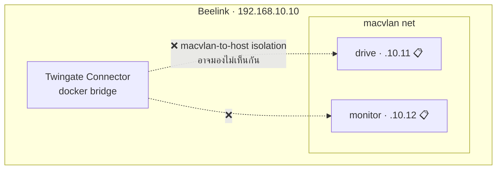

# 🐳 แผน Deploy Docker Production Stack ลง Beelink

> ⚠️ **สถานะ: ⏳ ยังไม่ deploy ลง Beelink** — ห้ามเขียนในเล่มว่าระบบ deploy บน Server แล้ว
> สิ่งที่รันบน Beelink จริง ณ ตอนนี้มีเพียง **Twingate Connector** container เท่านั้น
> กลับไปหน้าศูนย์รวม: [[infrastructure/infrastructure-moc]]

---

## 🧾 ของที่จะ deploy (3 แอปจริง ไม่ใช่ 4)

| Service | หน้าที่ | โน้ตรายละเอียด | สถานะบน Beelink |
| :--- | :--- | :--- | :--- |
| **gateway** (NGINX) | Reverse Proxy + HUB entry ที่ `/` | [[core/hub-aegis-entry]] | ⏳ |
| **drive** (IDEA1) | UI `:5174` / API `:8001` — Secure NAS & Data Lake | [[idea1/idea1-status]] | ⏳ |
| **monitor** (IDEA2) | UI `:5176` / API `:8002` — SOC + CCTV Operator **รวมเป็นตัวเดียว** | [[idea2/idea2-status]] | ⏳ |
| **postgres** | `aegis_drive` + `aegis_monitor` (แยก DB / แยก role) | [[core/security-architecture]] | ⏳ |
| **storage volume** | `drive_storage → /datalake` (mount ให้ `drive` เท่านั้น) | [[concepts/Three_Layer_Data_Lake]] | ⏳ |

> ⚠️ **CCTV Operator ถูกรวมเข้า Monitor แล้ว — ห้ามนับเป็นแอปที่ 4** (ดูข้อ 5 ใน [[90-Status/Document-Conflicts]])
> `IDEA2-AEGIS_CCTV-Operator/detection-engine/` ยังมีอยู่และยังใช้งาน แต่มันคือ **Python process บน Detection Laptop (VLAN 20)** ไม่ใช่ web app และไม่อยู่ใน `docker-compose`

---

## ⚠️ ปัญหาสถาปัตยกรรมที่ต้องตัดสินใจก่อน deploy: Macvlan vs Bridge

**แผนในเล่ม**: ใช้ **Docker Macvlan** ให้ `drive` = `192.168.10.11`, `monitor` = `192.168.10.12` เป็น IP จริงบน VLAN 10

**ปัญหาที่มองเห็นล่วงหน้า**:

* [[infrastructure/remote-access/Twingate-Setup|Twingate Connector]] รันอยู่บน **Docker bridge**
* Linux มีข้อจำกัด **Macvlan-to-Host isolation** — โดยดีฟอลต์ host (และ container บน bridge) **คุยกับ container บน macvlan ไม่ได้** แม้จะอยู่ subnet เดียวกัน
* ⇒ ถ้า deploy ตามเล่มตรง ๆ **Twingate อาจเข้าถึง Drive/Monitor ไม่ได้เลย** ทั้งที่ทุกอย่างดูเหมือนถูกต้อง

### ทางเลือก

| ทางเลือก | วิธีทำ | ข้อดี | ข้อเสีย |
| :--- | :--- | :--- | :--- |
| **ก. Connector → `--network host`** | รัน Twingate ด้วย host networking | เก็บ Macvlan ตามเล่มไว้ได้ | Connector เห็นทุกอย่างบน host = ลด isolation ของตัว Connector เอง |
| **ข. เลิก Macvlan → Bridge + Reverse Proxy** ⭐ | ทุก service อยู่ bridge, เปิดผ่าน `gateway` ตัวเดียว, Twingate ชี้ที่ `192.168.10.10:80/443` | ตรงกับ compose ที่พัฒนามาแล้ว, Resource ใน Twingate เหลือน้อย, จัดการ TLS ที่จุดเดียว | ต้องแก้เล่มเรื่อง IP `.11`/`.12` |
| **ค. Macvlan + สร้าง macvlan shim interface บน host** | เพิ่ม interface พิเศษบน host | เก็บทั้งสองอย่าง | ซับซ้อน ต้องแก้ netplan และอธิบายยากในเล่ม |

> 💡 **ข้อเสนอแนะ**: ทางเลือก **ข** สอดคล้องกับสถาปัตยกรรมที่โค้ดเป็นอยู่จริงมากที่สุด (มี `gateway` NGINX ทำ reverse proxy ให้ `/drive/` และ `/monitor/` อยู่แล้ว ตาม [[core/system-overview]]) — ยังไม่ตัดสินใจ ⏳

---

## 📋 ลำดับงานก่อน deploy

| # | งาน | สถานะ |
| :-- | :--- | :--- |
| 1 | **ตรวจสถานะ UFW จริง** (เคยปิดชั่วคราวตอนทดสอบ routing) แล้วเปิด production rules | ⏳ P1 |
| 2 | ปิดงาน [[infrastructure/server/SSH-Hardening-Status\|SSH Hardening]] | ⏳ P1 |
| 3 | Rotate [[infrastructure/remote-access/Twingate-Setup\|Twingate Connector Token]] | ⏳ P1 |
| 4 | **ตัดสินใจ Macvlan vs Bridge** ตามตารางด้านบน | ⏳ P2 |
| 5 | Audit ว่า repo / Docker image / `.env` secrets เป็นเวอร์ชันล่าสุด | ⏳ P2 |
| 6 | Deploy `gateway` + `drive` + `monitor` + `postgres` + storage volume | ⏳ P2 |
| 7 | ทดสอบ **Persistence / Health Check / Restart / Recovery** | ⏳ P2 |
| 8 | HTTPS/TLS ที่ gateway | ⏳ P3 |

---

## 🔍 หมายเหตุสำคัญเรื่องคำว่า "Deployed"

[[core/system-overview]] บันทึกไว้ว่า (2026-07-28) *"`postgres`, `monitor`, `drive`, `gateway` healthy · `http://localhost/monitor/` HTTP 200"*

⚠️ **นั่นคือผลบนเครื่อง dev ของผู้พัฒนา ไม่ใช่บน Beelink** — ตอนอ่านเล่มหรือรายงานความคืบหน้าต้องแยกสองอย่างนี้ให้ชัด ดูข้อ 7 ใน [[90-Status/Document-Conflicts]]

### Windows checkout: Postgres init scripts must remain LF-only

การทดสอบ local Docker เมื่อ 2026-08-07 พบ `502 Bad Gateway` ที่ `/drive/` แม้ image build สำเร็จ เพราะ `postgres/init/01-run-app-init.sh` ถูก checkout เป็น CRLF บน Windows แล้ว Linux อ่าน shebang เป็น `/bin/sh^M`. Postgres init หยุดหลังสร้าง database เปล่า จึงไม่มี schema และไม่มี roles `drive_app` / `monitor_app`; Drive restart ด้วย `Role "drive_app" does not exist` และ NGINX หา upstream ไม่เจอในท้ายที่สุด

แก้ถาวรด้วย `.gitattributes` (`*.sh text eol=lf`) และ `tests/dockerBootstrap.test.mjs` ซึ่งตรวจทั้งไฟล์จริงและกฎ Git. สำหรับ volume ที่ initialization ล้มไปแล้ว **ไม่ต้องลบ volume** ถ้ายังต้องการเก็บข้อมูล: รัน `01-run-app-init.sh` และ `02-app-roles.sh` ภายใน Postgres container แล้ว restart services. รอบที่ซ่อมนี้ยืนยัน `http://localhost/drive/` = HTTP 200, `/drive/healthz` = `ok:true, db:postgres`, และ `drive`/`monitor`/`gateway`/`postgres` healthy.

> `aegis-camera` ยังเป็นปัญหาแยกต่างหากในรอบเดียวกัน: container หาไฟล์ YOLO `best (2).pt` ไม่พบ จึง restart แต่ไม่ใช่ต้นเหตุของ Drive 502.

---

## 🔗 โน้ตที่เกี่ยวข้อง

* [[infrastructure/infrastructure-moc]]
* [[infrastructure/server/Beelink-Ubuntu-Host]] · [[infrastructure/network/VLAN-IP-Plan]]
* [[infrastructure/remote-access/Twingate-Setup]]
* [[core/system-overview]] · [[core/security-architecture]]
* [[90-Status/Document-Conflicts]] · [[90-Status/Open-Items-Backlog]]
